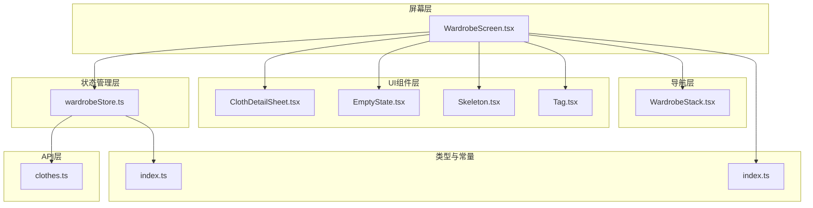
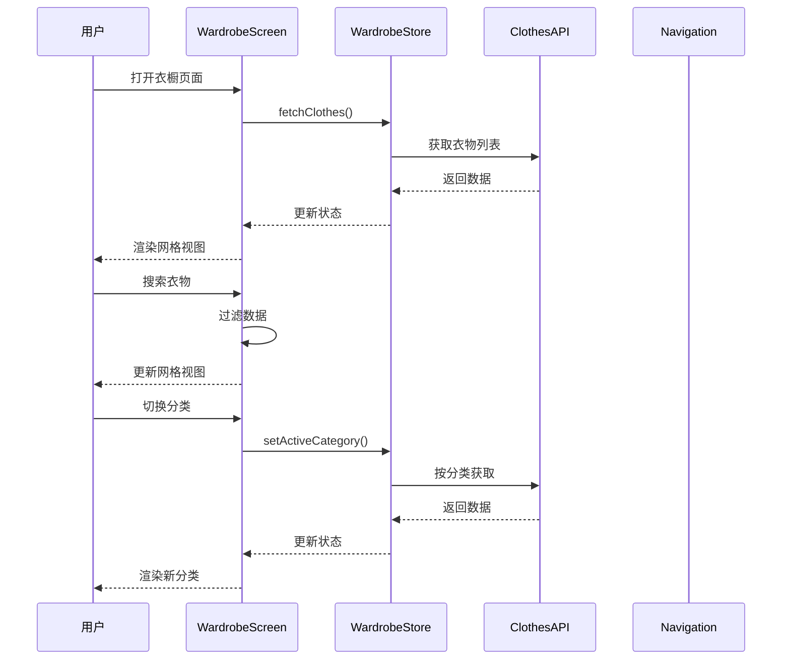
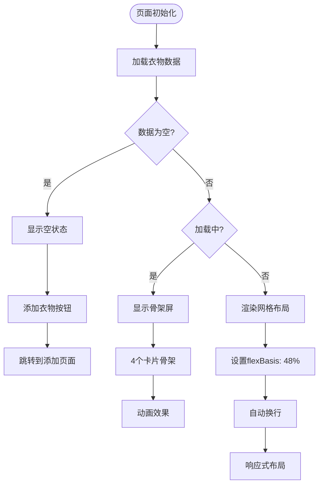
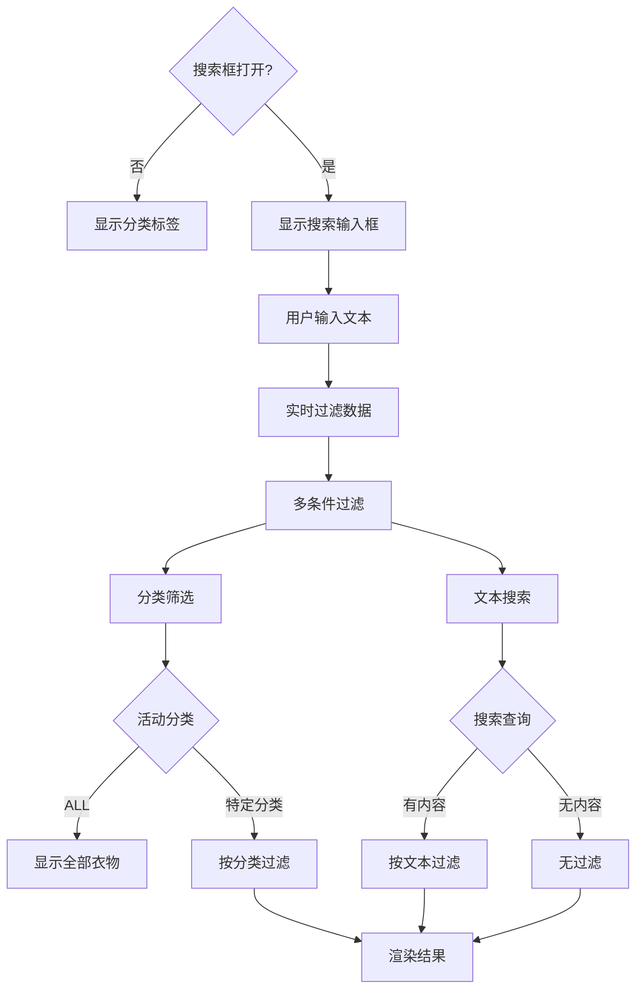
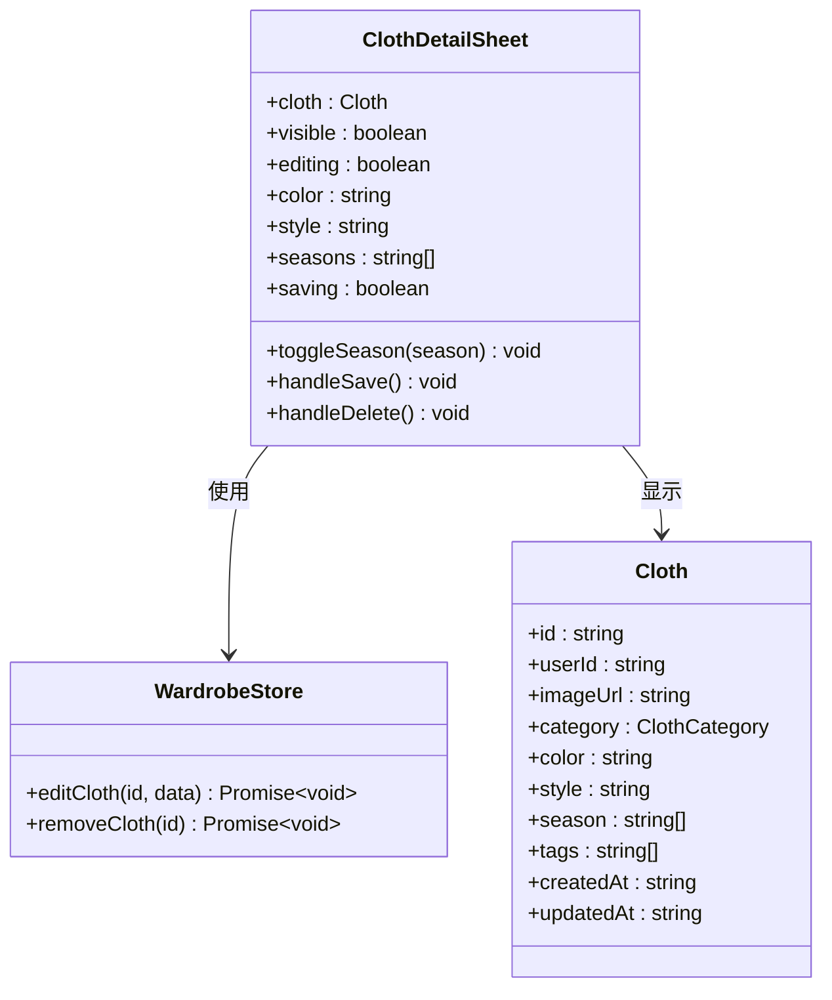
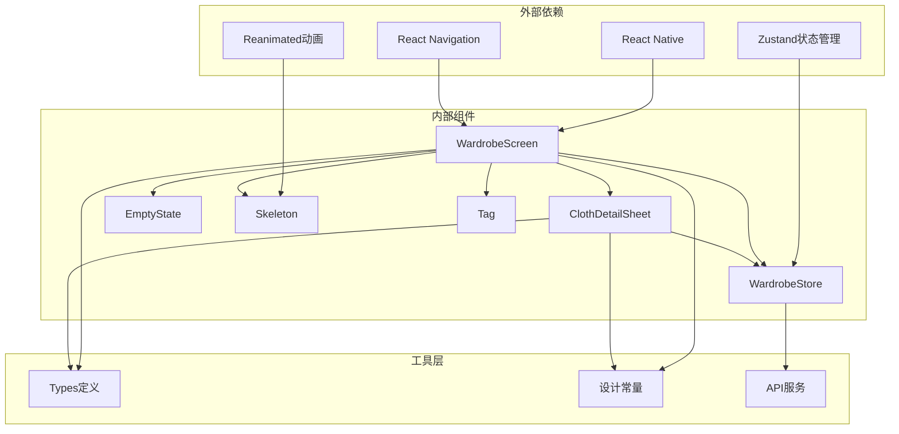

# 衣橱列表页面

<cite>
**本文档引用的文件**
- [WardrobeScreen.tsx](file://FreeDressApp/src/screens/WardrobeScreen.tsx)
- [wardrobeStore.ts](file://FreeDressApp/src/store/wardrobeStore.ts)
- [clothes.ts](file://FreeDressApp/src/api/clothes.ts)
- [ClothDetailSheet.tsx](file://FreeDressApp/src/components/ClothDetailSheet.tsx)
- [WardrobeStack.tsx](file://FreeDressApp/src/navigation/WardrobeStack.tsx)
- [index.ts](file://FreeDressApp/src/types/index.ts)
- [index.ts](file://FreeDressApp/src/constants/index.ts)
- [EmptyState.tsx](file://FreeDressApp/src/components/EmptyState.tsx)
- [Skeleton.tsx](file://FreeDressApp/src/components/Skeleton.tsx)
- [Tag.tsx](file://FreeDressApp/src/components/Tag.tsx)
- [typography.ts](file://FreeDressApp/src/theme/typography.ts)
- [grain.tsx](file://FreeDressApp/src/theme/grain.tsx)
</cite>

## 目录
1. [简介](#简介)
2. [项目结构](#项目结构)
3. [核心组件](#核心组件)
4. [架构概览](#架构概览)
5. [详细组件分析](#详细组件分析)
6. [依赖关系分析](#依赖关系分析)
7. [性能考虑](#性能考虑)
8. [故障排除指南](#故障排除指南)
9. [结论](#结论)

## 简介

衣橱列表页面是畅搭(FreeDress)应用的核心功能模块，为用户提供衣物管理的主界面。该页面实现了完整的衣橱管理功能，包括衣物卡片展示、网格布局、响应式设计、数据获取与渲染、筛选与搜索、用户交互以及性能优化等特性。

## 项目结构

衣橱列表页面采用模块化的React Native架构设计，主要由以下层次组成：

**图表来源**
- [WardrobeScreen.tsx:1-423](file://FreeDressApp/src/screens/WardrobeScreen.tsx#L1-L423)
- [wardrobeStore.ts:1-83](file://FreeDressApp/src/store/wardrobeStore.ts#L1-L83)
- [clothes.ts:1-54](file://FreeDressApp/src/api/clothes.ts#L1-L54)

**章节来源**
- [WardrobeScreen.tsx:1-423](file://FreeDressApp/src/screens/WardrobeScreen.tsx#L1-L423)
- [wardrobeStore.ts:1-83](file://FreeDressApp/src/store/wardrobeStore.ts#L1-L83)

## 核心组件

### WardrobeScreen 主屏幕组件

WardrobeScreen是衣橱列表页面的核心组件，负责协调所有子组件和业务逻辑。该组件实现了完整的UI设计和交互功能。

**主要功能特性：**
- 网格布局的衣物卡片展示
- 分类筛选系统
- 关键词搜索功能
- 下拉刷新机制
- 底部浮动操作按钮
- 衣物详情模态弹窗

### 衣物卡片组件 (ClothCard)

ClothCard是展示单个衣物信息的组件，提供了丰富的视觉反馈和交互能力：

**设计特点：**
- 响应式网格布局，支持2列自适应
- 图片占位符和编号标记
- 分类标签显示
- 季节信息展示
- 长按删除功能

### 状态管理 (Zustand Store)

使用Zustand实现轻量级状态管理，提供以下核心功能：
- 衣物列表数据管理
- 分类状态跟踪
- 加载状态控制
- API数据同步

**章节来源**
- [WardrobeScreen.tsx:40-301](file://FreeDressApp/src/screens/WardrobeScreen.tsx#L40-L301)
- [wardrobeStore.ts:21-82](file://FreeDressApp/src/store/wardrobeStore.ts#L21-L82)

## 架构概览

衣橱列表页面采用清晰的分层架构，确保了代码的可维护性和扩展性：

**图表来源**
- [WardrobeScreen.tsx:56-90](file://FreeDressApp/src/screens/WardrobeScreen.tsx#L56-L90)
- [wardrobeStore.ts:43-53](file://FreeDressApp/src/store/wardrobeStore.ts#L43-L53)
- [clothes.ts:34-37](file://FreeDressApp/src/api/clothes.ts#L34-L37)

## 详细组件分析

### 网格布局与响应式设计

衣橱列表采用了灵活的网格布局系统，支持不同屏幕尺寸的自适应：

**图表来源**
- [WardrobeScreen.tsx:201-235](file://FreeDressApp/src/screens/WardrobeScreen.tsx#L201-L235)
- [WardrobeScreen.tsx:356-369](file://FreeDressApp/src/screens/WardrobeScreen.tsx#L356-L369)

### 数据获取与渲染流程

数据流采用异步处理模式，确保用户体验的流畅性：

**数据获取序列：**
1. 组件挂载时触发数据加载
2. 设置加载状态为true
3. 调用API获取数据
4. 更新store中的数据状态
5. 设置加载状态为false

**渲染优化：**
- 使用useMemo进行数据过滤优化
- 骨架屏提供加载反馈
- 空状态处理提升用户体验

### 筛选与搜索功能

系统提供了多层次的筛选和搜索功能：

**图表来源**
- [WardrobeScreen.tsx:61-76](file://FreeDressApp/src/screens/WardrobeScreen.tsx#L61-L76)
- [WardrobeScreen.tsx:78-85](file://FreeDressApp/src/screens/WardrobeScreen.tsx#L78-L85)

### 用户交互设计

页面实现了丰富的用户交互模式：

**主要交互功能：**
- **点击查看详情**：通过ClothDetailSheet组件实现
- **长按批量操作**：支持衣物删除确认
- **滑动删除**：虽然当前实现为长按删除，但架构支持滑动手势
- **分类切换**：动态更新显示内容
- **搜索交互**：展开/收起搜索框

**交互状态管理：**
- 使用useState管理本地状态
- useCallback优化函数引用
- useMemo避免不必要的重渲染

### 衣物详情模态弹窗

ClothDetailSheet提供了完整的衣物详情和编辑功能：

**图表来源**
- [ClothDetailSheet.tsx:29-86](file://FreeDressApp/src/components/ClothDetailSheet.tsx#L29-L86)
- [wardrobeStore.ts:30-32](file://FreeDressApp/src/store/wardrobeStore.ts#L30-L32)

**章节来源**
- [WardrobeScreen.tsx:252-256](file://FreeDressApp/src/screens/WardrobeScreen.tsx#L252-L256)
- [ClothDetailSheet.tsx:1-353](file://FreeDressApp/src/components/ClothDetailSheet.tsx#L1-L353)

## 依赖关系分析

### 组件依赖图

**图表来源**
- [WardrobeScreen.tsx:15-29](file://FreeDressApp/src/screens/WardrobeScreen.tsx#L15-L29)
- [wardrobeStore.ts:1-11](file://FreeDressApp/src/store/wardrobeStore.ts#L1-L11)

### 数据流依赖

页面的数据流遵循单向数据绑定原则：

**数据流向：**
1. API层提供原始数据
2. Store层进行数据转换和状态管理
3. Screen层负责UI渲染
4. 用户交互触发状态更新
5. 状态变化驱动重新渲染

**错误处理依赖：**
- 组件级别的错误捕获
- API层的异常处理
- 用户友好的错误提示

**章节来源**
- [index.ts:18-33](file://FreeDressApp/src/types/index.ts#L18-L33)
- [index.ts:15-52](file://FreeDressApp/src/constants/index.ts#L15-L52)

## 性能考虑

### 虚拟化优化

虽然当前实现使用ScrollView而非FlatList，但架构设计已为虚拟化做好准备：

**现有优化措施：**
- 使用useMemo避免重复计算
- useCallback优化回调函数
- 条件渲染减少DOM节点
- 骨架屏提升感知性能

**FlatList迁移建议：**
- 将ScrollView替换为FlatList
- 实现getItemLayout计算高度
- 添加keyExtractor唯一标识
- 配置removeClippedSubviews优化

### 图片懒加载策略

**当前实现：**
- Image组件支持原生懒加载
- 缺省图标作为占位符
- 骨架屏提供加载反馈

**优化建议：**
- 实现Intersection Observer监听
- 添加图片缓存机制
- 支持WebP格式提高加载速度
- 实现渐进式图片加载

### 内存管理

**内存优化实践：**
- 组件卸载时清理定时器
- 使用React.memo避免不必要渲染
- 合理使用useCallback和useMemo
- 及时释放大对象引用

**状态管理优化：**
- Zustand提供轻量级状态管理
- 避免状态污染和循环引用
- 实现状态持久化策略

### 用户体验优化

**加载优化：**
- 骨架屏提供即时反馈
- 空状态友好提示
- 下拉刷新提供手动更新
- 分页加载支持大数据集

**交互优化：**
- 长按删除确认机制
- 实时搜索过滤
- 分类标签高亮显示
- 浮动操作按钮便捷访问

## 故障排除指南

### 常见问题诊断

**数据加载失败：**
- 检查网络连接状态
- 验证API端点可用性
- 查看控制台错误日志
- 实现重试机制

**渲染性能问题：**
- 使用React DevTools分析组件树
- 检查不必要的重渲染
- 优化复杂计算逻辑
- 实现组件拆分

**状态同步问题：**
- 确认Zustand store正确初始化
- 检查异步操作的错误处理
- 验证状态更新的原子性
- 实现状态回滚机制

### 调试技巧

**开发工具使用：**
- React Native Debugger监控状态变化
- Flipper调试网络请求
- Chrome DevTools分析性能瓶颈
- Metro Bundler查看打包信息

**日志记录：**
- 实现统一的日志系统
- 记录关键操作的时间戳
- 捕获异常堆栈信息
- 收集用户行为数据

**章节来源**
- [WardrobeScreen.tsx:92-107](file://FreeDressApp/src/screens/WardrobeScreen.tsx#L92-L107)
- [wardrobeStore.ts:48-52](file://FreeDressApp/src/store/wardrobeStore.ts#L48-L52)

## 结论

衣橱列表页面展现了现代React Native应用的最佳实践，通过清晰的架构设计、完善的组件体系和优秀的用户体验，为用户提供了流畅的衣物管理体验。

**核心优势：**
- 模块化架构便于维护和扩展
- 完善的状态管理和数据流
- 丰富的用户交互和反馈机制
- 良好的性能优化和用户体验

**未来改进方向：**
- 迁移到FlatList实现真正的虚拟化
- 添加上拉加载更多功能
- 实现更复杂的筛选和排序选项
- 优化图片加载和缓存策略
- 增强离线数据同步能力

该页面为畅搭应用奠定了坚实的基础，通过持续的优化和迭代，能够为用户带来更加出色的使用体验。