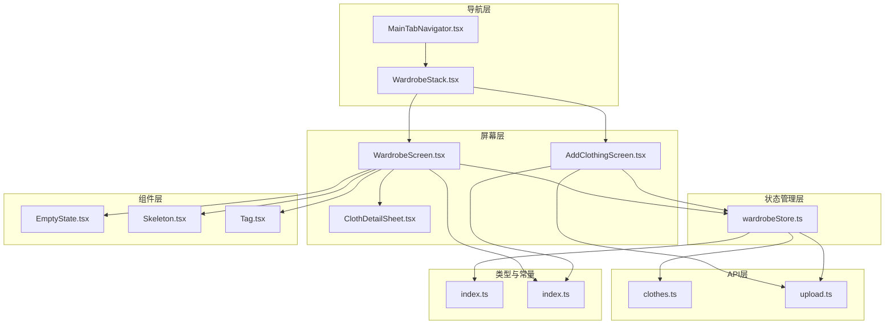
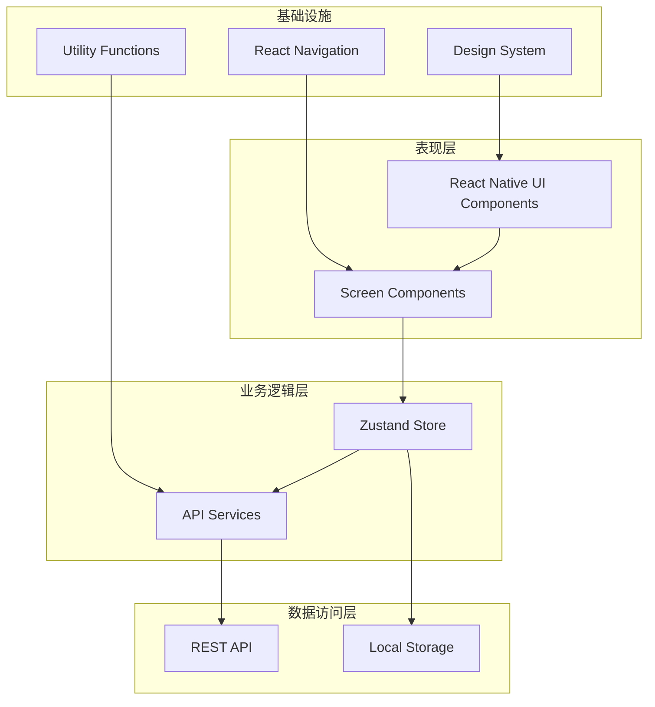
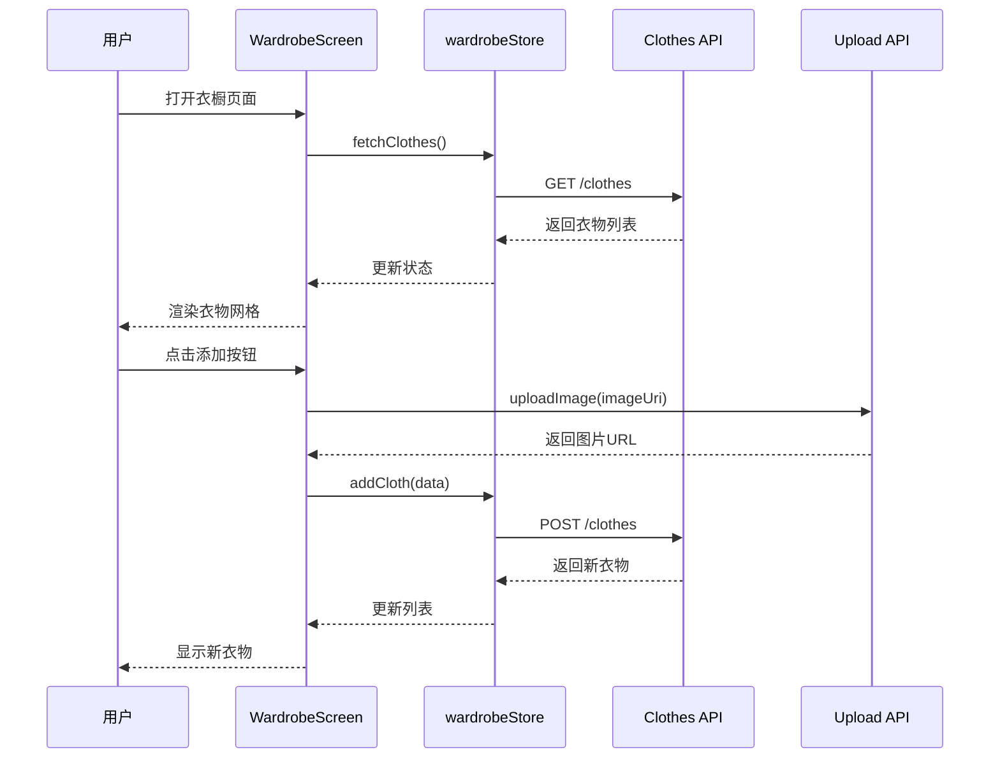
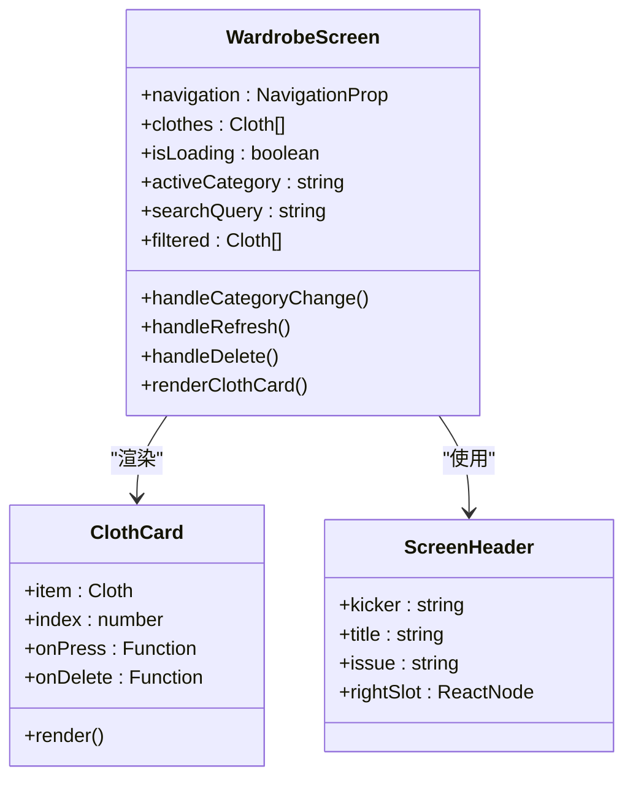
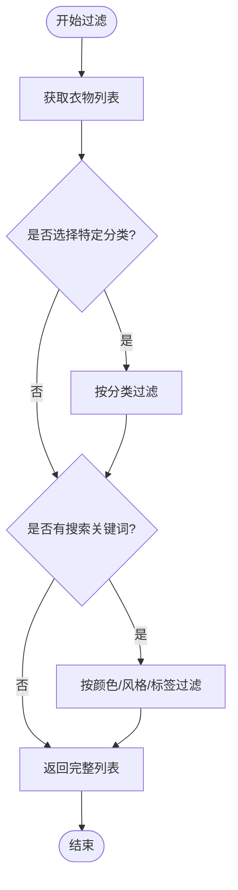
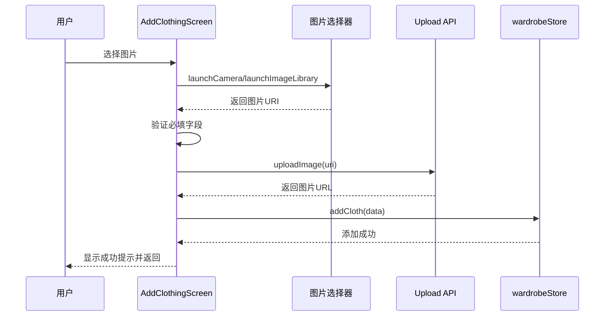
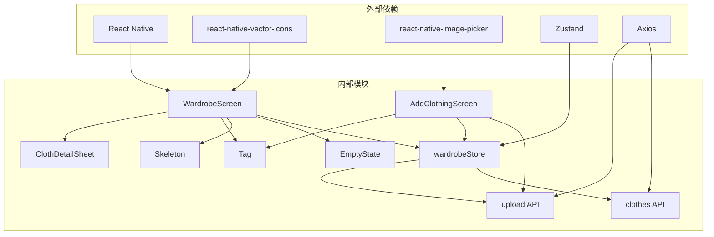
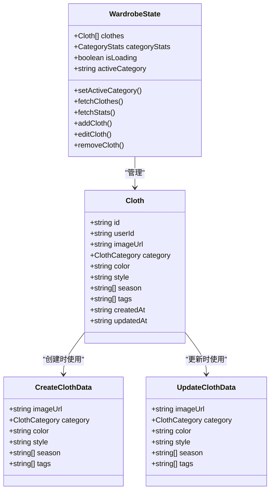

# 衣橱页面

<cite>
**本文档引用的文件**
- [WardrobeScreen.tsx](file://FreeDressApp/src/screens/WardrobeScreen.tsx)
- [AddClothingScreen.tsx](file://FreeDressApp/src/screens/AddClothingScreen.tsx)
- [wardrobeStore.ts](file://FreeDressApp/src/store/wardrobeStore.ts)
- [WardrobeStack.tsx](file://FreeDressApp/src/navigation/WardrobeStack.tsx)
- [ClothDetailSheet.tsx](file://FreeDressApp/src/components/ClothDetailSheet.tsx)
- [clothes.ts](file://FreeDressApp/src/api/clothes.ts)
- [upload.ts](file://FreeDressApp/src/api/upload.ts)
- [index.ts](file://FreeDressApp/src/types/index.ts)
- [index.ts](file://FreeDressApp/src/constants/index.ts)
- [EmptyState.tsx](file://FreeDressApp/src/components/EmptyState.tsx)
- [Skeleton.tsx](file://FreeDressApp/src/components/Skeleton.tsx)
- [Tag.tsx](file://FreeDressApp/src/components/Tag.tsx)
- [MainTabNavigator.tsx](file://FreeDressApp/src/navigation/MainTabNavigator.tsx)
</cite>

## 目录
1. [简介](#简介)
2. [项目结构](#项目结构)
3. [核心组件](#核心组件)
4. [架构概览](#架构概览)
5. [详细组件分析](#详细组件分析)
6. [依赖关系分析](#依赖关系分析)
7. [性能考虑](#性能考虑)
8. [故障排除指南](#故障排除指南)
9. [结论](#结论)
10. [附录](#附录)

## 简介
本文件为畅搭(FreeDress)应用的衣橱页面组创建综合文档，重点介绍WardrobeScreen和AddClothingScreen两个核心页面的设计与实现。文档涵盖衣橱管理功能（衣物列表展示、分类筛选、搜索功能、批量操作）、添加衣物流程（图片上传、分类选择、属性设置、信息录入）、数据管理策略（本地缓存、状态同步、离线支持）、用户交互设计（长按操作、滑动删除、拖拽排序）、性能优化方案（图片压缩、虚拟列表、懒加载）以及用户体验优化建议（空状态处理、加载指示、错误恢复）。

## 项目结构
衣橱页面组位于FreeDressApp/src/screens目录下，采用React Native + TypeScript开发，配合Zustand状态管理和自定义组件库构建。

**图表来源**
- [WardrobeScreen.tsx:1-423](file://FreeDressApp/src/screens/WardrobeScreen.tsx#L1-L423)
- [AddClothingScreen.tsx:1-253](file://FreeDressApp/src/screens/AddClothingScreen.tsx#L1-L253)
- [wardrobeStore.ts:1-83](file://FreeDressApp/src/store/wardrobeStore.ts#L1-L83)
- [WardrobeStack.tsx:1-21](file://FreeDressApp/src/navigation/WardrobeStack.tsx#L1-L21)
- [MainTabNavigator.tsx:1-38](file://FreeDressApp/src/navigation/MainTabNavigator.tsx#L1-L38)

**章节来源**
- [WardrobeScreen.tsx:1-423](file://FreeDressApp/src/screens/WardrobeScreen.tsx#L1-L423)
- [AddClothingScreen.tsx:1-253](file://FreeDressApp/src/screens/AddClothingScreen.tsx#L1-L253)
- [wardrobeStore.ts:1-83](file://FreeDressApp/src/store/wardrobeStore.ts#L1-L83)
- [WardrobeStack.tsx:1-21](file://FreeDressApp/src/navigation/WardrobeStack.tsx#L1-L21)
- [MainTabNavigator.tsx:1-38](file://FreeDressApp/src/navigation/MainTabNavigator.tsx#L1-L38)

## 核心组件
本节深入分析衣橱页面组的核心组件，包括WardrobeScreen、AddClothingScreen、wardrobeStore以及相关组件。

### WardrobeScreen - 衣橱主界面
WardrobeScreen是衣橱功能的主要入口，负责展示用户的所有衣物，并提供分类筛选、搜索、刷新等核心功能。

#### 主要功能特性
- **分类筛选系统**：支持全部、上衣、下装、外套、配饰、鞋子六种分类
- **实时搜索**：支持按颜色、风格、标签进行多维度搜索
- **网格布局**：采用响应式网格展示衣物卡片
- **空状态处理**：当无衣物时显示友好的引导界面
- **骨架屏加载**：在数据加载时提供流畅的视觉反馈

#### 关键实现要点
- 使用useMemo进行过滤逻辑的性能优化
- 通过useWardrobeStore管理全局状态
- 支持长按删除和点击查看详情
- 集成下拉刷新功能

**章节来源**
- [WardrobeScreen.tsx:40-259](file://FreeDressApp/src/screens/WardrobeScreen.tsx#L40-L259)
- [wardrobeStore.ts:21-82](file://FreeDressApp/src/store/wardrobeStore.ts#L21-L82)

### AddClothingScreen - 添加衣物界面
AddClothingScreen提供完整的衣物添加流程，从图片选择到属性设置，再到最终提交。

#### 添加流程设计
1. **图片选择**：支持相机拍摄和相册选择
2. **分类选择**：通过胶囊标签选择衣物类型
3. **属性设置**：颜色、风格、季节、标签等可选属性
4. **信息录入**：用户输入衣物相关信息
5. **提交处理**：图片上传后创建衣物记录

#### 技术实现特点
- 使用react-native-image-picker进行图片选择
- 实现了完整的表单验证和错误处理
- 支持多标签输入（逗号分隔）
- 集成上传进度指示

**章节来源**
- [AddClothingScreen.tsx:29-209](file://FreeDressApp/src/screens/AddClothingScreen.tsx#L29-L209)
- [upload.ts:1-21](file://FreeDressApp/src/api/upload.ts#L1-L21)

### wardrobeStore - 状态管理
wardrobeStore基于Zustand实现，集中管理衣橱相关的所有状态和业务逻辑。

#### 状态结构
- **clothes**: 衣物列表数组
- **categoryStats**: 各分类统计信息
- **isLoading**: 加载状态标志
- **activeCategory**: 当前激活的分类

#### 核心方法
- **fetchClothes**: 获取衣物列表
- **addCloth**: 创建新衣物
- **editCloth**: 更新衣物信息
- **removeCloth**: 删除衣物
- **fetchStats**: 获取分类统计

**章节来源**
- [wardrobeStore.ts:35-82](file://FreeDressApp/src/store/wardrobeStore.ts#L35-L82)

## 架构概览
衣橱页面组采用清晰的分层架构，确保代码的可维护性和扩展性。

**图表来源**
- [WardrobeScreen.tsx:1-423](file://FreeDressApp/src/screens/WardrobeScreen.tsx#L1-L423)
- [wardrobeStore.ts:1-83](file://FreeDressApp/src/store/wardrobeStore.ts#L1-L83)
- [clothes.ts:1-54](file://FreeDressApp/src/api/clothes.ts#L1-L54)

### 数据流图

**图表来源**
- [WardrobeScreen.tsx:56-59](file://FreeDressApp/src/screens/WardrobeScreen.tsx#L56-L59)
- [AddClothingScreen.tsx:61-87](file://FreeDressApp/src/screens/AddClothingScreen.tsx#L61-L87)
- [wardrobeStore.ts:64-68](file://FreeDressApp/src/store/wardrobeStore.ts#L64-L68)

## 详细组件分析

### WardrobeScreen 详细分析

#### 布局与样式系统
WardrobeScreen采用灵活的响应式布局设计，使用4px间距网格系统确保视觉一致性。

**图表来源**
- [WardrobeScreen.tsx:40-301](file://FreeDressApp/src/screens/WardrobeScreen.tsx#L40-L301)

#### 过滤与搜索算法
WardrobeScreen实现了高效的过滤机制，支持多条件组合搜索。

**图表来源**
- [WardrobeScreen.tsx:61-76](file://FreeDressApp/src/screens/WardrobeScreen.tsx#L61-L76)

#### 用户交互设计
- **长按删除**：在衣物卡片上长按触发删除确认
- **点击查看详情**：轻触打开衣物详情面板
- **下拉刷新**：支持手动刷新数据
- **搜索展开**：点击搜索图标展开搜索栏

**章节来源**
- [WardrobeScreen.tsx:261-301](file://FreeDressApp/src/screens/WardrobeScreen.tsx#L261-L301)
- [WardrobeScreen.tsx:92-107](file://FreeDressApp/src/screens/WardrobeScreen.tsx#L92-L107)

### AddClothingScreen 详细分析

#### 图片上传流程
AddClothingScreen实现了完整的图片上传工作流，确保用户体验的流畅性。

**图表来源**
- [AddClothingScreen.tsx:47-87](file://FreeDressApp/src/screens/AddClothingScreen.tsx#L47-L87)
- [upload.ts:4-20](file://FreeDressApp/src/api/upload.ts#L4-L20)

#### 属性设置系统
系统提供了丰富的属性设置选项，支持用户精细化管理衣物信息。

| 属性类别 | 选项数量 | 输入方式 | 验证规则 |
|---------|---------|---------|---------|
| 分类 | 5种 | 胶囊标签 | 必填 |
| 颜色 | 自定义 | 文本输入 | 可选 |
| 风格 | 10种 | 多选标签 | 可选 |
| 季节 | 4种 | 多选标签 | 可选 |
| 标签 | 自定义 | 文本输入 | 可选 |

**章节来源**
- [AddClothingScreen.tsx:124-193](file://FreeDressApp/src/screens/AddClothingScreen.tsx#L124-L193)
- [index.ts:176-198](file://FreeDressApp/src/constants/index.ts#L176-L198)

### ClothDetailSheet 详细分析
ClothDetailSheet是一个模态详情面板，提供衣物的查看和编辑功能。

#### 编辑模式设计
- **非编辑模式**：显示衣物基本信息和操作按钮
- **编辑模式**：切换到表单界面，允许修改颜色、风格、季节
- **删除确认**：提供安全的删除保护机制

#### 交互特性
- **滑动关闭**：支持从底部向上滑动关闭
- **键盘适配**：在iOS平台上自动调整视图高度
- **状态同步**：编辑完成后自动更新主界面显示

**章节来源**
- [ClothDetailSheet.tsx:29-244](file://FreeDressApp/src/components/ClothDetailSheet.tsx#L29-L244)
- [wardrobeStore.ts:70-75](file://FreeDressApp/src/store/wardrobeStore.ts#L70-L75)

## 依赖关系分析

### 组件依赖图

**图表来源**
- [WardrobeScreen.tsx:13-28](file://FreeDressApp/src/screens/WardrobeScreen.tsx#L13-L28)
- [AddClothingScreen.tsx:12-27](file://FreeDressApp/src/screens/AddClothingScreen.tsx#L12-L27)
- [wardrobeStore.ts:1-11](file://FreeDressApp/src/store/wardrobeStore.ts#L1-L11)

### 类型系统分析
系统采用强类型设计，确保代码的健壮性和可维护性。

**图表来源**
- [index.ts:21-33](file://FreeDressApp/src/types/index.ts#L21-L33)
- [index.ts:12-28](file://FreeDressApp/src/api/clothes.ts#L12-L28)
- [wardrobeStore.ts:21-33](file://FreeDressApp/src/store/wardrobeStore.ts#L21-L33)

**章节来源**
- [index.ts:18-33](file://FreeDressApp/src/types/index.ts#L18-L33)
- [index.ts:12-28](file://FreeDressApp/src/api/clothes.ts#L12-L28)
- [wardrobeStore.ts:21-33](file://FreeDressApp/src/store/wardrobeStore.ts#L21-L33)

## 性能考虑

### 图片处理优化
系统在图片处理方面采用了多项优化策略：

1. **图片质量控制**：在图片选择时设置质量参数为0.8，平衡质量和体积
2. **懒加载机制**：使用骨架屏替代直接加载，提升感知性能
3. **缓存策略**：利用React Native的Image组件内置缓存机制

### 列表渲染优化
- **虚拟滚动**：虽然当前使用ScrollView，但网格布局支持响应式特性
- **记忆化计算**：使用useMemo避免不必要的过滤计算
- **条件渲染**：根据状态动态渲染不同UI元素

### 网络请求优化
- **并发请求**：初始化时同时获取衣物列表和统计数据
- **错误处理**：完善的异常捕获和用户提示机制
- **状态管理**：统一的loading状态管理

**章节来源**
- [AddClothingScreen.tsx:47-59](file://FreeDressApp/src/screens/AddClothingScreen.tsx#L47-L59)
- [WardrobeScreen.tsx:61-76](file://FreeDressApp/src/screens/WardrobeScreen.tsx#L61-L76)
- [wardrobeStore.ts:43-52](file://FreeDressApp/src/store/wardrobeStore.ts#L43-L52)

## 故障排除指南

### 常见问题及解决方案

#### 图片上传失败
**问题描述**：添加衣物时图片上传失败
**可能原因**：
- 网络连接不稳定
- 图片格式不支持
- 服务器端存储配置问题

**解决步骤**：
1. 检查网络连接状态
2. 尝试重新选择图片
3. 确认图片格式为常见格式（jpg、png等）

#### 数据加载异常
**问题描述**：衣橱页面无法加载数据
**可能原因**：
- API接口不可用
- 认证令牌过期
- 网络权限问题

**解决步骤**：
1. 检查API服务状态
2. 重新登录应用
3. 检查网络权限设置

#### 删除操作失败
**问题描述**：删除衣物时出现错误
**解决步骤**：
1. 确认网络连接正常
2. 重新尝试删除操作
3. 检查服务器响应状态

**章节来源**
- [AddClothingScreen.tsx:82-86](file://FreeDressApp/src/screens/AddClothingScreen.tsx#L82-L86)
- [WardrobeScreen.tsx:99-104](file://FreeDressApp/src/screens/WardrobeScreen.tsx#L99-L104)
- [wardrobeStore.ts:77-81](file://FreeDressApp/src/store/wardrobeStore.ts#L77-L81)

### 开发调试建议
- 使用React DevTools检查组件状态
- 在Redux DevTools中监控状态变化
- 利用console.log跟踪异步操作流程
- 使用网络面板检查API请求响应

## 结论
衣橱页面组展现了现代移动应用开发的最佳实践，通过清晰的分层架构、强类型设计和优秀的用户体验设计，为用户提供了完整的衣橱管理解决方案。系统在性能优化、错误处理和可扩展性方面都表现出色，为后续的功能扩展奠定了坚实基础。

主要优势包括：
- **模块化设计**：各组件职责明确，便于维护和测试
- **状态管理**：Zustand提供了简洁高效的状态管理方案
- **用户体验**：丰富的交互设计和反馈机制
- **性能优化**：多层面的性能优化策略
- **错误处理**：完善的异常处理和用户提示

## 附录

### API接口规范
系统通过RESTful API与后端服务通信，支持标准的CRUD操作。

| 接口 | 方法 | 路径 | 功能 |
|------|------|------|------|
| 获取衣物列表 | GET | /clothes | 获取用户衣物列表 |
| 创建衣物 | POST | /clothes | 创建新的衣物记录 |
| 获取单个衣物 | GET | /clothes/:id | 获取指定衣物详情 |
| 更新衣物 | PUT | /clothes/:id | 更新衣物信息 |
| 删除衣物 | DELETE | /clothes/:id | 删除衣物记录 |
| 分类统计 | GET | /clothes/stats/categories | 获取分类统计信息 |
| 图片上传 | POST | /upload/image | 上传图片文件 |

### 设计系统
系统采用Editorial Couture设计理念，使用暖灰棕单色调系，营造优雅的视觉体验。

**色彩系统**：
- 主色调：#1F1B16（深墨色）
- 强调色：#A86B3D（烧赭色）
- 背景色：#EBE4D6（米色）
- 卡片色：#F6F1E6（奶油色）

**间距系统**：采用4px为基础单位的网格系统，确保视觉一致性。

**章节来源**
- [index.ts:15-52](file://FreeDressApp/src/constants/index.ts#L15-L52)
- [index.ts:100-115](file://FreeDressApp/src/constants/index.ts#L100-L115)
- [clothes.ts:30-53](file://FreeDressApp/src/api/clothes.ts#L30-L53)