# 衣物编辑界面

<cite>
**本文档引用的文件**
- [EditClothingScreen.tsx](file://FreeDressApp/src/screens/EditClothingScreen.tsx)
- [ClothDetailSheet.tsx](file://FreeDressApp/src/components/ClothDetailSheet.tsx)
- [wardrobeStore.ts](file://FreeDressApp/src/store/wardrobeStore.ts)
- [clothes.ts](file://FreeDressApp/src/api/clothes.ts)
- [upload.ts](file://FreeDressApp/src/api/upload.ts)
- [index.ts](file://FreeDressApp/src/types/index.ts)
- [index.ts](file://FreeDressApp/src/constants/index.ts)
- [Tag.tsx](file://FreeDressApp/src/components/Tag.tsx)
- [Input.tsx](file://FreeDressApp/src/components/Input.tsx)
- [Button.tsx](file://FreeDressApp/src/components/Button.tsx)
- [IconButton.tsx](file://FreeDressApp/src/components/IconButton.tsx)
- [ScreenHeader.tsx](file://FreeDressApp/src/components/ScreenHeader.tsx)
- [WardrobeScreen.tsx](file://FreeDressApp/src/screens/WardrobeScreen.tsx)
- [RootNavigator.tsx](file://FreeDressApp/src/navigation/RootNavigator.tsx)
- [MainTabNavigator.tsx](file://FreeDressApp/src/navigation/MainTabNavigator.tsx)
</cite>

## 目录
1. [简介](#简介)
2. [项目结构](#项目结构)
3. [核心组件](#核心组件)
4. [架构概览](#架构概览)
5. [详细组件分析](#详细组件分析)
6. [依赖关系分析](#依赖关系分析)
7. [性能考虑](#性能考虑)
8. [故障排除指南](#故障排除指南)
9. [结论](#结论)

## 简介

衣物编辑界面是 FreeDressApp 移动应用中的核心功能模块，允许用户编辑和管理个人衣橱中的衣物信息。该界面提供了直观的用户交互体验，支持图片上传、分类选择、属性编辑等功能，是整个衣橱管理系统的重要组成部分。

## 项目结构

FreeDressApp 采用现代化的 React Native 架构，按照功能模块进行组织：

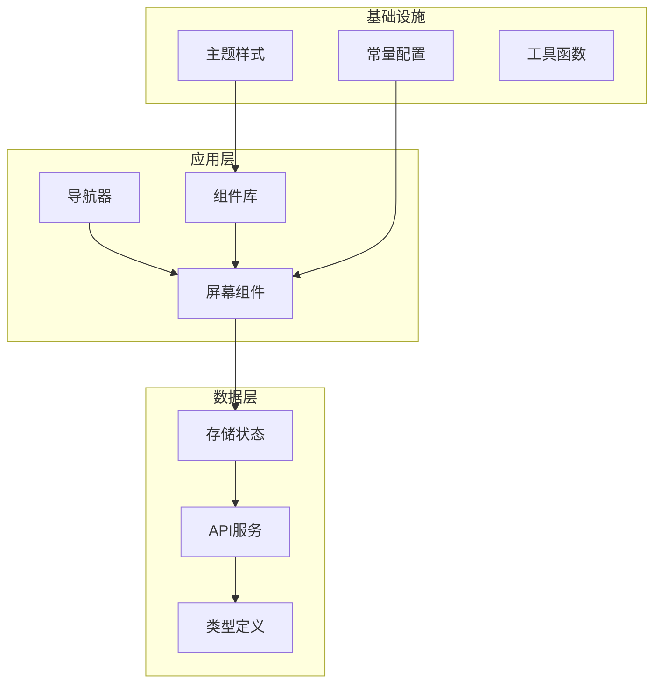

**图表来源**
- [EditClothingScreen.tsx:1-300](file://FreeDressApp/src/screens/EditClothingScreen.tsx#L1-L300)
- [RootNavigator.tsx:1-103](file://FreeDressApp/src/navigation/RootNavigator.tsx#L1-L103)

**章节来源**
- [EditClothingScreen.tsx:1-300](file://FreeDressApp/src/screens/EditClothingScreen.tsx#L1-L300)
- [WardrobeScreen.tsx:1-423](file://FreeDressApp/src/screens/WardrobeScreen.tsx#L1-L423)

## 核心组件

衣物编辑界面由多个精心设计的组件构成，每个组件都有明确的职责和功能：

### 主要组件架构

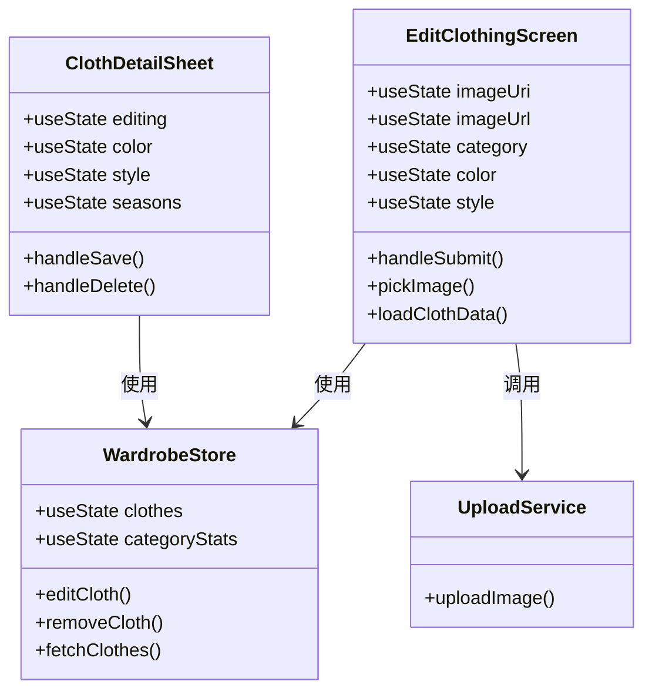

**图表来源**
- [EditClothingScreen.tsx:29-256](file://FreeDressApp/src/screens/EditClothingScreen.tsx#L29-L256)
- [ClothDetailSheet.tsx:29-86](file://FreeDressApp/src/components/ClothDetailSheet.tsx#L29-L86)
- [wardrobeStore.ts:35-82](file://FreeDressApp/src/store/wardrobeStore.ts#L35-L82)

### 数据流架构

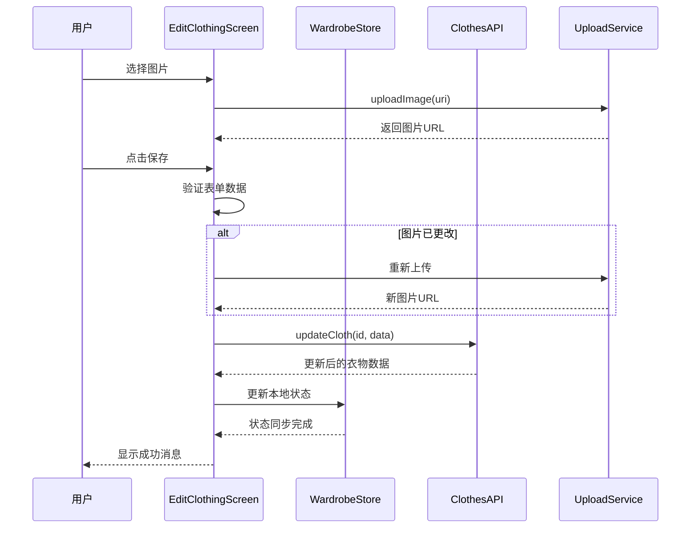

**图表来源**
- [EditClothingScreen.tsx:88-118](file://FreeDressApp/src/screens/EditClothingScreen.tsx#L88-L118)
- [wardrobeStore.ts:70-75](file://FreeDressApp/src/store/wardrobeStore.ts#L70-L75)
- [upload.ts:4-20](file://FreeDressApp/src/api/upload.ts#L4-L20)

**章节来源**
- [EditClothingScreen.tsx:29-256](file://FreeDressApp/src/screens/EditClothingScreen.tsx#L29-L256)
- [wardrobeStore.ts:35-82](file://FreeDressApp/src/store/wardrobeStore.ts#L35-L82)

## 架构概览

衣物编辑界面采用了清晰的分层架构，确保了代码的可维护性和扩展性：

### 整体架构设计

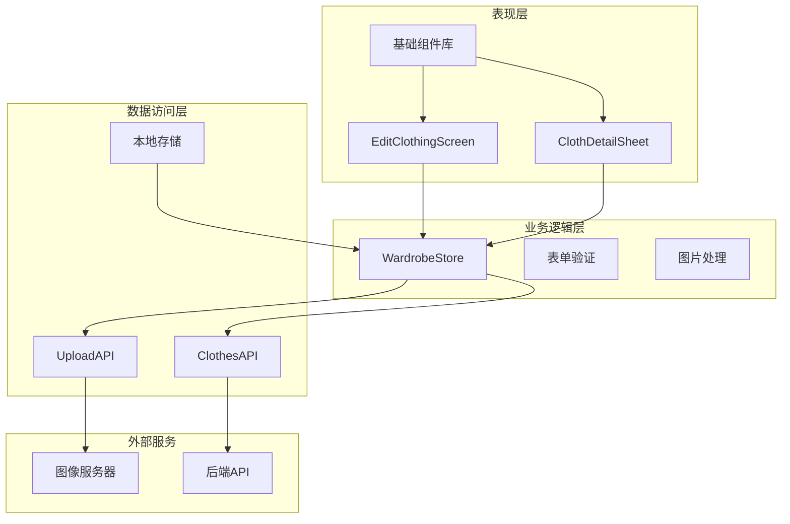

**图表来源**
- [EditClothingScreen.tsx:14-27](file://FreeDressApp/src/screens/EditClothingScreen.tsx#L14-L27)
- [RootNavigator.tsx:27-92](file://FreeDressApp/src/navigation/RootNavigator.tsx#L27-L92)

### 状态管理模式

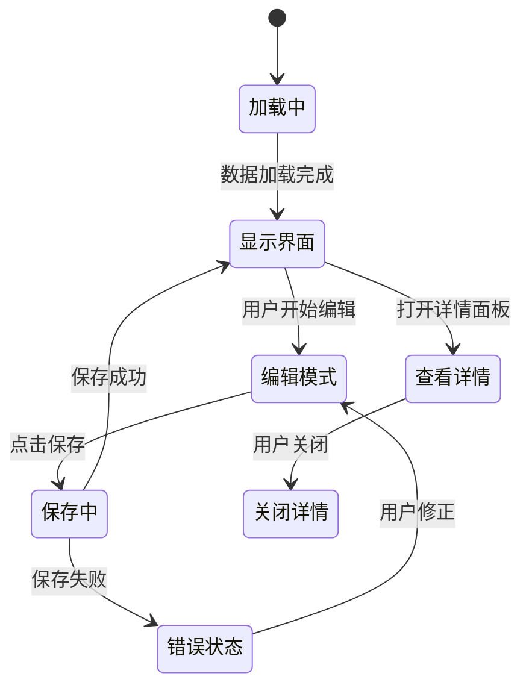

**图表来源**
- [EditClothingScreen.tsx:45-65](file://FreeDressApp/src/screens/EditClothingScreen.tsx#L45-L65)
- [wardrobeStore.ts:70-75](file://FreeDressApp/src/store/wardrobeStore.ts#L70-L75)

**章节来源**
- [RootNavigator.tsx:27-92](file://FreeDressApp/src/navigation/RootNavigator.tsx#L27-L92)
- [MainTabNavigator.tsx:1-38](file://FreeDressApp/src/navigation/MainTabNavigator.tsx#L1-L38)

## 详细组件分析

### EditClothingScreen 组件

EditClothingScreen 是衣物编辑界面的核心组件，提供了完整的编辑功能：

#### 组件特性

| 特性 | 描述 | 实现方式 |
|------|------|----------|
| 图片选择 | 支持拍照和相册选择 | react-native-image-picker |
| 表单验证 | 必填字段检查 | 前端验证逻辑 |
| 图片上传 | 新图片自动上传 | 自定义上传服务 |
| 实时预览 | 更换图片即时预览 | 状态管理 |
| 分类选择 | 五种衣物分类 | Tag 组件 |
| 属性编辑 | 颜色、风格、季节 | Input 和 Tag 组件 |

#### 表单字段设计

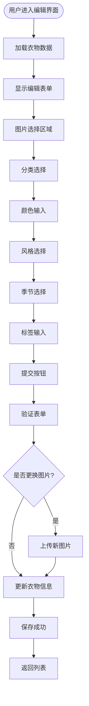

**图表来源**
- [EditClothingScreen.tsx:88-118](file://FreeDressApp/src/screens/EditClothingScreen.tsx#L88-L118)
- [EditClothingScreen.tsx:171-240](file://FreeDressApp/src/screens/EditClothingScreen.tsx#L171-L240)

#### 图片处理流程

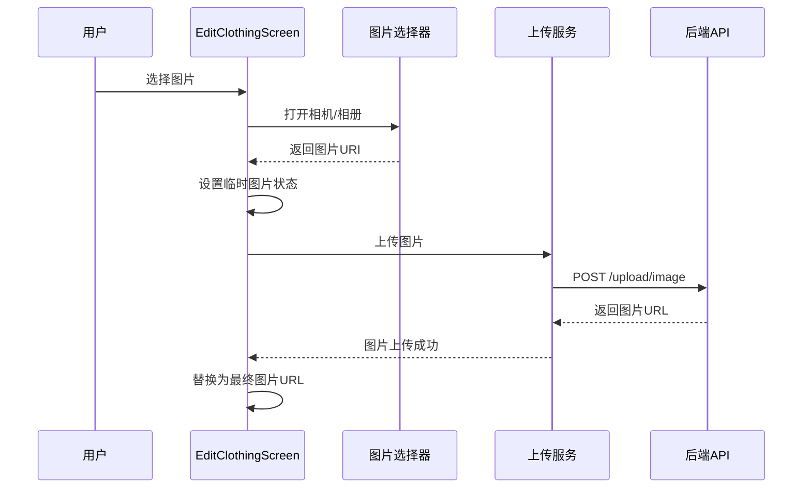

**图表来源**
- [EditClothingScreen.tsx:73-86](file://FreeDressApp/src/screens/EditClothingScreen.tsx#L73-L86)
- [upload.ts:4-20](file://FreeDressApp/src/api/upload.ts#L4-L20)

**章节来源**
- [EditClothingScreen.tsx:29-256](file://FreeDressApp/src/screens/EditClothingScreen.tsx#L29-L256)

### ClothDetailSheet 组件

ClothDetailSheet 提供了衣物详情查看和快速编辑功能：

#### 组件功能

| 功能 | 描述 | 用户体验 |
|------|------|----------|
| 详情展示 | 显示完整衣物信息 | 无需离开当前界面 |
| 快速编辑 | 仅编辑关键属性 | 减少操作步骤 |
| 删除确认 | 安全删除机制 | 防止误操作 |
| 模态设计 | 沉浸式编辑体验 | 界面层次清晰 |

#### 编辑模式切换

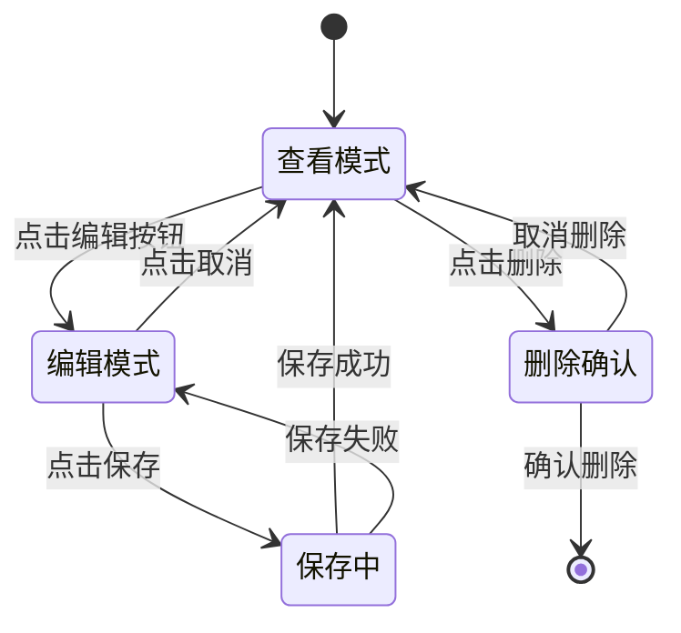

**图表来源**
- [ClothDetailSheet.tsx:29-86](file://FreeDressApp/src/components/ClothDetailSheet.tsx#L29-L86)

**章节来源**
- [ClothDetailSheet.tsx:1-353](file://FreeDressApp/src/components/ClothDetailSheet.tsx#L1-L353)

### WardrobeStore 状态管理

WardrobeStore 使用 Zustand 实现全局状态管理：

#### 状态结构

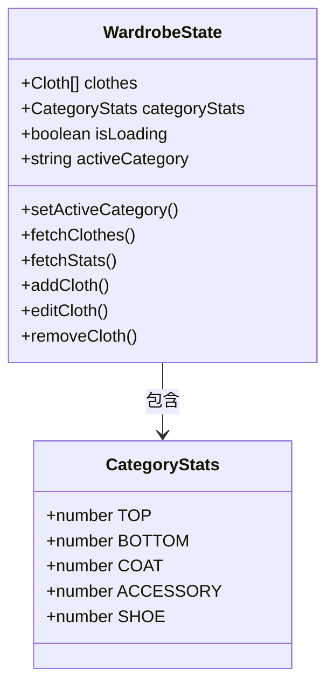

**图表来源**
- [wardrobeStore.ts:21-33](file://FreeDressApp/src/store/wardrobeStore.ts#L21-L33)

#### 数据流管理

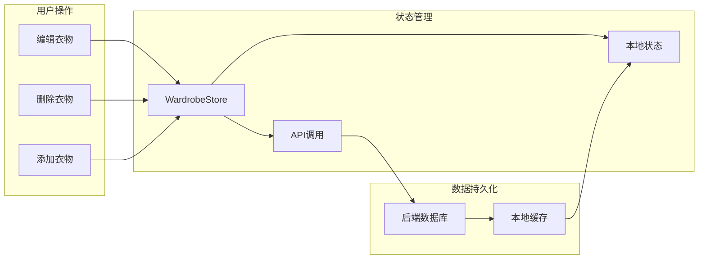

**图表来源**
- [wardrobeStore.ts:43-81](file://FreeDressApp/src/store/wardrobeStore.ts#L43-L81)

**章节来源**
- [wardrobeStore.ts:1-83](file://FreeDressApp/src/store/wardrobeStore.ts#L1-L83)

### API 服务集成

衣物编辑界面通过统一的 API 服务层与后端通信：

#### API 接口设计

| 接口 | 方法 | 参数 | 功能 |
|------|------|------|------|
| /clothes | GET | category | 获取衣物列表 |
| /clothes/:id | GET | id | 获取单个衣物 |
| /clothes/:id | PUT | id, data | 更新衣物信息 |
| /clothes/:id | DELETE | id | 删除衣物 |
| /upload/image | POST | file | 上传图片 |

#### 错误处理机制

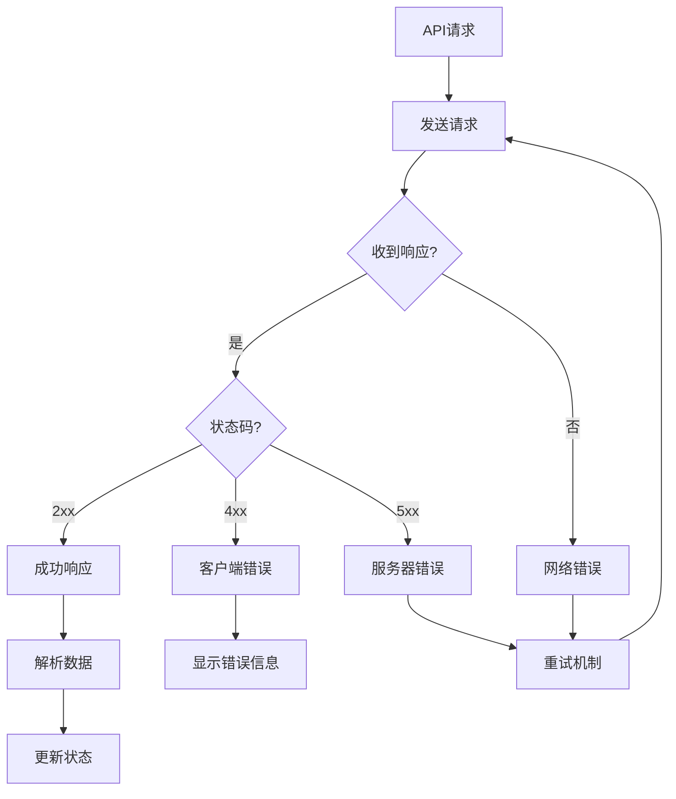

**图表来源**
- [clothes.ts:30-54](file://FreeDressApp/src/api/clothes.ts#L30-L54)

**章节来源**
- [clothes.ts:1-54](file://FreeDressApp/src/api/clothes.ts#L1-L54)
- [upload.ts:1-21](file://FreeDressApp/src/api/upload.ts#L1-L21)

## 依赖关系分析

衣物编辑界面的依赖关系清晰且模块化：

### 组件依赖图

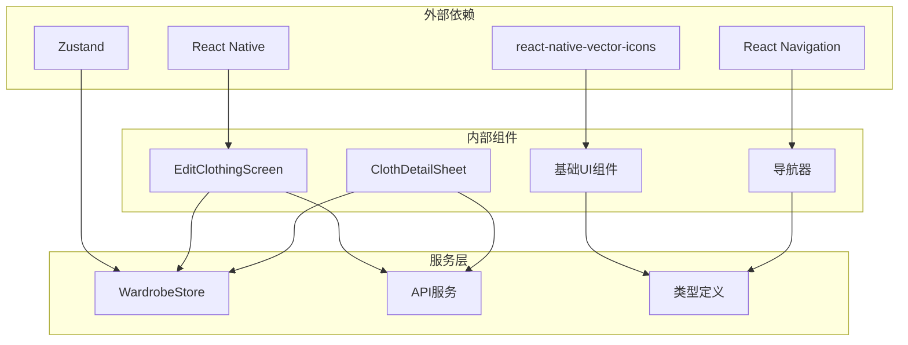

**图表来源**
- [EditClothingScreen.tsx:10-27](file://FreeDressApp/src/screens/EditClothingScreen.tsx#L10-L27)
- [RootNavigator.tsx:6-25](file://FreeDressApp/src/navigation/RootNavigator.tsx#L6-L25)

### 数据流依赖

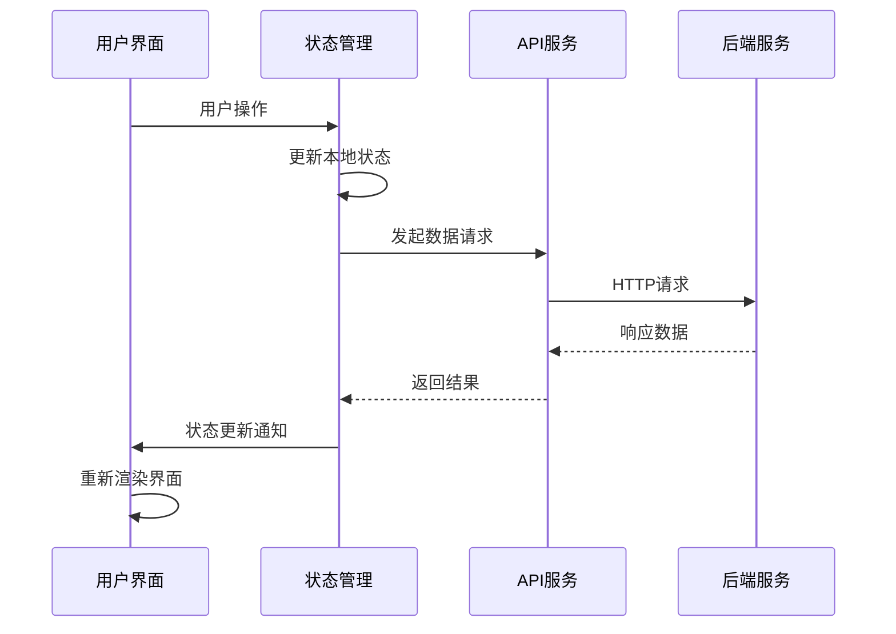

**图表来源**
- [wardrobeStore.ts:70-75](file://FreeDressApp/src/store/wardrobeStore.ts#L70-L75)

**章节来源**
- [EditClothingScreen.tsx:10-27](file://FreeDressApp/src/screens/EditClothingScreen.tsx#L10-L27)
- [wardrobeStore.ts:1-83](file://FreeDressApp/src/store/wardrobeStore.ts#L1-L83)

## 性能考虑

衣物编辑界面在设计时充分考虑了性能优化：

### 性能优化策略

| 优化方面 | 实现方式 | 性能收益 |
|----------|----------|----------|
| 图片加载 | 懒加载和缓存 | 减少内存占用 |
| 状态更新 | 局部状态管理 | 提高渲染效率 |
| API调用 | 防抖和去重 | 减少网络请求 |
| 组件渲染 | Memo化和浅比较 | 降低重渲染次数 |

### 内存管理

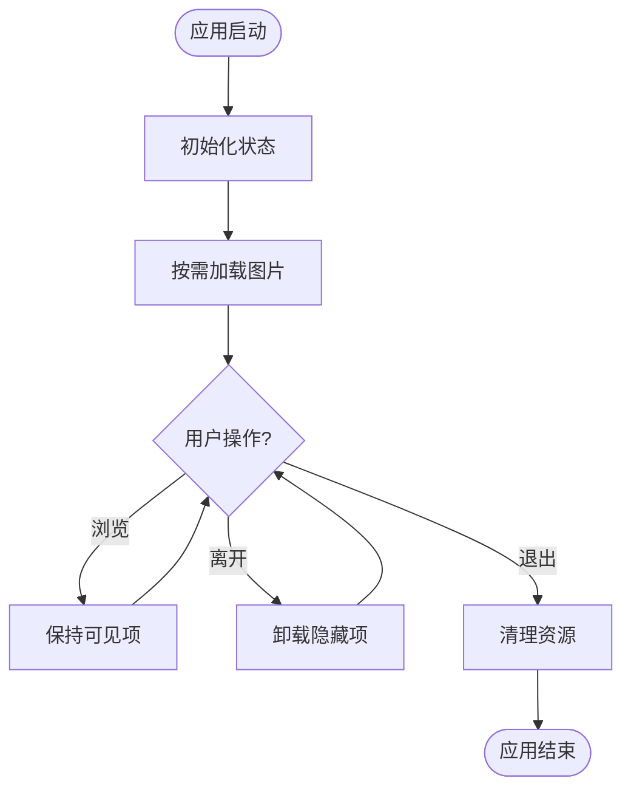

**图表来源**
- [EditClothingScreen.tsx:45-65](file://FreeDressApp/src/screens/EditClothingScreen.tsx#L45-L65)

## 故障排除指南

### 常见问题及解决方案

| 问题类型 | 症状 | 解决方案 |
|----------|------|----------|
| 图片上传失败 | 上传进度卡住 | 检查网络连接和图片格式 |
| 表单验证错误 | 保存按钮不可用 | 确保必填字段完整 |
| 状态不同步 | 界面显示过期数据 | 刷新页面或重新登录 |
| 图片显示异常 | 图片加载失败 | 清除缓存或重新选择图片 |

### 错误处理机制

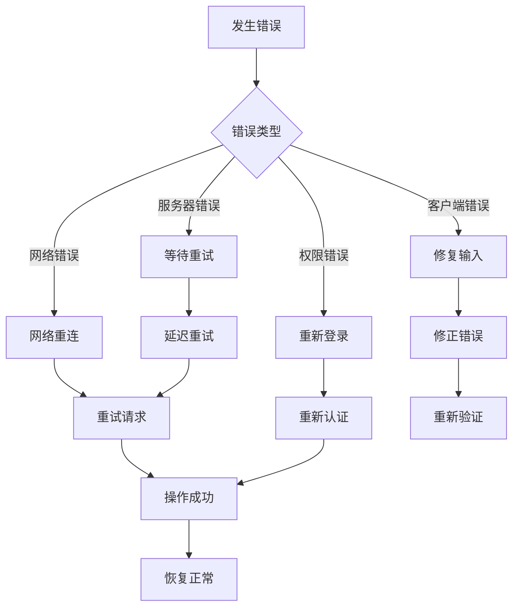

**图表来源**
- [EditClothingScreen.tsx:59-61](file://FreeDressApp/src/screens/EditClothingScreen.tsx#L59-L61)

**章节来源**
- [EditClothingScreen.tsx:59-61](file://FreeDressApp/src/screens/EditClothingScreen.tsx#L59-L61)
- [ClothDetailSheet.tsx:63-67](file://FreeDressApp/src/components/ClothDetailSheet.tsx#L63-L67)

## 结论

衣物编辑界面展现了现代移动应用开发的最佳实践，通过清晰的架构设计、完善的组件体系和高效的性能优化，为用户提供了优质的衣物管理体验。该界面不仅功能完整，而且具有良好的可扩展性和可维护性，为后续的功能增强奠定了坚实的基础。

主要优势包括：
- **模块化设计**：组件职责清晰，便于维护和测试
- **状态管理**：集中式的状态管理确保数据一致性
- **用户体验**：直观的操作流程和及时的反馈机制
- **性能优化**：合理的资源管理和渲染优化策略
- **错误处理**：完善的错误处理和恢复机制