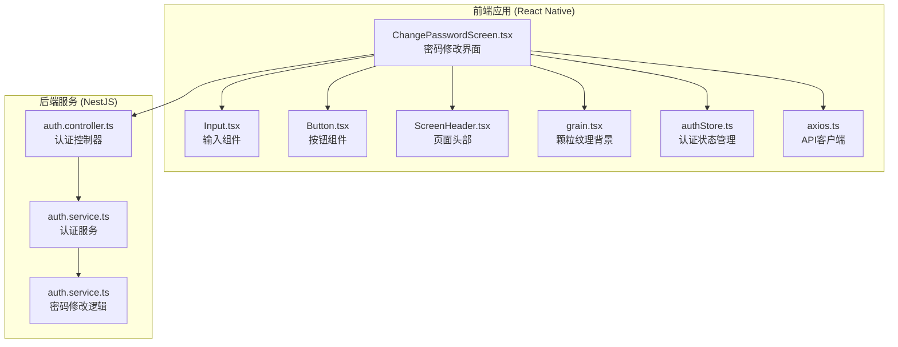
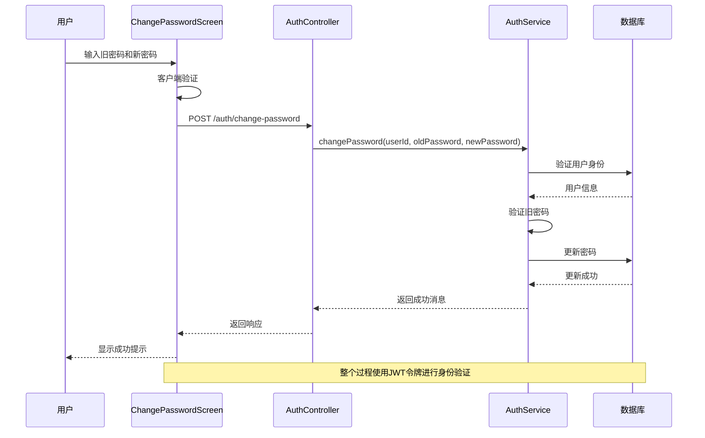
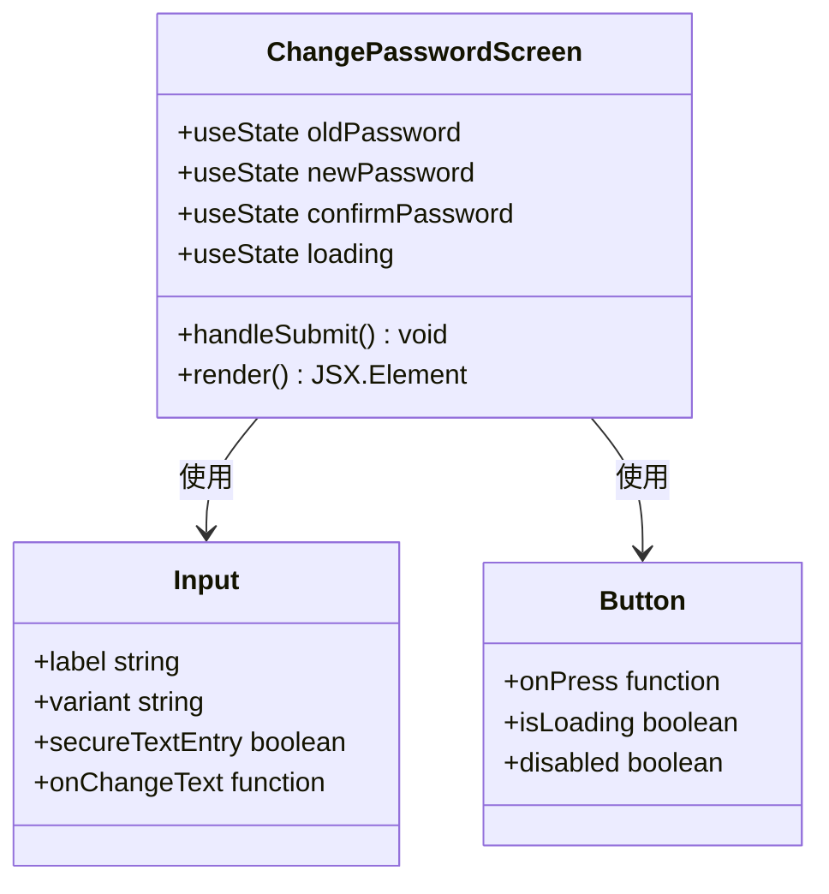
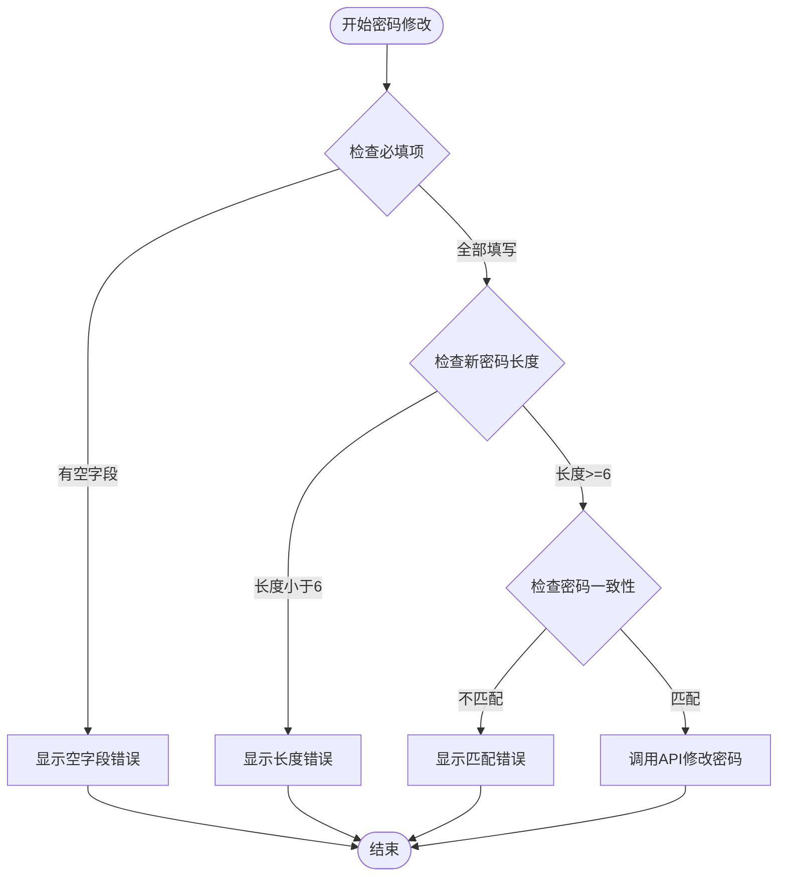
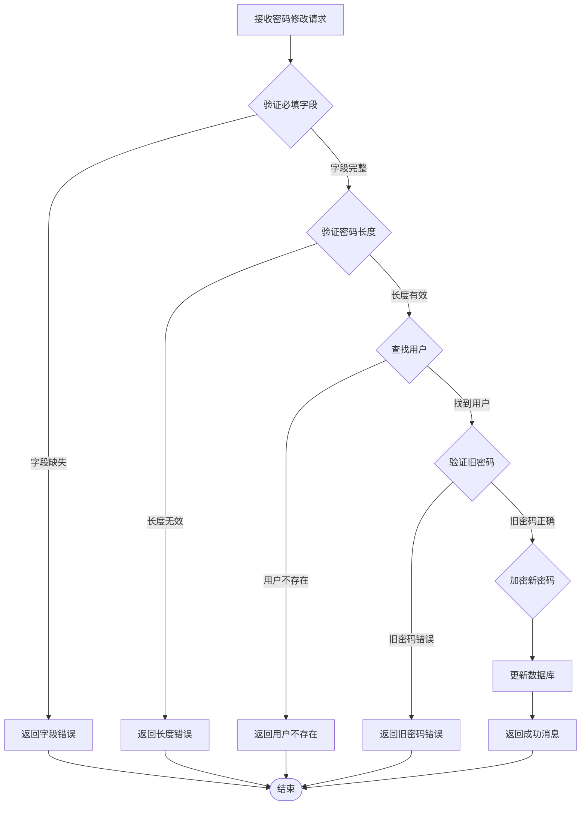
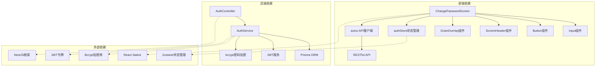

# 密码修改界面

<cite>
**本文档引用的文件**
- [ChangePasswordScreen.tsx](file://FreeDressApp/src/screens/ChangePasswordScreen.tsx)
- [auth.ts](file://FreeDressApp/src/api/auth.ts)
- [authStore.ts](file://FreeDressApp/src/store/authStore.ts)
- [auth.service.ts](file://backend/src/modules/auth/auth.service.ts)
- [auth.controller.ts](file://backend/src/modules/auth/auth.controller.ts)
- [Input.tsx](file://FreeDressApp/src/components/Input.tsx)
- [Button.tsx](file://FreeDressApp/src/components/Button.tsx)
- [ScreenHeader.tsx](file://FreeDressApp/src/components/ScreenHeader.tsx)
- [grain.tsx](file://FreeDressApp/src/theme/grain.tsx)
- [index.ts](file://FreeDressApp/src/constants/index.ts)
- [axios.ts](file://FreeDressApp/src/api/axios.ts)
</cite>

## 目录
1. [简介](#简介)
2. [项目结构](#项目结构)
3. [核心组件](#核心组件)
4. [架构概览](#架构概览)
5. [详细组件分析](#详细组件分析)
6. [依赖关系分析](#依赖关系分析)
7. [性能考虑](#性能考虑)
8. [故障排除指南](#故障排除指南)
9. [结论](#结论)

## 简介

密码修改界面是 FreeDress 应用中的一个关键安全功能模块，允许已登录用户修改其账户密码。该界面采用现代化的设计语言，结合了前端 React Native 技术栈和 NestJS 后端架构，提供了完整的密码修改流程，包括客户端验证、服务器端验证和安全的密码更新机制。

## 项目结构

密码修改功能涉及前后端的完整架构，主要分布在以下目录结构中：

**图表来源**
- [ChangePasswordScreen.tsx:1-128](file://FreeDressApp/src/screens/ChangePasswordScreen.tsx#L1-L128)
- [auth.controller.ts:92-104](file://backend/src/modules/auth/auth.controller.ts#L92-L104)
- [auth.service.ts:285-324](file://backend/src/modules/auth/auth.service.ts#L285-L324)

**章节来源**
- [ChangePasswordScreen.tsx:1-128](file://FreeDressApp/src/screens/ChangePasswordScreen.tsx#L1-L128)
- [auth.controller.ts:1-106](file://backend/src/modules/auth/auth.controller.ts#L1-L106)
- [auth.service.ts:1-326](file://backend/src/modules/auth/auth.service.ts#L1-L326)

## 核心组件

密码修改界面由多个精心设计的组件构成，每个组件都有明确的职责和功能：

### 前端核心组件

1. **ChangePasswordScreen**: 主界面组件，负责处理用户交互和业务逻辑
2. **Input组件**: 提供三种样式的输入框（outline、underline、filled）
3. **Button组件**: 支持多种变体和颜色方案的按钮
4. **ScreenHeader**: 页面头部组件，包含返回按钮和标题
5. **GrainOverlay**: 颗粒纹理背景，提供印刷质感

### 后端核心组件

1. **AuthController**: 处理密码修改的HTTP请求
2. **AuthService**: 实现密码修改的核心业务逻辑
3. **JwtAuthGuard**: 保护密码修改接口的安全中间件

**章节来源**
- [ChangePasswordScreen.tsx:21-109](file://FreeDressApp/src/screens/ChangePasswordScreen.tsx#L21-L109)
- [Input.tsx:33-140](file://FreeDressApp/src/components/Input.tsx#L33-L140)
- [Button.tsx:49-133](file://FreeDressApp/src/components/Button.tsx#L49-L133)
- [auth.controller.ts:92-104](file://backend/src/modules/auth/auth.controller.ts#L92-L104)
- [auth.service.ts:285-324](file://backend/src/modules/auth/auth.service.ts#L285-L324)

## 架构概览

密码修改功能采用经典的三层架构设计，从前端界面到后端服务形成完整的数据流：

**图表来源**
- [ChangePasswordScreen.tsx:28-56](file://FreeDressApp/src/screens/ChangePasswordScreen.tsx#L28-L56)
- [auth.controller.ts:99-104](file://backend/src/modules/auth/auth.controller.ts#L99-L104)
- [auth.service.ts:291-324](file://backend/src/modules/auth/auth.service.ts#L291-L324)

## 详细组件分析

### ChangePasswordScreen 组件分析

ChangePasswordScreen 是密码修改界面的核心组件，实现了完整的用户交互流程：

#### 组件结构

**图表来源**
- [ChangePasswordScreen.tsx:21-109](file://FreeDressApp/src/screens/ChangePasswordScreen.tsx#L21-L109)
- [Input.tsx:33-140](file://FreeDressApp/src/components/Input.tsx#L33-L140)
- [Button.tsx:49-133](file://FreeDressApp/src/components/Button.tsx#L49-L133)

#### 核心功能实现

1. **表单状态管理**: 使用 React 的 useState 管理三个密码输入框的状态
2. **客户端验证**: 在提交前进行必要的验证检查
3. **API调用**: 通过 apiClient 发送密码修改请求
4. **错误处理**: 统一的错误提示和异常处理机制

#### 验证逻辑流程

**图表来源**
- [ChangePasswordScreen.tsx:28-40](file://FreeDressApp/src/screens/ChangePasswordScreen.tsx#L28-L40)

**章节来源**
- [ChangePasswordScreen.tsx:21-109](file://FreeDressApp/src/screens/ChangePasswordScreen.tsx#L21-L109)

### Input 组件分析

Input 组件提供了灵活的输入框实现，支持多种样式和交互效果：

#### 样式变体系统

| 变体名称 | 特点 | 适用场景 |
|---------|------|----------|
| underline | 单根下划线，聚焦时变色 | 密码修改界面的主要输入样式 |
| outline | 外框边框，带圆角 | 表单页面的通用输入框 |
| filled | 填充背景色，带边框 | 需要突出显示的输入区域 |

#### 动画交互

Input 组件实现了流畅的标签动画效果：
- 焦点状态下的标签上移动画
- 输入值变化时的标签过渡效果
- 错误状态下的颜色变化

**章节来源**
- [Input.tsx:33-140](file://FreeDressApp/src/components/Input.tsx#L33-L140)

### Button 组件分析

Button 组件支持多种视觉风格和交互状态：

#### 变体系统

| 变体名称 | 配色方案 | 使用场景 |
|---------|----------|----------|
| solid | 实心填充 | 主要操作按钮 |
| outline | 外框边框 | 次要操作按钮 |
| ghost | 透明背景 | 轻量级操作 |
| link | 文本链接 | 导航操作 |
| inverse | 反转配色 | 特殊场景 |

#### 交互反馈

- 按压缩放动画效果
- 加载状态指示器
- 禁用状态处理
- 自适应尺寸系统

**章节来源**
- [Button.tsx:49-133](file://FreeDressApp/src/components/Button.tsx#L49-L133)

### 后端服务分析

后端的密码修改功能由 AuthService 提供，实现了严格的安全验证和数据处理：

#### 业务逻辑流程

**图表来源**
- [auth.service.ts:291-324](file://backend/src/modules/auth/auth.service.ts#L291-L324)

#### 安全特性

1. **密码哈希**: 使用 bcrypt 进行安全的密码加密
2. **长度限制**: 新密码长度限制在6-20位之间
3. **旧密码验证**: 确保用户输入正确的当前密码
4. **JWT保护**: 接口访问需要有效的访问令牌

**章节来源**
- [auth.service.ts:285-324](file://backend/src/modules/auth/auth.service.ts#L285-L324)

## 依赖关系分析

密码修改功能涉及多个层面的依赖关系：

**图表来源**
- [ChangePasswordScreen.tsx:12-19](file://FreeDressApp/src/screens/ChangePasswordScreen.tsx#L12-L19)
- [authStore.ts:1-123](file://FreeDressApp/src/store/authStore.ts#L1-L123)
- [auth.controller.ts:1-22](file://backend/src/modules/auth/auth.controller.ts#L1-L22)

### 关键依赖关系

1. **前端状态管理**: 使用 Zustand 进行全局状态管理
2. **API通信**: 通过 axios 客户端与后端进行通信
3. **认证保护**: 使用 JWT 令牌进行接口访问控制
4. **密码加密**: 使用 bcrypt 进行安全的密码哈希

**章节来源**
- [authStore.ts:28-122](file://FreeDressApp/src/store/authStore.ts#L28-L122)
- [axios.ts](file://FreeDressApp/src/api/axios.ts)

## 性能考虑

密码修改界面在设计时充分考虑了性能优化：

### 前端性能优化

1. **组件懒加载**: 使用 React.memo 优化组件渲染
2. **状态最小化**: 只管理必要的状态变量
3. **事件防抖**: 避免重复的API调用
4. **内存管理**: 及时清理定时器和事件监听器

### 后端性能优化

1. **数据库索引**: 为用户表建立适当的索引
2. **连接池**: 使用连接池管理数据库连接
3. **缓存策略**: 缓存常用的用户信息
4. **异步处理**: 使用异步操作避免阻塞

## 故障排除指南

### 常见问题及解决方案

#### 前端问题

1. **输入验证失败**
   - 检查密码长度是否符合要求
   - 确认新密码和确认密码是否一致
   - 验证旧密码是否正确

2. **API调用失败**
   - 检查网络连接状态
   - 验证JWT令牌的有效性
   - 查看服务器响应状态码

3. **界面显示异常**
   - 检查组件的props传递
   - 验证样式类名的正确性
   - 确认主题配置的完整性

#### 后端问题

1. **密码修改失败**
   - 检查用户是否存在
   - 验证旧密码的正确性
   - 确认数据库连接正常

2. **安全验证失败**
   - 检查JWT配置
   - 验证用户权限
   - 查看日志记录

**章节来源**
- [ChangePasswordScreen.tsx:51-55](file://FreeDressApp/src/screens/ChangePasswordScreen.tsx#L51-L55)
- [auth.service.ts:292-312](file://backend/src/modules/auth/auth.service.ts#L292-L312)

## 结论

密码修改界面是一个设计精良、功能完整的安全功能模块。它采用了现代化的技术栈和最佳实践，提供了良好的用户体验和强大的安全性保障。

### 主要优势

1. **用户体验**: 简洁直观的界面设计，流畅的交互体验
2. **安全性**: 严格的验证机制和安全的数据传输
3. **可维护性**: 清晰的代码结构和完善的错误处理
4. **扩展性**: 模块化的组件设计便于功能扩展

### 技术亮点

1. **前后端分离**: 采用RESTful API进行数据交互
2. **状态管理**: 使用Zustand实现高效的全局状态管理
3. **安全防护**: JWT令牌和密码哈希双重安全保障
4. **设计系统**: 完整的设计语言和组件库

该密码修改界面为整个 FreeDress 应用提供了坚实的基础，展现了现代移动应用开发的最佳实践。