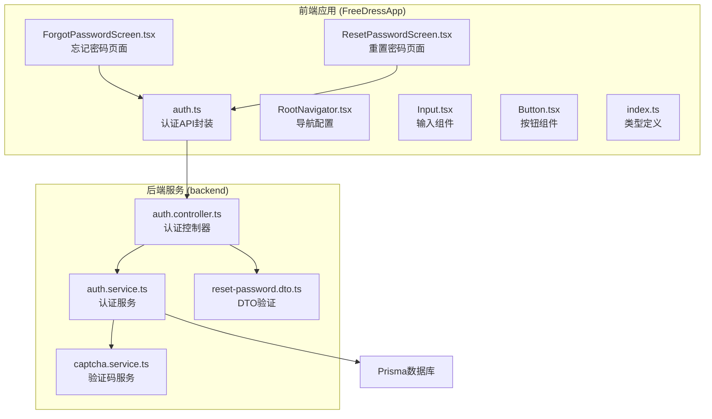
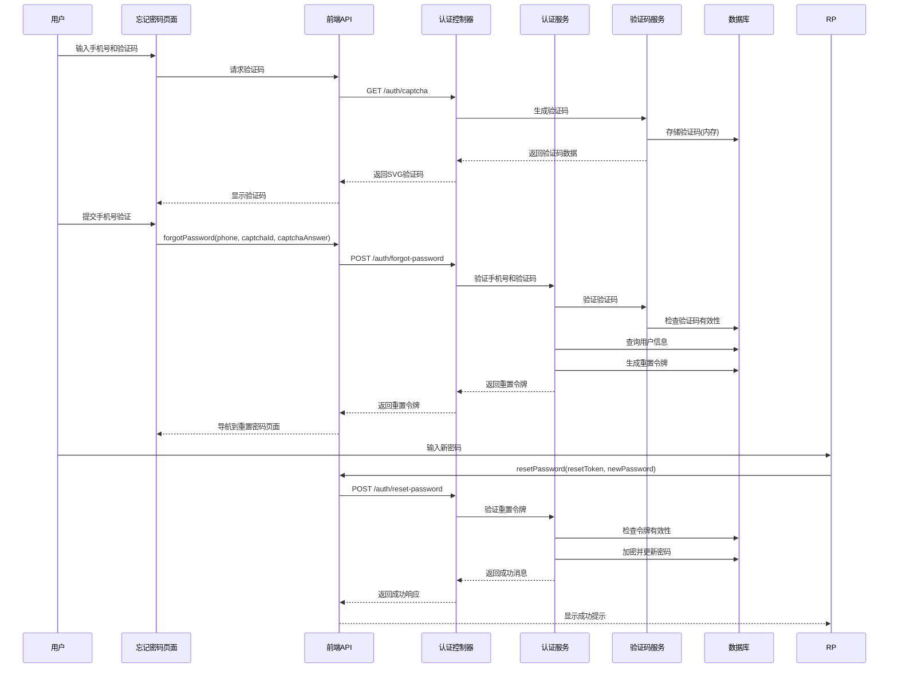
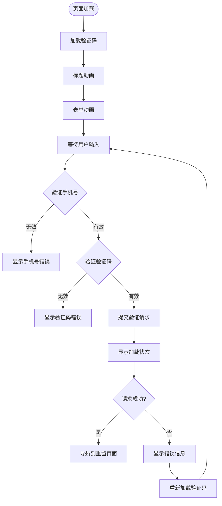
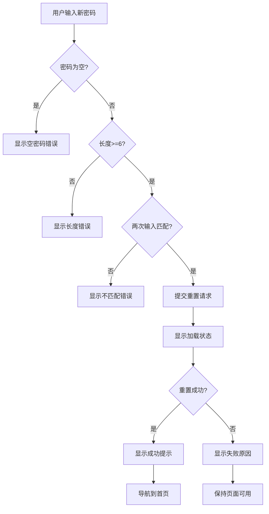
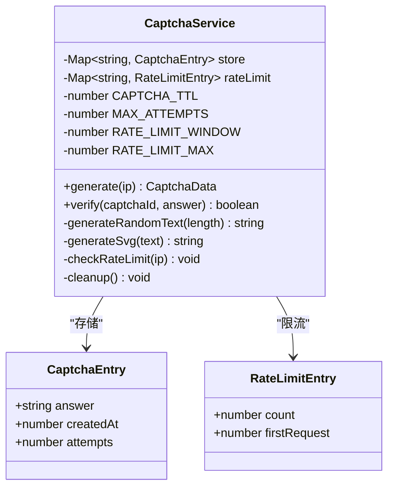
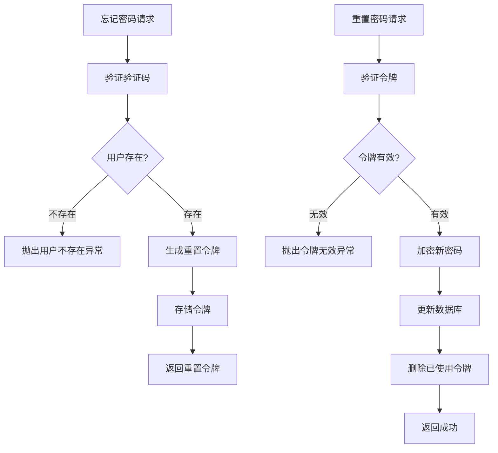
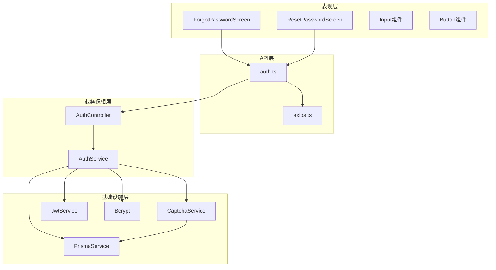

# 密码重置页面

<cite>
**本文档引用的文件**
- [ForgotPasswordScreen.tsx](file://FreeDressApp/src/screens/ForgotPasswordScreen.tsx)
- [ResetPasswordScreen.tsx](file://FreeDressApp/src/screens/ResetPasswordScreen.tsx)
- [auth.ts](file://FreeDressApp/src/api/auth.ts)
- [auth.controller.ts](file://backend/src/modules/auth/auth.controller.ts)
- [auth.service.ts](file://backend/src/modules/auth/auth.service.ts)
- [captcha.service.ts](file://backend/src/modules/auth/captcha.service.ts)
- [reset-password.dto.ts](file://backend/src/modules/auth/dto/reset-password.dto.ts)
- [RootNavigator.tsx](file://FreeDressApp/src/navigation/RootNavigator.tsx)
- [Input.tsx](file://FreeDressApp/src/components/Input.tsx)
- [Button.tsx](file://FreeDressApp/src/components/Button.tsx)
- [index.ts](file://FreeDressApp/src/types/index.ts)
</cite>

## 目录
1. [简介](#简介)
2. [项目结构](#项目结构)
3. [核心组件](#核心组件)
4. [架构概览](#架构概览)
5. [详细组件分析](#详细组件分析)
6. [依赖关系分析](#依赖关系分析)
7. [性能考虑](#性能考虑)
8. [故障排除指南](#故障排除指南)
9. [结论](#结论)

## 简介

本文档详细介绍了畅搭(FreeDress)应用中密码重置功能的完整实现，包括忘记密码页面(ForgotPasswordScreen)和重置密码页面(ResetPasswordScreen)的设计与实现。该功能涵盖了从手机号验证、验证码获取到新密码设置的完整用户体验流程，并实现了严格的安全最佳实践。

## 项目结构

密码重置功能涉及前端React Native应用和后端NestJS服务的协作，主要文件分布如下：

**图表来源**
- [ForgotPasswordScreen.tsx:1-304](file://FreeDressApp/src/screens/ForgotPasswordScreen.tsx#L1-L304)
- [ResetPasswordScreen.tsx:1-231](file://FreeDressApp/src/screens/ResetPasswordScreen.tsx#L1-L231)
- [auth.controller.ts:1-92](file://backend/src/modules/auth/auth.controller.ts#L1-L92)

**章节来源**
- [ForgotPasswordScreen.tsx:1-304](file://FreeDressApp/src/screens/ForgotPasswordScreen.tsx#L1-L304)
- [ResetPasswordScreen.tsx:1-231](file://FreeDressApp/src/screens/ResetPasswordScreen.tsx#L1-L231)
- [auth.ts:1-101](file://FreeDressApp/src/api/auth.ts#L1-L101)

## 核心组件

密码重置功能由两个核心页面组成，每个页面都有其特定的功能职责：

### 忘记密码页面 (ForgotPasswordScreen)
- **手机号验证**：验证用户输入的手机号格式
- **验证码系统**：集成图片验证码获取和验证
- **令牌获取**：向后端请求密码重置令牌
- **页面导航**：成功后跳转到重置密码页面

### 重置密码页面 (ResetPasswordScreen)
- **密码强度验证**：确保新密码符合安全要求
- **密码确认**：验证两次输入的密码一致性
- **密码更新**：使用重置令牌更新用户密码
- **用户反馈**：提供成功和失败的明确反馈

**章节来源**
- [ForgotPasswordScreen.tsx:44-115](file://FreeDressApp/src/screens/ForgotPasswordScreen.tsx#L44-L115)
- [ResetPasswordScreen.tsx:42-93](file://FreeDressApp/src/screens/ResetPasswordScreen.tsx#L42-L93)

## 架构概览

密码重置功能采用前后端分离的架构设计，实现了完整的认证流程：

**图表来源**
- [ForgotPasswordScreen.tsx:76-115](file://FreeDressApp/src/screens/ForgotPasswordScreen.tsx#L76-L115)
- [ResetPasswordScreen.tsx:73-93](file://FreeDressApp/src/screens/ResetPasswordScreen.tsx#L73-L93)
- [auth.controller.ts:55-68](file://backend/src/modules/auth/auth.controller.ts#L55-L68)

## 详细组件分析

### 忘记密码页面 (ForgotPasswordScreen)

#### 页面布局和动画
页面采用渐进式动画展示，标题和表单分别有不同的进入动画效果：

**图表来源**
- [ForgotPasswordScreen.tsx:60-74](file://FreeDressApp/src/screens/ForgotPasswordScreen.tsx#L60-L74)
- [ForgotPasswordScreen.tsx:95-115](file://FreeDressApp/src/screens/ForgotPasswordScreen.tsx#L95-L115)

#### 表单验证逻辑
页面实现了多层次的表单验证：

1. **手机号格式验证**：使用正则表达式验证中国手机号格式
2. **验证码验证**：确保用户输入了验证码
3. **实时反馈**：通过Alert组件提供即时错误提示

#### 验证码系统集成
- **SVG验证码**：后端生成SVG格式的图片验证码
- **验证码存储**：使用内存存储验证码答案和元数据
- **自动刷新**：用户可以点击验证码区域重新获取

**章节来源**
- [ForgotPasswordScreen.tsx:44-115](file://FreeDressApp/src/screens/ForgotPasswordScreen.tsx#L44-L115)
- [ForgotPasswordScreen.tsx:153-193](file://FreeDressApp/src/screens/ForgotPasswordScreen.tsx#L153-L193)

### 重置密码页面 (ResetPasswordScreen)

#### 密码验证规则
页面实施严格的密码安全策略：

**图表来源**
- [ResetPasswordScreen.tsx:73-93](file://FreeDressApp/src/screens/ResetPasswordScreen.tsx#L73-L93)

#### 密码安全策略
- **最小长度**：密码至少6位字符
- **最大长度**：密码不超过20位字符
- **重复验证**：要求用户确认新密码
- **加密存储**：后端使用bcrypt进行密码哈希

**章节来源**
- [ResetPasswordScreen.tsx:42-93](file://FreeDressApp/src/screens/ResetPasswordScreen.tsx#L42-L93)

### 后端服务实现

#### 验证码服务 (CaptchaService)
验证码服务实现了多项安全防护机制：

**图表来源**
- [captcha.service.ts:31-122](file://backend/src/modules/auth/captcha.service.ts#L31-L122)

#### 认证服务 (AuthService)
认证服务处理密码重置的核心业务逻辑：

**图表来源**
- [auth.service.ts:180-207](file://backend/src/modules/auth/auth.service.ts#L180-L207)
- [auth.service.ts:214-242](file://backend/src/modules/auth/auth.service.ts#L214-L242)

**章节来源**
- [captcha.service.ts:31-122](file://backend/src/modules/auth/captcha.service.ts#L31-L122)
- [auth.service.ts:180-242](file://backend/src/modules/auth/auth.service.ts#L180-L242)

## 依赖关系分析

密码重置功能的依赖关系体现了清晰的分层架构：

**图表来源**
- [auth.ts:1-101](file://FreeDressApp/src/api/auth.ts#L1-L101)
- [auth.controller.ts:19-22](file://backend/src/modules/auth/auth.controller.ts#L19-L22)
- [auth.service.ts:30-37](file://backend/src/modules/auth/auth.service.ts#L30-L37)

**章节来源**
- [auth.ts:1-101](file://FreeDressApp/src/api/auth.ts#L1-L101)
- [auth.controller.ts:19-22](file://backend/src/modules/auth/auth.controller.ts#L19-L22)

## 性能考虑

### 前端性能优化
- **动画性能**：使用react-native-reanimated实现流畅的页面过渡动画
- **内存管理**：验证码和重置令牌使用内存存储，定期清理过期数据
- **网络优化**：API调用包含加载状态指示，避免用户重复提交

### 后端性能优化
- **验证码缓存**：使用Map数据结构存储验证码，查询时间复杂度O(1)
- **定时清理**：后台定时任务清理过期验证码和重置令牌
- **数据库索引**：用户表按手机号建立索引，提高查询效率

## 故障排除指南

### 常见问题及解决方案

#### 验证码相关问题
- **验证码过期**：验证码有效期2分钟，需要重新获取
- **验证码错误**：最多允许3次验证尝试，超过限制需重新获取
- **请求过于频繁**：IP限流每分钟最多10次请求

#### 密码重置问题
- **重置令牌失效**：重置令牌有效期10分钟，过期后需要重新申请
- **密码不符合要求**：新密码必须6-20位且两次输入一致
- **网络连接问题**：检查网络状态，重试操作

#### 错误处理机制
页面实现了完善的错误处理：
- **输入验证错误**：立即显示具体的错误信息
- **网络请求错误**：捕获异常并提供友好的错误提示
- **业务逻辑错误**：根据具体错误类型提供相应的解决方案

**章节来源**
- [ForgotPasswordScreen.tsx:95-115](file://FreeDressApp/src/screens/ForgotPasswordScreen.tsx#L95-L115)
- [ResetPasswordScreen.tsx:73-93](file://FreeDressApp/src/screens/ResetPasswordScreen.tsx#L73-L93)

## 结论

畅搭(FreeDress)应用的密码重置功能实现了完整的用户体验流程，具有以下特点：

### 设计优势
- **用户体验友好**：清晰的步骤指导和即时反馈
- **安全性强**：多层验证和防护机制
- **技术实现优雅**：前后端分离架构，模块化设计

### 安全最佳实践
- **验证码防护**：2分钟有效期、3次尝试限制、IP限流
- **令牌管理**：10分钟有效期的重置令牌
- **密码保护**：bcrypt加密存储，严格的密码强度要求
- **防重放攻击**：一次性令牌机制和过期控制

### 技术亮点
- **动画体验**：流畅的页面过渡和交互反馈
- **错误处理**：完善的错误提示和恢复机制
- **可扩展性**：模块化的架构设计，便于功能扩展

该密码重置功能为用户提供了安全、便捷的账户恢复体验，同时为开发者提供了清晰的代码结构和良好的可维护性。