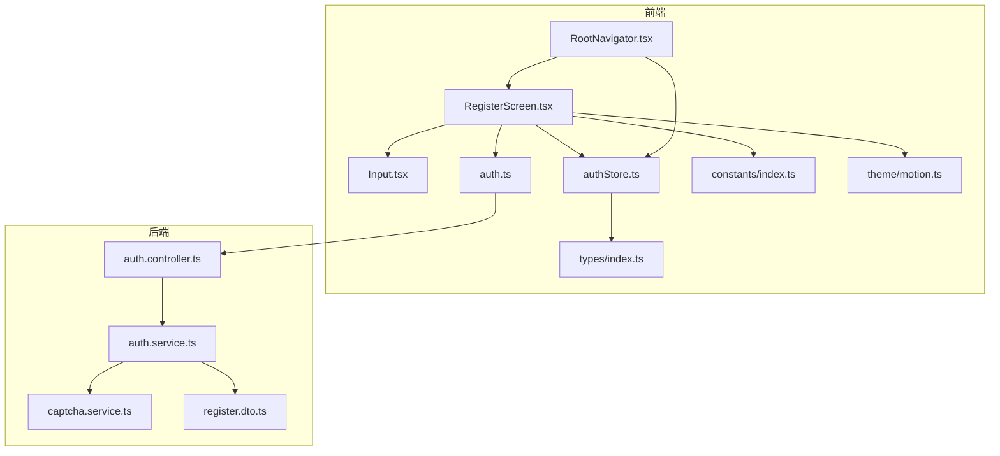
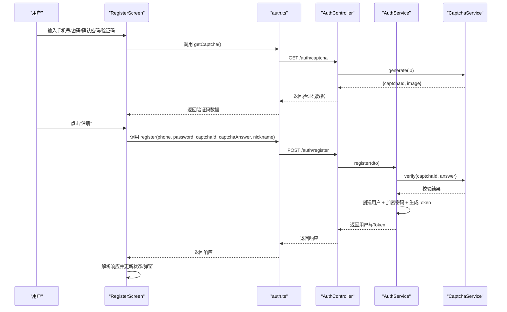
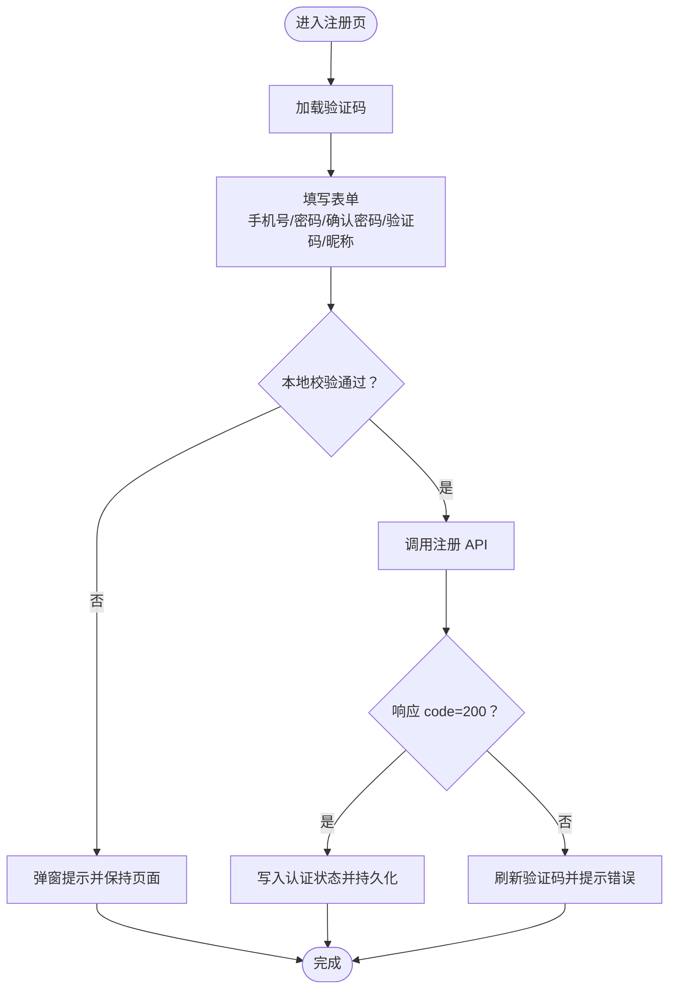
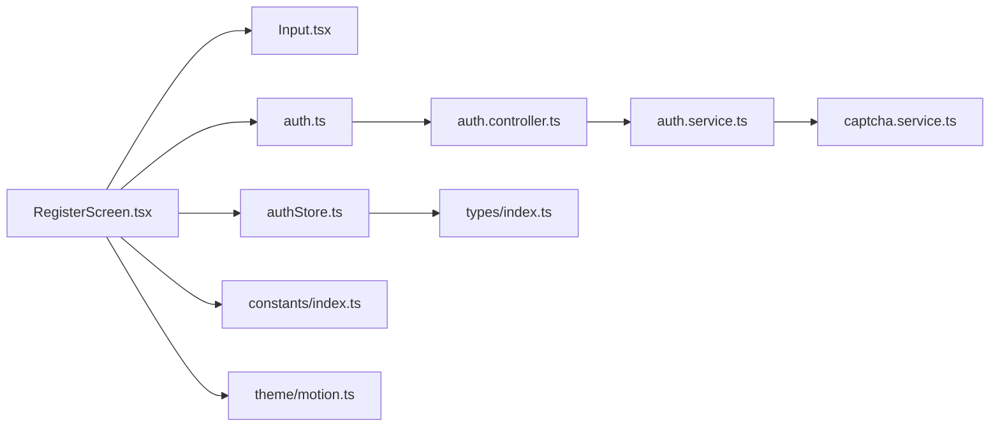

# 注册页面

<cite>
**本文档引用的文件**
- [RegisterScreen.tsx](file://FreeDressApp/src/screens/RegisterScreen.tsx)
- [auth.ts](file://FreeDressApp/src/api/auth.ts)
- [Input.tsx](file://FreeDressApp/src/components/Input.tsx)
- [authStore.ts](file://FreeDressApp/src/store/authStore.ts)
- [index.ts](file://FreeDressApp/src/types/index.ts)
- [index.ts](file://FreeDressApp/src/constants/index.ts)
- [motion.ts](file://FreeDressApp/src/theme/motion.ts)
- [RootNavigator.tsx](file://FreeDressApp/src/navigation/RootNavigator.tsx)
- [LoginScreen.tsx](file://FreeDressApp/src/screens/LoginScreen.tsx)
- [ForgotPasswordScreen.tsx](file://FreeDressApp/src/screens/ForgotPasswordScreen.tsx)
- [ResetPasswordScreen.tsx](file://FreeDressApp/src/screens/ResetPasswordScreen.tsx)
- [captcha.service.ts](file://backend/src/modules/auth/captcha.service.ts)
- [auth.controller.ts](file://backend/src/modules/auth/auth.controller.ts)
- [register.dto.ts](file://backend/src/modules/auth/dto/register.dto.ts)
- [auth.service.ts](file://backend/src/modules/auth/auth.service.ts)
</cite>

## 目录
1. [简介](#简介)
2. [项目结构](#项目结构)
3. [核心组件](#核心组件)
4. [架构总览](#架构总览)
5. [详细组件分析](#详细组件分析)
6. [依赖关系分析](#依赖关系分析)
7. [性能考量](#性能考量)
8. [故障排查指南](#故障排查指南)
9. [结论](#结论)
10. [附录](#附录)

## 简介
本文件面向畅搭(FreeDress)应用的注册页面，系统性梳理 RegisterScreen 的界面设计与用户注册流程，覆盖手机号输入、验证码获取、密码设置与确认密码输入；深入解析注册表单验证逻辑（手机号格式、密码强度、确认密码一致性）；阐述验证码系统（发送逻辑、SVG 展示、过期与防刷机制）；分析注册 API 调用流程（数据提交、响应处理、错误反馈）；并提供用户体验优化建议（输入框自动切换、实时验证反馈、加载状态管理），以及安全注意事项（密码加密传输、验证码时效性与防刷策略）。

## 项目结构
注册页面位于前端 React Native 代码中，采用“屏幕 + 组件 + API 封装 + 状态管理”的分层组织方式，并与后端 NestJS 认证模块协同工作。关键文件分布如下：
- 前端屏幕：RegisterScreen.tsx
- 前端组件：Input.tsx
- 前端 API：auth.ts
- 前端状态：authStore.ts
- 类型定义：types/index.ts
- 常量与主题：constants/index.ts、theme/motion.ts
- 导航配置：navigation/RootNavigator.tsx
- 其他相关页面：LoginScreen.tsx、ForgotPasswordScreen.tsx、ResetPasswordScreen.tsx
- 后端认证：auth.controller.ts、auth.service.ts、captcha.service.ts、register.dto.ts



**图表来源**
- [RegisterScreen.tsx:1-359](file://FreeDressApp/src/screens/RegisterScreen.tsx#L1-L359)
- [auth.ts:1-101](file://FreeDressApp/src/api/auth.ts#L1-L101)
- [Input.tsx:1-183](file://FreeDressApp/src/components/Input.tsx#L1-L183)
- [authStore.ts:1-123](file://FreeDressApp/src/store/authStore.ts#L1-L123)
- [index.ts:1-98](file://FreeDressApp/src/types/index.ts#L1-L98)
- [index.ts:1-212](file://FreeDressApp/src/constants/index.ts#L1-L212)
- [motion.ts:1-32](file://FreeDressApp/src/theme/motion.ts#L1-L32)
- [RootNavigator.tsx:1-95](file://FreeDressApp/src/navigation/RootNavigator.tsx#L1-L95)
- [auth.controller.ts:1-92](file://backend/src/modules/auth/auth.controller.ts#L1-L92)
- [auth.service.ts:1-279](file://backend/src/modules/auth/auth.service.ts#L1-L279)
- [captcha.service.ts:1-259](file://backend/src/modules/auth/captcha.service.ts#L1-L259)
- [register.dto.ts:1-38](file://backend/src/modules/auth/dto/register.dto.ts#L1-L38)

**章节来源**
- [RegisterScreen.tsx:1-359](file://FreeDressApp/src/screens/RegisterScreen.tsx#L1-L359)
- [auth.ts:1-101](file://FreeDressApp/src/api/auth.ts#L1-L101)
- [authStore.ts:1-123](file://FreeDressApp/src/store/authStore.ts#L1-L123)
- [RootNavigator.tsx:1-95](file://FreeDressApp/src/navigation/RootNavigator.tsx#L1-L95)

## 核心组件
- 注册屏幕 RegisterScreen：负责渲染表单、收集输入、触发验证码加载与注册流程、处理加载状态与错误提示。
- 输入组件 Input：提供带浮动标签、下划线样式的输入框，支持错误态展示与焦点态视觉反馈。
- 认证 API 封装：封装 getCaptcha 与 register 接口，统一返回 ApiResponse 结构。
- 认证状态管理：使用 Zustand 管理用户登录态、Token 与用户信息，并持久化到本地存储。
- 导航与主题：RootNavigator 根据登录状态切换页面栈；motion.ts 提供动画时长与缓动配置。

**章节来源**
- [RegisterScreen.tsx:45-263](file://FreeDressApp/src/screens/RegisterScreen.tsx#L45-L263)
- [Input.tsx:33-140](file://FreeDressApp/src/components/Input.tsx#L33-L140)
- [auth.ts:12-38](file://FreeDressApp/src/api/auth.ts#L12-L38)
- [authStore.ts:28-57](file://FreeDressApp/src/store/authStore.ts#L28-L57)
- [motion.ts:8-28](file://FreeDressApp/src/theme/motion.ts#L8-L28)

## 架构总览
注册流程从前端屏幕发起，经 API 层调用后端控制器，再由认证服务执行业务逻辑（验证码校验、用户创建、Token 生成），最终将登录态写入前端状态并持久化。



**图表来源**
- [RegisterScreen.tsx:82-123](file://FreeDressApp/src/screens/RegisterScreen.tsx#L82-L123)
- [auth.ts:12-38](file://FreeDressApp/src/api/auth.ts#L12-L38)
- [auth.controller.ts:27-41](file://backend/src/modules/auth/auth.controller.ts#L27-L41)
- [auth.service.ts:44-95](file://backend/src/modules/auth/auth.service.ts#L44-L95)
- [captcha.service.ts:58-122](file://backend/src/modules/auth/captcha.service.ts#L58-L122)

## 详细组件分析

### 注册屏幕 RegisterScreen
- 界面布局与动画：标题与表单分别使用 Reanimated 实现进入动画，提升视觉节奏；键盘适配与滚动容器保证输入体验。
- 表单字段：
  - 手机号：限制长度与键盘类型，必填且符合中国大陆手机号格式。
  - 密码：限制长度范围，安全输入。
  - 确认密码：与密码一致性校验。
  - 昵称：可选。
  - 图片验证码：支持点击刷新，展示 SVG 图片，输入 4 位字符。
- 验证码加载：首次进入即拉取验证码，加载中显示指示器。
- 注册流程：前端本地校验后调用注册 API，成功则写入认证状态并跳转主页面，失败弹窗提示并刷新验证码。
- 加载状态：注册按钮启用 isLoading 标识，避免重复提交。



**图表来源**
- [RegisterScreen.tsx:82-123](file://FreeDressApp/src/screens/RegisterScreen.tsx#L82-L123)
- [authStore.ts:39-56](file://FreeDressApp/src/store/authStore.ts#L39-L56)

**章节来源**
- [RegisterScreen.tsx:45-263](file://FreeDressApp/src/screens/RegisterScreen.tsx#L45-L263)
- [RegisterScreen.tsx:100-123](file://FreeDressApp/src/screens/RegisterScreen.tsx#L100-L123)

### 输入组件 Input
- 特性：浮动标签、下划线样式、聚焦态高亮、错误态提示；支持 outline/filled/underline 三种变体。
- 在注册页中用于手机号、密码、确认密码、验证码与昵称输入，提供一致的视觉与交互体验。

**章节来源**
- [Input.tsx:33-140](file://FreeDressApp/src/components/Input.tsx#L33-L140)
- [RegisterScreen.tsx:162-201](file://FreeDressApp/src/screens/RegisterScreen.tsx#L162-L201)

### 认证 API 封装
- getCaptcha：获取验证码 ID 与 SVG 图片。
- register：提交手机号、密码、验证码 ID 与答案、昵称，返回统一 ApiResponse 结构。

**章节来源**
- [auth.ts:12-38](file://FreeDressApp/src/api/auth.ts#L12-L38)

### 认证状态管理
- setAuth：接收登录响应，更新内存状态与本地存储（用户信息、AccessToken、RefreshToken）。
- 与导航配合：RootNavigator 根据 isAuthenticated 决定显示登录/注册页还是主页面。

**章节来源**
- [authStore.ts:28-57](file://FreeDressApp/src/store/authStore.ts#L28-L57)
- [RootNavigator.tsx:42-84](file://FreeDressApp/src/navigation/RootNavigator.tsx#L42-L84)

### 验证码系统
- 前端：点击验证码区域触发重新加载，显示加载指示器，渲染 SVG 图片。
- 后端：生成 4 位验证码，存储答案与创建时间，2 分钟过期；最多允许 3 次验证尝试；按 IP 限流（每分钟最多 10 次）；定期清理过期数据。

```mermaid
classDiagram
class CaptchaService {
-Map store
-Map rateLimit
-number CAPTCHA_TTL
-number MAX_ATTEMPTS
-number RATE_LIMIT_WINDOW
-number RATE_LIMIT_MAX
+generate(ip) {captchaId, image}
+verify(captchaId, answer) boolean
-generateRandomText(length) string
-generateSvg(text) string
-checkRateLimit(ip) void
-cleanup() void
}
class AuthService {
+register(dto) ApiResponse
+forgotPassword(phone, captchaId, captchaAnswer) ApiResponse
+resetPassword(dto) ApiResponse
-generateTokens(userId, phone) {accessToken, refreshToken}
}
class AuthController {
+getCaptcha(req) {captchaId, image}
+register(dto) ApiResponse
+forgotPassword(body) ApiResponse
+resetPassword(dto) ApiResponse
}
AuthController --> AuthService : "调用"
AuthService --> CaptchaService : "验证码校验"
```

**图表来源**
- [captcha.service.ts:31-122](file://backend/src/modules/auth/captcha.service.ts#L31-L122)
- [auth.service.ts:44-95](file://backend/src/modules/auth/auth.service.ts#L44-L95)
- [auth.controller.ts:27-41](file://backend/src/modules/auth/auth.controller.ts#L27-L41)

**章节来源**
- [RegisterScreen.tsx:82-94](file://FreeDressApp/src/screens/RegisterScreen.tsx#L82-L94)
- [auth.controller.ts:27-32](file://backend/src/modules/auth/auth.controller.ts#L27-L32)
- [captcha.service.ts:58-122](file://backend/src/modules/auth/captcha.service.ts#L58-L122)

### 注册 API 调用流程
- 请求参数：手机号、密码、验证码 ID、验证码答案、昵称（可选）。
- 响应结构：统一 ApiResponse，包含 code、message、data、timestamp。
- 成功条件：code=200；失败时弹窗提示并刷新验证码。

**章节来源**
- [auth.ts:24-38](file://FreeDressApp/src/api/auth.ts#L24-L38)
- [index.ts:59-71](file://FreeDressApp/src/types/index.ts#L59-L71)
- [RegisterScreen.tsx:100-123](file://FreeDressApp/src/screens/RegisterScreen.tsx#L100-L123)

### 表单验证逻辑
- 手机号格式：正则校验中国大陆手机号。
- 密码强度：长度不少于 6 位，不超过 20 位。
- 确认密码：与密码完全一致。
- 验证码：必填且长度为 4。
- 前端错误提示：使用 Alert 弹窗即时反馈。

**章节来源**
- [RegisterScreen.tsx:100-106](file://FreeDressApp/src/screens/RegisterScreen.tsx#L100-L106)

### 与登录/忘记密码/重置密码页面的关系
- 登录页：仅手机号与密码，无验证码。
- 忘记密码页：手机号 + 验证码，获取重置令牌后跳转重置密码页。
- 注册页：手机号 + 密码 + 确认密码 + 验证码 + 昵称（可选）。

**章节来源**
- [LoginScreen.tsx:74-92](file://FreeDressApp/src/screens/LoginScreen.tsx#L74-L92)
- [ForgotPasswordScreen.tsx:95-115](file://FreeDressApp/src/screens/ForgotPasswordScreen.tsx#L95-L115)
- [ResetPasswordScreen.tsx:73-93](file://FreeDressApp/src/screens/ResetPasswordScreen.tsx#L73-L93)

## 依赖关系分析
- RegisterScreen 依赖 Input 组件、auth.ts API、authStore 状态、constants 与 motion 主题。
- auth.ts 依赖 axios 客户端与统一响应类型。
- authStore 依赖 AsyncStorage 与存储键名常量。
- 后端控制器依赖认证服务与验证码服务；认证服务依赖 Prisma、JWT、bcrypt 与验证码服务。



**图表来源**
- [RegisterScreen.tsx:1-359](file://FreeDressApp/src/screens/RegisterScreen.tsx#L1-L359)
- [auth.ts:1-101](file://FreeDressApp/src/api/auth.ts#L1-L101)
- [authStore.ts:1-123](file://FreeDressApp/src/store/authStore.ts#L1-L123)
- [auth.controller.ts:1-92](file://backend/src/modules/auth/auth.controller.ts#L1-L92)
- [auth.service.ts:1-279](file://backend/src/modules/auth/auth.service.ts#L1-L279)
- [captcha.service.ts:1-259](file://backend/src/modules/auth/captcha.service.ts#L1-L259)
- [index.ts:1-98](file://FreeDressApp/src/types/index.ts#L1-L98)
- [index.ts:1-212](file://FreeDressApp/src/constants/index.ts#L1-L212)
- [motion.ts:1-32](file://FreeDressApp/src/theme/motion.ts#L1-L32)

**章节来源**
- [RegisterScreen.tsx:1-359](file://FreeDressApp/src/screens/RegisterScreen.tsx#L1-L359)
- [auth.ts:1-101](file://FreeDressApp/src/api/auth.ts#L1-L101)
- [authStore.ts:1-123](file://FreeDressApp/src/store/authStore.ts#L1-L123)

## 性能考量
- 前端
  - 使用 Reanimated 控制入场动画，减少不必要的重绘。
  - 验证码加载使用本地状态与指示器，避免阻塞主线程。
  - 注册按钮启用 isLoading，防止重复提交导致的网络压力。
- 后端
  - 验证码与重置令牌采用内存存储，定期清理过期项，降低内存占用。
  - IP 限流与验证码尝试次数限制，有效缓解暴力破解与刷量风险。

[本节为通用指导，无需特定文件引用]

## 故障排查指南
- 验证码相关
  - 验证码为空或格式不符：检查前端输入长度与后端 DTO 验证（4 位）。
  - 验证码过期或尝试超限：后端 TTL 为 2 分钟，最大尝试 3 次；前端需提示并刷新。
  - 请求过于频繁：后端 IP 限流每分钟最多 10 次。
- 注册失败
  - 手机号已被注册：后端抛出冲突异常；前端提示并刷新验证码。
  - 密码强度不足：前端已限制长度，后端 DTO 也要求 6-20 位。
  - 网络异常：捕获错误并弹窗提示，同时刷新验证码。
- 登录态问题
  - setAuth 写入失败：检查本地存储权限与键名；确认响应结构与类型定义一致。

**章节来源**
- [RegisterScreen.tsx:82-123](file://FreeDressApp/src/screens/RegisterScreen.tsx#L82-L123)
- [captcha.service.ts:87-122](file://backend/src/modules/auth/captcha.service.ts#L87-L122)
- [register.dto.ts:8-37](file://backend/src/modules/auth/dto/register.dto.ts#L8-L37)
- [authStore.ts:39-56](file://FreeDressApp/src/store/authStore.ts#L39-L56)

## 结论
注册页面以简洁的表单与流畅的动画为核心，结合前后端协作的验证码与认证体系，提供了安全、直观的用户注册体验。前端通过本地验证与加载状态管理优化交互，后端通过验证码时效性与防刷策略保障安全。后续可在输入联动、实时校验反馈与错误归因方面进一步增强用户体验。

[本节为总结性内容，无需特定文件引用]

## 附录

### 用户体验优化建议
- 输入联动：手机号输入完成后自动聚焦密码，密码输入完成后聚焦确认密码，最后聚焦验证码输入，减少手动切换。
- 实时校验反馈：在用户输入过程中提供即时的格式与长度提示，降低提交失败率。
- 加载状态管理：注册按钮禁用并显示加载指示，避免重复提交；验证码区域在加载时禁用点击。
- 错误归因：针对不同错误类型（手机号格式、密码长度、验证码、网络）给出明确提示。

[本节为通用指导，无需特定文件引用]

### 安全考虑
- 密码加密传输：后端使用 bcrypt 对密码进行哈希存储，前端仅传输明文密码（HTTPS 传输）。
- 验证码时效性：验证码 2 分钟过期，防止被复用。
- 防刷机制：验证码最大尝试次数限制与 IP 限流，降低自动化攻击风险。
- Token 管理：使用 JWT 与刷新 Token，合理设置过期时间并安全存储。

**章节来源**
- [auth.service.ts:63-65](file://backend/src/modules/auth/auth.service.ts#L63-L65)
- [captcha.service.ts:36-43](file://backend/src/modules/auth/captcha.service.ts#L36-L43)
- [authStore.ts:52-56](file://FreeDressApp/src/store/authStore.ts#L52-L56)