# 登录页面

<cite>
**本文档引用的文件**
- [LoginScreen.tsx](file://FreeDressApp/src/screens/LoginScreen.tsx)
- [auth.ts](file://FreeDressApp/src/api/auth.ts)
- [authStore.ts](file://FreeDressApp/src/store/authStore.ts)
- [Input.tsx](file://FreeDressApp/src/components/Input.tsx)
- [Button.tsx](file://FreeDressApp/src/components/Button.tsx)
- [axios.ts](file://FreeDressApp/src/api/axios.ts)
- [RootNavigator.tsx](file://FreeDressApp/src/navigation/RootNavigator.tsx)
- [index.ts](file://FreeDressApp/src/types/index.ts)
- [index.ts](file://FreeDressApp/src/constants/index.ts)
- [motion.ts](file://FreeDressApp/src/theme/motion.ts)
</cite>

## 目录
1. [简介](#简介)
2. [项目结构](#项目结构)
3. [核心组件](#核心组件)
4. [架构概览](#架构概览)
5. [详细组件分析](#详细组件分析)
6. [依赖关系分析](#依赖关系分析)
7. [性能考虑](#性能考虑)
8. [故障排除指南](#故障排除指南)
9. [结论](#结论)

## 简介

登录页面是畅搭(FreeDress)应用的核心入口，采用独特的"杂志风"设计理念，结合现代化的React Native技术栈实现。该页面不仅提供了完整的用户认证功能，还通过精心设计的动画效果和交互体验，营造出优雅的品牌形象。

登录页面的主要特点包括：
- 杂志风格的视觉设计，融合中文书法美感与现代UI设计
- 完整的表单验证机制，确保数据质量和用户体验
- 健壮的认证流程，支持Token管理和会话持久化
- 流畅的动画过渡效果，提升用户交互体验
- 响应式布局设计，适配不同尺寸的移动设备

## 项目结构

登录页面位于应用的屏幕组件目录中，采用模块化的文件组织方式：

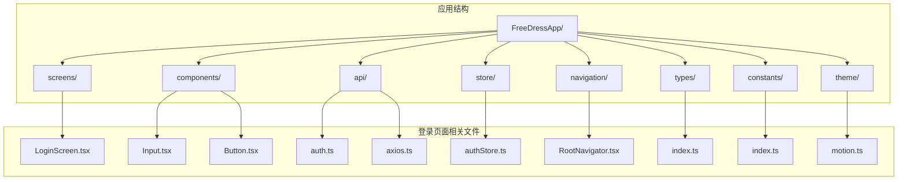
```mermaid
graph TB
subgraph "应用结构"
A[FreeDressApp/] --> B[screens/]
A --> C[components/]
A --> D[api/]
A --> E[store/]
A --> F[navigation/]
A --> G[theme/]
A --> H[types/]
A --> I[constants/]
end
subgraph "登录页面相关文件"
B --> J[LoginScreen.tsx]
C --> K[Input.tsx]
C --> L[Button.tsx]
D --> M[auth.ts]
D --> N[axios.ts]
E --> O[authStore.ts]
F --> P[RootNavigator.tsx]
H --> Q[index.ts]
I --> R[index.ts]
G --> S[motion.ts]
end
```

**图表来源**
- [LoginScreen.tsx:1-324](file://FreeDressApp/src/screens/LoginScreen.tsx#L1-L324)
- [auth.ts:1-101](file://FreeDressApp/src/api/auth.ts#L1-L101)
- [authStore.ts:1-123](file://FreeDressApp/src/store/authStore.ts#L1-L123)

**章节来源**
- [LoginScreen.tsx:1-324](file://FreeDressApp/src/screens/LoginScreen.tsx#L1-L324)
- [auth.ts:1-101](file://FreeDressApp/src/api/auth.ts#L1-L101)
- [authStore.ts:1-123](file://FreeDressApp/src/store/authStore.ts#L1-L123)

## 核心组件

登录页面由多个精心设计的组件构成，每个组件都有明确的职责和功能：

### 主要组件架构

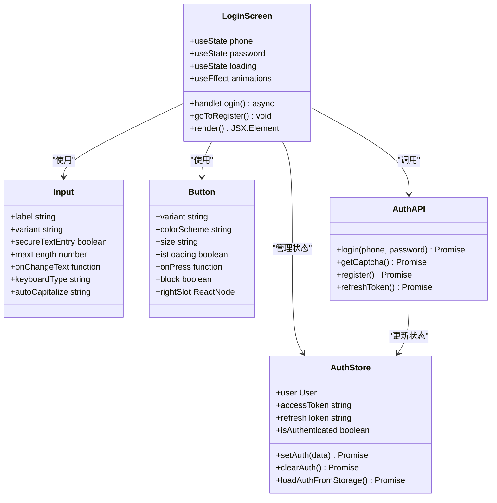
```mermaid
classDiagram
class LoginScreen {
+useState phone
+useState password
+useState loading
+useEffect animations
+handleLogin() async
+goToRegister() void
+render() JSX.Element
}
class Input {
+label string
+variant string
+secureTextEntry boolean
+maxLength number
+onChangeText function
+keyboardType string
+autoCapitalize string
}
class Button {
+variant string
+colorScheme string
+size string
+isLoading boolean
+onPress function
+block boolean
+rightSlot ReactNode
}
class AuthAPI {
+login(phone, password) Promise
+getCaptcha() Promise
+register() Promise
+refreshToken() Promise
}
class AuthStore {
+user User
+accessToken string
+refreshToken string
+isAuthenticated boolean
+setAuth(data) Promise
+clearAuth() Promise
+loadAuthFromStorage() Promise
}
LoginScreen --> Input : "使用"
LoginScreen --> Button : "使用"
LoginScreen --> AuthAPI : "调用"
LoginScreen --> AuthStore : "管理状态"
AuthAPI --> AuthStore : "更新状态"
```

**图表来源**
- [LoginScreen.tsx:44-210](file://FreeDressApp/src/screens/LoginScreen.tsx#L44-L210)
- [Input.tsx:33-140](file://FreeDressApp/src/components/Input.tsx#L33-L140)
- [Button.tsx:49-133](file://FreeDressApp/src/components/Button.tsx#L49-L133)
- [auth.ts:45-53](file://FreeDressApp/src/api/auth.ts#L45-L53)
- [authStore.ts:28-122](file://FreeDressApp/src/store/authStore.ts#L28-L122)

### 数据流架构

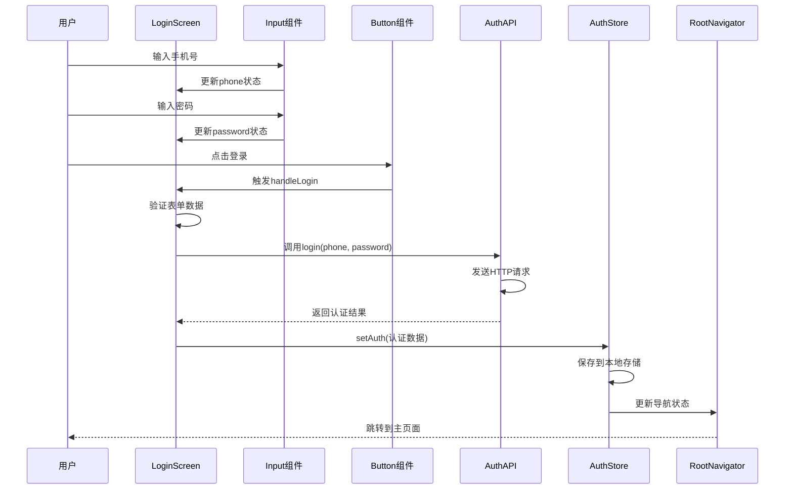
```mermaid
sequenceDiagram
participant User as 用户
participant Login as LoginScreen
participant Input as Input组件
participant Button as Button组件
participant API as AuthAPI
participant Store as AuthStore
participant Navigator as RootNavigator
User->>Input : 输入手机号
Input->>Login : 更新phone状态
User->>Input : 输入密码
Input->>Login : 更新password状态
User->>Button : 点击登录
Button->>Login : 触发handleLogin
Login->>Login : 验证表单数据
Login->>API : 调用login(phone, password)
API->>API : 发送HTTP请求
API-->>Login : 返回认证结果
Login->>Store : setAuth(认证数据)
Store->>Store : 保存到本地存储
Store->>Navigator : 更新导航状态
Navigator-->>User : 跳转到主页面
```

**图表来源**
- [LoginScreen.tsx:74-92](file://FreeDressApp/src/screens/LoginScreen.tsx#L74-L92)
- [auth.ts:45-53](file://FreeDressApp/src/api/auth.ts#L45-L53)
- [authStore.ts:39-57](file://FreeDressApp/src/store/authStore.ts#L39-L57)
- [RootNavigator.tsx:42-84](file://FreeDressApp/src/navigation/RootNavigator.tsx#L42-L84)

**章节来源**
- [LoginScreen.tsx:44-210](file://FreeDressApp/src/screens/LoginScreen.tsx#L44-L210)
- [Input.tsx:33-140](file://FreeDressApp/src/components/Input.tsx#L33-L140)
- [Button.tsx:49-133](file://FreeDressApp/src/components/Button.tsx#L49-L133)

## 架构概览

登录页面采用了现代化的React Native架构模式，结合了状态管理、API通信和导航系统：

### 整体架构设计

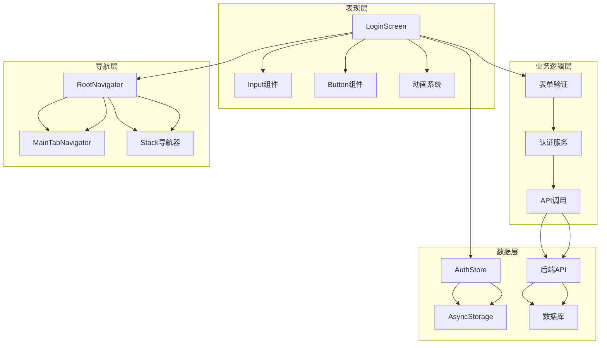
```mermaid
graph TB
subgraph "表现层"
A[LoginScreen] --> B[Input组件]
A --> C[Button组件]
A --> D[动画系统]
end
subgraph "业务逻辑层"
E[表单验证] --> F[认证服务]
F --> G[API调用]
end
subgraph "数据层"
H[AuthStore] --> I[AsyncStorage]
G --> J[后端API]
J --> K[数据库]
end
subgraph "导航层"
L[RootNavigator] --> M[MainTabNavigator]
L --> N[Stack导航器]
end
A --> E
A --> H
A --> L
H --> I
G --> J
J --> K
L --> M
L --> N
```

**图表来源**
- [LoginScreen.tsx:44-210](file://FreeDressApp/src/screens/LoginScreen.tsx#L44-L210)
- [authStore.ts:28-122](file://FreeDressApp/src/store/authStore.ts#L28-L122)
- [RootNavigator.tsx:41-85](file://FreeDressApp/src/navigation/RootNavigator.tsx#L41-L85)

### 状态管理模式

登录页面使用Zustand进行状态管理，实现了全局状态的集中管理：

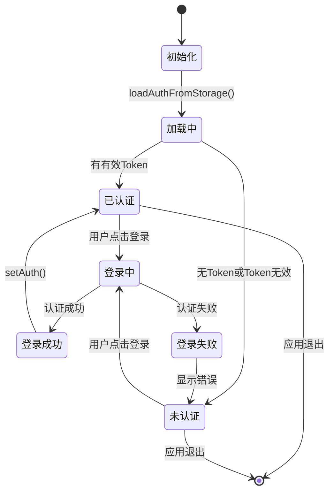
```mermaid
stateDiagram-v2
[*] --> 初始化
初始化 --> 加载中 : loadAuthFromStorage()
加载中 --> 已认证 : 有有效Token
加载中 --> 未认证 : 无Token或Token无效
已认证 --> 登录中 : 用户点击登录
未认证 --> 登录中 : 用户点击登录
登录中 --> 登录成功 : 认证成功
登录中 --> 登录失败 : 认证失败
登录成功 --> 已认证 : setAuth()
登录失败 --> 未认证 : 显示错误
已认证 --> [*] : 应用退出
未认证 --> [*] : 应用退出
```

**图表来源**
- [authStore.ts:28-122](file://FreeDressApp/src/store/authStore.ts#L28-L122)
- [LoginScreen.tsx:74-92](file://FreeDressApp/src/screens/LoginScreen.tsx#L74-L92)

**章节来源**
- [authStore.ts:28-122](file://FreeDressApp/src/store/authStore.ts#L28-L122)
- [RootNavigator.tsx:41-85](file://FreeDressApp/src/navigation/RootNavigator.tsx#L41-L85)

## 详细组件分析

### LoginScreen 组件分析

LoginScreen是登录页面的核心组件，负责协调所有认证相关的功能和交互。

#### 组件结构和状态管理

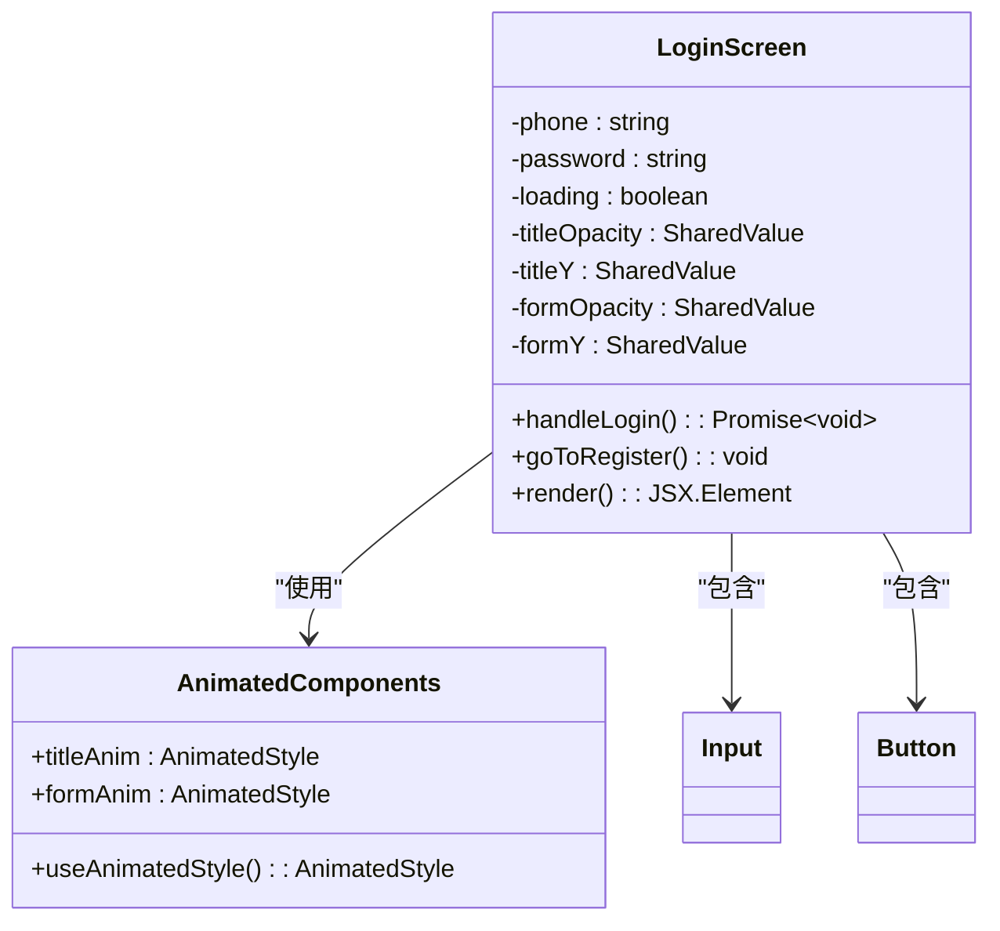
```mermaid
classDiagram
class LoginScreen {
-phone : string
-password : string
-loading : boolean
-titleOpacity : SharedValue
-titleY : SharedValue
-formOpacity : SharedValue
-formY : SharedValue
+handleLogin() : Promise~void~
+goToRegister() : void
+render() : JSX.Element
}
class AnimatedComponents {
+titleAnim : AnimatedStyle
+formAnim : AnimatedStyle
+useAnimatedStyle() : AnimatedStyle
}
LoginScreen --> AnimatedComponents : "使用"
LoginScreen --> Input : "包含"
LoginScreen --> Button : "包含"
```

**图表来源**
- [LoginScreen.tsx:44-72](file://FreeDressApp/src/screens/LoginScreen.tsx#L44-L72)
- [LoginScreen.tsx:136-200](file://FreeDressApp/src/screens/LoginScreen.tsx#L136-L200)

#### 表单验证逻辑

登录页面实现了多层次的表单验证机制：

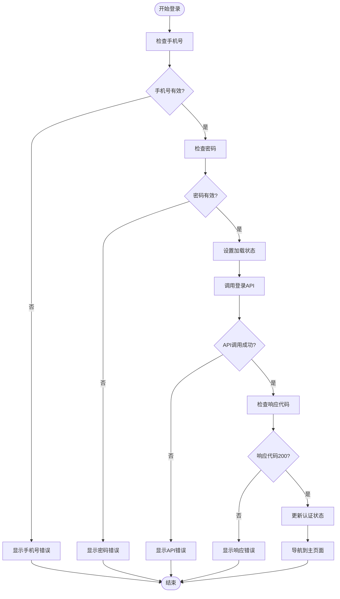
```mermaid
flowchart TD
Start([开始登录]) --> CheckPhone["检查手机号"]
CheckPhone --> PhoneValid{"手机号有效?"}
PhoneValid --> |否| ShowPhoneError["显示手机号错误"]
PhoneValid --> |是| CheckPassword["检查密码"]
CheckPassword --> PasswordValid{"密码有效?"}
PasswordValid --> |否| ShowPasswordError["显示密码错误"]
PasswordValid --> |是| SetLoading["设置加载状态"]
ShowPhoneError --> End([结束])
ShowPasswordError --> End
SetLoading --> CallAPI["调用登录API"]
CallAPI --> APISuccess{"API调用成功?"}
APISuccess --> |否| ShowAPIError["显示API错误"]
APISuccess --> |是| CheckResponseCode["检查响应代码"]
CheckResponseCode --> ResponseOK{"响应代码200?"}
ResponseOK --> |否| ShowResponseError["显示响应错误"]
ResponseOK --> |是| UpdateAuth["更新认证状态"]
UpdateAuth --> Navigate["导航到主页面"]
Navigate --> End
ShowAPIError --> End
ShowResponseError --> End
```

**图表来源**
- [LoginScreen.tsx:74-92](file://FreeDressApp/src/screens/LoginScreen.tsx#L74-L92)

#### 动画系统实现

LoginScreen使用Reanimated库实现了流畅的动画效果：

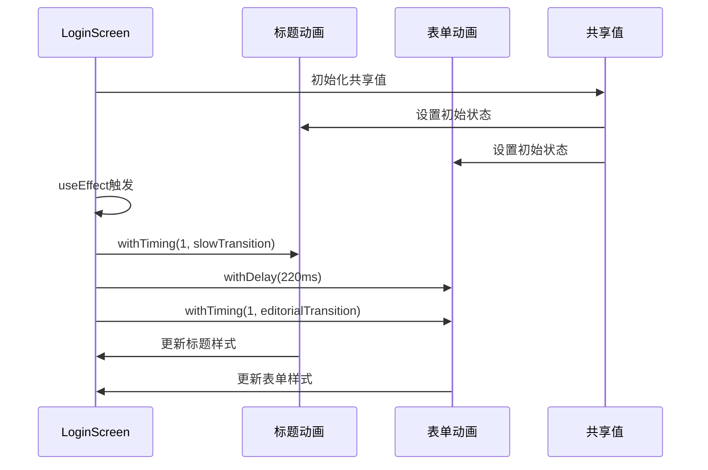
```mermaid
sequenceDiagram
participant Component as LoginScreen
participant TitleAnim as 标题动画
participant FormAnim as 表单动画
participant SharedValues as 共享值
Component->>SharedValues : 初始化共享值
SharedValues->>TitleAnim : 设置初始状态
SharedValues->>FormAnim : 设置初始状态
Component->>Component : useEffect触发
Component->>TitleAnim : withTiming(1, slowTransition)
Component->>FormAnim : withDelay(220ms)
Component->>FormAnim : withTiming(1, editorialTransition)
TitleAnim->>Component : 更新标题样式
FormAnim->>Component : 更新表单样式
```

**图表来源**
- [LoginScreen.tsx:58-63](file://FreeDressApp/src/screens/LoginScreen.tsx#L58-L63)
- [motion.ts:8-28](file://FreeDressApp/src/theme/motion.ts#L8-L28)

**章节来源**
- [LoginScreen.tsx:44-210](file://FreeDressApp/src/screens/LoginScreen.tsx#L44-L210)
- [motion.ts:1-32](file://FreeDressApp/src/theme/motion.ts#L1-L32)

### Input 组件分析

Input组件是登录页面的基础输入控件，提供了多种样式变体和交互反馈。

#### 组件特性

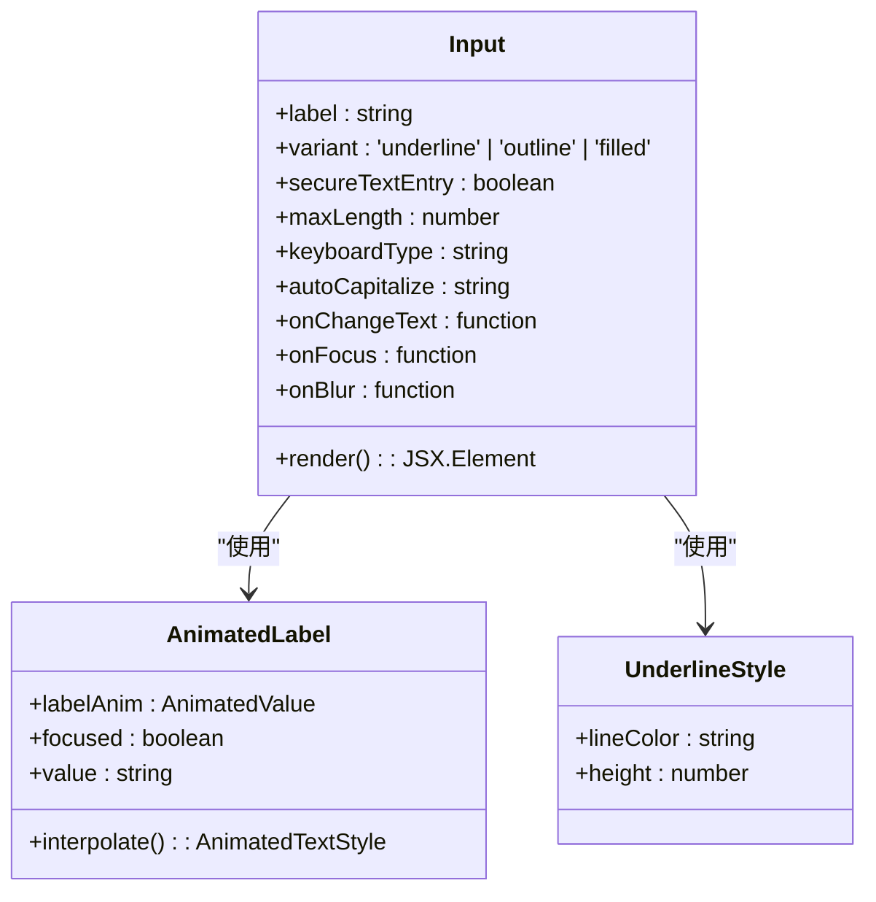
```mermaid
classDiagram
class Input {
+label : string
+variant : 'underline' | 'outline' | 'filled'
+secureTextEntry : boolean
+maxLength : number
+keyboardType : string
+autoCapitalize : string
+onChangeText : function
+onFocus : function
+onBlur : function
+render() : JSX.Element
}
class AnimatedLabel {
+labelAnim : AnimatedValue
+focused : boolean
+value : string
+interpolate() : AnimatedTextStyle
}
class UnderlineStyle {
+lineColor : string
+height : number
}
Input --> AnimatedLabel : "使用"
Input --> UnderlineStyle : "使用"
```

**图表来源**
- [Input.tsx:33-140](file://FreeDressApp/src/components/Input.tsx#L33-L140)

#### 浮动标签动画

Input组件实现了智能的浮动标签动画系统：

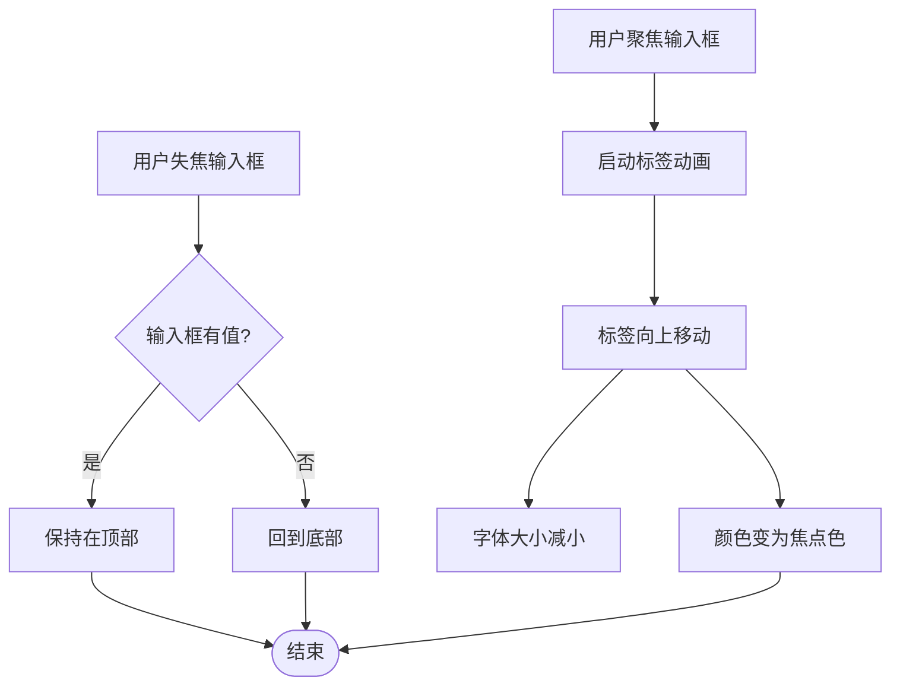
```mermaid
flowchart TD
Focus[用户聚焦输入框] --> AnimateLabel["启动标签动画"]
Blur[用户失焦输入框] --> CheckValue{"输入框有值?"}
CheckValue --> |是| KeepLabel["保持在顶部"]
CheckValue --> |否| ResetLabel["回到底部"]
AnimateLabel --> MoveUp["标签向上移动"]
MoveUp --> ShrinkFont["字体大小减小"]
MoveUp --> ChangeColor["颜色变为焦点色"]
KeepLabel --> End([结束])
ResetLabel --> End
ChangeColor --> End
```

**图表来源**
- [Input.tsx:52-59](file://FreeDressApp/src/components/Input.tsx#L52-L59)

**章节来源**
- [Input.tsx:1-183](file://FreeDressApp/src/components/Input.tsx#L1-L183)

### Button 组件分析

Button组件提供了丰富的样式变体和交互反馈，特别适合登录页面的按钮需求。

#### 按钮变体系统

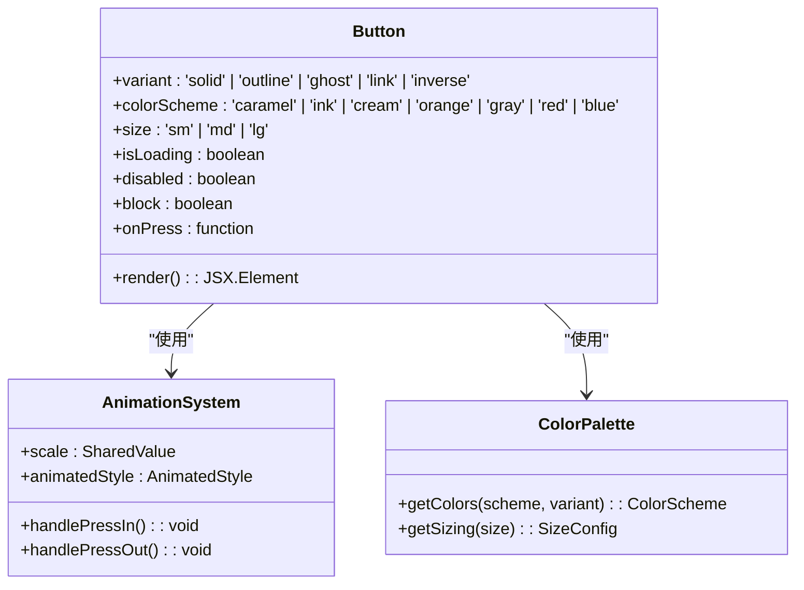
```mermaid
classDiagram
class Button {
+variant : 'solid' | 'outline' | 'ghost' | 'link' | 'inverse'
+colorScheme : 'caramel' | 'ink' | 'cream' | 'orange' | 'gray' | 'red' | 'blue'
+size : 'sm' | 'md' | 'lg'
+isLoading : boolean
+disabled : boolean
+block : boolean
+onPress : function
+render() : JSX.Element
}
class AnimationSystem {
+scale : SharedValue
+handlePressIn() : void
+handlePressOut() : void
+animatedStyle : AnimatedStyle
}
class ColorPalette {
+getColors(scheme, variant) : ColorScheme
+getSizing(size) : SizeConfig
}
Button --> AnimationSystem : "使用"
Button --> ColorPalette : "使用"
```

**图表来源**
- [Button.tsx:49-133](file://FreeDressApp/src/components/Button.tsx#L49-L133)

#### 按压反馈动画

Button组件实现了细腻的按压反馈动画：

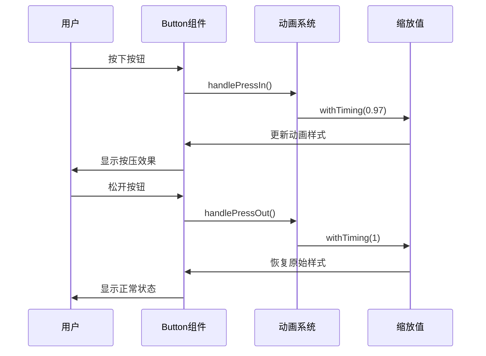
```mermaid
sequenceDiagram
participant User as 用户
participant Button as Button组件
participant Animation as 动画系统
participant Scale as 缩放值
User->>Button : 按下按钮
Button->>Animation : handlePressIn()
Animation->>Scale : withTiming(0.97)
Scale->>Button : 更新动画样式
Button->>User : 显示按压效果
User->>Button : 松开按钮
Button->>Animation : handlePressOut()
Animation->>Scale : withTiming(1)
Scale->>Button : 恢复原始样式
Button->>User : 显示正常状态
```

**图表来源**
- [Button.tsx:73-78](file://FreeDressApp/src/components/Button.tsx#L73-L78)

**章节来源**
- [Button.tsx:1-201](file://FreeDressApp/src/components/Button.tsx#L1-L201)

### API 通信层分析

登录页面的API通信层基于Axios封装，提供了统一的认证接口。

#### 认证API接口

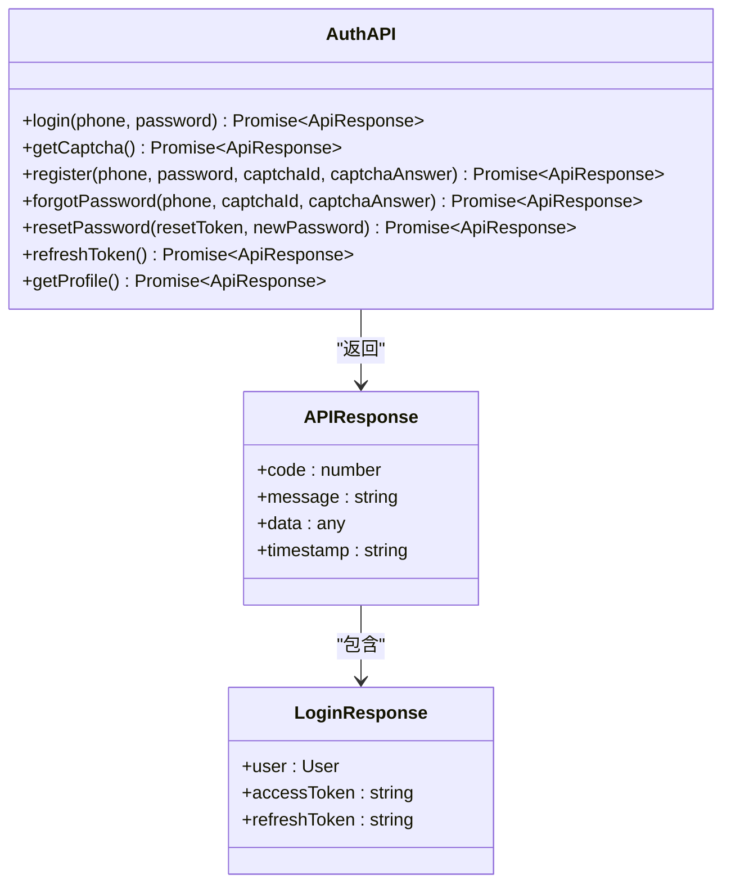
```mermaid
classDiagram
class AuthAPI {
+login(phone, password) Promise~ApiResponse~
+getCaptcha() Promise~ApiResponse~
+register(phone, password, captchaId, captchaAnswer) Promise~ApiResponse~
+forgotPassword(phone, captchaId, captchaAnswer) Promise~ApiResponse~
+resetPassword(resetToken, newPassword) Promise~ApiResponse~
+refreshToken() Promise~ApiResponse~
+getProfile() Promise~ApiResponse~
}
class APIResponse {
+code : number
+message : string
+data : any
+timestamp : string
}
class LoginResponse {
+user : User
+accessToken : string
+refreshToken : string
}
AuthAPI --> APIResponse : "返回"
APIResponse --> LoginResponse : "包含"
```

**图表来源**
- [auth.ts:45-101](file://FreeDressApp/src/api/auth.ts#L45-L101)
- [index.ts:58-71](file://FreeDressApp/src/types/index.ts#L58-L71)

#### Token管理机制

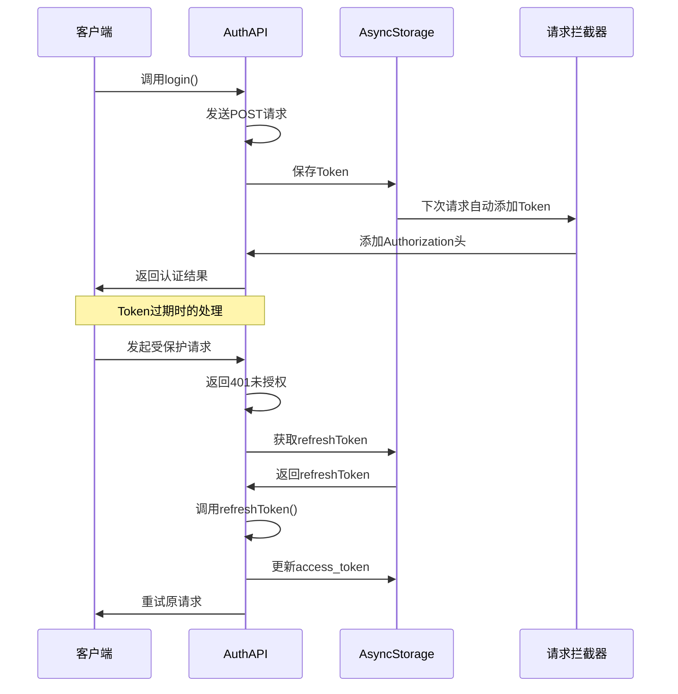
```mermaid
sequenceDiagram
participant Client as 客户端
participant API as AuthAPI
participant Storage as AsyncStorage
participant Interceptor as 请求拦截器
Client->>API : 调用login()
API->>API : 发送POST请求
API->>Storage : 保存Token
Storage->>Interceptor : 下次请求自动添加Token
Interceptor->>API : 添加Authorization头
API->>Client : 返回认证结果
Note over Client,API : Token过期时的处理
Client->>API : 发起受保护请求
API->>API : 返回401未授权
API->>Storage : 获取refreshToken
Storage->>API : 返回refreshToken
API->>API : 调用refreshToken()
API->>Storage : 更新access_token
API->>Client : 重试原请求
```

**图表来源**
- [auth.ts:45-53](file://FreeDressApp/src/api/auth.ts#L45-L53)
- [axios.ts:24-105](file://FreeDressApp/src/api/axios.ts#L24-L105)

**章节来源**
- [auth.ts:1-101](file://FreeDressApp/src/api/auth.ts#L1-L101)
- [axios.ts:1-108](file://FreeDressApp/src/api/axios.ts#L1-L108)

### 状态管理分析

AuthStore使用Zustand实现了轻量级的状态管理，专门处理用户认证相关的状态。

#### 状态管理模式

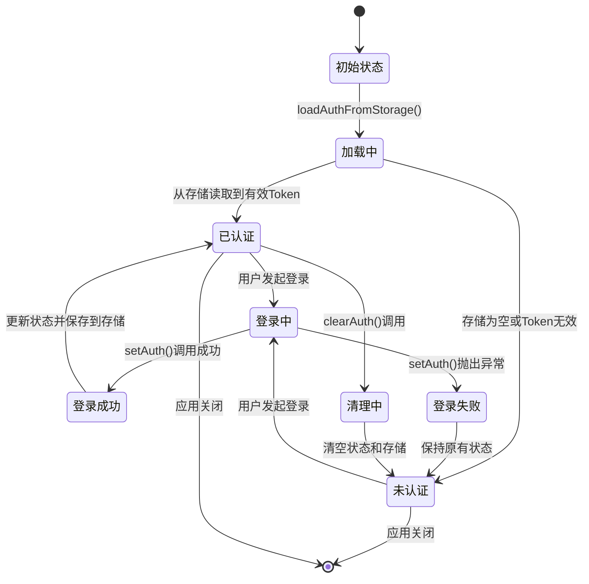
```mermaid
stateDiagram-v2
[*] --> 初始状态
初始状态 --> 加载中 : loadAuthFromStorage()
加载中 --> 已认证 : 从存储读取到有效Token
加载中 --> 未认证 : 存储为空或Token无效
已认证 --> 登录中 : 用户发起登录
未认证 --> 登录中 : 用户发起登录
登录中 --> 登录成功 : setAuth()调用成功
登录中 --> 登录失败 : setAuth()抛出异常
登录成功 --> 已认证 : 更新状态并保存到存储
登录失败 --> 未认证 : 保持原有状态
已认证 --> 清理中 : clearAuth()调用
清理中 --> 未认证 : 清空状态和存储
未认证 --> [*] : 应用关闭
已认证 --> [*] : 应用关闭
```

**图表来源**
- [authStore.ts:28-122](file://FreeDressApp/src/store/authStore.ts#L28-L122)

#### 本地存储策略

AuthStore实现了智能的本地存储管理：

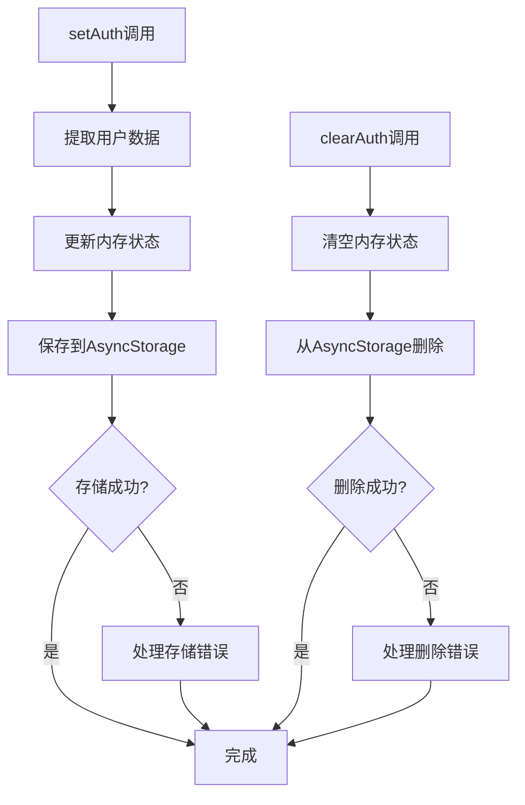
```mermaid
flowchart TD
SetAuth[setAuth调用] --> ExtractData["提取用户数据"]
ExtractData --> UpdateState["更新内存状态"]
UpdateState --> SaveToStorage["保存到AsyncStorage"]
SaveToStorage --> StorageSuccess{"存储成功?"}
StorageSuccess --> |是| Complete[完成]
StorageSuccess --> |否| HandleError["处理存储错误"]
HandleError --> Complete
ClearAuth[clearAuth调用] --> ClearState["清空内存状态"]
ClearState --> RemoveFromStorage["从AsyncStorage删除"]
RemoveFromStorage --> RemoveSuccess{"删除成功?"}
RemoveSuccess --> |是| Complete
RemoveSuccess --> |否| HandleError2["处理删除错误"]
HandleError2 --> Complete
```

**图表来源**
- [authStore.ts:39-78](file://FreeDressApp/src/store/authStore.ts#L39-L78)

**章节来源**
- [authStore.ts:1-123](file://FreeDressApp/src/store/authStore.ts#L1-L123)

## 依赖关系分析

登录页面的依赖关系体现了清晰的关注点分离和模块化设计。

### 核心依赖关系

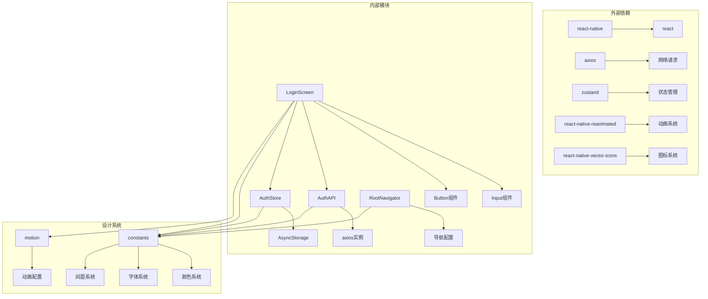
```mermaid
graph TB
subgraph "外部依赖"
A[react-native] --> B[react]
C[axios] --> D[网络请求]
E[zustand] --> F[状态管理]
G[react-native-reanimated] --> H[动画系统]
I[react-native-vector-icons] --> J[图标系统]
end
subgraph "内部模块"
K[LoginScreen] --> L[Input组件]
K --> M[Button组件]
K --> N[AuthAPI]
K --> O[AuthStore]
N --> P[axios实例]
O --> Q[AsyncStorage]
R[RootNavigator] --> S[导航配置]
end
subgraph "设计系统"
T[constants] --> U[颜色系统]
T --> V[字体系统]
T --> W[间距系统]
X[motion] --> Y[动画配置]
end
K --> T
K --> X
N --> T
O --> T
R --> T
```

**图表来源**
- [package.json:12-31](file://FreeDressApp/package.json#L12-L31)
- [LoginScreen.tsx:26-42](file://FreeDressApp/src/screens/LoginScreen.tsx#L26-L42)
- [authStore.ts:1-4](file://FreeDressApp/src/store/authStore.ts#L1-L4)

### 类型安全设计

登录页面充分利用TypeScript的类型系统确保代码质量：

```mermaid
classDiagram
class User {
+id : string
+phone : string
+nickname : string
+avatarUrl? : string
+role : UserRole
+createdAt : string
}
class LoginResponse {
+user : User
+accessToken : string
+refreshToken : string
}
class ApiResponse~T~ {
+code : number
+message : string
+data : T
+timestamp : string
}
class RootStackParamList {
+Login : undefined
+Register : undefined
+ForgotPassword : undefined
+ResetPassword : {resetToken : string}
+Main : undefined
}
User <|-- LoginResponse : "包含"
ApiResponse <|-- LoginResponse : "包装"
RootStackParamList --> LoginResponse : "导航参数"
```

**图表来源**
- [index.ts:8-71](file://FreeDressApp/src/types/index.ts#L8-L71)
- [index.ts:74-84](file://FreeDressApp/src/types/index.ts#L74-L84)

**章节来源**
- [package.json:1-57](file://FreeDressApp/package.json#L1-L57)
- [index.ts:1-98](file://FreeDressApp/src/types/index.ts#L1-L98)

## 性能考虑

登录页面在设计时充分考虑了性能优化，采用了多种策略来提升用户体验：

### 动画性能优化

- 使用Reanimated 4的Worklet系统，将动画计算移到原生线程
- 合理使用withTiming和withDelay减少不必要的重排
- 通过共享值避免频繁的状态更新导致的重渲染

### 网络请求优化

- 实现请求拦截器自动添加认证头，避免重复代码
- 集成Token刷新机制，减少频繁的重新登录
- 使用Axios超时配置，防止请求挂起影响用户体验

### 内存管理

- 使用Zustand替代Redux，减少不必要的状态订阅
- 合理的组件卸载时机，避免内存泄漏
- AsyncStroage的批量操作，减少I/O开销

## 故障排除指南

### 常见问题及解决方案

#### 登录失败问题

**问题描述**: 用户输入正确的凭据但仍无法登录

**可能原因**:
1. 网络连接问题
2. 服务器认证服务异常
3. Token过期或损坏
4. 前端状态同步问题

**解决步骤**:
1. 检查网络连接状态
2. 验证服务器是否正常运行
3. 清除本地存储的Token
4. 重启应用重新登录

#### 表单验证问题

**问题描述**: 表单验证规则不生效或显示错误

**可能原因**:
1. 正则表达式配置错误
2. 状态更新时机问题
3. 组件重新渲染问题

**解决步骤**:
1. 检查手机号正则表达式
2. 验证状态更新逻辑
3. 确认组件生命周期

#### 动画卡顿问题

**问题描述**: 登录页面动画效果不流畅

**可能原因**:
1. 动画配置不当
2. 设备性能不足
3. 过多的重渲染

**解决步骤**:
1. 调整动画时长和缓动函数
2. 减少不必要的动画
3. 优化组件结构

**章节来源**
- [LoginScreen.tsx:74-92](file://FreeDressApp/src/screens/LoginScreen.tsx#L74-L92)
- [authStore.ts:117-121](file://FreeDressApp/src/store/authStore.ts#L117-L121)

## 结论

登录页面作为畅搭(FreeDress)应用的重要入口，展现了现代移动应用开发的最佳实践。通过精心设计的组件架构、完善的表单验证机制、健壮的认证流程和优雅的动画效果，为用户提供了优质的登录体验。

### 主要优势

1. **设计理念独特**: 融合了杂志风格与现代UI设计，营造出独特的品牌氛围
2. **技术架构先进**: 采用React Native、TypeScript、Zustand等现代技术栈
3. **用户体验优秀**: 完善的表单验证、流畅的动画效果和友好的错误处理
4. **安全性可靠**: 实现了完整的Token管理、防重复提交和会话控制
5. **可维护性强**: 清晰的模块划分、完善的类型定义和良好的代码组织

### 改进建议

1. **增强错误处理**: 可以添加更详细的错误分类和用户友好的错误消息
2. **性能监控**: 集成性能监控工具，持续优化应用性能
3. **国际化支持**: 为多语言用户提供更好的支持
4. **无障碍访问**: 增强对残障用户的访问支持

登录页面不仅是一个功能组件，更是畅搭应用设计理念和技术实力的体现，为后续的功能扩展奠定了坚实的基础。