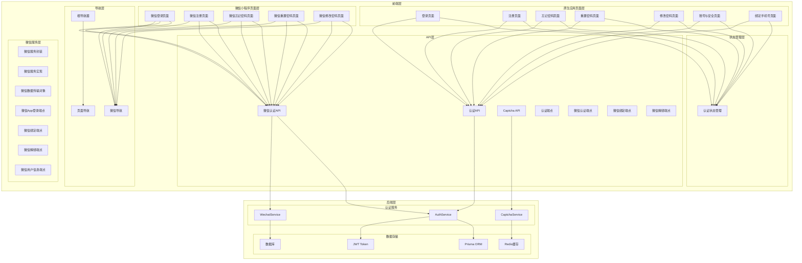
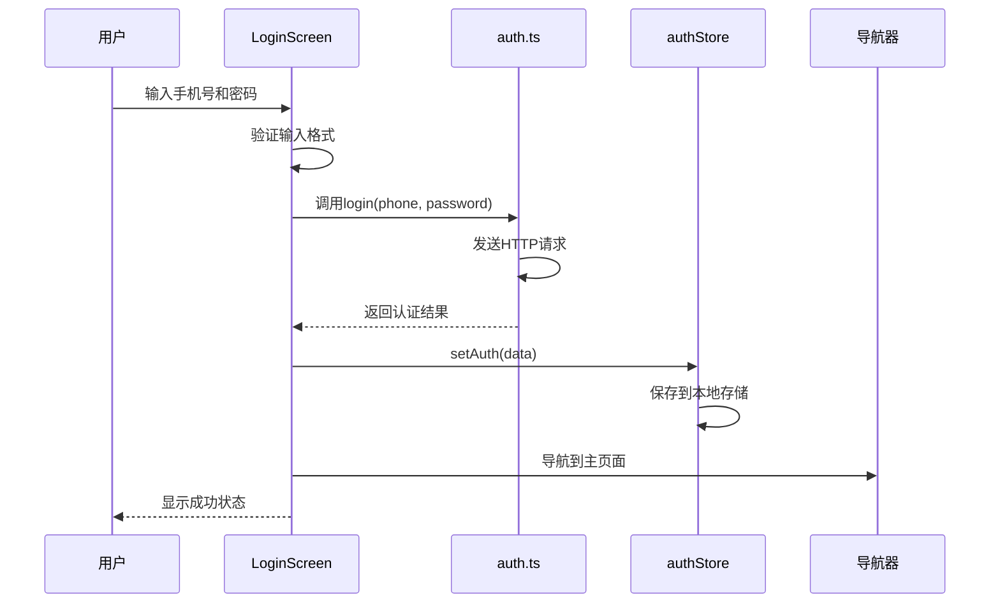
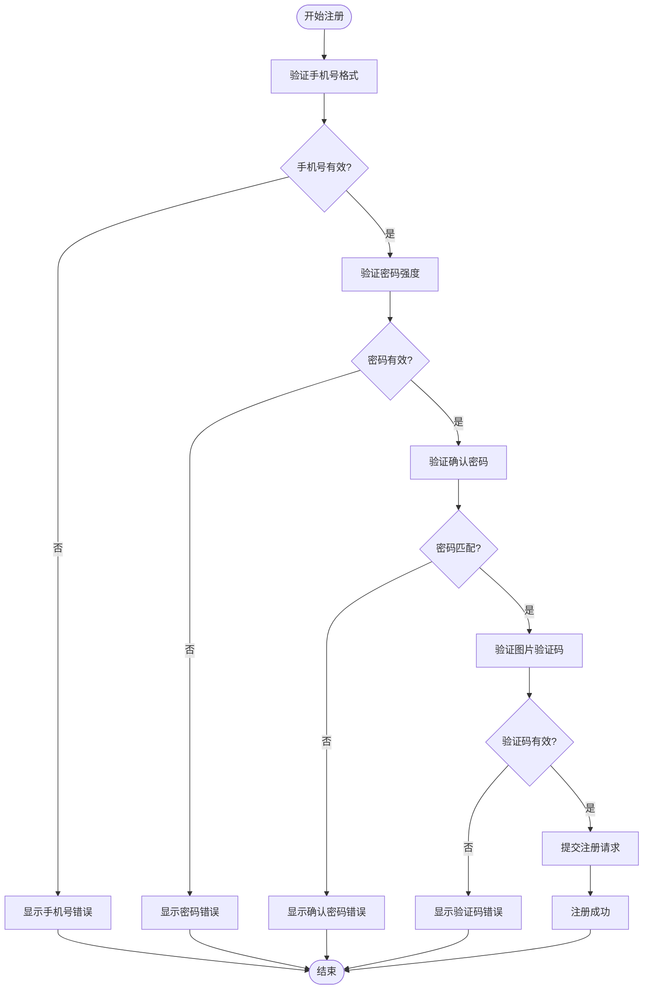
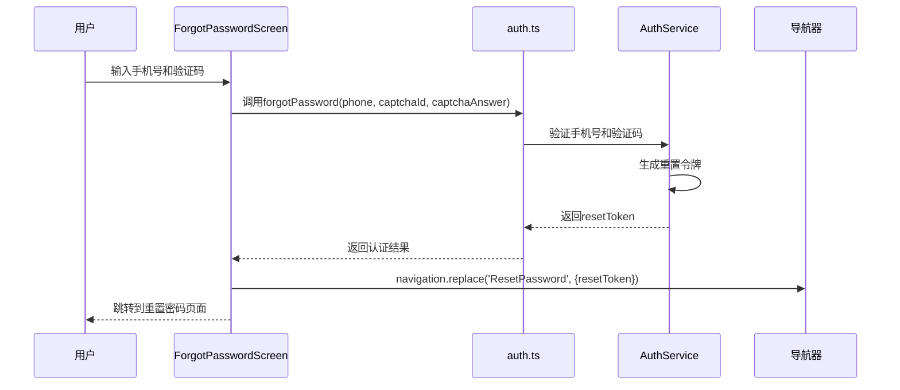
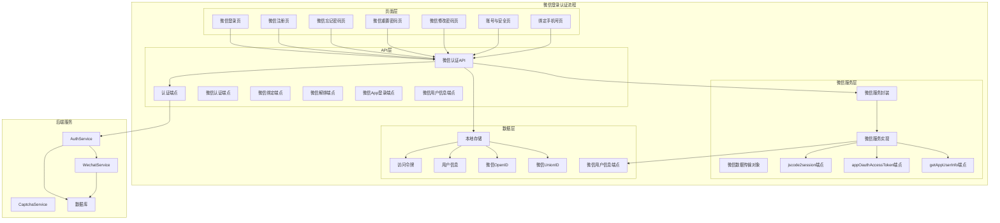

# 认证页面

<cite>
**本文档引用的文件**
- [LoginScreen.tsx](file://FreeDressApp/src/screens/LoginScreen.tsx)
- [RegisterScreen.tsx](file://FreeDressApp/src/screens/RegisterScreen.tsx)
- [ForgotPasswordScreen.tsx](file://FreeDressApp/src/screens/ForgotPasswordScreen.tsx)
- [ResetPasswordScreen.tsx](file://FreeDressApp/src/screens/ResetPasswordScreen.tsx)
- [ChangePasswordScreen.tsx](file://FreeDressApp/src/screens/ChangePasswordScreen.tsx)
- [AccountSecurityScreen.tsx](file://FreeDressApp/src/screens/AccountSecurityScreen.tsx)
- [BindPhoneScreen.tsx](file://FreeDressApp/src/screens/BindPhoneScreen.tsx)
- [auth.ts](file://FreeDressApp/src/api/auth.ts)
- [authStore.ts](file://FreeDressApp/src/store/authStore.ts)
- [RootNavigator.tsx](file://FreeDressApp/src/navigation/RootNavigator.tsx)
- [wechat.ts](file://FreeDressApp/src/services/wechat.ts)
- [Input.tsx](file://FreeDressApp/src/components/Input.tsx)
- [index.ts](file://FreeDressApp/src/types/index.ts)
- [index.ts](file://FreeDressApp/src/constants/index.ts)
- [motion.ts](file://FreeDressApp/src/theme/motion.ts)
- [auth.service.ts](file://backend/src/modules/auth/auth.service.ts)
- [wechat.service.ts](file://backend/src/modules/auth/wechat.service.ts)
- [wechat.dto.ts](file://backend/src/modules/auth/dto/wechat.dto.ts)
- [captcha.service.ts](file://backend/src/modules/auth/captcha.service.ts)
- [login.js](file://freeDressWechat/pages/login/login.js)
- [api.js](file://freeDressWechat/utils/api.js)
- [changePassword.js](file://freeDressWechat/pages/changePassword/changePassword.js)
- [forgotPassword.js](file://freeDressWechat/pages/forgotPassword/forgotPassword.js)
- [resetPassword.js](file://freeDressWechat/pages/resetPassword/resetPassword.js)
- [app.json](file://freeDressWechat/app.json)
- [project.config.json](file://freeDressWechat/project.config.json)
</cite>

## 更新摘要
**所做更改**
- 新增微信登录页面和相关认证页面支持，包括AccountSecurityScreen和BindPhoneScreen等新页面
- 添加微信登录功能的完整实现，包括微信授权、绑定和解绑功能
- 更新认证系统架构以反映微信登录集成
- 新增微信登录的API接口和后端服务支持
- 扩展认证页面组的功能，支持手机号绑定和微信账号管理

## 目录
1. [简介](#简介)
2. [项目结构](#项目结构)
3. [核心组件](#核心组件)
4. [架构概览](#架构概览)
5. [详细组件分析](#详细组件分析)
6. [微信登录系统](#微信登录系统)
7. [依赖关系分析](#依赖关系分析)
8. [性能考量](#性能考量)
9. [故障排除指南](#故障排除指南)
10. [结论](#结论)

## 简介

畅搭(FreeDress)应用的认证页面组提供了完整的用户身份验证体验，包括登录、注册、忘记密码、重置密码、修改密码以及微信登录和账号安全管理五个核心页面组。这些页面采用统一的Editorial Couture设计语言，结合现代化的React Native技术栈，实现了流畅的用户体验和严格的安全保障。

**更新** 新增微信小程序认证系统支持和原生应用微信登录功能，实现了跨平台的一致认证体验。微信登录版本包含完整的认证流程，与原生应用共享相同的后端服务和安全机制。新增的AccountSecurityScreen和BindPhoneScreen页面提供了微信账号绑定、手机号绑定和账号安全管理功能。

本认证系统基于JWT令牌认证机制，配合图片验证码验证、密码加密存储和防暴力破解措施，确保用户账户的安全性和系统的稳定性。页面间导航采用React Navigation，支持参数传递和状态管理，为用户提供无缝的认证流程体验。

## 项目结构

认证页面组位于FreeDressApp/src/screens目录下，采用按功能模块组织的文件结构：

```mermaid
graph TB
subgraph "原生应用认证页面组"
LS[LoginScreen.tsx<br/>登录页]
RS[RegisterScreen.tsx<br/>注册页]
FPS[ForgotPasswordScreen.tsx<br/>忘记密码页]
RPS[ResetPasswordScreen.tsx<br/>重置密码页]
CPS[ChangePasswordScreen.tsx<br/>修改密码页]
ASS[AccountSecurityScreen.tsx<br/>账号与安全页]
BPS[BindPhoneScreen.tsx<br/>绑定手机号页]
end
subgraph "微信小程序认证页面组"
WLS[login.js<br/>微信登录页]
WRS[register.js<br/>微信注册页]
WFPS[forgotPassword.js<br/>微信忘记密码页]
WRPS[resetPassword.js<br/>微信重置密码页]
WCPS[changePassword.js<br/>微信修改密码页]
end
subgraph "API层"
API[auth.ts<br/>认证API]
WAPI[api.js<br/>微信API]
AX[axios.ts<br/>HTTP客户端]
end
subgraph "状态管理"
AS[authStore.ts<br/>认证状态]
ZU[Zustand<br/>状态库]
end
subgraph "导航系统"
RN[RootNavigator.tsx<br/>根导航器]
TS[types/index.ts<br/>类型定义]
end
subgraph "微信服务层"
WS[wechat.ts<br/>微信服务]
WSS[wechat.service.ts<br/>微信服务实现]
WSD[wechat.dto.ts<br/>微信数据传输对象]
end
subgraph "UI组件"
IN[Input.tsx<br/>输入组件]
BTN[Button.tsx<br/>按钮组件]
CMP[components/<br/>其他组件]
end
LS --> API
RS --> API
FPS --> API
RPS --> API
CPS --> API
ASS --> API
BPS --> API
WLS --> WAPI
WRS --> WAPI
WFPS --> WAPI
WRPS --> WAPI
WCPS --> WAPI
API --> AX
WAPI --> AX
ASS --> WS
BPS --> API
LS --> AS
RS --> AS
AS --> ZU
LS --> RN
RS --> RN
FPS --> RN
RPS --> RN
CPS --> RN
ASS --> RN
BPS --> RN
WLS --> WAPI
WRS --> WAPI
WFPS --> WAPI
WRPS --> WAPI
WCPS --> WAPI
LS --> IN
RS --> IN
FPS --> IN
RPS --> IN
CPS --> IN
ASS --> IN
BPS --> IN
```

**图表来源**
- [LoginScreen.tsx:1-327](file://FreeDressApp/src/screens/LoginScreen.tsx#L1-L327)
- [RegisterScreen.tsx:1-359](file://FreeDressApp/src/screens/RegisterScreen.tsx#L1-L359)
- [ForgotPasswordScreen.tsx:1-304](file://FreeDressApp/src/screens/ForgotPasswordScreen.tsx#L1-L304)
- [ResetPasswordScreen.tsx:1-231](file://FreeDressApp/src/screens/ResetPasswordScreen.tsx#L1-L231)
- [ChangePasswordScreen.tsx:1-128](file://FreeDressApp/src/screens/ChangePasswordScreen.tsx#L1-L128)
- [AccountSecurityScreen.tsx:1-232](file://FreeDressApp/src/screens/AccountSecurityScreen.tsx#L1-L232)
- [BindPhoneScreen.tsx:1-277](file://FreeDressApp/src/screens/BindPhoneScreen.tsx#L1-L277)
- [login.js:1-63](file://freeDressWechat/pages/login/login.js#L1-L63)
- [api.js:1-91](file://freeDressWechat/utils/api.js#L1-L91)
- [wechat.ts:1-39](file://FreeDressApp/src/services/wechat.ts#L1-L39)

**章节来源**
- [LoginScreen.tsx:1-327](file://FreeDressApp/src/screens/LoginScreen.tsx#L1-L327)
- [RegisterScreen.tsx:1-359](file://FreeDressApp/src/screens/RegisterScreen.tsx#L1-L359)
- [ForgotPasswordScreen.tsx:1-304](file://FreeDressApp/src/screens/ForgotPasswordScreen.tsx#L1-L304)
- [ResetPasswordScreen.tsx:1-231](file://FreeDressApp/src/screens/ResetPasswordScreen.tsx#L1-L231)
- [ChangePasswordScreen.tsx:1-128](file://FreeDressApp/src/screens/ChangePasswordScreen.tsx#L1-L128)
- [AccountSecurityScreen.tsx:1-232](file://FreeDressApp/src/screens/AccountSecurityScreen.tsx#L1-L232)
- [BindPhoneScreen.tsx:1-277](file://FreeDressApp/src/screens/BindPhoneScreen.tsx#L1-L277)

## 核心组件

认证页面组由七个主要页面组成，每个页面都有独特的功能定位和设计特色：

### 登录页面(LoginScreen)
- **核心功能**：用户身份验证和系统访问
- **设计特色**：Editorial Couture风格的巨型标题设计，结合期号标识
- **验证逻辑**：手机号格式验证、密码输入验证
- **交互特性**：动画过渡效果、错误提示机制

### 注册页面(RegisterScreen)
- **核心功能**：新用户账户创建
- **设计特色**：与登录页面保持一致的设计语言
- **验证逻辑**：手机号验证、密码强度验证、确认密码匹配、图片验证码验证
- **用户体验**：自动加载验证码、错误后自动刷新

### 忘记密码页面(ForgotPasswordScreen)
- **核心功能**：用户身份验证和重置令牌生成
- **设计特色**：专门的密码恢复主题设计
- **验证逻辑**：手机号验证、图片验证码验证
- **导航特性**：成功后自动跳转到重置密码页面

### 重置密码页面(ResetPasswordScreen)
- **核心功能**：新密码设置和账户安全更新
- **设计特色**：简洁的密码设置界面
- **验证逻辑**：新密码强度验证、确认密码匹配
- **用户体验**：成功后的引导式导航

### 修改密码页面(ChangePasswordScreen)
- **核心功能**：已登录用户的密码修改
- **设计特色**：简洁的密码修改界面
- **验证逻辑**：旧密码验证、新密码强度验证、确认密码匹配
- **安全特性**：基于JWT令牌的受保护操作

### 账号与安全页面(AccountSecurityScreen)
- **核心功能**：账号状态管理和微信绑定管理
- **设计特色**：卡片式布局，支持多种操作入口
- **功能特性**：显示手机号绑定状态、微信绑定状态、提供绑定/解绑入口
- **安全特性**：微信绑定入口受SDK可用性控制

### 绑定手机号页面(BindPhoneScreen)
- **核心功能**：为微信注册用户绑定手机号
- **设计特色**：面向纯微信注册账号的专用页面
- **验证逻辑**：手机号格式验证、密码强度验证、确认密码匹配、图片验证码验证
- **业务逻辑**：防止重复绑定，绑定成功后自动刷新用户状态

**章节来源**
- [LoginScreen.tsx:45-210](file://FreeDressApp/src/screens/LoginScreen.tsx#L45-L210)
- [RegisterScreen.tsx:45-263](file://FreeDressApp/src/screens/RegisterScreen.tsx#L45-L263)
- [ForgotPasswordScreen.tsx:44-215](file://FreeDressApp/src/screens/ForgotPasswordScreen.tsx#L44-L215)
- [ResetPasswordScreen.tsx:42-171](file://FreeDressApp/src/screens/ResetPasswordScreen.tsx#L42-L171)
- [ChangePasswordScreen.tsx:21-128](file://FreeDressApp/src/screens/ChangePasswordScreen.tsx#L21-L128)
- [AccountSecurityScreen.tsx:31-151](file://FreeDressApp/src/screens/AccountSecurityScreen.tsx#L31-L151)
- [BindPhoneScreen.tsx:40-118](file://FreeDressApp/src/screens/BindPhoneScreen.tsx#L40-L118)

## 架构概览

认证系统采用分层架构设计，确保代码的可维护性和扩展性：

**图表来源**
- [auth.ts:1-156](file://FreeDressApp/src/api/auth.ts#L1-L156)
- [authStore.ts:1-123](file://FreeDressApp/src/store/authStore.ts#L1-L123)
- [RootNavigator.tsx:1-107](file://FreeDressApp/src/navigation/RootNavigator.tsx#L1-L107)
- [wechat.ts:1-39](file://FreeDressApp/src/services/wechat.ts#L1-L39)
- [api.js:1-91](file://freeDressWechat/utils/api.js#L1-L91)
- [auth.service.ts:1-326](file://backend/src/modules/auth/auth.service.ts#L1-L326)
- [wechat.service.ts:1-166](file://backend/src/modules/auth/wechat.service.ts#L1-L166)
- [wechat.dto.ts:1-78](file://backend/src/modules/auth/dto/wechat.dto.ts#L1-L78)
- [captcha.service.ts:1-259](file://backend/src/modules/auth/captcha.service.ts#L1-L259)

## 详细组件分析

### 登录页面(LoginScreen)分析

登录页面实现了完整的用户认证流程，具有以下关键特性：

#### 表单验证逻辑
- **手机号验证**：使用正则表达式验证中国手机号格式
- **密码验证**：确保密码非空
- **实时反馈**：通过Alert组件提供即时错误提示

#### 状态管理
- **表单状态**：使用useState管理手机号和密码输入
- **加载状态**：通过loading状态控制按钮的加载指示器
- **动画状态**：使用useSharedValue和useAnimatedStyle实现流畅的页面过渡

#### 导航集成
- **注册导航**：提供便捷的注册入口
- **忘记密码**：支持快速跳转到密码重置流程

**图表来源**
- [LoginScreen.tsx:77-95](file://FreeDressApp/src/screens/LoginScreen.tsx#L77-L95)
- [auth.ts:45-53](file://FreeDressApp/src/api/auth.ts#L45-L53)
- [authStore.ts:39-57](file://FreeDressApp/src/store/authStore.ts#L39-L57)

**章节来源**
- [LoginScreen.tsx:45-210](file://FreeDressApp/src/screens/LoginScreen.tsx#L45-L210)
- [auth.ts:45-53](file://FreeDressApp/src/api/auth.ts#L45-L53)
- [authStore.ts:28-57](file://FreeDressApp/src/store/authStore.ts#L28-L57)

### 注册页面(RegisterScreen)分析

注册页面提供了完整的用户注册流程，包含多重安全验证：

#### 图片验证码系统
- **验证码生成**：动态生成带噪声干扰的SVG验证码
- **防自动化**：字符扭曲、噪声线条、干扰点等多重防护
- **有效期管理**：2分钟有效期，自动过期清理
- **尝试限制**：最多3次验证机会

#### 密码安全策略
- **长度要求**：密码长度不少于6位
- **强度验证**：确认密码必须与输入密码一致
- **加密存储**：使用bcrypt进行密码哈希加密

#### 用户体验优化
- **自动加载**：页面加载时自动获取验证码
- **错误处理**：注册失败时自动刷新验证码
- **进度反馈**：注册过程中的加载状态显示

**图表来源**
- [RegisterScreen.tsx:100-123](file://FreeDressApp/src/screens/RegisterScreen.tsx#L100-L123)
- [captcha.service.ts:87-122](file://backend/src/modules/auth/captcha.service.ts#L87-L122)

**章节来源**
- [RegisterScreen.tsx:45-263](file://FreeDressApp/src/screens/RegisterScreen.tsx#L45-L263)
- [captcha.service.ts:58-79](file://backend/src/modules/auth/captcha.service.ts#L58-L79)

### 忘记密码页面(ForgotPasswordScreen)分析

忘记密码页面实现了安全的身份验证流程：

#### 身份验证流程
- **手机号验证**：确认用户注册时使用的手机号
- **验证码验证**：防止自动化攻击和暴力破解
- **令牌生成**：为后续密码重置生成临时访问令牌

#### 安全措施
- **令牌有效期**：10分钟的有效期限制
- **一次性使用**：令牌使用后立即失效
- **过期清理**：定期清理过期令牌

#### 导航设计
- **参数传递**：通过navigation.replace传递resetToken参数
- **页面跳转**：成功验证后自动跳转到重置密码页面

**图表来源**
- [ForgotPasswordScreen.tsx:95-115](file://FreeDressApp/src/screens/ForgotPasswordScreen.tsx#L95-L115)
- [auth.ts:61-71](file://FreeDressApp/src/api/auth.ts#L61-L71)
- [auth.service.ts:180-207](file://backend/src/modules/auth/auth.service.ts#L180-L207)

**章节来源**
- [ForgotPasswordScreen.tsx:44-215](file://FreeDressApp/src/screens/ForgotPasswordScreen.tsx#L44-L215)
- [auth.ts:61-71](file://FreeDressApp/src/api/auth.ts#L61-L71)
- [auth.service.ts:180-207](file://backend/src/modules/auth/auth.service.ts#L180-L207)

### 重置密码页面(ResetPasswordScreen)分析

重置密码页面提供了安全的密码修改功能：

#### 密码重置流程
- **令牌验证**：验证传入的重置令牌有效性
- **密码强度**：确保新密码符合安全要求
- **确认机制**：双重确认防止输入错误

#### 安全保障
- **令牌时效**：10分钟有效期限制
- **密码加密**：使用bcrypt进行密码哈希
- **一次性使用**：令牌使用后立即失效

#### 用户反馈
- **成功提示**：重置成功后的确认对话框
- **导航引导**：自动跳转到登录页面
- **错误处理**：详细的错误信息反馈

**章节来源**
- [ResetPasswordScreen.tsx:42-171](file://FreeDressApp/src/screens/ResetPasswordScreen.tsx#L42-L171)
- [auth.ts:78-86](file://FreeDressApp/src/api/auth.ts#L78-L86)
- [auth.service.ts:214-242](file://backend/src/modules/auth/auth.service.ts#L214-L242)

### 修改密码页面(ChangePasswordScreen)分析

修改密码页面为已登录用户提供了安全的密码修改功能：

#### 密码修改流程
- **旧密码验证**：确认用户当前使用的密码
- **新密码强度**：确保新密码符合6-20位的安全要求
- **确认机制**：双重确认防止输入错误

#### 安全保障
- **JWT保护**：基于用户会话令牌的受保护操作
- **密码加密**：使用bcrypt进行密码哈希加密
- **实时验证**：前端和后端双重验证机制

#### 用户反馈
- **成功提示**：修改成功后的确认对话框
- **导航引导**：自动返回上一页
- **错误处理**：详细的错误信息反馈

**章节来源**
- [ChangePasswordScreen.tsx:21-128](file://FreeDressApp/src/screens/ChangePasswordScreen.tsx#L21-L128)
- [auth.ts:95-101](file://FreeDressApp/src/api/auth.ts#L95-L101)
- [auth.service.ts:285-324](file://backend/src/modules/auth/auth.service.ts#L285-L324)

### 账号与安全页面(AccountSecurityScreen)分析

账号与安全页面为用户提供了全面的账号状态管理和微信绑定管理功能：

#### 账号状态展示
- **手机号状态**：显示当前手机号绑定状态
- **微信绑定状态**：显示微信账号绑定状态
- **登录密码状态**：提供密码修改入口

#### 微信绑定管理
- **绑定功能**：支持将微信账号与现有手机号账户关联
- **解绑功能**：支持解除微信账号绑定
- **SDK集成控制**：微信登录入口受SDK可用性控制

#### 安全约束
- **解绑前置条件**：解绑微信前必须先绑定手机号
- **用户提示**：明确告知解绑微信的安全风险
- **确认机制**：重要操作采用二次确认对话框

#### 用户体验
- **卡片式布局**：清晰的信息展示和操作入口
- **状态同步**：绑定/解绑成功后自动刷新用户状态
- **加载状态**：操作过程中的加载指示器

**章节来源**
- [AccountSecurityScreen.tsx:31-151](file://FreeDressApp/src/screens/AccountSecurityScreen.tsx#L31-L151)
- [auth.ts:138-155](file://FreeDressApp/src/api/auth.ts#L138-L155)
- [wechat.ts:16-38](file://FreeDressApp/src/services/wechat.ts#L16-L38)

### 绑定手机号页面(BindPhoneScreen)分析

绑定手机号页面专门为微信注册用户提供了手机号绑定功能：

#### 目标用户
- **纯微信注册用户**：未绑定手机号且无密码的用户
- **安全需求**：需要手机号登录和密码保护的用户

#### 绑定流程
- **手机号输入**：验证手机号格式和唯一性
- **密码设置**：设置登录密码和确认密码
- **验证码验证**：防止自动化注册
- **状态同步**：绑定成功后自动刷新用户状态

#### 安全保障
- **重复绑定防护**：检测用户是否已绑定手机号
- **密码强度验证**：确保密码符合安全要求
- **验证码防刷**：防止恶意注册和暴力破解
- **错误处理**：绑定失败时自动刷新验证码

#### 用户引导
- **操作提示**：详细的操作说明和注意事项
- **成功反馈**：绑定成功后的确认对话框
- **导航引导**：绑定成功后自动返回上一页

**章节来源**
- [BindPhoneScreen.tsx:40-118](file://FreeDressApp/src/screens/BindPhoneScreen.tsx#L40-L118)
- [auth.ts:121-133](file://FreeDressApp/src/api/auth.ts#L121-L133)
- [authStore.ts:83-92](file://FreeDressApp/src/store/authStore.ts#L83-L92)

## 微信登录系统

**新增** 微信登录系统提供了与原生应用完全一致的认证体验，支持微信小程序用户的身份验证和密码管理，并扩展了原生应用的微信登录功能。

### 微信登录架构

微信登录系统采用与原生应用相同的后端服务，通过独立的API接口实现：

**图表来源**
- [login.js:1-63](file://freeDressWechat/pages/login/login.js#L1-L63)
- [api.js:1-91](file://freeDressWechat/utils/api.js#L1-L91)
- [wechat.ts:1-39](file://FreeDressApp/src/services/wechat.ts#L1-L39)
- [wechat.service.ts:1-166](file://backend/src/modules/auth/wechat.service.ts#L1-L166)
- [wechat.dto.ts:1-78](file://backend/src/modules/auth/dto/wechat.dto.ts#L1-L78)
- [auth.service.ts:1-326](file://backend/src/modules/auth/auth.service.ts#L1-L326)

### 微信登录页面特性

#### 登录页面(login.js)
- **微信授权**：支持微信一键登录
- **手机号登录**：传统手机号+密码登录方式
- **错误处理**：微信授权失败时的降级处理
- **状态管理**：与原生应用共享认证状态

#### 注册页面(register.js)
- **微信注册**：支持微信用户直接注册
- **手机号注册**：传统手机号注册方式
- **验证码集成**：与微信小程序验证码系统对接

#### 忘记密码页面(forgotPassword.js)
- **微信适配**：适配微信小程序的输入方式
- **验证码刷新**：支持微信小程序的验证码刷新机制
- **参数传递**：通过URL参数传递重置令牌

#### 重置密码页面(resetPassword.js)
- **微信导航**：使用微信小程序的导航API
- **页面跳转**：支持微信小程序的页面跳转机制
- **用户引导**：提供微信小程序特有的用户引导

#### 修改密码页面(changePassword.js)
- **微信授权**：基于微信小程序的用户授权
- **安全验证**：与原生应用相同的密码安全验证
- **错误处理**：微信小程序特有的错误处理机制

### 微信登录API集成

微信登录通过独立的API模块与后端服务通信：

#### 认证API映射
- **getCaptcha**：获取图片验证码
- **login**：用户登录
- **register**：用户注册
- **refreshToken**：刷新访问令牌
- **forgotPassword**：忘记密码
- **resetPassword**：重置密码
- **changePassword**：修改密码
- **wechatAppLogin**：微信App登录
- **bindWechatApp**：绑定微信App
- **unbindWechat**：解绑微信

#### 微信服务封装
- **isWechatAvailable**：检查微信SDK可用性
- **initWechat**：初始化微信SDK
- **sendAuthRequest**：发送微信授权请求
- **jscode2session**：小程序code换用户信息
- **appOauthAccessToken**：App端code换token
- **getAppUserInfo**：获取App用户信息

#### 数据传输格式
- **请求格式**：JSON格式的RESTful API调用
- **响应格式**：标准化的响应格式，包含状态码和消息
- **错误处理**：统一的错误处理机制

**章节来源**
- [login.js:1-63](file://freeDressWechat/pages/login/login.js#L1-L63)
- [api.js:1-91](file://freeDressWechat/utils/api.js#L1-L91)
- [wechat.ts:1-39](file://FreeDressApp/src/services/wechat.ts#L1-L39)
- [wechat.service.ts:1-166](file://backend/src/modules/auth/wechat.service.ts#L1-L166)
- [wechat.dto.ts:1-78](file://backend/src/modules/auth/dto/wechat.dto.ts#L1-L78)
- [auth.ts:106-155](file://FreeDressApp/src/api/auth.ts#L106-L155)

## 依赖关系分析

认证页面组的依赖关系体现了清晰的分层架构：

```mermaid
graph TB
subgraph "外部依赖"
RN[React Native]
NAV[React Navigation]
ZUS[React Native Reanimated]
ZUS2[Zustand]
MINI[微信小程序框架]
ENDPOINTS[RESTful API端点]
WXS[微信SDK]
HTTPS[HTTPS请求]
ENDPOINT11[jscode2session]
ENDPOINT12[appOauthAccessToken]
ENDPOINT13[getAppUserInfo]
end
subgraph "内部模块"
LS[LoginScreen]
RS[RegisterScreen]
FPS[ForgotPasswordScreen]
RPS[ResetPasswordScreen]
CPS[ChangePasswordScreen]
ASS[AccountSecurityScreen]
BPS[BindPhoneScreen]
WLS[微信登录页]
WRS[微信注册页]
WFPS[微信忘记密码页]
WRPS[微信重置密码页]
WCPS[微信修改密码页]
API[auth.ts]
WAPI[微信API]
AS[authStore]
INPUT[Input组件]
TYPES[类型定义]
CONST[常量定义]
MOTION[动效配置]
ENDPOINT[认证端点]
ENDPOINT2[微信认证端点]
ENDPOINT3[微信绑定端点]
ENDPOINT4[微信解绑端点]
ENDPOINT5[微信App登录端点]
ENDPOINT6[微信用户信息端点]
ENDPOINT7[jscode2session端点]
ENDPOINT8[appOauthAccessToken端点]
ENDPOINT9[getAppUserInfo端点]
ENDPOINT10[微信用户信息端点]
end
subgraph "后端服务"
AUTH[AuthService]
CAP[CaptchaService]
PRISMA[Prisma]
JWT[JWT服务]
WCS[WechatService]
DB[数据库]
end
LS --> RN
RS --> RN
FPS --> RN
RPS --> RN
CPS --> RN
ASS --> RN
BPS --> RN
WLS --> MINI
WRS --> MINI
WFPS --> MINI
WRPS --> MINI
WCPS --> MINI
LS --> NAV
RS --> NAV
FPS --> NAV
RPS --> NAV
CPS --> NAV
ASS --> NAV
BPS --> NAV
WLS --> WAPI
WRS --> WAPI
WFPS --> WAPI
WRPS --> WAPI
WCPS --> WAPI
LS --> API
RS --> API
FPS --> API
RPS --> API
CPS --> API
ASS --> API
BPS --> API
API --> AUTH
WAPI --> AUTH
AS --> ZUS
LS --> AS
RS --> AS
FPS --> AS
RPS --> AS
CPS --> AS
ASS --> AS
BPS --> AS
LS --> INPUT
RS --> INPUT
FPS --> INPUT
RPS --> INPUT
CPS --> INPUT
ASS --> INPUT
BPS --> INPUT
LS --> TYPES
RS --> TYPES
FPS --> TYPES
RPS --> TYPES
CPS --> TYPES
ASS --> TYPES
BPS --> TYPES
LS --> CONST
RS --> CONST
FPS --> CONST
RPS --> CONST
CPS --> CONST
ASS --> CONST
BPS --> CONST
LS --> MOTION
RS --> MOTION
FPS --> MOTION
RPS --> MOTION
CPS --> MOTION
ASS --> MOTION
BPS --> MOTION
AUTH --> PRISMA
AUTH --> JWT
CAP --> AUTH
WAPI --> WCS
WCS --> DB
WCS --> ENDPOINT11
WCS --> ENDPOINT12
WCS --> ENDPOINT13
```

**图表来源**
- [LoginScreen.tsx:23-40](file://FreeDressApp/src/screens/LoginScreen.tsx#L23-L40)
- [RegisterScreen.tsx:24-41](file://FreeDressApp/src/screens/RegisterScreen.tsx#L24-L41)
- [ForgotPasswordScreen.tsx:24-40](file://FreeDressApp/src/screens/ForgotPasswordScreen.tsx#L24-L40)
- [ResetPasswordScreen.tsx:23-37](file://FreeDressApp/src/screens/ResetPasswordScreen.tsx#L23-L37)
- [ChangePasswordScreen.tsx:9-16](file://FreeDressApp/src/screens/ChangePasswordScreen.tsx#L9-L16)
- [AccountSecurityScreen.tsx:23-29](file://FreeDressApp/src/screens/AccountSecurityScreen.tsx#L23-L29)
- [BindPhoneScreen.tsx:34-36](file://FreeDressApp/src/screens/BindPhoneScreen.tsx#L34-L36)

**章节来源**
- [authStore.ts:1-123](file://FreeDressApp/src/store/authStore.ts#L1-L123)
- [auth.ts:1-156](file://FreeDressApp/src/api/auth.ts#L1-L156)
- [RootNavigator.tsx:1-107](file://FreeDressApp/src/navigation/RootNavigator.tsx#L1-L107)
- [wechat.ts:1-39](file://FreeDressApp/src/services/wechat.ts#L1-L39)
- [api.js:1-91](file://freeDressWechat/utils/api.js#L1-L91)

## 性能考量

认证系统的性能优化体现在多个层面：

### 前端性能优化
- **懒加载策略**：使用React.lazy和Suspense实现组件懒加载
- **状态管理优化**：Zustand提供轻量级状态管理，避免不必要的重渲染
- **动画性能**：使用Reanimated实现硬件加速的动画效果
- **内存管理**：及时清理过期的验证码和认证状态
- **微信小程序优化**：使用微信小程序的原生组件和API
- **微信SDK优化**：提供SDK可用性检查，避免无效调用

### 后端性能优化
- **数据库连接池**：Prisma提供连接池管理，提高数据库访问效率
- **缓存策略**：使用Redis缓存频繁访问的数据
- **并发处理**：异步处理认证请求，避免阻塞主线程
- **资源清理**：定时清理过期的验证码和令牌
- **微信服务优化**：提供测试环境Mock模式，避免真实依赖

### 网络性能优化
- **请求合并**：合理合并API请求，减少网络往返
- **错误重试**：实现智能的错误重试机制
- **超时控制**：设置合理的请求超时时间
- **缓存策略**：对静态资源进行缓存优化
- **微信接口优化**：合理使用微信API，避免频繁调用

### 微信小程序性能优化
- **原生组件**：使用微信小程序原生组件提升性能
- **分包加载**：合理使用分包加载减少首屏加载时间
- **数据缓存**：利用微信小程序的本地存储机制
- **网络优化**：使用微信小程序的网络API优化请求
- **SDK集成优化**：提供SDK可用性检查，避免无效调用

### 微信登录性能优化
- **SDK懒加载**：仅在需要时加载微信SDK
- **Mock模式**：开发环境使用Mock模式，避免真实依赖
- **错误降级**：SDK未集成时提供友好的降级处理
- **状态缓存**：缓存微信登录状态，避免重复授权

## 故障排除指南

### 常见问题及解决方案

#### 登录失败
**症状**：登录时出现错误提示
**可能原因**：
- 手机号或密码错误
- 网络连接异常
- 服务器暂时不可用

**解决步骤**：
1. 检查手机号格式是否正确
2. 确认密码输入是否准确
3. 验证网络连接状态
4. 重新尝试登录操作

#### 注册失败
**症状**：注册过程中断或显示错误
**可能原因**：
- 手机号已被注册
- 验证码输入错误
- 密码不符合要求

**解决步骤**：
1. 检查手机号是否已被使用
2. 重新获取并输入正确的验证码
3. 确认密码长度和格式要求
4. 清除浏览器缓存后重试

#### 忘记密码问题
**症状**：无法接收重置邮件或短信
**可能原因**：
- 验证码过期
- 手机号未注册
- 系统维护期间

**解决步骤**：
1. 重新获取新的验证码
2. 确认输入的手机号是否正确
3. 稍后再试或联系客服
4. 检查垃圾邮件文件夹

#### 密码重置失败
**症状**：重置密码后仍无法登录
**可能原因**：
- 重置令牌过期
- 新密码不符合要求
- 数据同步延迟

**解决步骤**：
1. 重新发起密码重置流程
2. 确认新密码满足安全要求
3. 等待系统数据同步完成
4. 联系技术支持

#### 微信小程序认证问题
**症状**：微信小程序认证功能异常
**可能原因**：
- 微信授权失败
- 网络请求超时
- 微信小程序版本兼容性问题

**解决步骤**：
1. 检查微信授权状态
2. 验证网络连接稳定性
3. 更新微信小程序版本
4. 清除微信小程序缓存

#### 微信登录问题
**症状**：微信登录功能不可用
**可能原因**：
- 微信SDK未集成
- 微信授权失败
- 微信服务配置错误

**解决步骤**：
1. 检查微信SDK可用性
2. 确认微信服务配置
3. 验证微信AppID/Secret设置
4. 联系开发人员处理

#### 账号绑定问题
**症状**：微信绑定或解绑失败
**可能原因**：
- 用户未绑定手机号
- 微信授权失败
- 服务器错误

**解决步骤**：
1. 确保用户已绑定手机号
2. 检查微信授权状态
3. 验证服务器响应
4. 重新尝试绑定操作

### 调试技巧

#### 前端调试
- 使用React DevTools检查组件状态
- 利用Redux DevTools监控状态变化
- 检查网络请求和响应
- 监控内存使用情况
- 检查微信SDK状态

#### 微信小程序调试
- 使用微信开发者工具进行调试
- 检查微信小程序的网络请求
- 监控微信小程序的内存使用
- 验证微信小程序的授权状态

#### 后端调试
- 查看服务器日志文件
- 使用数据库查询工具检查数据
- 监控API响应时间和错误率
- 检查缓存命中率
- 验证微信服务配置

#### 微信服务调试
- 检查微信AppID/Secret配置
- 验证微信API调用状态
- 监控微信服务响应时间
- 检查Mock模式配置

**章节来源**
- [authStore.ts:62-78](file://FreeDressApp/src/store/authStore.ts#L62-L78)
- [auth.service.ts:247-254](file://backend/src/modules/auth/auth.service.ts#L247-L254)
- [wechat.service.ts:43-52](file://backend/src/modules/auth/wechat.service.ts#L43-L52)
- [wechat.ts:32-38](file://FreeDressApp/src/services/wechat.ts#L32-L38)

## 结论

畅搭(FreeDress)应用的认证页面组展现了现代移动应用开发的最佳实践。通过精心设计的UI/UX、严格的安全措施和高效的性能优化，为用户提供了安全、便捷、愉悦的认证体验。

**更新** 新增的微信登录系统和相关认证页面进一步扩展了应用的覆盖范围，实现了跨平台的一致认证体验。微信登录版本与原生应用共享相同的后端服务和安全机制，确保了数据的一致性和安全性。新增的AccountSecurityScreen和BindPhoneScreen页面为用户提供了完整的账号管理和微信绑定功能，增强了系统的安全性和用户体验。

### 主要优势
- **设计一致性**：统一的Editorial Couture设计语言贯穿所有认证页面
- **安全性保障**：多层验证机制、密码加密存储、防暴力破解措施
- **用户体验**：流畅的动画过渡、清晰的错误提示、直观的操作流程
- **技术先进**：采用React Native、TypeScript、JWT等现代技术栈
- **跨平台支持**：原生应用与微信小程序的统一认证体验
- **微信生态集成**：充分利用微信小程序的特有功能和优势
- **微信登录支持**：提供完整的微信登录、绑定和管理功能
- **账号安全保障**：支持手机号绑定和微信账号管理

### 技术亮点
- **状态管理**：使用Zustand实现轻量级、高性能的状态管理
- **动画效果**：基于Reanimated的硬件加速动画系统
- **导航集成**：完善的页面导航和参数传递机制
- **API设计**：清晰的RESTful API接口设计
- **微信小程序优化**：针对微信小程序平台的性能和体验优化
- **微信SDK封装**：提供SDK可用性检查和错误降级处理
- **Mock模式支持**：开发环境的微信服务Mock模式
- **安全约束实现**：微信绑定的前置条件和安全提示

### 未来改进方向
- **生物识别**：集成指纹识别、面部识别等生物特征认证
- **多因素认证**：添加短信验证码、邮箱验证等多重验证方式
- **离线支持**：实现部分功能的离线使用能力
- **国际化**：支持多语言界面和本地化服务
- **微信小程序增强**：利用微信小程序的更多特有功能
- **认证体验优化**：持续改进认证流程的用户体验
- **微信SDK完善**：逐步完善微信登录功能的SDK集成
- **安全审计**：定期进行安全审计和漏洞修复

认证页面组为畅搭应用奠定了坚实的技术基础，通过持续的优化和改进，将为用户带来更加优质的数字服装体验。