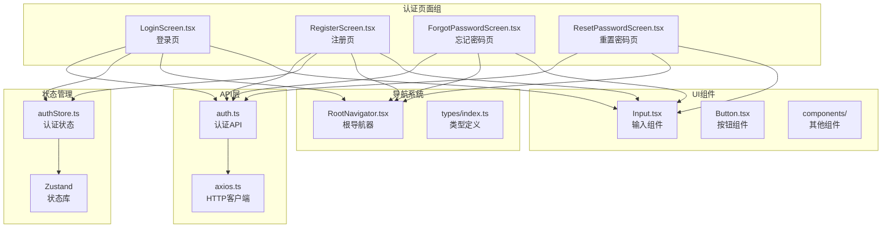
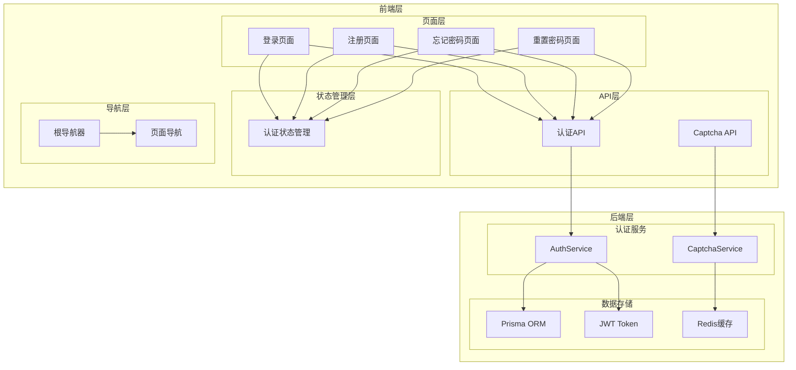
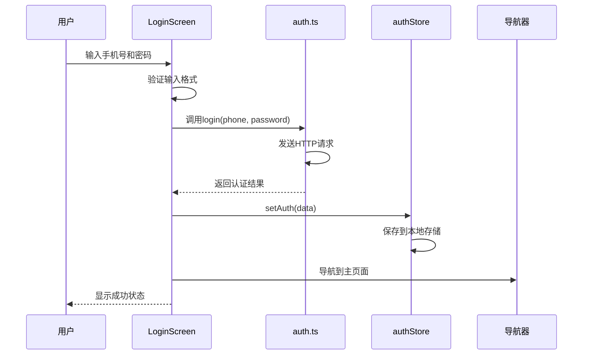
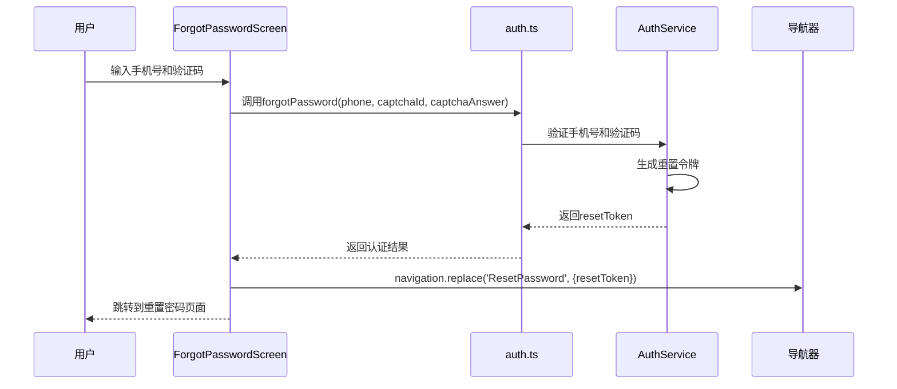
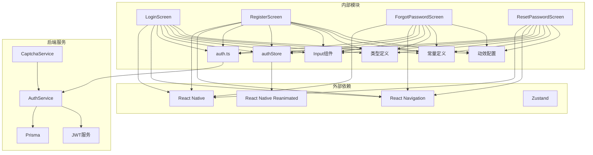

# 认证页面

<cite>
**本文档引用的文件**
- [LoginScreen.tsx](file://FreeDressApp/src/screens/LoginScreen.tsx)
- [RegisterScreen.tsx](file://FreeDressApp/src/screens/RegisterScreen.tsx)
- [ForgotPasswordScreen.tsx](file://FreeDressApp/src/screens/ForgotPasswordScreen.tsx)
- [ResetPasswordScreen.tsx](file://FreeDressApp/src/screens/ResetPasswordScreen.tsx)
- [auth.ts](file://FreeDressApp/src/api/auth.ts)
- [authStore.ts](file://FreeDressApp/src/store/authStore.ts)
- [RootNavigator.tsx](file://FreeDressApp/src/navigation/RootNavigator.tsx)
- [Input.tsx](file://FreeDressApp/src/components/Input.tsx)
- [index.ts](file://FreeDressApp/src/types/index.ts)
- [index.ts](file://FreeDressApp/src/constants/index.ts)
- [motion.ts](file://FreeDressApp/src/theme/motion.ts)
- [auth.service.ts](file://backend/src/modules/auth/auth.service.ts)
- [captcha.service.ts](file://backend/src/modules/auth/captcha.service.ts)
</cite>

## 目录
1. [简介](#简介)
2. [项目结构](#项目结构)
3. [核心组件](#核心组件)
4. [架构概览](#架构概览)
5. [详细组件分析](#详细组件分析)
6. [依赖关系分析](#依赖关系分析)
7. [性能考量](#性能考量)
8. [故障排除指南](#故障排除指南)
9. [结论](#结论)

## 简介

畅搭(FreeDress)应用的认证页面组提供了完整的用户身份验证体验，包括登录、注册、忘记密码和重置密码四个核心页面。这些页面采用统一的Editorial Couture设计语言，结合现代化的React Native技术栈，实现了流畅的用户体验和严格的安全保障。

本认证系统基于JWT令牌认证机制，配合图片验证码验证、密码加密存储和防暴力破解措施，确保用户账户的安全性和系统的稳定性。页面间导航采用React Navigation，支持参数传递和状态管理，为用户提供无缝的认证流程体验。

## 项目结构

认证页面组位于FreeDressApp/src/screens目录下，采用按功能模块组织的文件结构：

**图表来源**
- [LoginScreen.tsx:1-324](file://FreeDressApp/src/screens/LoginScreen.tsx#L1-L324)
- [RegisterScreen.tsx:1-359](file://FreeDressApp/src/screens/RegisterScreen.tsx#L1-L359)
- [ForgotPasswordScreen.tsx:1-304](file://FreeDressApp/src/screens/ForgotPasswordScreen.tsx#L1-L304)
- [ResetPasswordScreen.tsx:1-231](file://FreeDressApp/src/screens/ResetPasswordScreen.tsx#L1-L231)

**章节来源**
- [LoginScreen.tsx:1-324](file://FreeDressApp/src/screens/LoginScreen.tsx#L1-L324)
- [RegisterScreen.tsx:1-359](file://FreeDressApp/src/screens/RegisterScreen.tsx#L1-L359)
- [ForgotPasswordScreen.tsx:1-304](file://FreeDressApp/src/screens/ForgotPasswordScreen.tsx#L1-L304)
- [ResetPasswordScreen.tsx:1-231](file://FreeDressApp/src/screens/ResetPasswordScreen.tsx#L1-L231)

## 核心组件

认证页面组由四个主要页面组成，每个页面都有独特的功能定位和设计特色：

### 登录页面(LoginScreen)
- **核心功能**：用户身份验证和系统访问
- **设计特色**：Editorial Couture风格的巨型标题设计，结合期号标识
- **验证逻辑**：手机号格式验证、密码输入验证
- **交互特性**：动画过渡效果、错误提示机制

### 注册页面(RegisterScreen)
- **核心功能**：新用户账户创建
- **设计特色**：与登录页面保持一致的设计语言
- **验证逻辑**：手机号验证、密码强度验证、确认密码匹配、图片验证码验证
- **用户体验**：自动加载验证码、错误后自动刷新

### 忘记密码页面(ForgotPasswordScreen)
- **核心功能**：用户身份验证和重置令牌生成
- **设计特色**：专门的密码恢复主题设计
- **验证逻辑**：手机号验证、图片验证码验证
- **导航特性**：成功后自动跳转到重置密码页面

### 重置密码页面(ResetPasswordScreen)
- **核心功能**：新密码设置和账户安全更新
- **设计特色**：简洁的密码设置界面
- **验证逻辑**：新密码强度验证、确认密码匹配
- **用户体验**：成功后的引导式导航

**章节来源**
- [LoginScreen.tsx:44-210](file://FreeDressApp/src/screens/LoginScreen.tsx#L44-L210)
- [RegisterScreen.tsx:45-263](file://FreeDressApp/src/screens/RegisterScreen.tsx#L45-L263)
- [ForgotPasswordScreen.tsx:44-215](file://FreeDressApp/src/screens/ForgotPasswordScreen.tsx#L44-L215)
- [ResetPasswordScreen.tsx:42-171](file://FreeDressApp/src/screens/ResetPasswordScreen.tsx#L42-L171)

## 架构概览

认证系统采用分层架构设计，确保代码的可维护性和扩展性：

**图表来源**
- [auth.ts:1-101](file://FreeDressApp/src/api/auth.ts#L1-L101)
- [authStore.ts:1-123](file://FreeDressApp/src/store/authStore.ts#L1-L123)
- [RootNavigator.tsx:1-95](file://FreeDressApp/src/navigation/RootNavigator.tsx#L1-L95)
- [auth.service.ts:1-279](file://backend/src/modules/auth/auth.service.ts#L1-L279)
- [captcha.service.ts:1-259](file://backend/src/modules/auth/captcha.service.ts#L1-L259)

## 详细组件分析

### 登录页面(LoginScreen)分析

登录页面实现了完整的用户认证流程，具有以下关键特性：

#### 表单验证逻辑
- **手机号验证**：使用正则表达式验证中国手机号格式
- **密码验证**：确保密码非空
- **实时反馈**：通过Alert组件提供即时错误提示

#### 状态管理
- **表单状态**：使用useState管理手机号和密码输入
- **加载状态**：通过loading状态控制按钮的加载指示器
- **动画状态**：使用useSharedValue和useAnimatedStyle实现流畅的页面过渡

#### 导航集成
- **注册导航**：提供便捷的注册入口
- **忘记密码**：支持快速跳转到密码重置流程

**图表来源**
- [LoginScreen.tsx:74-92](file://FreeDressApp/src/screens/LoginScreen.tsx#L74-L92)
- [auth.ts:45-53](file://FreeDressApp/src/api/auth.ts#L45-L53)
- [authStore.ts:39-57](file://FreeDressApp/src/store/authStore.ts#L39-L57)

**章节来源**
- [LoginScreen.tsx:44-210](file://FreeDressApp/src/screens/LoginScreen.tsx#L44-L210)
- [auth.ts:45-53](file://FreeDressApp/src/api/auth.ts#L45-L53)
- [authStore.ts:28-57](file://FreeDressApp/src/store/authStore.ts#L28-L57)

### 注册页面(RegisterScreen)分析

注册页面提供了完整的用户注册流程，包含多重安全验证：

#### 图片验证码系统
- **验证码生成**：动态生成带噪声干扰的SVG验证码
- **防自动化**：字符扭曲、噪声线条、干扰点等多重防护
- **有效期管理**：2分钟有效期，自动过期清理
- **尝试限制**：最多3次验证机会

#### 密码安全策略
- **长度要求**：密码长度不少于6位
- **强度验证**：确认密码必须与输入密码一致
- **加密存储**：使用bcrypt进行密码哈希加密

#### 用户体验优化
- **自动加载**：页面加载时自动获取验证码
- **错误处理**：注册失败时自动刷新验证码
- **进度反馈**：注册过程中的加载状态显示

**图表来源**
- [RegisterScreen.tsx:100-123](file://FreeDressApp/src/screens/RegisterScreen.tsx#L100-L123)
- [captcha.service.ts:87-122](file://backend/src/modules/auth/captcha.service.ts#L87-L122)

**章节来源**
- [RegisterScreen.tsx:45-263](file://FreeDressApp/src/screens/RegisterScreen.tsx#L45-L263)
- [captcha.service.ts:58-79](file://backend/src/modules/auth/captcha.service.ts#L58-L79)

### 忘记密码页面(ForgotPasswordScreen)分析

忘记密码页面实现了安全的身份验证流程：

#### 身份验证流程
- **手机号验证**：确认用户注册时使用的手机号
- **验证码验证**：防止自动化攻击和暴力破解
- **令牌生成**：为后续密码重置生成临时访问令牌

#### 安全措施
- **令牌有效期**：10分钟的有效期限制
- **一次性使用**：令牌使用后立即失效
- **过期清理**：定期清理过期令牌

#### 导航设计
- **参数传递**：通过navigation.replace传递resetToken参数
- **页面跳转**：成功验证后自动跳转到重置密码页面

**图表来源**
- [ForgotPasswordScreen.tsx:95-115](file://FreeDressApp/src/screens/ForgotPasswordScreen.tsx#L95-L115)
- [auth.ts:61-71](file://FreeDressApp/src/api/auth.ts#L61-L71)
- [auth.service.ts:180-207](file://backend/src/modules/auth/auth.service.ts#L180-L207)

**章节来源**
- [ForgotPasswordScreen.tsx:44-215](file://FreeDressApp/src/screens/ForgotPasswordScreen.tsx#L44-L215)
- [auth.ts:61-71](file://FreeDressApp/src/api/auth.ts#L61-L71)
- [auth.service.ts:180-207](file://backend/src/modules/auth/auth.service.ts#L180-L207)

### 重置密码页面(ResetPasswordScreen)分析

重置密码页面提供了安全的密码修改功能：

#### 密码重置流程
- **令牌验证**：验证传入的重置令牌有效性
- **密码强度**：确保新密码符合安全要求
- **确认机制**：双重确认防止输入错误

#### 安全保障
- **令牌时效**：10分钟有效期限制
- **密码加密**：使用bcrypt进行密码哈希
- **一次性使用**：令牌使用后立即失效

#### 用户反馈
- **成功提示**：重置成功后的确认对话框
- **导航引导**：自动跳转到登录页面
- **错误处理**：详细的错误信息反馈

**章节来源**
- [ResetPasswordScreen.tsx:42-171](file://FreeDressApp/src/screens/ResetPasswordScreen.tsx#L42-L171)
- [auth.ts:78-86](file://FreeDressApp/src/api/auth.ts#L78-L86)
- [auth.service.ts:214-242](file://backend/src/modules/auth/auth.service.ts#L214-L242)

## 依赖关系分析

认证页面组的依赖关系体现了清晰的分层架构：

**图表来源**
- [LoginScreen.tsx:23-40](file://FreeDressApp/src/screens/LoginScreen.tsx#L23-L40)
- [RegisterScreen.tsx:24-41](file://FreeDressApp/src/screens/RegisterScreen.tsx#L24-L41)
- [ForgotPasswordScreen.tsx:24-40](file://FreeDressApp/src/screens/ForgotPasswordScreen.tsx#L24-L40)
- [ResetPasswordScreen.tsx:23-37](file://FreeDressApp/src/screens/ResetPasswordScreen.tsx#L23-L37)

**章节来源**
- [authStore.ts:1-123](file://FreeDressApp/src/store/authStore.ts#L1-L123)
- [auth.ts:1-101](file://FreeDressApp/src/api/auth.ts#L1-L101)
- [RootNavigator.tsx:1-95](file://FreeDressApp/src/navigation/RootNavigator.tsx#L1-L95)

## 性能考量

认证系统的性能优化体现在多个层面：

### 前端性能优化
- **懒加载策略**：使用React.lazy和Suspense实现组件懒加载
- **状态管理优化**：Zustand提供轻量级状态管理，避免不必要的重渲染
- **动画性能**：使用Reanimated实现硬件加速的动画效果
- **内存管理**：及时清理过期的验证码和认证状态

### 后端性能优化
- **数据库连接池**：Prisma提供连接池管理，提高数据库访问效率
- **缓存策略**：使用Redis缓存频繁访问的数据
- **并发处理**：异步处理认证请求，避免阻塞主线程
- **资源清理**：定时清理过期的验证码和令牌

### 网络性能优化
- **请求合并**：合理合并API请求，减少网络往返
- **错误重试**：实现智能的错误重试机制
- **超时控制**：设置合理的请求超时时间
- **缓存策略**：对静态资源进行缓存优化

## 故障排除指南

### 常见问题及解决方案

#### 登录失败
**症状**：登录时出现错误提示
**可能原因**：
- 手机号或密码错误
- 网络连接异常
- 服务器暂时不可用

**解决步骤**：
1. 检查手机号格式是否正确
2. 确认密码输入是否准确
3. 验证网络连接状态
4. 重新尝试登录操作

#### 注册失败
**症状**：注册过程中断或显示错误
**可能原因**：
- 手机号已被注册
- 验证码输入错误
- 密码不符合要求

**解决步骤**：
1. 检查手机号是否已被使用
2. 重新获取并输入正确的验证码
3. 确认密码长度和格式要求
4. 清除浏览器缓存后重试

#### 忘记密码问题
**症状**：无法接收重置邮件或短信
**可能原因**：
- 验证码过期
- 手机号未注册
- 系统维护期间

**解决步骤**：
1. 重新获取新的验证码
2. 确认输入的手机号是否正确
3. 稍后再试或联系客服
4. 检查垃圾邮件文件夹

#### 密码重置失败
**症状**：重置密码后仍无法登录
**可能原因**：
- 重置令牌过期
- 新密码不符合要求
- 数据同步延迟

**解决步骤**：
1. 重新发起密码重置流程
2. 确认新密码满足安全要求
3. 等待系统数据同步完成
4. 联系技术支持

### 调试技巧

#### 前端调试
- 使用React DevTools检查组件状态
- 利用Redux DevTools监控状态变化
- 检查网络请求和响应
- 监控内存使用情况

#### 后端调试
- 查看服务器日志文件
- 使用数据库查询工具检查数据
- 监控API响应时间和错误率
- 检查缓存命中率

**章节来源**
- [authStore.ts:62-78](file://FreeDressApp/src/store/authStore.ts#L62-L78)
- [auth.service.ts:247-254](file://backend/src/modules/auth/auth.service.ts#L247-L254)

## 结论

畅搭(FreeDress)应用的认证页面组展现了现代移动应用开发的最佳实践。通过精心设计的UI/UX、严格的安全措施和高效的性能优化，为用户提供了安全、便捷、愉悦的认证体验。

### 主要优势
- **设计一致性**：统一的Editorial Couture设计语言贯穿所有认证页面
- **安全性保障**：多层验证机制、密码加密存储、防暴力破解措施
- **用户体验**：流畅的动画过渡、清晰的错误提示、直观的操作流程
- **技术先进**：采用React Native、TypeScript、JWT等现代技术栈

### 技术亮点
- **状态管理**：使用Zustand实现轻量级、高性能的状态管理
- **动画效果**：基于Reanimated的硬件加速动画系统
- **导航集成**：完善的页面导航和参数传递机制
- **API设计**：清晰的RESTful API接口设计

### 未来改进方向
- **生物识别**：集成指纹识别、面部识别等生物特征认证
- **多因素认证**：添加短信验证码、邮箱验证等多重验证方式
- **离线支持**：实现部分功能的离线使用能力
- **国际化**：支持多语言界面和本地化服务

认证页面组为畅搭应用奠定了坚实的技术基础，通过持续的优化和改进，将为用户带来更加优质的数字服装体验。