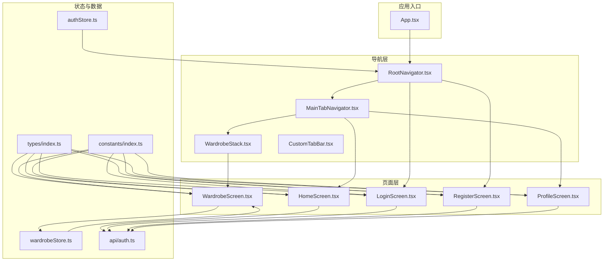
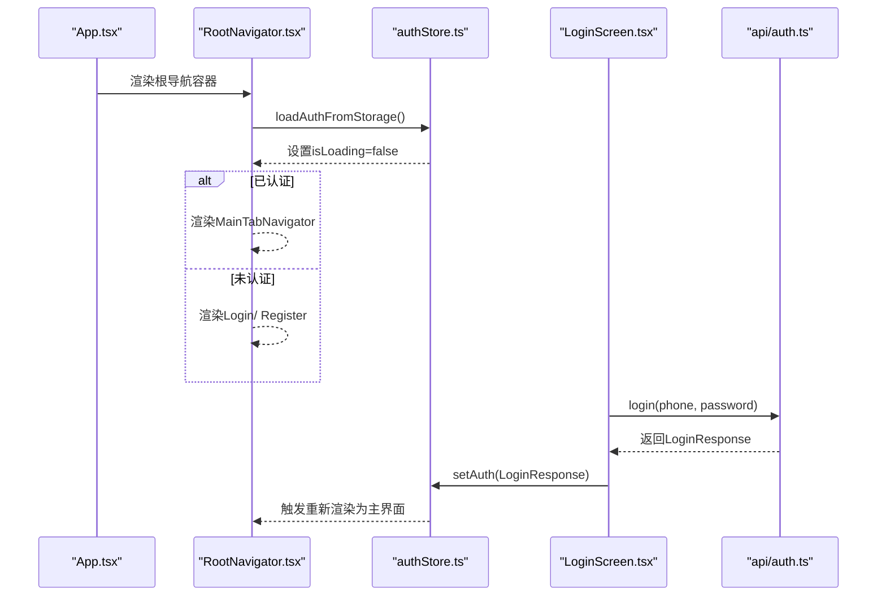
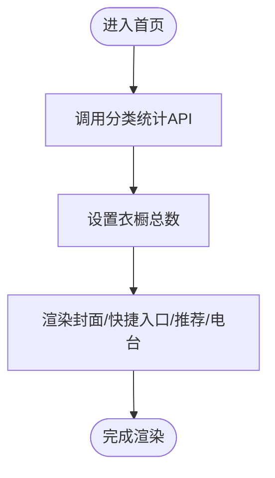
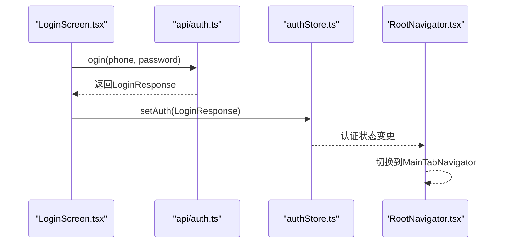
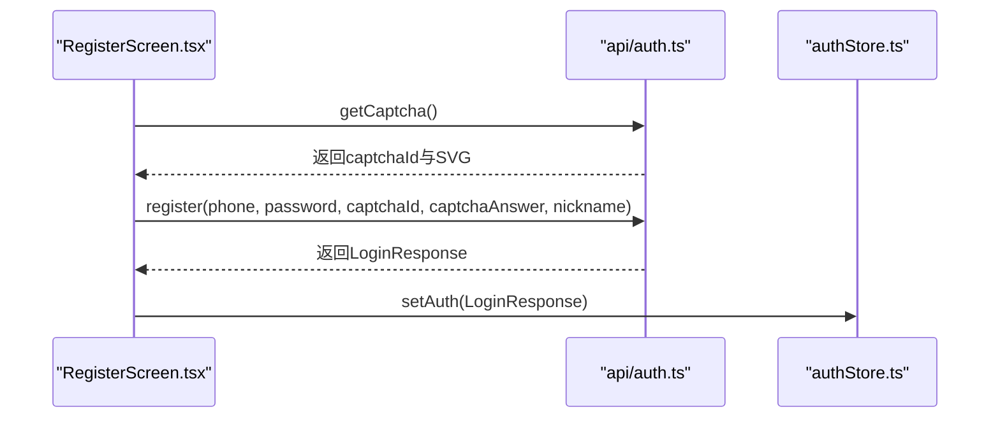
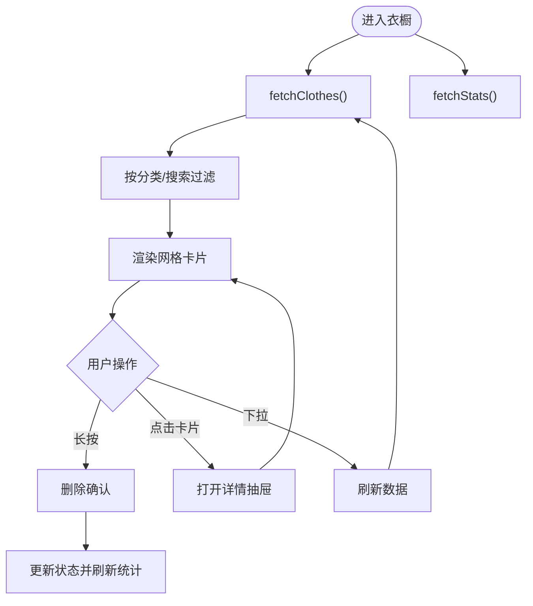
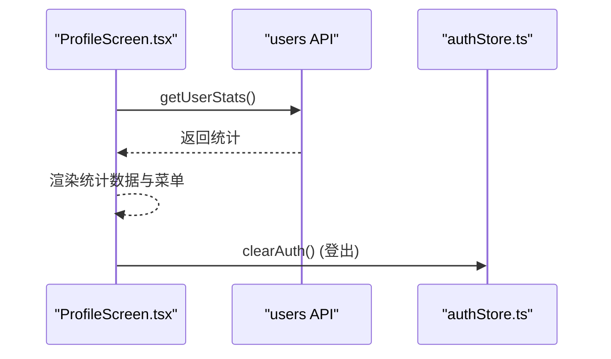
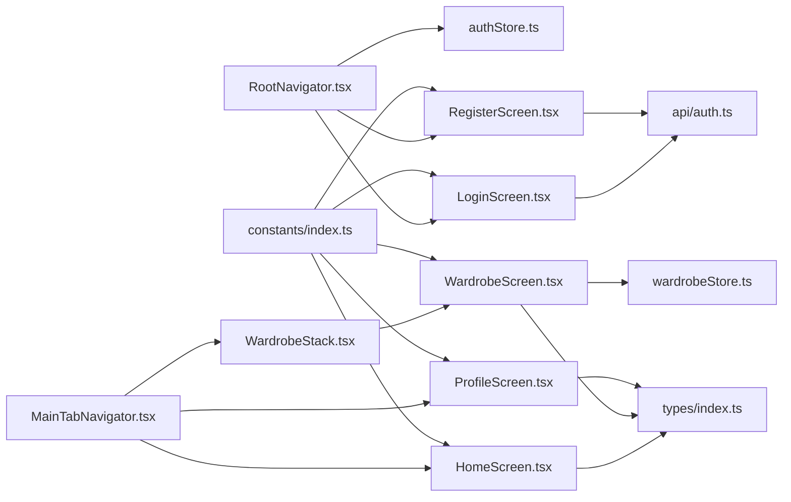

# 页面架构

<cite>
**本文档引用的文件**
- [App.tsx](file://FreeDressApp/src/App.tsx)
- [RootNavigator.tsx](file://FreeDressApp/src/navigation/RootNavigator.tsx)
- [MainTabNavigator.tsx](file://FreeDressApp/src/navigation/MainTabNavigator.tsx)
- [WardrobeStack.tsx](file://FreeDressApp/src/navigation/WardrobeStack.tsx)
- [CustomTabBar.tsx](file://FreeDressApp/src/navigation/CustomTabBar.tsx)
- [HomeScreen.tsx](file://FreeDressApp/src/screens/HomeScreen.tsx)
- [LoginScreen.tsx](file://FreeDressApp/src/screens/LoginScreen.tsx)
- [RegisterScreen.tsx](file://FreeDressApp/src/screens/RegisterScreen.tsx)
- [WardrobeScreen.tsx](file://FreeDressApp/src/screens/WardrobeScreen.tsx)
- [ProfileScreen.tsx](file://FreeDressApp/src/screens/ProfileScreen.tsx)
- [authStore.ts](file://FreeDressApp/src/store/authStore.ts)
- [wardrobeStore.ts](file://FreeDressApp/src/store/wardrobeStore.ts)
- [auth.ts](file://FreeDressApp/src/api/auth.ts)
- [index.ts](file://FreeDressApp/src/types/index.ts)
- [index.ts](file://FreeDressApp/src/constants/index.ts)
- [index.ts](file://FreeDressApp/src/components/index.ts)
- [package.json](file://FreeDressApp/package.json)
</cite>

## 目录
1. [简介](#简介)
2. [项目结构](#项目结构)
3. [核心组件](#核心组件)
4. [架构总览](#架构总览)
5. [详细组件分析](#详细组件分析)
6. [依赖分析](#依赖分析)
7. [性能考虑](#性能考虑)
8. [故障排除指南](#故障排除指南)
9. [结论](#结论)
10. [附录](#附录)

## 简介
本文件面向畅搭(FreeDress)应用的页面架构，系统梳理首页、登录、注册、衣橱、用户中心等核心页面的设计与实现，覆盖数据流、状态管理、导航关系、参数传递、性能优化与生命周期管理等方面，并提供开发示例与常见问题解决方案。

## 项目结构
应用采用“屏幕(Screen) + 导航(Navigation) + 状态存储(Store) + API”分层组织，页面通过导航容器统一调度，状态通过轻量状态库集中管理，UI组件按语义模块化封装。

**图表来源**
- [App.tsx:11-19](file://FreeDressApp/src/App.tsx#L11-L19)
- [RootNavigator.tsx:41-84](file://FreeDressApp/src/navigation/RootNavigator.tsx#L41-L84)
- [MainTabNavigator.tsx:22-34](file://FreeDressApp/src/navigation/MainTabNavigator.tsx#L22-L34)
- [WardrobeStack.tsx:9-20](file://FreeDressApp/src/navigation/WardrobeStack.tsx#L9-L20)
- [CustomTabBar.tsx:44-117](file://FreeDressApp/src/navigation/CustomTabBar.tsx#L44-L117)
- [HomeScreen.tsx:100-265](file://FreeDressApp/src/screens/HomeScreen.tsx#L100-L265)
- [LoginScreen.tsx:44-210](file://FreeDressApp/src/screens/LoginScreen.tsx#L44-L210)
- [RegisterScreen.tsx:45-263](file://FreeDressApp/src/screens/RegisterScreen.tsx#L45-L263)
- [WardrobeScreen.tsx:40-259](file://FreeDressApp/src/screens/WardrobeScreen.tsx#L40-L259)
- [ProfileScreen.tsx:52-239](file://FreeDressApp/src/screens/ProfileScreen.tsx#L52-L239)
- [authStore.ts:28-122](file://FreeDressApp/src/store/authStore.ts#L28-L122)
- [wardrobeStore.ts:35-82](file://FreeDressApp/src/store/wardrobeStore.ts#L35-L82)
- [auth.ts:8-101](file://FreeDressApp/src/api/auth.ts#L8-L101)
- [index.ts:1-98](file://FreeDressApp/src/types/index.ts#L1-L98)
- [index.ts:1-212](file://FreeDressApp/src/constants/index.ts#L1-L212)

**章节来源**
- [App.tsx:11-28](file://FreeDressApp/src/App.tsx#L11-L28)
- [RootNavigator.tsx:41-84](file://FreeDressApp/src/navigation/RootNavigator.tsx#L41-L84)
- [MainTabNavigator.tsx:22-34](file://FreeDressApp/src/navigation/MainTabNavigator.tsx#L22-L34)
- [WardrobeStack.tsx:9-20](file://FreeDressApp/src/navigation/WardrobeStack.tsx#L9-L20)
- [CustomTabBar.tsx:44-117](file://FreeDressApp/src/navigation/CustomTabBar.tsx#L44-L117)

## 核心组件
- 应用根组件：提供安全区域、手势处理与根导航容器。
- 根导航器：根据认证状态在“主底部导航 + 页面栈”与“登录/注册”之间切换。
- 主底部导航：承载首页、衣橱、试穿、搭配、我的五个主页面。
- 衣橱子导航：包含衣橱列表与新增衣物模态页。
- 自定义TabBar：中心放大视觉锚点，带滑动指示器与动画过渡。
- 状态存储：认证状态与衣橱数据状态，分别持久化与本地缓存。
- 类型与常量：统一的类型定义、API基础地址、设计Token与存储键名。

**章节来源**
- [App.tsx:11-28](file://FreeDressApp/src/App.tsx#L11-L28)
- [RootNavigator.tsx:41-84](file://FreeDressApp/src/navigation/RootNavigator.tsx#L41-L84)
- [MainTabNavigator.tsx:22-34](file://FreeDressApp/src/navigation/MainTabNavigator.tsx#L22-L34)
- [WardrobeStack.tsx:9-20](file://FreeDressApp/src/navigation/WardrobeStack.tsx#L9-L20)
- [CustomTabBar.tsx:44-117](file://FreeDressApp/src/navigation/CustomTabBar.tsx#L44-L117)
- [authStore.ts:28-122](file://FreeDressApp/src/store/authStore.ts#L28-L122)
- [wardrobeStore.ts:35-82](file://FreeDressApp/src/store/wardrobeStore.ts#L35-L82)
- [index.ts:1-98](file://FreeDressApp/src/types/index.ts#L1-L98)
- [index.ts:8-212](file://FreeDressApp/src/constants/index.ts#L8-L212)

## 架构总览
页面架构遵循“导航驱动 + 状态驱动”的模式：
- 导航层负责页面路由与参数传递，支持底部Tab与堆栈导航。
- 状态层通过Zustand集中管理认证与衣橱数据，自动持久化至AsyncStorage。
- API层封装认证、衣物、搭配、试穿等业务接口，统一响应格式。
- UI层以组件库为核心，保证设计一致性与复用性。

**图表来源**
- [App.tsx:11-19](file://FreeDressApp/src/App.tsx#L11-L19)
- [RootNavigator.tsx:42-47](file://FreeDressApp/src/navigation/RootNavigator.tsx#L42-L47)
- [authStore.ts:97-121](file://FreeDressApp/src/store/authStore.ts#L97-L121)
- [LoginScreen.tsx:74-92](file://FreeDressApp/src/screens/LoginScreen.tsx#L74-L92)
- [auth.ts:45-53](file://FreeDressApp/src/api/auth.ts#L45-L53)

## 详细组件分析

### 首页 HomeScreen
- 数据获取与展示
  - 首屏使用动画过渡展示期刊封面与快捷入口；通过API获取分类统计，计算衣橱总数并显示。
  - 推荐与风格电台使用横向滚动与网格布局，配合骨架屏占位。
- 状态管理集成
  - 通过API模块调用后端接口，无需本地状态存储；仅在组件内缓存计算结果。
- 导航关系与参数
  - 快捷入口跳转至衣橱、搭配、试穿、我的等目标页面。
- 性能优化
  - 使用Reanimated进行轻量动画，避免频繁重排；FlatList横向滚动提升推荐列表性能。
- 生命周期与内存
  - 首次挂载时触发数据请求与动画初始化；卸载时无需额外清理。

**图表来源**
- [HomeScreen.tsx:108-116](file://FreeDressApp/src/screens/HomeScreen.tsx#L108-L116)
- [HomeScreen.tsx:240-251](file://FreeDressApp/src/screens/HomeScreen.tsx#L240-L251)

**章节来源**
- [HomeScreen.tsx:100-265](file://FreeDressApp/src/screens/HomeScreen.tsx#L100-L265)
- [index.ts](file://FreeDressApp/src/api/clothes.ts)

### 登录页 LoginScreen
- 表单校验与交互
  - 校验手机号格式与密码非空；提交时调用登录API，成功后通过状态存储设置认证信息并触发导航切换。
- 动画与体验
  - 使用Reanimated实现标题与表单的逐层入场动画，增强品牌感。
- 导航关系
  - 提供“忘记密码”与“注册”跳转；登录成功后进入主界面。

**图表来源**
- [LoginScreen.tsx:74-92](file://FreeDressApp/src/screens/LoginScreen.tsx#L74-L92)
- [auth.ts:45-53](file://FreeDressApp/src/api/auth.ts#L45-L53)
- [authStore.ts:39-57](file://FreeDressApp/src/store/authStore.ts#L39-L57)
- [RootNavigator.tsx:62-74](file://FreeDressApp/src/navigation/RootNavigator.tsx#L62-L74)

**章节来源**
- [LoginScreen.tsx:44-210](file://FreeDressApp/src/screens/LoginScreen.tsx#L44-L210)
- [auth.ts:45-53](file://FreeDressApp/src/api/auth.ts#L45-L53)
- [authStore.ts:28-122](file://FreeDressApp/src/store/authStore.ts#L28-L122)

### 注册页 RegisterScreen
- 验证码与表单
  - 首次加载拉取SVG验证码；注册时校验手机号、密码长度与一致性、验证码非空。
- 数据流转
  - 成功后同样调用状态存储设置认证信息，触发主界面渲染。
- 交互细节
  - 支持点击刷新验证码；失败时自动重新加载验证码。

**图表来源**
- [RegisterScreen.tsx:82-98](file://FreeDressApp/src/screens/RegisterScreen.tsx#L82-L98)
- [RegisterScreen.tsx:100-123](file://FreeDressApp/src/screens/RegisterScreen.tsx#L100-L123)
- [auth.ts:12-14](file://FreeDressApp/src/api/auth.ts#L12-L14)
- [auth.ts:24-38](file://FreeDressApp/src/api/auth.ts#L24-L38)
- [authStore.ts:39-57](file://FreeDressApp/src/store/authStore.ts#L39-L57)

**章节来源**
- [RegisterScreen.tsx:45-263](file://FreeDressApp/src/screens/RegisterScreen.tsx#L45-L263)
- [auth.ts:12-14](file://FreeDressApp/src/api/auth.ts#L12-L14)
- [auth.ts:24-38](file://FreeDressApp/src/api/auth.ts#L24-L38)
- [authStore.ts:28-122](file://FreeDressApp/src/store/authStore.ts#L28-L122)

### 衣橱页 WardrobeScreen
- 数据获取与筛选
  - 初始化加载衣物列表与分类统计；支持按分类与关键词搜索过滤。
- 交互与操作
  - 长按删除衣物；点击卡片打开详情抽屉；下拉刷新同步数据。
- 状态管理
  - 使用衣橱状态存储统一管理列表、分类与加载状态；新增/编辑/删除均更新本地状态并刷新统计。
- 性能优化
  - 使用骨架屏占位；网格布局适配多列显示；长按删除采用确认对话框降低误操作风险。

**图表来源**
- [WardrobeScreen.tsx:56-90](file://FreeDressApp/src/screens/WardrobeScreen.tsx#L56-L90)
- [WardrobeScreen.tsx:61-76](file://FreeDressApp/src/screens/WardrobeScreen.tsx#L61-L76)
- [wardrobeStore.ts:43-62](file://FreeDressApp/src/store/wardrobeStore.ts#L43-L62)

**章节来源**
- [WardrobeScreen.tsx:40-259](file://FreeDressApp/src/screens/WardrobeScreen.tsx#L40-L259)
- [wardrobeStore.ts:21-82](file://FreeDressApp/src/store/wardrobeStore.ts#L21-L82)

### 用户中心 ProfileScreen
- 数据获取与展示
  - 展示用户头像、昵称、手机号与会员标识；通过API获取统计信息并渲染编辑数据。
- 交互与导航
  - 支持编辑资料、菜单项跳转与登出；登出前二次确认。
- 性能与体验
  - 下拉刷新保障数据实时性；菜单项采用统一样式与图标。

**图表来源**
- [ProfileScreen.tsx:63-86](file://FreeDressApp/src/screens/ProfileScreen.tsx#L63-L86)
- [ProfileScreen.tsx:88-93](file://FreeDressApp/src/screens/ProfileScreen.tsx#L88-L93)

**章节来源**
- [ProfileScreen.tsx:52-239](file://FreeDressApp/src/screens/ProfileScreen.tsx#L52-L239)
- [authStore.ts:62-78](file://FreeDressApp/src/store/authStore.ts#L62-L78)

## 依赖分析
- 导航依赖
  - 根导航器依赖认证状态决定渲染分支；主导航器依赖自定义TabBar；衣橱子导航嵌套在主导航器中。
- 状态依赖
  - 页面通过状态存储读取/更新数据；认证状态变化触发根导航器重绘。
- 外部依赖
  - 使用AsyncStorage进行认证信息持久化；使用Axios封装HTTP请求；使用Reanimated实现动画；使用FlashList优化长列表。

**图表来源**
- [RootNavigator.tsx:41-84](file://FreeDressApp/src/navigation/RootNavigator.tsx#L41-L84)
- [MainTabNavigator.tsx:22-34](file://FreeDressApp/src/navigation/MainTabNavigator.tsx#L22-L34)
- [WardrobeStack.tsx:9-20](file://FreeDressApp/src/navigation/WardrobeStack.tsx#L9-L20)
- [HomeScreen.tsx:100-265](file://FreeDressApp/src/screens/HomeScreen.tsx#L100-L265)
- [WardrobeScreen.tsx:40-259](file://FreeDressApp/src/screens/WardrobeScreen.tsx#L40-L259)
- [ProfileScreen.tsx:52-239](file://FreeDressApp/src/screens/ProfileScreen.tsx#L52-L239)
- [authStore.ts:28-122](file://FreeDressApp/src/store/authStore.ts#L28-L122)
- [wardrobeStore.ts:35-82](file://FreeDressApp/src/store/wardrobeStore.ts#L35-L82)
- [auth.ts:8-101](file://FreeDressApp/src/api/auth.ts#L8-L101)
- [index.ts:1-98](file://FreeDressApp/src/types/index.ts#L1-L98)
- [index.ts:1-212](file://FreeDressApp/src/constants/index.ts#L1-L212)

**章节来源**
- [package.json:12-31](file://FreeDressApp/package.json#L12-L31)

## 性能考虑
- 懒加载与虚拟化
  - 衣橱网格与推荐列表使用网格/横向滚动布局，减少一次性渲染节点数量。
  - 长列表场景建议引入FlashList或React Native内置FlatList的优化配置（已具备基础滚动优化）。
- 图片优化
  - 使用占位骨架屏与占位图标，避免首屏闪烁；对网络图片建议启用缓存与尺寸裁剪策略。
- 动画与渲染
  - 使用Reanimated进行轻量动画，避免JS线程阻塞；合理控制动画时长与缓动函数。
- 状态与内存
  - 使用Zustand集中状态，避免深层组件树重复渲染；及时清理定时器与订阅。
- 网络与缓存
  - 对高频接口增加本地缓存与失效策略；对认证信息使用异步存储持久化。

[本节为通用指导，无需特定文件引用]

## 故障排除指南
- 登录/注册失败
  - 检查手机号格式与密码长度；确认验证码是否正确；查看API返回的错误消息并弹窗提示。
- 衣橱数据为空
  - 确认已成功登录并触发数据加载；检查网络请求是否异常；尝试下拉刷新。
- 登出后仍显示主界面
  - 确认状态存储中的认证信息已被清除；检查根导航器的条件渲染逻辑。
- 图片不显示
  - 检查图片URL有效性与网络权限；确认图片组件的尺寸与裁剪属性。

**章节来源**
- [LoginScreen.tsx:74-92](file://FreeDressApp/src/screens/LoginScreen.tsx#L74-L92)
- [RegisterScreen.tsx:100-123](file://FreeDressApp/src/screens/RegisterScreen.tsx#L100-L123)
- [WardrobeScreen.tsx:87-90](file://FreeDressApp/src/screens/WardrobeScreen.tsx#L87-L90)
- [authStore.ts:62-78](file://FreeDressApp/src/store/authStore.ts#L62-L78)

## 结论
畅搭应用采用清晰的导航与状态分层架构，结合组件化UI与动画体验，实现了从登录到衣橱管理的完整流程。通过Zustand与AsyncStorage实现状态持久化，配合Axios统一API访问，页面具备良好的扩展性与维护性。建议后续在长列表与图片资源方面进一步引入FlashList与图片缓存策略，持续优化性能与用户体验。

[本节为总结性内容，无需特定文件引用]

## 附录
- 开发最佳实践
  - 页面间参数传递：使用导航器的参数类型定义，确保类型安全。
  - 状态管理：优先使用Zustand集中管理跨页面共享状态，避免过度使用Context。
  - 组件复用：将通用UI抽象为组件库，统一风格与交互。
- 常见问题速查
  - 验证码无法刷新：检查网络与SVG解析；失败时重试并提示用户。
  - 删除衣物失败：捕获异常并弹窗提示，同时保持界面一致性。

[本节为补充性内容，无需特定文件引用]