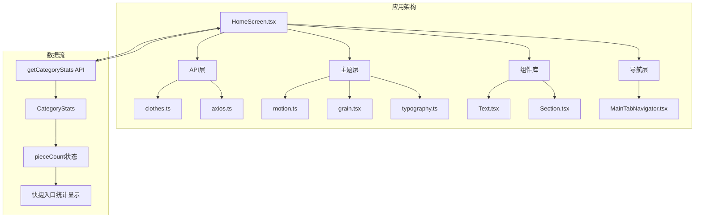
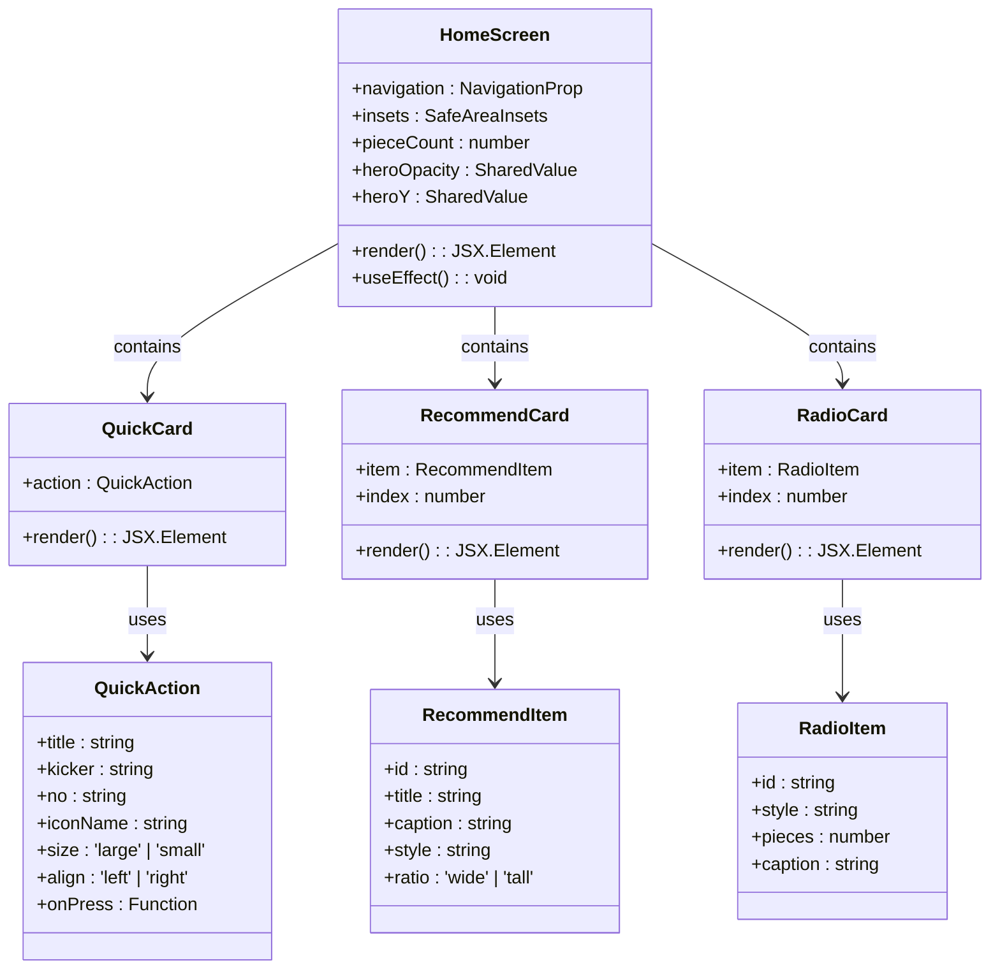
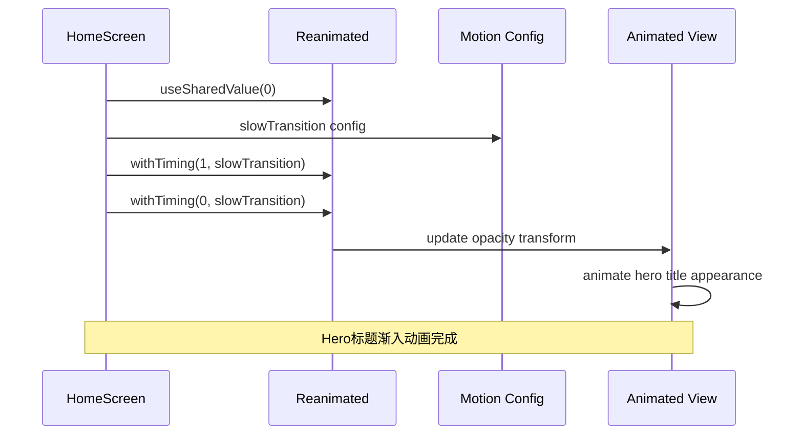
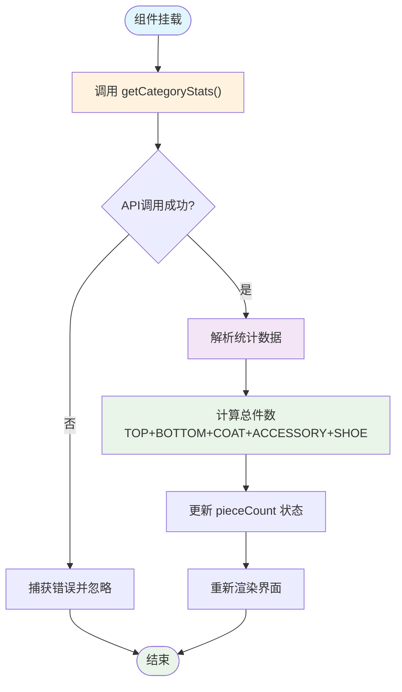
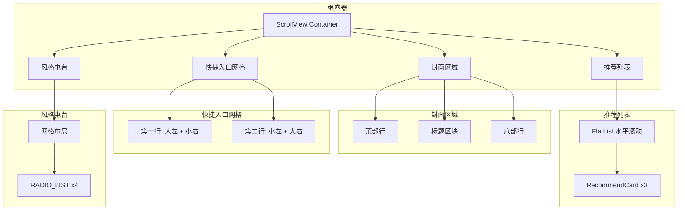
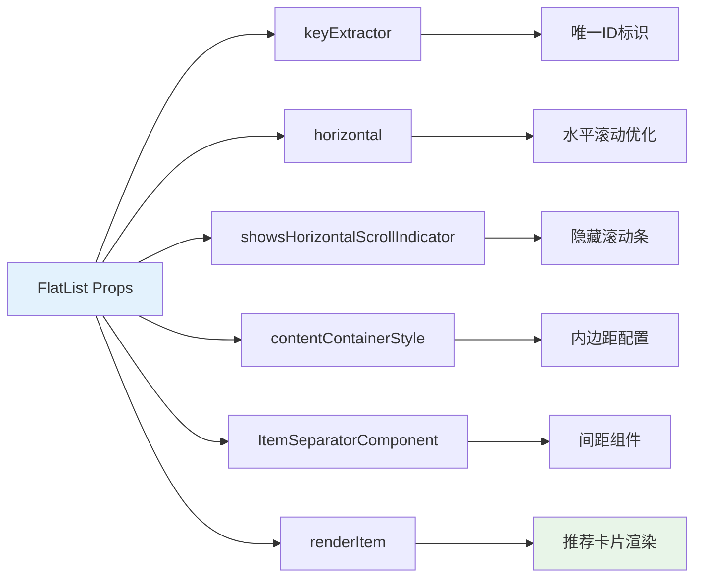
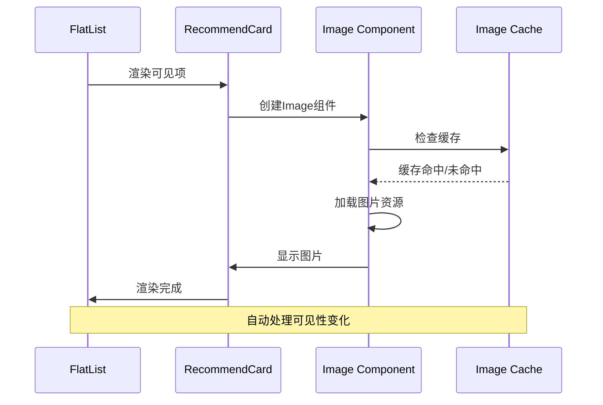
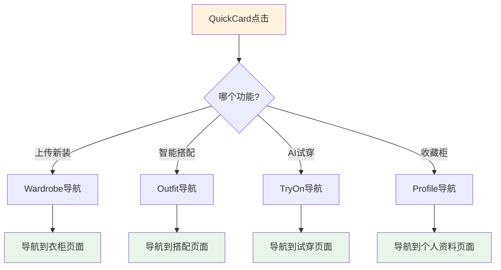

# 首页组件

<cite>
**本文档引用的文件**
- [HomeScreen.tsx](file://FreeDressApp/src/screens/HomeScreen.tsx)
- [clothes.ts](file://FreeDressApp/src/api/clothes.ts)
- [motion.ts](file://FreeDressApp/src/theme/motion.ts)
- [Text.tsx](file://FreeDressApp/src/components/Text.tsx)
- [Section.tsx](file://FreeDressApp/src/components/Section.tsx)
- [index.ts](file://FreeDressApp/src/constants/index.ts)
- [MainTabNavigator.tsx](file://FreeDressApp/src/navigation/MainTabNavigator.tsx)
- [grain.tsx](file://FreeDressApp/src/theme/grain.tsx)
- [typography.ts](file://FreeDressApp/src/theme/typography.ts)
- [index.ts](file://FreeDressApp/src/types/index.ts)
- [axios.ts](file://FreeDressApp/src/api/axios.ts)
</cite>

## 目录
1. [简介](#简介)
2. [项目结构](#项目结构)
3. [核心组件](#核心组件)
4. [架构概览](#架构概览)
5. [详细组件分析](#详细组件分析)
6. [依赖关系分析](#依赖关系分析)
7. [性能考虑](#性能考虑)
8. [故障排除指南](#故障排除指南)
9. [结论](#结论)

## 简介

畅搭(FreeDress)应用的首页组件是一个精心设计的杂志风格界面，采用Neo-minimalism设计理念，通过四个主要区域为用户提供完整的服装管理体验。该组件展现了现代移动应用的优秀实践，包括流畅的动画效果、响应式布局设计和高效的性能优化策略。

首页组件的核心特色包括：
- **期刊封面区域**：采用杂志风格的Hero标题设计，配合渐入动画效果
- **不对称快捷入口网格**：创新的布局设计，提供四种不同的功能入口
- **横向推荐列表**：使用FlatList实现高性能的内容浏览
- **风格电台功能区**：网格化的风格分类展示

## 项目结构

首页组件位于React Native应用的屏幕层，采用模块化设计，与API层、主题层和导航层紧密协作。



**图表来源**
- [HomeScreen.tsx:1-606](file://FreeDressApp/src/screens/HomeScreen.tsx#L1-L606)
- [clothes.ts:1-54](file://FreeDressApp/src/api/clothes.ts#L1-L54)
- [motion.ts:1-32](file://FreeDressApp/src/theme/motion.ts#L1-L32)

**章节来源**
- [HomeScreen.tsx:1-606](file://FreeDressApp/src/screens/HomeScreen.tsx#L1-L606)
- [MainTabNavigator.tsx:1-38](file://FreeDressApp/src/navigation/MainTabNavigator.tsx#L1-L38)

## 核心组件

首页组件由四个主要部分组成，每个部分都有独特的设计目标和实现策略：

### 1. 期刊封面区域
采用杂志风格的Hero标题设计，通过Reanimated实现流畅的渐入动画效果。封面区域包含：
- 编辑部标识和日期信息
- 主要的Hero标题文本
- 期号显示和装饰元素
- 背景颗粒纹理效果

### 2. 不对称快捷入口网格
创新的布局设计，提供四种不同的功能入口：
- **上传新装**：相机图标，大尺寸卡片
- **智能搭配**：图层组合图标，小尺寸卡片  
- **AI试穿**：用户检查图标，小尺寸卡片
- **收藏柜**：书签图标，大尺寸卡片

### 3. 横向推荐列表
使用FlatList实现高性能的水平滚动内容展示，包含三个精选搭配方案。

### 4. 风格电台功能区
网格化的风格分类展示，包含四种不同的风格主题。

**章节来源**
- [HomeScreen.tsx:100-265](file://FreeDressApp/src/screens/HomeScreen.tsx#L100-L265)
- [HomeScreen.tsx:269-349](file://FreeDressApp/src/screens/HomeScreen.tsx#L269-L349)

## 架构概览

首页组件采用分层架构设计，各层职责明确，耦合度低，便于维护和扩展。



**图表来源**
- [HomeScreen.tsx:44-67](file://FreeDressApp/src/screens/HomeScreen.tsx#L44-L67)
- [HomeScreen.tsx:123-160](file://FreeDressApp/src/screens/HomeScreen.tsx#L123-L160)

**章节来源**
- [HomeScreen.tsx:100-265](file://FreeDressApp/src/screens/HomeScreen.tsx#L100-L265)

## 详细组件分析

### 动画系统实现

首页组件的核心亮点是流畅的动画效果，特别是Hero标题的渐入动画。



**图表来源**
- [HomeScreen.tsx:105-121](file://FreeDressApp/src/screens/HomeScreen.tsx#L105-L121)
- [motion.ts:14-18](file://FreeDressApp/src/theme/motion.ts#L14-L18)

动画实现的关键特性：
- 使用`useSharedValue`管理动画状态
- 通过`useAnimatedStyle`应用动画效果
- 采用慢速过渡配置(`slowTransition`)
- 实现透明度和位置的双重动画

### 数据获取流程

首页组件通过`getCategoryStats` API获取统计数据，并实时更新快捷入口的计数显示。



**图表来源**
- [HomeScreen.tsx:108-116](file://FreeDressApp/src/screens/HomeScreen.tsx#L108-L116)
- [clothes.ts:51-53](file://FreeDressApp/src/api/clothes.ts#L51-L53)

数据获取流程的关键实现：
- 在`useEffect`钩子中执行API调用
- 使用解构赋值提取统计数据
- 通过数学运算计算总件数
- 更新React状态触发重新渲染

### 页面布局结构

首页组件采用灵活的响应式布局设计，适应不同屏幕尺寸和方向。



**图表来源**
- [HomeScreen.tsx:162-264](file://FreeDressApp/src/screens/HomeScreen.tsx#L162-L264)

布局设计的关键特性：
- 使用`Dimensions.get('window')`获取屏幕宽度
- 通过Flexbox实现响应式布局
- 支持安全区域适配
- 采用间距网格系统

### 组件性能优化

首页组件在多个方面实现了性能优化，确保流畅的用户体验。

#### FlatList优化策略

推荐列表使用FlatList替代ScrollView，实现虚拟化渲染：



**图表来源**
- [HomeScreen.tsx:240-250](file://FreeDressApp/src/screens/HomeScreen.tsx#L240-L250)

#### 图片懒加载策略

虽然当前实现使用占位符，但推荐的图片懒加载实现：



**图表来源**
- [HomeScreen.tsx:304-332](file://FreeDressApp/src/screens/HomeScreen.tsx#L304-L332)

### 交互逻辑和导航实现

首页组件的导航逻辑简洁明了，通过React Navigation实现页面跳转。



**图表来源**
- [HomeScreen.tsx:123-160](file://FreeDressApp/src/screens/HomeScreen.tsx#L123-L160)

导航实现的关键特性：
- 使用`useNavigation`钩子获取导航实例
- 通过`navigation.navigate()`实现页面跳转
- 类型安全的导航参数定义
- 与底部导航器集成

**章节来源**
- [HomeScreen.tsx:100-349](file://FreeDressApp/src/screens/HomeScreen.tsx#L100-L349)

## 依赖关系分析

首页组件的依赖关系清晰，遵循单一职责原则，便于维护和测试。

```mermaid
graph TB
subgraph "外部依赖"
A[react-native]
B[react-native-reanimated]
C[react-native-vector-icons]
D[@react-navigation/native]
E[axios]
F[react-native-safe-area-context]
end
subgraph "内部模块"
G[HomeScreen.tsx]
H[clothes.ts]
I[motion.ts]
J[Text.tsx]
K[Section.tsx]
L[index.ts]
M[grain.tsx]
N[typography.ts]
O[axios.ts]
end
G --> A
G --> B
G --> C
G --> D
G --> E
G --> F
G --> H
G --> I
G --> J
G --> K
G --> L
G --> M
G --> N
G --> O
H --> O
O --> E
style G fill:#e3f2fd
style H fill:#f3e5f5
style O fill:#fff3e0
```

**图表来源**
- [HomeScreen.tsx:1-38](file://FreeDressApp/src/screens/HomeScreen.tsx#L1-L38)
- [axios.ts:1-108](file://FreeDressApp/src/api/axios.ts#L1-L108)

**章节来源**
- [HomeScreen.tsx:1-606](file://FreeDressApp/src/screens/HomeScreen.tsx#L1-L606)
- [axios.ts:1-108](file://FreeDressApp/src/api/axios.ts#L1-L108)

## 性能考虑

首页组件在设计时充分考虑了性能优化，采用了多种策略确保流畅的用户体验。

### 动画性能优化

- 使用`useSharedValue`和`useAnimatedStyle`避免不必要的重渲染
- 采用Reanimated的硬件加速动画引擎
- 合理设置动画时长和缓动函数
- 避免在动画过程中进行昂贵的计算

### 渲染性能优化

- 使用FlatList实现虚拟化渲染，减少内存占用
- 合理设置`maxToRenderPerBatch`和`windowSize`
- 使用`getItemLayout`提供精确的高度信息
- 避免在渲染函数中创建新对象

### 内存管理

- 使用`useMemo`缓存计算结果
- 合理使用`useCallback`优化回调函数
- 及时清理定时器和订阅
- 避免内存泄漏

### 网络请求优化

- 合理设置超时时间
- 实现请求去重机制
- 使用缓存策略减少重复请求
- 错误处理和重试机制

## 故障排除指南

### 常见问题及解决方案

#### 动画不生效
- 检查Reanimated配置是否正确
- 确认`useSharedValue`初始化值
- 验证`useAnimatedStyle`的返回值结构

#### API调用失败
- 检查网络连接状态
- 验证API端点URL配置
- 查看响应拦截器的错误处理

#### FlatList渲染异常
- 确认`keyExtractor`函数的唯一性
- 检查`data`数组的数据结构
- 验证`renderItem`函数的实现

#### 样式显示异常
- 检查主题配置文件的导入
- 验证`Dimensions`的获取时机
- 确认安全区域的适配

**章节来源**
- [HomeScreen.tsx:108-116](file://FreeDressApp/src/screens/HomeScreen.tsx#L108-L116)
- [axios.ts:44-105](file://FreeDressApp/src/api/axios.ts#L44-L105)

## 结论

畅搭(FreeDress)应用的首页组件展现了现代React Native应用开发的最佳实践。通过精心设计的布局、流畅的动画效果和高效的性能优化，为用户提供了优质的移动端体验。

该组件的主要优势包括：
- **设计理念先进**：采用Neo-minimalism和杂志风格设计语言
- **技术实现成熟**：充分利用React Native生态系统的最佳实践
- **性能表现优异**：通过多种优化策略确保流畅的用户体验
- **可维护性强**：清晰的代码结构和模块化设计便于长期维护

未来可以考虑的改进方向：
- 实现图片懒加载功能
- 添加下拉刷新机制
- 优化无障碍访问支持
- 增加更多的个性化定制选项