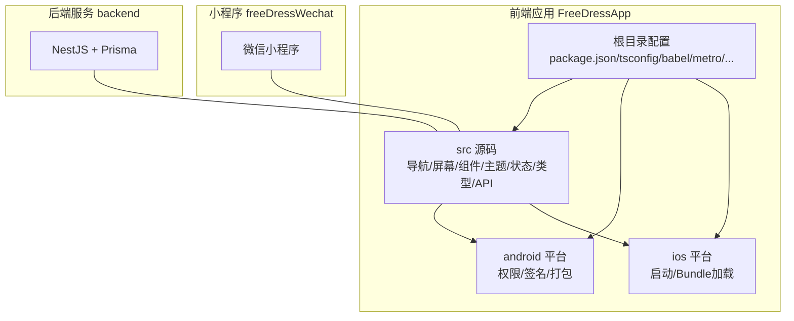
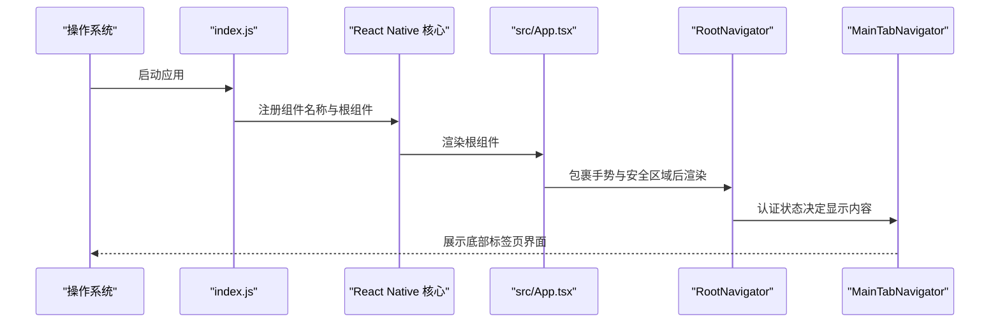
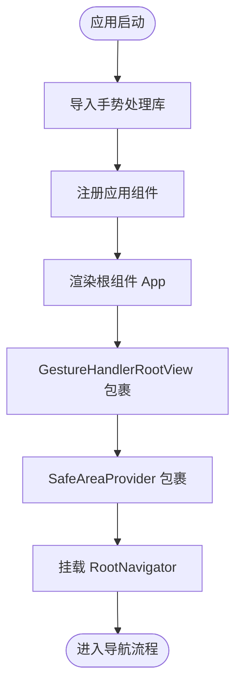
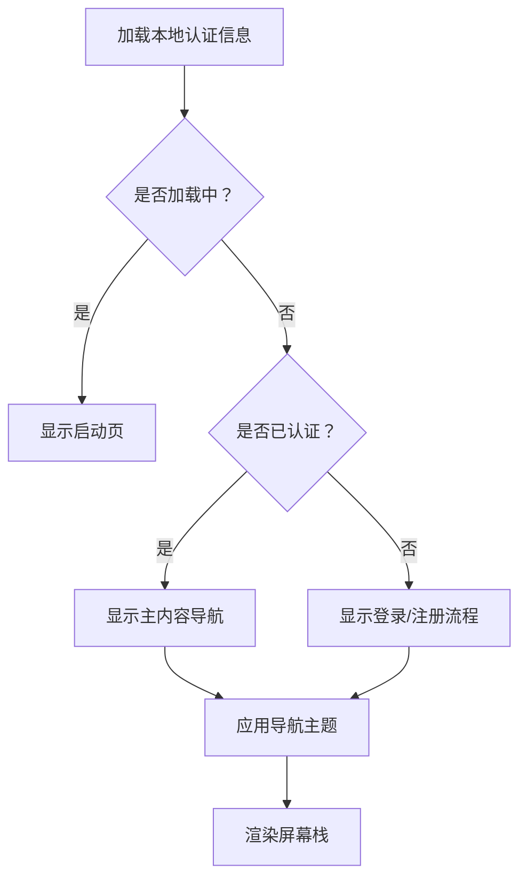
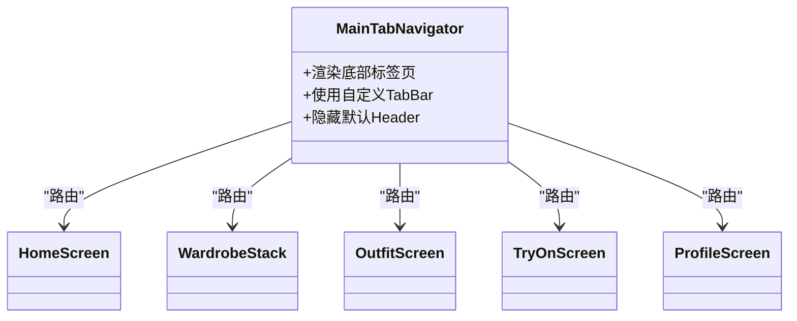
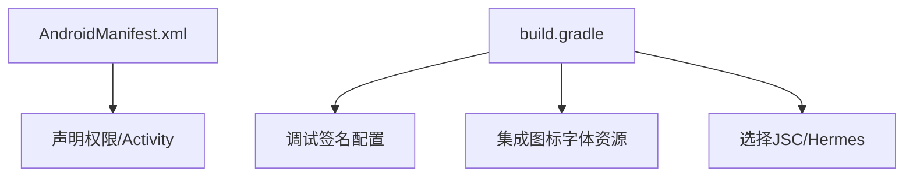
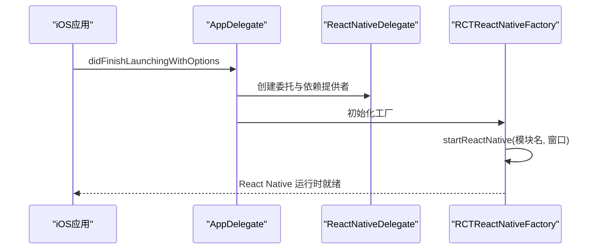
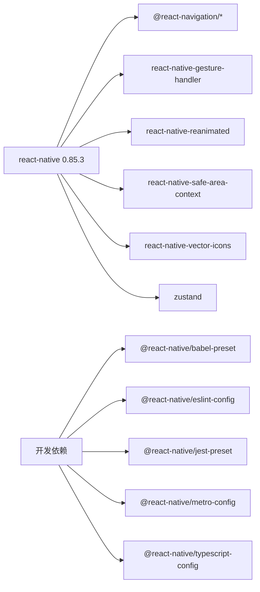

# 项目结构与配置

<cite>
**本文引用的文件**
- [package.json](file://FreeDressApp/package.json)
- [tsconfig.json](file://FreeDressApp/tsconfig.json)
- [babel.config.js](file://FreeDressApp/babel.config.js)
- [react-native.config.js](file://FreeDressApp/react-native.config.js)
- [app.json](file://FreeDressApp/app.json)
- [index.js](file://FreeDressApp/index.js)
- [src/App.tsx](file://FreeDressApp/src/App.tsx)
- [metro.config.js](file://FreeDressApp/metro.config.js)
- [.eslintrc.js](file://FreeDressApp/.eslintrc.js)
- [.prettierrc.js](file://FreeDressApp/.prettierrc.js)
- [android/app/src/main/AndroidManifest.xml](file://FreeDressApp/android/app/src/main/AndroidManifest.xml)
- [android/app/build.gradle](file://FreeDressApp/android/app/build.gradle)
- [ios/FreeDressApp/AppDelegate.swift](file://FreeDressApp/ios/FreeDressApp/AppDelegate.swift)
- [src/navigation/RootNavigator.tsx](file://FreeDressApp/src/navigation/RootNavigator.tsx)
- [src/navigation/MainTabNavigator.tsx](file://FreeDressApp/src/navigation/MainTabNavigator.tsx)
</cite>

## 目录
1. [简介](#简介)
2. [项目结构](#项目结构)
3. [核心组件](#核心组件)
4. [架构总览](#架构总览)
5. [详细组件分析](#详细组件分析)
6. [依赖分析](#依赖分析)
7. [性能考虑](#性能考虑)
8. [故障排除指南](#故障排除指南)
9. [结论](#结论)
10. [附录](#附录)

## 简介
本文件面向畅搭（FreeDress）React Native项目，系统性梳理项目结构、配置文件与运行机制，重点覆盖以下方面：
- 整体目录组织与职责划分（src、android、ios 等）
- TypeScript、Babel、Metro、ESLint、Prettier 等配置要点
- 入口文件与初始化流程（Provider、手势、安全区域）
- 导航体系与主题配置
- 开发环境搭建与依赖管理
- 构建与调试工具使用建议

## 项目结构
项目采用“前端应用 + 后端服务 + 微信小程序”三层结构：
- FreeDressApp：React Native 前端应用，包含跨平台入口、导航、组件库、状态管理与 API 层
- backend：基于 NestJS 的后端服务，Prisma 数据层
- freeDressWechat：微信小程序版本（与 RN 功能对应）

前端应用（FreeDressApp）的关键目录与职责概览：
- src：应用源代码，包含导航、屏幕、组件、主题、类型、状态管理与 API 客户端
- android：Android 平台原生集成、权限声明、签名与打包配置
- ios：iOS 平台原生集成、启动与 Bundle 加载逻辑
- 根目录配置：包管理、TypeScript、Babel、Metro、ESLint、Prettier、RN CLI 等

**章节来源**
- [package.json:1-57](file://FreeDressApp/package.json#L1-L57)
- [tsconfig.json:1-9](file://FreeDressApp/tsconfig.json#L1-L9)
- [babel.config.js:1-4](file://FreeDressApp/babel.config.js#L1-L4)
- [metro.config.js:1-12](file://FreeDressApp/metro.config.js#L1-L12)
- [.eslintrc.js:1-5](file://FreeDressApp/.eslintrc.js#L1-L5)
- [.prettierrc.js:1-6](file://FreeDressApp/.prettierrc.js#L1-L6)

## 核心组件
- 应用入口与注册
  - index.js 负责注册应用名称与根组件，确保在启动前引入手势处理库
  - app.json 提供应用名称与显示名
- 根组件与上下文
  - src/App.tsx 作为根组件，包裹手势与安全区域 Provider，并挂载根导航器
- 导航体系
  - RootNavigator：根据认证状态在主内容与登录流程之间切换，应用自定义主题
  - MainTabNavigator：底部标签页导航，承载 Home/Wardrobe/Outfit/Profile 等页面
- 平台配置
  - Android：清单文件声明权限与 Activity，Gradle 配置签名与打包策略
  - iOS：AppDelegate 负责启动 React Native，区分 Debug/Release Bundle 加载

**章节来源**
- [index.js:1-11](file://FreeDressApp/index.js#L1-L11)
- [app.json:1-5](file://FreeDressApp/app.json#L1-L5)
- [src/App.tsx:1-28](file://FreeDressApp/src/App.tsx#L1-L28)
- [src/navigation/RootNavigator.tsx:1-95](file://FreeDressApp/src/navigation/RootNavigator.tsx#L1-L95)
- [src/navigation/MainTabNavigator.tsx:1-38](file://FreeDressApp/src/navigation/MainTabNavigator.tsx#L1-L38)
- [android/app/src/main/AndroidManifest.xml:1-28](file://FreeDressApp/android/app/src/main/AndroidManifest.xml#L1-L28)
- [android/app/build.gradle:1-123](file://FreeDressApp/android/app/build.gradle#L1-L123)
- [ios/FreeDressApp/AppDelegate.swift:1-49](file://FreeDressApp/ios/FreeDressApp/AppDelegate.swift#L1-L49)

## 架构总览
下图展示从应用启动到导航呈现的关键交互路径。

**图表来源**
- [index.js:6-10](file://FreeDressApp/index.js#L6-L10)
- [src/App.tsx:11-19](file://FreeDressApp/src/App.tsx#L11-L19)
- [src/navigation/RootNavigator.tsx:41-84](file://FreeDressApp/src/navigation/RootNavigator.tsx#L41-L84)
- [src/navigation/MainTabNavigator.tsx:22-35](file://FreeDressApp/src/navigation/MainTabNavigator.tsx#L22-L35)

## 详细组件分析

### 应用入口与初始化流程
- 初始化顺序
  - 在注册根组件前导入手势处理库，确保手势系统可用
  - 通过 AppRegistry 将应用名称与根组件关联
- Provider 配置
  - GestureHandlerRootView：为所有手势交互提供根容器
  - SafeAreaProvider：统一处理刘海屏、圆角等安全区域差异
- 导航挂载
  - RootNavigator 作为顶层容器，负责主题、状态栏与屏幕栈管理

**图表来源**
- [index.js:4-10](file://FreeDressApp/index.js#L4-L10)
- [src/App.tsx:11-19](file://FreeDressApp/src/App.tsx#L11-L19)

**章节来源**
- [index.js:1-11](file://FreeDressApp/index.js#L1-L11)
- [src/App.tsx:1-28](file://FreeDressApp/src/App.tsx#L1-L28)

### 导航与主题配置
- 主题设计
  - 自定义 NavigationContainer 主题，使用品牌色系（ecru、ink、caramel 等）
  - 统一背景与卡片颜色，保证视觉一致性
- 登录态控制
  - 通过认证状态在主内容与登录/注册流程之间切换
  - 首次启动时异步加载本地认证信息，避免白屏
- 屏幕栈与动画
  - Modal 与底部滑入动画用于特定页面（如编辑资料）
  - 关闭默认 Header，由各页面自行提供头部组件

**图表来源**
- [src/navigation/RootNavigator.tsx:42-47](file://FreeDressApp/src/navigation/RootNavigator.tsx#L42-L47)
- [src/navigation/RootNavigator.tsx:49-84](file://FreeDressApp/src/navigation/RootNavigator.tsx#L49-L84)

**章节来源**
- [src/navigation/RootNavigator.tsx:1-95](file://FreeDressApp/src/navigation/RootNavigator.tsx#L1-L95)

### 底部标签页导航
- 自定义 TabBar
  - 使用自定义 TabBar 组件替代默认样式，提升交互体验
  - 关闭默认 Header，每页自带 ScreenHeader
- 页面布局
  - Home / Wardrobe / Outfit / Profile 四个主要页面
  - 中央 TryOn 作为视觉锚点，突出核心功能

**图表来源**
- [src/navigation/MainTabNavigator.tsx:16-35](file://FreeDressApp/src/navigation/MainTabNavigator.tsx#L16-L35)

**章节来源**
- [src/navigation/MainTabNavigator.tsx:1-38](file://FreeDressApp/src/navigation/MainTabNavigator.tsx#L1-L38)

### Android 平台配置
- 权限与清单
  - 声明网络权限与应用信息，Activity 配置支持软键盘与多参数
- 打包与签名
  - 默认使用调试签名，发布版可按需替换
  - 可选择启用混淆与 ProGuard 规则
- 资源与字体
  - 集成 react-native-vector-icons 字体资源接入脚本

**图表来源**
- [android/app/src/main/AndroidManifest.xml:1-28](file://FreeDressApp/android/app/src/main/AndroidManifest.xml#L1-L28)
- [android/app/build.gradle:88-123](file://FreeDressApp/android/app/build.gradle#L88-L123)

**章节来源**
- [android/app/src/main/AndroidManifest.xml:1-28](file://FreeDressApp/android/app/src/main/AndroidManifest.xml#L1-L28)
- [android/app/build.gradle:1-123](file://FreeDressApp/android/app/build.gradle#L1-L123)

### iOS 平台配置
- 启动流程
  - AppDelegate 创建 ReactNativeDelegate 与工厂，设置窗口与模块名
  - 根据 Debug/Release 切换 Bundle 加载方式
- 依赖与桥接
  - 引入 React/RCTAppDelegate 与 RCTReactNativeFactory

**图表来源**
- [ios/FreeDressApp/AppDelegate.swift:13-33](file://FreeDressApp/ios/FreeDressApp/AppDelegate.swift#L13-L33)
- [ios/FreeDressApp/AppDelegate.swift:36-48](file://FreeDressApp/ios/FreeDressApp/AppDelegate.swift#L36-L48)

**章节来源**
- [ios/FreeDressApp/AppDelegate.swift:1-49](file://FreeDressApp/ios/FreeDressApp/AppDelegate.swift#L1-L49)

## 依赖分析
- 运行时依赖
  - React、React Native、导航与手势相关生态
  - 状态管理、图像选择、SVG、Reanimated、Safe Area 等
- 开发依赖
  - Babel、ESLint、Jest、Metro、TypeScript 配置与 Preset
- 版本与引擎
  - React Native 0.85.3，Node >= 22.11.0

**图表来源**
- [package.json:12-31](file://FreeDressApp/package.json#L12-L31)
- [package.json:32-52](file://FreeDressApp/package.json#L32-L52)

**章节来源**
- [package.json:1-57](file://FreeDressApp/package.json#L1-L57)

## 性能考虑
- Reanimated 插件
  - Babel 配置中启用插件以优化动画性能
- Metro 默认配置
  - 使用 @react-native/metro-config 合并默认配置，减少自定义复杂度
- 图标字体
  - Android 侧集成图标字体资源脚本，避免运行时额外开销
- 打包与混淆
  - Gradle 支持开启混淆与 ProGuard 规则，发布版建议启用

**章节来源**
- [babel.config.js:1-4](file://FreeDressApp/babel.config.js#L1-L4)
- [metro.config.js:1-12](file://FreeDressApp/metro.config.js#L1-L12)
- [android/app/build.gradle:121-123](file://FreeDressApp/android/app/build.gradle#L121-L123)

## 故障排除指南
- 启动失败或黑屏
  - 确认 index.js 已在注册前导入手势处理库
  - 检查 src/App.tsx 是否正确包裹手势与安全区域 Provider
- 导航主题不生效
  - 核对 RootNavigator 的主题对象与颜色映射
  - 确保未覆盖 NavigationContainer 的 theme 属性
- Android 权限问题
  - 检查 AndroidManifest.xml 是否声明所需权限
  - 确认 Activity 配置与窗口行为符合预期
- iOS Bundle 加载异常
  - Debug/Release 下 Bundle 加载路径不同，确认工程配置
- Lint/Prettier 报错
  - 使用根级 ESLint/Prettier 配置，遵循 @react-native 规范

**章节来源**
- [index.js:4-10](file://FreeDressApp/index.js#L4-L10)
- [src/App.tsx:11-19](file://FreeDressApp/src/App.tsx#L11-L19)
- [src/navigation/RootNavigator.tsx:25-36](file://FreeDressApp/src/navigation/RootNavigator.tsx#L25-L36)
- [android/app/src/main/AndroidManifest.xml:3-26](file://FreeDressApp/android/app/src/main/AndroidManifest.xml#L3-L26)
- [ios/FreeDressApp/AppDelegate.swift:42-47](file://FreeDressApp/ios/FreeDressApp/AppDelegate.swift#L42-L47)
- [.eslintrc.js:1-5](file://FreeDressApp/.eslintrc.js#L1-L5)
- [.prettierrc.js:1-6](file://FreeDressApp/.prettierrc.js#L1-L6)

## 结论
本项目以清晰的目录结构与完善的配置体系支撑跨平台开发。通过 Provider 统一手势与安全区域处理、导航主题化与屏幕栈管理，配合 Android/iOS 平台的标准化集成，形成一致的用户体验。建议在后续迭代中持续完善测试与自动化流程，保持配置与依赖的同步更新。

## 附录

### 开发环境搭建指南
- Node.js
  - 版本要求：满足 engines.node >= 22.11.0
- React Native CLI
  - 使用 @react-native-community/cli 及对应平台插件
- Android Studio
  - 配置 SDK、NDK、Build Tools，确保 Gradle 与 JDK 版本兼容
  - 启用开发者选项与 USB 调试，连接设备进行真机调试
- Xcode
  - 安装 iOS 模拟器与目标系统版本
  - 配置签名与描述文件，必要时生成发布证书

**章节来源**
- [package.json:53-56](file://FreeDressApp/package.json#L53-L56)
- [package.json:36-38](file://FreeDressApp/package.json#L36-L38)

### 依赖管理与构建
- 依赖安装
  - 使用 npm/yarn 安装根目录依赖
- 构建命令
  - npm run android / npm run ios：分别构建并运行到对应平台
  - npm start：启动 Metro 服务器
  - npm run lint / npm test：代码规范检查与单元测试
- 构建配置
  - TypeScript：继承 @react-native/typescript-config，包含 Jest 类型
  - Babel：使用 @react-native/babel-preset，并启用 Reanimated 插件
  - Metro：合并默认配置，便于扩展
  - ESLint/Prettier：遵循 @react-native 规范与项目风格

**章节来源**
- [package.json:5-11](file://FreeDressApp/package.json#L5-L11)
- [tsconfig.json:1-9](file://FreeDressApp/tsconfig.json#L1-L9)
- [babel.config.js:1-4](file://FreeDressApp/babel.config.js#L1-L4)
- [metro.config.js:1-12](file://FreeDressApp/metro.config.js#L1-L12)
- [.eslintrc.js:1-5](file://FreeDressApp/.eslintrc.js#L1-L5)
- [.prettierrc.js:1-6](file://FreeDressApp/.prettierrc.js#L1-L6)