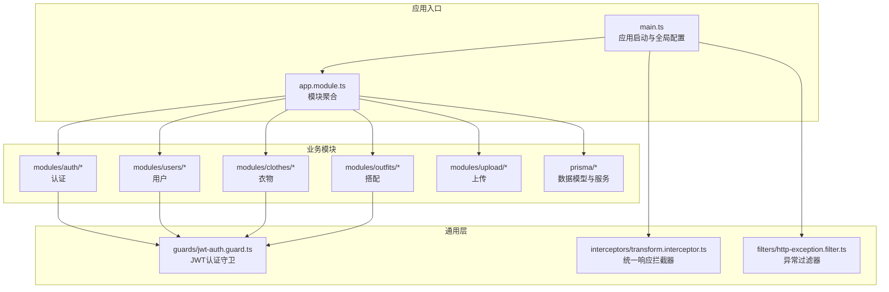
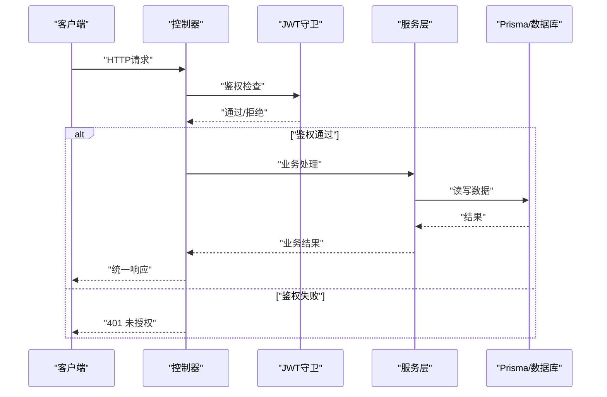
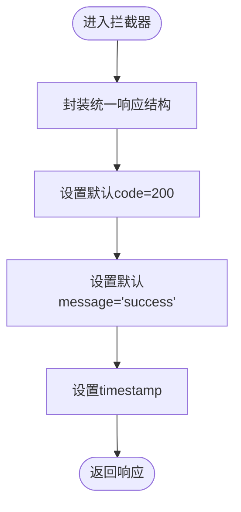
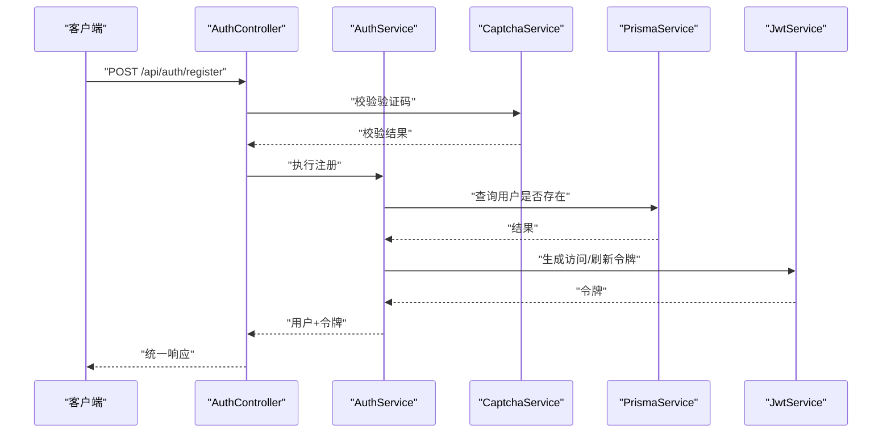
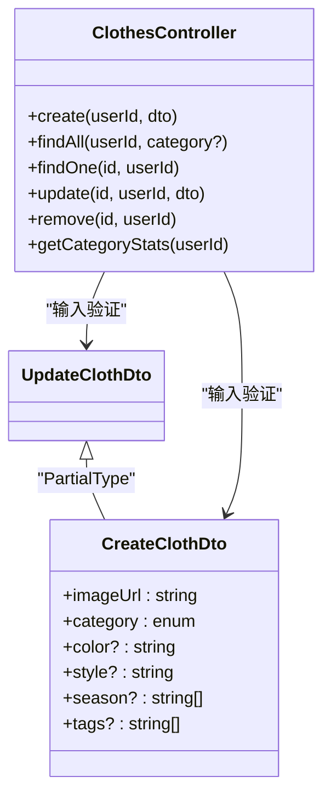
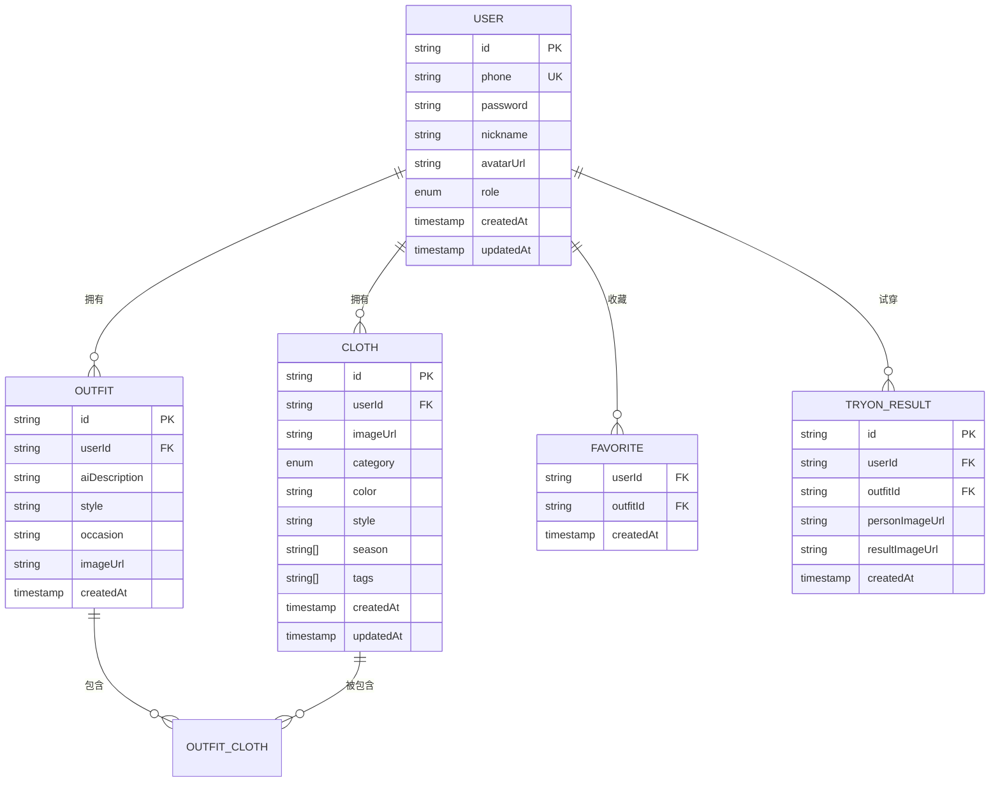
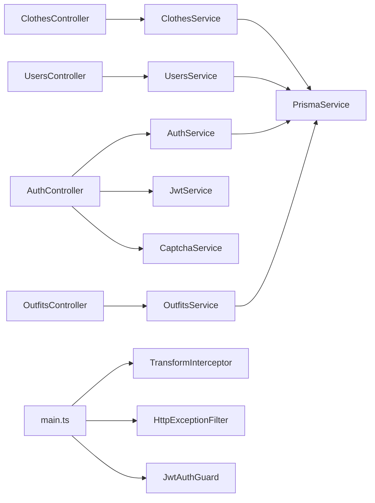

# API设计规范

<cite>
**本文引用的文件**
- [main.ts](file://backend/src/main.ts)
- [app.module.ts](file://backend/src/app.module.ts)
- [transform.interceptor.ts](file://backend/src/common/interceptors/transform.interceptor.ts)
- [http-exception.filter.ts](file://backend/src/common/filters/http-exception.filter.ts)
- [jwt-auth.guard.ts](file://backend/src/common/guards/jwt-auth.guard.ts)
- [auth.controller.ts](file://backend/src/modules/auth/auth.controller.ts)
- [auth.service.ts](file://backend/src/modules/auth/auth.service.ts)
- [clothes.controller.ts](file://backend/src/modules/clothes/clothes.controller.ts)
- [users.controller.ts](file://backend/src/modules/users/users.controller.ts)
- [outfits.controller.ts](file://backend/src/modules/outfits/outfits.controller.ts)
- [login.dto.ts](file://backend/src/modules/auth/dto/login.dto.ts)
- [register.dto.ts](file://backend/src/modules/auth/dto/register.dto.ts)
- [create-cloth.dto.ts](file://backend/src/modules/clothes/dto/create-cloth.dto.ts)
- [update-cloth.dto.ts](file://backend/src/modules/clothes/dto/update-cloth.dto.ts)
- [schema.prisma](file://backend/prisma/schema.prisma)
</cite>

## 目录
1. [简介](#简介)
2. [项目结构](#项目结构)
3. [核心组件](#核心组件)
4. [架构总览](#架构总览)
5. [详细组件分析](#详细组件分析)
6. [依赖分析](#依赖分析)
7. [性能考量](#性能考量)
8. [故障排查指南](#故障排查指南)
9. [结论](#结论)
10. [附录](#附录)

## 简介
本规范面向畅搭（FreeDress）后端团队与外部集成方，系统化定义RESTful API的设计原则、最佳实践与实现细节。内容涵盖URL设计、HTTP方法使用、状态码规范、统一响应格式、错误处理、参数验证、数据传输格式、控制器与服务层分离、DTO使用、API文档生成、测试策略、性能优化、跨域与CORS配置以及安全考虑。目标是确保API具备一致性、可维护性、可扩展性与安全性。

## 项目结构
后端采用NestJS框架，模块化组织业务功能，统一通过拦截器与过滤器实现响应与异常标准化，Swagger自动生成API文档，Prisma作为ORM管理数据模型。

图表来源
- [main.ts:12-62](file://backend/src/main.ts#L12-L62)
- [app.module.ts:13-33](file://backend/src/app.module.ts#L13-L33)

章节来源
- [main.ts:12-62](file://backend/src/main.ts#L12-L62)
- [app.module.ts:13-33](file://backend/src/app.module.ts#L13-L33)

## 核心组件
- 统一响应拦截器：将所有控制器返回值包装为统一结构，包含状态码、消息、数据与时间戳。
- 全局异常过滤器：捕获HTTP异常与未处理异常，输出标准化错误响应。
- JWT认证守卫：保护受保护路由，确保请求携带有效令牌。
- Swagger文档：自动扫描控制器注解生成API文档。
- 参数验证管道：基于class-validator的白名单与类型转换，保证入参合法性。
- CORS配置：允许凭据与任意来源，便于前端跨域访问。

章节来源
- [transform.interceptor.ts:19-31](file://backend/src/common/interceptors/transform.interceptor.ts#L19-L31)
- [http-exception.filter.ts:8-81](file://backend/src/common/filters/http-exception.filter.ts#L8-L81)
- [jwt-auth.guard.ts:8-22](file://backend/src/common/guards/jwt-auth.guard.ts#L8-L22)
- [main.ts:15-48](file://backend/src/main.ts#L15-L48)

## 架构总览
下图展示从客户端到控制器、服务层与数据库的典型调用链路，以及统一响应与异常处理的横切关注点。

图表来源
- [auth.controller.ts:16-92](file://backend/src/modules/auth/auth.controller.ts#L16-L92)
- [auth.service.ts:24-279](file://backend/src/modules/auth/auth.service.ts#L24-L279)
- [jwt-auth.guard.ts:8-22](file://backend/src/common/guards/jwt-auth.guard.ts#L8-L22)
- [transform.interceptor.ts:19-31](file://backend/src/common/interceptors/transform.interceptor.ts#L19-L31)
- [http-exception.filter.ts:8-81](file://backend/src/common/filters/http-exception.filter.ts#L8-L81)

## 详细组件分析

### 统一响应格式与错误处理
- 成功响应：固定结构包含code、message、data、timestamp；默认code为200，message为“success”。
- 错误响应：继承HTTP状态码，附加路径与时间戳；开发环境打印错误堆栈便于调试。
- 全局管道：启用白名单、禁止非白名单字段、自动类型转换。
- 全局拦截器：统一包裹响应。
- 全局过滤器：捕获HttpException与未处理异常，输出标准错误体。

图表来源
- [transform.interceptor.ts:19-31](file://backend/src/common/interceptors/transform.interceptor.ts#L19-L31)

章节来源
- [transform.interceptor.ts:8-31](file://backend/src/common/interceptors/transform.interceptor.ts#L8-L31)
- [http-exception.filter.ts:10-44](file://backend/src/common/filters/http-exception.filter.ts#L10-L44)
- [http-exception.filter.ts:51-80](file://backend/src/common/filters/http-exception.filter.ts#L51-L80)
- [main.ts:15-30](file://backend/src/main.ts#L15-L30)

### 认证与授权
- 接口保护：使用JWT守卫保护受保护路由。
- 登录/注册：基于手机号+密码，支持图片验证码校验。
- 刷新令牌：支持刷新访问令牌。
- 当前用户：通过装饰器注入当前用户上下文。

图表来源
- [auth.controller.ts:37-41](file://backend/src/modules/auth/auth.controller.ts#L37-L41)
- [auth.service.ts:44-95](file://backend/src/modules/auth/auth.service.ts#L44-L95)

章节来源
- [auth.controller.ts:16-92](file://backend/src/modules/auth/auth.controller.ts#L16-L92)
- [auth.service.ts:24-279](file://backend/src/modules/auth/auth.service.ts#L24-L279)
- [jwt-auth.guard.ts:8-22](file://backend/src/common/guards/jwt-auth.guard.ts#L8-L22)

### 衣物管理（示例：Clothes模块）
- 路由前缀：/api/clothes
- 方法覆盖：GET/POST/PUT/DELETE，支持分页与分类筛选
- DTO约束：创建与更新使用强类型DTO，确保字段合法
- 权限控制：所有接口均需JWT认证

图表来源
- [clothes.controller.ts:24-102](file://backend/src/modules/clothes/clothes.controller.ts#L24-L102)
- [create-cloth.dto.ts:8-43](file://backend/src/modules/clothes/dto/create-cloth.dto.ts#L8-L43)
- [update-cloth.dto.ts:8-9](file://backend/src/modules/clothes/dto/update-cloth.dto.ts#L8-L9)

章节来源
- [clothes.controller.ts:24-102](file://backend/src/modules/clothes/clothes.controller.ts#L24-L102)
- [create-cloth.dto.ts:8-43](file://backend/src/modules/clothes/dto/create-cloth.dto.ts#L8-L43)
- [update-cloth.dto.ts:8-9](file://backend/src/modules/clothes/dto/update-cloth.dto.ts#L8-L9)

### 用户与搭配模块
- 用户模块：获取/更新个人资料，获取统计信息
- 搭配模块：创建、查询、收藏/取消收藏、删除搭配

章节来源
- [users.controller.ts:12-49](file://backend/src/modules/users/users.controller.ts#L12-L49)
- [outfits.controller.ts:10-65](file://backend/src/modules/outfits/outfits.controller.ts#L10-L65)

### 数据模型与索引
- 用户、衣物、搭配、收藏、AI试穿结果等核心实体
- 关系：一对多/多对多，外键级联删除
- 索引：常用查询字段建立索引提升性能

图表来源
- [schema.prisma:14-132](file://backend/prisma/schema.prisma#L14-L132)

章节来源
- [schema.prisma:14-132](file://backend/prisma/schema.prisma#L14-L132)

## 依赖分析
- 控制器依赖服务层，服务层依赖Prisma服务与第三方组件（如JWT、验证码服务）。
- 守卫仅依赖认证策略，不直接访问数据库。
- 拦截器与过滤器为横切关注点，无业务耦合。
- Swagger注解与DTO共同驱动文档生成。

图表来源
- [auth.controller.ts:16-92](file://backend/src/modules/auth/auth.controller.ts#L16-L92)
- [auth.service.ts:24-279](file://backend/src/modules/auth/auth.service.ts#L24-L279)
- [users.controller.ts:12-49](file://backend/src/modules/users/users.controller.ts#L12-L49)
- [clothes.controller.ts:24-102](file://backend/src/modules/clothes/clothes.controller.ts#L24-L102)
- [outfits.controller.ts:10-65](file://backend/src/modules/outfits/outfits.controller.ts#L10-L65)
- [main.ts:12-62](file://backend/src/main.ts#L12-L62)

章节来源
- [auth.controller.ts:16-92](file://backend/src/modules/auth/auth.controller.ts#L16-L92)
- [auth.service.ts:24-279](file://backend/src/modules/auth/auth.service.ts#L24-L279)
- [users.controller.ts:12-49](file://backend/src/modules/users/users.controller.ts#L12-L49)
- [clothes.controller.ts:24-102](file://backend/src/modules/clothes/clothes.controller.ts#L24-L102)
- [outfits.controller.ts:10-65](file://backend/src/modules/outfits/outfits.controller.ts#L10-L65)
- [main.ts:12-62](file://backend/src/main.ts#L12-L62)

## 性能考量
- 查询优化：为高频查询字段建立索引（如用户ID、分类），避免N+1查询。
- 缓存策略：对热点数据（如分类统计）引入缓存中间件。
- 传输优化：合理分页与字段选择，避免一次性返回大对象。
- 并发控制：令牌刷新与验证码校验增加速率限制。
- 日志与监控：记录关键指标与慢查询，结合APM工具定位瓶颈。

## 故障排查指南
- 统一错误响应：确认错误响应包含code、message、timestamp与path字段，便于前端与运维定位问题。
- 开发环境：全局过滤器会在开发环境打印完整错误堆栈，优先查看控制台日志。
- 鉴权失败：检查JWT守卫是否正确配置，Bearer Token是否有效且未过期。
- 参数校验：若出现400错误，检查DTO约束与请求体格式是否符合要求。
- CORS问题：确认已启用CORS并允许凭据，浏览器控制台查看跨域错误。

章节来源
- [http-exception.filter.ts:51-80](file://backend/src/common/filters/http-exception.filter.ts#L51-L80)
- [jwt-auth.guard.ts:14-21](file://backend/src/common/guards/jwt-auth.guard.ts#L14-L21)
- [main.ts:31-35](file://backend/src/main.ts#L31-L35)

## 结论
本规范以NestJS模块化架构为基础，结合统一响应、异常处理、JWT认证、参数验证与Swagger文档，形成一套可落地的API设计与实现标准。建议在后续迭代中持续完善测试策略、引入缓存与限流、加强安全审计与合规性检查，确保系统在高并发场景下的稳定性与安全性。

## 附录

### RESTful设计原则与最佳实践
- URL设计
  - 使用名词复数形式表示资源集合，如/clothes、/outfits
  - 使用资源ID表示单个资源，如/clothes/:id
  - 使用子资源路径表达关联关系，如/outfits/:id/favorite
- HTTP方法
  - GET：获取资源列表或单个资源详情
  - POST：创建资源
  - PUT：更新完整资源
  - DELETE：删除资源
- 状态码
  - 200：成功
  - 201：创建成功
  - 400：请求参数错误
  - 401：未授权
  - 403：权限不足
  - 404：资源不存在
  - 500：服务器内部错误
- 统一响应格式
  - 成功：code=200，message="success"，data为业务数据，timestamp为ISO时间
  - 错误：code=HTTP状态码，message为错误信息，data=null，timestamp与path
- 参数验证
  - 使用class-validator进行字段校验，开启白名单与类型转换
  - DTO中明确字段约束与示例，配合Swagger注解
- 数据传输格式
  - 默认JSON；二进制文件上传使用multipart/form-data
- 控制器与服务层分离
  - 控制器仅负责路由与参数处理；服务层封装业务逻辑
- DTO使用
  - 输入使用严格DTO，输出可使用Entity或DTO映射
- API文档生成
  - 使用Swagger注解与DocumentBuilder生成在线文档
- 测试策略
  - 单元测试覆盖服务层核心逻辑；集成测试覆盖控制器与数据库交互
- 性能优化
  - 索引优化、分页查询、缓存热点数据、异步任务处理
- 跨域与CORS
  - 启用CORS并允许凭据；生产环境限制具体来源
- 安全考虑
  - JWT令牌管理与刷新机制；密码加密存储；验证码防刷；输入净化与SQL注入防护