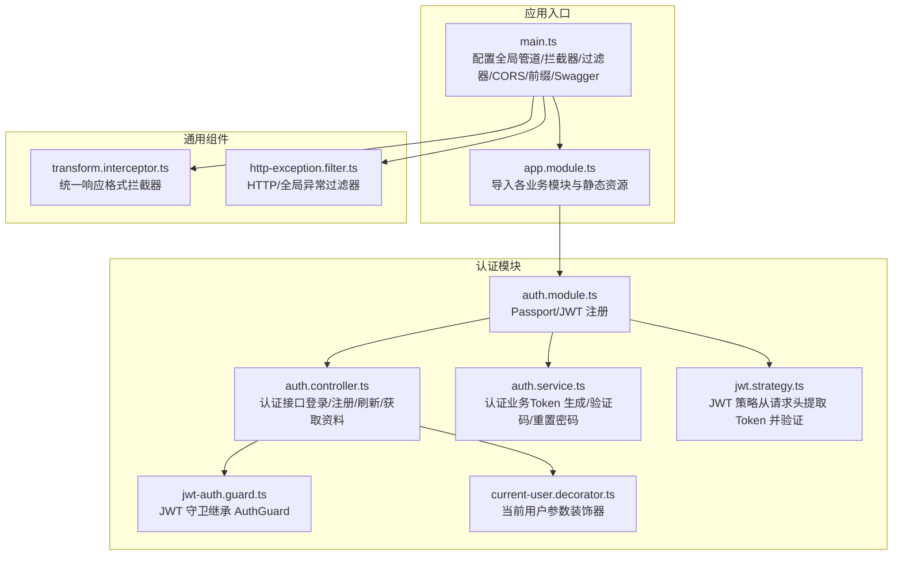
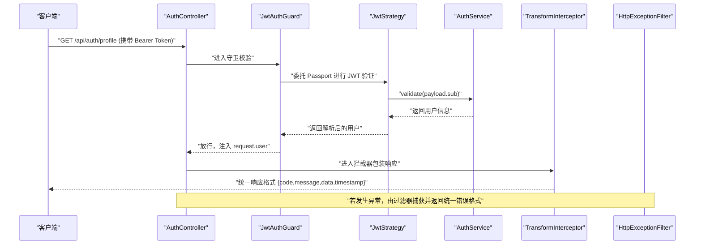
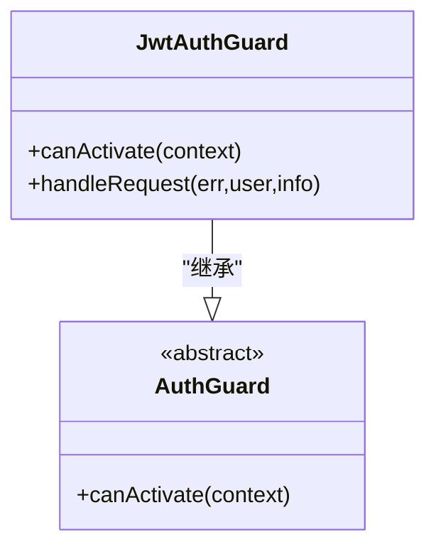
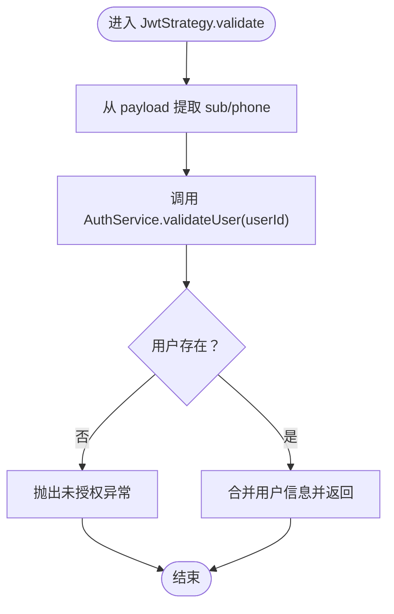
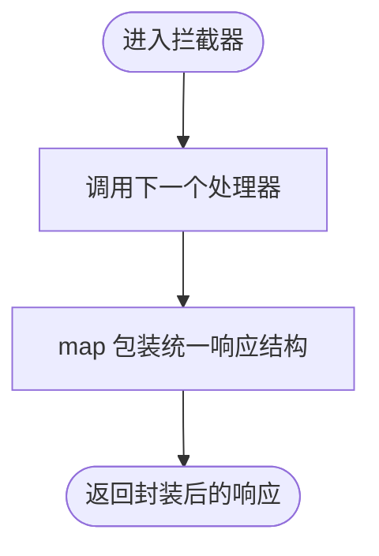
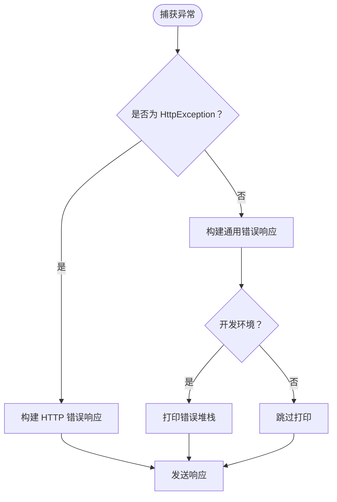
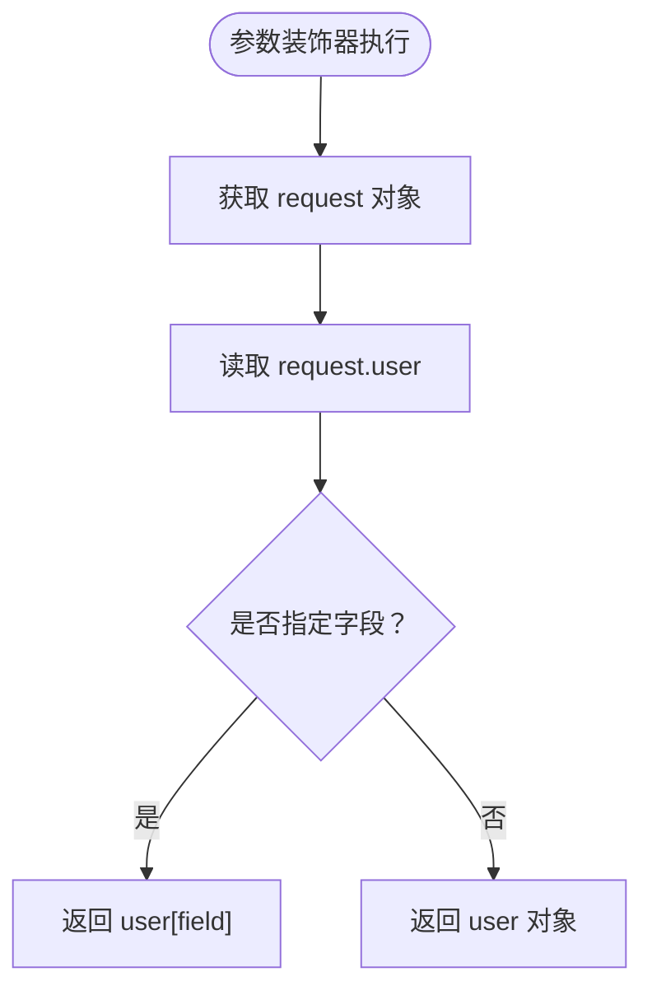
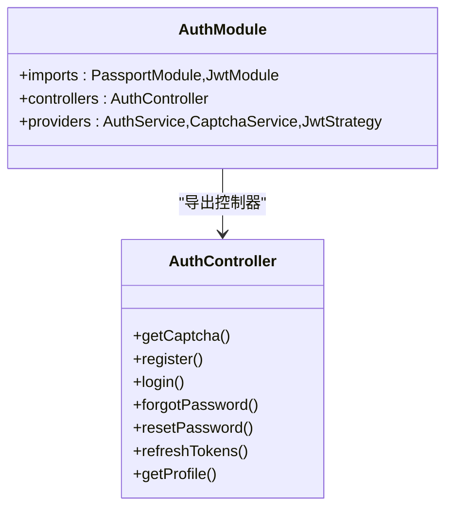
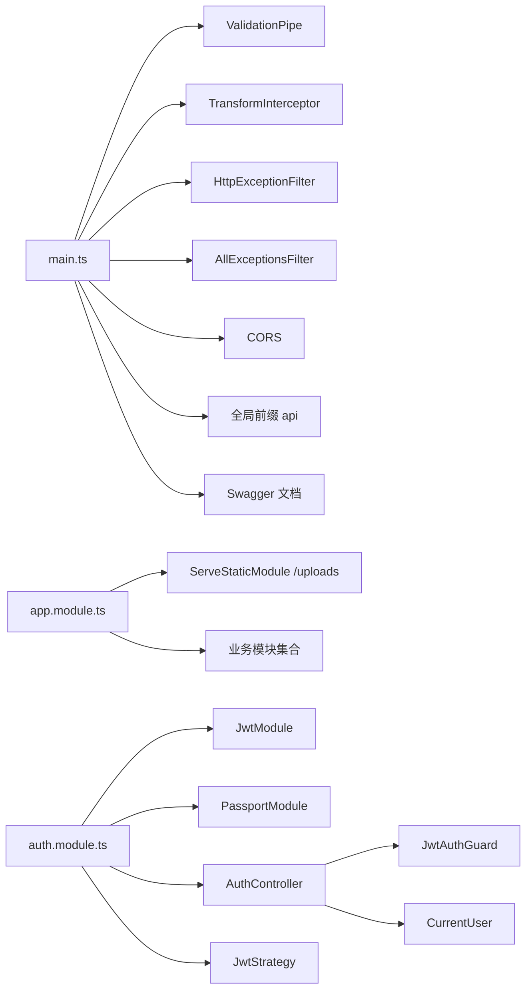

# 中间件和守卫

<cite>
**本文引用的文件**
- [backend/src/common/guards/jwt-auth.guard.ts](file://backend/src/common/guards/jwt-auth.guard.ts)
- [backend/src/common/interceptors/transform.interceptor.ts](file://backend/src/common/interceptors/transform.interceptor.ts)
- [backend/src/common/filters/http-exception.filter.ts](file://backend/src/common/filters/http-exception.filter.ts)
- [backend/src/common/decorators/current-user.decorator.ts](file://backend/src/common/decorators/current-user.decorator.ts)
- [backend/src/modules/auth/strategies/jwt.strategy.ts](file://backend/src/modules/auth/strategies/jwt.strategy.ts)
- [backend/src/app.module.ts](file://backend/src/app.module.ts)
- [backend/src/main.ts](file://backend/src/main.ts)
- [backend/src/modules/auth/auth.module.ts](file://backend/src/modules/auth/auth.module.ts)
- [backend/src/modules/auth/auth.controller.ts](file://backend/src/modules/auth/auth.controller.ts)
- [backend/src/modules/auth/auth.service.ts](file://backend/src/modules/auth/auth.service.ts)
- [backend/src/modules/auth/dto/login.dto.ts](file://backend/src/modules/auth/dto/login.dto.ts)
- [backend/src/modules/auth/dto/register.dto.ts](file://backend/src/modules/auth/dto/register.dto.ts)
- [backend/src/modules/auth/dto/reset-password.dto.ts](file://backend/src/modules/auth/dto/reset-password.dto.ts)
- [backend/src/modules/auth/captcha.service.ts](file://backend/src/modules/auth/captcha.service.ts)
- [backend/package.json](file://backend/package.json)
</cite>

## 目录
1. [简介](#简介)
2. [项目结构](#项目结构)
3. [核心组件](#核心组件)
4. [架构总览](#架构总览)
5. [详细组件分析](#详细组件分析)
6. [依赖关系分析](#依赖关系分析)
7. [性能考虑](#性能考虑)
8. [故障排查指南](#故障排查指南)
9. [结论](#结论)
10. [附录](#附录)

## 简介
本文件系统性梳理畅搭（FreeDress）后端在 NestJS 中的中间件与守卫体系，涵盖以下主题：
- 请求预处理、响应处理与错误拦截的实现与使用
- JWT 认证守卫的实现原理（Token 验证、用户权限检查、异常处理）
- 拦截器的统一响应格式、数据转换与日志记录
- HTTP 异常过滤器的错误捕获、格式化与响应处理
- 自定义装饰器（当前用户装饰器）的实现与应用场景
- 中间件链的执行顺序与最佳实践

## 项目结构
后端采用模块化组织，认证相关能力集中在 auth 模块，并通过策略、守卫、拦截器、过滤器与装饰器协同工作。

图表来源
- [backend/src/main.ts:12-59](file://backend/src/main.ts#L12-L59)
- [backend/src/app.module.ts:13-31](file://backend/src/app.module.ts#L13-L31)
- [backend/src/modules/auth/auth.module.ts:13-29](file://backend/src/modules/auth/auth.module.ts#L13-L29)
- [backend/src/modules/auth/auth.controller.ts:16-91](file://backend/src/modules/auth/auth.controller.ts#L16-L91)
- [backend/src/common/interceptors/transform.interceptor.ts:19-31](file://backend/src/common/interceptors/transform.interceptor.ts#L19-L31)
- [backend/src/common/filters/http-exception.filter.ts:8-80](file://backend/src/common/filters/http-exception.filter.ts#L8-L80)
- [backend/src/common/guards/jwt-auth.guard.ts:8-21](file://backend/src/common/guards/jwt-auth.guard.ts#L8-L21)
- [backend/src/common/decorators/current-user.decorator.ts:7-15](file://backend/src/common/decorators/current-user.decorator.ts#L7-L15)
- [backend/src/modules/auth/strategies/jwt.strategy.ts:10-38](file://backend/src/modules/auth/strategies/jwt.strategy.ts#L10-L38)

章节来源
- [backend/src/app.module.ts:13-31](file://backend/src/app.module.ts#L13-L31)
- [backend/src/main.ts:12-59](file://backend/src/main.ts#L12-L59)

## 核心组件
- JWT 认证守卫：基于 Passport 的 AuthGuard 扩展，负责拦截受保护路由，完成 Token 验证与用户注入。
- JWT 策略：从请求头提取 Bearer Token，使用密钥验证签名，调用服务层校验用户有效性。
- 统一响应拦截器：对所有响应进行包装，统一 code/message/data/timestamp 结构。
- HTTP 异常过滤器：捕获 HttpException 与未处理异常，输出一致的错误响应。
- 当前用户装饰器：从请求上下文提取用户对象或指定字段，简化控制器参数获取。
- 验证码服务：提供图片验证码生成、校验与防刷机制，支撑注册/找回密码流程。

章节来源
- [backend/src/common/guards/jwt-auth.guard.ts:8-21](file://backend/src/common/guards/jwt-auth.guard.ts#L8-L21)
- [backend/src/modules/auth/strategies/jwt.strategy.ts:10-38](file://backend/src/modules/auth/strategies/jwt.strategy.ts#L10-L38)
- [backend/src/common/interceptors/transform.interceptor.ts:19-31](file://backend/src/common/interceptors/transform.interceptor.ts#L19-L31)
- [backend/src/common/filters/http-exception.filter.ts:8-80](file://backend/src/common/filters/http-exception.filter.ts#L8-L80)
- [backend/src/common/decorators/current-user.decorator.ts:7-15](file://backend/src/common/decorators/current-user.decorator.ts#L7-L15)
- [backend/src/modules/auth/captcha.service.ts:30-51](file://backend/src/modules/auth/captcha.service.ts#L30-L51)

## 架构总览
下图展示一次典型“获取当前用户”请求在系统内的处理链路，体现守卫、策略、拦截器与过滤器的协作。

图表来源
- [backend/src/modules/auth/auth.controller.ts:84-90](file://backend/src/modules/auth/auth.controller.ts#L84-L90)
- [backend/src/common/guards/jwt-auth.guard.ts:10-20](file://backend/src/common/guards/jwt-auth.guard.ts#L10-L20)
- [backend/src/modules/auth/strategies/jwt.strategy.ts:28-37](file://backend/src/modules/auth/strategies/jwt.strategy.ts#L28-L37)
- [backend/src/modules/auth/auth.service.ts:260-277](file://backend/src/modules/auth/auth.service.ts#L260-L277)
- [backend/src/common/interceptors/transform.interceptor.ts:21-30](file://backend/src/common/interceptors/transform.interceptor.ts#L21-L30)
- [backend/src/common/filters/http-exception.filter.ts:9-28](file://backend/src/common/filters/http-exception.filter.ts#L9-L28)

## 详细组件分析

### JWT 认证守卫（JwtAuthGuard）
- 继承自 AuthGuard('jwt')，默认使用 Passport 的 jwt 策略。
- 在 canActivate 中直接委托父类完成验证；handleRequest 中统一抛出未授权异常，保证下游控制器只处理有效用户。
- 适用于需要登录态的接口，如获取用户资料、刷新 Token 等。

图表来源
- [backend/src/common/guards/jwt-auth.guard.ts:8-21](file://backend/src/common/guards/jwt-auth.guard.ts#L8-L21)

章节来源
- [backend/src/common/guards/jwt-auth.guard.ts:8-21](file://backend/src/common/guards/jwt-auth.guard.ts#L8-L21)
- [backend/src/modules/auth/auth.controller.ts:84-90](file://backend/src/modules/auth/auth.controller.ts#L84-L90)

### JWT 策略（JwtStrategy）
- 从 Authorization 头部提取 Bearer Token，使用密钥验证签名且不允许过期。
- validate 方法根据 payload.sub 查询用户，合并用户基础信息后返回，供守卫注入到请求上下文。
- 与 JwtModule 的 secret/signOptions 配合，决定签发与校验规则。

图表来源
- [backend/src/modules/auth/strategies/jwt.strategy.ts:28-37](file://backend/src/modules/auth/strategies/jwt.strategy.ts#L28-L37)
- [backend/src/modules/auth/auth.service.ts:260-277](file://backend/src/modules/auth/auth.service.ts#L260-L277)

章节来源
- [backend/src/modules/auth/strategies/jwt.strategy.ts:10-38](file://backend/src/modules/auth/strategies/jwt.strategy.ts#L10-L38)
- [backend/src/modules/auth/auth.service.ts:260-277](file://backend/src/modules/auth/auth.service.ts#L260-L277)

### 统一响应拦截器（TransformInterceptor）
- 将控制器返回的数据统一封装为 {code,message,data,timestamp}。
- 通过 RxJS pipe 实现非侵入式响应格式化，保证所有接口输出一致性。
- 作为全局拦截器启用，无需在每个控制器重复处理。

图表来源
- [backend/src/common/interceptors/transform.interceptor.ts:21-30](file://backend/src/common/interceptors/transform.interceptor.ts#L21-L30)

章节来源
- [backend/src/common/interceptors/transform.interceptor.ts:19-31](file://backend/src/common/interceptors/transform.interceptor.ts#L19-L31)
- [backend/src/main.ts:24-25](file://backend/src/main.ts#L24-L25)

### HTTP 异常过滤器（HttpExceptionFilter 与 AllExceptionsFilter）
- HttpExceptionFilter：捕获 HttpException，提取状态码与消息，统一输出包含 code/message/data/timestamp/path 的错误响应。
- AllExceptionsFilter：捕获所有未处理异常，在开发环境打印堆栈便于调试，生产环境返回通用错误信息。
- 两者均作为全局过滤器注册，确保异常处理的一致性与可观测性。

图表来源
- [backend/src/common/filters/http-exception.filter.ts:9-28](file://backend/src/common/filters/http-exception.filter.ts#L9-L28)
- [backend/src/common/filters/http-exception.filter.ts:51-79](file://backend/src/common/filters/http-exception.filter.ts#L51-L79)

章节来源
- [backend/src/common/filters/http-exception.filter.ts:8-80](file://backend/src/common/filters/http-exception.filter.ts#L8-L80)
- [backend/src/main.ts:27-29](file://backend/src/main.ts#L27-L29)

### 当前用户装饰器（CurrentUser）
- 通过 createParamDecorator 从请求上下文 request.user 中提取用户对象或指定字段。
- 支持两种用法：@CurrentUser() 获取完整用户；@CurrentUser('sub') 获取用户 ID。
- 与 JwtAuthGuard 协作，确保仅在已认证场景下可用。

图表来源
- [backend/src/common/decorators/current-user.decorator.ts:7-15](file://backend/src/common/decorators/current-user.decorator.ts#L7-L15)

章节来源
- [backend/src/common/decorators/current-user.decorator.ts:7-15](file://backend/src/common/decorators/current-user.decorator.ts#L7-L15)
- [backend/src/modules/auth/auth.controller.ts:77-89](file://backend/src/modules/auth/auth.controller.ts#L77-L89)

### 认证模块与控制器
- 认证模块注册 Passport 默认策略为 jwt，并配置 JwtModule 的 secret 与过期时间。
- 控制器提供注册、登录、忘记密码、重置密码、刷新 Token、获取当前用户资料等接口。
- 守卫与装饰器在受保护接口上使用，确保只有合法用户可访问。

图表来源
- [backend/src/modules/auth/auth.module.ts:13-29](file://backend/src/modules/auth/auth.module.ts#L13-L29)
- [backend/src/modules/auth/auth.controller.ts:16-91](file://backend/src/modules/auth/auth.controller.ts#L16-L91)

章节来源
- [backend/src/modules/auth/auth.module.ts:13-29](file://backend/src/modules/auth/auth.module.ts#L13-L29)
- [backend/src/modules/auth/auth.controller.ts:16-91](file://backend/src/modules/auth/auth.controller.ts#L16-L91)

### DTO 与验证码服务
- 登录/注册/重置密码 DTO 使用 class-validator 进行参数校验，结合 Swagger 注解提升接口文档质量。
- 验证码服务提供 SVG 图片验证码生成、校验与防刷（过期、尝试次数、IP 限流），保障注册/找回密码流程安全。

章节来源
- [backend/src/modules/auth/dto/login.dto.ts:7-19](file://backend/src/modules/auth/dto/login.dto.ts#L7-L19)
- [backend/src/modules/auth/dto/register.dto.ts:8-37](file://backend/src/modules/auth/dto/register.dto.ts#L8-L37)
- [backend/src/modules/auth/dto/reset-password.dto.ts:7-18](file://backend/src/modules/auth/dto/reset-password.dto.ts#L7-L18)
- [backend/src/modules/auth/captcha.service.ts:30-51](file://backend/src/modules/auth/captcha.service.ts#L30-L51)

## 依赖关系分析
- 入口文件 main.ts 负责全局配置：ValidationPipe、TransformInterceptor、AllExceptionsFilter、HttpExceptionFilter、CORS、全局前缀、Swagger。
- app.module.ts 导入静态资源模块（ServeStaticModule）与业务模块，提供上传目录访问。
- 认证模块通过 JwtModule 与 PassportModule 提供 JWT 能力，策略与守卫配合完成鉴权。
- 通用组件（拦截器/过滤器/守卫/装饰器）以全局方式注入，避免在各控制器重复声明。

图表来源
- [backend/src/main.ts:12-59](file://backend/src/main.ts#L12-L59)
- [backend/src/app.module.ts:13-31](file://backend/src/app.module.ts#L13-L31)
- [backend/src/modules/auth/auth.module.ts:13-29](file://backend/src/modules/auth/auth.module.ts#L13-L29)

章节来源
- [backend/src/main.ts:12-59](file://backend/src/main.ts#L12-L59)
- [backend/src/app.module.ts:13-31](file://backend/src/app.module.ts#L13-L31)
- [backend/src/modules/auth/auth.module.ts:13-29](file://backend/src/modules/auth/auth.module.ts#L13-L29)

## 性能考虑
- 全局拦截器与过滤器对所有请求生效，建议保持逻辑轻量，避免阻塞主流程。
- 验证码服务与认证服务中的定时清理任务（过期令牌/验证码）降低内存占用，适合生产环境迁移至 Redis。
- Passport/JWT 的验证开销较小，但需注意密钥管理与过期策略合理配置。
- Swagger 在生产环境可通过部署策略限制访问，避免泄露敏感信息。

## 故障排查指南
- 401 未授权
  - 检查请求头是否包含正确的 Bearer Token。
  - 确认 Token 未过期，密钥与签发方一致。
  - 排查守卫是否正确应用于受保护接口。
- 400 参数错误
  - 关注 DTO 校验失败提示，确认必填字段与格式。
  - 注册/忘记密码场景需先获取并校验验证码。
- 500 服务器错误
  - 开发环境会打印堆栈，定位具体异常来源。
  - 生产环境统一返回通用错误，需查看服务端日志。
- 响应格式不一致
  - 确认全局拦截器已启用，且控制器未手动绕过包装。

章节来源
- [backend/src/common/filters/http-exception.filter.ts:51-79](file://backend/src/common/filters/http-exception.filter.ts#L51-L79)
- [backend/src/common/interceptors/transform.interceptor.ts:19-31](file://backend/src/common/interceptors/transform.interceptor.ts#L19-L31)
- [backend/src/modules/auth/auth.controller.ts:74-79](file://backend/src/modules/auth/auth.controller.ts#L74-L79)

## 结论
畅搭后端通过守卫、策略、拦截器、过滤器与装饰器构建了清晰、一致且可扩展的认证与请求处理链路。全局配置确保了跨模块的一致性，同时 DTO 与验证码服务提升了接口安全性与用户体验。建议在生产环境中进一步完善缓存与日志策略，持续优化异常监控与可观测性。

## 附录
- 环境变量与配置要点
  - JWT_SECRET、JWT_EXPIRES_IN、JWT_REFRESH_SECRET：用于签发与校验 Token。
  - NODE_ENV：控制开发模式下的错误堆栈输出。
- 依赖版本
  - @nestjs/*、@nestjs/jwt、@nestjs/passport、passport-jwt、class-validator 等。

章节来源
- [backend/src/modules/auth/strategies/jwt.strategy.ts:13-20](file://backend/src/modules/auth/strategies/jwt.strategy.ts#L13-L20)
- [backend/src/modules/auth/auth.module.ts:18-23](file://backend/src/modules/auth/auth.module.ts#L18-L23)
- [backend/src/main.ts:68-70](file://backend/src/main.ts#L68-L70)
- [backend/package.json:26-44](file://backend/package.json#L26-L44)