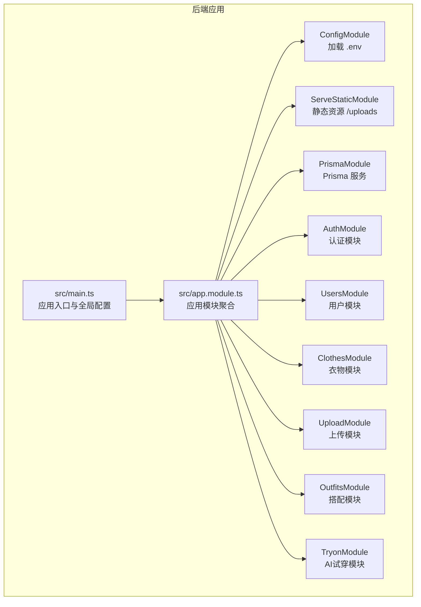
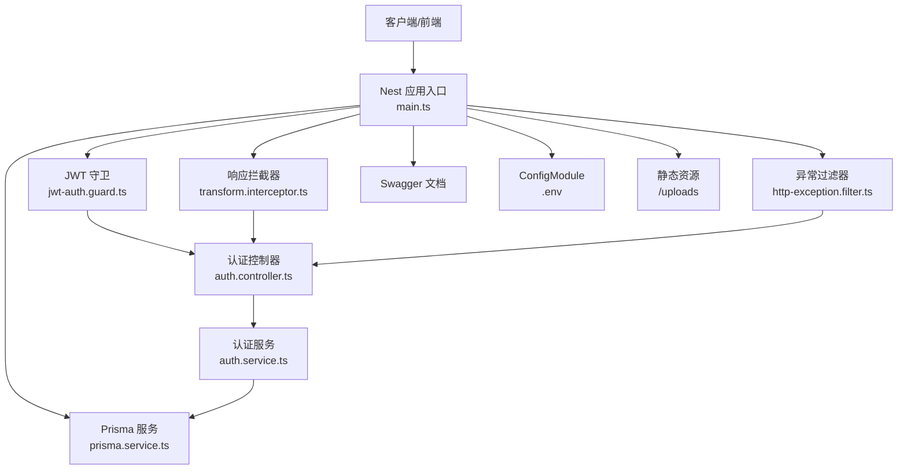
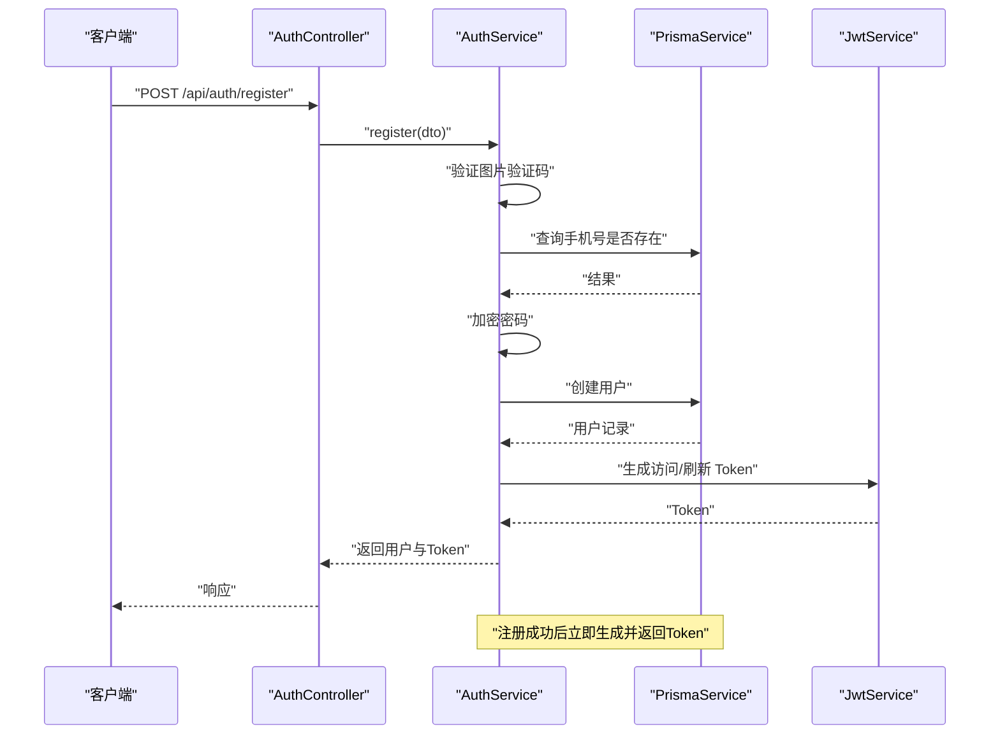
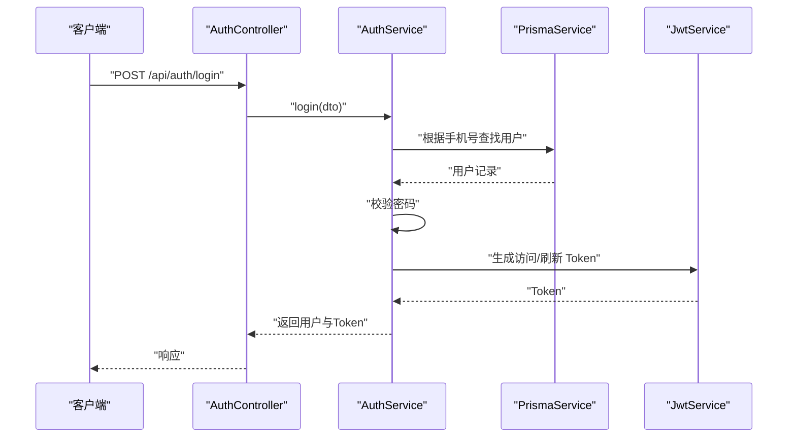
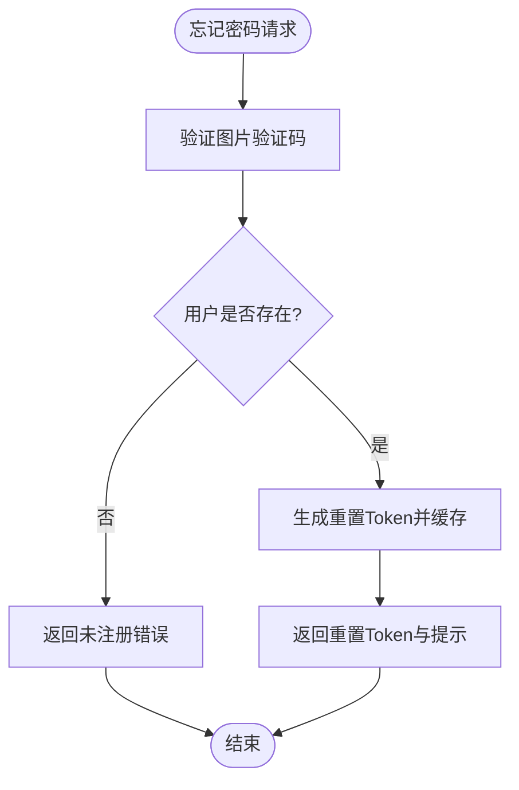
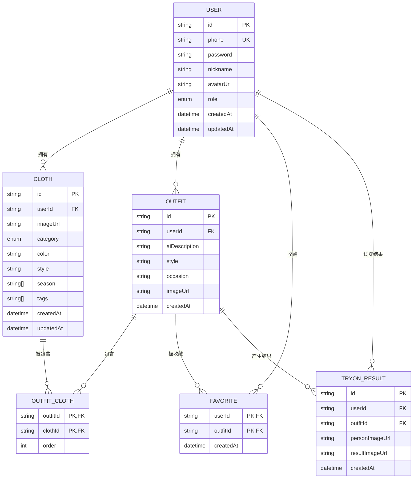
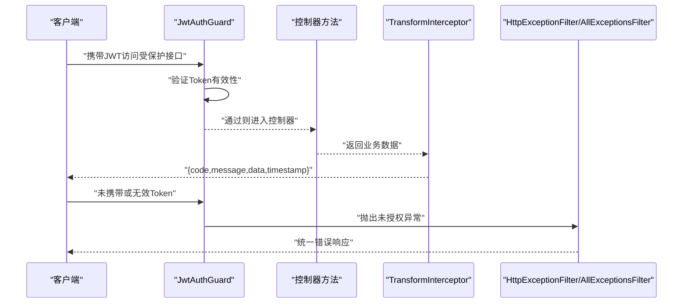
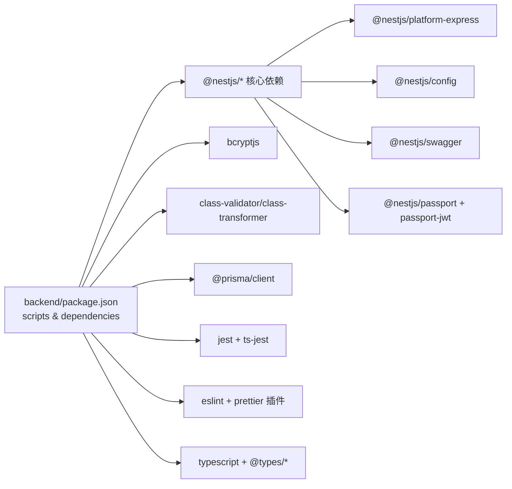

# 开发工作流程

<cite>
**本文引用的文件**
- [backend/package.json](file://backend/package.json)
- [backend/src/main.ts](file://backend/src/main.ts)
- [backend/src/app.module.ts](file://backend/src/app.module.ts)
- [backend/prisma/schema.prisma](file://backend/prisma/schema.prisma)
- [backend/tsconfig.json](file://backend/tsconfig.json)
- [backend/src/common/guards/jwt-auth.guard.ts](file://backend/src/common/guards/jwt-auth.guard.ts)
- [backend/src/common/interceptors/transform.interceptor.ts](file://backend/src/common/interceptors/transform.interceptor.ts)
- [backend/src/common/filters/http-exception.filter.ts](file://backend/src/common/filters/http-exception.filter.ts)
- [backend/src/modules/auth/auth.controller.ts](file://backend/src/modules/auth/auth.controller.ts)
- [backend/src/modules/auth/auth.service.ts](file://backend/src/modules/auth/auth.service.ts)
- [backend/src/prisma/prisma.service.ts](file://backend/src/prisma/prisma.service.ts)
</cite>

## 目录
1. [简介](#简介)
2. [项目结构](#项目结构)
3. [核心组件](#核心组件)
4. [架构总览](#架构总览)
5. [详细组件分析](#详细组件分析)
6. [依赖分析](#依赖分析)
7. [性能考虑](#性能考虑)
8. [故障排除指南](#故障排除指南)
9. [结论](#结论)
10. [附录](#附录)

## 简介
本指南面向畅搭(FreeDress)后端开发团队，提供从环境搭建到部署上线的完整开发工作流程。内容涵盖开发环境准备、依赖安装与数据库配置、开发服务器启动与调试、Git 工作流与分支管理、测试策略与覆盖率要求、代码质量与静态分析、自动化构建流程，以及开发/测试/生产环境差异与部署准备。目标是帮助团队建立标准化、可重复、高效率的协作开发模式。

## 项目结构
后端采用 NestJS + Prisma 的分层架构，模块化组织业务功能，统一通过 AppModule 导入各业务模块与基础设施模块。Prisma 负责数据模型与迁移，Swagger 提供 API 文档，全局管道、拦截器与过滤器保证请求验证、响应格式与异常处理的一致性。

图表来源
- [backend/src/main.ts:12-59](file://backend/src/main.ts#L12-L59)
- [backend/src/app.module.ts:13-31](file://backend/src/app.module.ts#L13-L31)

章节来源
- [backend/src/main.ts:12-59](file://backend/src/main.ts#L12-L59)
- [backend/src/app.module.ts:13-31](file://backend/src/app.module.ts#L13-L31)

## 核心组件
- 应用入口与全局配置：在入口中配置全局管道、拦截器、过滤器、CORS、API 前缀与 Swagger 文档。
- 模块聚合：通过 AppModule 统一导入 Prisma、认证、用户、衣物、上传、搭配、AI 试穿等模块。
- 数据库与模型：使用 Prisma 定义用户、衣物、搭配、收藏、试穿结果等模型，支持 PostgreSQL。
- 安全与认证：JWT 守卫保护受保护路由；认证服务负责注册、登录、Token 刷新、忘记/重置密码。
- 统一响应与异常处理：拦截器统一响应格式；过滤器统一异常处理。

章节来源
- [backend/src/main.ts:12-59](file://backend/src/main.ts#L12-L59)
- [backend/src/app.module.ts:13-31](file://backend/src/app.module.ts#L13-L31)
- [backend/prisma/schema.prisma:14-131](file://backend/prisma/schema.prisma#L14-L131)
- [backend/src/common/guards/jwt-auth.guard.ts:8-21](file://backend/src/common/guards/jwt-auth.guard.ts#L8-L21)
- [backend/src/common/interceptors/transform.interceptor.ts:19-31](file://backend/src/common/interceptors/transform.interceptor.ts#L19-L31)
- [backend/src/common/filters/http-exception.filter.ts:8-80](file://backend/src/common/filters/http-exception.filter.ts#L8-L80)

## 架构总览
后端采用模块化设计，按领域划分模块，共享基础设施（Prisma、配置、静态资源）。认证模块提供用户认证与授权能力，其他模块围绕用户、衣物、搭配、上传与试穿展开。

图表来源
- [backend/src/main.ts:12-59](file://backend/src/main.ts#L12-L59)
- [backend/src/common/guards/jwt-auth.guard.ts:8-21](file://backend/src/common/guards/jwt-auth.guard.ts#L8-L21)
- [backend/src/common/interceptors/transform.interceptor.ts:19-31](file://backend/src/common/interceptors/transform.interceptor.ts#L19-L31)
- [backend/src/common/filters/http-exception.filter.ts:8-80](file://backend/src/common/filters/http-exception.filter.ts#L8-L80)
- [backend/src/prisma/prisma.service.ts:8-26](file://backend/src/prisma/prisma.service.ts#L8-L26)
- [backend/src/modules/auth/auth.controller.ts:16-91](file://backend/src/modules/auth/auth.controller.ts#L16-L91)
- [backend/src/modules/auth/auth.service.ts:24-37](file://backend/src/modules/auth/auth.service.ts#L24-L37)

## 详细组件分析

### 认证模块（Auth）
认证模块提供注册、登录、刷新 Token、获取用户信息、忘记密码与重置密码等功能。服务层实现密码加密、Token 生成与管理、验证码校验与过期清理等逻辑。

图表来源
- [backend/src/modules/auth/auth.controller.ts:37-41](file://backend/src/modules/auth/auth.controller.ts#L37-L41)
- [backend/src/modules/auth/auth.service.ts:44-95](file://backend/src/modules/auth/auth.service.ts#L44-L95)

图表来源
- [backend/src/modules/auth/auth.controller.ts:46-50](file://backend/src/modules/auth/auth.controller.ts#L46-L50)
- [backend/src/modules/auth/auth.service.ts:102-135](file://backend/src/modules/auth/auth.service.ts#L102-L135)

图表来源
- [backend/src/modules/auth/auth.controller.ts:55-59](file://backend/src/modules/auth/auth.controller.ts#L55-L59)
- [backend/src/modules/auth/auth.service.ts:180-207](file://backend/src/modules/auth/auth.service.ts#L180-L207)

章节来源
- [backend/src/modules/auth/auth.controller.ts:16-91](file://backend/src/modules/auth/auth.controller.ts#L16-L91)
- [backend/src/modules/auth/auth.service.ts:24-279](file://backend/src/modules/auth/auth.service.ts#L24-L279)

### 数据模型与数据库（Prisma）
数据库模型覆盖用户、衣物、搭配、收藏、试穿结果等实体，定义了主键、唯一约束、索引与外键级联删除策略。数据源指向 PostgreSQL，通过 DATABASE_URL 环境变量配置。

图表来源
- [backend/prisma/schema.prisma:14-131](file://backend/prisma/schema.prisma#L14-L131)

章节来源
- [backend/prisma/schema.prisma:1-132](file://backend/prisma/schema.prisma#L1-132)

### 全局中间件与安全（拦截器、过滤器、守卫）
- 响应拦截器：统一将业务返回包装为 { code, message, data, timestamp } 结构。
- 异常过滤器：捕获 HTTP 异常与未处理异常，输出一致的错误响应并打印开发环境堆栈。
- JWT 守卫：基于 Passport 的 JWT 策略，未通过认证时抛出未授权异常。

图表来源
- [backend/src/common/guards/jwt-auth.guard.ts:8-21](file://backend/src/common/guards/jwt-auth.guard.ts#L8-L21)
- [backend/src/common/interceptors/transform.interceptor.ts:19-31](file://backend/src/common/interceptors/transform.interceptor.ts#L19-L31)
- [backend/src/common/filters/http-exception.filter.ts:8-80](file://backend/src/common/filters/http-exception.filter.ts#L8-L80)

章节来源
- [backend/src/common/interceptors/transform.interceptor.ts:19-31](file://backend/src/common/interceptors/transform.interceptor.ts#L19-L31)
- [backend/src/common/filters/http-exception.filter.ts:8-80](file://backend/src/common/filters/http-exception.filter.ts#L8-L80)
- [backend/src/common/guards/jwt-auth.guard.ts:8-21](file://backend/src/common/guards/jwt-auth.guard.ts#L8-L21)

## 依赖分析
后端使用 NestJS 作为核心框架，Prisma 作为 ORM，Jest 作为测试框架，ESLint + Prettier 保障代码风格与质量。包脚本提供构建、开发、调试、测试、Prisma 相关任务与代码格式化。

图表来源
- [backend/package.json:26-72](file://backend/package.json#L26-L72)

章节来源
- [backend/package.json:8-25](file://backend/package.json#L8-L25)
- [backend/package.json:73-89](file://backend/package.json#L73-L89)

## 性能考虑
- 数据库连接管理：PrismaService 在模块初始化时连接并在销毁时断开，避免连接泄漏。
- 查询优化：模型中已为常用字段建立索引（如用户 ID、衣物分类），建议在高频查询场景下结合索引与分页。
- 缓存策略：认证服务中的重置 Token 使用内存 Map 存储，生产环境建议替换为 Redis 以支持分布式与持久化。
- 响应与异常：统一拦截与过滤减少重复逻辑，降低网络传输与解析成本。

章节来源
- [backend/src/prisma/prisma.service.ts:8-26](file://backend/src/prisma/prisma.service.ts#L8-L26)
- [backend/src/modules/auth/auth.service.ts:24-37](file://backend/src/modules/auth/auth.service.ts#L24-L37)
- [backend/prisma/schema.prisma:56-58](file://backend/prisma/schema.prisma#L56-L58)

## 故障排除指南
- 启动失败（端口占用）：检查端口占用情况，或在环境变量中调整端口。
- Swagger 文档无法访问：确认全局前缀与 Swagger 设置正确。
- 数据库连接失败：检查 DATABASE_URL 是否正确，确保 PostgreSQL 服务可用。
- 认证失败：核对 JWT_SECRET、JWT_REFRESH_SECRET 与过期时间配置，确认 Token 有效。
- 测试失败：使用调试模式运行单测定位问题，关注覆盖率报告与断言点。

章节来源
- [backend/src/main.ts:50-58](file://backend/src/main.ts#L50-L58)
- [backend/src/app.module.ts:15-18](file://backend/src/app.module.ts#L15-L18)
- [backend/src/modules/auth/auth.service.ts:153-171](file://backend/src/modules/auth/auth.service.ts#L153-L171)

## 结论
本指南提供了畅搭后端从环境搭建到部署的全流程实践路径。通过模块化架构、统一的安全与响应机制、完善的测试与质量工具链，团队可以高效协作并持续交付高质量的后端服务。

## 附录

### 开发环境搭建
- Node.js 版本：使用与项目 TypeScript 相匹配的 LTS 或稳定版本（参考 TypeScript 与 Node 版本兼容性）。
- 依赖安装：在 backend 目录执行依赖安装命令。
- 数据库配置：设置 DATABASE_URL 环境变量指向 PostgreSQL 实例；首次运行需执行 Prisma 迁移与种子数据生成。
- 开发服务器：使用开发模式启动，支持热重载与调试。
- 代码格式化与静态检查：使用 ESLint 与 Prettier 规范代码风格。

章节来源
- [backend/package.json:8-25](file://backend/package.json#L8-L25)
- [backend/prisma/schema.prisma:8-11](file://backend/prisma/schema.prisma#L8-L11)
- [backend/tsconfig.json:10-11](file://backend/tsconfig.json#L10-L11)

### 开发服务器启动与调试
- 启动方式：使用开发脚本启动，自动监听文件变化并重启。
- 调试：使用调试脚本启用断点调试，便于定位问题。
- 端口与文档：默认端口与 Swagger 文档地址在入口中配置。

章节来源
- [backend/package.json:12-13](file://backend/package.json#L12-L13)
- [backend/package.json:19](file://backend/package.json#L19)
- [backend/src/main.ts:50-58](file://backend/src/main.ts#L50-L58)

### Git 工作流程与分支管理
- 分支策略：采用功能分支开发，合并前进行代码审查与测试。
- 提交规范：遵循约定式提交，保持提交信息清晰可读。
- 冲突解决：优先使用 rebase 保持线性历史，必要时进行三方合并。

[本节为通用实践指导，不直接分析具体文件]

### 单元测试与集成测试
- 单元测试：使用 Jest 与 ts-jest，按模块编写单元测试，覆盖核心业务逻辑。
- 集成测试：使用 E2E 测试框架验证端到端流程。
- 覆盖率：建议设置最低覆盖率阈值，持续提升代码质量。

章节来源
- [backend/package.json:16-20](file://backend/package.json#L16-L20)
- [backend/package.json:73-89](file://backend/package.json#L73-L89)

### 代码质量与静态分析
- ESLint：配置 TypeScript 解析与插件，修复规则错误。
- Prettier：统一代码风格，与编辑器保存钩子配合使用。
- Prisma：使用 Prisma CLI 生成客户端与迁移，保持模型与数据库同步。

章节来源
- [backend/package.json:59-61](file://backend/package.json#L59-L61)
- [backend/package.json:63](file://backend/package.json#L63)
- [backend/package.json:21-24](file://backend/package.json#L21-L24)

### 自动化构建与部署准备
- 构建：使用 Nest CLI 与 TypeScript 编译生成 dist 目录。
- 生产启动：使用生成的 main 文件启动服务。
- 环境差异：区分开发、测试、生产环境的配置项与日志级别。

章节来源
- [backend/package.json:9-14](file://backend/package.json#L9-L14)
- [backend/src/main.ts:50-52](file://backend/src/main.ts#L50-L52)