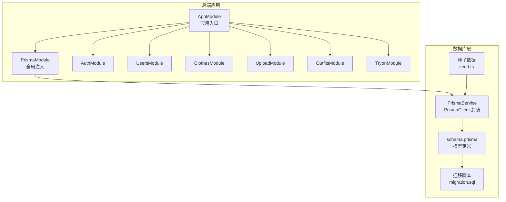
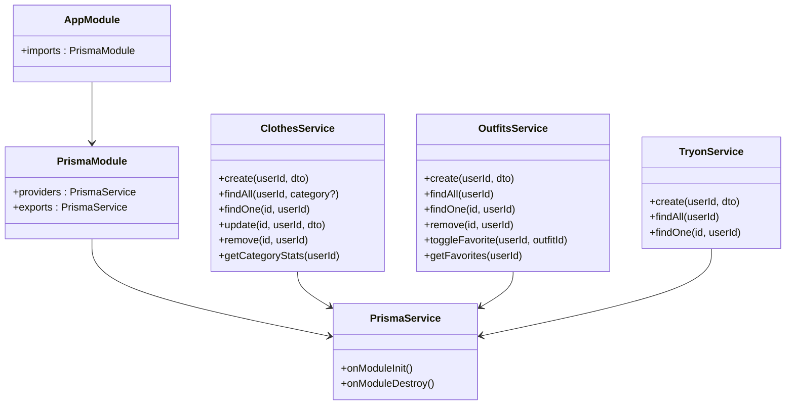
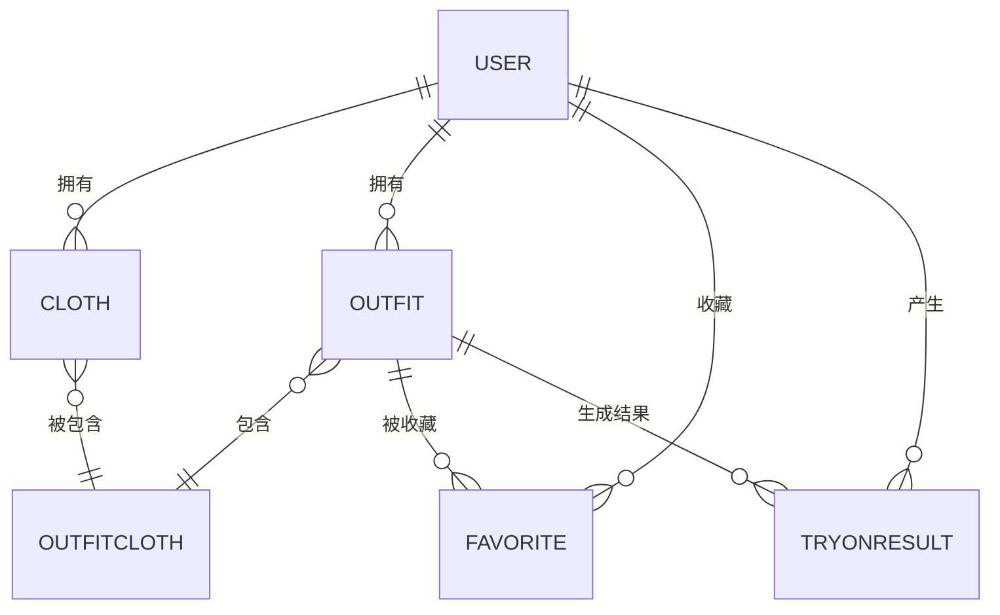
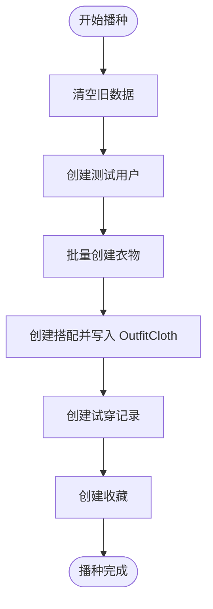
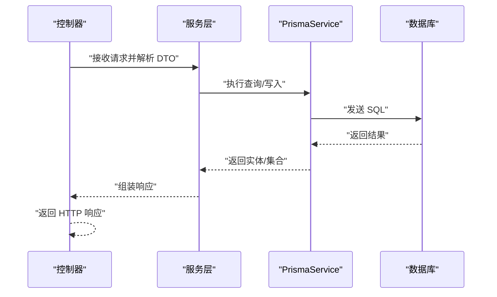
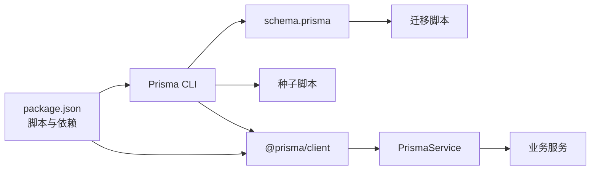

# 数据库集成

<cite>
**本文引用的文件**
- [schema.prisma](file://backend/prisma/schema.prisma)
- [seed.ts](file://backend/prisma/seed.ts)
- [prisma.service.ts](file://backend/src/prisma/prisma.service.ts)
- [prisma.module.ts](file://backend/src/prisma/prisma.module.ts)
- [package.json](file://backend/package.json)
- [migration.sql](file://backend/prisma/migrations/20260507090458_init/migration.sql)
- [clothes.service.ts](file://backend/src/modules/clothes/clothes.service.ts)
- [outfits.service.ts](file://backend/src/modules/outfits/outfits.service.ts)
- [tryon.service.ts](file://backend/src/modules/tryon/tryon.service.ts)
- [app.module.ts](file://backend/src/app.module.ts)
- [create-cloth.dto.ts](file://backend/src/modules/clothes/dto/create-cloth.dto.ts)
- [create-outfit.dto.ts](file://backend/src/modules/outfits/dto/create-outfit.dto.ts)
- [create-tryon.dto.ts](file://backend/src/modules/tryon/dto/create-tryon.dto.ts)
- [jwt-auth.guard.ts](file://backend/src/common/guards/jwt-auth.guard.ts)
</cite>

## 目录
1. [简介](#简介)
2. [项目结构](#项目结构)
3. [核心组件](#核心组件)
4. [架构总览](#架构总览)
5. [详细组件分析](#详细组件分析)
6. [依赖分析](#依赖分析)
7. [性能考虑](#性能考虑)
8. [故障排查指南](#故障排查指南)
9. [结论](#结论)
10. [附录](#附录)

## 简介
本文件系统性阐述畅搭(FreeDress)后端的数据库集成方案，围绕Prisma ORM展开，覆盖以下主题：
- 数据库连接与环境变量配置
- schema.prisma中的数据模型与关系映射
- 数据库迁移与种子数据
- Prisma 客户端的使用、查询语法与事务处理
- 在 NestJS 中集成 Prisma 的最佳实践
- 性能优化策略、索引设计与查询优化技巧

## 项目结构
后端采用 NestJS 架构，数据库层通过 Prisma 提供统一抽象，核心目录如下：
- backend/prisma：存放 Prisma Schema、迁移脚本与种子数据
- backend/src/prisma：NestJS 层面的 Prisma 服务与模块
- backend/src/modules：按功能划分的业务模块，均以 PrismaService 作为数据访问层
- backend/package.json：包含 Prisma 相关脚本命令

图表来源
- [app.module.ts:1-33](file://backend/src/app.module.ts#L1-L33)
- [prisma.module.ts:1-14](file://backend/src/prisma/prisma.module.ts#L1-L14)
- [prisma.service.ts:1-27](file://backend/src/prisma/prisma.service.ts#L1-L27)
- [schema.prisma:1-132](file://backend/prisma/schema.prisma#L1-L132)
- [migration.sql:1-121](file://backend/prisma/migrations/20260507090458_init/migration.sql#L1-L121)
- [seed.ts:1-182](file://backend/prisma/seed.ts#L1-L182)

章节来源
- [app.module.ts:1-33](file://backend/src/app.module.ts#L1-L33)
- [prisma.module.ts:1-14](file://backend/src/prisma/prisma.module.ts#L1-L14)
- [prisma.service.ts:1-27](file://backend/src/prisma/prisma.service.ts#L1-L27)

## 核心组件
- Prisma 模型与关系
  - User：用户表，包含手机号唯一索引、角色枚举、创建/更新时间戳；一对多关联到 Clothes、Outfits、Favorites、TryOnResult
  - Cloth：衣物表，多对一关联到 User；多对多通过 OutfitCloth 关联到 Outfit；具备按 userId 与 category 的索引
  - Outfit：搭配表，多对一关联到 User；多对多通过 OutfitCloth 关联到 Cloth；一对多关联到 Favorites、TryOnResult
  - OutfitCloth：多对多关联表，复合主键(outfitId, clothId)，记录搭配顺序
  - Favorite：用户收藏搭配，复合主键(userId, outfitId)
  - TryOnResult：AI 试穿结果，记录人物图与合成图，一对多关联到 User、Outfit
- 迁移与索引
  - 初始迁移创建了所有表、枚举类型、唯一索引与外键约束
  - 为高频查询字段建立索引，如 users.phone、clothes.userId、clothes.category、outfits.userId、tryon_results.userId、tryon_results.outfitId
- 种子数据
  - 清空旧数据后创建测试用户、衣物、搭配、收藏与试穿记录，演示多对多与一对多关系的插入

章节来源
- [schema.prisma:1-132](file://backend/prisma/schema.prisma#L1-L132)
- [migration.sql:1-121](file://backend/prisma/migrations/20260507090458_init/migration.sql#L1-L121)
- [seed.ts:1-182](file://backend/prisma/seed.ts#L1-L182)

## 架构总览
下图展示 Prisma 在 NestJS 中的集成方式与模块间协作：

图表来源
- [prisma.module.ts:1-14](file://backend/src/prisma/prisma.module.ts#L1-L14)
- [prisma.service.ts:1-27](file://backend/src/prisma/prisma.service.ts#L1-L27)
- [app.module.ts:1-33](file://backend/src/app.module.ts#L1-L33)
- [clothes.service.ts:1-148](file://backend/src/modules/clothes/clothes.service.ts#L1-L148)
- [outfits.service.ts:1-123](file://backend/src/modules/outfits/outfits.service.ts#L1-L123)
- [tryon.service.ts:1-88](file://backend/src/modules/tryon/tryon.service.ts#L1-L88)

## 详细组件分析

### 数据模型与关系映射
- 实体与属性
  - User：id、phone(唯一)、password、nickname、avatarUrl、role、createdAt、updatedAt
  - Cloth：id、userId、imageUrl、category、color、style、season[]、tags[]、createdAt、updatedAt
  - Outfit：id、userId、aiDescription、style、occasion、imageUrl、createdAt
  - OutfitCloth：outfitId、clothId、order
  - Favorite：userId、outfitId、createdAt
  - TryOnResult：id、userId、outfitId、personImageUrl、resultImageUrl、createdAt
- 关系
  - User 1 ——> * Clothes
  - User 1 ——> * Outfits
  - User 1 ——> * Favorites
  - User 1 ——> * TryOnResult
  - Outfit 1 ——> * OutfitCloth
  - Cloth 1 ——> * OutfitCloth
  - Outfit 1 ——> * Favorites
  - Outfit 1 ——> * TryOnResult
- 索引与约束
  - users.phone 唯一索引
  - clothes.userId、category 索引
  - outfits.userId 索引
  - tryon_results.userId、outfitId 索引
  - 所有关联均设置级联删除，保证数据一致性

图表来源
- [schema.prisma:1-132](file://backend/prisma/schema.prisma#L1-L132)
- [migration.sql:1-121](file://backend/prisma/migrations/20260507090458_init/migration.sql#L1-L121)

章节来源
- [schema.prisma:1-132](file://backend/prisma/schema.prisma#L1-L132)
- [migration.sql:1-121](file://backend/prisma/migrations/20260507090458_init/migration.sql#L1-L121)

### 数据库迁移机制
- 迁移生成与执行
  - 使用 Prisma CLI 生成迁移脚本，基于 schema.prisma 的变更生成 SQL
  - 迁移脚本包含枚举类型创建、表结构创建、索引与外键约束
- 版本控制
  - 迁移文件夹包含时间戳命名的目录与 lock 文件，确保并发安全
- 最佳实践
  - 在开发环境使用 dev 迁移，在生产环境使用 prod 迁移
  - 对生产环境迁移需谨慎，建议先在预生产环境验证

章节来源
- [package.json:8-25](file://backend/package.json#L8-L25)
- [migration.sql:1-121](file://backend/prisma/migrations/20260507090458_init/migration.sql#L1-L121)

### 种子数据的创建与管理
- 目标
  - 快速搭建演示环境，填充测试用户、衣物、搭配、收藏与试穿记录
- 流程
  - 启动前清空相关表
  - 创建用户并计算密码哈希
  - 批量创建衣物并返回 ID
  - 基于衣物创建搭配，并通过 OutfitCloth 建立多对多关系
  - 创建试穿记录与收藏
- 注意事项
  - 种子脚本应幂等，避免重复执行导致冲突
  - 生产环境不建议使用种子脚本，应通过业务流程或受控脚本导入

图表来源
- [seed.ts:1-182](file://backend/prisma/seed.ts#L1-L182)

章节来源
- [seed.ts:1-182](file://backend/prisma/seed.ts#L1-L182)

### Prisma 客户端使用与查询语法
- 基本 CRUD
  - create：创建实体并返回完整对象
  - findMany：支持 where、orderBy、include 等参数
  - findUnique：按唯一条件查询
  - update：按条件更新
  - delete：按条件删除
- 关联查询
  - include：嵌套包含关联实体，如衣物详情包含其所属搭配
  - select：仅选择部分字段，减少传输
- 聚合与分组
  - groupBy：按分类统计数量
- 事务处理
  - 使用事务包裹多表写入，保证一致性
  - 可通过 PrismaClient 的事务 API 实现
- 错误处理
  - 查询不到时抛出 NotFound 异常
  - 权限校验失败时抛出 Forbidden 异常

章节来源
- [clothes.service.ts:1-148](file://backend/src/modules/clothes/clothes.service.ts#L1-L148)
- [outfits.service.ts:1-123](file://backend/src/modules/outfits/outfits.service.ts#L1-L123)
- [tryon.service.ts:1-88](file://backend/src/modules/tryon/tryon.service.ts#L1-L88)

### 在 NestJS 中集成 Prisma 的最佳实践
- 服务封装
  - 将 PrismaClient 封装为 PrismaService，实现 OnModuleInit/OnModuleDestroy 生命周期钩子，自动连接与断开数据库
- 模块注册
  - 将 PrismaModule 声明为全局模块，向应用导出 PrismaService，各业务模块直接注入使用
- 控制器与服务解耦
  - 控制器只负责参数解析与响应包装，业务逻辑集中在服务层
- DTO 校验
  - 使用 class-validator 与 Swagger 注解，确保输入数据合法
- 权限与鉴权
  - 使用 JWT 守卫保护接口，确保用户身份与资源归属校验

图表来源
- [prisma.service.ts:1-27](file://backend/src/prisma/prisma.service.ts#L1-L27)
- [clothes.service.ts:1-148](file://backend/src/modules/clothes/clothes.service.ts#L1-L148)
- [outfits.service.ts:1-123](file://backend/src/modules/outfits/outfits.service.ts#L1-L123)
- [tryon.service.ts:1-88](file://backend/src/modules/tryon/tryon.service.ts#L1-L88)

章节来源
- [prisma.module.ts:1-14](file://backend/src/prisma/prisma.module.ts#L1-L14)
- [prisma.service.ts:1-27](file://backend/src/prisma/prisma.service.ts#L1-L27)
- [app.module.ts:1-33](file://backend/src/app.module.ts#L1-L33)
- [create-cloth.dto.ts:1-43](file://backend/src/modules/clothes/dto/create-cloth.dto.ts#L1-L43)
- [create-outfit.dto.ts:1-31](file://backend/src/modules/outfits/dto/create-outfit.dto.ts#L1-L31)
- [create-tryon.dto.ts:1-15](file://backend/src/modules/tryon/dto/create-tryon.dto.ts#L1-L15)
- [jwt-auth.guard.ts:1-22](file://backend/src/common/guards/jwt-auth.guard.ts#L1-L22)

## 依赖分析
- 外部依赖
  - @prisma/client：Prisma 客户端
  - prisma：Prisma CLI，用于生成客户端、迁移与 Studio
- 内部依赖
  - 各业务模块的服务均依赖 PrismaService
  - AppModule 导入 PrismaModule 并装配其他业务模块

图表来源
- [package.json:1-91](file://backend/package.json#L1-L91)
- [schema.prisma:1-132](file://backend/prisma/schema.prisma#L1-L132)
- [migration.sql:1-121](file://backend/prisma/migrations/20260507090458_init/migration.sql#L1-L121)
- [seed.ts:1-182](file://backend/prisma/seed.ts#L1-L182)
- [prisma.service.ts:1-27](file://backend/src/prisma/prisma.service.ts#L1-L27)

章节来源
- [package.json:1-91](file://backend/package.json#L1-L91)

## 性能考虑
- 索引设计
  - users.phone：唯一索引，保障登录与去重
  - clothes.userId、category：加速按用户与分类查询
  - outfits.userId：加速用户搭配列表
  - tryon_results.userId、outfitId：加速试穿记录查询
- 查询优化
  - 使用 select 仅取必要字段，减少网络与序列化开销
  - 使用 orderBy 与分页参数限制结果集大小
  - 使用 include 时限定关联层级，避免 N+1 查询
- 写入优化
  - 批量写入：Promise.all 并发创建衣物或搭配明细
  - 事务：将多步写入包裹在事务中，减少中间状态
- 缓存与静态资源
  - 图片 URL 存储于数据库，静态资源由静态服务器提供，降低数据库压力

## 故障排查指南
- 连接问题
  - 确认 DATABASE_URL 环境变量正确
  - 检查 PrismaService 的生命周期钩子是否正常执行
- 权限错误
  - 403 Forbidden：资源归属校验失败，确认当前用户与资源 owner 匹配
- 查询异常
  - 404 Not Found：查询实体不存在，检查 ID 或过滤条件
- 迁移失败
  - 查看迁移日志与 lock 文件，避免并发执行
- 种子数据异常
  - 确保种子脚本幂等，重复执行不会破坏一致性

章节来源
- [prisma.service.ts:1-27](file://backend/src/prisma/prisma.service.ts#L1-L27)
- [clothes.service.ts:58-81](file://backend/src/modules/clothes/clothes.service.ts#L58-L81)
- [outfits.service.ts:49-73](file://backend/src/modules/outfits/outfits.service.ts#L49-L73)
- [tryon.service.ts:52-75](file://backend/src/modules/tryon/tryon.service.ts#L52-L75)

## 结论
本方案以 Prisma 为核心，结合 NestJS 的模块化架构，实现了清晰的数据访问层与强一致的关系模型。通过合理的索引设计、查询优化与事务处理，兼顾了开发效率与运行性能。配合迁移与种子脚本，能够快速搭建演示环境并支持后续演进。

## 附录
- 常用命令
  - 生成客户端：prisma:generate
  - 开发迁移：prisma:migrate
  - 启动 Studio：prisma:studio
  - 执行种子：prisma:seed

章节来源
- [package.json:8-25](file://backend/package.json#L8-L25)