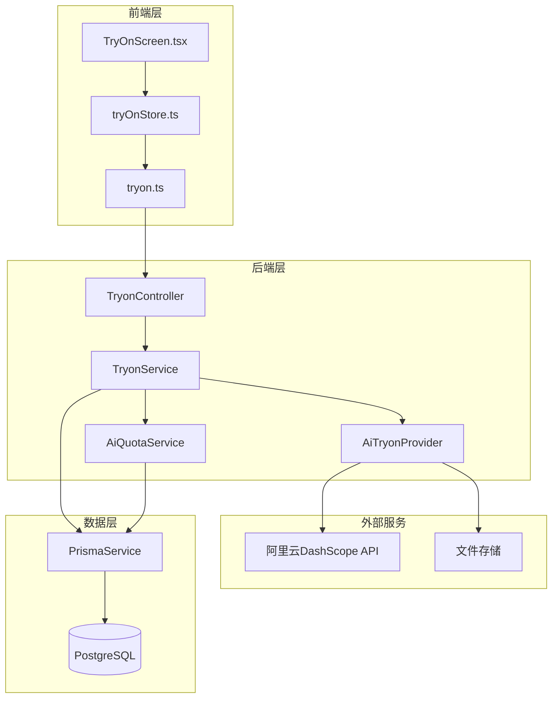
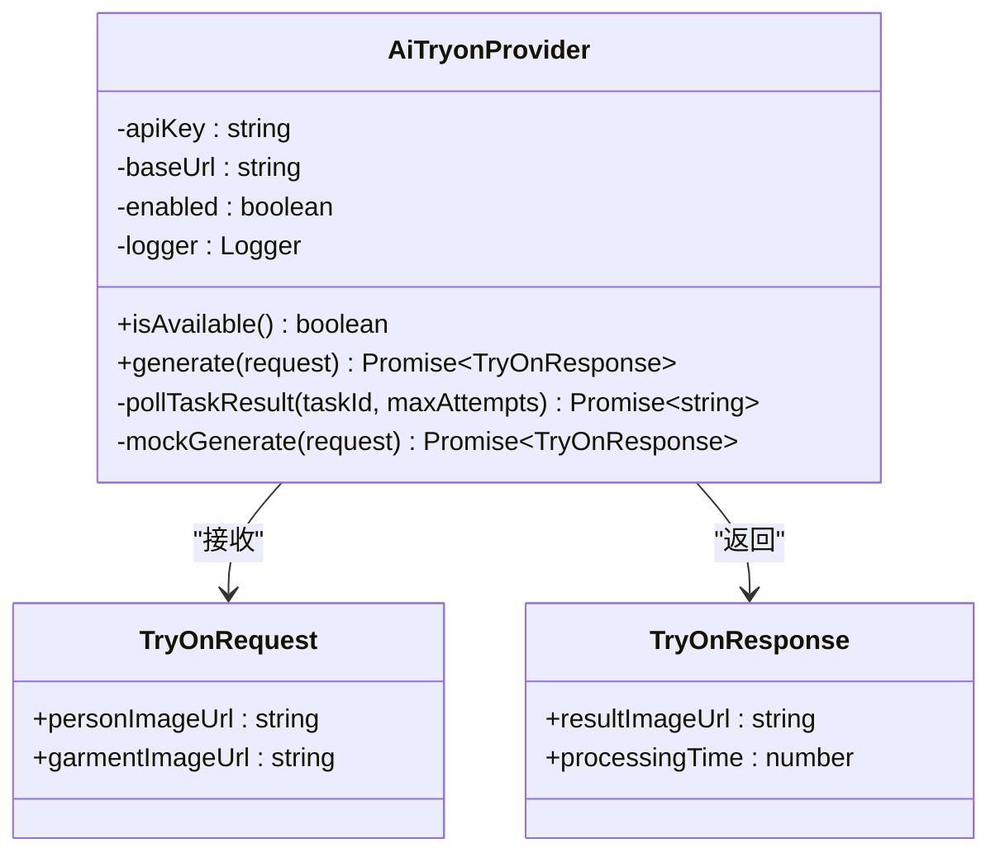
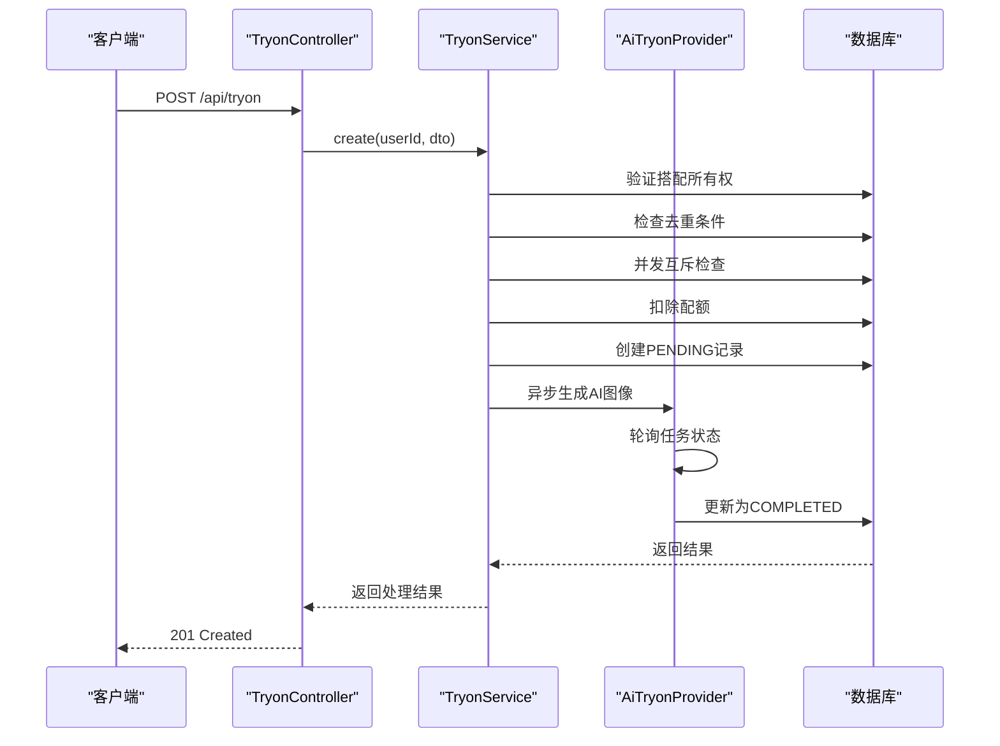
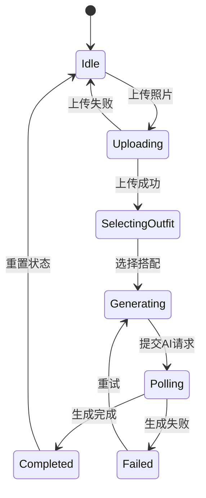
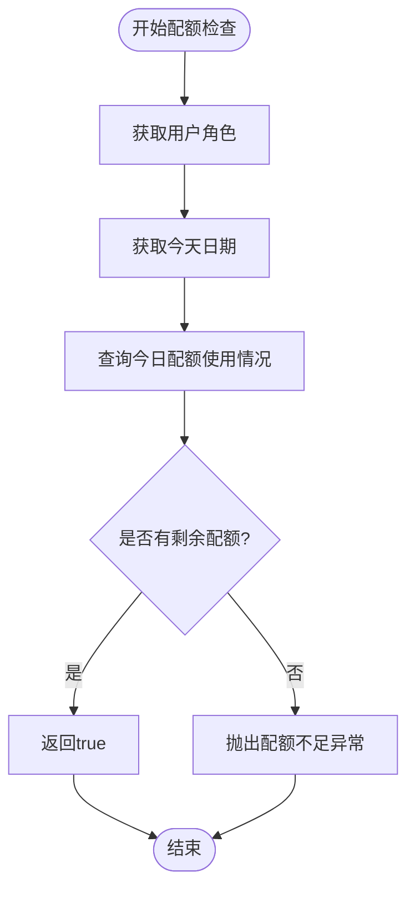
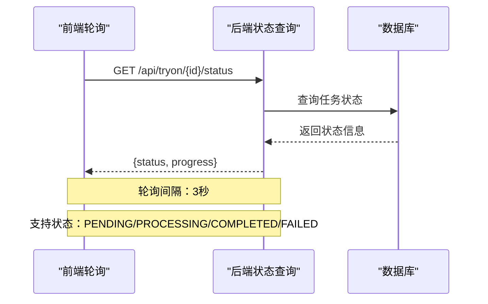
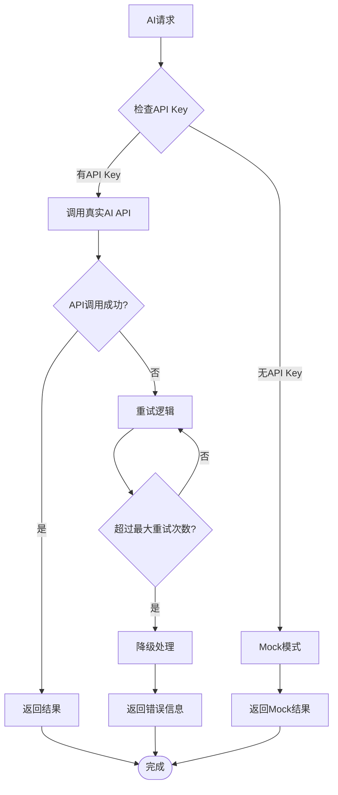
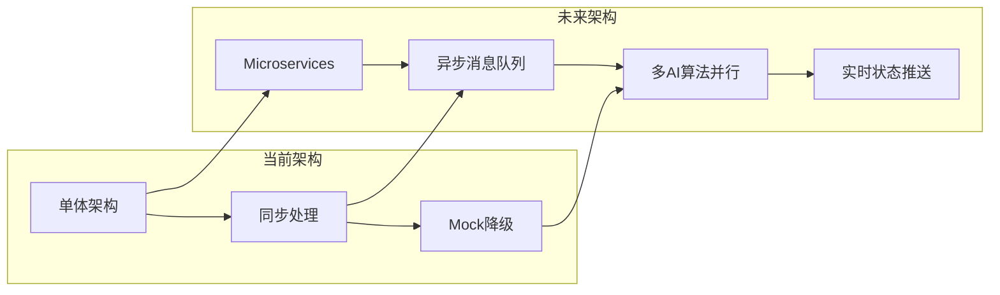

# AI试穿提供者

<cite>
**本文档引用的文件**
- [README.md](file://FreeDressApp/README.md)
- [README.md](file://backend/README.md)
- [PROJECT_STATUS.md](file://PROJECT_STATUS.md)
- [package.json](file://FreeDressApp/package.json)
- [package.json](file://backend/package.json)
- [ai-tryon.provider.ts](file://backend/src/modules/tryon/ai-tryon.provider.ts)
- [tryon.service.ts](file://backend/src/modules/tryon/tryon.service.ts)
- [tryon.controller.ts](file://backend/src/modules/tryon/tryon.controller.ts)
- [ai-quota.service.ts](file://backend/src/modules/tryon/ai-quota.service.ts)
- [create-tryon.dto.ts](file://backend/src/modules/tryon/dto/create-tryon.dto.ts)
- [tryon.module.ts](file://backend/src/modules/tryon/tryon.module.ts)
- [tryOnStore.ts](file://FreeDressApp/src/store/tryOnStore.ts)
- [TryOnScreen.tsx](file://FreeDressApp/src/screens/TryOnScreen.tsx)
- [tryon.ts](file://FreeDressApp/src/api/tryon.ts)
- [index.ts](file://FreeDressApp/src/types/index.ts)
</cite>

## 目录
1. [项目概述](#项目概述)
2. [AI试穿架构设计](#ai试穿架构设计)
3. [后端AI试穿服务](#后端ai试穿服务)
4. [前端试穿功能实现](#前端试穿功能实现)
5. [配额管理系统](#配额管理系统)
6. [异步任务处理流程](#异步任务处理流程)
7. [错误处理与降级机制](#错误处理与降级机制)
8. [性能优化策略](#性能优化策略)
9. [安全考虑](#安全考虑)
10. [未来扩展计划](#未来扩展计划)

## 项目概述

AI试穿提供者是畅搭（FreeDress）智能衣物搭配平台的核心功能模块，基于阿里云DashScope OutfitAnyone AI试衣API实现。该系统允许用户上传全身照并选择搭配，通过AI算法生成试穿效果图像。

### 技术栈概览

**前端技术栈：**
- React Native 0.85.3 + TypeScript 5.8.3
- Zustand 状态管理（版本 5.0.13）
- Axios HTTP客户端（版本 1.16.0）
- React Native Image Picker（版本 8.2.1）

**后端技术栈：**
- NestJS 10.3.0 + TypeScript 5.3.3
- Prisma 5.7.0 + PostgreSQL 16+
- JWT认证 + 限流保护
- Swagger API文档

## AI试穿架构设计

AI试穿系统采用分层架构设计，确保高可用性和可扩展性：

**图表来源**
- [ai-tryon.provider.ts:18-39](file://backend/src/modules/tryon/ai-tryon.provider.ts#L18-L39)
- [tryon.service.ts:8-15](file://backend/src/modules/tryon/tryon.service.ts#L8-L15)
- [tryon.controller.ts:16-20](file://backend/src/modules/tryon/tryon.controller.ts#L16-L20)

## 后端AI试穿服务

### AI试衣提供者实现

AI试衣提供者是系统的核心组件，负责与阿里云DashScope API进行交互：

**图表来源**
- [ai-tryon.provider.ts:4-12](file://backend/src/modules/tryon/ai-tryon.provider.ts#L4-L12)
- [ai-tryon.provider.ts:18-39](file://backend/src/modules/tryon/ai-tryon.provider.ts#L18-L39)

### 服务层架构

TryonService负责协调整个试穿流程，包括权限验证、配额检查和异步任务处理：

**图表来源**
- [tryon.controller.ts:22-30](file://backend/src/modules/tryon/tryon.controller.ts#L22-L30)
- [tryon.service.ts:24-93](file://backend/src/modules/tryon/tryon.service.ts#L24-L93)

**章节来源**
- [ai-tryon.provider.ts:1-166](file://backend/src/modules/tryon/ai-tryon.provider.ts#L1-L166)
- [tryon.service.ts:1-212](file://backend/src/modules/tryon/tryon.service.ts#L1-L212)
- [tryon.controller.ts:1-62](file://backend/src/modules/tryon/tryon.controller.ts#L1-L62)

## 前端试穿功能实现

### 状态管理架构

前端使用Zustand实现状态管理，提供完整的试穿流程状态跟踪：

**图表来源**
- [tryOnStore.ts:34-139](file://FreeDressApp/src/store/tryOnStore.ts#L34-L139)

### 用户界面设计

TryOnScreen提供了直观的三步式试穿流程：

1. **上传照片阶段**：支持相机拍摄和相册选择
2. **选择搭配阶段**：展示用户现有的搭配方案
3. **生成效果阶段**：显示AI生成的试穿结果

**章节来源**
- [TryOnScreen.tsx:1-621](file://FreeDressApp/src/screens/TryOnScreen.tsx#L1-L621)
- [tryOnStore.ts:1-139](file://FreeDressApp/src/store/tryOnStore.ts#L1-L139)

## 配额管理系统

### 配额策略设计

系统实现了基于用户角色的配额管理机制：

| 用户角色 | AI试穿配额 | AI推荐配额 |
|----------|------------|------------|
| USER（普通用户） | 3次/天 | 10次/天 |
| VIP（会员用户） | 15次/天 | 100次/天 |

### 配额检查流程

**图表来源**
- [ai-quota.service.ts:24-39](file://backend/src/modules/tryon/ai-quota.service.ts#L24-L39)

**章节来源**
- [ai-quota.service.ts:1-124](file://backend/src/modules/tryon/ai-quota.service.ts#L1-L124)

## 异步任务处理流程

### 任务生命周期管理

AI试穿采用异步处理模式，确保用户体验的流畅性：

**图表来源**
- [tryOnStore.ts:79-127](file://FreeDressApp/src/store/tryOnStore.ts#L79-L127)
- [tryon.service.ts:151-168](file://backend/src/modules/tryon/tryon.service.ts#L151-L168)

### 错误恢复机制

系统实现了完善的错误恢复策略：

1. **网络异常处理**：轮询过程中忽略临时网络错误
2. **AI服务降级**：当API不可用时使用Mock模式
3. **任务重试机制**：失败的任务可以重新发起
4. **状态同步**：定期刷新完整数据列表

**章节来源**
- [tryOnStore.ts:123-125](file://FreeDressApp/src/store/tryOnStore.ts#L123-L125)
- [ai-tryon.provider.ts:105-152](file://backend/src/modules/tryon/ai-tryon.provider.ts#L105-L152)

## 错误处理与降级机制

### 多层错误处理策略

系统采用多层错误处理机制确保稳定性：

1. **前端错误处理**：用户友好的错误提示和重试选项
2. **后端异常捕获**：统一的异常处理和日志记录
3. **AI服务降级**：Mock模式保证基本功能可用
4. **配额保护**：防止API费用超支

### 降级策略实现

**图表来源**
- [ai-tryon.provider.ts:25-32](file://backend/src/modules/tryon/ai-tryon.provider.ts#L25-L32)
- [ai-tryon.provider.ts:157-164](file://backend/src/modules/tryon/ai-tryon.provider.ts#L157-L164)

## 性能优化策略

### 前端性能优化

1. **状态管理优化**：使用Zustand减少不必要的重渲染
2. **图片处理**：支持图片压缩和懒加载
3. **列表性能**：使用Flash List优化长列表渲染
4. **动画优化**：Reanimated提供流畅的动画效果

### 后端性能优化

1. **异步处理**：AI生成任务异步执行，不阻塞API响应
2. **数据库优化**：合理的索引设计和查询优化
3. **缓存策略**：Redis缓存常用数据
4. **限流保护**：防止API滥用和费用超支

## 安全考虑

### 认证与授权

系统采用JWT令牌机制确保API安全：

- **访问令牌**：1小时有效期，用于API访问
- **刷新令牌**：7天有效期，用于刷新访问令牌
- **权限验证**：每个试穿请求都验证用户对搭配的所有权

### 数据保护

1. **API密钥管理**：敏感信息存储在环境变量中
2. **输入验证**：严格的DTO验证和过滤
3. **CORS配置**：生产环境需要收紧跨域策略
4. **文件上传安全**：MIME类型检查和文件大小限制

**章节来源**
- [README.md:229-234](file://backend/README.md#L229-L234)
- [PROJECT_STATUS.md:354-380](file://PROJECT_STATUS.md#L354-L380)

## 未来扩展计划

### 技术升级方向

1. **AI算法优化**：接入更先进的试衣算法（Kolors、IDM-VTON等）
2. **实时通信**：WebSocket替代轮询，提供更好的用户体验
3. **边缘计算**：CDN加速和就近计算
4. **多模态AI**：支持更多样式的AI生成

### 功能扩展计划

1. **批量试穿**：支持同时试穿多个搭配
2. **3D试穿**：提供更真实的试穿体验
3. **社交分享**：支持试穿结果分享到社交媒体
4. **个性化推荐**：基于试穿历史的智能推荐

### 架构演进

**章节来源**
- [PROJECT_STATUS.md:428-555](file://PROJECT_STATUS.md#L428-L555)

## 总结

AI试穿提供者作为畅搭平台的核心功能，展现了现代移动应用的完整技术栈实现。系统通过合理的架构设计、完善的错误处理机制和优秀的用户体验，在保证功能完整性的同时，为未来的扩展奠定了坚实基础。

主要优势包括：
- **技术架构先进**：前后端分离，模块化设计
- **用户体验优秀**：流畅的异步处理和状态反馈
- **安全性考虑周全**：多层次的安全保护机制
- **可扩展性强**：为未来功能扩展预留空间