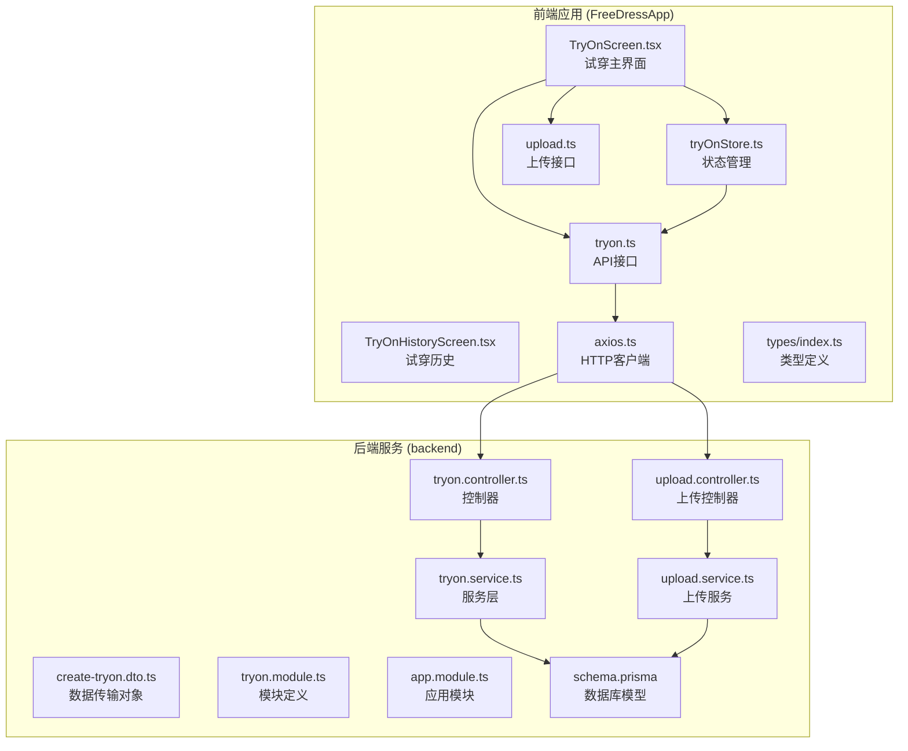
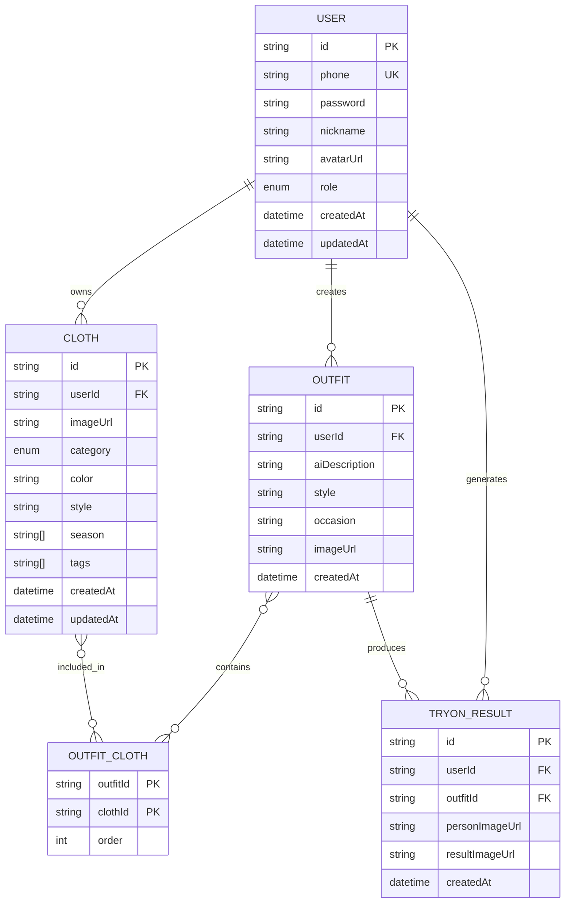
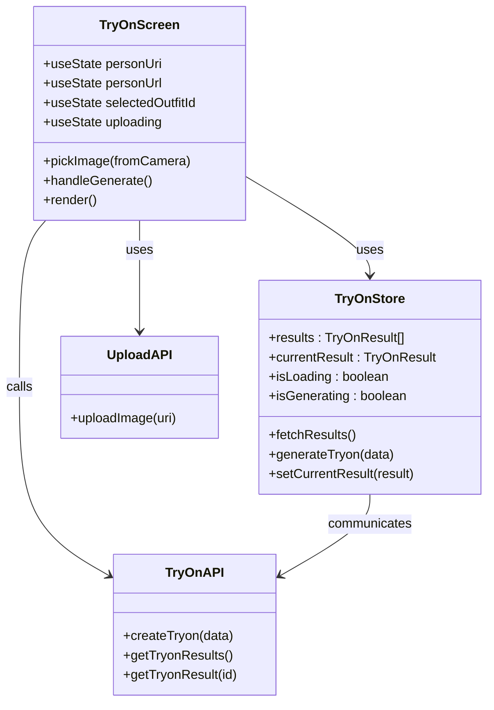
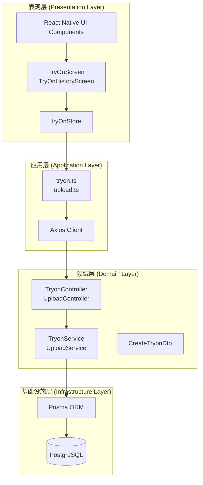
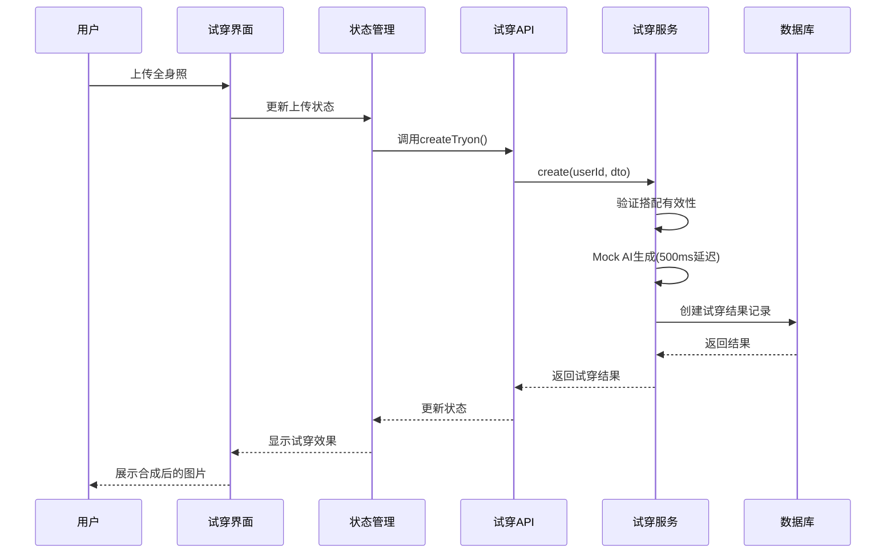
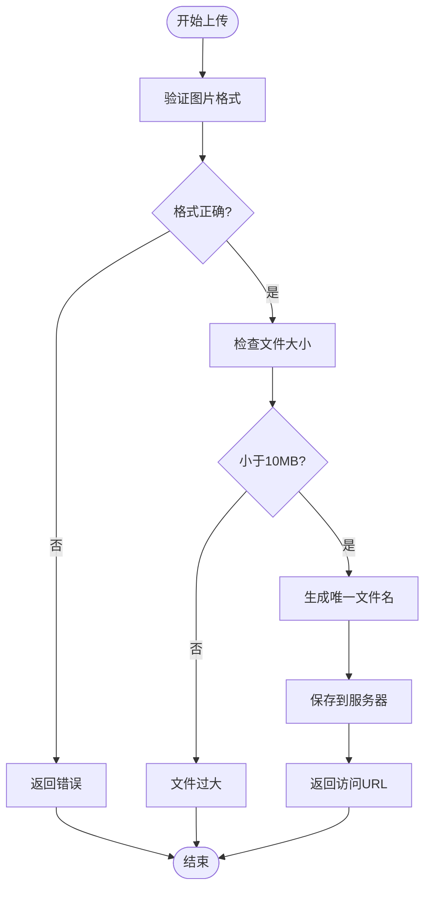
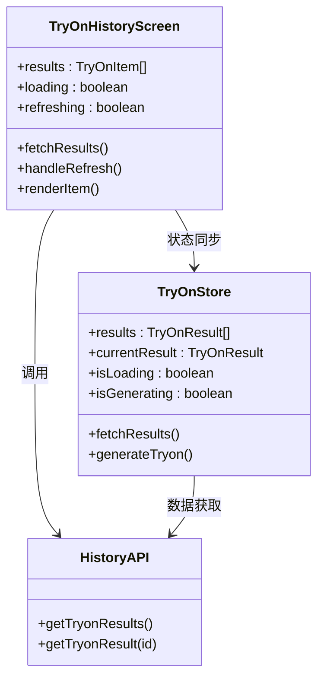
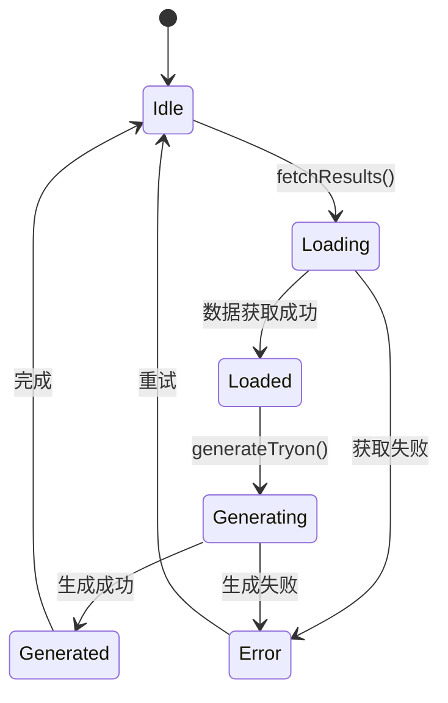
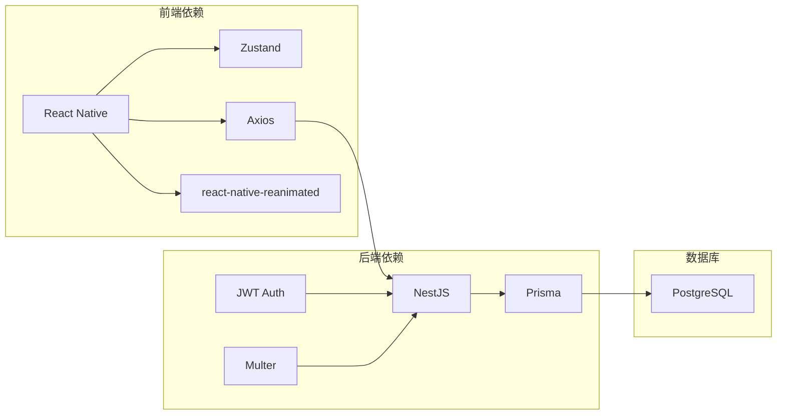

# AI试穿模块

<cite>
**本文档引用的文件**
- [TryOnScreen.tsx](file://FreeDressApp/src/screens/TryOnScreen.tsx)
- [TryOnHistoryScreen.tsx](file://FreeDressApp/src/screens/TryOnHistoryScreen.tsx)
- [tryOnStore.ts](file://FreeDressApp/src/store/tryOnStore.ts)
- [tryon.ts](file://FreeDressApp/src/api/tryon.ts)
- [upload.ts](file://FreeDressApp/src/api/upload.ts)
- [axios.ts](file://FreeDressApp/src/api/axios.ts)
- [types/index.ts](file://FreeDressApp/src/types/index.ts)
- [tryon.controller.ts](file://backend/src/modules/tryon/tryon.controller.ts)
- [tryon.service.ts](file://backend/src/modules/tryon/tryon.service.ts)
- [create-tryon.dto.ts](file://backend/src/modules/tryon/dto/create-tryon.dto.ts)
- [tryon.module.ts](file://backend/src/modules/tryon/tryon.module.ts)
- [upload.controller.ts](file://backend/src/modules/upload/upload.controller.ts)
- [upload.service.ts](file://backend/src/modules/upload/upload.service.ts)
- [app.module.ts](file://backend/src/app.module.ts)
- [schema.prisma](file://backend/prisma/schema.prisma)
</cite>

## 目录
1. [简介](#简介)
2. [项目结构](#项目结构)
3. [核心组件](#核心组件)
4. [架构概览](#架构概览)
5. [详细组件分析](#详细组件分析)
6. [依赖分析](#依赖分析)
7. [性能考虑](#性能考虑)
8. [故障排除指南](#故障排除指南)
9. [结论](#结论)
10. [附录](#附录)

## 简介

AI试穿模块是FreeDress应用的核心功能之一，允许用户通过上传全身照和选择搭配来生成虚拟试穿效果。该模块采用前后端分离架构，前端使用React Native开发，后端基于NestJS构建，实现了完整的试穿数据流处理。

本模块的主要功能包括：
- 全身照上传与处理
- 搭配选择与关联
- Mock AI算法生成试穿效果
- 试穿历史管理
- 结果展示与分享
- 质量评估与存储策略

## 项目结构

AI试穿模块在项目中的组织结构如下：

**图表来源**
- [TryOnScreen.tsx:1-522](file://FreeDressApp/src/screens/TryOnScreen.tsx#L1-L522)
- [tryOnStore.ts:1-59](file://FreeDressApp/src/store/tryOnStore.ts#L1-L59)
- [tryon.controller.ts:1-41](file://backend/src/modules/tryon/tryon.controller.ts#L1-L41)
- [upload.controller.ts:1-51](file://backend/src/modules/upload/upload.controller.ts#L1-L51)

**章节来源**
- [TryOnScreen.tsx:1-522](file://FreeDressApp/src/screens/TryOnScreen.tsx#L1-L522)
- [tryOnStore.ts:1-59](file://FreeDressApp/src/store/tryOnStore.ts#L1-L59)
- [tryon.controller.ts:1-41](file://backend/src/modules/tryon/tryon.controller.ts#L1-L41)
- [upload.controller.ts:1-51](file://backend/src/modules/upload/upload.controller.ts#L1-L51)

## 核心组件

### 数据模型设计

AI试穿模块的数据模型基于Prisma ORM设计，主要包含以下核心实体：

**图表来源**
- [schema.prisma:14-131](file://backend/prisma/schema.prisma#L14-L131)

### 前端组件架构

前端采用React Native + Zustand状态管理的架构模式：

**图表来源**
- [TryOnScreen.tsx:43-323](file://FreeDressApp/src/screens/TryOnScreen.tsx#L43-L323)
- [tryOnStore.ts:24-58](file://FreeDressApp/src/store/tryOnStore.ts#L24-L58)
- [tryon.ts:17-27](file://FreeDressApp/src/api/tryon.ts#L17-L27)

**章节来源**
- [schema.prisma:116-131](file://backend/prisma/schema.prisma#L116-L131)
- [TryOnScreen.tsx:43-323](file://FreeDressApp/src/screens/TryOnScreen.tsx#L43-L323)
- [tryOnStore.ts:24-58](file://FreeDressApp/src/store/tryOnStore.ts#L24-L58)

## 架构概览

AI试穿模块采用分层架构设计，实现了清晰的关注点分离：

**图表来源**
- [app.module.ts:13-32](file://backend/src/app.module.ts#L13-L32)
- [tryon.module.ts:5-10](file://backend/src/modules/tryon/tryon.module.ts#L5-L10)
- [axios.ts:12-18](file://FreeDressApp/src/api/axios.ts#L12-L18)

## 详细组件分析

### Mock试穿算法实现

当前版本采用Mock算法实现，模拟AI试穿效果生成过程：

**图表来源**
- [TryOnScreen.tsx:85-97](file://FreeDressApp/src/screens/TryOnScreen.tsx#L85-L97)
- [tryOnStore.ts:42-55](file://FreeDressApp/src/store/tryOnStore.ts#L42-L55)
- [tryon.service.ts:9-33](file://backend/src/modules/tryon/tryon.service.ts#L9-L33)

Mock算法的关键特性：
- **延迟模拟**：使用500ms延迟模拟AI处理时间
- **占位返回**：返回原始人物照片作为占位符
- **可扩展性**：预留接口便于替换为真实AI服务

**章节来源**
- [tryon.service.ts:77-86](file://backend/src/modules/tryon/tryon.service.ts#L77-L86)
- [TryOnScreen.tsx:85-97](file://FreeDressApp/src/screens/TryOnScreen.tsx#L85-L97)

### 图像处理流程

图像处理采用分阶段处理模式：

**图表来源**
- [upload.service.ts:25-47](file://backend/src/modules/upload/upload.service.ts#L25-L47)
- [upload.ts:4-20](file://FreeDressApp/src/api/upload.ts#L4-L20)

**章节来源**
- [upload.service.ts:25-47](file://backend/src/modules/upload/upload.service.ts#L25-L47)
- [upload.ts:4-20](file://FreeDressApp/src/api/upload.ts#L4-L20)

### 试穿历史管理

试穿历史采用增量加载和缓存策略：

**图表来源**
- [TryOnHistoryScreen.tsx:35-123](file://FreeDressApp/src/screens/TryOnHistoryScreen.tsx#L35-L123)
- [tryOnStore.ts:30-40](file://FreeDressApp/src/store/tryOnStore.ts#L30-L40)

**章节来源**
- [TryOnHistoryScreen.tsx:35-123](file://FreeDressApp/src/screens/TryOnHistoryScreen.tsx#L35-L123)
- [tryOnStore.ts:30-40](file://FreeDressApp/src/store/tryOnStore.ts#L30-L40)

### 并发控制与状态管理

系统采用Zustand实现轻量级状态管理：

**图表来源**
- [tryOnStore.ts:24-58](file://FreeDressApp/src/store/tryOnStore.ts#L24-L58)

**章节来源**
- [tryOnStore.ts:24-58](file://FreeDressApp/src/store/tryOnStore.ts#L24-L58)

## 依赖分析

### 技术栈依赖关系

**图表来源**
- [package.json](file://FreeDressApp/package.json)
- [package.json](file://backend/package.json)

### 组件间耦合度分析

系统采用低耦合设计原则：
- **前端与后端**：通过REST API通信，无直接代码依赖
- **控制器与服务**：遵循单一职责原则，职责分离清晰
- **模块化设计**：各功能模块独立，可单独测试和部署

**章节来源**
- [app.module.ts:13-32](file://backend/src/app.module.ts#L13-L32)
- [tryon.module.ts:5-10](file://backend/src/modules/tryon/tryon.module.ts#L5-L10)

## 性能考虑

### 图像处理优化

1. **文件大小限制**：设置10MB上限，平衡质量与性能
2. **格式支持**：支持JPG/PNG/WebP/GIF四种主流格式
3. **异步处理**：上传和生成过程采用异步非阻塞模式

### 存储策略

1. **文件命名**：使用UUID确保文件唯一性
2. **目录结构**：统一的uploads目录管理
3. **URL映射**：通过ServeStaticModule提供静态文件服务

### 并发处理

1. **状态锁**：使用isGenerating防止重复提交
2. **请求去重**：避免相同请求的重复执行
3. **错误恢复**：自动重试机制和错误状态管理

## 故障排除指南

### 常见问题及解决方案

| 问题类型 | 症状 | 可能原因 | 解决方案 |
|---------|------|----------|----------|
| 上传失败 | 文件过大或格式不支持 | 超过10MB或非图片格式 | 检查文件大小和格式 |
| 生成失败 | 试穿结果为空 | 网络异常或服务端错误 | 检查网络连接和服务状态 |
| 权限错误 | 401未授权 | Token失效或权限不足 | 重新登录并刷新Token |
| 数据不一致 | 历史记录缺失 | 数据库连接问题 | 检查数据库连接和索引 |

### 调试建议

1. **前端调试**：使用React DevTools检查组件状态
2. **网络监控**：通过浏览器开发者工具查看API请求
3. **日志分析**：检查后端服务日志输出
4. **数据库查询**：验证Prisma查询结果

**章节来源**
- [axios.ts:44-105](file://FreeDressApp/src/api/axios.ts#L44-L105)
- [upload.service.ts:25-47](file://backend/src/modules/upload/upload.service.ts#L25-L47)

## 结论

AI试穿模块展现了良好的架构设计和实现质量。通过Mock算法实现，系统具备了完整的试穿工作流程，为后续集成真实AI服务奠定了基础。

主要优势：
- **模块化设计**：清晰的分层架构便于维护和扩展
- **状态管理**：轻量级Zustand提供高效的状态管理
- **错误处理**：完善的错误处理和用户体验设计
- **可扩展性**：预留接口便于集成第三方AI服务

未来改进方向：
- 集成真实的AI试穿算法
- 添加结果质量评估机制
- 实现结果分享功能
- 优化图像处理性能

## 附录

### API接口规范

| 接口 | 方法 | 路径 | 功能描述 |
|------|------|------|----------|
| 提交试穿请求 | POST | /tryon | 创建新的试穿任务 |
| 获取试穿记录 | GET | /tryon | 获取用户所有试穿记录 |
| 获取单条记录 | GET | /tryon/:id | 获取指定试穿记录详情 |
| 上传图片 | POST | /upload/image | 上传用户图片文件 |

### 数据模型字段说明

| 字段名 | 类型 | 描述 | 必填 |
|--------|------|------|------|
| personImageUrl | string | 人物照片URL | 是 |
| resultImageUrl | string | 试穿结果URL | 是 |
| outfitId | string | 搭配ID | 是 |
| userId | string | 用户ID | 是 |