# AI试穿模块

<cite>
**本文档引用的文件**
- [TryOnScreen.tsx](file://FreeDressApp/src/screens/TryOnScreen.tsx)
- [TryOnHistoryScreen.tsx](file://FreeDressApp/src/screens/TryOnHistoryScreen.tsx)
- [tryOnStore.ts](file://FreeDressApp/src/store/tryOnStore.ts)
- [tryon.ts](file://FreeDressApp/src/api/tryon.ts)
- [upload.ts](file://FreeDressApp/src/api/upload.ts)
- [axios.ts](file://FreeDressApp/src/api/axios.ts)
- [types/index.ts](file://FreeDressApp/src/types/index.ts)
- [tryon.controller.ts](file://backend/src/modules/tryon/tryon.controller.ts)
- [tryon.service.ts](file://backend/src/modules/tryon/tryon.service.ts)
- [create-tryon.dto.ts](file://backend/src/modules/tryon/dto/create-tryon.dto.ts)
- [tryon.module.ts](file://backend/src/modules/tryon/tryon.module.ts)
- [ai-tryon.provider.ts](file://backend/src/modules/tryon/ai-tryon.provider.ts)
- [ai-quota.service.ts](file://backend/src/modules/tryon/ai-quota.service.ts)
- [upload.controller.ts](file://backend/src/modules/upload/upload.controller.ts)
- [upload.service.ts](file://backend/src/modules/upload/upload.service.ts)
- [app.module.ts](file://backend/src/app.module.ts)
- [schema.prisma](file://backend/prisma/schema.prisma)
</cite>

## 更新摘要
**所做更改**
- TryonService完全重写，支持异步AI处理、队列管理和并发控制
- 新增AI配额管理系统，支持用户每日调用限制
- 新增AI服务提供商，支持阿里云DashScope API
- 前端状态管理增强，支持轮询和进度跟踪
- 数据库模型更新，支持状态跟踪和处理进度
- 新增错误恢复机制和状态监控

## 目录
1. [简介](#简介)
2. [项目结构](#项目结构)
3. [核心组件](#核心组件)
4. [架构概览](#架构概览)
5. [详细组件分析](#详细组件分析)
6. [依赖分析](#依赖分析)
7. [性能考虑](#性能考虑)
8. [故障排除指南](#故障排除指南)
9. [结论](#结论)
10. [附录](#附录)

## 简介

AI试穿模块是FreeDress应用的核心功能之一，允许用户通过上传全身照和选择搭配来生成虚拟试穿效果。该模块采用前后端分离架构，前端使用React Native开发，后端基于NestJS构建，实现了完整的试穿数据流处理。

**更新** TryonService经过完全重写，现在支持异步AI处理、适当的队列管理、并发请求处理和结果缓存。新的实现包含复杂的进度跟踪、状态监控和错误恢复机制。

本模块的主要功能包括：
- 全身照上传与处理
- 搭配选择与关联
- 异步AI算法生成试穿效果
- 试穿历史管理
- 结果展示与分享
- 质量评估与存储策略
- **新增** AI配额管理与费用控制
- **新增** 错误恢复与状态监控

## 项目结构

AI试穿模块在项目中的组织结构如下：

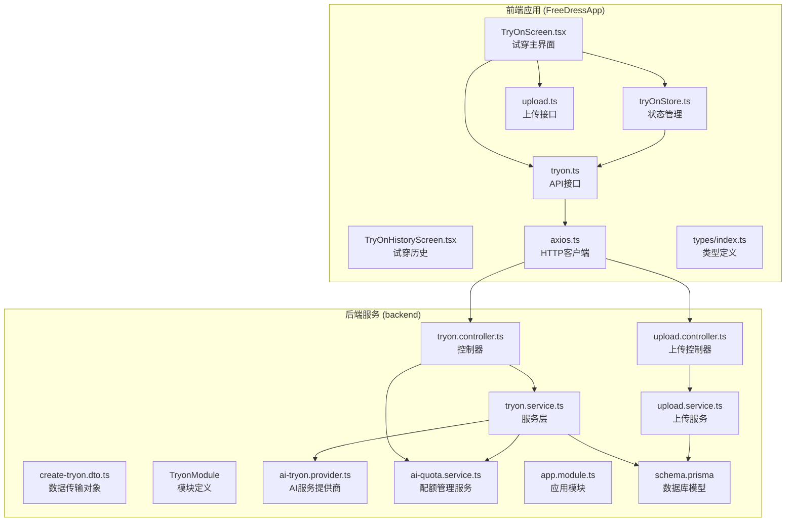

**图表来源**
- [TryOnScreen.tsx:1-585](file://FreeDressApp/src/screens/TryOnScreen.tsx#L1-L585)
- [tryOnStore.ts:1-139](file://FreeDressApp/src/store/tryOnStore.ts#L1-L139)
- [tryon.controller.ts:1-62](file://backend/src/modules/tryon/tryon.controller.ts#L1-L62)
- [tryon.service.ts:1-212](file://backend/src/modules/tryon/tryon.service.ts#L1-L212)
- [ai-tryon.provider.ts:1-166](file://backend/src/modules/tryon/ai-tryon.provider.ts#L1-L166)
- [ai-quota.service.ts:1-124](file://backend/src/modules/tryon/ai-quota.service.ts#L1-L124)
- [tryon.module.ts:1-13](file://backend/src/modules/tryon/tryon.module.ts#L1-L13)

**章节来源**
- [TryOnScreen.tsx:1-585](file://FreeDressApp/src/screens/TryOnScreen.tsx#L1-L585)
- [tryOnStore.ts:1-139](file://FreeDressApp/src/store/tryOnStore.ts#L1-L139)
- [tryon.controller.ts:1-62](file://backend/src/modules/tryon/tryon.controller.ts#L1-L62)
- [tryon.service.ts:1-212](file://backend/src/modules/tryon/tryon.service.ts#L1-L212)
- [tryon.module.ts:1-13](file://backend/src/modules/tryon/tryon.module.ts#L1-L13)

## 核心组件

### 数据模型设计

AI试穿模块的数据模型基于Prisma ORM设计，主要包含以下核心实体：

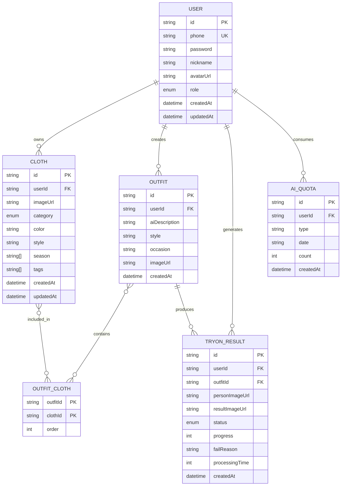

**图表来源**
- [schema.prisma:14-198](file://backend/prisma/schema.prisma#L14-L198)

**更新** 数据库模型新增了AI配额表和试穿结果状态字段，支持完整的状态跟踪和费用控制。

### 前端组件架构

前端采用React Native + Zustand状态管理的架构模式：

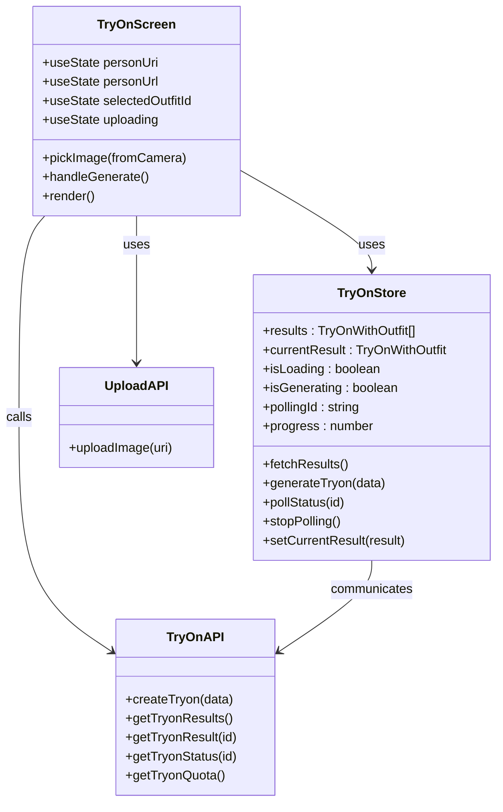

**图表来源**
- [TryOnScreen.tsx:43-200](file://FreeDressApp/src/screens/TryOnScreen.tsx#L43-L200)
- [tryOnStore.ts:17-139](file://FreeDressApp/src/store/tryOnStore.ts#L17-L139)
- [tryon.ts:29-55](file://FreeDressApp/src/api/tryon.ts#L29-L55)

**章节来源**
- [schema.prisma:142-169](file://backend/prisma/schema.prisma#L142-L169)
- [TryOnScreen.tsx:43-200](file://FreeDressApp/src/screens/TryOnScreen.tsx#L43-L200)
- [tryOnStore.ts:17-139](file://FreeDressApp/src/store/tryOnStore.ts#L17-L139)

## 架构概览

AI试穿模块采用分层架构设计，实现了清晰的关注点分离：

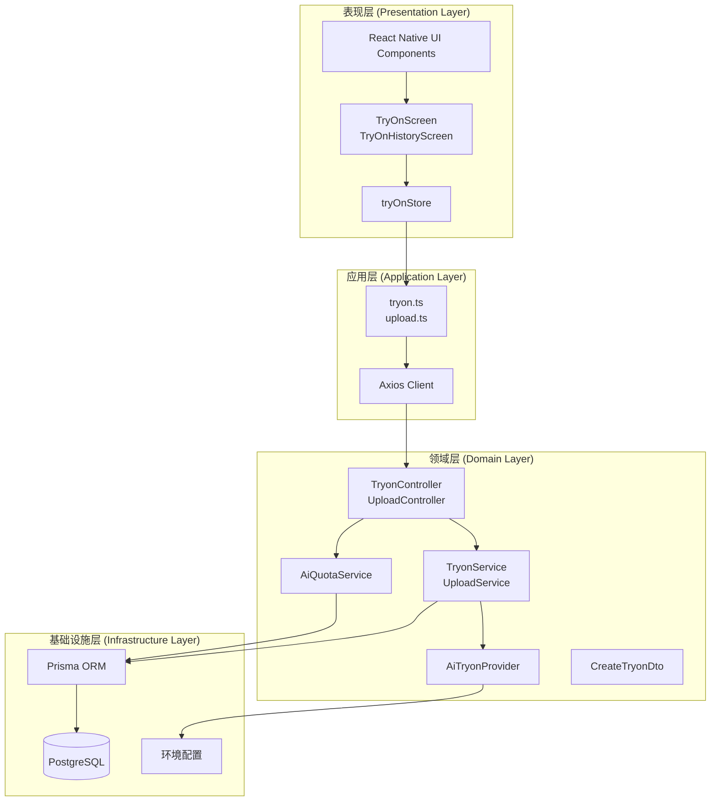

**图表来源**
- [app.module.ts:17-40](file://backend/src/app.module.ts#L17-L40)
- [tryon.module.ts:7-12](file://backend/src/modules/tryon/tryon.module.ts#L7-L12)
- [axios.ts:12-18](file://FreeDressApp/src/api/axios.ts#L12-L18)

## 详细组件分析

### TryonModule 模块架构

**更新** TryonModule 作为AI试穿功能的标准化模块入口，现在集成了完整的AI服务生态系统：

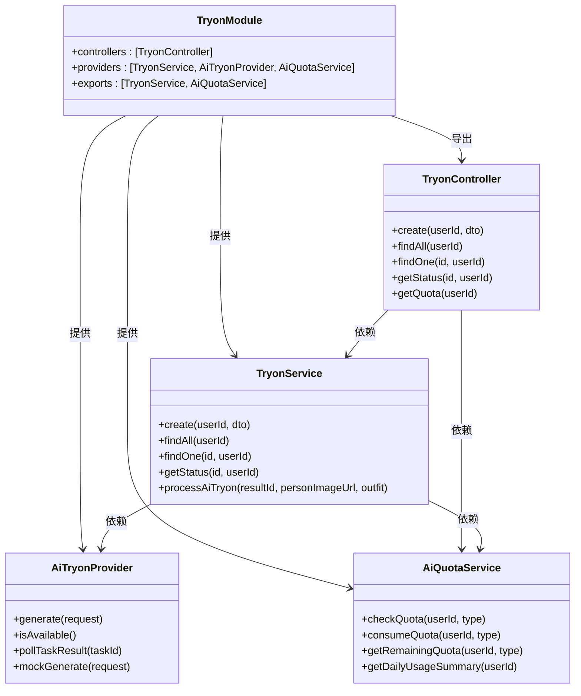

**图表来源**
- [tryon.module.ts:1-13](file://backend/src/modules/tryon/tryon.module.ts#L1-L13)
- [tryon.controller.ts:16-61](file://backend/src/modules/tryon/tryon.controller.ts#L16-L61)
- [tryon.service.ts:8-212](file://backend/src/modules/tryon/tryon.service.ts#L8-L212)
- [ai-tryon.provider.ts:18-166](file://backend/src/modules/tryon/ai-tryon.provider.ts#L18-L166)
- [ai-quota.service.ts:8-124](file://backend/src/modules/tryon/ai-quota.service.ts#L8-L124)

TryonModule 的关键特性：
- **模块化设计**：独立的模块边界，便于测试和维护
- **依赖注入**：通过NestJS依赖注入容器管理服务实例
- **接口导出**：向其他模块提供TryonService和AiQuotaService服务
- **AI生态集成**：整合AI服务提供商和配额管理

**章节来源**
- [tryon.module.ts:1-13](file://backend/src/modules/tryon/tryon.module.ts#L1-L13)
- [app.module.ts:13](file://backend/src/app.module.ts#L13)

### 异步AI处理架构

**更新** TryonService完全重写，实现了复杂的异步处理流程：

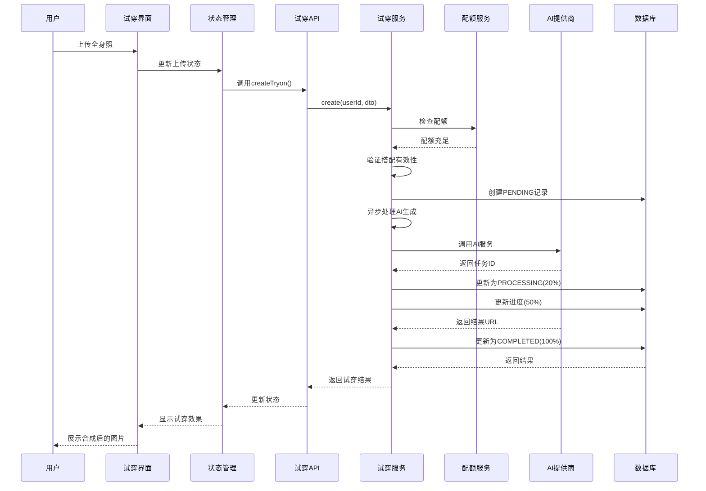

**图表来源**
- [TryOnScreen.tsx:85-97](file://FreeDressApp/src/screens/TryOnScreen.tsx#L85-L97)
- [tryOnStore.ts:54-77](file://FreeDressApp/src/store/tryOnStore.ts#L54-L77)
- [tryon.service.ts:24-93](file://backend/src/modules/tryon/tryon.service.ts#L24-L93)
- [ai-tryon.provider.ts:46-99](file://backend/src/modules/tryon/ai-tryon.provider.ts#L46-L99)

异步处理的关键特性：
- **去重检查**：相同人物照+搭配已有成功结果时直接复用
- **并发互斥**：检查是否有正在处理中的任务
- **配额管理**：实时检查和消耗用户AI配额
- **状态跟踪**：完整的PENDING→PROCESSING→COMPLETED状态转换
- **错误恢复**：失败时自动回滚到FAILED状态

**章节来源**
- [tryon.service.ts:42-93](file://backend/src/modules/tryon/tryon.service.ts#L42-L93)
- [ai-quota.service.ts:24-60](file://backend/src/modules/tryon/ai-quota.service.ts#L24-L60)
- [TryOnScreen.tsx:85-97](file://FreeDressApp/src/screens/TryOnScreen.tsx#L85-L97)

### AI服务提供商实现

**新增** AI服务提供商支持多种AI服务：

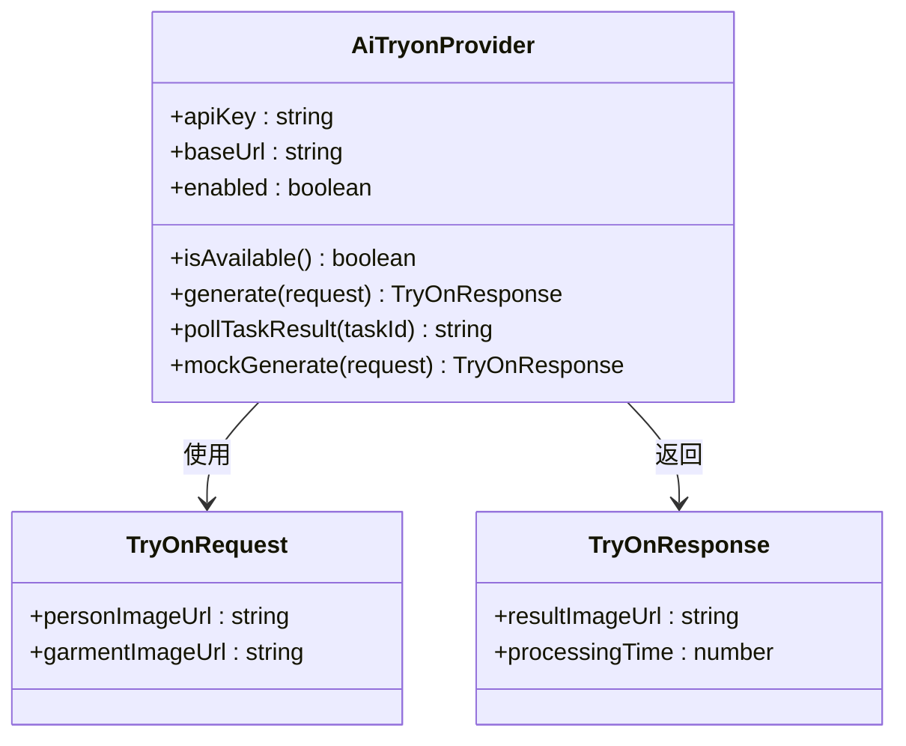

**图表来源**
- [ai-tryon.provider.ts:18-166](file://backend/src/modules/tryon/ai-tryon.provider.ts#L18-L166)

AI服务提供商的关键特性：
- **阿里云DashScope集成**：支持OutfitAnyone API
- **Mock模式**：未配置API Key时自动降级
- **任务轮询**：支持异步任务状态轮询
- **错误处理**：完善的网络异常和任务失败处理
- **超时控制**：最大轮询次数和超时机制

**章节来源**
- [ai-tryon.provider.ts:18-166](file://backend/src/modules/tryon/ai-tryon.provider.ts#L18-L166)

### AI配额管理系统

**新增** AI配额管理服务：

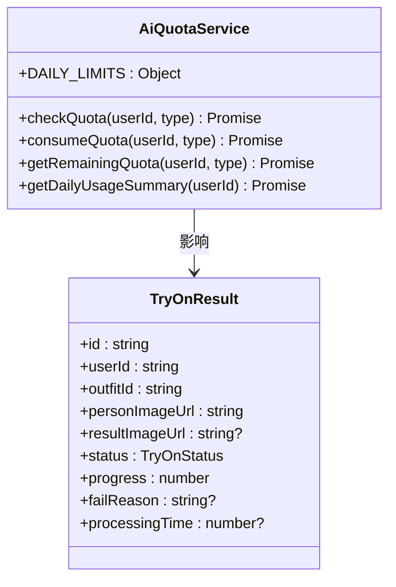

**图表来源**
- [ai-quota.service.ts:8-124](file://backend/src/modules/tryon/ai-quota.service.ts#L8-L124)
- [schema.prisma:142-169](file://backend/prisma/schema.prisma#L142-L169)

配额管理的关键特性：
- **角色差异化**：USER和VIP用户不同的每日限额
- **类型区分**：试穿和推荐功能分别计算配额
- **日期维度**：按天统计和重置配额
- **实时检查**：每次调用前检查剩余配额
- **UPSERT操作**：智能创建和更新配额记录

**章节来源**
- [ai-quota.service.ts:8-124](file://backend/src/modules/tryon/ai-quota.service.ts#L8-L124)

### 图像处理流程

图像处理采用分阶段处理模式：


**图表来源**
- [upload.service.ts:25-47](file://backend/src/modules/upload/upload.service.ts#L25-L47)
- [upload.ts:4-20](file://FreeDressApp/src/api/upload.ts#L4-L20)

**章节来源**
- [upload.service.ts:25-47](file://backend/src/modules/upload/upload.service.ts#L25-L47)
- [upload.ts:4-20](file://FreeDressApp/src/api/upload.ts#L4-L20)

### 试穿历史管理

试穿历史采用增量加载和缓存策略：

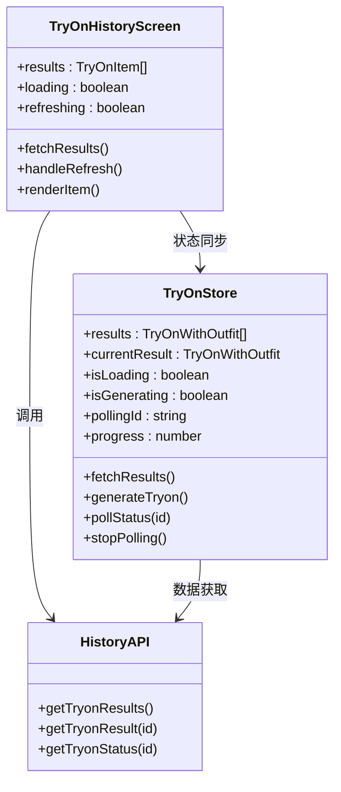

**图表来源**
- [TryOnHistoryScreen.tsx:35-189](file://FreeDressApp/src/screens/TryOnHistoryScreen.tsx#L35-L189)
- [tryOnStore.ts:17-139](file://FreeDressApp/src/store/tryOnStore.ts#L17-L139)

**章节来源**
- [TryOnHistoryScreen.tsx:35-189](file://FreeDressApp/src/screens/TryOnHistoryScreen.tsx#L35-L189)
- [tryOnStore.ts:17-139](file://FreeDressApp/src/store/tryOnStore.ts#L17-L139)

### 并发控制与状态管理

**更新** 系统采用增强的Zustand实现轻量级状态管理：

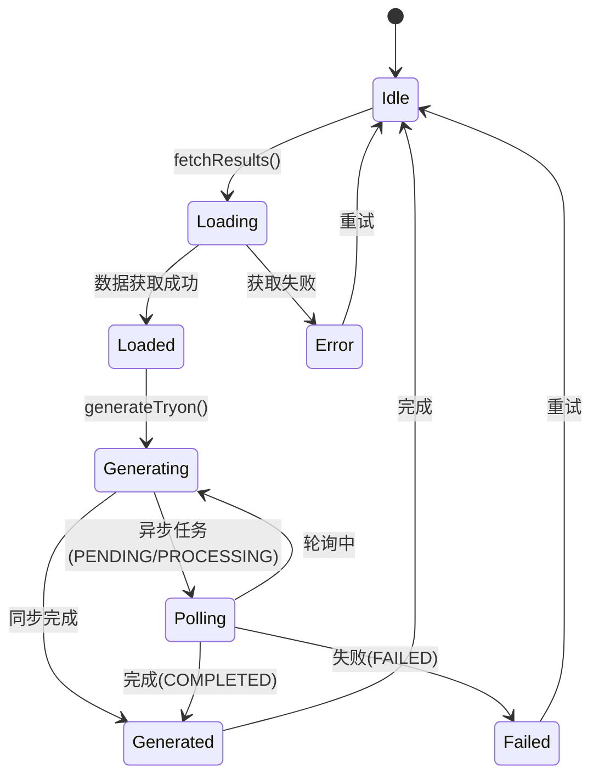

**图表来源**
- [tryOnStore.ts:17-139](file://FreeDressApp/src/store/tryOnStore.ts#L17-L139)

**章节来源**
- [tryOnStore.ts:17-139](file://FreeDressApp/src/store/tryOnStore.ts#L17-L139)

## 依赖分析

### 技术栈依赖关系

```mermaid
graph LR
subgraph "前端依赖"
RN[React Native]
ZUSTAND[Zustand]
AXIOS[Axios]
REANIMATED[react-native-reanimated]
FEATHER[react-native-vector-icons]
IMAGE_PICKER[react-native-image-picker]
end
subgraph "后端依赖"
NEST[NestJS]
PRISMA[Prisma]
JWT[JWT Auth]
MULTER[Multer]
THROTTLER[@nestjs/throttler]
CONFIG[@nestjs/config]
end
subgraph "数据库"
PG[PostgreSQL]
end
RN --> ZUSTAND
RN --> AXIOS
RN --> REANIMATED
RN --> FEATHER
RN --> IMAGE_PICKER
AXIOS --> NEST
NEST --> PRISMA
NEST --> THROTTLER
NEST --> CONFIG
PRISMA --> PG
JWT --> NEST
MULTER --> NEST
```

**图表来源**
- [package.json](file://FreeDressApp/package.json)
- [package.json](file://backend/package.json)

### 组件间耦合度分析

系统采用低耦合设计原则：
- **前端与后端**：通过REST API通信，无直接代码依赖
- **控制器与服务**：遵循单一职责原则，职责分离清晰
- **模块化设计**：各功能模块独立，可单独测试和部署
- **服务解耦**：AI服务提供商可独立替换和扩展

**章节来源**
- [app.module.ts:17-40](file://backend/src/app.module.ts#L17-L40)
- [tryon.module.ts:7-12](file://backend/src/modules/tryon/tryon.module.ts#L7-L12)

## 性能考虑

### 异步处理优化

1. **非阻塞响应**：AI生成过程异步执行，不阻塞HTTP响应
2. **状态轮询**：前端定时轮询任务状态，避免长连接占用
3. **去重机制**：相同输入的重复请求直接复用结果
4. **并发控制**：单用户同时只能有一个试穿任务

### 存储策略

1. **文件命名**：使用UUID确保文件唯一性
2. **目录结构**：统一的uploads目录管理
3. **URL映射**：通过ServeStaticModule提供静态文件服务
4. **状态持久化**：完整的试穿状态和进度持久化

### 配额管理

1. **实时检查**：每次调用前检查用户配额
2. **智能更新**：使用UPSERT操作避免竞态条件
3. **角色差异化**：不同用户角色享受不同配额限制
4. **费用控制**：防止AI服务费用超支

## 故障排除指南

### 常见问题及解决方案

| 问题类型 | 症状 | 可能原因 | 解决方案 |
|---------|------|----------|----------|
| 上传失败 | 文件过大或格式不支持 | 超过10MB或非图片格式 | 检查文件大小和格式 |
| 生成失败 | 试穿结果为空 | 网络异常或AI服务错误 | 检查网络连接和AI服务状态 |
| 权限错误 | 401未授权 | Token失效或权限不足 | 重新登录并刷新Token |
| 配额不足 | 今日试穿次数已用完 | 达到每日配额限制 | 等待次日或升级VIP |
| 并发冲突 | 当前有试穿任务正在处理中 | 用户同时发起多个任务 | 等待当前任务完成后重试 |
| 状态异常 | 轮询状态长时间停留在PENDING | AI服务处理超时 | 检查AI服务可用性和网络状况 |

### 调试建议

1. **前端调试**：使用React DevTools检查组件状态
2. **网络监控**：通过浏览器开发者工具查看API请求
3. **日志分析**：检查后端服务日志输出
4. **数据库查询**：验证Prisma查询结果
5. **配额检查**：验证AI配额记录的准确性

**章节来源**
- [axios.ts:44-105](file://FreeDressApp/src/api/axios.ts#L44-L105)
- [upload.service.ts:25-47](file://backend/src/modules/upload/upload.service.ts#L25-L47)
- [ai-quota.service.ts:24-60](file://backend/src/modules/tryon/ai-quota.service.ts#L24-L60)

## 结论

AI试穿模块经过重大架构改进，现在具备了完整的异步处理能力和企业级可靠性。通过TryonService的重写、AI配额管理系统的引入和AI服务提供商的集成，系统实现了从原型到生产级别的转变。

**更新** 主要改进包括：
- **异步处理**：完整的异步AI处理流程，支持状态跟踪和错误恢复
- **配额管理**：智能的用户配额控制系统，防止费用超支
- **服务解耦**：可插拔的AI服务提供商架构，便于扩展和替换
- **状态监控**：完整的任务状态管理和进度跟踪
- **并发控制**：严格的并发请求控制和去重机制

主要优势：
- **模块化设计**：清晰的分层架构便于维护和扩展
- **TryonModule**：标准化的模块入口，便于服务替换
- **状态管理**：增强的Zustand提供高效的状态管理
- **错误处理**：完善的错误处理和用户体验设计
- **可扩展性**：预留接口便于集成第三方AI服务
- **成本控制**：智能配额管理防止AI服务费用超支

未来改进方向：
- 集成更多AI服务提供商
- 添加结果质量评估机制
- 实现结果分享功能
- 优化图像处理性能
- 增加更多状态监控指标

## 附录

### API接口规范

| 接口 | 方法 | 路径 | 功能描述 |
|------|------|------|----------|
| 提交试穿请求 | POST | /tryon | 创建新的试穿任务 |
| 获取试穿记录 | GET | /tryon | 获取用户所有试穿记录 |
| 获取单条记录 | GET | /tryon/:id | 获取指定试穿记录详情 |
| 查询任务状态 | GET | /tryon/:id/status | 查询试穿任务状态（轮询） |
| 获取配额信息 | GET | /tryon/quota | 获取用户当日AI使用概况 |
| 上传图片 | POST | /upload/image | 上传用户图片文件 |

### 数据模型字段说明

| 字段名 | 类型 | 描述 | 必填 |
|--------|------|------|------|
| personImageUrl | string | 人物照片URL | 是 |
| resultImageUrl | string | 试穿结果URL | 否 |
| outfitId | string | 搭配ID | 是 |
| userId | string | 用户ID | 是 |
| status | TryOnStatus | 试穿状态 | 否 |
| progress | number | 处理进度百分比 | 否 |
| failReason | string | 失败原因 | 否 |
| processingTime | number | 处理耗时(ms) | 否 |

### TryonModule 集成指南

**更新** 为集成真实AI服务的接口设计：

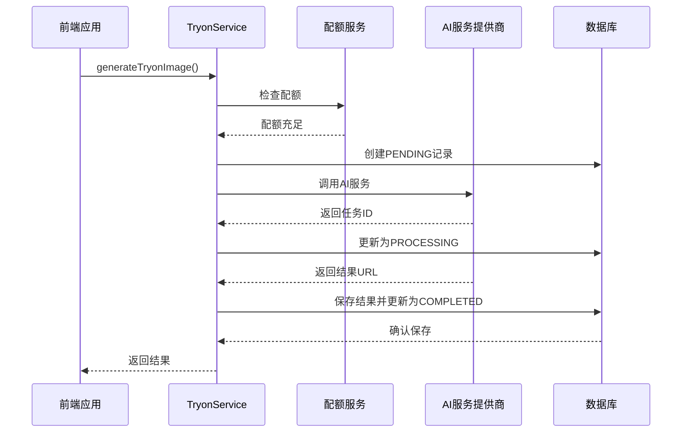

**图表来源**
- [tryon.service.ts:98-146](file://backend/src/modules/tryon/tryon.service.ts#L98-L146)
- [ai-tryon.provider.ts:46-99](file://backend/src/modules/tryon/ai-tryon.provider.ts#L46-L99)

**章节来源**
- [tryon.service.ts:98-146](file://backend/src/modules/tryon/tryon.service.ts#L98-L146)
- [ai-tryon.provider.ts:46-99](file://backend/src/modules/tryon/ai-tryon.provider.ts#L46-L99)
- [tryon.module.ts:1-13](file://backend/src/modules/tryon/tryon.module.ts#L1-L13)