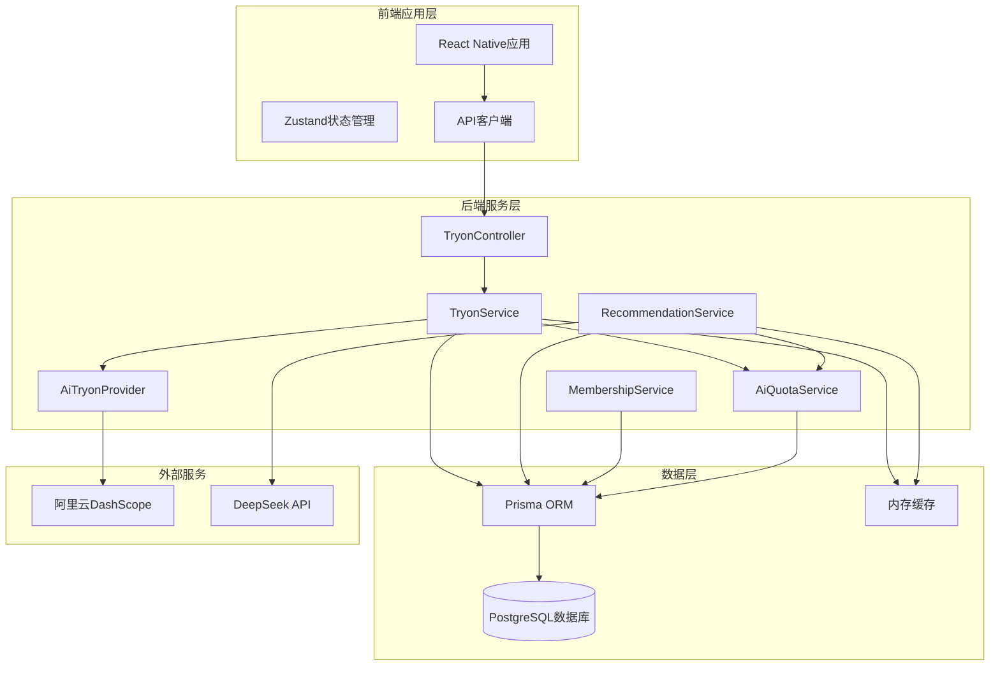
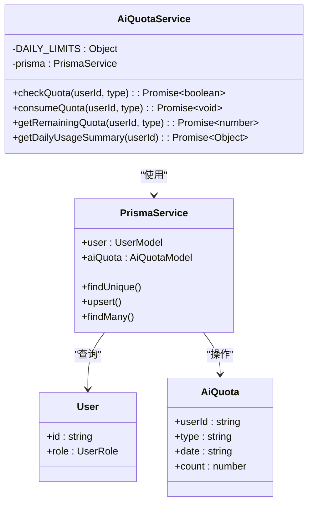
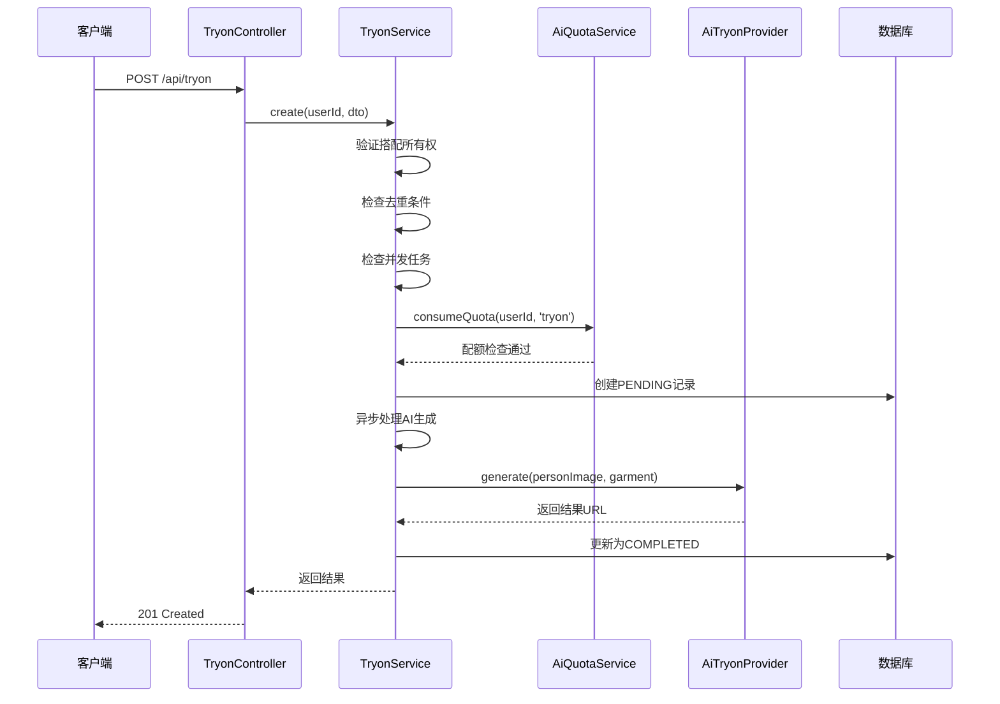
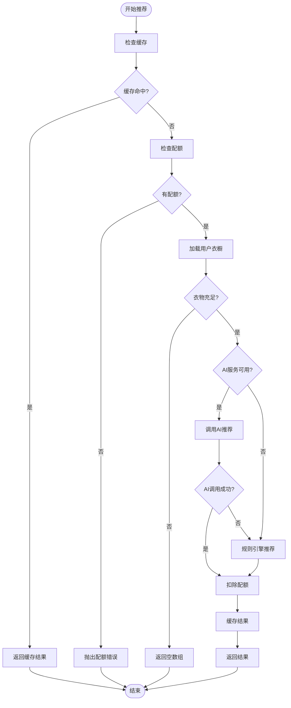
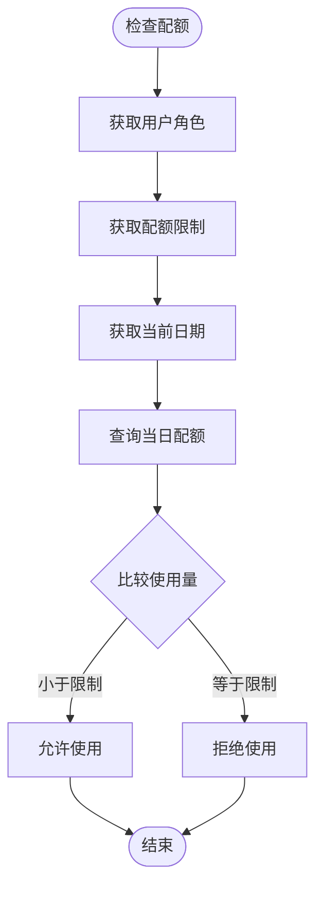
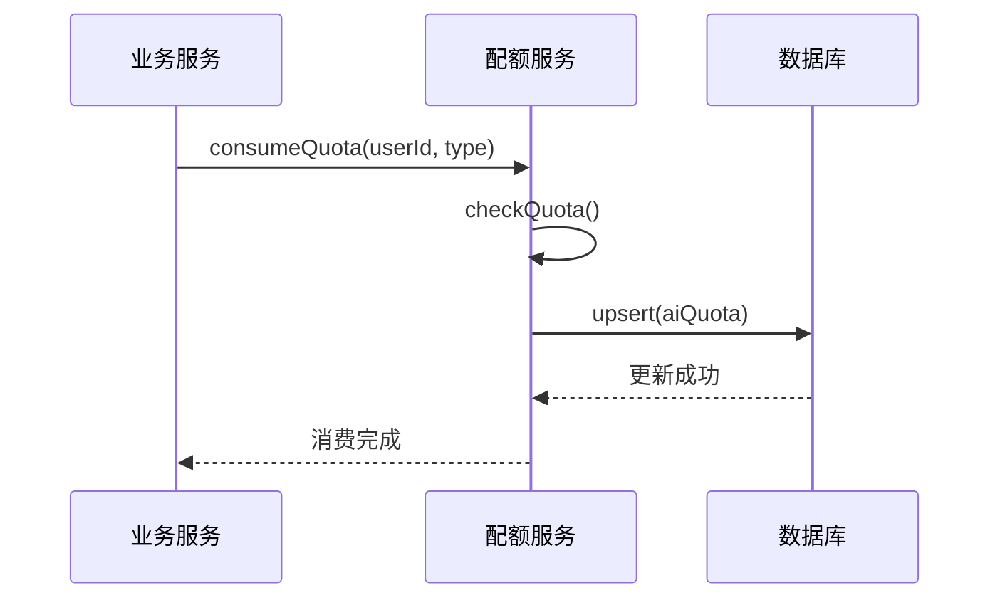
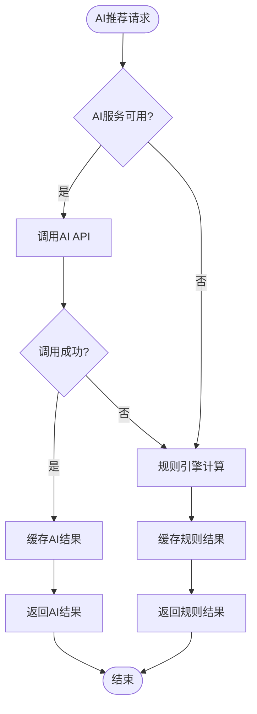
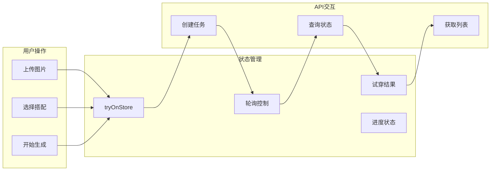

# AI配额服务

<cite>
**本文档引用的文件**
- [ai-quota.service.ts](file://backend/src/modules/tryon/ai-quota.service.ts)
- [tryon.service.ts](file://backend/src/modules/tryon/tryon.service.ts)
- [ai-tryon.provider.ts](file://backend/src/modules/tryon/ai-tryon.provider.ts)
- [tryon.controller.ts](file://backend/src/modules/tryon/tryon.controller.ts)
- [recommendation.service.ts](file://backend/src/modules/outfits/recommendation.service.ts)
- [membership.service.ts](file://backend/src/modules/membership/membership.service.ts)
- [schema.prisma](file://backend/prisma/schema.prisma)
- [tryon.module.ts](file://backend/src/modules/tryon/tryon.module.ts)
- [app.module.ts](file://backend/src/app.module.ts)
- [main.ts](file://backend/src/main.ts)
- [axios.ts](file://FreeDressApp/src/api/axios.ts)
- [tryOnStore.ts](file://FreeDressApp/src/store/tryOnStore.ts)
- [TryOnScreen.tsx](file://FreeDressApp/src/screens/TryOnScreen.tsx)
</cite>

## 目录
1. [项目概述](#项目概述)
2. [系统架构](#系统架构)
3. [核心组件](#核心组件)
4. [AI配额管理机制](#ai配额管理机制)
5. [试穿服务流程](#试穿服务流程)
6. [推荐服务实现](#推荐服务实现)
7. [会员体系集成](#会员体系集成)
8. [前端交互设计](#前端交互设计)
9. [性能优化策略](#性能优化策略)
10. [故障排除指南](#故障排除指南)
11. [总结](#总结)

## 项目概述

AI配额服务是畅搭（FreeDress）智能衣物搭配平台的核心功能模块，主要负责管理和控制AI服务的使用配额，确保系统的稳定运行和成本控制。该服务通过每日配额限制、用户等级差异化、以及智能缓存机制，为用户提供优质的AI试穿和搭配推荐体验。

### 主要功能特性

- **每日配额控制**：为不同AI功能设置每日使用限制
- **用户等级差异化**：普通用户与VIP用户的配额差异
- **实时配额监控**：提供配额使用情况的实时查询
- **智能降级机制**：在AI服务不可用时提供规则引擎替代方案
- **异步处理支持**：支持长时间运行的AI任务处理

## 系统架构



**图表来源**
- [app.module.ts:17-49](file://backend/src/app.module.ts#L17-L49)
- [tryon.module.ts:7-12](file://backend/src/modules/tryon/tryon.module.ts#L7-L12)

## 核心组件

### AI配额服务（AiQuotaService）

AI配额服务是整个系统的核心控制器，负责管理用户每日AI服务的使用配额。该服务实现了基于用户等级的差异化配额控制机制。

#### 核心数据结构



**图表来源**
- [ai-quota.service.ts:8-124](file://backend/src/modules/tryon/ai-quota.service.ts#L8-L124)
- [schema.prisma:185-197](file://backend/prisma/schema.prisma#L185-L197)

#### 配额配置策略

系统为不同用户等级设置了差异化的每日配额：

| 功能类型 | 普通用户 | VIP用户 |
|---------|---------|--------|
| AI试穿 | 3次 | 15次 |
| AI推荐 | 10次 | 100次 |

**章节来源**
- [ai-quota.service.ts:11-14](file://backend/src/modules/tryon/ai-quota.service.ts#L11-L14)

### 试穿服务（TryonService）

试穿服务负责处理AI试穿请求的完整生命周期，包括请求验证、配额检查、异步处理和状态管理。

#### 服务流程图



**图表来源**
- [tryon.controller.ts:22-30](file://backend/src/modules/tryon/tryon.controller.ts#L22-L30)
- [tryon.service.ts:24-93](file://backend/src/modules/tryon/tryon.service.ts#L24-L93)

**章节来源**
- [tryon.service.ts:24-93](file://backend/src/modules/tryon/tryon.service.ts#L24-L93)

### 推荐服务（RecommendationService）

推荐服务提供AI驱动的智能搭配建议，具备缓存机制和降级处理能力。

#### 推荐算法流程



**图表来源**
- [recommendation.service.ts:51-102](file://backend/src/modules/outfits/recommendation.service.ts#L51-L102)

**章节来源**
- [recommendation.service.ts:51-102](file://backend/src/modules/outfits/recommendation.service.ts#L51-L102)

## AI配额管理机制

### 配额检查逻辑

AI配额服务实现了精确的配额管理机制，确保资源使用的合理性和公平性。

#### 配额检查流程



**图表来源**
- [ai-quota.service.ts:24-39](file://backend/src/modules/tryon/ai-quota.service.ts#L24-L39)

### 配额消费机制

配额消费采用原子性操作，确保数据一致性。

#### 配额消费流程



**图表来源**
- [ai-quota.service.ts:46-60](file://backend/src/modules/tryon/ai-quota.service.ts#L46-L60)

**章节来源**
- [ai-quota.service.ts:46-60](file://backend/src/modules/tryon/ai-quota.service.ts#L46-L60)

## 试穿服务流程

### 异步处理架构

试穿服务采用异步处理模式，提升用户体验和系统性能。

#### 任务状态管理

```mermaid
stateDiagram-v2
[*] --> PENDING : 创建任务
PENDING --> PROCESSING : 开始处理
PROCESSING --> COMPLETED : 处理成功
PROCESSING --> FAILED : 处理失败
COMPLETED --> [*]
FAILED --> [*]
note right of PENDING : 等待队列<br/>状态 : 0%
note right of PROCESSING : 正在生成<br/>状态 : 20%-100%
note right of COMPLETED : 生成完成<br/>状态 : 100%
note right of FAILED : 生成失败<br/>状态 : 0%
```

**图表来源**
- [schema.prisma:163-169](file://backend/prisma/schema.prisma#L163-L169)

### 去重和并发控制

系统实现了智能的去重和并发控制机制，避免重复计算和资源浪费。

**章节来源**
- [tryon.service.ts:42-68](file://backend/src/modules/tryon/tryon.service.ts#L42-L68)

## 推荐服务实现

### 缓存策略

推荐服务采用了多层缓存策略，平衡性能和准确性。

#### 缓存架构

| 缓存层级 | 有效期 | 用途 | 命中条件 |
|---------|-------|------|---------|
| 内存缓存 | 30分钟 | 频繁请求 | 相同用户+场景+季节 |
| 数据库缓存 | 永久 | 长期存储 | 配额记录 |
| 文件缓存 | 临时 | 中间结果 | 任务状态 |

**章节来源**
- [recommendation.service.ts:24-27](file://backend/src/modules/outfits/recommendation.service.ts#L24-L27)

### AI降级机制

当AI服务不可用时，系统自动切换到规则引擎模式，确保服务连续性。

#### 降级流程



**图表来源**
- [recommendation.service.ts:88-94](file://backend/src/modules/outfits/recommendation.service.ts#L88-L94)

**章节来源**
- [recommendation.service.ts:88-94](file://backend/src/modules/outfits/recommendation.service.ts#L88-L94)

## 会员体系集成

### VIP权益管理

会员服务与配额系统深度集成，为VIP用户提供更丰富的AI功能。

#### 会员权益对比

| 权益项目 | 普通用户 | VIP用户 |
|---------|---------|--------|
| AI试穿配额 | 3次/天 | 15次/天 |
| AI推荐配额 | 10次/天 | 100次/天 |
| 衣橱容量 | 50件 | 无限 |
| 生成优先级 | 普通 | 优先 |
| 专属报告 | ❌ | ✅ |
| 天气联动 | ❌ | ✅ |

**章节来源**
- [membership.service.ts:42-50](file://backend/src/modules/membership/membership.service.ts#L42-L50)

### 订阅管理

系统提供了灵活的订阅管理机制，支持月卡和年卡两种套餐。

**章节来源**
- [membership.service.ts:82-105](file://backend/src/modules/membership/membership.service.ts#L82-L105)

## 前端交互设计

### React Native集成

前端应用通过Zustand状态管理实现流畅的用户交互体验。

#### 状态管理模式



**图表来源**
- [tryOnStore.ts:34-139](file://FreeDressApp/src/store/tryOnStore.ts#L34-L139)

### 用户界面设计

前端界面采用渐进式设计，清晰展示操作步骤和当前状态。

#### 操作流程

1. **步骤01 - 上传照片**：支持相机拍摄和相册选择
2. **步骤02 - 选择搭配**：展示用户现有搭配列表
3. **步骤03 - 生成效果**：异步生成AI试穿效果

**章节来源**
- [TryOnScreen.tsx:44-48](file://FreeDressApp/src/screens/TryOnScreen.tsx#L44-L48)

## 性能优化策略

### 缓存优化

系统实现了多层次的缓存策略，显著提升响应速度。

#### 缓存策略详情

- **AI推荐缓存**：30分钟有效期，减少重复AI调用
- **配额查询缓存**：实时查询，确保配额准确性
- **图片缓存**：CDN加速，提升图片加载速度

### 异步处理优化

采用异步非阻塞的处理方式，提升系统吞吐量。

#### 异步处理优势

- **快速响应**：立即返回任务ID，不等待AI完成
- **资源释放**：异步处理不占用服务器资源
- **状态跟踪**：支持轮询查询任务状态

## 故障排除指南

### 常见问题诊断

#### 配额相关问题

| 问题现象 | 可能原因 | 解决方案 |
|---------|---------|---------|
| 配额不足 | 达到每日限制 | 升级VIP或等待次日 |
| 配额异常 | 数据库连接问题 | 检查数据库状态 |
| 配额不更新 | 缓存同步延迟 | 等待缓存过期或手动刷新 |

#### AI服务问题

| 问题现象 | 可能原因 | 解决方案 |
|---------|---------|---------|
| AI调用失败 | API密钥配置错误 | 检查环境变量配置 |
| 生成超时 | 网络连接不稳定 | 检查网络状态和防火墙 |
| 结果为空 | 衣物数量不足 | 添加更多衣物到衣橱 |

### 调试工具

系统提供了完善的日志记录和错误追踪机制。

**章节来源**
- [ai-tryon.provider.ts:95-98](file://backend/src/modules/tryon/ai-tryon.provider.ts#L95-L98)

## 总结

AI配额服务通过精心设计的架构和实现，为畅搭平台提供了稳定可靠的AI功能支持。系统的主要优势包括：

### 技术亮点

1. **智能配额管理**：基于用户等级的差异化配额控制
2. **异步处理架构**：提升用户体验和系统性能
3. **多层缓存策略**：平衡性能和准确性
4. **降级容错机制**：确保服务连续性
5. **完整的监控体系**：提供全面的日志和错误追踪

### 未来改进方向

1. **配额动态调整**：根据用户活跃度动态调整配额
2. **智能负载均衡**：根据系统负载自动调整AI服务使用
3. **增强的监控告警**：提供更细粒度的性能监控
4. **扩展的AI服务**：支持更多类型的AI功能

该系统为智能衣物搭配平台奠定了坚实的技术基础，为用户提供了优质的AI服务体验。