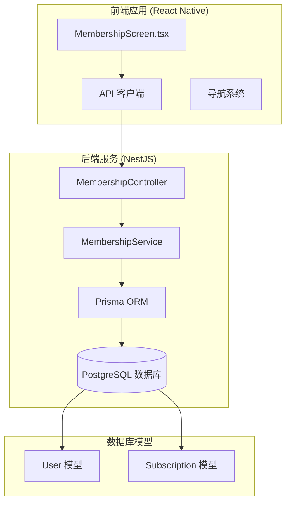
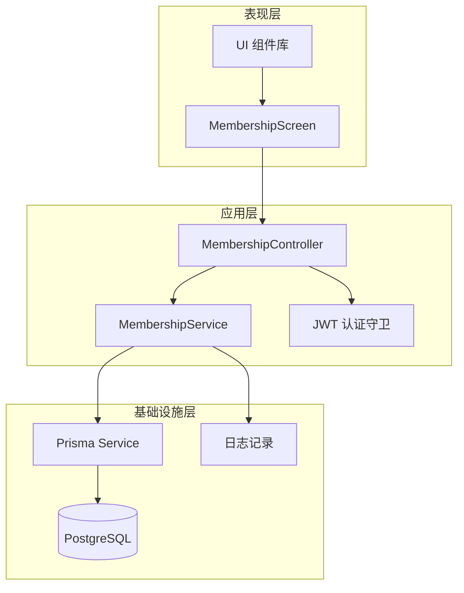
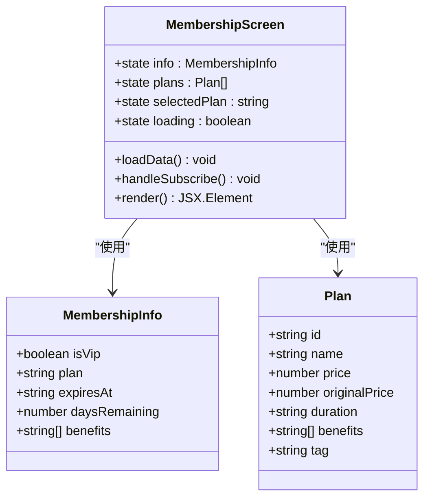
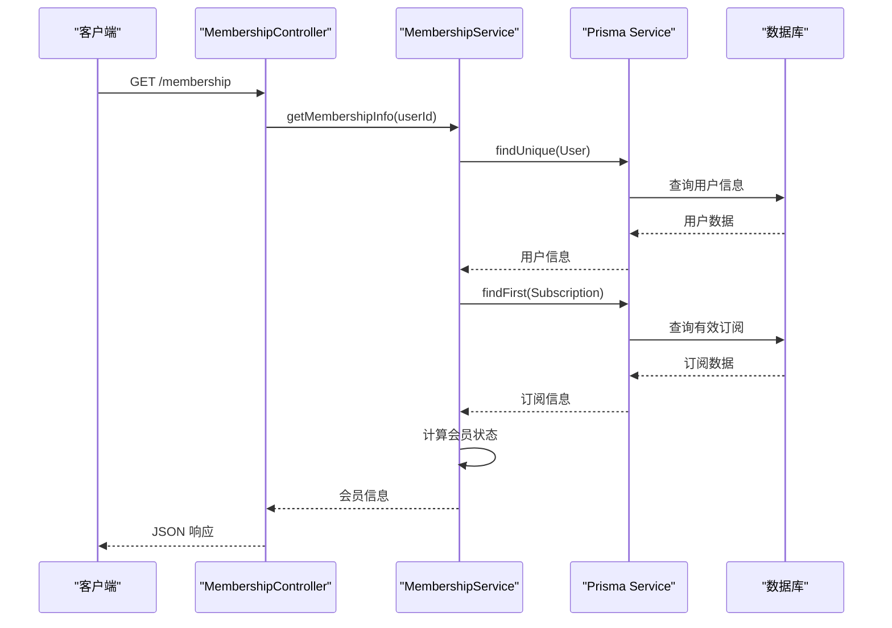
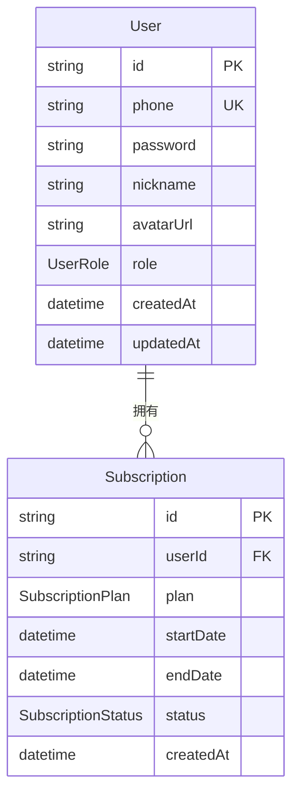
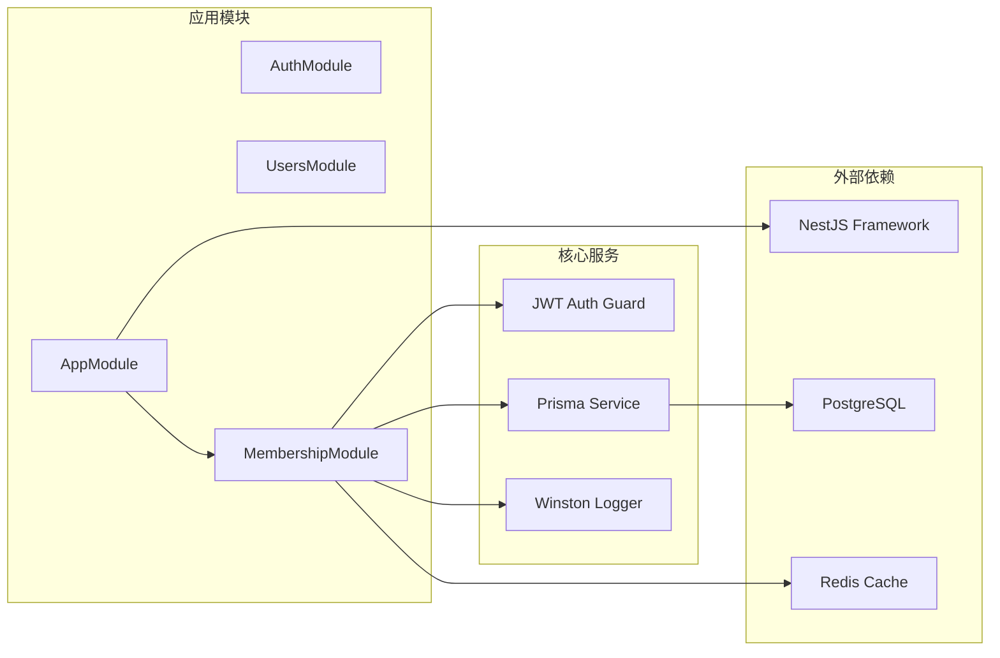

# 会员模块

<cite>
**本文档引用的文件**
- [membership.controller.ts](file://backend/src/modules/membership/membership.controller.ts)
- [membership.service.ts](file://backend/src/modules/membership/membership.service.ts)
- [membership.module.ts](file://backend/src/modules/membership/membership.module.ts)
- [MembershipScreen.tsx](file://FreeDressApp/src/screens/MembershipScreen.tsx)
- [schema.prisma](file://backend/prisma/schema.prisma)
- [app.module.ts](file://backend/src/app.module.ts)
- [users.controller.ts](file://backend/src/modules/users/users.controller.ts)
- [users.service.ts](file://backend/src/modules/users/users.service.ts)
- [auth.service.ts](file://backend/src/modules/auth/auth.service.ts)
- [tryon.service.ts](file://backend/src/modules/tryon/tryon.service.ts)
- [MainTabNavigator.tsx](file://FreeDressApp/src/navigation/MainTabNavigator.tsx)
- [index.ts](file://FreeDressApp/src/components/index.ts)
</cite>

## 目录
1. [简介](#简介)
2. [项目结构](#项目结构)
3. [核心组件](#核心组件)
4. [架构概览](#架构概览)
5. [详细组件分析](#详细组件分析)
6. [依赖关系分析](#依赖关系分析)
7. [性能考虑](#性能考虑)
8. [故障排除指南](#故障排除指南)
9. [结论](#结论)

## 简介

会员模块是 FreeDress 应用程序的核心功能之一，为用户提供会员订阅管理、权益展示和套餐购买等功能。该模块实现了完整的会员生命周期管理，包括会员状态查询、套餐展示、订阅开通等核心功能。

FreeDress 是一个基于 React Native 的智能穿搭应用，提供 AI 试穿、智能搭配推荐、衣橱管理等创新功能。会员模块通过提供不同级别的会员权益，为用户解锁更多 AI 能力和高级功能。

## 项目结构

会员模块在项目中采用分层架构设计，包含前端界面层和后端服务层：

**图表来源**
- [MembershipScreen.tsx:1-249](file://FreeDressApp/src/screens/MembershipScreen.tsx#L1-L249)
- [membership.controller.ts:1-35](file://backend/src/modules/membership/membership.controller.ts#L1-L35)
- [membership.service.ts:1-107](file://backend/src/modules/membership/membership.service.ts#L1-L107)
- [schema.prisma:14-63](file://backend/prisma/schema.prisma#L14-L63)

**章节来源**
- [MembershipScreen.tsx:1-249](file://FreeDressApp/src/screens/MembershipScreen.tsx#L1-L249)
- [membership.controller.ts:1-35](file://backend/src/modules/membership/membership.controller.ts#L1-L35)
- [membership.service.ts:1-107](file://backend/src/modules/membership/membership.service.ts#L1-L107)
- [schema.prisma:14-63](file://backend/prisma/schema.prisma#L14-L63)

## 核心组件

会员模块由以下核心组件构成：

### 前端组件
- **MembershipScreen**: 主要的会员管理界面，负责展示用户会员状态、权益列表和套餐选择
- **API 客户端**: 封装与后端的通信逻辑
- **导航集成**: 与主应用导航系统的无缝集成

### 后端组件
- **MembershipController**: 处理会员相关的 HTTP 请求
- **MembershipService**: 实现会员业务逻辑的核心服务
- **数据库模型**: 定义用户和订阅的数据结构

**章节来源**
- [MembershipScreen.tsx:44-189](file://FreeDressApp/src/screens/MembershipScreen.tsx#L44-L189)
- [membership.controller.ts:11-34](file://backend/src/modules/membership/membership.controller.ts#L11-L34)
- [membership.service.ts:12-16](file://backend/src/modules/membership/membership.service.ts#L12-L16)

## 架构概览

会员模块采用典型的三层架构模式，实现了清晰的关注点分离：

**图表来源**
- [MembershipScreen.tsx:1-249](file://FreeDressApp/src/screens/MembershipScreen.tsx#L1-L249)
- [membership.controller.ts:1-35](file://backend/src/modules/membership/membership.controller.ts#L1-L35)
- [membership.service.ts:1-107](file://backend/src/modules/membership/membership.service.ts#L1-L107)
- [app.module.ts:14-40](file://backend/src/app.module.ts#L14-L40)

## 详细组件分析

### 前端组件分析

#### MembershipScreen 组件

MembershipScreen 是会员模块的前端核心组件，提供了完整的会员管理界面：

**图表来源**
- [MembershipScreen.tsx:26-42](file://FreeDressApp/src/screens/MembershipScreen.tsx#L26-L42)

##### 核心功能特性

1. **会员状态展示**: 实时显示用户的会员状态、剩余天数和到期时间
2. **权益对比**: 清晰展示 VIP 和普通用户的权益差异
3. **套餐选择**: 提供月卡和年卡两种套餐选项
4. **订阅流程**: 完整的订阅开通流程，包含验证和错误处理

**章节来源**
- [MembershipScreen.tsx:44-189](file://FreeDressApp/src/screens/MembershipScreen.tsx#L44-L189)

### 后端服务分析

#### MembershipService 业务逻辑

MembershipService 是会员模块的核心业务逻辑实现：

**图表来源**
- [membership.controller.ts:14-18](file://backend/src/modules/membership/membership.controller.ts#L14-L18)
- [membership.service.ts:21-51](file://backend/src/modules/membership/membership.service.ts#L21-L51)

##### 业务规则实现

1. **会员状态计算**: 基于用户角色和有效订阅状态判断
2. **权益差异化**: VIP 用户享受更多 AI 能力和功能限制豁免
3. **订阅管理**: 简化的订阅创建和更新逻辑

**章节来源**
- [membership.service.ts:18-51](file://backend/src/modules/membership/membership.service.ts#L18-L51)

### 数据模型分析

会员模块涉及两个核心数据模型：

**图表来源**
- [schema.prisma:14-63](file://backend/prisma/schema.prisma#L14-L63)

**章节来源**
- [schema.prisma:14-63](file://backend/prisma/schema.prisma#L14-L63)

## 依赖关系分析

会员模块与其他系统组件的依赖关系如下：

**图表来源**
- [app.module.ts:14-40](file://backend/src/app.module.ts#L14-L40)
- [membership.module.ts:1-11](file://backend/src/modules/membership/membership.module.ts#L1-L11)

**章节来源**
- [app.module.ts:1-49](file://backend/src/app.module.ts#L1-L49)
- [membership.module.ts:1-11](file://backend/src/modules/membership/membership.module.ts#L1-L11)

## 性能考虑

会员模块在设计时考虑了以下性能优化策略：

### 前端性能优化
- **并行数据加载**: 使用 Promise.all 同时获取会员信息和套餐列表
- **状态管理**: 合理的状态更新机制，避免不必要的重渲染
- **懒加载**: 组件按需加载，减少初始包体积

### 后端性能优化
- **数据库索引**: 在用户 ID 和到期时间字段上建立索引
- **查询优化**: 使用 select 语句只获取必要字段
- **缓存策略**: Redis 缓存热门数据

### API 性能
- **限流机制**: 全局 API 限流防止滥用
- **错误处理**: 及时的错误响应和日志记录

## 故障排除指南

### 常见问题及解决方案

#### 会员状态显示异常
1. **症状**: 会员状态与预期不符
2. **排查步骤**:
   - 检查用户角色字段值
   - 验证订阅状态和到期时间
   - 确认数据库连接正常
3. **解决方案**: 清理缓存并重新登录

#### 套餐列表加载失败
1. **症状**: 套餐列表为空或加载超时
2. **排查步骤**:
   - 检查网络连接状态
   - 验证 API 端点可达性
   - 查看服务器日志
3. **解决方案**: 重试请求或检查服务器状态

#### 订阅开通失败
1. **症状**: 订阅请求返回错误
2. **排查步骤**:
   - 验证用户认证状态
   - 检查套餐参数有效性
   - 确认支付网关状态
3. **解决方案**: 重新发起订阅请求

**章节来源**
- [membership.service.ts:82-105](file://backend/src/modules/membership/membership.service.ts#L82-L105)
- [MembershipScreen.tsx:68-84](file://FreeDressApp/src/screens/MembershipScreen.tsx#L68-L84)

## 结论

会员模块作为 FreeDress 应用的核心功能，实现了完整的会员生命周期管理。通过前后端分离的设计，模块具有良好的可维护性和扩展性。

### 主要优势
- **清晰的架构设计**: 分层架构确保了代码的可维护性
- **完整的功能覆盖**: 从状态查询到订阅开通的全流程支持
- **用户体验优化**: 直观的界面设计和流畅的操作体验
- **安全性保障**: 基于 JWT 的认证机制确保系统安全

### 技术亮点
- **响应式设计**: 适配不同屏幕尺寸的移动设备
- **异步处理**: 非阻塞的 API 调用提升用户体验
- **错误处理**: 完善的错误捕获和用户反馈机制
- **性能优化**: 多层次的性能优化策略

会员模块为 FreeDress 应用提供了坚实的商业化基础，通过差异化的产品权益和服务，为用户创造价值，同时为企业实现可持续发展。