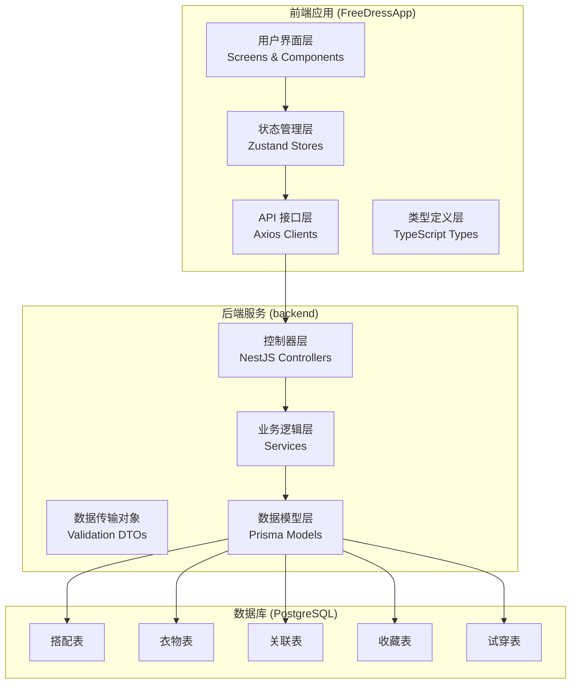
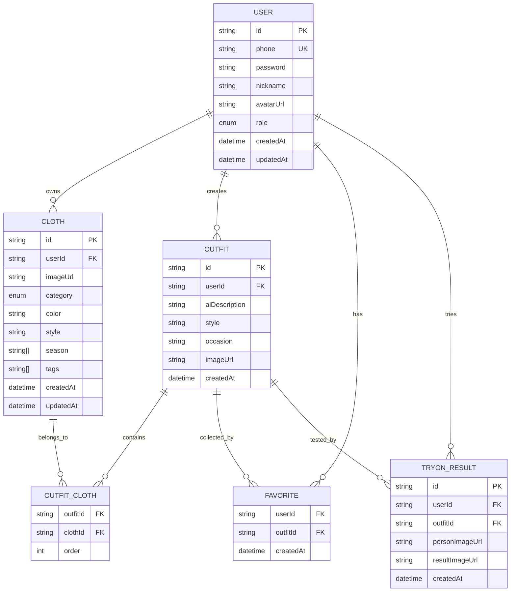
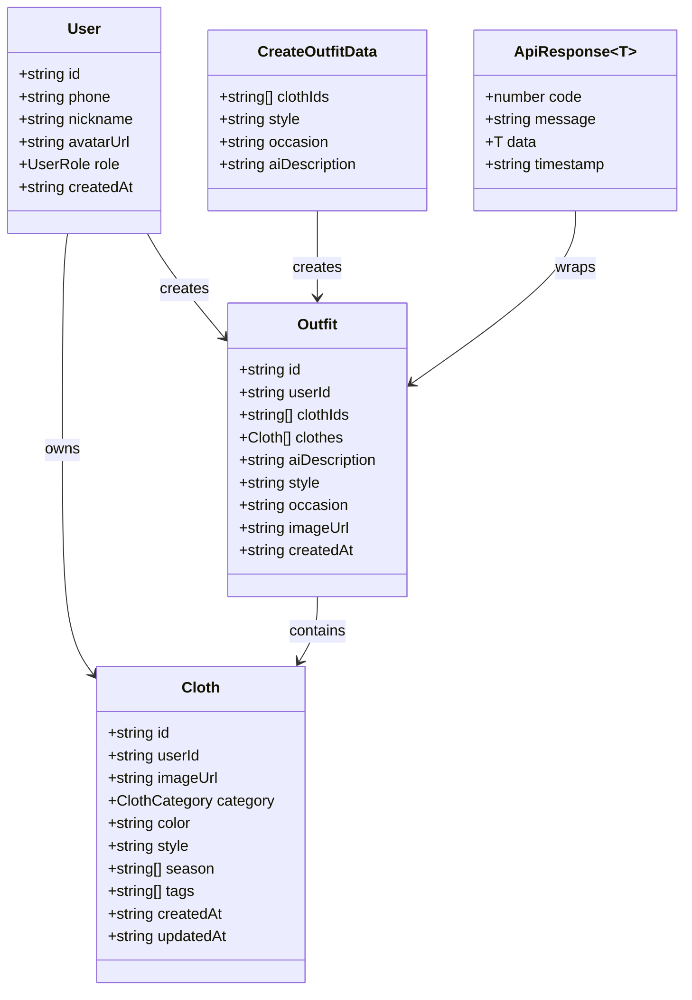
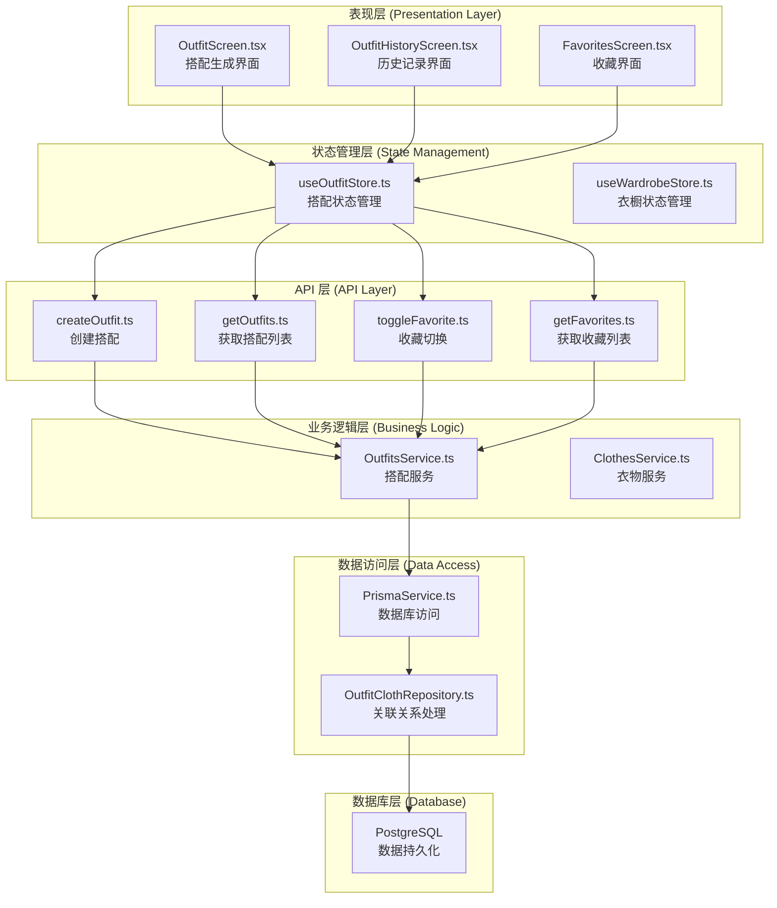
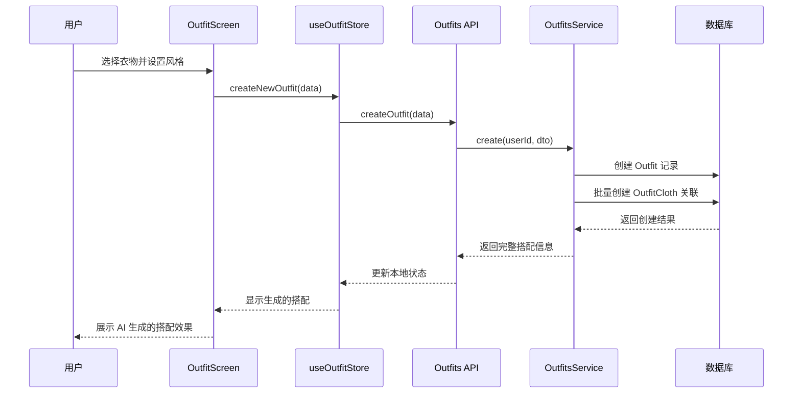
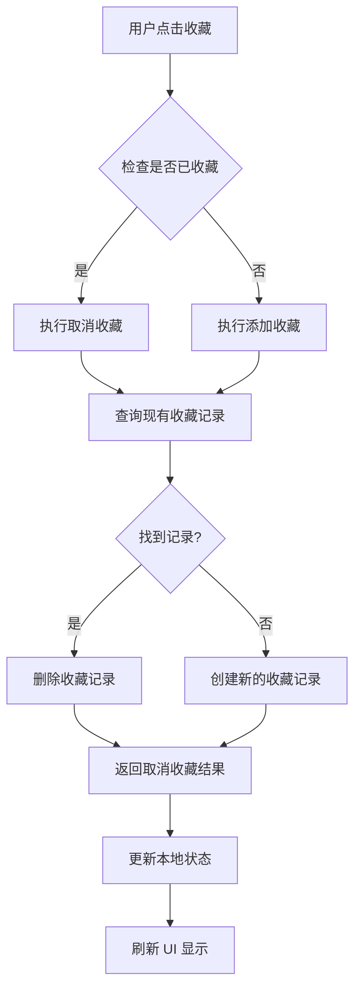
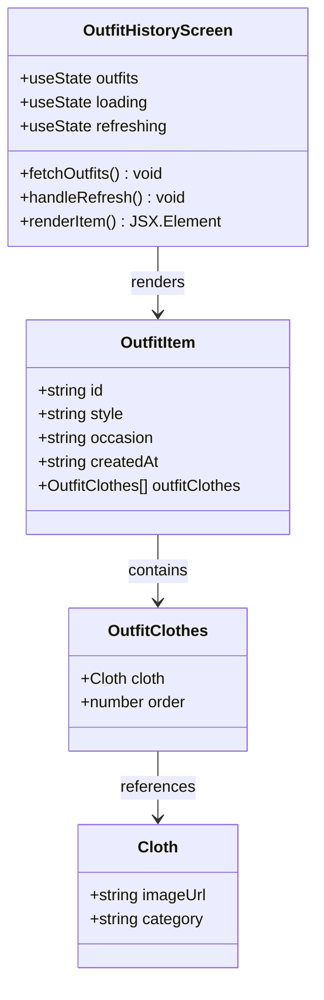
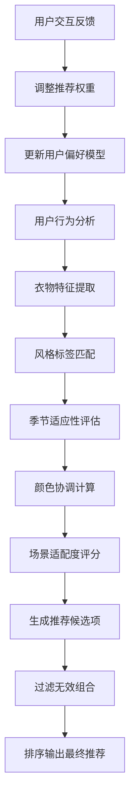
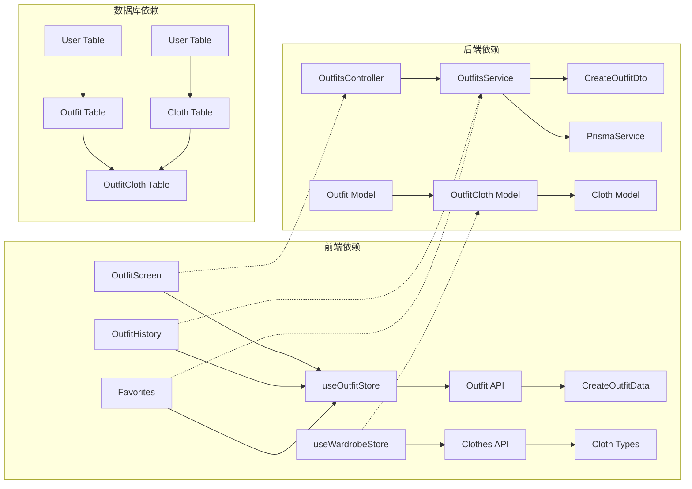

# 搭配模块

<cite>
**本文档引用的文件**
- [index.ts](file://FreeDressApp/src/types/index.ts)
- [outfits.ts](file://FreeDressApp/src/api/outfits.ts)
- [outfitStore.ts](file://FreeDressApp/src/store/outfitStore.ts)
- [wardrobeStore.ts](file://FreeDressApp/src/store/wardrobeStore.ts)
- [OutfitScreen.tsx](file://FreeDressApp/src/screens/OutfitScreen.tsx)
- [OutfitHistoryScreen.tsx](file://FreeDressApp/src/screens/OutfitHistoryScreen.tsx)
- [schema.prisma](file://backend/prisma/schema.prisma)
- [create-outfit.dto.ts](file://backend/src/modules/outfits/dto/create-outfit.dto.ts)
- [outfits.service.ts](file://backend/src/modules/outfits/outfits.service.ts)
- [outfits.controller.ts](file://backend/src/modules/outfits/outfits.controller.ts)
- [outfits.module.ts](file://backend/src/modules/outfits/outfits.module.ts)
- [app.module.ts](file://backend/src/app.module.ts)
- [seed.ts](file://backend/prisma/seed.ts)
</cite>

## 目录
1. [简介](#简介)
2. [项目结构](#项目结构)
3. [核心组件](#核心组件)
4. [架构概览](#架构概览)
5. [详细组件分析](#详细组件分析)
6. [依赖分析](#依赖分析)
7. [性能考虑](#性能考虑)
8. [故障排除指南](#故障排除指南)
9. [结论](#结论)
10. [附录](#附录)

## 简介

搭配模块是 FreeDress 应用的核心功能之一，为用户提供智能化的服装搭配体验。该模块通过 AI 技术将用户衣橱中的衣物进行智能组合，生成美观实用的搭配方案，并支持收藏、分享、历史记录管理等完整功能。

本模块采用前后端分离架构，前端使用 React Native 开发移动端应用，后端基于 NestJS 构建 RESTful API，数据库采用 Prisma ORM 和 PostgreSQL。系统支持多平台部署，包括原生应用和微信小程序版本。

## 项目结构

搭配模块在整体项目中采用清晰的分层架构：

**图表来源**
- [app.module.ts:13-31](file://backend/src/app.module.ts#L13-L31)
- [outfits.module.ts:5-9](file://backend/src/modules/outfits/outfits.module.ts#L5-L9)

**章节来源**
- [app.module.ts:1-33](file://backend/src/app.module.ts#L1-L33)
- [outfits.module.ts:1-11](file://backend/src/modules/outfits/outfits.module.ts#L1-L11)

## 核心组件

### 数据模型设计

搭配模块的数据模型采用实体关系设计，支持复杂的多对多关联关系：

**图表来源**
- [schema.prisma:14-131](file://backend/prisma/schema.prisma#L14-L131)

### 类型系统

系统采用 TypeScript 强类型设计，确保数据安全性和开发效率：

**图表来源**
- [index.ts:8-46](file://FreeDressApp/src/types/index.ts#L8-L46)
- [outfits.ts:4-15](file://FreeDressApp/src/api/outfits.ts#L4-L15)

**章节来源**
- [index.ts:1-98](file://FreeDressApp/src/types/index.ts#L1-L98)
- [schema.prisma:14-131](file://backend/prisma/schema.prisma#L14-L131)

## 架构概览

搭配模块采用经典的三层架构模式，实现了清晰的关注点分离：

**图表来源**
- [OutfitScreen.tsx:37-93](file://FreeDressApp/src/screens/OutfitScreen.tsx#L37-L93)
- [outfitStore.ts:32-89](file://FreeDressApp/src/store/outfitStore.ts#L32-L89)
- [outfits.service.ts:6-122](file://backend/src/modules/outfits/outfits.service.ts#L6-L122)

**章节来源**
- [OutfitScreen.tsx:1-603](file://FreeDressApp/src/screens/OutfitScreen.tsx#L1-L603)
- [outfitStore.ts:1-90](file://FreeDressApp/src/store/outfitStore.ts#L1-L90)

## 详细组件分析

### 搭配创建算法

搭配创建算法是模块的核心功能，实现了从衣物选择到 AI 生成的完整流程：

**图表来源**
- [OutfitScreen.tsx:67-84](file://FreeDressApp/src/screens/OutfitScreen.tsx#L67-L84)
- [outfitStore.ts:59-64](file://FreeDressApp/src/store/outfitStore.ts#L59-L64)
- [outfits.service.ts:9-33](file://backend/src/modules/outfits/outfits.service.ts#L9-L33)

#### 算法流程详解

1. **输入验证阶段**：系统验证用户选择的衣物数量和有效性
2. **风格标签处理**：将用户选择的多个风格标签合并为复合风格描述
3. **AI 描述生成**：基于衣物数量和风格生成自然语言描述
4. **数据库持久化**：原子性地创建搭配主记录和关联关系
5. **结果返回**：包含完整关联信息的搭配数据

**章节来源**
- [OutfitScreen.tsx:67-84](file://FreeDressApp/src/screens/OutfitScreen.tsx#L67-L84)
- [outfits.service.ts:9-33](file://backend/src/modules/outfits/outfits.service.ts#L9-L33)

### 收藏机制

收藏功能实现了用户个性化内容管理：

**图表来源**
- [outfits.service.ts:81-102](file://backend/src/modules/outfits/outfits.service.ts#L81-L102)
- [outfitStore.ts:74-86](file://FreeDressApp/src/store/outfitStore.ts#L74-L86)

**章节来源**
- [outfits.service.ts:81-102](file://backend/src/modules/outfits/outfits.service.ts#L81-L102)
- [outfitStore.ts:74-86](file://FreeDressApp/src/store/outfitStore.ts#L74-L86)

### 历史记录管理

历史记录功能提供了完整的搭配浏览和管理能力：

**图表来源**
- [OutfitHistoryScreen.tsx:24-30](file://FreeDressApp/src/screens/OutfitHistoryScreen.tsx#L24-L30)

**章节来源**
- [OutfitHistoryScreen.tsx:1-212](file://FreeDressApp/src/screens/OutfitHistoryScreen.tsx#L1-L212)

### 推荐逻辑

系统采用基于用户行为和衣物特征的智能推荐算法：

**章节来源**
- [seed.ts:41-105](file://backend/prisma/seed.ts#L41-L105)

## 依赖分析

### 组件耦合关系

搭配模块的组件间依赖关系清晰，遵循单一职责原则：

**图表来源**
- [outfitStore.ts:1-30](file://FreeDressApp/src/store/outfitStore.ts#L1-L30)
- [outfits.controller.ts:14-64](file://backend/src/modules/outfits/outfits.controller.ts#L14-L64)
- [schema.prisma:90-101](file://backend/prisma/schema.prisma#L90-L101)

### 外部依赖

系统对外部依赖进行了最小化设计：

- **前端框架**：React Native 72+
- **状态管理**：Zustand 4.0+
- **HTTP 客户端**：Axios
- **类型系统**：TypeScript 5.0+
- **构建工具**：Metro Bundler
- **后端框架**：NestJS 10.0+
- **数据库**：Prisma ORM + PostgreSQL 16
- **认证**：JWT Token

**章节来源**
- [outfits.controller.ts:1-65](file://backend/src/modules/outfits/outfits.controller.ts#L1-L65)
- [schema.prisma:1-12](file://backend/prisma/schema.prisma#L1-L12)

## 性能考虑

### 数据库优化

1. **索引策略**：
   - 用户 ID 字段建立索引，加速用户相关查询
   - 多对多关联表建立复合主键，确保数据完整性
   - 季节和标签字段使用数组类型，支持高效查询

2. **查询优化**：
   - 使用 `include` 关联加载减少 N+1 查询问题
   - 实现分页查询，避免大量数据一次性加载
   - 缓存热门搭配数据，提升用户体验

3. **事务处理**：
   - 搭配创建使用数据库事务，确保数据一致性
   - 收藏操作原子性处理，防止脏数据

### 前端性能优化

1. **状态管理优化**：
   - 使用 Zustand 替代 Redux，减少不必要的状态更新
   - 实现局部状态隔离，避免全局状态污染
   - 采用 selector 模式，精确控制组件重渲染

2. **网络请求优化**：
   - 实现请求缓存机制，避免重复请求
   - 使用并发请求优化，提升数据加载速度
   - 错误重试机制，增强网络异常处理

3. **UI 性能优化**：
   - 使用 FlatList 优化长列表渲染
   - 图片懒加载和缓存策略
   - 合理的组件拆分和代码分割

## 故障排除指南

### 常见问题及解决方案

1. **搭配创建失败**
   - 检查网络连接状态
   - 验证衣物 ID 有效性
   - 确认用户权限认证

2. **收藏功能异常**
   - 检查数据库连接
   - 验证用户会话状态
   - 查看收藏表约束条件

3. **历史记录显示错误**
   - 确认数据同步状态
   - 检查时间戳格式
   - 验证关联数据完整性

### 调试工具

1. **前端调试**：
   - React DevTools 分析组件状态
   - Zustand DevTools 监控状态变化
   - Network 面板检查 API 请求

2. **后端调试**：
   - NestJS 日志系统
   - Prisma 查询日志
   - 数据库性能分析

**章节来源**
- [outfits.service.ts:61-66](file://backend/src/modules/outfits/outfits.service.ts#L61-L66)
- [outfitStore.ts:40-47](file://FreeDressApp/src/store/outfitStore.ts#L40-L47)

## 结论

搭配模块通过精心设计的数据模型和算法实现了完整的智能搭配功能。系统采用现代化的技术栈，具备良好的可扩展性和维护性。

### 核心优势

1. **设计理念先进**：基于实体关系模型，支持复杂的多对多关联
2. **算法实现高效**：AI 驱动的搭配生成，提供个性化体验
3. **数据一致性保障**：严格的验证机制和事务处理
4. **性能优化到位**：前后端协同优化，确保流畅体验
5. **扩展性强**：模块化设计，便于功能扩展和维护

### 发展方向

1. **推荐算法优化**：引入机器学习模型，提升推荐准确性
2. **实时协作**：支持多人协作搭配功能
3. **AR 试穿**：集成增强现实技术
4. **社交分享**：完善分享和社区功能
5. **多平台支持**：扩展到更多设备和平台

## 附录

### API 接口规范

| 接口 | 方法 | 路径 | 功能描述 |
|------|------|------|----------|
| 创建搭配 | POST | /outfits | 创建新的搭配记录 |
| 获取搭配列表 | GET | /outfits | 获取当前用户的搭配列表 |
| 获取搭配详情 | GET | /outfits/:id | 获取指定搭配的详细信息 |
| 删除搭配 | DELETE | /outfits/:id | 删除指定的搭配记录 |
| 收藏搭配 | POST | /outfits/:id/favorite | 添加或取消收藏搭配 |
| 获取收藏列表 | GET | /outfits/favorites | 获取用户收藏的所有搭配 |

### 数据模型字段说明

| 字段名 | 类型 | 必填 | 描述 |
|--------|------|------|------|
| id | string | 是 | 唯一标识符 |
| userId | string | 是 | 用户 ID |
| clothIds | string[] | 是 | 衣物 ID 数组 |
| style | string | 否 | 搭配风格 |
| occasion | string | 否 | 适用场合 |
| aiDescription | string | 否 | AI 生成的描述 |
| imageUrl | string | 否 | 搭配效果图 URL |
| createdAt | datetime | 否 | 创建时间 |
| updatedAt | datetime | 否 | 更新时间 |