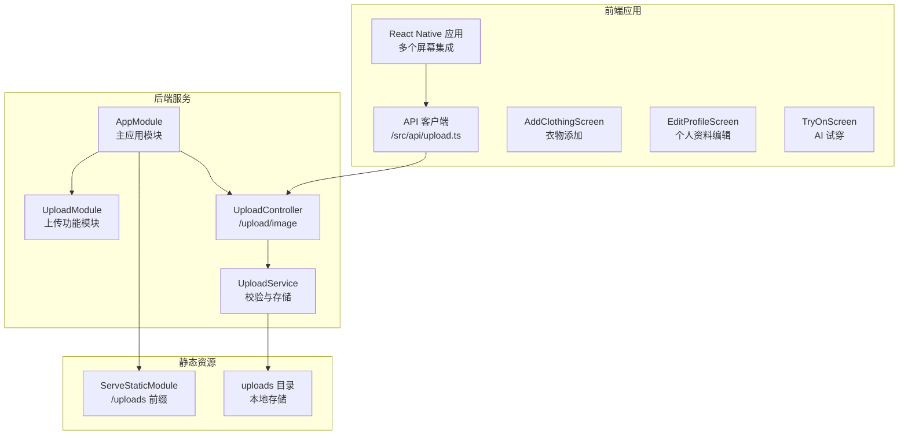
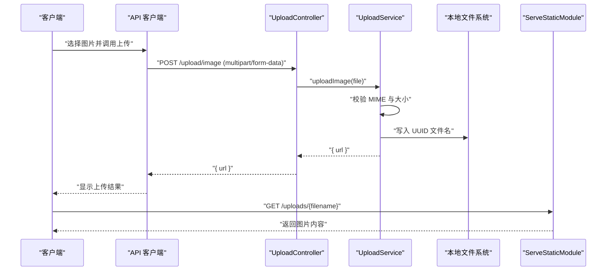
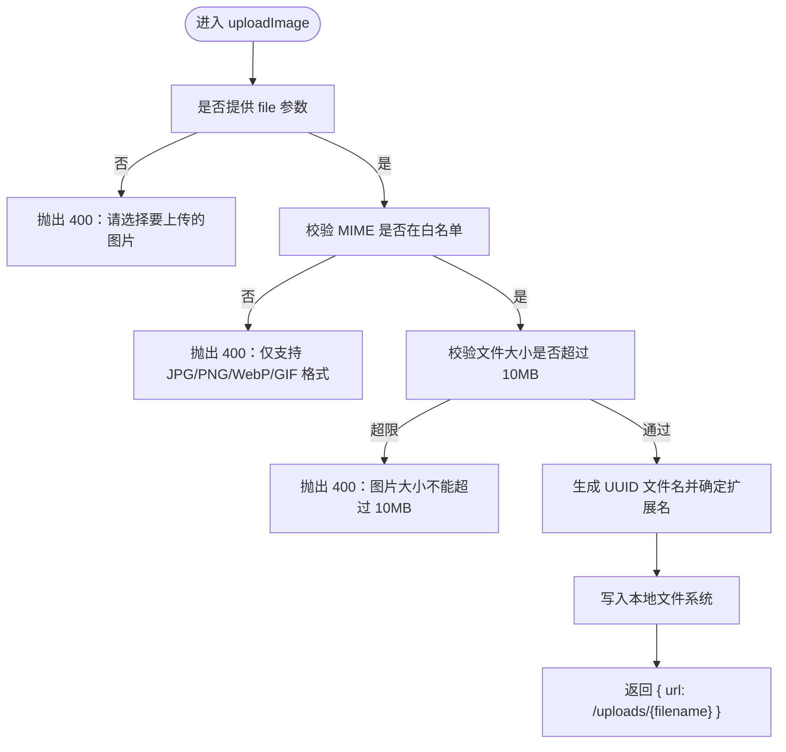
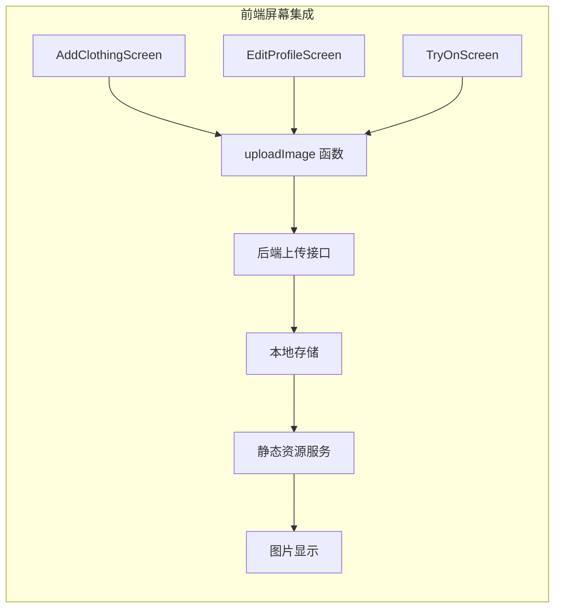

# 文件上传模块

<cite>
**本文引用的文件**
- [upload.controller.ts](file://backend/src/modules/upload/upload.controller.ts)
- [upload.service.ts](file://backend/src/modules/upload/upload.service.ts)
- [upload.module.ts](file://backend/src/modules/upload/upload.module.ts)
- [app.module.ts](file://backend/src/app.module.ts)
- [upload.ts](file://FreeDressApp/src/api/upload.ts)
- [jwt-auth.guard.ts](file://backend/src/common/guards/jwt-auth.guard.ts)
- [package.json](file://backend/package.json)
- [backend.gitignore](file://backend/.gitignore)
- [AddClothingScreen.tsx](file://FreeDressApp/src/screens/AddClothingScreen.tsx)
- [EditProfileScreen.tsx](file://FreeDressApp/src/screens/EditProfileScreen.tsx)
- [TryOnScreen.tsx](file://FreeDressApp/src/screens/TryOnScreen.tsx)
</cite>

## 更新摘要
**所做更改**
- 更新了核心组件分析部分，反映最新的 UploadModule 架构
- 增强了前端使用示例，包含三个主要屏幕的集成方式
- 完善了依赖关系分析，明确各模块间的依赖关系
- 更新了故障排查指南，涵盖实际使用场景中的常见问题

## 目录
1. [简介](#简介)
2. [项目结构](#项目结构)
3. [核心组件](#核心组件)
4. [架构总览](#架构总览)
5. [详细组件分析](#详细组件分析)
6. [前端集成示例](#前端集成示例)
7. [依赖关系分析](#依赖关系分析)
8. [性能考虑](#性能考虑)
9. [故障排查指南](#故障排查指南)
10. [结论](#结论)
11. [附录](#附录)

## 简介
本文件上传模块为智能衣物搭配平台提供基础的图片上传能力，支持多格式图片（JPG/PNG/WebP/GIF）、大小限制（最大10MB）、本地文件系统存储与静态资源服务。模块采用前后端分离设计：前端通过表单数据上传，后端使用 NestJS 的文件拦截器接收二进制流，进行格式与大小校验，并以 UUID 命名写入 uploads 目录，最终返回可访问的 URL。

## 项目结构
文件上传模块在后端采用标准的 NestJS 分层结构，前端通过独立 API 客户端调用后端接口。模块现已正式集成到主应用中，支持衣物添加、个人资料编辑和 AI 试穿等多个核心功能场景。



**图表来源**
- [app.module.ts:13-31](file://backend/src/app.module.ts#L13-L31)
- [upload.module.ts:5-10](file://backend/src/modules/upload/upload.module.ts#L5-L10)
- [upload.controller.ts:29-50](file://backend/src/modules/upload/upload.controller.ts#L29-L50)
- [upload.service.ts:17-48](file://backend/src/modules/upload/upload.service.ts#L17-L48)

**章节来源**
- [app.module.ts:13-31](file://backend/src/app.module.ts#L13-L31)
- [upload.module.ts:5-10](file://backend/src/modules/upload/upload.module.ts#L5-L10)
- [upload.controller.ts:29-50](file://backend/src/modules/upload/upload.controller.ts#L29-L50)
- [upload.service.ts:17-48](file://backend/src/modules/upload/upload.service.ts#L17-L48)

## 核心组件
- **上传模块**：UploadModule 作为独立的功能模块，包含控制器和服务提供者，支持模块间依赖注入和导出
- **上传控制器**：定义 /upload/image 接口，使用 JWT 身份认证与文件拦截器，接收 multipart/form-data 并转发给服务层
- **上传服务**：执行格式白名单校验、大小限制检查、UUID 命名与本地文件系统写入，返回可访问 URL
- **应用模块**：注册静态资源服务，将 uploads 目录映射到 /uploads 前缀路径，便于直接访问已上传文件
- **前端 API**：构造 FormData，从设备选择的图片 URI 构造文件项并发起上传请求
- **前端集成**：在衣物添加、个人资料编辑、AI 试穿三个核心屏幕中集成上传功能

**章节来源**
- [upload.controller.ts:33-49](file://backend/src/modules/upload/upload.controller.ts#L33-L49)
- [upload.service.ts:25-47](file://backend/src/modules/upload/upload.service.ts#L25-L47)
- [app.module.ts:19-22](file://backend/src/app.module.ts#L19-L22)
- [upload.ts:4-20](file://FreeDressApp/src/api/upload.ts#L4-L20)

## 架构总览
下图展示从前端到后端再到静态资源服务的整体流程：



**图表来源**
- [upload.controller.ts:33-49](file://backend/src/modules/upload/upload.controller.ts#L33-L49)
- [upload.service.ts:25-47](file://backend/src/modules/upload/upload.service.ts#L25-L47)
- [app.module.ts:19-22](file://backend/src/app.module.ts#L19-L22)
- [upload.ts:4-20](file://FreeDressApp/src/api/upload.ts#L4-L20)

## 详细组件分析

### 模块：UploadModule
- **模块定义**：作为独立的上传功能模块，负责管理上传相关的控制器和服务
- **依赖注入**：通过 providers 数组提供 UploadService，通过 exports 导出服务供其他模块使用
- **模块注册**：在 AppModule 中通过 imports 数组注册，成为应用功能模块的一部分

**章节来源**
- [upload.module.ts:5-10](file://backend/src/modules/upload/upload.module.ts#L5-L10)

### 控制器：UploadController
- **路由与鉴权**
  - 路径：/upload/image
  - 使用 JWT 身份认证守卫，确保只有登录用户可上传
  - 使用文件拦截器接收二进制流
- **请求体与响应**
  - 接收 multipart/form-data，字段名为 file
  - 返回 { url }，其中 url 为 /uploads/{filename}
- **Swagger 文档**：提供完整的 API 文档注解，包括认证、请求体和响应格式

**章节来源**
- [upload.controller.ts:33-49](file://backend/src/modules/upload/upload.controller.ts#L33-L49)
- [jwt-auth.guard.ts:8-21](file://backend/src/common/guards/jwt-auth.guard.ts#L8-L21)

### 服务：UploadService
- **存储目录**
  - 默认上传目录为项目根目录下的 uploads
  - 若目录不存在则自动创建
- **校验逻辑**
  - 允许的 MIME 类型：image/jpeg、image/png、image/webp、image/gif
  - 单文件大小上限：10MB
- **命名与写入**
  - 使用 UUID 作为文件名，保留原扩展名
  - 写入完成后返回 /uploads/{filename} 的相对 URL
- **错误处理**
  - 缺少文件参数时抛出 400
  - 不在白名单的 MIME 类型时抛出 400
  - 超过大小限制时抛出 400



**图表来源**
- [upload.service.ts:25-47](file://backend/src/modules/upload/upload.service.ts#L25-L47)

**章节来源**
- [upload.service.ts:17-48](file://backend/src/modules/upload/upload.service.ts#L17-L48)

### 应用模块：静态资源服务
- **ServeStaticModule** 将 uploads 目录映射到 /uploads 前缀
- **模块注册**：在 AppModule 中通过 ServeStaticModule.forRoot 配置
- **使上传后的图片可直接通过浏览器或客户端访问**

**章节来源**
- [app.module.ts:19-22](file://backend/src/app.module.ts#L19-L22)

## 前端集成示例
文件上传模块已在三个核心屏幕中成功集成，提供完整的用户体验。

### 衣物添加屏幕（AddClothingScreen）
- **使用场景**：用户上传衣物图片后添加到衣橱
- **集成方式**：调用 uploadImage 函数获取图片 URL
- **错误处理**：捕获上传异常并显示友好的错误提示

### 个人资料编辑屏幕（EditProfileScreen）
- **使用场景**：用户上传头像图片更新个人资料
- **集成方式**：条件性上传（仅当头像 URI 存在时）
- **状态管理**：上传过程中显示加载状态

### AI 试穿屏幕（TryOnScreen）
- **使用场景**：用户上传全身照进行虚拟试穿
- **集成方式**：长按拍照或点击从相册选择图片
- **实时反馈**：上传过程中显示覆盖层提示



**图表来源**
- [AddClothingScreen.tsx:66-68](file://FreeDressApp/src/screens/AddClothingScreen.tsx#L66-L68)
- [EditProfileScreen.tsx:58-61](file://FreeDressApp/src/screens/EditProfileScreen.tsx#L58-L61)
- [TryOnScreen.tsx:73-75](file://FreeDressApp/src/screens/TryOnScreen.tsx#L73-L75)

**章节来源**
- [AddClothingScreen.tsx:60-87](file://FreeDressApp/src/screens/AddClothingScreen.tsx#L60-L87)
- [EditProfileScreen.tsx:54-77](file://FreeDressApp/src/screens/EditProfileScreen.tsx#L54-L77)
- [TryOnScreen.tsx:71-82](file://FreeDressApp/src/screens/TryOnScreen.tsx#L71-L82)

## 依赖关系分析
- **后端依赖**
  - @nestjs/platform-express：提供文件拦截器与 multipart 支持
  - @nestjs/serve-static：提供静态文件服务
  - @nestjs/swagger：提供 API 文档注解支持
  - uuid：生成唯一文件名
- **前端依赖**
  - axios：HTTP 客户端
  - React Native：FormData 与文件上传支持
- **模块依赖**
  - UploadModule 依赖 JwtAuthGuard 进行身份认证
  - AppModule 统一管理所有功能模块的注册

```mermaid
graph LR
subgraph "后端模块"
APP["AppModule"]
UM["UploadModule"]
UC["UploadController"]
US["UploadService"]
JWT["JwtAuthGuard"]
END
subgraph "外部依赖"
EXP["@nestjs/platform-express"]
STS["@nestjs/serve-static"]
SWG["@nestjs/swagger"]
UUD["uuid"]
END
APP --> UM
UM --> UC
UM --> US
UC --> JWT
UC --> EXP
US --> UUD
APP --> STS
APP --> SWG
```

**图表来源**
- [package.json:26-44](file://backend/package.json#L26-L44)
- [app.module.ts:9-27](file://backend/src/app.module.ts#L9-L27)

**章节来源**
- [package.json:26-44](file://backend/package.json#L26-L44)

## 性能考虑
- **当前实现**
  - 服务端直接将二进制流写入本地磁盘，无并发控制与分块处理
  - 未启用 CDN 或对象存储，所有图片通过本地 /uploads 路由访问
  - 单文件大小限制为 10MB，适合移动端图片上传场景
- **可选优化方向**
  - 引入内存/磁盘缓存策略与并发队列
  - 集成对象存储（如 S3）与 CDN，提升大流量场景下的吞吐与可用性
  - 对大图进行异步压缩与多尺寸生成（见"扩展建议"）

## 故障排查指南
- **常见错误与定位**
  - 400 未提供文件：确认前端是否正确 append('file', ...) 且 Content-Type 设置为 multipart/form-data
  - 400 MIME 不支持：确认图片格式是否为 JPG/PNG/WebP/GIF
  - 400 大小超限：确认单张图片不超过 10MB
  - 401 未登录：确认请求头携带有效 JWT Token
  - 404 无法访问图片：确认 uploads 目录存在且 ServeStaticModule 已正确挂载
- **前端集成问题**
  - 图片上传失败：检查屏幕中是否正确调用 uploadImage 函数
  - URL 为空：确认后端返回的 { url } 字段是否正确处理
  - 加载状态异常：检查上传过程中的状态管理逻辑
- **日志与调试**
  - 在开发模式下启动后端，观察控制台输出
  - 检查 uploads 目录权限与磁盘空间
  - 使用 curl 或 Postman 直接测试 /upload/image 接口

**章节来源**
- [upload.controller.ts:33-49](file://backend/src/modules/upload/upload.controller.ts#L33-L49)
- [upload.service.ts:25-47](file://backend/src/modules/upload/upload.service.ts#L25-L47)
- [jwt-auth.guard.ts:14-20](file://backend/src/common/guards/jwt-auth.guard.ts#L14-L20)
- [app.module.ts:19-22](file://backend/src/app.module.ts#L19-L22)

## 结论
该文件上传模块以简洁的架构实现了基础的图片上传能力，具备必要的格式与大小校验、安全的命名策略以及静态资源直连访问。模块现已成功集成到衣物添加、个人资料编辑和 AI 试穿三个核心功能中，为用户提供完整的图片上传体验。对于生产环境，建议引入对象存储与 CDN、增强并发与缓存策略，并扩展图片处理与缩略图生成功能。

## 附录

### 安全防护措施
- **身份认证**：所有上传接口均受 JWT 身份认证守卫保护
- **文件类型**：严格白名单限制，避免恶意文件上传
- **大小限制**：统一 10MB 上限，防止资源滥用
- **存储隔离**：uploads 目录独立于源代码，避免被版本控制工具提交

**章节来源**
- [jwt-auth.guard.ts:8-21](file://backend/src/common/guards/jwt-auth.guard.ts#L8-L21)
- [upload.service.ts:30-38](file://backend/src/modules/upload/upload.service.ts#L30-L38)
- [backend.gitignore:1-82](file://backend/.gitignore#L1-L82)

### 扩展存储后端接口设计（建议）
- **抽象存储适配器**
  - 方法：store(key, buffer, metadata) -> Promise<string>
  - 方法：delete(key) -> Promise<void>
  - 方法：getUrl(key) -> string
- **实现示例**
  - 本地文件系统：基于 UUID 命名，返回 /uploads/{key}
  - 对象存储：基于桶名与前缀，返回公开访问 URL
- **集成点**
  - 在 UploadService 中注入存储适配器，替换本地写入逻辑
  - 保持对外返回结构一致（{ url }），降低上层变更成本

### 图片处理与缩略图生成（建议）
- **处理流程**
  - 接收原始图片
  - 生成多尺寸版本（如 750w/1080w/原图）
  - 生成 WebP/JPEG 混合策略以平衡体积与质量
  - 上传至对象存储并记录元数据
- **批量上传**
  - 前端收集多张图片后按序号命名，后端按批次处理
  - 返回每张图片的 URL 列表
- **性能优化**
  - 异步处理与队列化
  - CDN 加速与懒加载
  - 前端预览与进度反馈

### 数据流与命名规则
- **输入**：multipart/form-data，字段 file
- **校验**：MIME 白名单 + 10MB 限制
- **命名**：UUID + 原始扩展名
- **输出**：{ url: /uploads/{filename} }

**章节来源**
- [upload.service.ts:30-47](file://backend/src/modules/upload/upload.service.ts#L30-L47)