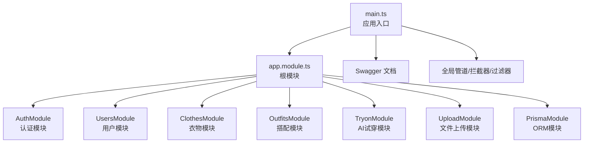
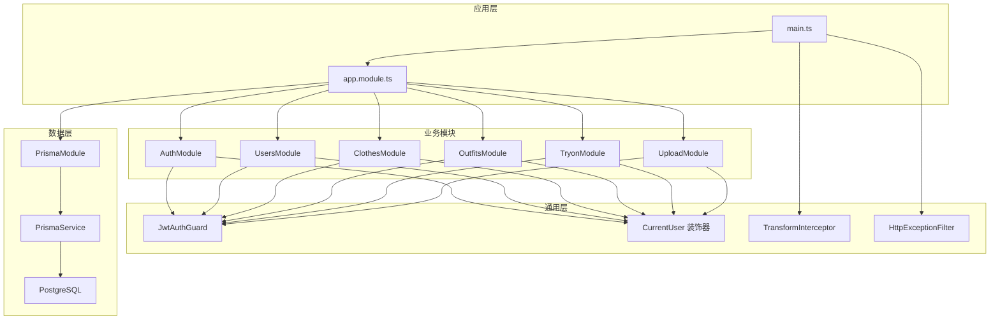
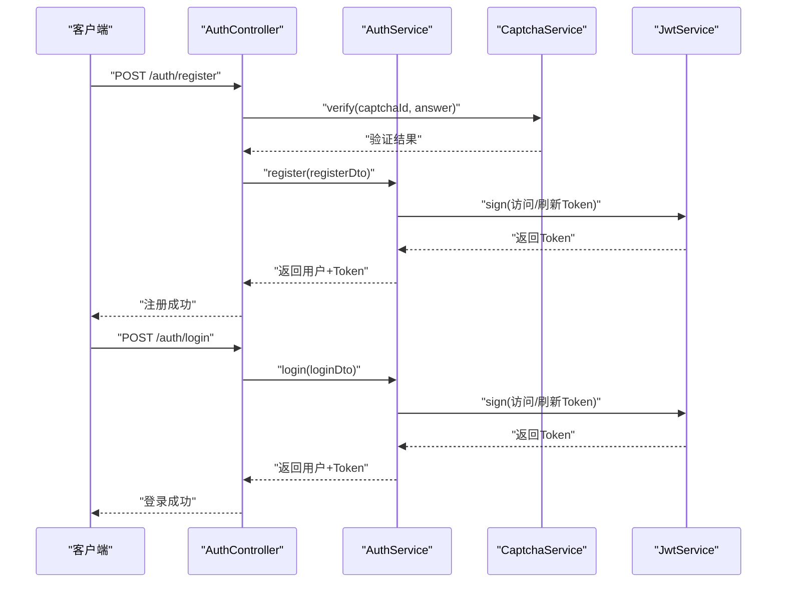
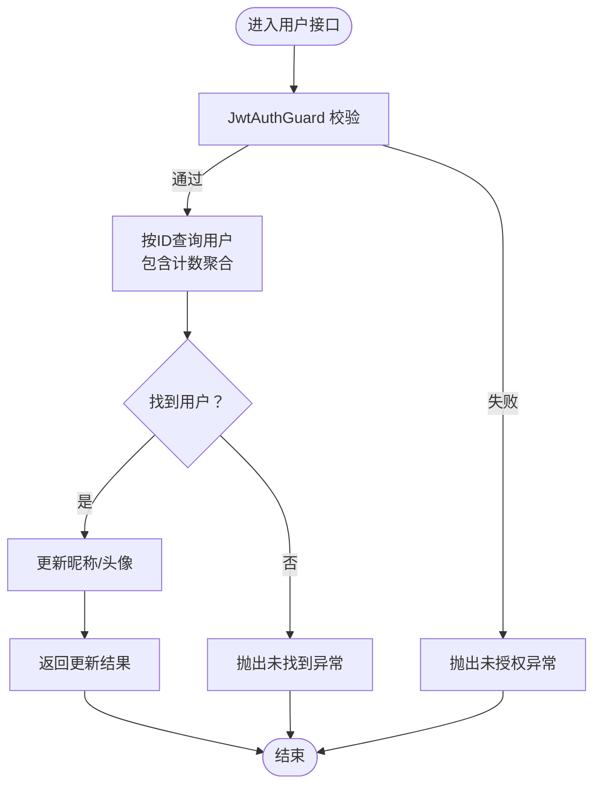
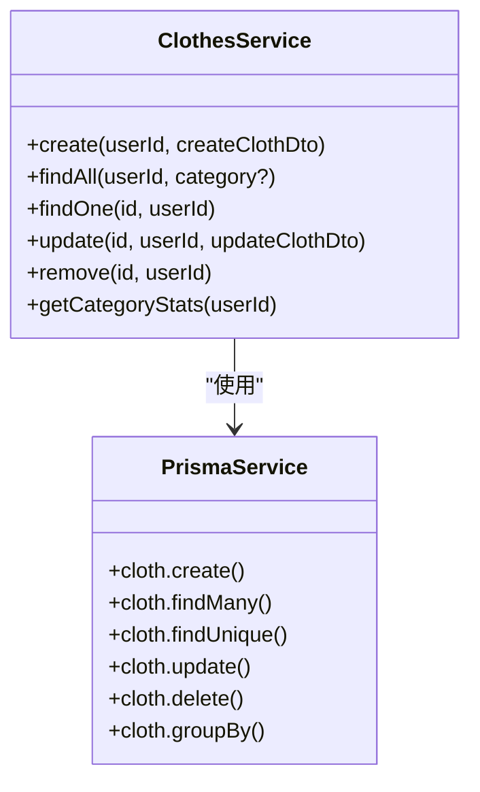
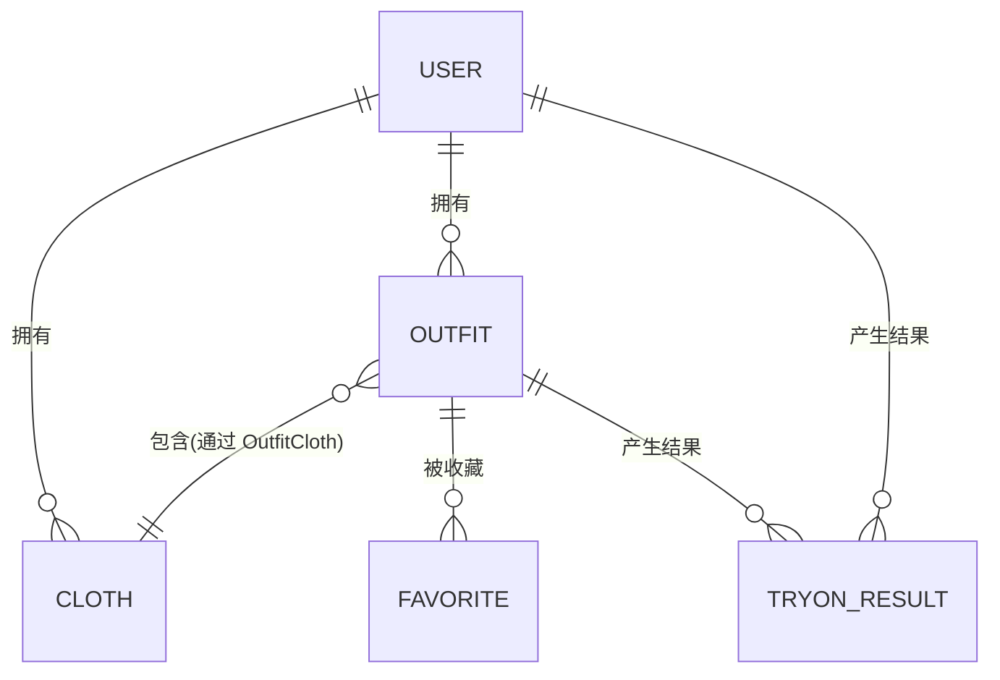
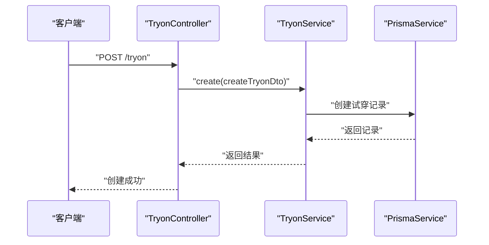
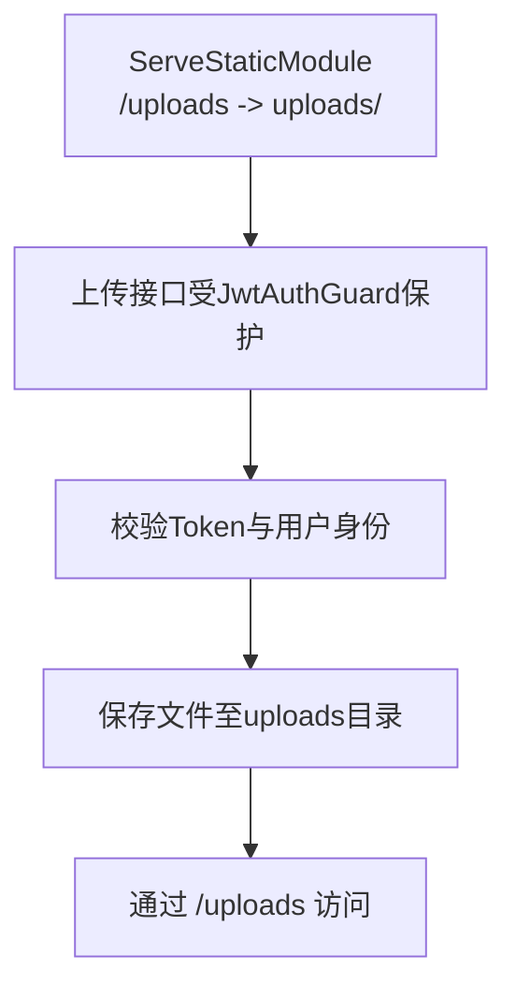
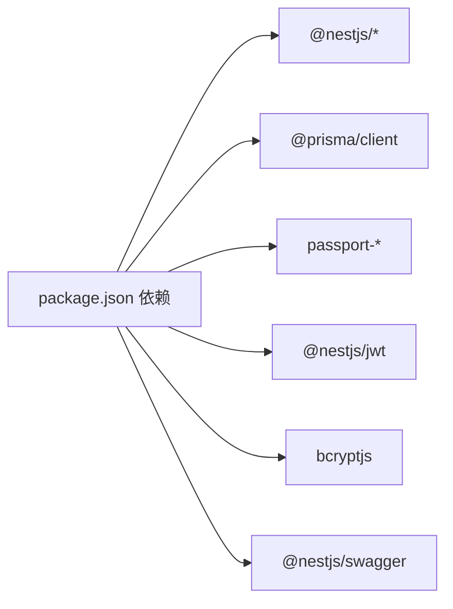

# 核心模块详解

<cite>
**本文引用的文件**
- [backend/src/main.ts](file://backend/src/main.ts)
- [backend/src/app.module.ts](file://backend/src/app.module.ts)
- [backend/prisma/schema.prisma](file://backend/prisma/schema.prisma)
- [backend/package.json](file://backend/package.json)
- [backend/README.md](file://backend/README.md)
- [backend/src/modules/auth/auth.module.ts](file://backend/src/modules/auth/auth.module.ts)
- [backend/src/modules/auth/auth.service.ts](file://backend/src/modules/auth/auth.service.ts)
- [backend/src/modules/auth/auth.controller.ts](file://backend/src/modules/auth/auth.controller.ts)
- [backend/src/modules/auth/strategies/jwt.strategy.ts](file://backend/src/modules/auth/strategies/jwt.strategy.ts)
- [backend/src/modules/auth/captcha.service.ts](file://backend/src/modules/auth/captcha.service.ts)
- [backend/src/common/guards/jwt-auth.guard.ts](file://backend/src/common/guards/jwt-auth.guard.ts)
- [backend/src/common/decorators/current-user.decorator.ts](file://backend/src/common/decorators/current-user.decorator.ts)
- [backend/src/common/interceptors/transform.interceptor.ts](file://backend/src/common/interceptors/transform.interceptor.ts)
- [backend/src/common/filters/http-exception.filter.ts](file://backend/src/common/filters/http-exception.filter.ts)
- [backend/src/modules/users/users.module.ts](file://backend/src/modules/users/users.module.ts)
- [backend/src/modules/users/users.service.ts](file://backend/src/modules/users/users.service.ts)
- [backend/src/modules/users/users.controller.ts](file://backend/src/modules/users/users.controller.ts)
- [backend/src/modules/clothes/clothes.module.ts](file://backend/src/modules/clothes/clothes.module.ts)
- [backend/src/modules/clothes/clothes.service.ts](file://backend/src/modules/clothes/clothes.service.ts)
- [backend/src/modules/clothes/clothes.controller.ts](file://backend/src/modules/clothes/clothes.controller.ts)
- [backend/src/modules/clothes/dto/create-cloth.dto.ts](file://backend/src/modules/clothes/dto/create-cloth.dto.ts)
- [backend/src/modules/clothes/dto/update-cloth.dto.ts](file://backend/src/modules/clothes/dto/update-cloth.dto.ts)
- [backend/src/modules/outfits/outfits.module.ts](file://backend/src/modules/outfits/outfits.module.ts)
- [backend/src/modules/outfits/outfits.service.ts](file://backend/src/modules/outfits/outfits.service.ts)
- [backend/src/modules/outfits/outfits.controller.ts](file://backend/src/modules/outfits/outfits.controller.ts)
- [backend/src/modules/outfits/dto/create-outfit.dto.ts](file://backend/src/modules/outfits/dto/create-outfit.dto.ts)
- [backend/src/modules/tryon/tryon.module.ts](file://backend/src/modules/tryon/tryon.module.ts)
- [backend/src/modules/tryon/tryon.service.ts](file://backend/src/modules/tryon/tryon.service.ts)
- [backend/src/modules/tryon/tryon.controller.ts](file://backend/src/modules/tryon/tryon.controller.ts)
- [backend/src/modules/tryon/dto/create-tryon.dto.ts](file://backend/src/modules/tryon/dto/create-tryon.dto.ts)
- [backend/src/modules/upload/upload.module.ts](file://backend/src/modules/upload/upload.module.ts)
- [backend/src/modules/upload/upload.service.ts](file://backend/src/modules/upload/upload.service.ts)
- [backend/src/modules/upload/upload.controller.ts](file://backend/src/modules/upload/upload.controller.ts)
- [backend/src/prisma/prisma.module.ts](file://backend/src/prisma/prisma.module.ts)
- [backend/src/prisma/prisma.service.ts](file://backend/src/prisma/prisma.service.ts)
</cite>

## 目录
1. [简介](#简介)
2. [项目结构](#项目结构)
3. [核心组件](#核心组件)
4. [架构总览](#架构总览)
5. [详细组件分析](#详细组件分析)
6. [依赖关系分析](#依赖关系分析)
7. [性能考量](#性能考量)
8. [故障排查指南](#故障排查指南)
9. [结论](#结论)
10. [附录](#附录)

## 简介
本文件面向畅搭（FreeDress）后端核心模块，提供从架构到实现的全景式解析。重点覆盖以下模块与能力：
- 认证模块：基于 JWT 的认证策略与 Passport 集成，图片验证码防刷机制
- 用户模块：用户资料管理与统计查询
- 衣物模块：衣物 CRUD、分类体系与属性管理
- 搭配模块：搭配方案的创建与管理，以及与衣物的多对多关联
- AI 试穿模块：Mock 实现与结果存储
- 文件上传模块：静态资源托管与安全控制

同时，文档将阐明模块间依赖、接口设计、数据流转，并给出最佳实践与扩展建议。

## 项目结构
后端采用 NestJS 模块化架构，根模块集中导入各业务模块；Prisma 作为 ORM 提供数据库访问；Swagger 提供在线 API 文档；全局管道、拦截器与过滤器统一处理请求验证、响应格式与异常。

图表来源
- [backend/src/main.ts:12-52](file://backend/src/main.ts#L12-L52)
- [backend/src/app.module.ts:13-30](file://backend/src/app.module.ts#L13-L30)

章节来源
- [backend/src/main.ts:12-52](file://backend/src/main.ts#L12-L52)
- [backend/src/app.module.ts:13-30](file://backend/src/app.module.ts#L13-L30)
- [backend/README.md:119-154](file://backend/README.md#L119-L154)

## 核心组件
- 应用入口与全局配置：统一注册验证管道、响应拦截器、异常过滤器、CORS、全局前缀与 Swagger 文档
- 根模块：集中导入认证、用户、衣物、搭配、AI 试穿、上传与 ORM 模块，并挂载静态资源目录
- 数据模型：基于 Prisma 定义用户、衣物、搭配、收藏、试穿结果等模型，建立外键与索引
- 通用层：守卫、装饰器、拦截器、过滤器

章节来源
- [backend/src/main.ts:15-48](file://backend/src/main.ts#L15-L48)
- [backend/src/app.module.ts:13-30](file://backend/src/app.module.ts#L13-L30)
- [backend/prisma/schema.prisma:14-131](file://backend/prisma/schema.prisma#L14-L131)

## 架构总览
下图展示后端整体架构与模块交互关系：

图表来源
- [backend/src/main.ts:12-52](file://backend/src/main.ts#L12-L52)
- [backend/src/app.module.ts:13-30](file://backend/src/app.module.ts#L13-L30)
- [backend/src/common/guards/jwt-auth.guard.ts](file://backend/src/common/guards/jwt-auth.guard.ts)
- [backend/src/common/decorators/current-user.decorator.ts](file://backend/src/common/decorators/current-user.decorator.ts)
- [backend/src/common/interceptors/transform.interceptor.ts](file://backend/src/common/interceptors/transform.interceptor.ts)
- [backend/src/common/filters/http-exception.filter.ts](file://backend/src/common/filters/http-exception.filter.ts)
- [backend/src/prisma/prisma.module.ts](file://backend/src/prisma/prisma.module.ts)
- [backend/src/prisma/prisma.service.ts](file://backend/src/prisma/prisma.service.ts)

## 详细组件分析

### 认证模块（JWT + Passport + 图片验证码）
- 设计要点
  - 使用 NestJS 的 JwtModule 与 PassportModule，结合自定义 JwtStrategy 提取并验证 JWT 载荷
  - 通过 AuthService 统一处理注册、登录、刷新 Token、忘记密码与重置密码流程
  - CaptchaService 生成带噪声干扰的 SVG 验证码，内置过期时间、尝试次数限制与 IP 限流
- 关键流程
  - 注册：先校验图片验证码，再进行手机号去重、密码加密、创建用户并发放双 Token
  - 登录：根据手机号查询用户，比对密码，发放双 Token
  - 刷新：在 JwtAuthGuard 保护下，使用刷新密钥签发新访问 Token
  - 忘记密码：校验验证码后生成一次性重置令牌，限定过期时间
  - 重置密码：校验令牌有效性后更新用户密码
- 安全控制
  - 访问 Token 与刷新 Token 分离，分别配置不同过期时间
  - 验证码内存存储，定期清理；尝试次数上限与过期时间限制；IP 限流
  - Passport 策略严格校验用户存在性

图表来源
- [backend/src/modules/auth/auth.controller.ts:37-68](file://backend/src/modules/auth/auth.controller.ts#L37-L68)
- [backend/src/modules/auth/auth.service.ts:44-135](file://backend/src/modules/auth/auth.service.ts#L44-L135)
- [backend/src/modules/auth/captcha.service.ts:87-122](file://backend/src/modules/auth/captcha.service.ts#L87-L122)
- [backend/src/modules/auth/strategies/jwt.strategy.ts:28-37](file://backend/src/modules/auth/strategies/jwt.strategy.ts#L28-L37)

章节来源
- [backend/src/modules/auth/auth.module.ts:13-28](file://backend/src/modules/auth/auth.module.ts#L13-L28)
- [backend/src/modules/auth/auth.service.ts:44-279](file://backend/src/modules/auth/auth.service.ts#L44-L279)
- [backend/src/modules/auth/auth.controller.ts:24-90](file://backend/src/modules/auth/auth.controller.ts#L24-L90)
- [backend/src/modules/auth/strategies/jwt.strategy.ts:10-38](file://backend/src/modules/auth/strategies/jwt.strategy.ts#L10-L38)
- [backend/src/modules/auth/captcha.service.ts:30-259](file://backend/src/modules/auth/captcha.service.ts#L30-L259)

### 用户模块（资料管理与统计）
- 功能范围
  - 获取当前用户详情（包含计数）
  - 更新用户昵称与头像
  - 获取用户统计数据（衣物、搭配、收藏、试穿次数）
- 权限与安全
  - 所有接口均受 JwtAuthGuard 保护，通过 CurrentUser 装饰器注入当前用户上下文
- 数据模型
  - 与衣物、搭配、收藏、试穿结果存在一对多关系，用于统计聚合

图表来源
- [backend/src/modules/users/users.controller.ts:22-47](file://backend/src/modules/users/users.controller.ts#L22-L47)
- [backend/src/modules/users/users.service.ts:18-100](file://backend/src/modules/users/users.service.ts#L18-L100)
- [backend/src/common/guards/jwt-auth.guard.ts](file://backend/src/common/guards/jwt-auth.guard.ts)
- [backend/src/common/decorators/current-user.decorator.ts](file://backend/src/common/decorators/current-user.decorator.ts)

章节来源
- [backend/src/modules/users/users.module.ts:9-14](file://backend/src/modules/users/users.module.ts#L9-L14)
- [backend/src/modules/users/users.service.ts:18-100](file://backend/src/modules/users/users.service.ts#L18-L100)
- [backend/src/modules/users/users.controller.ts:22-47](file://backend/src/modules/users/users.controller.ts#L22-L47)

### 衣物模块（CRUD、分类与属性）
- 功能范围
  - 创建衣物（绑定当前用户）
  - 查询用户衣物列表（支持按分类筛选）
  - 获取衣物详情（包含与搭配的关联关系）
  - 更新与删除（权限校验：仅衣物所属用户可操作）
  - 获取分类统计（按类别聚合数量）
- 数据模型与索引
  - 衣物模型包含分类、颜色、风格、适用季节与标签等属性
  - 为 userId 与 category 建立索引，提升查询性能
- 权限控制
  - 通过 findOne 内部校验用户 ID，防止越权访问

图表来源
- [backend/src/modules/clothes/clothes.service.ts:21-146](file://backend/src/modules/clothes/clothes.service.ts#L21-L146)
- [backend/src/prisma/prisma.service.ts](file://backend/src/prisma/prisma.service.ts)

章节来源
- [backend/src/modules/clothes/clothes.module.ts:9-14](file://backend/src/modules/clothes/clothes.module.ts#L9-L14)
- [backend/src/modules/clothes/clothes.service.ts:21-146](file://backend/src/modules/clothes/clothes.service.ts#L21-L146)
- [backend/prisma/schema.prisma:40-59](file://backend/prisma/schema.prisma#L40-L59)

### 搭配模块（算法逻辑与关联关系）
- 功能范围
  - 创建搭配方案（可选 AI 描述、风格、场合、效果图）
  - 获取搭配列表与详情
  - 删除搭配（级联删除关联关系）
- 关联关系
  - 搭配与衣物通过中间表 OutfitCloth 建立多对多关系，支持顺序字段
  - 搭配与收藏、试穿结果存在一对多关系
- 算法与扩展
  - 当前实现聚焦数据模型与 CRUD；搭配推荐算法可在 OutfitsService 中扩展，结合衣物属性、季节、风格与用户偏好

图表来源
- [backend/prisma/schema.prisma:70-131](file://backend/prisma/schema.prisma#L70-L131)

章节来源
- [backend/prisma/schema.prisma:70-131](file://backend/prisma/schema.prisma#L70-L131)

### AI 试穿模块（Mock 实现与结果处理）
- 功能范围
  - 记录试穿结果（人物照片 URL 与 AI 生成结果 URL）
  - 获取试穿历史（按用户与搭配维度）
- Mock 设计
  - 试穿服务暂未实现外部 AI 调用，返回结构化结果便于前端对接
- 数据模型
  - 试穿结果与用户、搭配建立多对一关系，便于统计与回溯

图表来源
- [backend/src/modules/tryon/tryon.controller.ts](file://backend/src/modules/tryon/tryon.controller.ts)
- [backend/src/modules/tryon/tryon.service.ts](file://backend/src/modules/tryon/tryon.service.ts)
- [backend/prisma/schema.prisma:117-131](file://backend/prisma/schema.prisma#L117-L131)

章节来源
- [backend/src/modules/tryon/tryon.module.ts](file://backend/src/modules/tryon/tryon.module.ts)
- [backend/src/modules/tryon/tryon.service.ts](file://backend/src/modules/tryon/tryon.service.ts)
- [backend/src/modules/tryon/tryon.controller.ts](file://backend/src/modules/tryon/tryon.controller.ts)
- [backend/prisma/schema.prisma:117-131](file://backend/prisma/schema.prisma#L117-L131)

### 文件上传模块（存储策略与安全控制）
- 存储策略
  - 通过 ServeStaticModule 将 uploads 目录作为静态资源对外提供，路径前缀为 /uploads
- 安全控制
  - 上传接口需经 JwtAuthGuard 保护，避免匿名访问
  - 建议在实际部署中配合网关/CDN 限制访问来源与文件类型
- 扩展建议
  - 结合云存储 SDK（如 OSS/COS/MinIO）替换本地文件系统
  - 在 UploadService 中增加鉴权、白名单校验与病毒扫描

图表来源
- [backend/src/app.module.ts:19-22](file://backend/src/app.module.ts#L19-L22)
- [backend/src/modules/upload/upload.controller.ts](file://backend/src/modules/upload/upload.controller.ts)
- [backend/src/common/guards/jwt-auth.guard.ts](file://backend/src/common/guards/jwt-auth.guard.ts)

章节来源
- [backend/src/app.module.ts:19-22](file://backend/src/app.module.ts#L19-L22)
- [backend/src/modules/upload/upload.module.ts](file://backend/src/modules/upload/upload.module.ts)
- [backend/src/modules/upload/upload.service.ts](file://backend/src/modules/upload/upload.service.ts)
- [backend/src/modules/upload/upload.controller.ts](file://backend/src/modules/upload/upload.controller.ts)

## 依赖关系分析
- 模块耦合
  - 根模块集中导入各业务模块，形成清晰的层次边界
  - 业务模块之间低耦合，通过 PrismaService 与 DTO 进行数据交互
- 外部依赖
  - NestJS 核心、Prisma、Swagger、Passport、JWT、bcryptjs
- 潜在风险
  - 验证码与重置令牌默认内存存储，生产环境需迁移到 Redis
  - 上传模块未做文件类型与大小限制，建议补充

图表来源
- [backend/package.json:26-44](file://backend/package.json#L26-L44)

章节来源
- [backend/package.json:26-44](file://backend/package.json#L26-L44)
- [backend/README.md:43-54](file://backend/README.md#L43-L54)

## 性能考量
- 查询优化
  - 为用户 ID 与分类建立索引，降低衣物查询与分组统计成本
  - 使用 Prisma 的 select/orderBy 与 groupBy 减少不必要的字段加载
- 缓存策略
  - 建议对热门接口（如用户统计）引入缓存层
- 并发与限流
  - 验证码与刷新 Token 已具备基础限流，建议对登录与注册接口增加统一限流
- 存储与网络
  - 上传文件建议迁移至对象存储并开启 CDN 加速

## 故障排查指南
- 认证相关
  - Token 过期或无效：确认使用正确的访问/刷新 Token，检查密钥与过期配置
  - 验证码问题：确认验证码未过期、尝试次数未达上限、IP 未触发限流
- 数据访问
  - 无权限访问：确保请求携带有效 Token，且资源归属当前用户
  - 未找到资源：确认 ID 与用户上下文匹配
- 上传问题
  - 无法访问 /uploads：确认静态资源挂载路径与权限

章节来源
- [backend/src/modules/auth/auth.service.ts:153-171](file://backend/src/modules/auth/auth.service.ts#L153-L171)
- [backend/src/modules/auth/captcha.service.ts:87-122](file://backend/src/modules/auth/captcha.service.ts#L87-L122)
- [backend/src/modules/clothes/clothes.service.ts:59-81](file://backend/src/modules/clothes/clothes.service.ts#L59-L81)
- [backend/src/app.module.ts:19-22](file://backend/src/app.module.ts#L19-L22)

## 结论
本后端以 NestJS 为基础，结合 Prisma ORM 与 Swagger，构建了高内聚、低耦合的核心模块体系。认证模块通过 JWT 与 Passport 实现强健的身份验证，配合图片验证码与限流策略提升安全性；用户、衣物、搭配与试穿模块围绕数据模型展开，职责清晰；上传模块提供静态资源服务能力。建议后续在生产环境中完善缓存、限流与对象存储策略，并将内存态的验证码与令牌迁移至 Redis。

## 附录
- 接口概览（节选）
  - 认证：注册、登录、刷新、获取当前用户信息、忘记密码、重置密码、获取验证码
  - 用户：获取资料、更新资料、获取统计
  - 衣物：创建、列表、详情、更新、删除、分类统计
  - 搭配：创建、列表、详情、删除
  - AI 试穿：创建、历史
  - 上传：受保护的文件上传接口（静态资源通过 /uploads 访问）

章节来源
- [backend/README.md:156-185](file://backend/README.md#L156-L185)
- [backend/README.md:186-226](file://backend/README.md#L186-L226)