# 用户模块

<cite>
**本文档引用的文件**
- [users.controller.ts](file://backend/src/modules/users/users.controller.ts)
- [users.service.ts](file://backend/src/modules/users/users.service.ts)
- [update-profile.dto.ts](file://backend/src/modules/users/dto/update-profile.dto.ts)
- [schema.prisma](file://backend/prisma/schema.prisma)
- [users.ts](file://FreeDressApp/src/api/users.ts)
- [jwt-auth.guard.ts](file://backend/src/common/guards/jwt-auth.guard.ts)
- [current-user.decorator.ts](file://backend/src/common/decorators/current-user.decorator.ts)
- [auth.service.ts](file://backend/src/modules/auth/auth.service.ts)
- [upload.service.ts](file://backend/src/modules/upload/upload.service.ts)
- [index.ts](file://FreeDressApp/src/types/index.ts)
- [http-exception.filter.ts](file://backend/src/common/filters/http-exception.filter.ts)
- [register.dto.ts](file://backend/src/modules/auth/dto/register.dto.ts)
- [captcha.service.ts](file://backend/src/modules/auth/captcha.service.ts)
- [jwt.strategy.ts](file://backend/src/modules/auth/strategies/jwt.strategy.ts)
</cite>

## 目录
1. [简介](#简介)
2. [项目结构](#项目结构)
3. [核心组件](#核心组件)
4. [架构概览](#架构概览)
5. [详细组件分析](#详细组件分析)
6. [依赖关系分析](#依赖关系分析)
7. [性能考虑](#性能考虑)
8. [故障排除指南](#故障排除指南)
9. [结论](#结论)
10. [附录](#附录)

## 简介

用户模块是 FreeDress 应用的核心功能模块，负责管理用户账户、身份验证、个人资料维护以及相关的业务逻辑。该模块采用 NestJS 框架构建，结合 Prisma ORM 实现数据持久化，提供完整的用户生命周期管理功能。

本模块主要包含以下核心功能：
- 用户身份验证与授权
- 个人资料管理（昵称、头像等）
- 用户统计数据查询
- 数据验证与安全控制
- 统一的异常处理机制

## 项目结构

用户模块在项目中的组织结构如下：

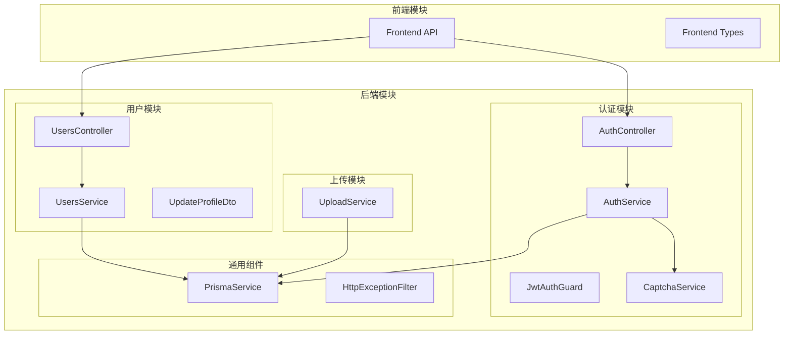

**图表来源**
- [users.controller.ts:1-49](file://backend/src/modules/users/users.controller.ts#L1-L49)
- [users.service.ts:1-102](file://backend/src/modules/users/users.service.ts#L1-L102)
- [auth.service.ts:1-279](file://backend/src/modules/auth/auth.service.ts#L1-L279)

**章节来源**
- [users.controller.ts:1-49](file://backend/src/modules/users/users.controller.ts#L1-L49)
- [users.service.ts:1-102](file://backend/src/modules/users/users.service.ts#L1-L102)
- [schema.prisma:13-31](file://backend/prisma/schema.prisma#L13-L31)

## 核心组件

### 数据模型设计

用户模块基于 Prisma ORM 设计了完整的数据模型，采用 PostgreSQL 作为数据库存储。

#### 用户实体模型

用户模型包含以下关键字段和约束：

| 字段名 | 类型 | 约束 | 描述 |
|--------|------|------|------|
| id | String | 主键, UUID | 用户唯一标识符 |
| phone | String | 唯一索引 | 用户手机号码 |
| password | String | 必填 | 用户密码（加密存储） |
| nickname | String | 默认值: "用户" | 用户昵称 |
| avatarUrl | String | 可选 | 用户头像URL |
| role | UserRole | 默认值: USER | 用户角色（USER/VIP） |
| createdAt | DateTime | 默认值: now() | 创建时间 |
| updatedAt | DateTime | 自动更新 | 更新时间 |

#### 角色枚举定义

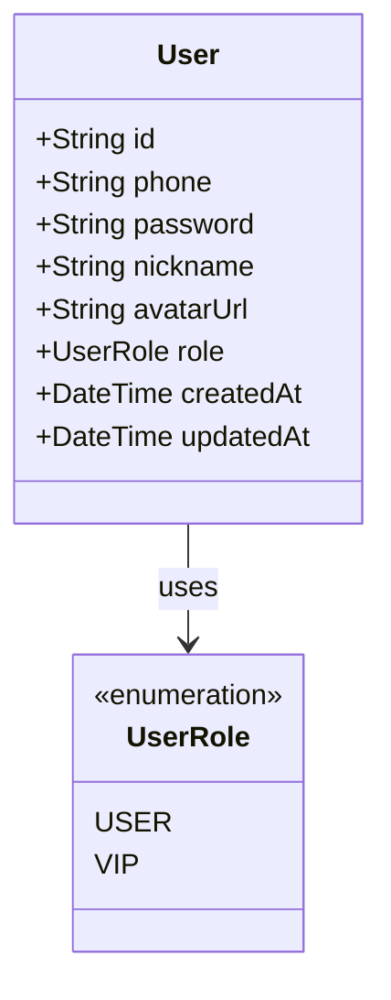

**图表来源**
- [schema.prisma:14-31](file://backend/prisma/schema.prisma#L14-L31)
- [schema.prisma:33-37](file://backend/prisma/schema.prisma#L33-L37)

**章节来源**
- [schema.prisma:13-37](file://backend/prisma/schema.prisma#L13-L37)

### CRUD 操作实现

#### 用户查询操作

用户查询操作通过 `UsersService.findById()` 方法实现，支持以下功能：

1. **精确用户查询**：根据用户ID查询单个用户
2. **关联数据加载**：同时加载用户相关的统计数据
3. **字段选择优化**：只返回必要的字段，避免数据泄露
4. **空值处理**：用户不存在时抛出 `NotFoundException`

#### 用户资料更新

用户资料更新通过 `UsersService.updateProfile()` 方法实现：

1. **部分字段更新**：支持仅更新昵称或头像URL
2. **数据验证**：使用 DTO 进行参数验证
3. **事务保证**：Prisma ORM 提供数据库事务支持
4. **结果返回**：返回更新后的用户信息

**章节来源**
- [users.service.ts:18-44](file://backend/src/modules/users/users.service.ts#L18-L44)
- [users.service.ts:52-68](file://backend/src/modules/users/users.service.ts#L52-L68)

## 架构概览

用户模块采用分层架构设计，确保关注点分离和代码可维护性。

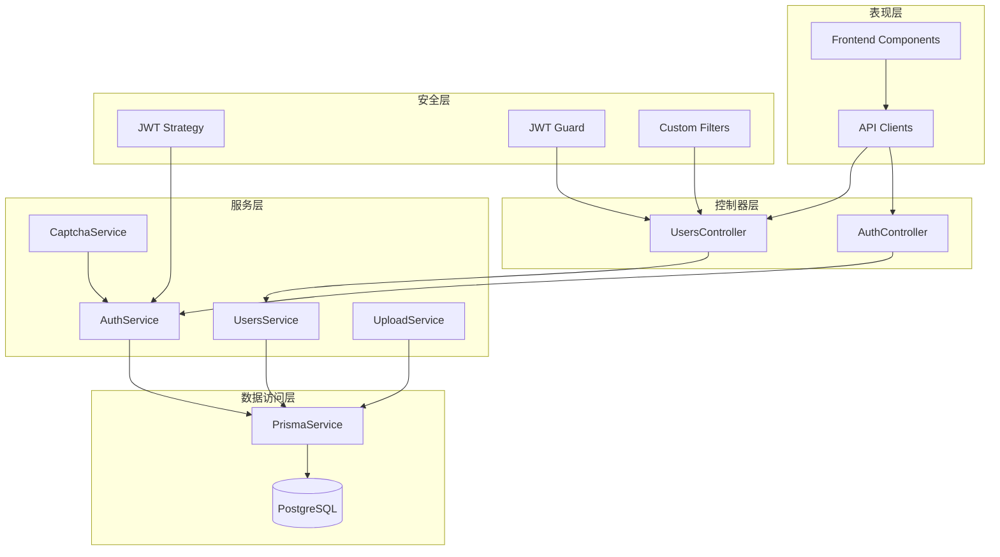

**图表来源**
- [users.controller.ts:1-49](file://backend/src/modules/users/users.controller.ts#L1-L49)
- [users.service.ts:1-102](file://backend/src/modules/users/users.service.ts#L1-L102)
- [auth.service.ts:1-279](file://backend/src/modules/auth/auth.service.ts#L1-L279)
- [jwt-auth.guard.ts:1-22](file://backend/src/common/guards/jwt-auth.guard.ts#L1-L22)

## 详细组件分析

### 用户控制器分析

用户控制器负责处理所有用户相关的HTTP请求，采用装饰器模式实现RESTful API。

#### 控制器架构

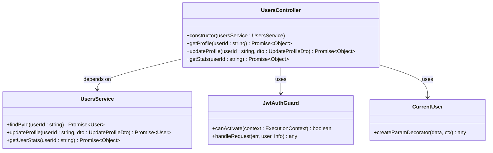

**图表来源**
- [users.controller.ts:16-48](file://backend/src/modules/users/users.controller.ts#L16-L48)
- [users.service.ts:9-11](file://backend/src/modules/users/users.service.ts#L9-L11)
- [jwt-auth.guard.ts:8-21](file://backend/src/common/guards/jwt-auth.guard.ts#L8-L21)
- [current-user.decorator.ts:7-15](file://backend/src/common/decorators/current-user.decorator.ts#L7-L15)

#### API 接口流程

##### 获取用户信息流程

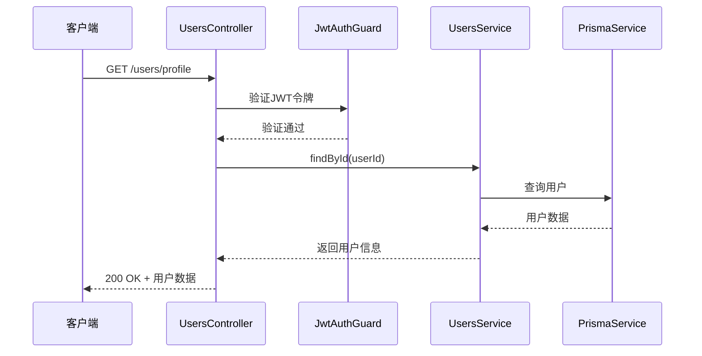

**图表来源**
- [users.controller.ts:22-26](file://backend/src/modules/users/users.controller.ts#L22-L26)
- [users.service.ts:18-44](file://backend/src/modules/users/users.service.ts#L18-L44)

##### 更新用户资料流程

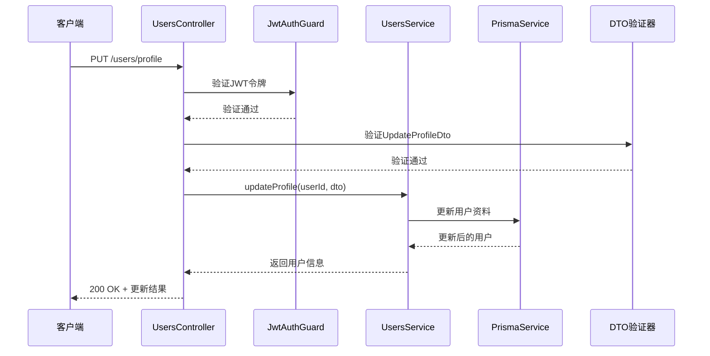

**图表来源**
- [users.controller.ts:31-38](file://backend/src/modules/users/users.controller.ts#L31-L38)
- [users.service.ts:52-68](file://backend/src/modules/users/users.service.ts#L52-L68)
- [update-profile.dto.ts:7-18](file://backend/src/modules/users/dto/update-profile.dto.ts#L7-L18)

**章节来源**
- [users.controller.ts:1-49](file://backend/src/modules/users/users.controller.ts#L1-L49)
- [users.service.ts:1-102](file://backend/src/modules/users/users.service.ts#L1-L102)

### 数据验证规则

用户模块实现了多层次的数据验证机制，确保数据的完整性和安全性。

#### DTO 验证规则

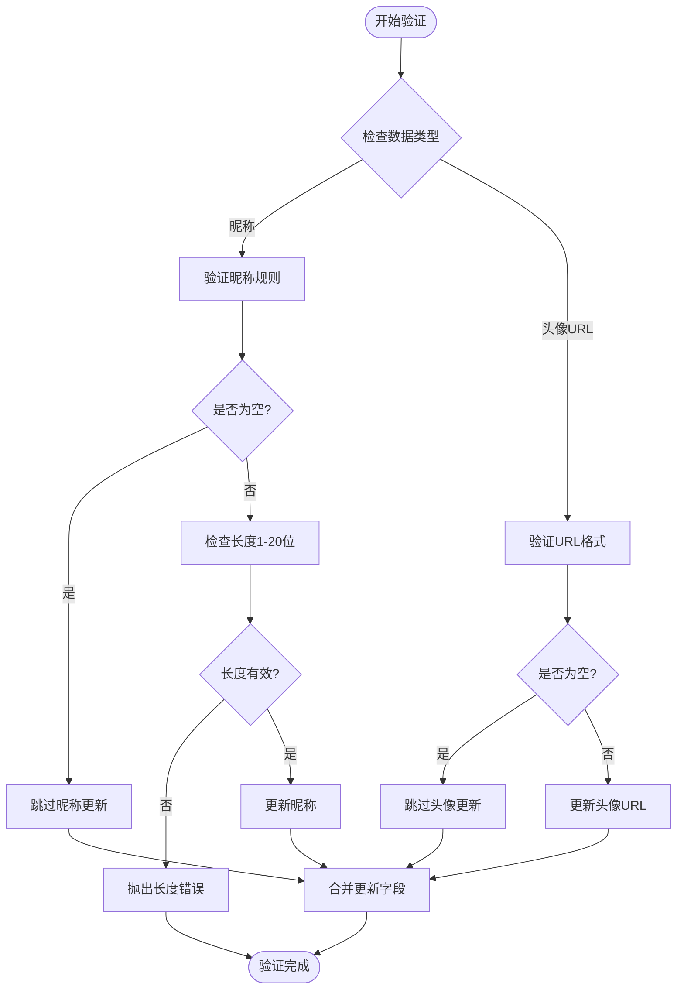

**图表来源**
- [update-profile.dto.ts:8-17](file://backend/src/modules/users/dto/update-profile.dto.ts#L8-L17)

#### 前端数据验证

前端使用 TypeScript 接口定义数据结构，确保类型安全：

| 字段名 | 类型 | 必填 | 描述 |
|--------|------|------|------|
| id | string | 是 | 用户ID |
| phone | string | 是 | 手机号码 |
| nickname | string | 否 | 昵称 |
| avatarUrl | string | 否 | 头像URL |
| role | UserRole | 是 | 用户角色 |
| createdAt | string | 是 | 创建时间 |

**章节来源**
- [update-profile.dto.ts:1-19](file://backend/src/modules/users/dto/update-profile.dto.ts#L1-L19)
- [index.ts:8-16](file://FreeDressApp/src/types/index.ts#L8-L16)

### 权限管理机制

用户模块采用基于 JWT 的权限管理机制，确保API的安全访问。

#### JWT 认证流程

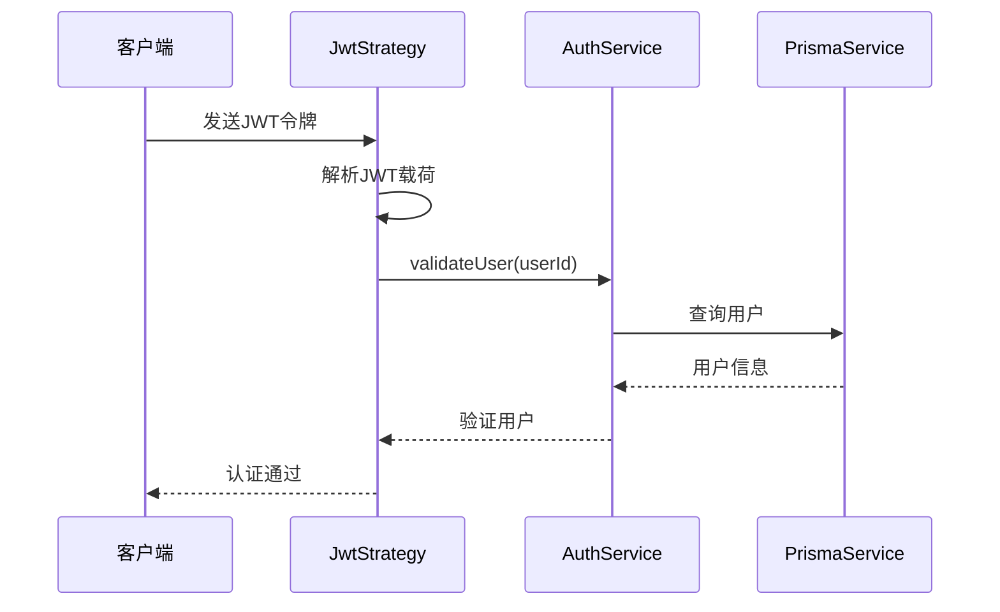

**图表来源**
- [jwt.strategy.ts:28-37](file://backend/src/modules/auth/strategies/jwt.strategy.ts#L28-L37)
- [auth.service.ts:260-277](file://backend/src/modules/auth/auth.service.ts#L260-L277)

#### 认证守卫实现

JWT 守卫提供了统一的认证入口：

| 功能特性 | 实现方式 | 错误处理 |
|----------|----------|----------|
| 令牌提取 | 从Authorization头提取 | 未提供令牌时抛出未授权异常 |
| 令牌验证 | 使用passport-jwt验证 | 验证失败时抛出未授权异常 |
| 用户信息注入 | 将用户信息注入到请求对象 | 通过handleRequest方法处理 |
| 异常转换 | 统一转换为HTTP异常 | 保持一致的错误响应格式 |

**章节来源**
- [jwt-auth.guard.ts:1-22](file://backend/src/common/guards/jwt-auth.guard.ts#L1-L22)
- [jwt.strategy.ts:1-39](file://backend/src/modules/auth/strategies/jwt.strategy.ts#L1-L39)

### 异常处理机制

用户模块实现了统一的异常处理机制，提供一致的错误响应格式。

#### 异常过滤器架构

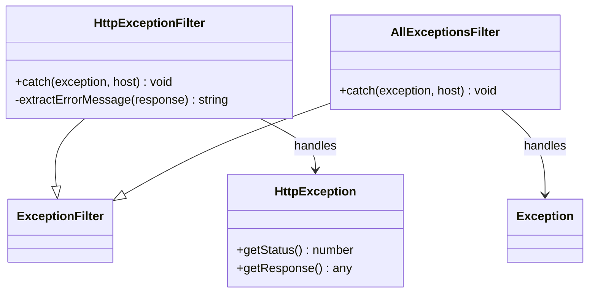

**图表来源**
- [http-exception.filter.ts:8-81](file://backend/src/common/filters/http-exception.filter.ts#L8-L81)

#### 错误响应格式

统一的错误响应包含以下字段：

| 字段名 | 类型 | 描述 |
|--------|------|------|
| code | number | HTTP状态码 |
| message | string | 错误消息 |
| data | null | 错误数据（始终为null） |
| timestamp | string | ISO格式时间戳 |
| path | string | 请求路径 |

**章节来源**
- [http-exception.filter.ts:19-27](file://backend/src/common/filters/http-exception.filter.ts#L19-L27)

### 头像上传功能

用户模块集成了图片上传功能，支持头像的上传和管理。

#### 上传服务实现

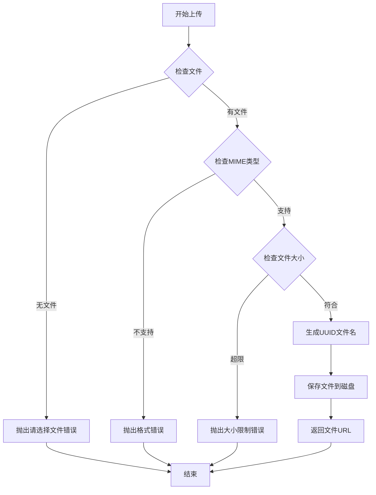

**图表来源**
- [upload.service.ts:25-47](file://backend/src/modules/upload/upload.service.ts#L25-L47)

#### 支持的文件格式

| 格式 | MIME类型 | 文件扩展名 | 大小限制 |
|------|----------|------------|----------|
| JPEG | image/jpeg | .jpg, .jpeg | 10MB |
| PNG | image/png | .png | 10MB |
| WebP | image/webp | .webp | 10MB |
| GIF | image/gif | .gif | 10MB |

**章节来源**
- [upload.service.ts:1-49](file://backend/src/modules/upload/upload.service.ts#L1-L49)

## 依赖关系分析

用户模块与其他模块之间的依赖关系如下：

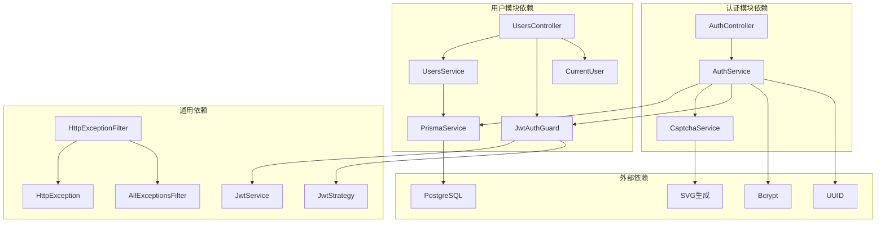

**图表来源**
- [users.controller.ts:1-17](file://backend/src/modules/users/users.controller.ts#L1-L17)
- [users.service.ts:1-11](file://backend/src/modules/users/users.service.ts#L1-L11)
- [auth.service.ts:1-37](file://backend/src/modules/auth/auth.service.ts#L1-L37)

### 数据库关系图

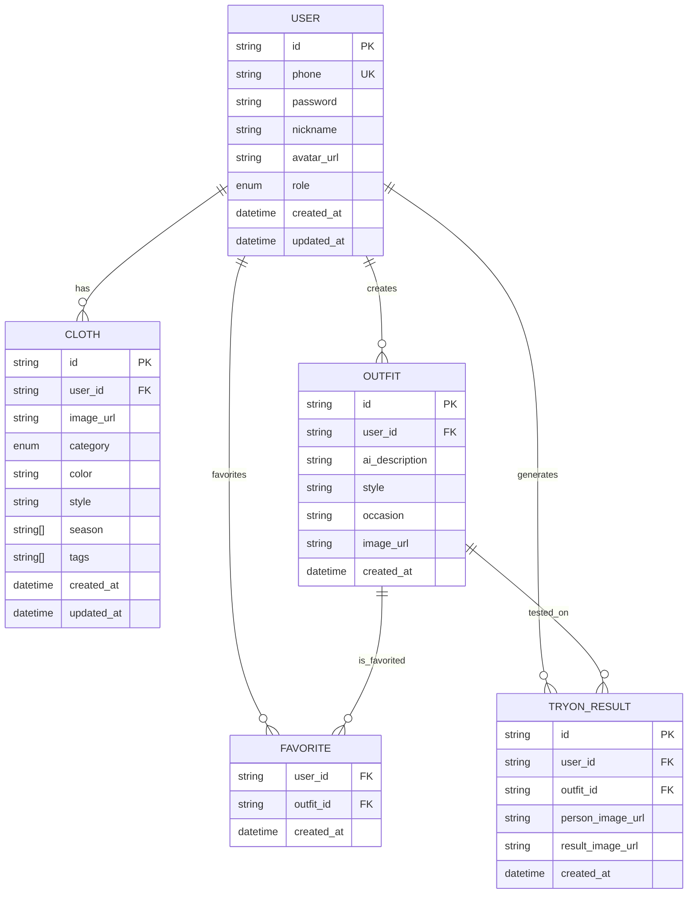

**图表来源**
- [schema.prisma:14-31](file://backend/prisma/schema.prisma#L14-L31)
- [schema.prisma:40-88](file://backend/prisma/schema.prisma#L40-L88)
- [schema.prisma:104-131](file://backend/prisma/schema.prisma#L104-L131)

**章节来源**
- [schema.prisma:1-132](file://backend/prisma/schema.prisma#L1-L132)

## 性能考虑

### 数据库优化

1. **索引策略**
   - 用户表：phone 字段建立唯一索引
   - 衣物表：userId 和 category 字段建立索引
   - 试穿结果表：userId 和 outfitId 字段建立索引

2. **查询优化**
   - 使用 select 语句只返回必要字段
   - 避免 N+1 查询问题
   - 合理使用关联查询

3. **缓存策略**
   - 用户信息可以考虑短期缓存
   - 统计数据可以定期缓存更新

### API 性能优化

1. **响应时间优化**
   - 减少不必要的数据库查询
   - 使用批量操作处理多个更新
   - 实现适当的分页机制

2. **并发处理**
   - 使用异步操作处理I/O密集型任务
   - 实现合理的连接池配置
   - 避免阻塞主线程的操作

### 内存管理

1. **文件上传优化**
   - 实现文件大小限制
   - 使用流式处理大文件
   - 及时清理临时文件

2. **内存泄漏防护**
   - 正确管理定时器和监听器
   - 及时释放数据库连接
   - 监控内存使用情况

## 故障排除指南

### 常见问题及解决方案

#### 认证相关问题

| 问题症状 | 可能原因 | 解决方案 |
|----------|----------|----------|
| 401 未授权 | JWT令牌过期或无效 | 重新登录获取新令牌 |
| 403 禁止访问 | 用户权限不足 | 检查用户角色和权限 |
| 令牌验证失败 | JWT密钥配置错误 | 检查环境变量配置 |

#### 数据验证错误

| 错误类型 | 触发条件 | 解决方案 |
|----------|----------|----------|
| 昵称长度错误 | 昵称长度不在1-20位 | 调整昵称长度 |
| 头像URL格式错误 | 非字符串类型 | 提供有效的URL字符串 |
| 手机号格式错误 | 非法手机号格式 | 使用正确的手机号格式 |

#### 数据库连接问题

| 问题现象 | 可能原因 | 处理方法 |
|----------|----------|----------|
| 连接超时 | 数据库负载过高 | 优化查询或增加连接数 |
| 连接池耗尽 | 未正确关闭数据库连接 | 检查代码中的连接管理 |
| 查询性能差 | 缺少必要索引 | 添加适当的数据库索引 |

**章节来源**
- [http-exception.filter.ts:50-81](file://backend/src/common/filters/http-exception.filter.ts#L50-L81)
- [jwt-auth.guard.ts:14-20](file://backend/src/common/guards/jwt-auth.guard.ts#L14-L20)

### 调试技巧

1. **开发环境调试**
   - 启用详细的错误堆栈输出
   - 使用日志记录关键操作
   - 实现断点调试用户认证流程

2. **生产环境监控**
   - 监控API响应时间和错误率
   - 设置告警阈值
   - 定期备份数据库

## 结论

用户模块作为 FreeDress 应用的核心功能模块，展现了良好的架构设计和实现质量。模块采用了现代化的开发实践，包括：

1. **清晰的分层架构**：控制器、服务、数据访问层职责明确
2. **完善的认证机制**：基于JWT的认证和授权系统
3. **严格的数据验证**：前后端双重验证确保数据完整性
4. **统一的异常处理**：提供一致的错误响应格式
5. **可扩展的设计**：模块化结构便于功能扩展

该模块为整个应用提供了稳定可靠的用户管理基础，支持后续的功能扩展和性能优化。

## 附录

### API 文档

#### 用户信息接口

| 接口 | 方法 | 路径 | 认证 | 功能描述 |
|------|------|------|------|----------|
| 获取用户信息 | GET | /users/profile | 是 | 获取当前登录用户的详细信息 |
| 更新用户资料 | PUT | /users/profile | 是 | 更新当前用户的昵称和头像 |
| 获取用户统计 | GET | /users/stats | 是 | 获取用户的衣物、搭配等统计数据 |

#### 认证相关接口

| 接口 | 方法 | 路径 | 认证 | 功能描述 |
|------|------|------|------|----------|
| 用户注册 | POST | /auth/register | 否 | 用户注册（需验证码） |
| 用户登录 | POST | /auth/login | 否 | 用户登录获取令牌 |
| 获取验证码 | GET | /auth/captcha | 否 | 获取图片验证码 |
| 忘记密码 | POST | /auth/forgot-password | 否 | 忘记密码流程 |
| 重置密码 | POST | /auth/reset-password | 否 | 重置用户密码 |

### 安全最佳实践

1. **密码安全**
   - 使用 bcrypt 进行密码哈希
   - 实施密码强度要求
   - 定期轮换加密密钥

2. **令牌管理**
   - 设置合理的令牌过期时间
   - 实现刷新令牌机制
   - 监控令牌使用情况

3. **数据保护**
   - 实施最小权限原则
   - 加密敏感数据传输
   - 定期备份重要数据

### 性能优化建议

1. **数据库层面**
   - 为常用查询字段添加索引
   - 实现查询结果缓存
   - 优化复杂查询语句

2. **应用层面**
   - 实现异步处理机制
   - 优化静态资源加载
   - 实施合理的并发控制

3. **基础设施**
   - 使用CDN加速静态资源
   - 实施负载均衡
   - 监控系统性能指标