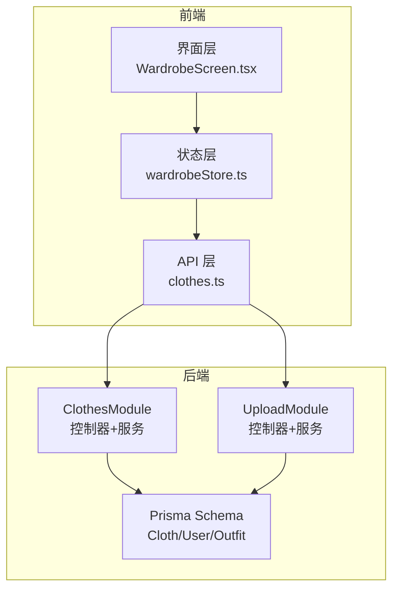
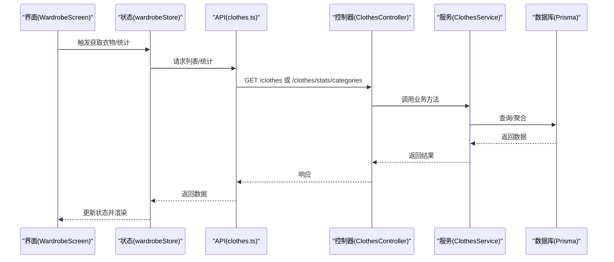
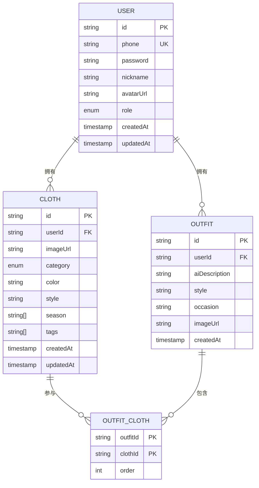
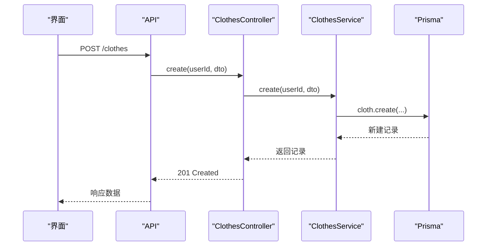
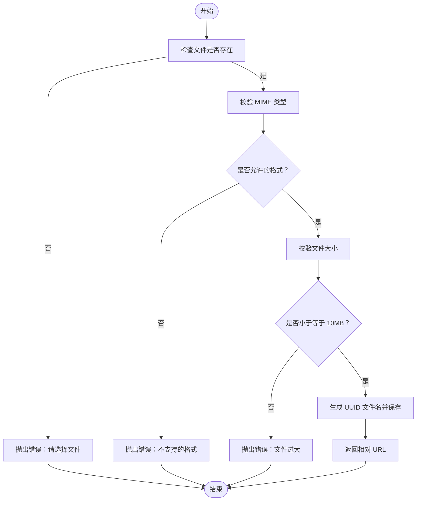
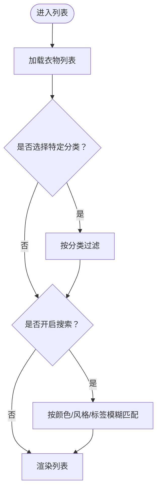
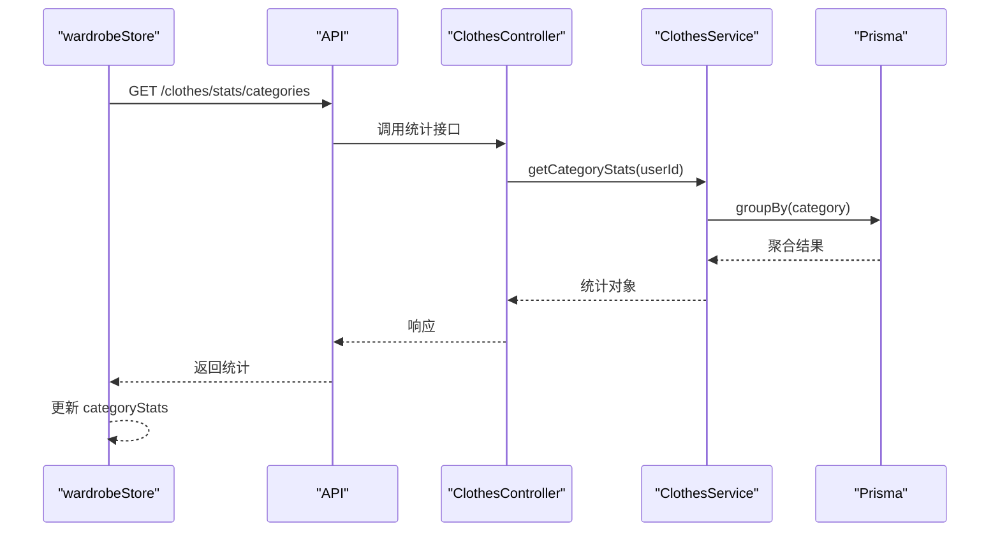
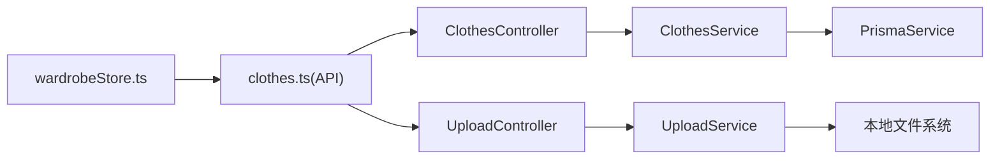

# 衣物模块

<cite>
**本文档引用的文件**
- [backend/src/modules/clothes/clothes.service.ts](file://backend/src/modules/clothes/clothes.service.ts)
- [backend/src/modules/clothes/clothes.controller.ts](file://backend/src/modules/clothes/clothes.controller.ts)
- [backend/src/modules/clothes/dto/create-cloth.dto.ts](file://backend/src/modules/clothes/dto/create-cloth.dto.ts)
- [backend/src/modules/clothes/dto/update-cloth.dto.ts](file://backend/src/modules/clothes/dto/update-cloth.dto.ts)
- [backend/src/modules/clothes/clothes.module.ts](file://backend/src/modules/clothes/clothes.module.ts)
- [backend/prisma/schema.prisma](file://backend/prisma/schema.prisma)
- [backend/src/modules/upload/upload.service.ts](file://backend/src/modules/upload/upload.service.ts)
- [backend/src/modules/upload/upload.controller.ts](file://backend/src/modules/upload/upload.controller.ts)
- [backend/src/modules/upload/upload.module.ts](file://backend/src/modules/upload/upload.module.ts)
- [FreeDressApp/src/api/clothes.ts](file://FreeDressApp/src/api/clothes.ts)
- [FreeDressApp/src/store/wardrobeStore.ts](file://FreeDressApp/src/store/wardrobeStore.ts)
- [FreeDressApp/src/screens/WardrobeScreen.tsx](file://FreeDressApp/src/screens/WardrobeScreen.tsx)
- [FreeDressApp/src/types/index.ts](file://FreeDressApp/src/types/index.ts)
</cite>

## 目录
1. [简介](#简介)
2. [项目结构](#项目结构)
3. [核心组件](#核心组件)
4. [架构总览](#架构总览)
5. [详细组件分析](#详细组件分析)
6. [依赖分析](#依赖分析)
7. [性能考虑](#性能考虑)
8. [故障排查指南](#故障排查指南)
9. [结论](#结论)
10. [附录](#附录)

## 简介
本文件系统性梳理衣物模块的技术实现，覆盖数据模型设计、分类体系与属性定义、增删改查流程、图片上传处理、搜索过滤、分类统计与前端交互。文档以代码为依据，结合架构图与流程图，帮助开发者快速理解与扩展衣物模块。

## 项目结构
衣物模块由后端 NestJS 模块与前端 React Native Store/API 层组成，配合 Prisma 数据模型与本地文件上传服务协同工作。

图表来源
- [backend/src/modules/clothes/clothes.module.ts:1-15](file://backend/src/modules/clothes/clothes.module.ts#L1-L15)
- [backend/src/modules/upload/upload.module.ts:1-11](file://backend/src/modules/upload/upload.module.ts#L1-L11)
- [backend/prisma/schema.prisma:39-59](file://backend/prisma/schema.prisma#L39-L59)
- [FreeDressApp/src/api/clothes.ts:1-54](file://FreeDressApp/src/api/clothes.ts#L1-L54)
- [FreeDressApp/src/store/wardrobeStore.ts:1-83](file://FreeDressApp/src/store/wardrobeStore.ts#L1-L83)
- [FreeDressApp/src/screens/WardrobeScreen.tsx:1-423](file://FreeDressApp/src/screens/WardrobeScreen.tsx#L1-L423)

章节来源
- [backend/src/modules/clothes/clothes.module.ts:1-15](file://backend/src/modules/clothes/clothes.module.ts#L1-L15)
- [backend/src/modules/upload/upload.module.ts:1-11](file://backend/src/modules/upload/upload.module.ts#L1-L11)
- [backend/prisma/schema.prisma:1-132](file://backend/prisma/schema.prisma#L1-L132)
- [FreeDressApp/src/api/clothes.ts:1-54](file://FreeDressApp/src/api/clothes.ts#L1-L54)
- [FreeDressApp/src/store/wardrobeStore.ts:1-83](file://FreeDressApp/src/store/wardrobeStore.ts#L1-L83)
- [FreeDressApp/src/screens/WardrobeScreen.tsx:1-423](file://FreeDressApp/src/screens/WardrobeScreen.tsx#L1-L423)

## 核心组件
- 数据模型与分类
  - 衣物模型包含基础属性：图片URL、分类、颜色、风格、适用季节数组、标签数组；并具备创建/更新时间戳。
  - 分类枚举：TOP、BOTTOM、COAT、ACCESSORY、SHOE。
- 控制器与服务
  - 衣物控制器提供创建、查询列表、详情、更新、删除、分类统计接口。
  - 服务层封装业务逻辑，含权限校验、分类统计聚合。
- 上传模块
  - 提供图片上传接口，限制格式与大小，保存至本地 uploads 目录并返回相对路径。
- 前端 API 与状态
  - API 封装衣物 CRUD 与统计接口。
  - Store 管理衣物列表、分类统计、加载状态与活动分类。
  - 界面层实现分类筛选、搜索过滤、长按删除、下拉刷新等交互。

章节来源
- [backend/prisma/schema.prisma:39-68](file://backend/prisma/schema.prisma#L39-L68)
- [backend/src/modules/clothes/clothes.controller.ts:1-102](file://backend/src/modules/clothes/clothes.controller.ts#L1-L102)
- [backend/src/modules/clothes/clothes.service.ts:1-148](file://backend/src/modules/clothes/clothes.service.ts#L1-L148)
- [backend/src/modules/upload/upload.controller.ts:1-51](file://backend/src/modules/upload/upload.controller.ts#L1-L51)
- [backend/src/modules/upload/upload.service.ts:1-49](file://backend/src/modules/upload/upload.service.ts#L1-L49)
- [FreeDressApp/src/api/clothes.ts:1-54](file://FreeDressApp/src/api/clothes.ts#L1-L54)
- [FreeDressApp/src/store/wardrobeStore.ts:1-83](file://FreeDressApp/src/store/wardrobeStore.ts#L1-L83)
- [FreeDressApp/src/types/index.ts:18-33](file://FreeDressApp/src/types/index.ts#L18-L33)

## 架构总览
衣物模块采用分层架构：前端通过 API 层调用后端控制器，控制器委托服务层执行业务逻辑，服务层通过 Prisma 访问数据库；图片上传独立模块，返回可直接使用的图片 URL。

图表来源
- [FreeDressApp/src/screens/WardrobeScreen.tsx:1-423](file://FreeDressApp/src/screens/WardrobeScreen.tsx#L1-L423)
- [FreeDressApp/src/store/wardrobeStore.ts:1-83](file://FreeDressApp/src/store/wardrobeStore.ts#L1-L83)
- [FreeDressApp/src/api/clothes.ts:1-54](file://FreeDressApp/src/api/clothes.ts#L1-L54)
- [backend/src/modules/clothes/clothes.controller.ts:1-102](file://backend/src/modules/clothes/clothes.controller.ts#L1-L102)
- [backend/src/modules/clothes/clothes.service.ts:1-148](file://backend/src/modules/clothes/clothes.service.ts#L1-L148)
- [backend/prisma/schema.prisma:39-59](file://backend/prisma/schema.prisma#L39-L59)

## 详细组件分析

### 数据模型与分类体系
- 模型字段
  - 基础字段：id、userId、imageUrl、category、color、style、season[]、tags[]、createdAt、updatedAt。
  - 关系：Cloth -> User（外键 userId），Cloth <-> Outfit（多对多通过 OutfitCloth）。
- 分类枚举
  - TOP、BOTTOM、COAT、ACCESSORY、SHOE。
- 索引
  - 对 userId、category 建有索引，提升查询与分组统计效率。

图表来源
- [backend/prisma/schema.prisma:14-59](file://backend/prisma/schema.prisma#L14-L59)

章节来源
- [backend/prisma/schema.prisma:39-68](file://backend/prisma/schema.prisma#L39-L68)
- [backend/prisma/schema.prisma:52-58](file://backend/prisma/schema.prisma#L52-L58)

### 增删改查实现逻辑
- 创建衣物
  - 前端提交 CreateClothData，后端使用 CreateClothDto 校验，服务层写入数据库并返回。
- 列表查询
  - 支持按分类筛选，按创建时间倒序返回。
- 详情查询
  - 校验资源归属（userId），否则抛出权限异常。
- 更新与删除
  - 更新前先校验归属，删除前同样校验，确保数据安全。
- 权限控制
  - 所有接口均需 JWT 认证，控制器使用守卫进行鉴权。

图表来源
- [backend/src/modules/clothes/clothes.controller.ts:34-41](file://backend/src/modules/clothes/clothes.controller.ts#L34-L41)
- [backend/src/modules/clothes/clothes.service.ts:21-30](file://backend/src/modules/clothes/clothes.service.ts#L21-L30)
- [backend/src/modules/clothes/dto/create-cloth.dto.ts:8-42](file://backend/src/modules/clothes/dto/create-cloth.dto.ts#L8-L42)

章节来源
- [backend/src/modules/clothes/clothes.controller.ts:31-100](file://backend/src/modules/clothes/clothes.controller.ts#L31-L100)
- [backend/src/modules/clothes/clothes.service.ts:15-116](file://backend/src/modules/clothes/clothes.service.ts#L15-L116)
- [backend/src/modules/clothes/dto/create-cloth.dto.ts:8-42](file://backend/src/modules/clothes/dto/create-cloth.dto.ts#L8-L42)
- [backend/src/modules/clothes/dto/update-cloth.dto.ts:1-9](file://backend/src/modules/clothes/dto/update-cloth.dto.ts#L1-L9)

### 图片上传处理
- 接口与拦截器
  - 上传接口使用文件拦截器接收二进制流。
- 校验规则
  - 仅允许 JPG/PNG/WebP/GIF；单文件不超过 10MB。
- 存储策略
  - 保存在服务端 uploads 目录，文件名使用 UUID，返回相对路径（如 /uploads/{filename}）。
- 前端集成
  - 前端将图片 URL 写入衣物的 imageUrl 字段，后续展示与统计均基于该 URL。

图表来源
- [backend/src/modules/upload/upload.service.ts:25-47](file://backend/src/modules/upload/upload.service.ts#L25-L47)
- [backend/src/modules/upload/upload.controller.ts:33-49](file://backend/src/modules/upload/upload.controller.ts#L33-L49)

章节来源
- [backend/src/modules/upload/upload.controller.ts:1-51](file://backend/src/modules/upload/upload.controller.ts#L1-L51)
- [backend/src/modules/upload/upload.service.ts:1-49](file://backend/src/modules/upload/upload.service.ts#L1-L49)

### 搜索与过滤
- 前端搜索
  - 在 WardrobeScreen 中实现：当打开搜索时，输入框实时过滤衣物列表，匹配颜色、风格或标签任一字段。
- 后端筛选
  - 列表接口支持 category 查询参数，服务层动态拼接 where 条件。
- 过滤流程

图表来源
- [FreeDressApp/src/screens/WardrobeScreen.tsx:61-76](file://FreeDressApp/src/screens/WardrobeScreen.tsx#L61-L76)
- [FreeDressApp/src/api/clothes.ts:34-37](file://FreeDressApp/src/api/clothes.ts#L34-L37)
- [backend/src/modules/clothes/clothes.controller.ts:46-54](file://backend/src/modules/clothes/clothes.controller.ts#L46-L54)
- [backend/src/modules/clothes/clothes.service.ts:38-51](file://backend/src/modules/clothes/clothes.service.ts#L38-L51)

章节来源
- [FreeDressApp/src/screens/WardrobeScreen.tsx:56-90](file://FreeDressApp/src/screens/WardrobeScreen.tsx#L56-L90)
- [FreeDressApp/src/api/clothes.ts:34-37](file://FreeDressApp/src/api/clothes.ts#L34-L37)
- [backend/src/modules/clothes/clothes.controller.ts:46-54](file://backend/src/modules/clothes/clothes.controller.ts#L46-L54)
- [backend/src/modules/clothes/clothes.service.ts:38-51](file://backend/src/modules/clothes/clothes.service.ts#L38-L51)

### 分类统计与高级功能
- 分类统计
  - 服务层使用 groupBy 按分类统计数量，返回 TOP/BOTTOM/COAT/ACCESSORY/SHOE 的计数对象。
- 前端展示
  - Store 调用统计接口并更新状态，界面根据分类标签显示对应数量。
- 批量操作
  - 当前接口未提供后端批量删除/更新；前端可通过循环调用单个接口实现批量效果（建议在业务需要时扩展后端批量接口）。

图表来源
- [FreeDressApp/src/store/wardrobeStore.ts:55-62](file://FreeDressApp/src/store/wardrobeStore.ts#L55-L62)
- [FreeDressApp/src/api/clothes.ts:51-53](file://FreeDressApp/src/api/clothes.ts#L51-L53)
- [backend/src/modules/clothes/clothes.controller.ts:96-100](file://backend/src/modules/clothes/clothes.controller.ts#L96-L100)
- [backend/src/modules/clothes/clothes.service.ts:123-146](file://backend/src/modules/clothes/clothes.service.ts#L123-L146)

章节来源
- [backend/src/modules/clothes/clothes.service.ts:118-146](file://backend/src/modules/clothes/clothes.service.ts#L118-L146)
- [backend/src/modules/clothes/clothes.controller.ts:93-100](file://backend/src/modules/clothes/clothes.controller.ts#L93-L100)
- [FreeDressApp/src/store/wardrobeStore.ts:55-62](file://FreeDressApp/src/store/wardrobeStore.ts#L55-L62)
- [FreeDressApp/src/api/clothes.ts:51-53](file://FreeDressApp/src/api/clothes.ts#L51-L53)

### 数据验证规则
- DTO 校验
  - CreateClothDto：imageUrl 必填且为字符串；category 枚举必填；color/style 可选字符串；season/tags 可选数组。
  - UpdateClothDto 继承自 CreateClothDto，所有字段可选。
- 上传校验
  - 格式限制与大小限制在上传服务中统一校验。

章节来源
- [backend/src/modules/clothes/dto/create-cloth.dto.ts:8-42](file://backend/src/modules/clothes/dto/create-cloth.dto.ts#L8-L42)
- [backend/src/modules/clothes/dto/update-cloth.dto.ts:1-9](file://backend/src/modules/clothes/dto/update-cloth.dto.ts#L1-L9)
- [backend/src/modules/upload/upload.service.ts:30-38](file://backend/src/modules/upload/upload.service.ts#L30-L38)

### 文件存储策略
- 本地存储
  - 服务端 uploads 目录存放图片，文件名为 UUID，扩展名保留原文件扩展名。
- URL 规范
  - 返回相对路径（如 /uploads/{filename}），便于前端直接渲染与 CDN 替换。
- 安全与清理
  - 建议增加定时清理过期文件与访问鉴权策略（当前实现未包含鉴权中间件）。

章节来源
- [backend/src/modules/upload/upload.service.ts:17-47](file://backend/src/modules/upload/upload.service.ts#L17-L47)

## 依赖分析
- 模块耦合
  - ClothesModule 仅依赖 PrismaService 与 DTO，职责清晰。
  - UploadModule 独立于衣物业务，便于扩展与替换存储后端。
- 外部依赖
  - 前端依赖 axios 进行网络请求，Store 通过 API 封装调用控制器。
- 可能的循环依赖
  - 当前模块间无循环导入，结构清晰。

图表来源
- [FreeDressApp/src/store/wardrobeStore.ts:1-83](file://FreeDressApp/src/store/wardrobeStore.ts#L1-L83)
- [FreeDressApp/src/api/clothes.ts:1-54](file://FreeDressApp/src/api/clothes.ts#L1-L54)
- [backend/src/modules/clothes/clothes.controller.ts:1-102](file://backend/src/modules/clothes/clothes.controller.ts#L1-L102)
- [backend/src/modules/clothes/clothes.service.ts:1-148](file://backend/src/modules/clothes/clothes.service.ts#L1-L148)
- [backend/src/modules/upload/upload.controller.ts:1-51](file://backend/src/modules/upload/upload.controller.ts#L1-L51)
- [backend/src/modules/upload/upload.service.ts:1-49](file://backend/src/modules/upload/upload.service.ts#L1-L49)

章节来源
- [backend/src/modules/clothes/clothes.module.ts:1-15](file://backend/src/modules/clothes/clothes.module.ts#L1-L15)
- [backend/src/modules/upload/upload.module.ts:1-11](file://backend/src/modules/upload/upload.module.ts#L1-L11)
- [FreeDressApp/src/store/wardrobeStore.ts:1-83](file://FreeDressApp/src/store/wardrobeStore.ts#L1-L83)

## 性能考虑
- 查询优化
  - 已对 userId、category 建有索引，建议在高频查询场景下保持索引命中。
- 分页与懒加载
  - 当前列表按创建时间倒序返回，未实现分页；建议在数据量增大时引入分页或虚拟列表。
- 缓存机制
  - 当前未实现缓存；可在 Store 层或网关层引入轻量缓存（如内存缓存/Redis）以减少重复请求。
- 图片优化
  - 建议在上传后生成多尺寸缩略图并缓存，前端按需加载，降低带宽与渲染压力。
- 并发与重试
  - Store 层已做基础错误捕获；建议在网络层增加指数退避重试与去抖动策略。

## 故障排查指南
- 常见错误与定位
  - 401/403：确认 JWT 令牌有效与用户身份正确。
  - 404：确认衣物 ID 存在且属于当前用户。
  - 400：检查 DTO 校验（如分类枚举、数组格式、必填项）。
  - 上传失败：检查文件格式与大小限制。
- 前端调试
  - Store 中已打印错误日志，检查网络请求与状态更新。
- 后端调试
  - 在服务层与控制器中增加日志输出，定位具体环节。

章节来源
- [backend/src/modules/clothes/clothes.service.ts:71-78](file://backend/src/modules/clothes/clothes.service.ts#L71-L78)
- [backend/src/modules/upload/upload.service.ts:26-38](file://backend/src/modules/upload/upload.service.ts#L26-L38)
- [FreeDressApp/src/store/wardrobeStore.ts:48-50](file://FreeDressApp/src/store/wardrobeStore.ts#L48-L50)

## 结论
衣物模块以清晰的数据模型与分层架构为基础，实现了从创建、查询、更新、删除到分类统计的完整闭环；图片上传采用本地存储并提供基础校验。建议后续在前端引入缓存与分页、在后端扩展批量接口与鉴权中间件，并完善图片多尺寸与 CDN 策略以进一步提升性能与可维护性。

## 附录
- 类型定义参考
  - 衣物分类与实体类型定义参见全局类型文件。
- API 接口清单
  - 衣物：POST/GET/GET/:id/PUT/:id/DELETE/:id
  - 统计：GET /clothes/stats/categories
  - 上传：POST /upload/image

章节来源
- [FreeDressApp/src/types/index.ts:18-33](file://FreeDressApp/src/types/index.ts#L18-L33)
- [FreeDressApp/src/api/clothes.ts:30-53](file://FreeDressApp/src/api/clothes.ts#L30-L53)
- [backend/src/modules/clothes/clothes.controller.ts:34-100](file://backend/src/modules/clothes/clothes.controller.ts#L34-L100)
- [backend/src/modules/upload/upload.controller.ts:33-49](file://backend/src/modules/upload/upload.controller.ts#L33-L49)