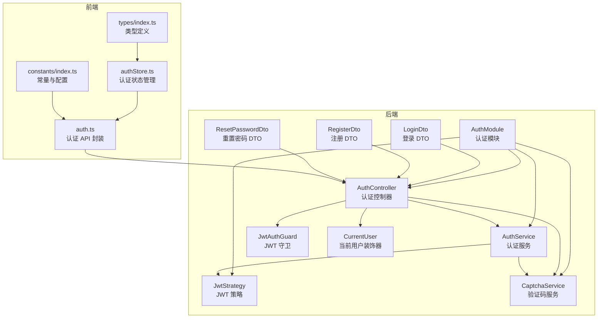
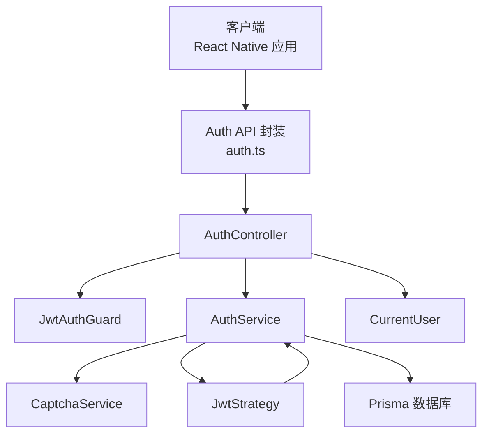
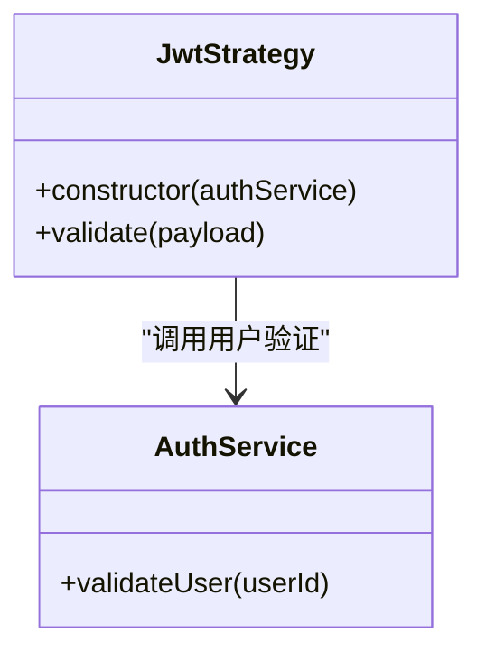
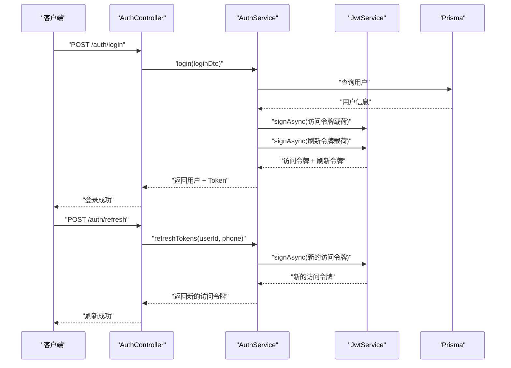
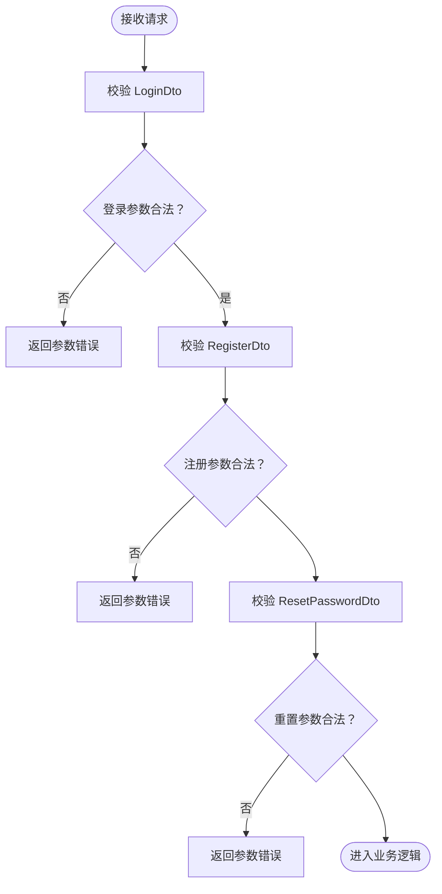
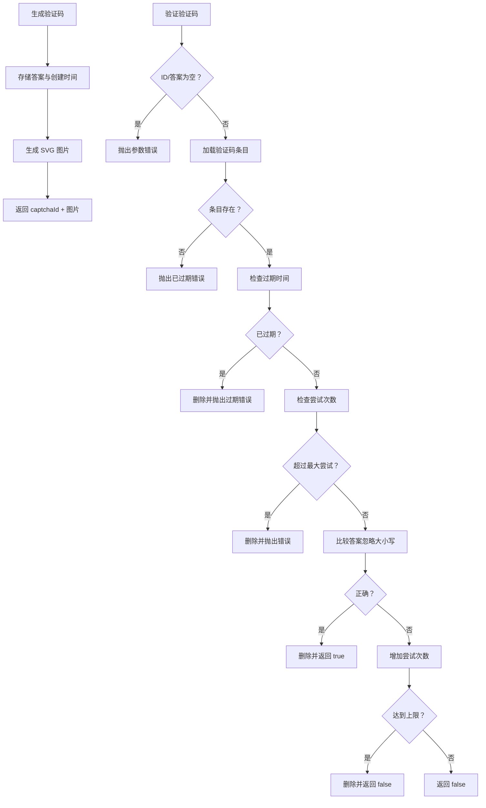
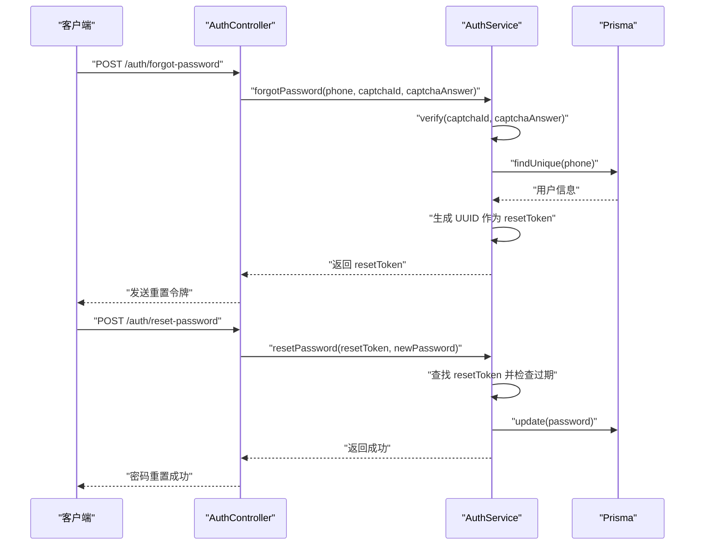
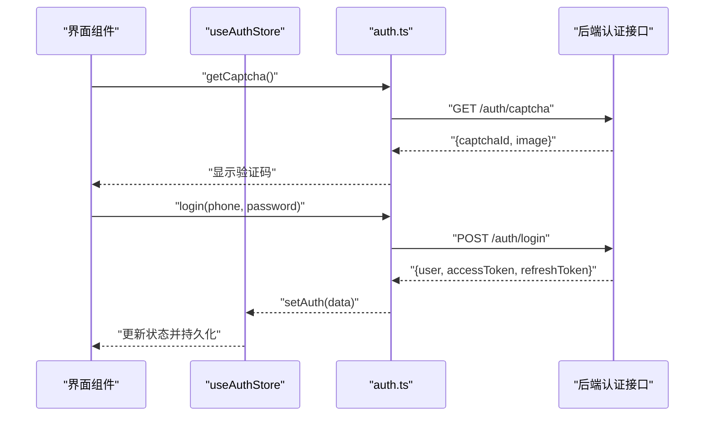
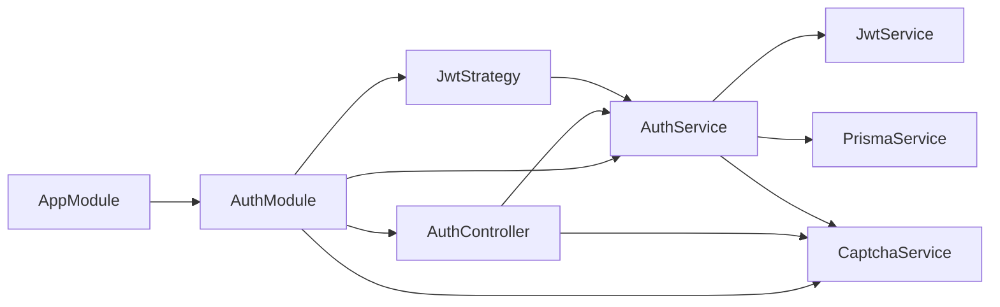

# 认证模块

<cite>
**本文档引用的文件**
- [backend/src/modules/auth/auth.module.ts](file://backend/src/modules/auth/auth.module.ts)
- [backend/src/modules/auth/auth.service.ts](file://backend/src/modules/auth/auth.service.ts)
- [backend/src/modules/auth/auth.controller.ts](file://backend/src/modules/auth/auth.controller.ts)
- [backend/src/modules/auth/strategies/jwt.strategy.ts](file://backend/src/modules/auth/strategies/jwt.strategy.ts)
- [backend/src/modules/auth/captcha.service.ts](file://backend/src/modules/auth/captcha.service.ts)
- [backend/src/modules/auth/dto/login.dto.ts](file://backend/src/modules/auth/dto/login.dto.ts)
- [backend/src/modules/auth/dto/register.dto.ts](file://backend/src/modules/auth/dto/register.dto.ts)
- [backend/src/modules/auth/dto/reset-password.dto.ts](file://backend/src/modules/auth/dto/reset-password.dto.ts)
- [backend/src/common/guards/jwt-auth.guard.ts](file://backend/src/common/guards/jwt-auth.guard.ts)
- [backend/src/common/decorators/current-user.decorator.ts](file://backend/src/common/decorators/current-user.decorator.ts)
- [backend/src/app.module.ts](file://backend/src/app.module.ts)
- [backend/src/main.ts](file://backend/src/main.ts)
- [FreeDressApp/src/api/auth.ts](file://FreeDressApp/src/api/auth.ts)
- [FreeDressApp/src/store/authStore.ts](file://FreeDressApp/src/store/authStore.ts)
- [FreeDressApp/src/types/index.ts](file://FreeDressApp/src/types/index.ts)
- [FreeDressApp/src/constants/index.ts](file://FreeDressApp/src/constants/index.ts)
</cite>

## 目录
1. [简介](#简介)
2. [项目结构](#项目结构)
3. [核心组件](#核心组件)
4. [架构总览](#架构总览)
5. [详细组件分析](#详细组件分析)
6. [依赖关系分析](#依赖关系分析)
7. [性能考虑](#性能考虑)
8. [故障排除指南](#故障排除指南)
9. [结论](#结论)
10. [附录](#附录)

## 简介
本文件系统性解析 FreeDress 项目的认证模块，涵盖以下关键主题：
- JWT 认证机制的实现原理：策略配置、Passport 集成、Token 生成与验证流程
- 登录注册 DTO 的数据验证规则
- 验证码服务的安全机制（防自动化、限流、过期控制）
- JWT 策略的用户身份解析过程
- 完整的认证流程时序图、错误处理策略与安全最佳实践
- 具体的 API 接口调用示例与客户端集成指南

## 项目结构
认证模块位于后端 NestJS 工程中，采用按功能域划分的模块化组织方式。前端 React Native 应用通过独立的 API 层与后端交互。

图表来源
- [backend/src/modules/auth/auth.module.ts:13-29](file://backend/src/modules/auth/auth.module.ts#L13-L29)
- [backend/src/modules/auth/auth.controller.ts:17-22](file://backend/src/modules/auth/auth.controller.ts#L17-L22)
- [backend/src/modules/auth/auth.service.ts:24-37](file://backend/src/modules/auth/auth.service.ts#L24-L37)
- [backend/src/modules/auth/strategies/jwt.strategy.ts:11-21](file://backend/src/modules/auth/strategies/jwt.strategy.ts#L11-L21)
- [backend/src/modules/auth/captcha.service.ts:31-51](file://backend/src/modules/auth/captcha.service.ts#L31-L51)
- [backend/src/common/guards/jwt-auth.guard.ts:9-21](file://backend/src/common/guards/jwt-auth.guard.ts#L9-L21)
- [backend/src/common/decorators/current-user.decorator.ts:7-15](file://backend/src/common/decorators/current-user.decorator.ts#L7-L15)
- [FreeDressApp/src/api/auth.ts:12-100](file://FreeDressApp/src/api/auth.ts#L12-L100)
- [FreeDressApp/src/store/authStore.ts:28-122](file://FreeDressApp/src/store/authStore.ts#L28-L122)
- [FreeDressApp/src/types/index.ts:59-71](file://FreeDressApp/src/types/index.ts#L59-L71)
- [FreeDressApp/src/constants/index.ts:9-205](file://FreeDressApp/src/constants/index.ts#L9-L205)

章节来源
- [backend/src/modules/auth/auth.module.ts:1-30](file://backend/src/modules/auth/auth.module.ts#L1-L30)
- [backend/src/app.module.ts:13-32](file://backend/src/app.module.ts#L13-L32)
- [backend/src/main.ts:12-62](file://backend/src/main.ts#L12-L62)

## 核心组件
- 认证模块（AuthModule）：负责注册 Passport 默认策略、配置 JWT 模块、导出认证相关服务与策略
- 认证控制器（AuthController）：暴露认证相关 API，如获取验证码、注册、登录、忘记密码、重置密码、刷新 Token、获取当前用户信息
- 认证服务（AuthService）：实现业务逻辑，包括用户注册（含验证码校验）、登录、Token 生成（访问令牌与刷新令牌）、忘记密码与重置密码、用户验证
- JWT 策略（JwtStrategy）：基于 Passport-JWT 实现，从请求头提取 Bearer Token，验证签名与过期时间，并通过 AuthService 校验用户存在性
- 验证码服务（CaptchaService）：生成带噪声干扰的 SVG 验证码，内存存储答案与尝试次数，支持过期清理、最大尝试次数限制与 IP 限流
- DTO（数据传输对象）：LoginDto、RegisterDto、ResetPasswordDto，使用 class-validator 进行请求参数校验
- JWT 守卫（JwtAuthGuard）：继承 AuthGuard('jwt')，统一处理认证失败场景
- 当前用户装饰器（CurrentUser）：简化从请求上下文获取用户信息的过程

章节来源
- [backend/src/modules/auth/auth.module.ts:13-29](file://backend/src/modules/auth/auth.module.ts#L13-L29)
- [backend/src/modules/auth/auth.controller.ts:17-91](file://backend/src/modules/auth/auth.controller.ts#L17-L91)
- [backend/src/modules/auth/auth.service.ts:24-278](file://backend/src/modules/auth/auth.service.ts#L24-L278)
- [backend/src/modules/auth/strategies/jwt.strategy.ts:11-38](file://backend/src/modules/auth/strategies/jwt.strategy.ts#L11-L38)
- [backend/src/modules/auth/captcha.service.ts:31-258](file://backend/src/modules/auth/captcha.service.ts#L31-258)
- [backend/src/modules/auth/dto/login.dto.ts:7-19](file://backend/src/modules/auth/dto/login.dto.ts#L7-L19)
- [backend/src/modules/auth/dto/register.dto.ts:8-37](file://backend/src/modules/auth/dto/register.dto.ts#L8-L37)
- [backend/src/modules/auth/dto/reset-password.dto.ts:7-18](file://backend/src/modules/auth/dto/reset-password.dto.ts#L7-L18)
- [backend/src/common/guards/jwt-auth.guard.ts:9-21](file://backend/src/common/guards/jwt-auth.guard.ts#L9-L21)
- [backend/src/common/decorators/current-user.decorator.ts:7-15](file://backend/src/common/decorators/current-user.decorator.ts#L7-L15)

## 架构总览
认证模块采用“控制器-服务-策略-守卫-装饰器”的分层架构，结合 DTO 校验与验证码服务，形成完整的认证闭环。

图表来源
- [backend/src/modules/auth/auth.controller.ts:17-91](file://backend/src/modules/auth/auth.controller.ts#L17-L91)
- [backend/src/common/guards/jwt-auth.guard.ts:9-21](file://backend/src/common/guards/jwt-auth.guard.ts#L9-L21)
- [backend/src/common/decorators/current-user.decorator.ts:7-15](file://backend/src/common/decorators/current-user.decorator.ts#L7-L15)
- [backend/src/modules/auth/auth.service.ts:24-37](file://backend/src/modules/auth/auth.service.ts#L24-L37)
- [backend/src/modules/auth/captcha.service.ts:31-51](file://backend/src/modules/auth/captcha.service.ts#L31-L51)
- [backend/src/modules/auth/strategies/jwt.strategy.ts:11-38](file://backend/src/modules/auth/strategies/jwt.strategy.ts#L11-L38)

## 详细组件分析

### JWT 策略与 Passport 集成
- 策略配置：从 Authorization 头部提取 Bearer Token，禁用忽略过期，使用环境变量中的密钥进行签名验证
- 身份解析：验证通过后调用 AuthService.validateUser，确认用户存在并返回包含用户信息的对象

图表来源
- [backend/src/modules/auth/strategies/jwt.strategy.ts:11-38](file://backend/src/modules/auth/strategies/jwt.strategy.ts#L11-L38)
- [backend/src/modules/auth/auth.service.ts:260-277](file://backend/src/modules/auth/auth.service.ts#L260-L277)

章节来源
- [backend/src/modules/auth/strategies/jwt.strategy.ts:11-38](file://backend/src/modules/auth/strategies/jwt.strategy.ts#L11-L38)
- [backend/src/common/guards/jwt-auth.guard.ts:9-21](file://backend/src/common/guards/jwt-auth.guard.ts#L9-L21)

### Token 生成与验证流程
- 访问令牌与刷新令牌：同时生成访问令牌与刷新令牌，分别使用不同的密钥与过期时间
- 刷新流程：受 JwtAuthGuard 保护，仅在持有有效刷新令牌时允许获取新的访问令牌
- 用户信息注入：通过 CurrentUser 装饰器从请求上下文中获取用户信息

图表来源
- [backend/src/modules/auth/auth.controller.ts:46-79](file://backend/src/modules/auth/auth.controller.ts#L46-L79)
- [backend/src/modules/auth/auth.service.ts:102-145](file://backend/src/modules/auth/auth.service.ts#L102-L145)
- [backend/src/modules/auth/auth.service.ts:153-171](file://backend/src/modules/auth/auth.service.ts#L153-L171)
- [backend/src/common/decorators/current-user.decorator.ts:7-15](file://backend/src/common/decorators/current-user.decorator.ts#L7-L15)

章节来源
- [backend/src/modules/auth/auth.controller.ts:46-79](file://backend/src/modules/auth/auth.controller.ts#L46-L79)
- [backend/src/modules/auth/auth.service.ts:102-171](file://backend/src/modules/auth/auth.service.ts#L102-L171)

### 登录注册 DTO 数据验证规则
- LoginDto：手机号格式校验（中国手机号）、密码长度与非空校验
- RegisterDto：手机号格式校验、密码长度与非空校验、验证码 ID 与答案长度校验、昵称可选且长度限制
- ResetPasswordDto：重置令牌非空校验、新密码长度与非空校验

图表来源
- [backend/src/modules/auth/dto/login.dto.ts:7-19](file://backend/src/modules/auth/dto/login.dto.ts#L7-L19)
- [backend/src/modules/auth/dto/register.dto.ts:8-37](file://backend/src/modules/auth/dto/register.dto.ts#L8-L37)
- [backend/src/modules/auth/dto/reset-password.dto.ts:7-18](file://backend/src/modules/auth/dto/reset-password.dto.ts#L7-L18)

章节来源
- [backend/src/modules/auth/dto/login.dto.ts:7-19](file://backend/src/modules/auth/dto/login.dto.ts#L7-L19)
- [backend/src/modules/auth/dto/register.dto.ts:8-37](file://backend/src/modules/auth/dto/register.dto.ts#L8-L37)
- [backend/src/modules/auth/dto/reset-password.dto.ts:7-18](file://backend/src/modules/auth/dto/reset-password.dto.ts#L7-L18)

### 验证码服务安全机制
- 验证码生成：4 位字符，去除易混淆字符；生成 SVG 图片，包含噪声线条、干扰点与贝塞尔曲线
- 过期控制：2 分钟有效期，定期清理过期验证码
- 尝试限制：单个验证码最多 3 次验证机会，用尽后自动失效
- IP 限流：每分钟最多 10 次请求，超过则拒绝
- 注册与忘记密码流程均需提供正确的验证码 ID 与答案

图表来源
- [backend/src/modules/auth/captcha.service.ts:58-122](file://backend/src/modules/auth/captcha.service.ts#L58-L122)
- [backend/src/modules/auth/captcha.service.ts:223-236](file://backend/src/modules/auth/captcha.service.ts#L223-L236)
- [backend/src/modules/auth/captcha.service.ts:241-257](file://backend/src/modules/auth/captcha.service.ts#L241-L257)

章节来源
- [backend/src/modules/auth/captcha.service.ts:31-258](file://backend/src/modules/auth/captcha.service.ts#L31-L258)

### 忘记密码与重置密码流程
- 忘记密码：验证手机号与验证码后生成一次性重置令牌，令牌有效期 10 分钟，定期清理过期令牌
- 重置密码：使用重置令牌与新密码更新用户密码，令牌使用后立即删除

图表来源
- [backend/src/modules/auth/auth.controller.ts:55-68](file://backend/src/modules/auth/auth.controller.ts#L55-L68)
- [backend/src/modules/auth/auth.service.ts:180-242](file://backend/src/modules/auth/auth.service.ts#L180-L242)

章节来源
- [backend/src/modules/auth/auth.controller.ts:55-68](file://backend/src/modules/auth/auth.controller.ts#L55-L68)
- [backend/src/modules/auth/auth.service.ts:180-242](file://backend/src/modules/auth/auth.service.ts#L180-L242)

### 客户端集成指南
- API 封装：前端通过 auth.ts 封装认证相关接口，包括获取验证码、注册、登录、忘记密码、重置密码、刷新 Token、获取当前用户信息
- 状态管理：使用 authStore.ts 管理认证状态，持久化存储访问令牌、刷新令牌与用户信息
- 类型定义：统一的响应与登录返回类型，便于前后端契约一致
- 常量配置：API 基础地址、存储键名等集中管理

图表来源
- [FreeDressApp/src/api/auth.ts:12-100](file://FreeDressApp/src/api/auth.ts#L12-L100)
- [FreeDressApp/src/store/authStore.ts:28-122](file://FreeDressApp/src/store/authStore.ts#L28-L122)
- [FreeDressApp/src/types/index.ts:59-71](file://FreeDressApp/src/types/index.ts#L59-L71)
- [FreeDressApp/src/constants/index.ts:9-205](file://FreeDressApp/src/constants/index.ts#L9-L205)

章节来源
- [FreeDressApp/src/api/auth.ts:12-100](file://FreeDressApp/src/api/auth.ts#L12-L100)
- [FreeDressApp/src/store/authStore.ts:28-122](file://FreeDressApp/src/store/authStore.ts#L28-L122)
- [FreeDressApp/src/types/index.ts:59-71](file://FreeDressApp/src/types/index.ts#L59-L71)
- [FreeDressApp/src/constants/index.ts:9-205](file://FreeDressApp/src/constants/index.ts#L9-L205)

## 依赖关系分析
- 模块导入：AppModule 导入 AuthModule，使认证模块成为应用的一部分
- 控制器依赖：AuthController 依赖 AuthService 与 CaptchaService
- 服务依赖：AuthService 依赖 JwtService、PrismaService、CaptchaService
- 策略依赖：JwtStrategy 依赖 AuthService
- 守卫与装饰器：JwtAuthGuard 继承自 AuthGuard('jwt')，CurrentUser 装饰器从请求上下文提取用户信息

图表来源
- [backend/src/app.module.ts:13-32](file://backend/src/app.module.ts#L13-L32)
- [backend/src/modules/auth/auth.module.ts:13-29](file://backend/src/modules/auth/auth.module.ts#L13-L29)
- [backend/src/modules/auth/auth.controller.ts:17-22](file://backend/src/modules/auth/auth.controller.ts#L17-L22)
- [backend/src/modules/auth/auth.service.ts:24-37](file://backend/src/modules/auth/auth.service.ts#L24-L37)
- [backend/src/modules/auth/strategies/jwt.strategy.ts:11-21](file://backend/src/modules/auth/strategies/jwt.strategy.ts#L11-L21)

章节来源
- [backend/src/app.module.ts:13-32](file://backend/src/app.module.ts#L13-L32)
- [backend/src/modules/auth/auth.module.ts:13-29](file://backend/src/modules/auth/auth.module.ts#L13-L29)

## 性能考虑
- Token 生成：访问令牌与刷新令牌采用异步并发生成，减少往返延迟
- 定时清理：验证码与重置令牌定期清理，避免内存泄漏
- 限流策略：IP 限流与尝试次数限制降低暴力破解风险
- 响应格式：全局拦截器统一响应格式，便于前端处理与缓存

## 故障排除指南
- 参数校验失败：检查 DTO 规则与请求体字段，确保手机号格式、密码长度、验证码长度符合要求
- 验证码错误：确认 captchaId 与 captchaAnswer 正确，验证码 2 分钟过期，单个验证码最多 3 次尝试
- 用户不存在或密码错误：确认手机号是否已注册，密码是否匹配
- Token 过期或无效：使用刷新接口获取新的访问令牌
- 未登录访问受保护接口：JwtAuthGuard 会抛出未授权异常，需先完成登录

章节来源
- [backend/src/modules/auth/auth.service.ts:98-135](file://backend/src/modules/auth/auth.service.ts#L98-L135)
- [backend/src/modules/auth/captcha.service.ts:87-122](file://backend/src/modules/auth/captcha.service.ts#L87-L122)
- [backend/src/common/guards/jwt-auth.guard.ts:14-20](file://backend/src/common/guards/jwt-auth.guard.ts#L14-L20)

## 结论
认证模块通过清晰的职责分离与严格的数据验证，构建了安全可靠的用户认证体系。JWT 策略与 Passport 的集成提供了标准化的身份验证流程，验证码服务增强了抗自动化能力，前端状态管理与 API 封装提升了用户体验。建议在生产环境中将内存存储替换为 Redis，并完善日志审计与监控告警机制。

## 附录

### API 接口调用示例
- 获取验证码
  - GET /api/auth/captcha
- 用户注册
  - POST /api/auth/register
  - 请求体字段：phone, password, captchaId, captchaAnswer, nickname(可选)
- 用户登录
  - POST /api/auth/login
  - 请求体字段：phone, password
- 忘记密码
  - POST /api/auth/forgot-password
  - 请求体字段：phone, captchaId, captchaAnswer
- 重置密码
  - POST /api/auth/reset-password
  - 请求体字段：resetToken, newPassword
- 刷新 Token
  - POST /api/auth/refresh
  - 需携带 Bearer Token
- 获取当前用户信息
  - GET /api/auth/profile
  - 需携带 Bearer Token

章节来源
- [backend/src/modules/auth/auth.controller.ts:27-90](file://backend/src/modules/auth/auth.controller.ts#L27-L90)
- [FreeDressApp/src/api/auth.ts:12-100](file://FreeDressApp/src/api/auth.ts#L12-L100)