# 认证模块

<cite>
**本文档引用的文件**
- [backend/src/modules/auth/auth.module.ts](file://backend/src/modules/auth/auth.module.ts)
- [backend/src/modules/auth/auth.service.ts](file://backend/src/modules/auth/auth.service.ts)
- [backend/src/modules/auth/auth.controller.ts](file://backend/src/modules/auth/auth.controller.ts)
- [backend/src/modules/auth/strategies/jwt.strategy.ts](file://backend/src/modules/auth/strategies/jwt.strategy.ts)
- [backend/src/modules/auth/captcha.service.ts](file://backend/src/modules/auth/captcha.service.ts)
- [backend/src/modules/auth/dto/login.dto.ts](file://backend/src/modules/auth/dto/login.dto.ts)
- [backend/src/modules/auth/dto/register.dto.ts](file://backend/src/modules/auth/dto/register.dto.ts)
- [backend/src/modules/auth/dto/reset-password.dto.ts](file://backend/src/modules/auth/dto/reset-password.dto.ts)
- [backend/src/common/guards/jwt-auth.guard.ts](file://backend/src/common/guards/jwt-auth.guard.ts)
- [backend/src/common/guards/custom-throttler.guard.ts](file://backend/src/common/guards/custom-throttler.guard.ts)
- [backend/src/common/decorators/current-user.decorator.ts](file://backend/src/common/decorators/current-user.decorator.ts)
- [backend/src/app.module.ts](file://backend/src/app.module.ts)
- [backend/src/main.ts](file://backend/src/main.ts)
- [backend/prisma/schema.prisma](file://backend/prisma/schema.prisma)
- [FreeDressApp/src/api/auth.ts](file://FreeDressApp/src/api/auth.ts)
- [FreeDressApp/src/store/authStore.ts](file://FreeDressApp/src/store/authStore.ts)
- [FreeDressApp/src/types/index.ts](file://FreeDressApp/src/types/index.ts)
- [FreeDressApp/src/constants/index.ts](file://FreeDressApp/src/constants/index.ts)
- [FreeDressApp/src/screens/ForgotPasswordScreen.tsx](file://FreeDressApp/src/screens/ForgotPasswordScreen.tsx)
- [FreeDressApp/src/screens/ResetPasswordScreen.tsx](file://FreeDressApp/src/screens/ResetPasswordScreen.tsx)
- [FreeDressApp/src/screens/ChangePasswordScreen.tsx](file://FreeDressApp/src/screens/ChangePasswordScreen.tsx)
</cite>

## 更新摘要
**所做更改**
- 新增 CustomThrottlerGuard 速率限制功能，实现精准到用户的限流策略
- 增强密码更改功能，新增 changePassword 接口和相关安全验证
- 改进令牌管理，实现数据库支持的重置令牌（ResetToken 模型）
- 实现事务性密码更新，确保密码重置的原子性和一致性
- 增强安全措施，包括密码强度验证和更严格的错误处理

## 目录
1. [简介](#简介)
2. [项目结构](#项目结构)
3. [核心组件](#核心组件)
4. [架构总览](#架构总览)
5. [详细组件分析](#详细组件分析)
6. [依赖关系分析](#依赖关系分析)
7. [性能考虑](#性能考虑)
8. [故障排除指南](#故障排除指南)
9. [结论](#结论)
10. [附录](#附录)

## 简介
本文件系统性解析 FreeDress 项目的认证模块，涵盖以下关键主题：
- JWT 认证机制的实现原理：策略配置、Passport 集成、Token 生成与验证流程
- 登录注册 DTO 的数据验证规则
- 验证码服务的安全机制（防自动化、限流、过期控制）
- JWT 策略的用户身份解析过程
- 密码重置功能的完整流程与安全设计
- **新增**：CustomThrottlerGuard 速率限制机制，实现精准到用户的限流策略
- **新增**：增强的密码更改功能，支持安全的密码修改流程
- **新增**：数据库支持的重置令牌管理，确保令牌的可靠性和安全性
- **新增**：事务性密码更新，保证密码重置操作的原子性
- 完整的认证流程时序图、错误处理策略与安全最佳实践
- 具体的 API 接口调用示例与客户端集成指南

## 项目结构
认证模块位于后端 NestJS 工程中，采用按功能域划分的模块化组织方式。前端 React Native 应用通过独立的 API 层与后端交互，支持完整的用户认证生命周期管理。新增的速率限制和密码管理功能进一步增强了系统的安全性和可靠性。

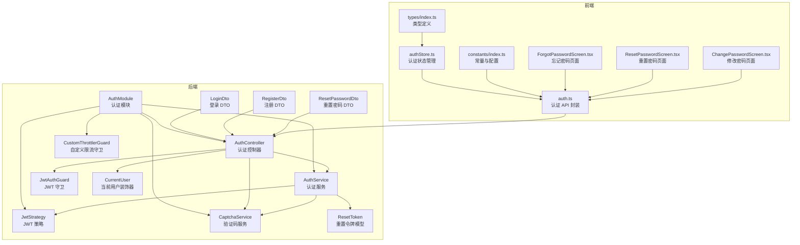

**图表来源**
- [backend/src/modules/auth/auth.module.ts:13-29](file://backend/src/modules/auth/auth.module.ts#L13-L29)
- [backend/src/modules/auth/auth.controller.ts:17-22](file://backend/src/modules/auth/auth.controller.ts#L17-L22)
- [backend/src/modules/auth/auth.service.ts:24-37](file://backend/src/modules/auth/auth.service.ts#L24-L37)
- [backend/src/modules/auth/strategies/jwt.strategy.ts:11-21](file://backend/src/modules/auth/strategies/jwt.strategy.ts#L11-L21)
- [backend/src/modules/auth/captcha.service.ts:31-51](file://backend/src/modules/auth/captcha.service.ts#L31-L51)
- [backend/src/common/guards/jwt-auth.guard.ts:9-21](file://backend/src/common/guards/jwt-auth.guard.ts#L9-L21)
- [backend/src/common/guards/custom-throttler.guard.ts:9-21](file://backend/src/common/guards/custom-throttler.guard.ts#L9-L21)
- [backend/src/common/decorators/current-user.decorator.ts:7-15](file://backend/src/common/decorators/current-user.decorator.ts#L7-L15)
- [backend/prisma/schema.prisma:171-183](file://backend/prisma/schema.prisma#L171-L183)
- [FreeDressApp/src/api/auth.ts:12-100](file://FreeDressApp/src/api/auth.ts#L12-L100)
- [FreeDressApp/src/store/authStore.ts:28-122](file://FreeDressApp/src/store/authStore.ts#L28-L122)
- [FreeDressApp/src/types/index.ts:59-71](file://FreeDressApp/src/types/index.ts#L59-L71)
- [FreeDressApp/src/constants/index.ts:9-205](file://FreeDressApp/src/constants/index.ts#L9-L205)
- [FreeDressApp/src/screens/ForgotPasswordScreen.tsx:1-304](file://FreeDressApp/src/screens/ForgotPasswordScreen.tsx#L1-L304)
- [FreeDressApp/src/screens/ResetPasswordScreen.tsx:1-231](file://FreeDressApp/src/screens/ResetPasswordScreen.tsx#L1-L231)
- [FreeDressApp/src/screens/ChangePasswordScreen.tsx](file://FreeDressApp/src/screens/ChangePasswordScreen.tsx)

**章节来源**
- [backend/src/modules/auth/auth.module.ts:1-30](file://backend/src/modules/auth/auth.module.ts#L1-L30)
- [backend/src/app.module.ts:13-32](file://backend/src/app.module.ts#L13-L32)
- [backend/src/main.ts:12-62](file://backend/src/main.ts#L12-L62)

## 核心组件
- 认证模块（AuthModule）：负责注册 Passport 默认策略、配置 JWT 模块、导出认证相关服务与策略
- 认证控制器（AuthController）：暴露认证相关 API，如获取验证码、注册、登录、忘记密码、重置密码、刷新 Token、获取当前用户信息、**新增**：修改密码
- 认证服务（AuthService）：实现业务逻辑，包括用户注册（含验证码校验）、登录、Token 生成（访问令牌与刷新令牌）、忘记密码与重置密码、用户验证、**新增**：密码更改功能（含事务性密码更新）
- JWT 策略（JwtStrategy）：基于 Passport-JWT 实现，从请求头提取 Bearer Token，验证签名与过期时间，并通过 AuthService 校验用户存在性
- 验证码服务（CaptchaService）：生成带噪声干扰的 SVG 验证码，内存存储答案与尝试次数，支持过期清理、最大尝试次数限制与 IP 限流
- **新增**：自定义限流守卫（CustomThrottlerGuard）：实现精准到用户的速率限制，已认证用户按 userId 限流，未认证请求按 IP 限流
- DTO（数据传输对象）：LoginDto、RegisterDto、ResetPasswordDto，使用 class-validator 进行请求参数校验
- JWT 守卫（JwtAuthGuard）：继承 AuthGuard('jwt')，统一处理认证失败场景
- 当前用户装饰器（CurrentUser）：简化从请求上下文获取用户信息的过程
- **新增**：重置令牌模型（ResetToken）：数据库支持的密码重置令牌管理，包含过期时间和使用状态

**章节来源**
- [backend/src/modules/auth/auth.module.ts:13-29](file://backend/src/modules/auth/auth.module.ts#L13-L29)
- [backend/src/modules/auth/auth.controller.ts:17-105](file://backend/src/modules/auth/auth.controller.ts#L17-L105)
- [backend/src/modules/auth/auth.service.ts:24-326](file://backend/src/modules/auth/auth.service.ts#L24-L326)
- [backend/src/modules/auth/strategies/jwt.strategy.ts:11-38](file://backend/src/modules/auth/strategies/jwt.strategy.ts#L11-L38)
- [backend/src/modules/auth/captcha.service.ts:31-258](file://backend/src/modules/auth/captcha.service.ts#L31-L258)
- [backend/src/common/guards/custom-throttler.guard.ts:9-21](file://backend/src/common/guards/custom-throttler.guard.ts#L9-L21)
- [backend/src/common/guards/jwt-auth.guard.ts:9-21](file://backend/src/common/guards/jwt-auth.guard.ts#L9-L21)
- [backend/src/common/decorators/current-user.decorator.ts:7-15](file://backend/src/common/decorators/current-user.decorator.ts#L7-L15)
- [backend/prisma/schema.prisma:171-183](file://backend/prisma/schema.prisma#L171-L183)

## 架构总览
认证模块采用"控制器-服务-策略-守卫-装饰器"的分层架构，结合 DTO 校验与验证码服务，形成完整的认证闭环。新增的速率限制和密码管理功能进一步增强了系统的安全性和可靠性。

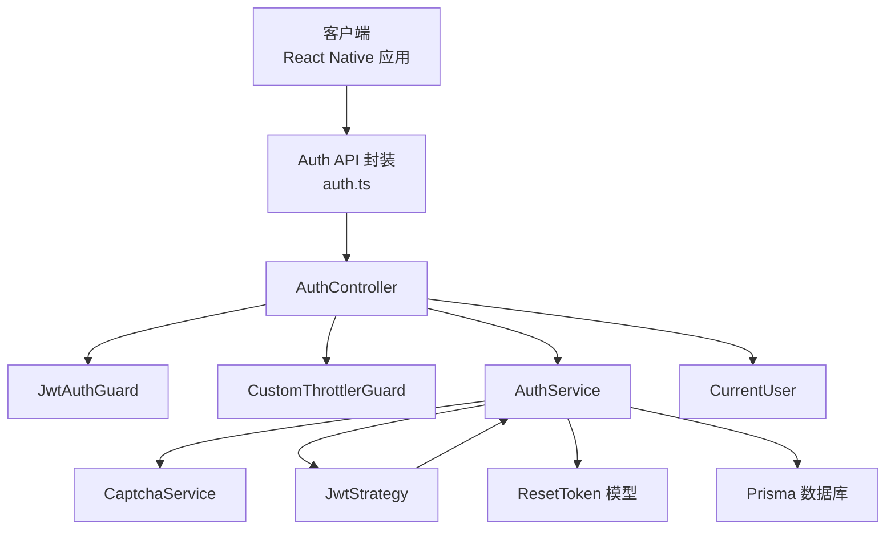

**图表来源**
- [backend/src/modules/auth/auth.controller.ts:17-105](file://backend/src/modules/auth/auth.controller.ts#L17-L105)
- [backend/src/common/guards/jwt-auth.guard.ts:9-21](file://backend/src/common/guards/jwt-auth.guard.ts#L9-L21)
- [backend/src/common/guards/custom-throttler.guard.ts:9-21](file://backend/src/common/guards/custom-throttler.guard.ts#L9-L21)
- [backend/src/common/decorators/current-user.decorator.ts:7-15](file://backend/src/common/decorators/current-user.decorator.ts#L7-L15)
- [backend/src/modules/auth/auth.service.ts:24-37](file://backend/src/modules/auth/auth.service.ts#L24-L37)
- [backend/src/modules/auth/captcha.service.ts:31-51](file://backend/src/modules/auth/captcha.service.ts#L31-L51)
- [backend/src/modules/auth/strategies/jwt.strategy.ts:11-38](file://backend/src/modules/auth/strategies/jwt.strategy.ts#L11-L38)
- [backend/prisma/schema.prisma:171-183](file://backend/prisma/schema.prisma#L171-L183)

## 详细组件分析

### JWT 策略与 Passport 集成
- 策略配置：从 Authorization 头部提取 Bearer Token，禁用忽略过期，使用环境变量中的密钥进行签名验证
- 身份解析：验证通过后调用 AuthService.validateUser，确认用户存在并返回包含用户信息的对象

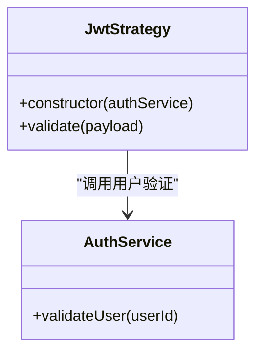

**图表来源**
- [backend/src/modules/auth/strategies/jwt.strategy.ts:11-38](file://backend/src/modules/auth/strategies/jwt.strategy.ts#L11-L38)
- [backend/src/modules/auth/auth.service.ts:266-283](file://backend/src/modules/auth/auth.service.ts#L266-L283)

**章节来源**
- [backend/src/modules/auth/strategies/jwt.strategy.ts:11-38](file://backend/src/modules/auth/strategies/jwt.strategy.ts#L11-L38)
- [backend/src/common/guards/jwt-auth.guard.ts:9-21](file://backend/src/common/guards/jwt-auth.guard.ts#L9-L21)

### Token 生成与验证流程
- 访问令牌与刷新令牌：同时生成访问令牌与刷新令牌，分别使用不同的密钥与过期时间
- 刷新流程：受 JwtAuthGuard 保护，仅在持有有效刷新令牌时允许获取新的访问令牌
- 用户信息注入：通过 CurrentUser 装饰器从请求上下文中获取用户信息

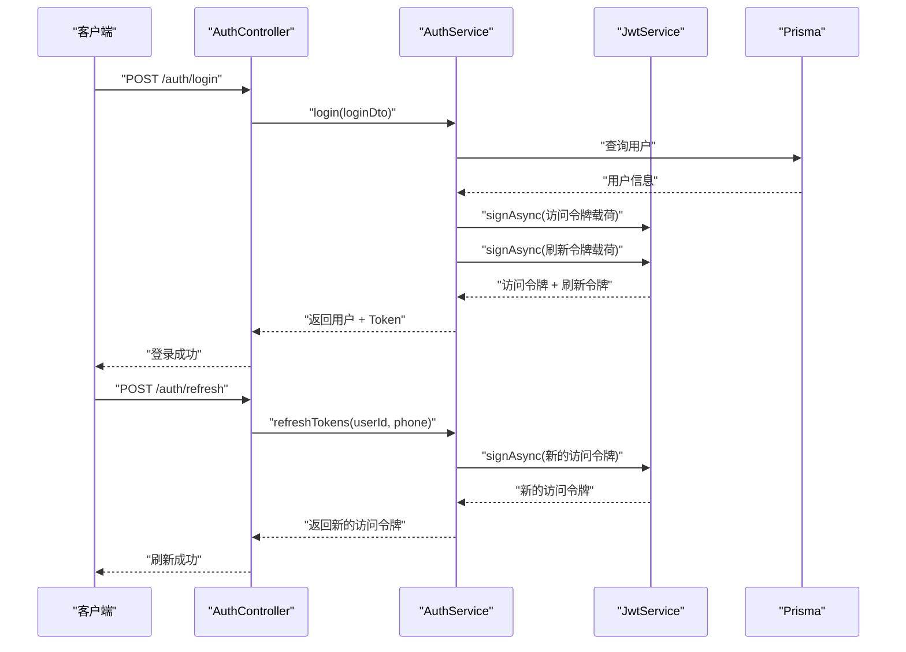

**图表来源**
- [backend/src/modules/auth/auth.controller.ts:46-79](file://backend/src/modules/auth/auth.controller.ts#L46-L79)
- [backend/src/modules/auth/auth.service.ts:133-161](file://backend/src/modules/auth/auth.service.ts#L133-L161)
- [backend/src/modules/auth/auth.service.ts:133-135](file://backend/src/modules/auth/auth.service.ts#L133-L135)
- [backend/src/common/decorators/current-user.decorator.ts:7-15](file://backend/src/common/decorators/current-user.decorator.ts#L7-L15)

**章节来源**
- [backend/src/modules/auth/auth.controller.ts:46-79](file://backend/src/modules/auth/auth.controller.ts#L46-L79)
- [backend/src/modules/auth/auth.service.ts:133-161](file://backend/src/modules/auth/auth.service.ts#L133-L161)

### 登录注册 DTO 数据验证规则
- LoginDto：手机号格式校验（中国手机号）、密码长度与非空校验
- RegisterDto：手机号格式校验、密码长度与非空校验、验证码 ID 与答案长度校验、昵称可选且长度限制
- ResetPasswordDto：重置令牌非空校验、新密码长度与非空校验

**图表来源**
- [backend/src/modules/auth/dto/login.dto.ts:7-19](file://backend/src/modules/auth/dto/login.dto.ts#L7-L19)
- [backend/src/modules/auth/dto/register.dto.ts:8-37](file://backend/src/modules/auth/dto/register.dto.ts#L8-L37)
- [backend/src/modules/auth/dto/reset-password.dto.ts:7-18](file://backend/src/modules/auth/dto/reset-password.dto.ts#L7-L18)

**章节来源**
- [backend/src/modules/auth/dto/login.dto.ts:7-19](file://backend/src/modules/auth/dto/login.dto.ts#L7-L19)
- [backend/src/modules/auth/dto/register.dto.ts:8-37](file://backend/src/modules/auth/dto/register.dto.ts#L8-L37)
- [backend/src/modules/auth/dto/reset-password.dto.ts:7-18](file://backend/src/modules/auth/dto/reset-password.dto.ts#L7-L18)

### 验证码服务安全机制
- 验证码生成：4 位字符，去除易混淆字符；生成 SVG 图片，包含噪声线条、干扰点与贝塞尔曲线
- 过期控制：2 分钟有效期，定期清理过期验证码
- 尝试限制：单个验证码最多 3 次验证机会，用尽后自动失效
- IP 限流：每分钟最多 10 次请求，超过则拒绝
- 注册与忘记密码流程均需提供正确的验证码 ID 与答案

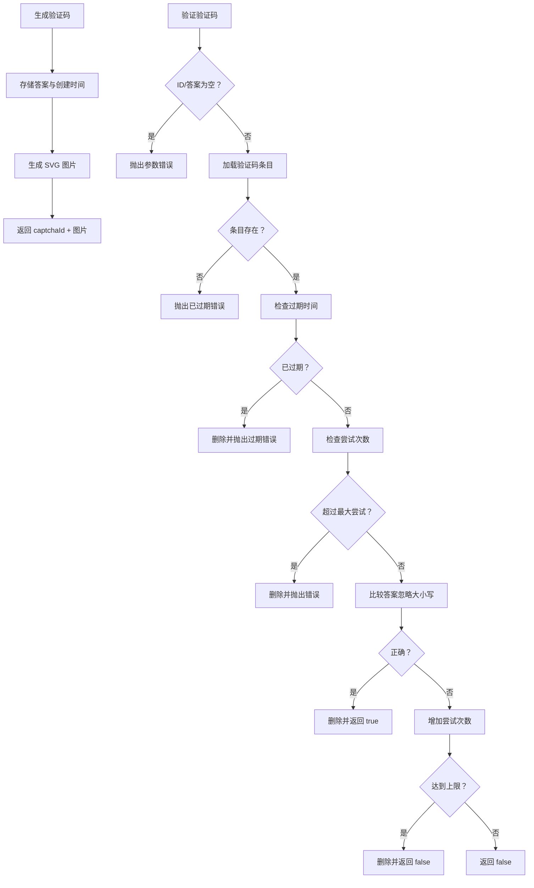

**图表来源**
- [backend/src/modules/auth/captcha.service.ts:58-122](file://backend/src/modules/auth/captcha.service.ts#L58-L122)
- [backend/src/modules/auth/captcha.service.ts:223-236](file://backend/src/modules/auth/captcha.service.ts#L223-L236)
- [backend/src/modules/auth/captcha.service.ts:241-257](file://backend/src/modules/auth/captcha.service.ts#L241-L257)

**章节来源**
- [backend/src/modules/auth/captcha.service.ts:31-258](file://backend/src/modules/auth/captcha.service.ts#L31-L258)

### 忘记密码与重置密码流程
- 忘记密码：验证手机号与验证码后生成一次性重置令牌，令牌有效期 10 分钟，定期清理过期令牌
- 重置密码：使用重置令牌与新密码更新用户密码，令牌使用后立即删除

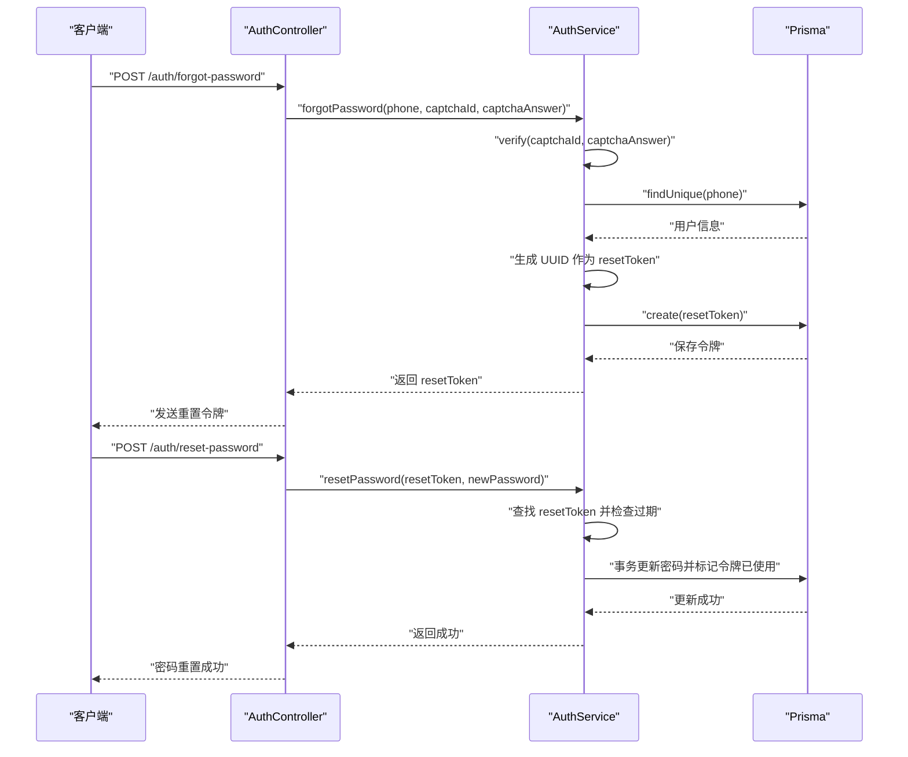

**图表来源**
- [backend/src/modules/auth/auth.controller.ts:55-68](file://backend/src/modules/auth/auth.controller.ts#L55-L68)
- [backend/src/modules/auth/auth.service.ts:170-246](file://backend/src/modules/auth/auth.service.ts#L170-L246)
- [backend/prisma/schema.prisma:171-183](file://backend/prisma/schema.prisma#L171-L183)

**章节来源**
- [backend/src/modules/auth/auth.controller.ts:55-68](file://backend/src/modules/auth/auth.controller.ts#L55-L68)
- [backend/src/modules/auth/auth.service.ts:170-246](file://backend/src/modules/auth/auth.service.ts#L170-L246)

### **新增**：自定义限流守卫与速率限制
- 限流策略：已认证用户按 userId 限流（精准到人），未认证请求按 IP 限流（兜底）
- 实现机制：CustomThrottlerGuard 继承 ThrottlerGuard，重写 getTracker 方法实现智能限流标识
- 安全优势：防止暴力破解攻击，保护系统免受恶意请求影响

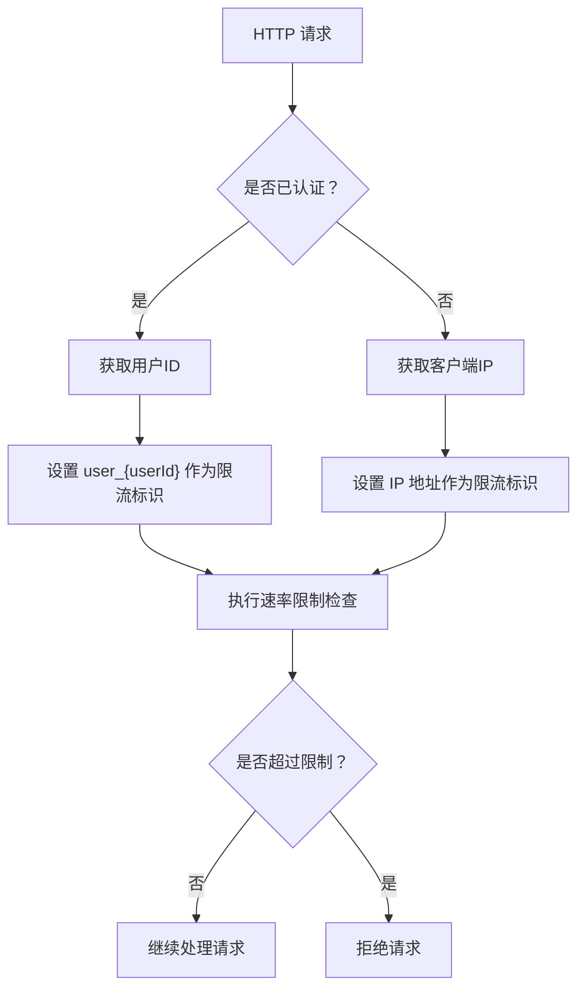

**图表来源**
- [backend/src/common/guards/custom-throttler.guard.ts:11-20](file://backend/src/common/guards/custom-throttler.guard.ts#L11-L20)

**章节来源**
- [backend/src/common/guards/custom-throttler.guard.ts:9-21](file://backend/src/common/guards/custom-throttler.guard.ts#L9-L21)

### **新增**：增强的密码更改功能
- 密码修改接口：新增 changePassword 方法，支持安全的密码修改流程
- 安全验证：验证旧密码正确性，新密码长度限制（6-20位）
- 事务性更新：使用 Prisma 事务确保密码更新的原子性
- 错误处理：详细的参数验证和错误提示

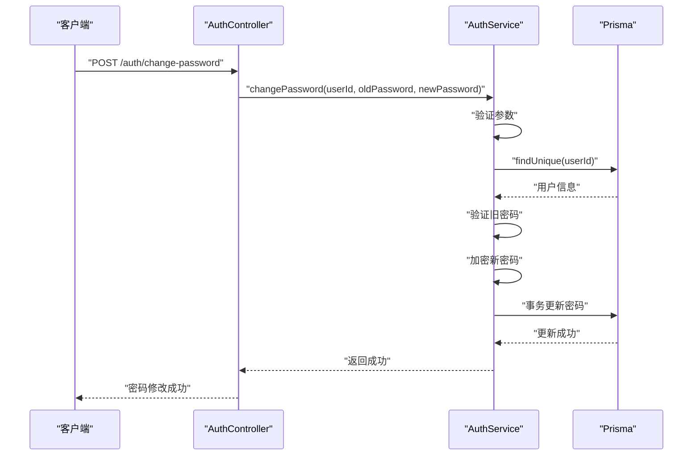

**图表来源**
- [backend/src/modules/auth/auth.controller.ts:95-104](file://backend/src/modules/auth/auth.controller.ts#L95-L104)
- [backend/src/modules/auth/auth.service.ts:291-324](file://backend/src/modules/auth/auth.service.ts#L291-L324)

**章节来源**
- [backend/src/modules/auth/auth.controller.ts:95-104](file://backend/src/modules/auth/auth.controller.ts#L95-L104)
- [backend/src/modules/auth/auth.service.ts:291-324](file://backend/src/modules/auth/auth.service.ts#L291-L324)

### **新增**：数据库支持的重置令牌管理
- 令牌模型：ResetToken 模型包含 token、userId、expiresAt、used 等字段
- 生命周期管理：自动清理过期和已使用的令牌
- 安全特性：每个令牌只能使用一次，过期后自动失效
- 数据库事务：密码重置时使用事务确保数据一致性

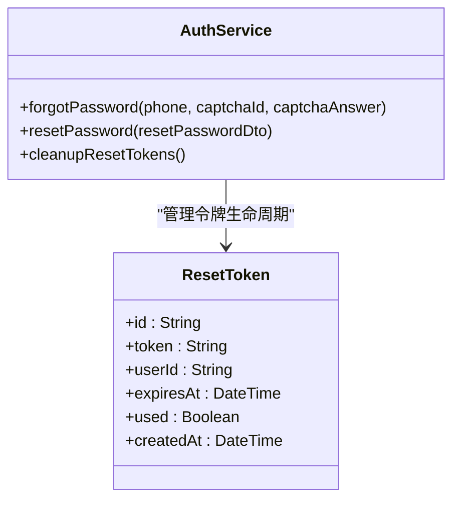

**图表来源**
- [backend/prisma/schema.prisma:171-183](file://backend/prisma/schema.prisma#L171-L183)
- [backend/src/modules/auth/auth.service.ts:170-260](file://backend/src/modules/auth/auth.service.ts#L170-L260)

**章节来源**
- [backend/prisma/schema.prisma:171-183](file://backend/prisma/schema.prisma#L171-L183)
- [backend/src/modules/auth/auth.service.ts:170-260](file://backend/src/modules/auth/auth.service.ts#L170-L260)

### 客户端集成指南
- API 封装：前端通过 auth.ts 封装认证相关接口，包括获取验证码、注册、登录、忘记密码、重置密码、刷新 Token、获取当前用户信息、**新增**：修改密码
- 状态管理：使用 authStore.ts 管理认证状态，持久化存储访问令牌、刷新令牌与用户信息
- 类型定义：统一的响应与登录返回类型，便于前后端契约一致
- 常量配置：API 基础地址、存储键名等集中管理
- 页面集成：ForgotPasswordScreen、ResetPasswordScreen、**新增**：ChangePasswordScreen 提供完整的密码管理流程

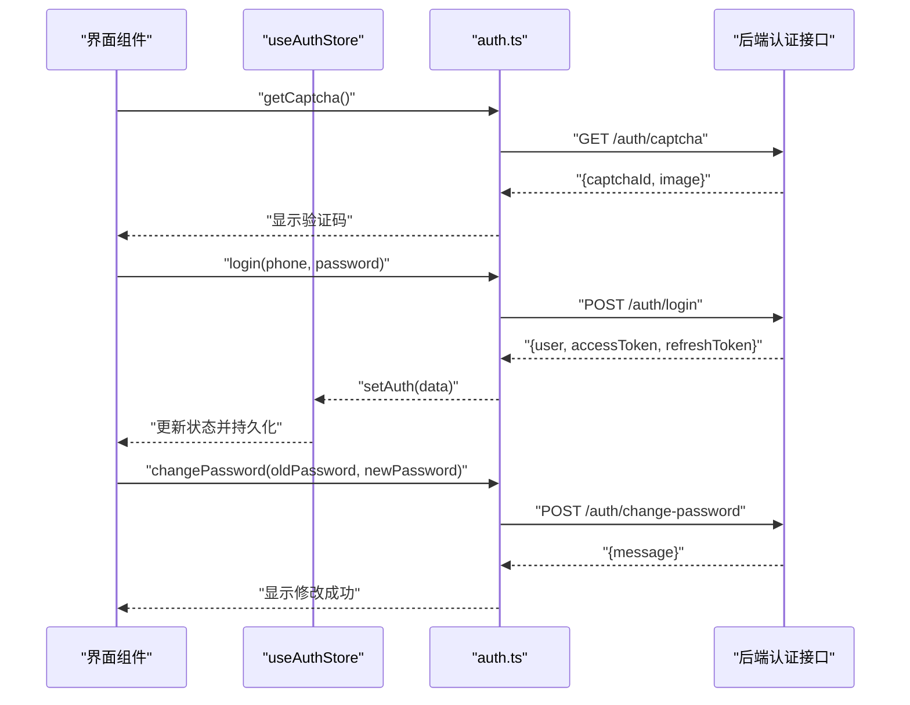

**图表来源**
- [FreeDressApp/src/api/auth.ts:12-101](file://FreeDressApp/src/api/auth.ts#L12-L101)
- [FreeDressApp/src/store/authStore.ts:28-123](file://FreeDressApp/src/store/authStore.ts#L28-L123)
- [FreeDressApp/src/types/index.ts:59-71](file://FreeDressApp/src/types/index.ts#L59-L71)
- [FreeDressApp/src/constants/index.ts:9-205](file://FreeDressApp/src/constants/index.ts#L9-L205)

**章节来源**
- [FreeDressApp/src/api/auth.ts:12-101](file://FreeDressApp/src/api/auth.ts#L12-L101)
- [FreeDressApp/src/store/authStore.ts:28-123](file://FreeDressApp/src/store/authStore.ts#L28-L123)
- [FreeDressApp/src/types/index.ts:59-71](file://FreeDressApp/src/types/index.ts#L59-L71)
- [FreeDressApp/src/constants/index.ts:9-205](file://FreeDressApp/src/constants/index.ts#L9-L205)

## 依赖关系分析
- 模块导入：AppModule 导入 AuthModule，使认证模块成为应用的一部分
- 控制器依赖：AuthController 依赖 AuthService 与 CaptchaService
- 服务依赖：AuthService 依赖 JwtService、PrismaService、CaptchaService
- 策略依赖：JwtStrategy 依赖 AuthService
- 守卫与装饰器：JwtAuthGuard 继承自 AuthGuard('jwt')，**新增**：CustomThrottlerGuard 继承自 ThrottlerGuard，CurrentUser 装饰器从请求上下文提取用户信息
- **新增**：ResetToken 模型依赖 PrismaService 进行数据库操作

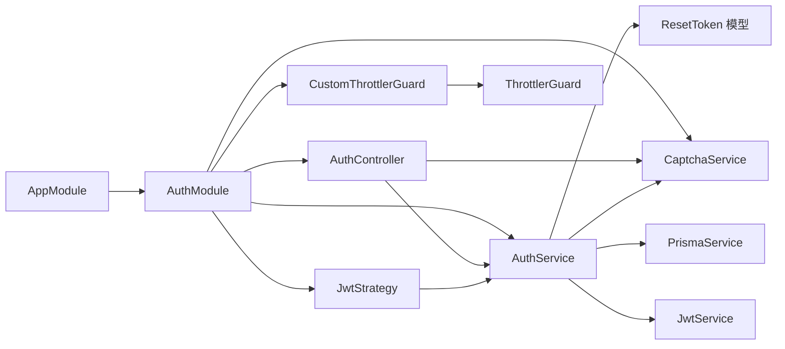

**图表来源**
- [backend/src/app.module.ts:13-32](file://backend/src/app.module.ts#L13-L32)
- [backend/src/modules/auth/auth.module.ts:13-29](file://backend/src/modules/auth/auth.module.ts#L13-L29)
- [backend/src/modules/auth/auth.controller.ts:17-22](file://backend/src/modules/auth/auth.controller.ts#L17-L22)
- [backend/src/modules/auth/auth.service.ts:24-37](file://backend/src/modules/auth/auth.service.ts#L24-L37)
- [backend/src/modules/auth/strategies/jwt.strategy.ts:11-21](file://backend/src/modules/auth/strategies/jwt.strategy.ts#L11-L21)
- [backend/src/common/guards/custom-throttler.guard.ts:1-2](file://backend/src/common/guards/custom-throttler.guard.ts#L1-L2)

**章节来源**
- [backend/src/app.module.ts:13-32](file://backend/src/app.module.ts#L13-L32)
- [backend/src/modules/auth/auth.module.ts:13-29](file://backend/src/modules/auth/auth.module.ts#L13-L29)

## 性能考虑
- Token 生成：访问令牌与刷新令牌采用异步并发生成，减少往返延迟
- 定时清理：验证码与重置令牌定期清理，避免内存泄漏
- 限流策略：IP 限流与尝试次数限制降低暴力破解风险
- 响应格式：全局拦截器统一响应格式，便于前端处理与缓存
- **新增**：数据库事务优化：密码重置使用事务批量操作，提高数据库操作效率
- **新增**：精准限流：CustomThrottlerGuard 实现按用户维度的精确限流，避免误伤正常用户

## 故障排除指南
- 参数校验失败：检查 DTO 规则与请求体字段，确保手机号格式、密码长度、验证码长度符合要求
- 验证码错误：确认 captchaId 与 captchaAnswer 正确，验证码 2 分钟过期，单个验证码最多 3 次尝试
- 用户不存在或密码错误：确认手机号是否已注册，密码是否匹配
- Token 过期或无效：使用刷新接口获取新的访问令牌
- 未登录访问受保护接口：JwtAuthGuard 会抛出未授权异常，需先完成登录
- 密码重置失败：确认 resetToken 有效且未过期，新密码长度符合要求
- **新增**：速率限制错误：检查请求频率是否超过限流阈值，已认证用户按用户维度限流，未认证用户按 IP 限流
- **新增**：密码修改失败：确认旧密码正确，新密码长度在 6-20 位之间

**章节来源**
- [backend/src/modules/auth/auth.service.ts:98-135](file://backend/src/modules/auth/auth.service.ts#L98-L135)
- [backend/src/modules/auth/captcha.service.ts:87-122](file://backend/src/modules/auth/captcha.service.ts#L87-L122)
- [backend/src/common/guards/jwt-auth.guard.ts:14-20](file://backend/src/common/guards/jwt-auth.guard.ts#L14-L20)
- [backend/src/common/guards/custom-throttler.guard.ts:11-20](file://backend/src/common/guards/custom-throttler.guard.ts#L11-L20)

## 结论
认证模块通过清晰的职责分离与严格的数据验证，构建了安全可靠的用户认证体系。JWT 策略与 Passport 的集成提供了标准化的身份验证流程，验证码服务增强了抗自动化能力，密码重置功能完善了用户账户安全管理。**新增的 CustomThrottlerGuard 实现了精准的速率限制，有效防止暴力破解攻击；增强的密码更改功能提供了安全的密码修改流程；数据库支持的重置令牌管理确保了令牌的可靠性和安全性；事务性密码更新保证了操作的原子性和数据一致性。** 前端状态管理与 API 封装提升了用户体验，忘记密码、重置密码和修改密码页面提供了完整的密码管理流程。建议在生产环境中将内存存储替换为 Redis，并完善日志审计与监控告警机制。

## 附录

### API 接口调用示例
- 获取验证码
  - GET /api/auth/captcha
- 用户注册
  - POST /api/auth/register
  - 请求体字段：phone, password, captchaId, captchaAnswer, nickname(可选)
- 用户登录
  - POST /api/auth/login
  - 请求体字段：phone, password
- 忘记密码
  - POST /api/auth/forgot-password
  - 请求体字段：phone, captchaId, captchaAnswer
- 重置密码
  - POST /api/auth/reset-password
  - 请求体字段：resetToken, newPassword
- 刷新 Token
  - POST /api/auth/refresh
  - 需携带 Bearer Token
- 获取当前用户信息
  - GET /api/auth/profile
  - 需携带 Bearer Token
- **新增**：修改密码
  - POST /api/auth/change-password
  - 请求体字段：oldPassword, newPassword
  - 需携带 Bearer Token

**章节来源**
- [backend/src/modules/auth/auth.controller.ts:27-105](file://backend/src/modules/auth/auth.controller.ts#L27-L105)
- [FreeDressApp/src/api/auth.ts:12-101](file://FreeDressApp/src/api/auth.ts#L12-L101)

### 前端页面集成示例
- 忘记密码页面：提供手机号和验证码输入，验证通过后跳转到重置密码页面
- 重置密码页面：接收重置令牌参数，设置新密码并提交重置请求
- **新增**：修改密码页面：提供旧密码和新密码输入，验证通过后更新用户密码
- 认证状态管理：使用 Zustand 管理用户认证状态，支持本地存储持久化

**章节来源**
- [FreeDressApp/src/screens/ForgotPasswordScreen.tsx:1-304](file://FreeDressApp/src/screens/ForgotPasswordScreen.tsx#L1-L304)
- [FreeDressApp/src/screens/ResetPasswordScreen.tsx:1-231](file://FreeDressApp/src/screens/ResetPasswordScreen.tsx#L1-L231)
- [FreeDressApp/src/screens/ChangePasswordScreen.tsx](file://FreeDressApp/src/screens/ChangePasswordScreen.tsx)
- [FreeDressApp/src/store/authStore.ts:28-123](file://FreeDressApp/src/store/authStore.ts#L28-L123)