# 认证模块

<cite>
**本文档引用的文件**
- [backend/src/modules/auth/auth.module.ts](file://backend/src/modules/auth/auth.module.ts)
- [backend/src/modules/auth/auth.service.ts](file://backend/src/modules/auth/auth.service.ts)
- [backend/src/modules/auth/auth.controller.ts](file://backend/src/modules/auth/auth.controller.ts)
- [backend/src/modules/auth/strategies/jwt.strategy.ts](file://backend/src/modules/auth/strategies/jwt.strategy.ts)
- [backend/src/modules/auth/captcha.service.ts](file://backend/src/modules/auth/captcha.service.ts)
- [backend/src/modules/auth/wechat.service.ts](file://backend/src/modules/auth/wechat.service.ts)
- [backend/src/modules/auth/dto/wechat.dto.ts](file://backend/src/modules/auth/dto/wechat.dto.ts)
- [backend/src/modules/auth/dto/login.dto.ts](file://backend/src/modules/auth/dto/login.dto.ts)
- [backend/src/modules/auth/dto/register.dto.ts](file://backend/src/modules/auth/dto/register.dto.ts)
- [backend/src/modules/auth/dto/reset-password.dto.ts](file://backend/src/modules/auth/dto/reset-password.dto.ts)
- [backend/src/common/guards/jwt-auth.guard.ts](file://backend/src/common/guards/jwt-auth.guard.ts)
- [backend/src/common/guards/custom-throttler.guard.ts](file://backend/src/common/guards/custom-throttler.guard.ts)
- [backend/src/common/decorators/current-user.decorator.ts](file://backend/src/common/decorators/current-user.decorator.ts)
- [backend/src/app.module.ts](file://backend/src/app.module.ts)
- [backend/src/main.ts](file://backend/src/main.ts)
- [backend/prisma/schema.prisma](file://backend/prisma/schema.prisma)
- [FreeDressApp/src/api/auth.ts](file://FreeDressApp/src/api/auth.ts)
- [FreeDressApp/src/services/wechat.ts](file://FreeDressApp/src/services/wechat.ts)
- [FreeDressApp/src/store/authStore.ts](file://FreeDressApp/src/store/authStore.ts)
- [FreeDressApp/src/types/index.ts](file://FreeDressApp/src/types/index.ts)
- [FreeDressApp/src/constants/index.ts](file://FreeDressApp/src/constants/index.ts)
- [FreeDressApp/src/screens/LoginScreen.tsx](file://FreeDressApp/src/screens/LoginScreen.tsx)
- [FreeDressApp/src/screens/AccountSecurityScreen.tsx](file://FreeDressApp/src/screens/AccountSecurityScreen.tsx)
- [FreeDressApp/src/screens/BindPhoneScreen.tsx](file://FreeDressApp/src/screens/BindPhoneScreen.tsx)
- [FreeDressApp/src/screens/ForgotPasswordScreen.tsx](file://FreeDressApp/src/screens/ForgotPasswordScreen.tsx)
- [FreeDressApp/src/screens/ResetPasswordScreen.tsx](file://FreeDressApp/src/screens/ResetPasswordScreen.tsx)
- [FreeDressApp/src/screens/ChangePasswordScreen.tsx](file://FreeDressApp/src/screens/ChangePasswordScreen.tsx)
- [freeDressWechat/pages/login/login.js](file://freeDressWechat/pages/login/login.js)
- [freeDressWechat/utils/api.js](file://freeDressWechat/utils/api.js)
</cite>

## 更新摘要
**所做更改**
- 新增微信登录认证功能，支持小程序和App双端微信登录
- 新增 WeChatService 微信开放平台服务组件，实现微信登录会话管理和用户信息获取
- 新增微信登录相关 DTO 和 API 接口，包括小程序登录、App登录、微信绑定等
- 新增混合账户管理机制，支持手机号+微信的双重认证模式
- 新增微信绑定/解绑功能，提供灵活的账户关联策略
- 新增微信登录审计日志，记录完整的绑定解绑操作轨迹
- 新增微信登录的前端集成，包括小程序页面和App SDK封装

## 目录
1. [简介](#简介)
2. [项目结构](#项目结构)
3. [核心组件](#核心组件)
4. [架构总览](#架构总览)
5. [详细组件分析](#详细组件分析)
6. [依赖关系分析](#依赖关系分析)
7. [性能考虑](#性能考虑)
8. [故障排除指南](#故障排除指南)
9. [结论](#结论)
10. [附录](#附录)

## 简介
本文件系统性解析 FreeDress 项目的认证模块，涵盖以下关键主题：
- JWT 认证机制的实现原理：策略配置、Passport 集成、Token 生成与验证流程
- 登录注册 DTO 的数据验证规则
- 验证码服务的安全机制（防自动化、限流、过期控制）
- JWT 策略的用户身份解析过程
- 密码重置功能的完整流程与安全设计
- **新增**：微信登录认证功能，支持小程序和App双端微信登录
- **新增**：WeChatService 微信开放平台服务组件，实现微信登录会话管理和用户信息获取
- **新增**：混合账户管理机制，支持手机号+微信的双重认证模式
- **新增**：微信绑定/解绑功能，提供灵活的账户关联策略
- **新增**：微信登录审计日志，记录完整的绑定解绑操作轨迹
- 完整的认证流程时序图、错误处理策略与安全最佳实践
- 具体的 API 接口调用示例与客户端集成指南

## 项目结构
认证模块位于后端 NestJS 工程中，采用按功能域划分的模块化组织方式。前端 React Native 应用通过独立的 API 层与后端交互，支持完整的用户认证生命周期管理。新增的微信登录功能进一步扩展了认证方式，支持纯微信注册和混合账户管理。

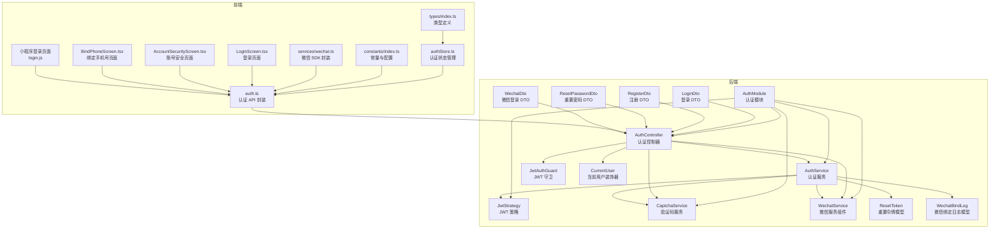

**图表来源**
- [backend/src/modules/auth/auth.module.ts:13-29](file://backend/src/modules/auth/auth.module.ts#L13-L29)
- [backend/src/modules/auth/auth.controller.ts:17-22](file://backend/src/modules/auth/auth.controller.ts#L17-L22)
- [backend/src/modules/auth/auth.service.ts:24-37](file://backend/src/modules/auth/auth.service.ts#L24-L37)
- [backend/src/modules/auth/strategies/jwt.strategy.ts:11-21](file://backend/src/modules/auth/strategies/jwt.strategy.ts#L11-L21)
- [backend/src/modules/auth/captcha.service.ts:31-51](file://backend/src/modules/auth/captcha.service.ts#L31-L51)
- [backend/src/modules/auth/wechat.service.ts:30-31](file://backend/src/modules/auth/wechat.service.ts#L30-L31)
- [backend/src/common/guards/jwt-auth.guard.ts:9-21](file://backend/src/common/guards/jwt-auth.guard.ts#L9-L21)
- [backend/src/common/guards/custom-throttler.guard.ts:9-21](file://backend/src/common/guards/custom-throttler.guard.ts#L9-L21)
- [backend/src/common/decorators/current-user.decorator.ts:7-15](file://backend/src/common/decorators/current-user.decorator.ts#L7-L15)
- [backend/prisma/schema.prisma:171-183](file://backend/prisma/schema.prisma#L171-L183)
- [FreeDressApp/src/api/auth.ts:12-100](file://FreeDressApp/src/api/auth.ts#L12-L100)
- [FreeDressApp/src/store/authStore.ts:28-122](file://FreeDressApp/src/store/authStore.ts#L28-L122)
- [FreeDressApp/src/types/index.ts:59-71](file://FreeDressApp/src/types/index.ts#L59-L71)
- [FreeDressApp/src/constants/index.ts:9-205](file://FreeDressApp/src/constants/index.ts#L9-L205)
- [FreeDressApp/src/services/wechat.ts:16-26](file://FreeDressApp/src/services/wechat.ts#L16-L26)
- [FreeDressApp/src/screens/LoginScreen.tsx:1-327](file://FreeDressApp/src/screens/LoginScreen.tsx#L1-L327)
- [FreeDressApp/src/screens/AccountSecurityScreen.tsx:1-232](file://FreeDressApp/src/screens/AccountSecurityScreen.tsx#L1-L232)
- [FreeDressApp/src/screens/BindPhoneScreen.tsx:1-277](file://FreeDressApp/src/screens/BindPhoneScreen.tsx#L1-L277)
- [freeDressWechat/pages/login/login.js:70-143](file://freeDressWechat/pages/login/login.js#L70-L143)

**章节来源**
- [backend/src/modules/auth/auth.module.ts:1-30](file://backend/src/modules/auth/auth.module.ts#L1-L30)
- [backend/src/app.module.ts:13-32](file://backend/src/app.module.ts#L13-L32)
- [backend/src/main.ts:12-62](file://backend/src/main.ts#L12-L62)

## 核心组件
- 认证模块（AuthModule）：负责注册 Passport 默认策略、配置 JWT 模块、导出认证相关服务与策略
- 认证控制器（AuthController）：暴露认证相关 API，如获取验证码、注册、登录、忘记密码、重置密码、刷新 Token、获取当前用户信息、**新增**：微信小程序登录、App微信登录、微信绑定/解绑
- 认证服务（AuthService）：实现业务逻辑，包括用户注册（含验证码校验）、登录、Token 生成（访问令牌与刷新令牌）、忘记密码与重置密码、用户验证、**新增**：微信登录处理、混合账户管理、微信绑定解绑、自动绑定微信
- JWT 策略（JwtStrategy）：基于 Passport-JWT 实现，从请求头提取 Bearer Token，验证签名与过期时间，并通过 AuthService 校验用户存在性
- 验证码服务（CaptchaService）：生成带噪声干扰的 SVG 验证码，内存存储答案与尝试次数，支持过期清理、最大尝试次数限制与 IP 限流
- **新增**：微信服务组件（WechatService）：封装微信开放平台 API，实现 jscode2session、appOauthAccessToken、getAppUserInfo 等微信登录相关功能
- **新增**：微信登录 DTO：WechatMpLoginDto、WechatAppLoginDto、BindWechatMpDto、BindWechatAppDto，使用 class-validator 进行微信登录参数校验
- **新增**：混合账户管理：支持手机号+微信的双重认证模式，提供自动绑定微信、手动绑定微信、解绑微信等功能
- **新增**：微信绑定审计日志：记录微信绑定、解绑、自动绑定等操作的详细信息
- DTO（数据传输对象）：LoginDto、RegisterDto、ResetPasswordDto，使用 class-validator 进行请求参数校验
- JWT 守卫（JwtAuthGuard）：继承 AuthGuard('jwt')，统一处理认证失败场景
- 当前用户装饰器（CurrentUser）：简化从请求上下文获取用户信息的过程
- **新增**：重置令牌模型（ResetToken）：数据库支持的密码重置令牌管理，包含过期时间和使用状态
- **新增**：微信绑定日志模型（WechatBindLog）：记录微信绑定解绑操作的审计日志

**章节来源**
- [backend/src/modules/auth/auth.module.ts:13-29](file://backend/src/modules/auth/auth.module.ts#L13-L29)
- [backend/src/modules/auth/auth.controller.ts:17-105](file://backend/src/modules/auth/auth.controller.ts#L17-L105)
- [backend/src/modules/auth/auth.service.ts:24-326](file://backend/src/modules/auth/auth.service.ts#L24-L326)
- [backend/src/modules/auth/strategies/jwt.strategy.ts:11-38](file://backend/src/modules/auth/strategies/jwt.strategy.ts#L11-L38)
- [backend/src/modules/auth/captcha.service.ts:31-258](file://backend/src/modules/auth/captcha.service.ts#L31-L258)
- [backend/src/modules/auth/wechat.service.ts:30-166](file://backend/src/modules/auth/wechat.service.ts#L30-L166)
- [backend/src/common/guards/custom-throttler.guard.ts:9-21](file://backend/src/common/guards/custom-throttler.guard.ts#L9-L21)
- [backend/src/common/guards/jwt-auth.guard.ts:9-21](file://backend/src/common/guards/jwt-auth.guard.ts#L9-L21)
- [backend/src/common/decorators/current-user.decorator.ts:7-15](file://backend/src/common/decorators/current-user.decorator.ts#L7-L15)
- [backend/prisma/schema.prisma:171-183](file://backend/prisma/schema.prisma#L171-L183)

## 架构总览
认证模块采用"控制器-服务-策略-守卫-装饰器"的分层架构，结合 DTO 校验与验证码服务，形成完整的认证闭环。新增的微信登录功能通过 WechatService 组件实现微信开放平台的集成，支持小程序和App双端登录，提供混合账户管理模式。

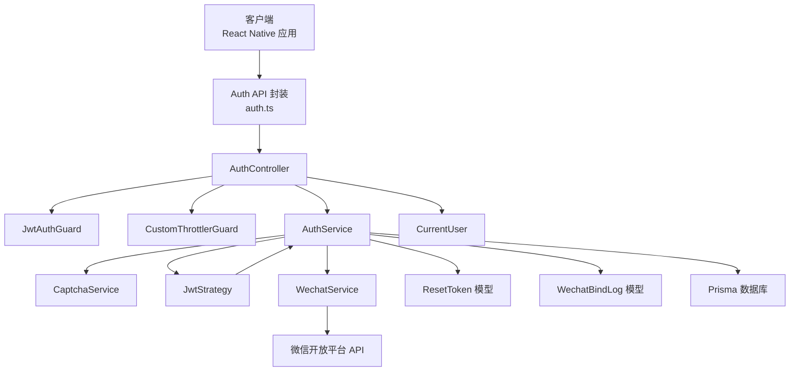

**图表来源**
- [backend/src/modules/auth/auth.controller.ts:17-105](file://backend/src/modules/auth/auth.controller.ts#L17-L105)
- [backend/src/common/guards/jwt-auth.guard.ts:9-21](file://backend/src/common/guards/jwt-auth.guard.ts#L9-L21)
- [backend/src/common/guards/custom-throttler.guard.ts:9-21](file://backend/src/common/guards/custom-throttler.guard.ts#L9-L21)
- [backend/src/common/decorators/current-user.decorator.ts:7-15](file://backend/src/common/decorators/current-user.decorator.ts#L7-L15)
- [backend/src/modules/auth/auth.service.ts:24-37](file://backend/src/modules/auth/auth.service.ts#L24-L37)
- [backend/src/modules/auth/captcha.service.ts:31-51](file://backend/src/modules/auth/captcha.service.ts#L31-L51)
- [backend/src/modules/auth/strategies/jwt.strategy.ts:11-38](file://backend/src/modules/auth/strategies/jwt.strategy.ts#L11-L38)
- [backend/src/modules/auth/wechat.service.ts:30-166](file://backend/src/modules/auth/wechat.service.ts#L30-L166)
- [backend/prisma/schema.prisma:171-183](file://backend/prisma/schema.prisma#L171-L183)

## 详细组件分析

### JWT 策略与 Passport 集成
- 策略配置：从 Authorization 头部提取 Bearer Token，禁用忽略过期，使用环境变量中的密钥进行签名验证
- 身份解析：验证通过后调用 AuthService.validateUser，确认用户存在并返回包含用户信息的对象

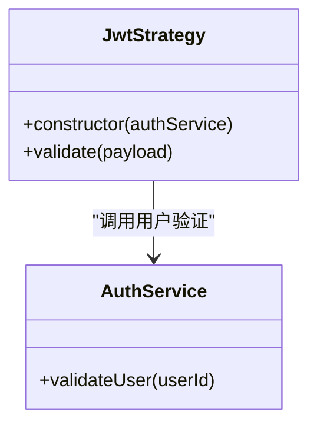

**图表来源**
- [backend/src/modules/auth/strategies/jwt.strategy.ts:11-38](file://backend/src/modules/auth/strategies/jwt.strategy.ts#L11-L38)
- [backend/src/modules/auth/auth.service.ts:266-283](file://backend/src/modules/auth/auth.service.ts#L266-L283)

**章节来源**
- [backend/src/modules/auth/strategies/jwt.strategy.ts:11-38](file://backend/src/modules/auth/strategies/jwt.strategy.ts#L11-L38)
- [backend/src/common/guards/jwt-auth.guard.ts:9-21](file://backend/src/common/guards/jwt-auth.guard.ts#L9-L21)

### Token 生成与验证流程
- 访问令牌与刷新令牌：同时生成访问令牌与刷新令牌，分别使用不同的密钥与过期时间
- 刷新流程：受 JwtAuthGuard 保护，仅在持有有效刷新令牌时允许获取新的访问令牌
- 用户信息注入：通过 CurrentUser 装饰器从请求上下文中获取用户信息

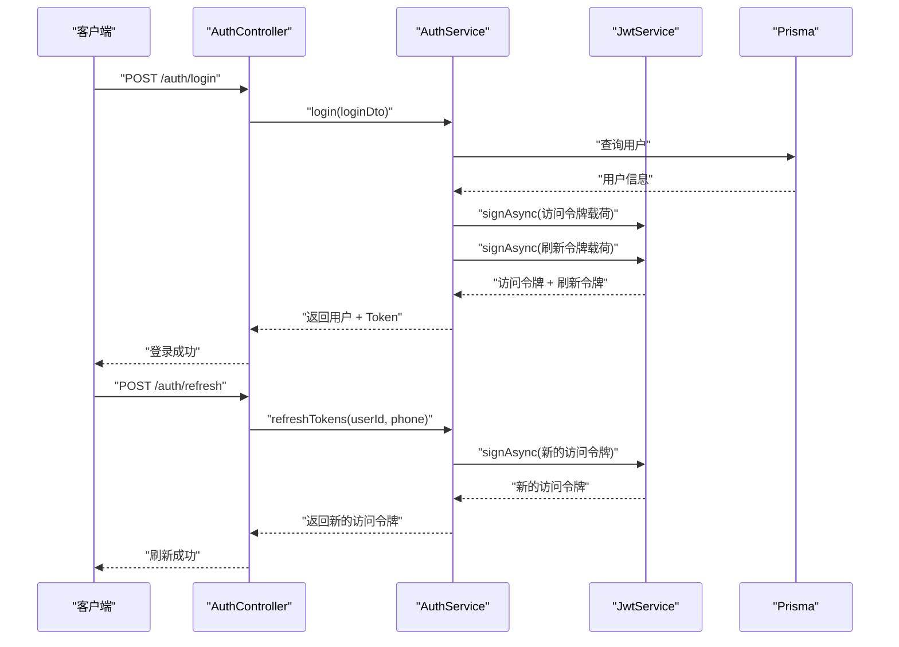

**图表来源**
- [backend/src/modules/auth/auth.controller.ts:46-79](file://backend/src/modules/auth/auth.controller.ts#L46-L79)
- [backend/src/modules/auth/auth.service.ts:133-161](file://backend/src/modules/auth/auth.service.ts#L133-L161)
- [backend/src/modules/auth/auth.service.ts:133-135](file://backend/src/modules/auth/auth.service.ts#L133-L135)
- [backend/src/common/decorators/current-user.decorator.ts:7-15](file://backend/src/common/decorators/current-user.decorator.ts#L7-L15)

**章节来源**
- [backend/src/modules/auth/auth.controller.ts:46-79](file://backend/src/modules/auth/auth.controller.ts#L46-L79)
- [backend/src/modules/auth/auth.service.ts:133-161](file://backend/src/modules/auth/auth.service.ts#L133-L161)

### 登录注册 DTO 数据验证规则
- LoginDto：手机号格式校验（中国手机号）、密码长度与非空校验
- RegisterDto：手机号格式校验、密码长度与非空校验、验证码 ID 与答案长度校验、昵称可选且长度限制
- ResetPasswordDto：重置令牌非空校验、新密码长度与非空校验
- **新增**：WechatMpLoginDto：小程序登录 DTO，包含 code、nickname、avatarUrl 字段校验
- **新增**：WechatAppLoginDto：App 登录 DTO，包含 code 字段校验
- **新增**：BindWechatMpDto：绑定微信 DTO，包含 code 字段校验
- **新增**：BindWechatAppDto：绑定微信 DTO，包含 code 字段校验

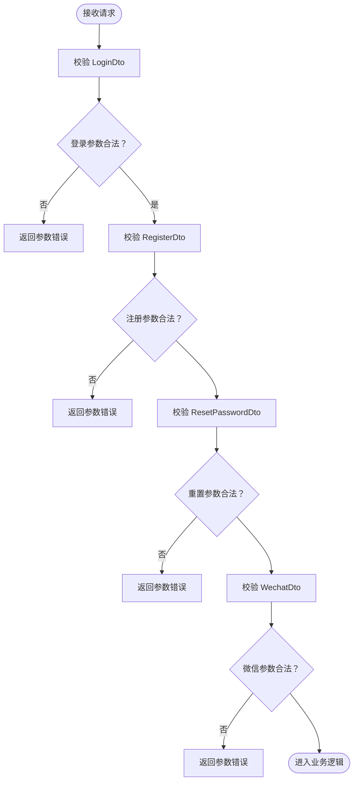

**图表来源**
- [backend/src/modules/auth/dto/login.dto.ts:7-19](file://backend/src/modules/auth/dto/login.dto.ts#L7-L19)
- [backend/src/modules/auth/dto/register.dto.ts:8-37](file://backend/src/modules/auth/dto/register.dto.ts#L8-L37)
- [backend/src/modules/auth/dto/reset-password.dto.ts:7-18](file://backend/src/modules/auth/dto/reset-password.dto.ts#L7-L18)
- [backend/src/modules/auth/dto/wechat.dto.ts:7-32](file://backend/src/modules/auth/dto/wechat.dto.ts#L7-L32)

**章节来源**
- [backend/src/modules/auth/dto/login.dto.ts:7-19](file://backend/src/modules/auth/dto/login.dto.ts#L7-L19)
- [backend/src/modules/auth/dto/register.dto.ts:8-37](file://backend/src/modules/auth/dto/register.dto.ts#L8-L37)
- [backend/src/modules/auth/dto/reset-password.dto.ts:7-18](file://backend/src/modules/auth/dto/reset-password.dto.ts#L7-L18)
- [backend/src/modules/auth/dto/wechat.dto.ts:7-32](file://backend/src/modules/auth/dto/wechat.dto.ts#L7-L32)

### 验证码服务安全机制
- 验证码生成：4 位字符，去除易混淆字符；生成 SVG 图片，包含噪声线条、干扰点与贝塞尔曲线
- 过期控制：2 分钟有效期，定期清理过期验证码
- 尝试限制：单个验证码最多 3 次验证机会，用尽后自动失效
- IP 限流：每分钟最多 10 次请求，超过则拒绝
- 注册与忘记密码流程均需提供正确的验证码 ID 与答案

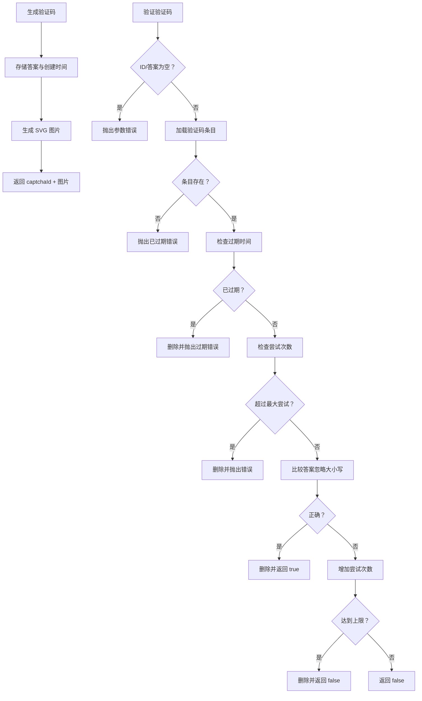

**图表来源**
- [backend/src/modules/auth/captcha.service.ts:58-122](file://backend/src/modules/auth/captcha.service.ts#L58-L122)
- [backend/src/modules/auth/captcha.service.ts:223-236](file://backend/src/modules/auth/captcha.service.ts#L223-L236)
- [backend/src/modules/auth/captcha.service.ts:241-257](file://backend/src/modules/auth/captcha.service.ts#L241-L257)

**章节来源**
- [backend/src/modules/auth/captcha.service.ts:31-258](file://backend/src/modules/auth/captcha.service.ts#L31-L258)

### 忘记密码与重置密码流程
- 忘记密码：验证手机号与验证码后生成一次性重置令牌，令牌有效期 10 分钟，定期清理过期令牌
- 重置密码：使用重置令牌与新密码更新用户密码，令牌使用后立即删除

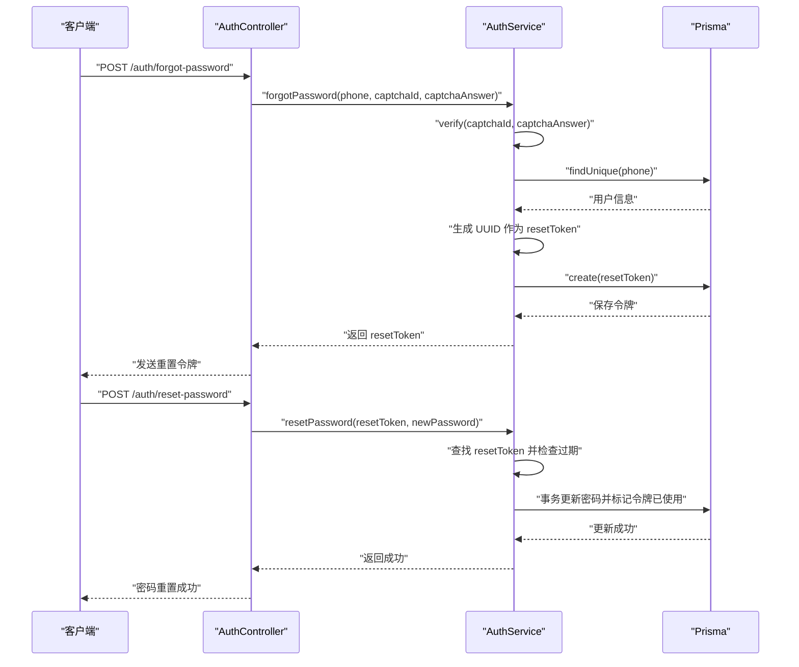

**图表来源**
- [backend/src/modules/auth/auth.controller.ts:55-68](file://backend/src/modules/auth/auth.controller.ts#L55-L68)
- [backend/src/modules/auth/auth.service.ts:170-246](file://backend/src/modules/auth/auth.service.ts#L170-L246)
- [backend/prisma/schema.prisma:171-183](file://backend/prisma/schema.prisma#L171-L183)

**章节来源**
- [backend/src/modules/auth/auth.controller.ts:55-68](file://backend/src/modules/auth/auth.controller.ts#L55-L68)
- [backend/src/modules/auth/auth.service.ts:170-246](file://backend/src/modules/auth/auth.service.ts#L170-L246)

### **新增**：微信登录认证功能
- 小程序微信登录：通过 wx.login 获取 code，调用 /auth/wechat/mp-login 接口完成登录
- App 微信登录：通过微信 OpenSDK 获取 code，调用 /auth/wechat/app-login 接口完成登录
- 自动绑定微信：手机号登录时可选择自动绑定微信，实现混合账户模式
- 微信用户信息：支持获取微信昵称和头像，丰富用户资料

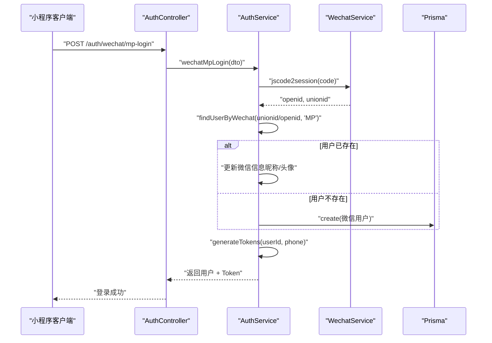

**图表来源**
- [backend/src/modules/auth/auth.controller.ts:62-84](file://backend/src/modules/auth/auth.controller.ts#L62-L84)
- [backend/src/modules/auth/auth.service.ts:397-429](file://backend/src/modules/auth/auth.service.ts#L397-L429)
- [backend/src/modules/auth/wechat.service.ts:37-73](file://backend/src/modules/auth/wechat.service.ts#L37-L73)

**章节来源**
- [backend/src/modules/auth/auth.controller.ts:62-84](file://backend/src/modules/auth/auth.controller.ts#L62-L84)
- [backend/src/modules/auth/auth.service.ts:397-429](file://backend/src/modules/auth/auth.service.ts#L397-L429)
- [backend/src/modules/auth/wechat.service.ts:37-73](file://backend/src/modules/auth/wechat.service.ts#L37-L73)

### **新增**：微信服务组件（WechatService）
- 小程序登录：jscode2session 实现小程序 code 到 openid/unionid 的转换
- App 登录：appOauthAccessToken 实现 App 端 code 到 access_token 的转换
- 用户信息：getAppUserInfo 拉取微信用户昵称和头像信息
- 测试模式：开发环境下提供 mock 数据，便于前端调试
- 错误处理：统一的微信 API 错误处理和日志记录

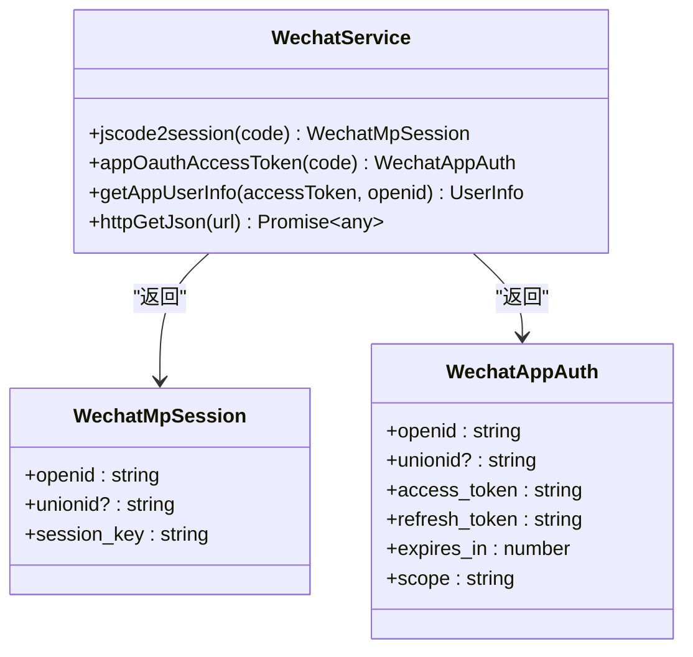

**图表来源**
- [backend/src/modules/auth/wechat.service.ts:30-166](file://backend/src/modules/auth/wechat.service.ts#L30-L166)

**章节来源**
- [backend/src/modules/auth/wechat.service.ts:30-166](file://backend/src/modules/auth/wechat.service.ts#L30-L166)

### **新增**：混合账户管理机制
- 双重认证：支持手机号+密码和微信两种登录方式
- 自动绑定：手机号登录时可自动绑定微信，提升用户体验
- 手动绑定：已登录账号可手动绑定/解绑微信
- 账户状态：needBindPhone 字段指示是否需要绑定手机号
- 绑定状态：hasPhone、hasWechatMp、hasWechatApp 字段跟踪绑定状态

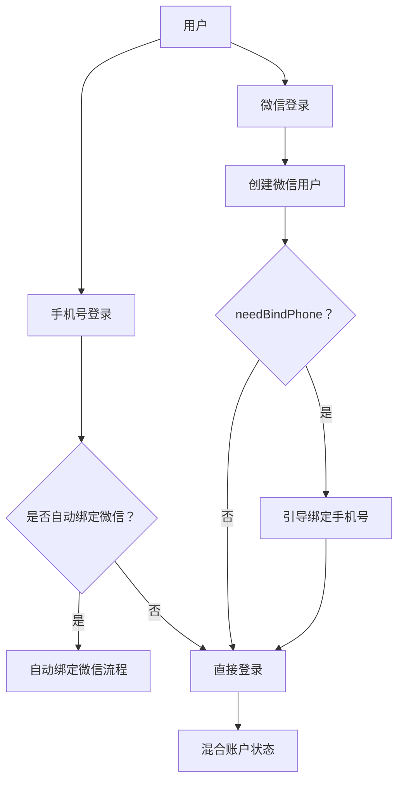

**图表来源**
- [backend/src/modules/auth/auth.service.ts:353-367](file://backend/src/modules/auth/auth.service.ts#L353-L367)
- [backend/src/modules/auth/auth.service.ts:621-656](file://backend/src/modules/auth/auth.service.ts#L621-L656)

**章节来源**
- [backend/src/modules/auth/auth.service.ts:353-367](file://backend/src/modules/auth/auth.service.ts#L353-L367)
- [backend/src/modules/auth/auth.service.ts:621-656](file://backend/src/modules/auth/auth.service.ts#L621-L656)

### **新增**：微信绑定/解绑功能
- 绑定流程：验证 code 有效性，检查是否已被其他账号占用，执行绑定操作
- 解绑流程：要求账号已绑定手机号和密码，避免账号被锁死
- 冲突检测：防止同一微信被多个账号绑定
- 审计日志：记录所有绑定解绑操作的详细信息
- 跨平台支持：支持小程序和 App 两端的微信绑定

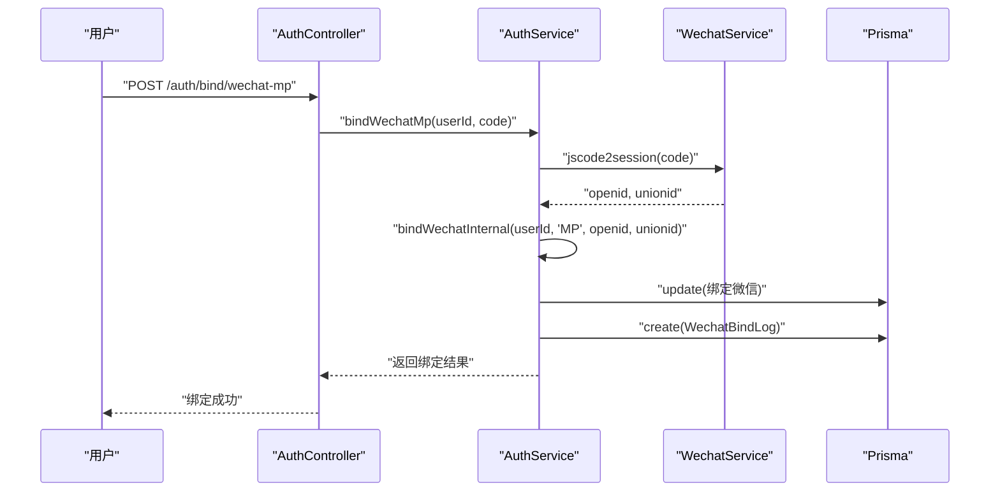

**图表来源**
- [backend/src/modules/auth/auth.controller.ts:101-129](file://backend/src/modules/auth/auth.controller.ts#L101-L129)
- [backend/src/modules/auth/auth.service.ts:530-585](file://backend/src/modules/auth/auth.service.ts#L530-L585)

**章节来源**
- [backend/src/modules/auth/auth.controller.ts:101-129](file://backend/src/modules/auth/auth.controller.ts#L101-L129)
- [backend/src/modules/auth/auth.service.ts:530-585](file://backend/src/modules/auth/auth.service.ts#L530-L585)

### **新增**：微信登录审计日志
- 日志记录：记录微信绑定、解绑、自动绑定等操作的详细信息
- 审计内容：包含用户ID、操作类型、平台、详细信息、IP地址等
- 数据持久化：使用 WechatBindLog 模型存储审计日志
- 异常处理：日志记录失败不影响主流程执行

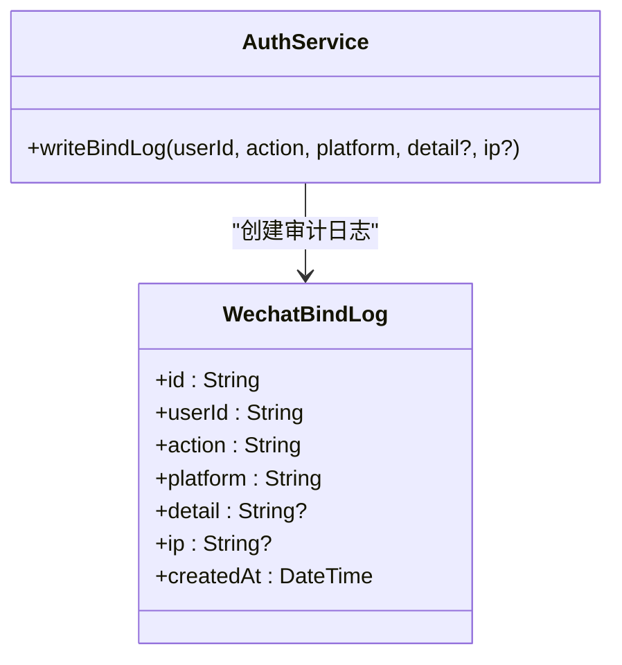

**图表来源**
- [backend/prisma/schema.prisma:61-73](file://backend/prisma/schema.prisma#L61-L73)
- [backend/src/modules/auth/auth.service.ts:372-392](file://backend/src/modules/auth/auth.service.ts#L372-L392)

**章节来源**
- [backend/prisma/schema.prisma:61-73](file://backend/prisma/schema.prisma#L61-L73)
- [backend/src/modules/auth/auth.service.ts:372-392](file://backend/src/modules/auth/auth.service.ts#L372-L392)

### **新增**：前端微信登录集成
- React Native App：通过 services/wechat.ts 提供微信 SDK 封装，当前为 stub 实现
- 小程序：通过 freeDressWechat/pages/login/login.js 实现微信一键登录
- API 封装：通过 auth.ts 提供微信登录相关 API 调用方法
- 状态管理：集成到现有的认证状态管理系统中
- 用户体验：支持微信头像和昵称的自动获取

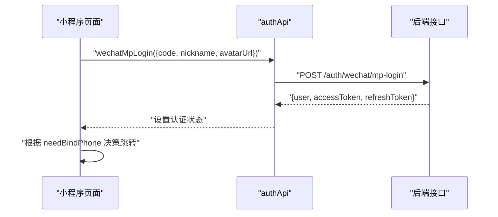

**图表来源**
- [freeDressWechat/pages/login/login.js:77-133](file://freeDressWechat/pages/login/login.js#L77-L133)
- [freeDressWechat/utils/api.js:26-32](file://freeDressWechat/utils/api.js#L26-L32)

**章节来源**
- [FreeDressApp/src/services/wechat.ts:16-38](file://FreeDressApp/src/services/wechat.ts#L16-L38)
- [FreeDressApp/src/api/auth.ts:106-155](file://FreeDressApp/src/api/auth.ts#L106-L155)
- [freeDressWechat/pages/login/login.js:77-133](file://freeDressWechat/pages/login/login.js#L77-L133)
- [freeDressWechat/utils/api.js:26-32](file://freeDressWechat/utils/api.js#L26-L32)

### 客户端集成指南
- API 封装：前端通过 auth.ts 封装认证相关接口，包括获取验证码、注册、登录、忘记密码、重置密码、刷新 Token、获取当前用户信息、**新增**：微信登录、微信绑定、微信解绑
- 状态管理：使用 authStore.ts 管理认证状态，持久化存储访问令牌、刷新令牌与用户信息
- 类型定义：统一的响应与登录返回类型，便于前后端契约一致
- 常量配置：API 基础地址、存储键名等集中管理
- 页面集成：LoginScreen、AccountSecurityScreen、BindPhoneScreen、**新增**：微信登录页面提供完整的微信认证流程
- **新增**：微信 SDK 封装：services/wechat.ts 提供微信登录的 SDK 封装，当前为 stub 实现，后续可替换为真实 SDK

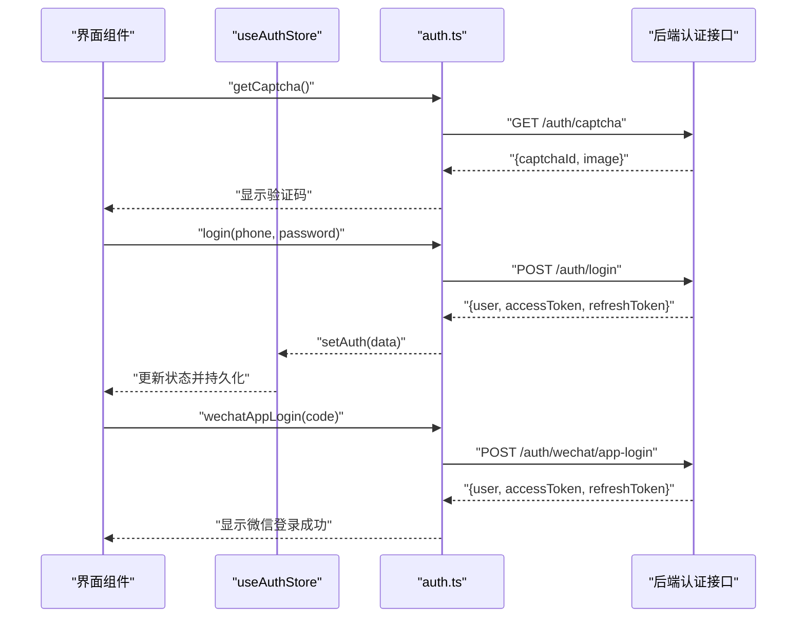

**图表来源**
- [FreeDressApp/src/api/auth.ts:12-101](file://FreeDressApp/src/api/auth.ts#L12-L101)
- [FreeDressApp/src/store/authStore.ts:28-123](file://FreeDressApp/src/store/authStore.ts#L28-L123)
- [FreeDressApp/src/types/index.ts:59-71](file://FreeDressApp/src/types/index.ts#L59-L71)
- [FreeDressApp/src/constants/index.ts:9-205](file://FreeDressApp/src/constants/index.ts#L9-L205)

**章节来源**
- [FreeDressApp/src/api/auth.ts:12-101](file://FreeDressApp/src/api/auth.ts#L12-L101)
- [FreeDressApp/src/store/authStore.ts:28-123](file://FreeDressApp/src/store/authStore.ts#L28-L123)
- [FreeDressApp/src/types/index.ts:59-71](file://FreeDressApp/src/types/index.ts#L59-L71)
- [FreeDressApp/src/constants/index.ts:9-205](file://FreeDressApp/src/constants/index.ts#L9-L205)

## 依赖关系分析
- 模块导入：AppModule 导入 AuthModule，使认证模块成为应用的一部分
- 控制器依赖：AuthController 依赖 AuthService 与 CaptchaService
- 服务依赖：AuthService 依赖 JwtService、PrismaService、CaptchaService、WechatService
- 策略依赖：JwtStrategy 依赖 AuthService
- 守卫与装饰器：JwtAuthGuard 继承自 AuthGuard('jwt')，**新增**：CustomThrottlerGuard 继承自 ThrottlerGuard，CurrentUser 装饰器从请求上下文提取用户信息
- **新增**：WechatService 依赖 Node.js https 模块进行微信 API 调用
- **新增**：ResetToken 模型依赖 PrismaService 进行数据库操作
- **新增**：WechatBindLog 模型依赖 PrismaService 进行审计日志存储

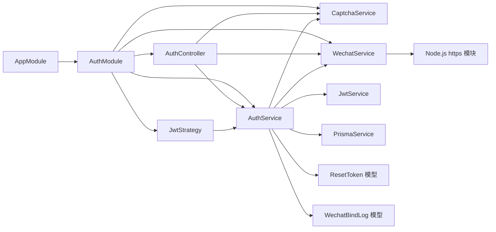

**图表来源**
- [backend/src/app.module.ts:13-32](file://backend/src/app.module.ts#L13-L32)
- [backend/src/modules/auth/auth.module.ts:13-29](file://backend/src/modules/auth/auth.module.ts#L13-L29)
- [backend/src/modules/auth/auth.controller.ts:17-22](file://backend/src/modules/auth/auth.controller.ts#L17-L22)
- [backend/src/modules/auth/auth.service.ts:24-37](file://backend/src/modules/auth/auth.service.ts#L24-L37)
- [backend/src/modules/auth/strategies/jwt.strategy.ts:11-21](file://backend/src/modules/auth/strategies/jwt.strategy.ts#L11-L21)
- [backend/src/common/guards/custom-throttler.guard.ts:1-2](file://backend/src/common/guards/custom-throttler.guard.ts#L1-L2)

**章节来源**
- [backend/src/app.module.ts:13-32](file://backend/src/app.module.ts#L13-L32)
- [backend/src/modules/auth/auth.module.ts:13-29](file://backend/src/modules/auth/auth.module.ts#L13-L29)

## 性能考虑
- Token 生成：访问令牌与刷新令牌采用异步并发生成，减少往返延迟
- 定时清理：验证码与重置令牌定期清理，避免内存泄漏
- 限流策略：IP 限流与尝试次数限制降低暴力破解风险
- 响应格式：全局拦截器统一响应格式，便于前端处理与缓存
- **新增**：微信 API 调用：WechatService 使用 Node.js 原生 https 模块，避免额外依赖开销
- **新增**：测试模式：开发环境下使用 mock 数据，避免真实的微信 API 调用
- **新增**：数据库事务优化：密码重置使用事务批量操作，提高数据库操作效率
- **新增**：精准限流：CustomThrottlerGuard 实现按用户维度的精确限流，避免误伤正常用户

## 故障排除指南
- 参数校验失败：检查 DTO 规则与请求体字段，确保手机号格式、密码长度、验证码长度符合要求
- 验证码错误：确认 captchaId 与 captchaAnswer 正确，验证码 2 分钟过期，单个验证码最多 3 次尝试
- 用户不存在或密码错误：确认手机号是否已注册，密码是否匹配
- Token 过期或无效：使用刷新接口获取新的访问令牌
- 未登录访问受保护接口：JwtAuthGuard 会抛出未授权异常，需先完成登录
- 密码重置失败：确认 resetToken 有效且未过期，新密码长度符合要求
- **新增**：微信登录失败：检查微信 AppID/Secret 配置，确认 code 有效性
- **新增**：微信绑定冲突：确认微信未被其他账号绑定，检查 unionid 和 openid 的唯一性
- **新增**：微信 SDK 未集成：前端调用 sendAuthRequest 会抛出错误，需等待 SDK 集成完成
- **新增**：速率限制错误：检查请求频率是否超过限流阈值，已认证用户按用户维度限流，未认证用户按 IP 限流
- **新增**：密码修改失败：确认旧密码正确，新密码长度在 6-20 位之间

**章节来源**
- [backend/src/modules/auth/auth.service.ts:98-135](file://backend/src/modules/auth/auth.service.ts#L98-L135)
- [backend/src/modules/auth/captcha.service.ts:87-122](file://backend/src/modules/auth/captcha.service.ts#L87-L122)
- [backend/src/common/guards/jwt-auth.guard.ts:14-20](file://backend/src/common/guards/jwt-auth.guard.ts#L14-L20)
- [backend/src/common/guards/custom-throttler.guard.ts:11-20](file://backend/src/common/guards/custom-throttler.guard.ts#L11-L20)
- [backend/src/modules/auth/wechat.service.ts:44-52](file://backend/src/modules/auth/wechat.service.ts#L44-52)

## 结论
认证模块通过清晰的职责分离与严格的数据验证，构建了安全可靠的用户认证体系。JWT 策略与 Passport 的集成提供了标准化的身份验证流程，验证码服务增强了抗自动化能力，密码重置功能完善了用户账户安全管理。**新增的微信登录功能通过 WechatService 组件实现了微信开放平台的深度集成，支持小程序和App双端登录，提供混合账户管理模式，满足不同用户的登录偏好。微信绑定/解绑功能提供了灵活的账户关联策略，微信绑定审计日志确保了操作的可追溯性。前端通过 services/wechat.ts 提供了统一的微信 SDK 封装接口，为后续正式启用微信登录奠定了基础。** 前端状态管理与 API 封装提升了用户体验，忘记密码、重置密码、修改密码和微信登录页面提供了完整的认证流程。建议在生产环境中完善微信 SDK 的正式集成，并加强微信登录的安全防护和监控告警机制。

## 附录

### API 接口调用示例
- 获取验证码
  - GET /api/auth/captcha
- 用户注册
  - POST /api/auth/register
  - 请求体字段：phone, password, captchaId, captchaAnswer, nickname(可选)
- 用户登录
  - POST /api/auth/login
  - 请求体字段：phone, password
- **新增**：小程序微信登录
  - POST /api/auth/wechat/mp-login
  - 请求体字段：code, nickname(可选), avatarUrl(可选)
- **新增**：App 微信登录
  - POST /api/auth/wechat/app-login
  - 请求体字段：code
- **新增**：绑定手机号（已登录态）
  - POST /api/auth/bind/phone
  - 请求体字段：phone, password, captchaId, captchaAnswer
- **新增**：绑定小程序微信（已登录态）
  - POST /api/auth/bind/wechat-mp
  - 请求体字段：code
- **新增**：绑定 App 微信（已登录态）
  - POST /api/auth/bind/wechat-app
  - 请求体字段：code
- **新增**：解绑微信（已登录态）
  - POST /api/auth/unbind/wechat
  - 请求体字段：platform('APP'|'MP')
- 忘记密码
  - POST /api/auth/forgot-password
  - 请求体字段：phone, captchaId, captchaAnswer
- 重置密码
  - POST /api/auth/reset-password
  - 请求体字段：resetToken, newPassword
- 刷新 Token
  - POST /api/auth/refresh
  - 需携带 Bearer Token
- 获取当前用户信息
  - GET /api/auth/profile
  - 需携带 Bearer Token
- 修改密码
  - POST /api/auth/change-password
  - 请求体字段：oldPassword, newPassword
  - 需携带 Bearer Token

**章节来源**
- [backend/src/modules/auth/auth.controller.ts:27-105](file://backend/src/modules/auth/auth.controller.ts#L27-L105)
- [FreeDressApp/src/api/auth.ts:12-155](file://FreeDressApp/src/api/auth.ts#L12-L155)

### 前端页面集成示例
- 登录页面：提供手机号+密码登录，支持微信登录入口
- **新增**：账号安全页面：显示手机号绑定状态，提供微信绑定/解绑入口
- **新增**：绑定手机号页面：面向纯微信注册用户，提供手机号绑定功能
- **新增**：微信登录页面：小程序端实现微信一键登录，支持头像昵称获取
- 认证状态管理：使用 Zustand 管理用户认证状态，支持本地存储持久化
- **新增**：微信 SDK 封装：services/wechat.ts 提供微信登录的 SDK 封装接口

**章节来源**
- [FreeDressApp/src/screens/LoginScreen.tsx:1-327](file://FreeDressApp/src/screens/LoginScreen.tsx#L1-L327)
- [FreeDressApp/src/screens/AccountSecurityScreen.tsx:1-232](file://FreeDressApp/src/screens/AccountSecurityScreen.tsx#L1-L232)
- [FreeDressApp/src/screens/BindPhoneScreen.tsx:1-277](file://FreeDressApp/src/screens/BindPhoneScreen.tsx#L1-L277)
- [freeDressWechat/pages/login/login.js:70-143](file://freeDressWechat/pages/login/login.js#L70-L143)
- [FreeDressApp/src/store/authStore.ts:28-123](file://FreeDressApp/src/store/authStore.ts#L28-L123)
- [FreeDressApp/src/services/wechat.ts:16-38](file://FreeDressApp/src/services/wechat.ts#L16-L38)

### 微信登录配置指南
- 环境变量配置：
  - WECHAT_MP_APPID：小程序 AppID
  - WECHAT_MP_SECRET：小程序 Secret
  - WECHAT_APP_APPID：App 应用 AppID
  - WECHAT_APP_SECRET：App 应用 Secret
- 开发环境：未配置时使用 mock 模式，便于前端调试
- 生产环境：必须正确配置微信应用信息，否则微信登录功能不可用
- SDK 集成：App 端微信登录需要集成 react-native-wechat-lib SDK

**章节来源**
- [backend/src/modules/auth/wechat.service.ts:37-52](file://backend/src/modules/auth/wechat.service.ts#L37-L52)
- [backend/src/modules/auth/wechat.service.ts:78-94](file://backend/src/modules/auth/wechat.service.ts#L78-L94)
- [FreeDressApp/src/services/wechat.ts:23-38](file://FreeDressApp/src/services/wechat.ts#L23-L38)