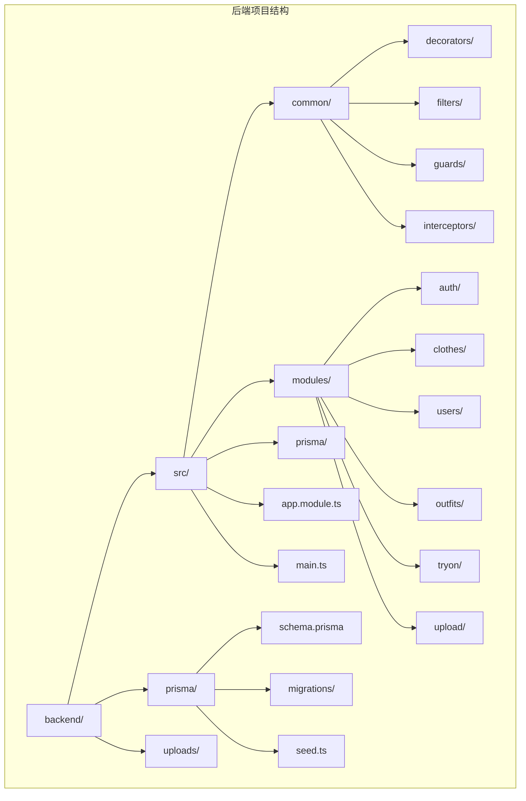
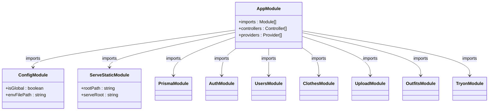
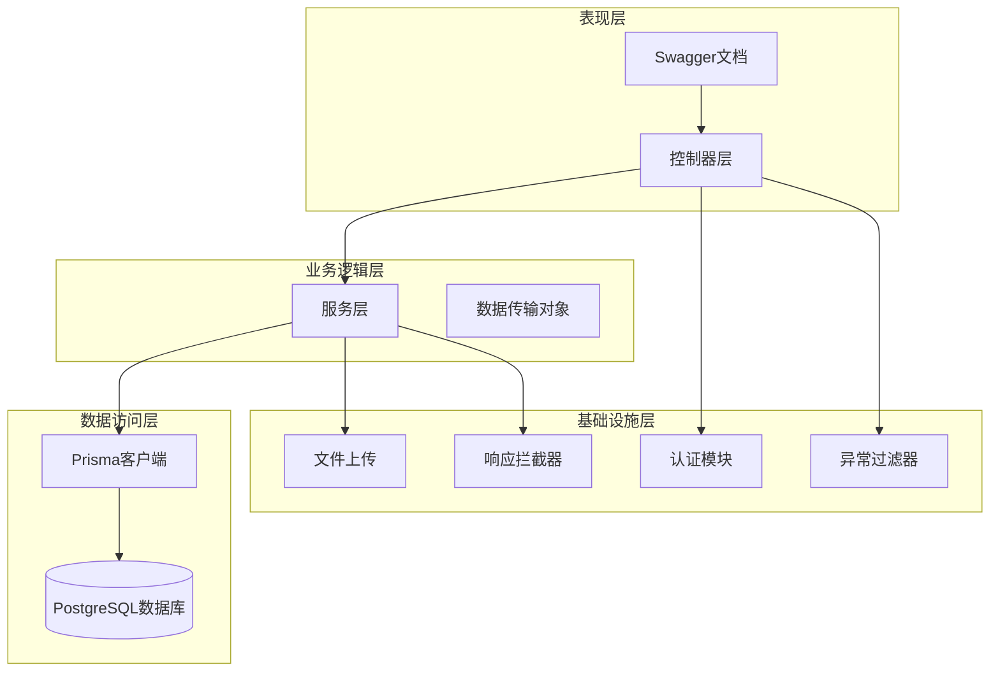
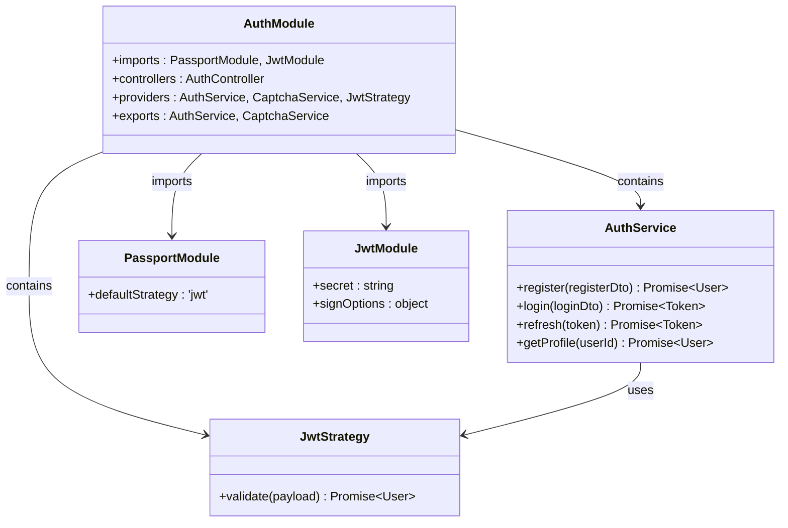
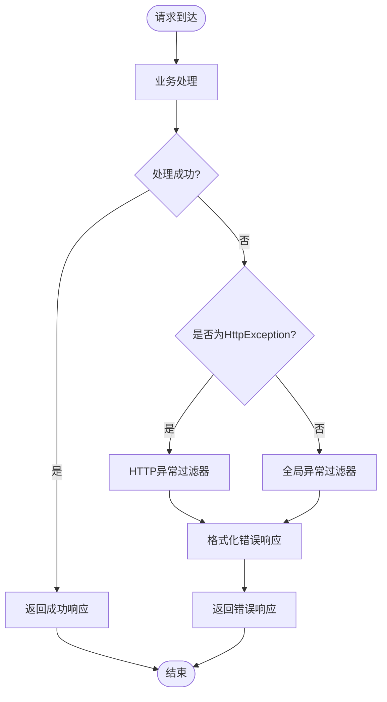
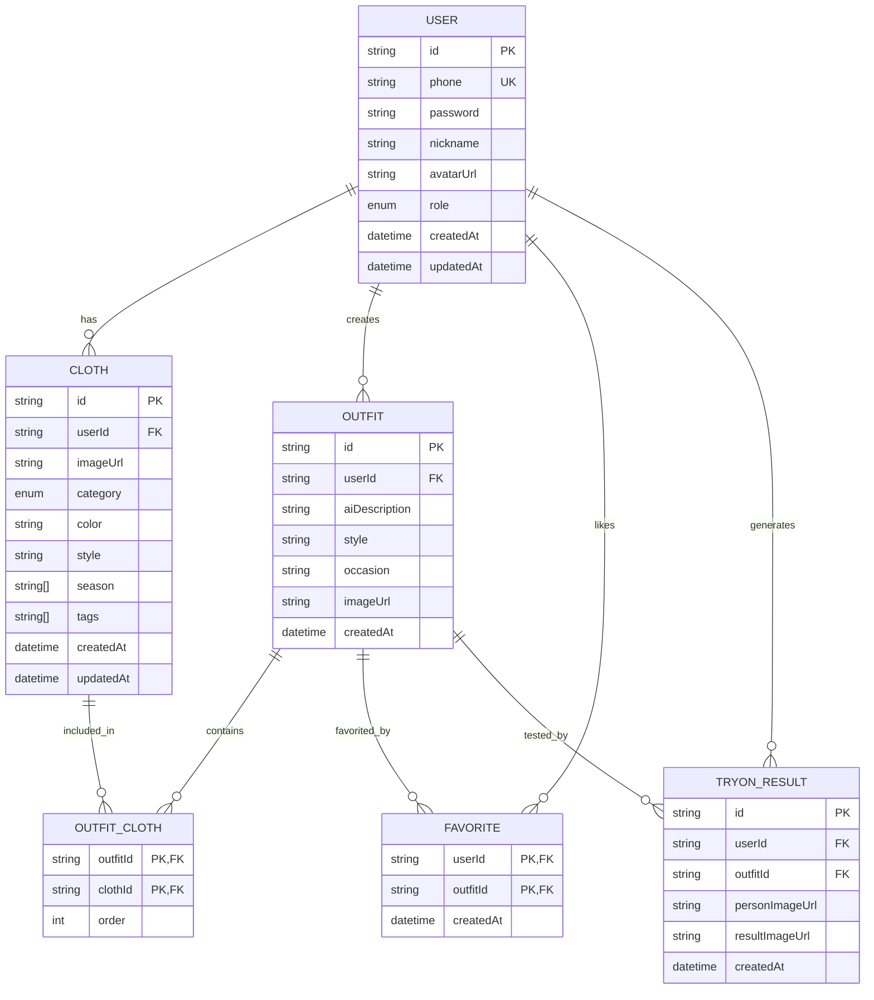
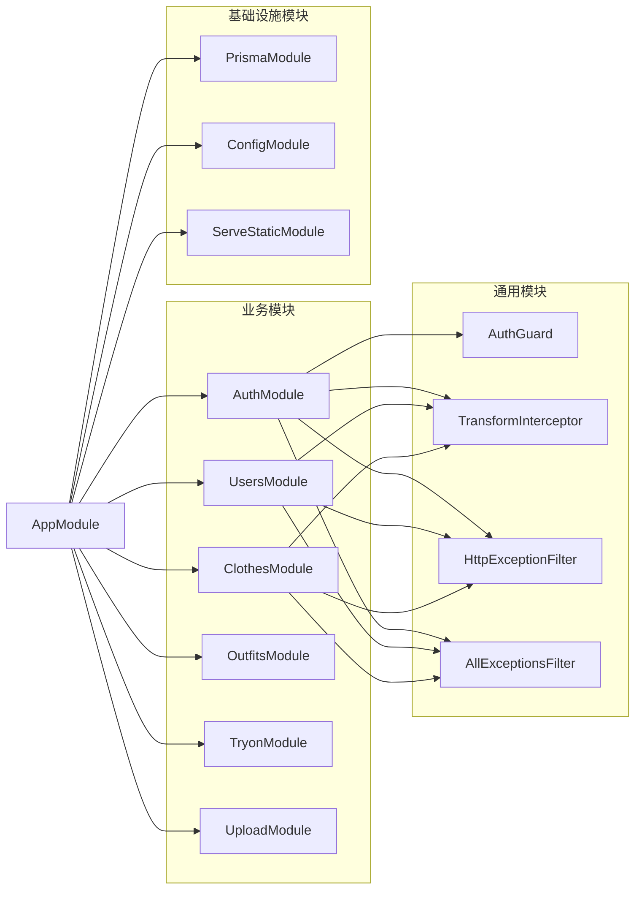

# 项目结构说明

<cite>
**本文档引用的文件**
- [backend/src/app.module.ts](file://backend/src/app.module.ts)
- [backend/src/main.ts](file://backend/src/main.ts)
- [backend/package.json](file://backend/package.json)
- [backend/tsconfig.json](file://backend/tsconfig.json)
- [backend/README.md](file://backend/README.md)
- [backend/src/modules/auth/auth.module.ts](file://backend/src/modules/auth/auth.module.ts)
- [backend/src/modules/clothes/clothes.module.ts](file://backend/src/modules/clothes/clothes.module.ts)
- [backend/src/modules/users/users.module.ts](file://backend/src/modules/users/users.module.ts)
- [backend/src/common/interceptors/transform.interceptor.ts](file://backend/src/common/interceptors/transform.interceptor.ts)
- [backend/src/common/filters/http-exception.filter.ts](file://backend/src/common/filters/http-exception.filter.ts)
- [backend/prisma/schema.prisma](file://backend/prisma/schema.prisma)
- [backend/prisma/migrations/20260507090458_init/migration.sql](file://backend/prisma/migrations/20260507090458_init/migration.sql)
</cite>

## 目录
1. [简介](#简介)
2. [项目结构](#项目结构)
3. [核心组件](#核心组件)
4. [架构概览](#架构概览)
5. [详细组件分析](#详细组件分析)
6. [依赖分析](#依赖分析)
7. [性能考虑](#性能考虑)
8. [故障排除指南](#故障排除指南)
9. [结论](#结论)
10. [附录](#附录)

## 简介

畅搭(FreeDress)后端是一个基于NestJS框架构建的RESTful API服务，为智能衣物搭配平台提供数据支持。该项目采用现代化的TypeScript开发环境，集成了JWT认证、Prisma ORM、Swagger文档等企业级特性。

## 项目结构

畅搭后端项目遵循NestJS的标准目录结构，采用模块化设计原则，将不同功能域分离到独立的模块中。整体项目结构清晰，便于维护和扩展。



**图表来源**
- [backend/src/app.module.ts:1-33](file://backend/src/app.module.ts#L1-L33)
- [backend/src/main.ts:1-62](file://backend/src/main.ts#L1-L62)

**章节来源**
- [backend/README.md:119-154](file://backend/README.md#L119-L154)
- [backend/src/app.module.ts:1-33](file://backend/src/app.module.ts#L1-L33)

## 核心组件

### 根模块设计

AppModule作为整个应用的根模块，负责协调各个子模块的加载和配置。它采用了模块化的架构设计，将不同的业务功能分离到独立的模块中，实现了高内聚、低耦合的设计原则。



**图表来源**
- [backend/src/app.module.ts:13-31](file://backend/src/app.module.ts#L13-L31)

### 启动流程

main.ts文件定义了应用的启动流程，包含了全局中间件、管道、拦截器和过滤器的配置。该文件展示了NestJS应用的标准启动模式。

**章节来源**
- [backend/src/main.ts:12-62](file://backend/src/main.ts#L12-L62)

## 架构概览

畅搭后端采用分层架构设计，结合模块化开发模式，形成了清晰的职责分离：



**图表来源**
- [backend/src/app.module.ts:14-30](file://backend/src/app.module.ts#L14-L30)
- [backend/src/main.ts:15-48](file://backend/src/main.ts#L15-L48)

## 详细组件分析

### 认证模块

认证模块是系统的核心安全组件，实现了完整的用户认证和授权流程。



**图表来源**
- [backend/src/modules/auth/auth.module.ts:13-29](file://backend/src/modules/auth/auth.module.ts#L13-L29)

**章节来源**
- [backend/src/modules/auth/auth.module.ts:1-30](file://backend/src/modules/auth/auth.module.ts#L1-L30)

### 通用拦截器

响应拦截器统一了API的响应格式，确保所有接口返回一致的数据结构。

```mermaid
sequenceDiagram
participant Client as 客户端
participant Controller as 控制器
participant Interceptor as 响应拦截器
participant Service as 业务服务
Client->>Controller : 发送请求
Controller->>Service : 调用业务逻辑
Service-->>Controller : 返回数据
Controller->>Interceptor : 处理响应
Interceptor->>Interceptor : 统一格式化
Interceptor-->>Client : 返回标准化响应
Note over Interceptor : {
code : 200,
message : 'success',
data : *,
timestamp : '2024-01-01T00 : 00 : 00Z'
}
```

**图表来源**
- [backend/src/common/interceptors/transform.interceptor.ts:19-31](file://backend/src/common/interceptors/transform.interceptor.ts#L19-L31)

**章节来源**
- [backend/src/common/interceptors/transform.interceptor.ts:1-32](file://backend/src/common/interceptors/transform.interceptor.ts#L1-L32)

### 异常处理过滤器

异常过滤器提供了统一的错误处理机制，确保系统在出现异常时能够返回友好的错误信息。



**图表来源**
- [backend/src/common/filters/http-exception.filter.ts:8-80](file://backend/src/common/filters/http-exception.filter.ts#L8-L80)

**章节来源**
- [backend/src/common/filters/http-exception.filter.ts:1-81](file://backend/src/common/filters/http-exception.filter.ts#L1-L81)

### 数据模型设计

系统采用Prisma进行数据库建模，定义了完整的数据实体关系。



**图表来源**
- [backend/prisma/schema.prisma:14-131](file://backend/prisma/schema.prisma#L14-L131)

**章节来源**
- [backend/prisma/schema.prisma:1-132](file://backend/prisma/schema.prisma#L1-L132)

## 依赖分析

### 核心依赖关系

```mermaid
graph TB
subgraph "运行时依赖"
NestCore[@nestjs/core]
NestCommon[@nestjs/common]
NestConfig[@nestjs/config]
NestJwt[@nestjs/jwt]
NestPassport[@nestjs/passport]
NestExpress[@nestjs/platform-express]
NestServeStatic[@nestjs/serve-static]
NestSwagger[@nestjs/swagger]
PrismaClient[@prisma/client]
Bcrypt[bcryptjs]
ClassValidator[class-validator]
ClassTransformer[class-transformer]
Passport[passport]
PassportJwt[passport-jwt]
RxJS[rxjs]
UUID[uuid]
end
subgraph "开发依赖"
NestCLI[@nestjs/cli]
Typescript[typescript]
ESLint[eslint]
Prettier[prettier]
Jest[jest]
Prisma[prisma]
TSNode[ts-node]
end
AppModule --> NestCore
AppModule --> NestCommon
AppModule --> NestConfig
AppModule --> NestJwt
AppModule --> NestPassport
AppModule --> NestExpress
AppModule --> NestServeStatic
AppModule --> NestSwagger
AppModule --> PrismaClient
AppModule --> Bcrypt
AppModule --> ClassValidator
AppModule --> ClassTransformer
AppModule --> Passport
AppModule --> PassportJwt
AppModule --> RxJS
AppModule --> UUID
```

**图表来源**
- [backend/package.json:26-72](file://backend/package.json#L26-L72)

### 模块间依赖



**图表来源**
- [backend/src/app.module.ts:14-30](file://backend/src/app.module.ts#L14-L30)

**章节来源**
- [backend/package.json:1-91](file://backend/package.json#L1-L91)

## 性能考虑

### 编译配置优化

项目采用了多项TypeScript编译优化策略：

- **目标版本**: ES2021，充分利用现代JavaScript特性
- **模块系统**: CommonJS，兼容Node.js运行时
- **装饰器支持**: 启用实验性装饰器元数据
- **路径映射**: 配置了多个别名路径，提高代码可读性
- **增量编译**: 启用增量编译提升构建速度

### 运行时性能

- **全局管道**: 统一请求验证和数据转换
- **响应拦截器**: 减少重复的响应格式化代码
- **异常过滤器**: 提供统一的错误处理机制
- **静态资源服务**: 直接提供上传文件访问

## 故障排除指南

### 常见问题解决

1. **数据库连接失败**
   - 检查DATABASE_URL环境变量配置
   - 确认PostgreSQL服务正常运行
   - 验证数据库凭据正确性

2. **JWT认证失败**
   - 确认JWT_SECRET环境变量设置
   - 检查Token过期时间配置
   - 验证用户状态有效性

3. **文件上传问题**
   - 检查uploads目录权限
   - 确认文件大小限制配置
   - 验证MIME类型白名单

**章节来源**
- [backend/src/common/filters/http-exception.filter.ts:68-70](file://backend/src/common/filters/http-exception.filter.ts#L68-L70)

## 结论

畅搭后端项目展现了现代Node.js应用的最佳实践，通过模块化设计、统一的架构模式和完善的基础设施配置，为后续的功能扩展奠定了坚实基础。项目结构清晰、职责明确，便于团队协作和长期维护。

## 附录

### 开发环境配置

1. **环境要求**
   - Node.js >= 20.10.0
   - PostgreSQL >= 16.0
   - npm >= 10.0.0

2. **初始化步骤**
   ```bash
   cd backend
   npm install
   cp .env.example .env
   ```

3. **数据库设置**
   ```bash
   npm run prisma:generate
   npm run prisma:migrate
   ```

4. **启动应用**
   ```bash
   # 开发模式
   npm run start:dev
   
   # 生产模式
   npm run build
   npm run start:prod
   ```

**章节来源**
- [backend/README.md:57-109](file://backend/README.md#L57-L109)