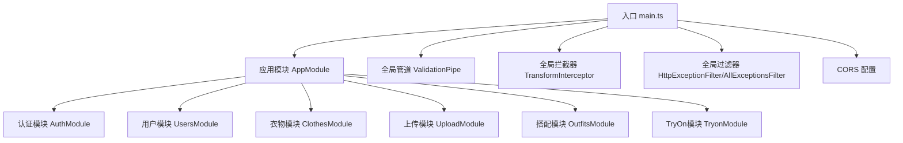
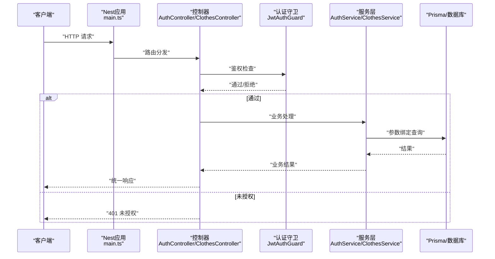
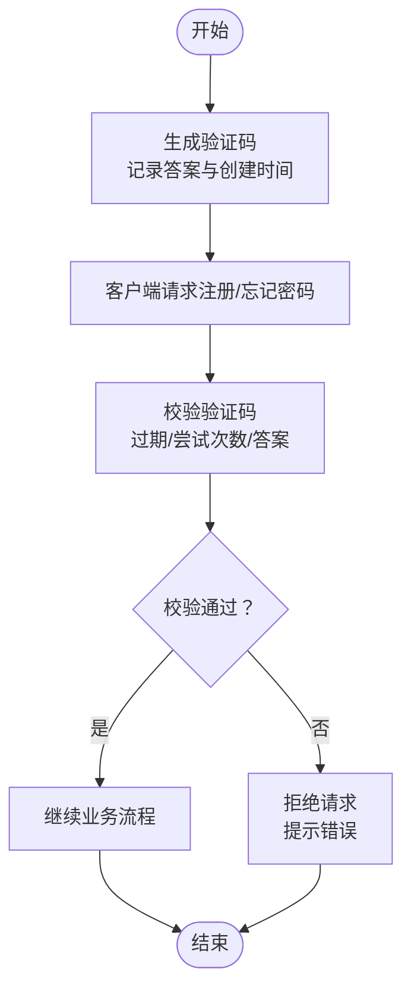
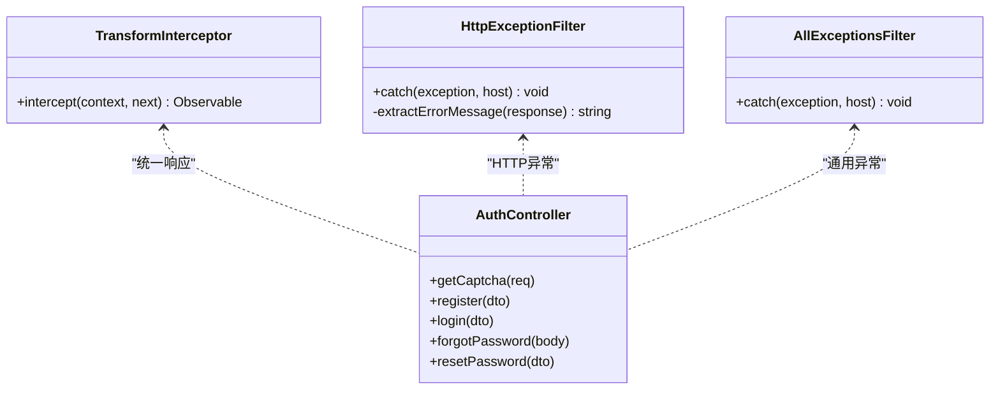
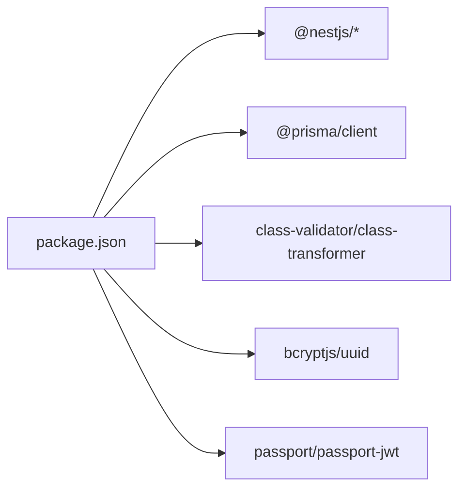

# API防护

<cite>
**本文引用的文件**
- [main.ts](file://backend/src/main.ts)
- [app.module.ts](file://backend/src/app.module.ts)
- [jwt-auth.guard.ts](file://backend/src/common/guards/jwt-auth.guard.ts)
- [http-exception.filter.ts](file://backend/src/common/filters/http-exception.filter.ts)
- [transform.interceptor.ts](file://backend/src/common/interceptors/transform.interceptor.ts)
- [auth.controller.ts](file://backend/src/modules/auth/auth.controller.ts)
- [auth.service.ts](file://backend/src/modules/auth/auth.service.ts)
- [captcha.service.ts](file://backend/src/modules/auth/captcha.service.ts)
- [login.dto.ts](file://backend/src/modules/auth/dto/login.dto.ts)
- [register.dto.ts](file://backend/src/modules/auth/dto/register.dto.ts)
- [clothes.controller.ts](file://backend/src/modules/clothes/clothes.controller.ts)
- [users.controller.ts](file://backend/src/modules/users/users.controller.ts)
- [package.json](file://backend/package.json)
</cite>

## 目录
1. [简介](#简介)
2. [项目结构](#项目结构)
3. [核心组件](#核心组件)
4. [架构总览](#架构总览)
5. [详细组件分析](#详细组件分析)
6. [依赖关系分析](#依赖关系分析)
7. [性能与安全特性](#性能与安全特性)
8. [故障排查指南](#故障排查指南)
9. [结论](#结论)
10. [附录](#附录)

## 简介
本文件面向畅搭（FreeDress）项目的后端API，系统化梳理并提供API安全防护开发指南。重点覆盖以下方面：
- 请求频率限制与防刷机制
- CORS跨域资源共享的安全配置与白名单管理
- API签名验证与请求参数校验
- SQL注入防护与参数绑定
- XSS跨站脚本攻击的防范策略与输出编码
- CSRF跨站请求伪造的防护方法
- API版本控制与向后兼容性安全考虑
- API监控与异常捕获最佳实践
- API安全审计与日志记录策略
- 开发者API安全开发规范

## 项目结构
后端采用NestJS框架，模块化组织认证、用户、衣物、搭配、上传、TryOn等业务模块；全局配置了统一验证管道、响应拦截器、异常过滤器与CORS。

图表来源
- [main.ts:12-52](file://backend/src/main.ts#L12-L52)
- [app.module.ts:13-30](file://backend/src/app.module.ts#L13-L30)

章节来源
- [main.ts:12-52](file://backend/src/main.ts#L12-L52)
- [app.module.ts:13-30](file://backend/src/app.module.ts#L13-L30)

## 核心组件
- 全局验证管道：启用白名单、禁止非白名单字段、自动类型转换，降低参数污染风险。
- 统一响应拦截器：标准化返回结构，便于前端与监控系统解析。
- 全局异常过滤器：HTTP异常与通用异常统一处理，避免敏感信息泄露。
- CORS：允许凭证传递，支持动态来源（需结合部署环境调整）。
- 认证守卫：基于JWT的登录态保护，未登录访问直接拒绝。
- 验证码服务：SVG图片验证码、过期时间、最大尝试次数、IP限流，有效对抗自动化注册/登录。

章节来源
- [main.ts:15-35](file://backend/src/main.ts#L15-L35)
- [transform.interceptor.ts:19-31](file://backend/src/common/interceptors/transform.interceptor.ts#L19-L31)
- [http-exception.filter.ts:8-80](file://backend/src/common/filters/http-exception.filter.ts#L8-L80)
- [jwt-auth.guard.ts:8-21](file://backend/src/common/guards/jwt-auth.guard.ts#L8-L21)
- [captcha.service.ts:30-51](file://backend/src/modules/auth/captcha.service.ts#L30-L51)

## 架构总览
下图展示从客户端到控制器、服务层与数据库的典型调用链路，以及安全控制点：

图表来源
- [main.ts:12-52](file://backend/src/main.ts#L12-L52)
- [auth.controller.ts:16-91](file://backend/src/modules/auth/auth.controller.ts#L16-L91)
- [clothes.controller.ts:24-101](file://backend/src/modules/clothes/clothes.controller.ts#L24-L101)
- [jwt-auth.guard.ts:8-21](file://backend/src/common/guards/jwt-auth.guard.ts#L8-L21)
- [auth.service.ts:24-95](file://backend/src/modules/auth/auth.service.ts#L24-L95)

## 详细组件分析

### 验证与防刷：图片验证码与限流
- 验证码生成：服务端生成带噪声干扰的SVG图片，答案存于内存Map，2分钟过期；单次验证码最多3次尝试。
- IP限流：每分钟最多10次请求，超限抛出错误。
- 注册/忘记密码流程：均需提供captchaId与captchaAnswer，服务端校验通过后继续业务处理。

图表来源
- [captcha.service.ts:58-122](file://backend/src/modules/auth/captcha.service.ts#L58-L122)
- [auth.controller.ts:27-68](file://backend/src/modules/auth/auth.controller.ts#L27-L68)
- [auth.service.ts:44-95](file://backend/src/modules/auth/auth.service.ts#L44-L95)

章节来源
- [captcha.service.ts:30-122](file://backend/src/modules/auth/captcha.service.ts#L30-L122)
- [auth.controller.ts:27-68](file://backend/src/modules/auth/auth.controller.ts#L27-L68)
- [auth.service.ts:44-95](file://backend/src/modules/auth/auth.service.ts#L44-L95)

### 参数校验与DTO约束
- 登录DTO：手机号格式校验、密码长度与字符要求。
- 注册DTO：手机号格式、密码长度、验证码ID/答案长度与必填校验、昵称可选且长度限制。
- 全局ValidationPipe：自动剔除非白名单字段、禁止非白名单属性、类型转换，减少参数污染与类型错误。

章节来源
- [login.dto.ts:7-19](file://backend/src/modules/auth/dto/login.dto.ts#L7-L19)
- [register.dto.ts:8-37](file://backend/src/modules/auth/dto/register.dto.ts#L8-L37)
- [main.ts:15-22](file://backend/src/main.ts#L15-L22)

### 认证与授权
- JWT守卫：对受保护路由进行登录态校验，失败时抛出未授权异常。
- 控制器标注：受保护接口统一添加@UseGuards(JwtAuthGuard)与@BearerAuth，确保前端携带合法Token。

章节来源
- [jwt-auth.guard.ts:8-21](file://backend/src/common/guards/jwt-auth.guard.ts#L8-L21)
- [auth.controller.ts:74-90](file://backend/src/modules/auth/auth.controller.ts#L74-L90)
- [clothes.controller.ts:26-100](file://backend/src/modules/clothes/clothes.controller.ts#L26-L100)
- [users.controller.ts:14-47](file://backend/src/modules/users/users.controller.ts#L14-L47)

### 统一响应与异常处理
- 统一响应格式：拦截器将业务返回封装为统一结构，包含状态码、消息、数据与时间戳。
- 异常过滤：HTTP异常与全局异常分别处理，开发环境打印堆栈，生产环境避免泄露细节。

图表来源
- [transform.interceptor.ts:19-31](file://backend/src/common/interceptors/transform.interceptor.ts#L19-L31)
- [http-exception.filter.ts:8-80](file://backend/src/common/filters/http-exception.filter.ts#L8-L80)
- [auth.controller.ts:27-90](file://backend/src/modules/auth/auth.controller.ts#L27-L90)

章节来源
- [transform.interceptor.ts:19-31](file://backend/src/common/interceptors/transform.interceptor.ts#L19-L31)
- [http-exception.filter.ts:8-80](file://backend/src/common/filters/http-exception.filter.ts#L8-L80)

### 数据访问与SQL注入防护
- ORM与参数绑定：服务层通过Prisma进行数据访问，Prisma默认使用参数绑定，有效防止SQL注入。
- 密码加密：bcrypt进行加盐哈希，避免明文存储与彩虹表风险。
- 令牌管理：内存Map存储重置令牌，定期清理过期令牌，缩短暴露面。

章节来源
- [auth.service.ts:54-82](file://backend/src/modules/auth/auth.service.ts#L54-L82)
- [auth.service.ts:106-134](file://backend/src/modules/auth/auth.service.ts#L106-L134)
- [auth.service.ts:247-254](file://backend/src/modules/auth/auth.service.ts#L247-L254)

### 跨域资源共享（CORS）与白名单
- 当前配置：允许任意来源origin与凭证传递credentials，适合开发联调。
- 生产建议：固定可信域名白名单，避免通配符origin带来的安全风险；严格控制headers与methods。

章节来源
- [main.ts:31-35](file://backend/src/main.ts#L31-L35)

### XSS与输出编码
- 建议策略：对所有用户可控输出进行HTML转义；模板渲染时使用安全上下文；富文本场景使用白名单过滤库。
- 当前代码未发现显式XSS处理逻辑，应在服务层或视图层补充输出编码。

[本节为概念性指导，不直接分析具体文件]

### CSRF防护
- 建议策略：对无状态的REST API，优先使用Token认证（已实现）；若需Cookie会话，启用SameSite Cookie、CSRF Token校验与双重提交Cookie。
- 当前代码以JWT为主，未见CSRF Token实现，建议在Cookie方案中引入CSRF保护。

[本节为概念性指导，不直接分析具体文件]

### API版本控制与向后兼容
- 建议策略：URL路径版本（如/api/v1）、请求头版本（Accept-Version），保持资源模型稳定与字段语义清晰；新增字段默认可选，旧字段仅标记弃用而不删除。
- 当前未见版本控制实现，建议尽快引入并制定迁移策略。

[本节为概念性指导，不直接分析具体文件]

## 依赖关系分析
- NestJS核心依赖：@nestjs/common、@nestjs/core、@nestjs/swagger、@nestjs/jwt、@nestjs/passport。
- 数据访问：@prisma/client，配合PrismaService使用参数绑定。
- 校验与转换：class-validator、class-transformer。
- 安全与工具：bcryptjs、uuid、passport-jwt。

图表来源
- [package.json:26-44](file://backend/package.json#L26-L44)

章节来源
- [package.json:26-44](file://backend/package.json#L26-L44)

## 性能与安全特性
- 验证与拦截：全局管道与拦截器在进入业务逻辑前完成参数清洗与响应标准化，减少重复代码与遗漏。
- 异常处理：统一异常过滤器避免敏感堆栈泄露，开发环境保留详细日志。
- 验证码与限流：验证码过期与尝试次数限制、IP限流，有效缓解暴力破解与自动化攻击。
- 数据访问：ORM参数绑定天然抵御SQL注入；密码哈希提升被窃数据的破解成本。
- CORS：生产环境建议收紧来源与凭证策略，避免跨站滥用。

[本节为综合概述，不直接分析具体文件]

## 故障排查指南
- 401未授权：确认Token是否正确携带、是否过期、是否被篡改；检查守卫与路由装饰器配置。
- 400参数错误：核对DTO校验规则与请求体结构；查看ValidationPipe的白名单与类型转换行为。
- 500服务器错误：查看全局异常过滤器输出；开发环境可观察控制台堆栈；生产环境避免泄露细节。
- 验证码问题：确认captchaId是否过期、尝试次数是否超限、IP是否触发限流；检查验证码生成与存储逻辑。

章节来源
- [jwt-auth.guard.ts:14-20](file://backend/src/common/guards/jwt-auth.guard.ts#L14-L20)
- [http-exception.filter.ts:50-80](file://backend/src/common/filters/http-exception.filter.ts#L50-L80)
- [captcha.service.ts:87-122](file://backend/src/modules/auth/captcha.service.ts#L87-L122)

## 结论
畅搭后端已具备基础的API安全能力：统一验证、拦截与异常处理、JWT认证、验证码与限流、ORM参数绑定等。建议在生产环境中进一步完善CORS白名单、XSS输出编码、CSRF防护、API版本控制与审计日志体系，形成闭环的安全开发与运维流程。

[本节为总结性内容，不直接分析具体文件]

## 附录

### 开发者API安全开发规范
- 输入校验：始终使用DTO与ValidationPipe，开启白名单与类型转换；避免直接使用原始请求对象。
- 认证授权：所有敏感接口使用JWT守卫；Token签发与校验遵循最小权限原则。
- 数据安全：密码使用强哈希；敏感信息脱敏；避免在日志中输出Token与密码。
- 防刷与风控：验证码+限流双因子；对异常IP与异常行为建立阻断与告警。
- 输出安全：对所有用户可控输出进行HTML转义；富文本使用白名单过滤。
- CORS与CSRF：生产环境固定白名单；无状态API优先使用Token；有状态会话启用CSRF保护。
- 版本与兼容：引入版本控制；变更遵循向后兼容策略；弃用字段明确过渡期。
- 监控与审计：统一异常与访问日志；关键操作审计留痕；建立告警与应急响应机制。

[本节为规范性指导，不直接分析具体文件]