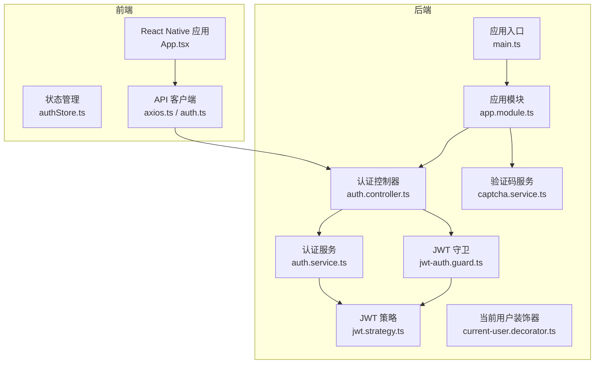
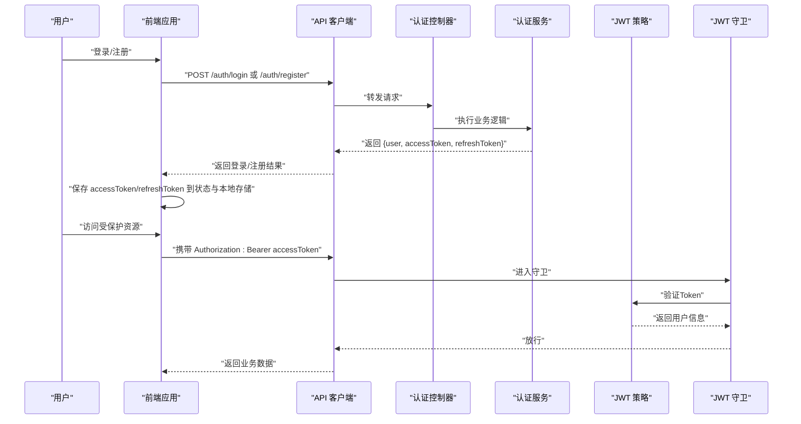
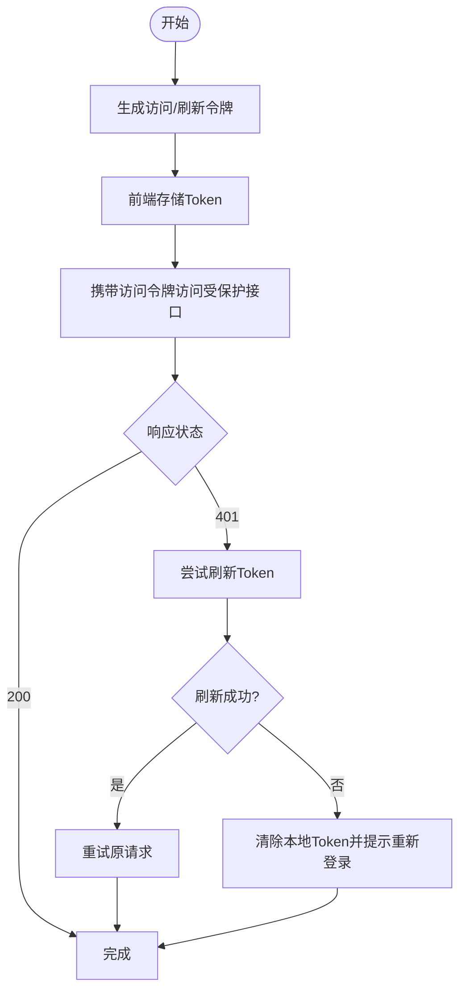
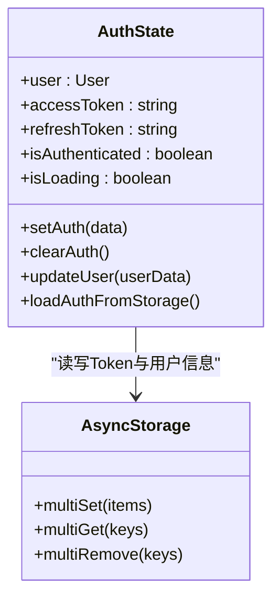
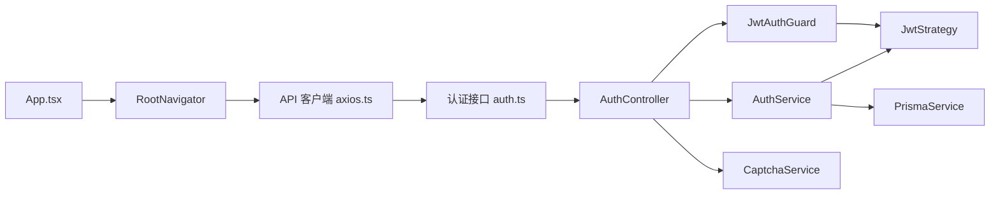

# 会话与Token管理

<cite>
**本文引用的文件**
- [backend/src/modules/auth/auth.service.ts](file://backend/src/modules/auth/auth.service.ts)
- [backend/src/modules/auth/auth.controller.ts](file://backend/src/modules/auth/auth.controller.ts)
- [backend/src/modules/auth/jwt.strategy.ts](file://backend/src/modules/auth/jwt.strategy.ts)
- [backend/src/common/guards/jwt-auth.guard.ts](file://backend/src/common/guards/jwt-auth.guard.ts)
- [backend/src/common/decorators/current-user.decorator.ts](file://backend/src/common/decorators/current-user.decorator.ts)
- [backend/src/main.ts](file://backend/src/main.ts)
- [backend/src/app.module.ts](file://backend/src/app.module.ts)
- [backend/src/modules/auth/captcha.service.ts](file://backend/src/modules/auth/captcha.service.ts)
- [FreeDressApp/src/store/authStore.ts](file://FreeDressApp/src/store/authStore.ts)
- [FreeDressApp/src/api/axios.ts](file://FreeDressApp/src/api/axios.ts)
- [FreeDressApp/src/api/auth.ts](file://FreeDressApp/src/api/auth.ts)
- [FreeDressApp/src/constants/index.ts](file://FreeDressApp/src/constants/index.ts)
- [FreeDressApp/src/types/index.ts](file://FreeDressApp/src/types/index.ts)
- [FreeDressApp/src/App.tsx](file://FreeDressApp/src/App.tsx)
</cite>

## 目录
1. [简介](#简介)
2. [项目结构](#项目结构)
3. [核心组件](#核心组件)
4. [架构总览](#架构总览)
5. [详细组件分析](#详细组件分析)
6. [依赖关系分析](#依赖关系分析)
7. [性能考量](#性能考量)
8. [故障排查指南](#故障排查指南)
9. [结论](#结论)
10. [附录](#附录)

## 简介
本文件面向畅搭(FreeDress)项目，系统性梳理会话与Token管理的设计与实现，覆盖JWT访问令牌与刷新令牌的生成、存储、刷新与销毁；Token过期策略与自动续期；会话状态管理与用户状态跟踪；Token黑名单与撤销策略；多设备登录与并发控制；Token安全存储与传输最佳实践；Token泄露检测与应急响应流程；无状态会话与分布式会话管理；以及会话安全审计与监控策略，并提供面向开发者的完整会话与Token管理开发指南。

## 项目结构
畅搭项目采用前后端分离架构：
- 后端基于NestJS，提供认证、用户、衣物、搭配、上传等模块，统一通过Swagger文档暴露REST接口。
- 前端基于React Native，使用Zustand进行状态管理，Axios拦截器统一处理认证与自动刷新。

**图表来源**
- [backend/src/main.ts:12-62](file://backend/src/main.ts#L12-L62)
- [backend/src/app.module.ts:13-33](file://backend/src/app.module.ts#L13-L33)
- [backend/src/modules/auth/auth.controller.ts:16-92](file://backend/src/modules/auth/auth.controller.ts#L16-L92)
- [backend/src/modules/auth/auth.service.ts:24-279](file://backend/src/modules/auth/auth.service.ts#L24-L279)
- [backend/src/modules/auth/jwt.strategy.ts:10-39](file://backend/src/modules/auth/jwt.strategy.ts#L10-L39)
- [backend/src/common/guards/jwt-auth.guard.ts:8-22](file://backend/src/common/guards/jwt-auth.guard.ts#L8-L22)
- [backend/src/common/decorators/current-user.decorator.ts:7-16](file://backend/src/common/decorators/current-user.decorator.ts#L7-L16)
- [backend/src/modules/auth/captcha.service.ts:30-259](file://backend/src/modules/auth/captcha.service.ts#L30-L259)
- [FreeDressApp/src/App.tsx:11-28](file://FreeDressApp/src/App.tsx#L11-L28)
- [FreeDressApp/src/store/authStore.ts:28-123](file://FreeDressApp/src/store/authStore.ts#L28-L123)
- [FreeDressApp/src/api/axios.ts:12-107](file://FreeDressApp/src/api/axios.ts#L12-L107)
- [FreeDressApp/src/api/auth.ts:7-101](file://FreeDressApp/src/api/auth.ts#L7-L101)

**章节来源**
- [backend/src/main.ts:12-62](file://backend/src/main.ts#L12-L62)
- [backend/src/app.module.ts:13-33](file://backend/src/app.module.ts#L13-L33)
- [FreeDressApp/src/App.tsx:11-28](file://FreeDressApp/src/App.tsx#L11-L28)

## 核心组件
- 认证服务(AuthService)：负责注册、登录、刷新Token、忘记密码与重置密码、用户校验。
- 认证控制器(AuthController)：暴露REST接口，处理验证码、注册、登录、刷新、获取当前用户等。
- JWT策略(JwtStrategy)：从请求头解析Bearer Token，验证签名与过期时间，提取用户信息。
- JWT守卫(JwtAuthGuard)：在路由层保护需要登录的接口。
- 当前用户装饰器(CurrentUser)：简化从请求中取用户字段。
- 前端状态管理(authStore)：维护用户、accessToken、refreshToken、isAuthenticated、isLoading等状态，并持久化到AsyncStorage。
- 前端API客户端(axios.ts)：请求拦截器注入Authorization头，响应拦截器处理401并自动刷新Token。
- 验证码服务(CaptchaService)：生成SVG验证码、防刷与过期清理。

**章节来源**
- [backend/src/modules/auth/auth.service.ts:24-279](file://backend/src/modules/auth/auth.service.ts#L24-L279)
- [backend/src/modules/auth/auth.controller.ts:16-92](file://backend/src/modules/auth/auth.controller.ts#L16-L92)
- [backend/src/modules/auth/jwt.strategy.ts:10-39](file://backend/src/modules/auth/jwt.strategy.ts#L10-L39)
- [backend/src/common/guards/jwt-auth.guard.ts:8-22](file://backend/src/common/guards/jwt-auth.guard.ts#L8-L22)
- [backend/src/common/decorators/current-user.decorator.ts:7-16](file://backend/src/common/decorators/current-user.decorator.ts#L7-L16)
- [FreeDressApp/src/store/authStore.ts:28-123](file://FreeDressApp/src/store/authStore.ts#L28-L123)
- [FreeDressApp/src/api/axios.ts:12-107](file://FreeDressApp/src/api/axios.ts#L12-L107)
- [backend/src/modules/auth/captcha.service.ts:30-259](file://backend/src/modules/auth/captcha.service.ts#L30-L259)

## 架构总览
畅搭采用“无状态会话”设计：后端仅通过JWT签发短期访问令牌与长期刷新令牌，前端负责存储与自动续期；后端不维护会话状态，所有鉴权信息由Token承载并在请求时验证。

**图表来源**
- [backend/src/modules/auth/auth.controller.ts:37-90](file://backend/src/modules/auth/auth.controller.ts#L37-L90)
- [backend/src/modules/auth/auth.service.ts:102-135](file://backend/src/modules/auth/auth.service.ts#L102-L135)
- [backend/src/modules/auth/jwt.strategy.ts:28-37](file://backend/src/modules/auth/jwt.strategy.ts#L28-L37)
- [backend/src/common/guards/jwt-auth.guard.ts:10-20](file://backend/src/common/guards/jwt-auth.guard.ts#L10-L20)
- [FreeDressApp/src/api/axios.ts:24-38](file://FreeDressApp/src/api/axios.ts#L24-L38)

## 详细组件分析

### 认证服务与Token生命周期
- 生成：登录/注册成功后，同时签发短期访问令牌与长期刷新令牌；访问令牌过期时间可由环境变量配置，默认7天；刷新令牌固定30天。
- 存储：前端将accessToken与refreshToken分别存入AsyncStorage，并同步更新Zustand状态。
- 刷新：当访问令牌过期导致401时，前端使用refreshToken向后端发起刷新请求，获得新的双Token并重试原请求。
- 销毁：登出时前端清除AsyncStorage中的Token与用户信息；后端未实现黑名单，需配合刷新令牌策略与短有效期降低风险。

**图表来源**
- [backend/src/modules/auth/auth.service.ts:153-171](file://backend/src/modules/auth/auth.service.ts#L153-L171)
- [FreeDressApp/src/store/authStore.ts:39-78](file://FreeDressApp/src/store/authStore.ts#L39-L78)
- [FreeDressApp/src/api/axios.ts:54-105](file://FreeDressApp/src/api/axios.ts#L54-L105)

**章节来源**
- [backend/src/modules/auth/auth.service.ts:102-171](file://backend/src/modules/auth/auth.service.ts#L102-L171)
- [FreeDressApp/src/store/authStore.ts:39-78](file://FreeDressApp/src/store/authStore.ts#L39-L78)
- [FreeDressApp/src/api/axios.ts:54-105](file://FreeDressApp/src/api/axios.ts#L54-L105)

### Token过期策略与自动续期
- 过期策略：访问令牌默认7天，刷新令牌30天；可通过环境变量调整访问令牌有效期。
- 自动续期：响应拦截器捕获401，若存在refreshToken则调用刷新接口获取新Token并重试原请求；刷新失败则清空本地Token并提示重新登录。
- 安全建议：缩短访问令牌有效期、启用HTTPS、限制刷新令牌使用频率与来源。

**章节来源**
- [backend/src/modules/auth/auth.service.ts:157-165](file://backend/src/modules/auth/auth.service.ts#L157-L165)
- [FreeDressApp/src/api/axios.ts:54-105](file://FreeDressApp/src/api/axios.ts#L54-L105)

### 会话状态管理与用户状态跟踪
- 前端状态：Zustand store维护user、accessToken、refreshToken、isAuthenticated、isLoading；支持从本地存储恢复状态。
- 用户信息：登录成功后将用户信息写入本地存储，后续更新用户资料时同步更新本地存储。
- 初始化流程：应用启动时尝试从本地存储加载Token与用户信息，完成无感登录。

**图表来源**
- [FreeDressApp/src/store/authStore.ts:9-22](file://FreeDressApp/src/store/authStore.ts#L9-L22)
- [FreeDressApp/src/store/authStore.ts:28-123](file://FreeDressApp/src/store/authStore.ts#L28-L123)
- [FreeDressApp/src/constants/index.ts:200-205](file://FreeDressApp/src/constants/index.ts#L200-L205)

**章节来源**
- [FreeDressApp/src/store/authStore.ts:28-123](file://FreeDressApp/src/store/authStore.ts#L28-L123)
- [FreeDressApp/src/constants/index.ts:200-205](file://FreeDressApp/src/constants/index.ts#L200-L205)

### Token黑名单机制与撤销策略
- 当前实现：后端未实现Token黑名单；通过短访问令牌有效期与定期刷新降低风险。
- 建议方案：
  - 引入Redis存储已吊销的访问令牌哈希集合，登录/注销时加入黑名单；
  - JWT策略增加黑名单校验步骤；
  - 为高危操作（如修改密码）强制要求二次验证并刷新所有Token。

**章节来源**
- [backend/src/modules/auth/auth.service.ts:153-171](file://backend/src/modules/auth/auth.service.ts#L153-L171)

### 多设备登录与并发控制
- 当前实现：未实现多设备登录控制；同一账户可在不同设备使用不同refreshToken。
- 建议方案：
  - 登录时生成设备标识与会话ID，记录在数据库；
  - 提供“全部退出”接口，批量吊销对应会话；
  - 限制单账户最大活跃会话数，新登录顶替最久未活跃的会话。

**章节来源**
- [backend/src/modules/auth/auth.service.ts:143-145](file://backend/src/modules/auth/auth.service.ts#L143-L145)

### Token安全存储与传输最佳实践
- 存储：
  - 前端使用AsyncStorage存储Token与用户信息；建议开启加密存储（如react-native-encrypted-storage）。
  - 避免将敏感信息写入日志或调试输出。
- 传输：
  - 使用HTTPS；Axios请求头统一注入Authorization: Bearer。
  - 避免在URL中传递Token。
- 令牌管理：
  - 访问令牌有效期尽量短；刷新令牌独立存储与传输。
  - 定期轮换密钥，严格保密JWT_SECRET与JWT_REFRESH_SECRET。

**章节来源**
- [FreeDressApp/src/api/axios.ts:12-38](file://FreeDressApp/src/api/axios.ts#L12-L38)
- [backend/src/modules/auth/auth.service.ts:157-165](file://backend/src/modules/auth/auth.service.ts#L157-L165)

### Token泄露检测与应急响应
- 泄露检测：
  - 监控异常地理位置与设备登录行为；
  - 监控高频刷新与401重试异常模式；
  - 审计Token签发与吊销日志。
- 应急响应：
  - 立即吊销受影响账户的refreshToken；
  - 强制所有设备重新登录；
  - 更改密钥并滚动部署。

**章节来源**
- [backend/src/modules/auth/auth.service.ts:247-254](file://backend/src/modules/auth/auth.service.ts#L247-L254)

### 无状态会话设计与分布式会话管理
- 无状态：后端不存储会话上下文，所有鉴权信息由Token承载。
- 分布式：通过共享密钥与标准JWT实现跨实例验证；建议引入Redis缓存刷新令牌与黑名单，保证横向扩展一致性。

**章节来源**
- [backend/src/modules/auth/jwt.strategy.ts:13-21](file://backend/src/modules/auth/jwt.strategy.ts#L13-L21)

### 会话安全审计与监控策略
- 审计范围：登录/登出、Token刷新、用户资料变更、高危操作。
- 监控指标：401频次、刷新成功率、异常IP与设备、Token吊销事件。
- 报警阈值：连续失败次数、短时间大量刷新、异地登录。

**章节来源**
- [backend/src/modules/auth/captcha.service.ts:223-236](file://backend/src/modules/auth/captcha.service.ts#L223-L236)

## 依赖关系分析

**图表来源**
- [FreeDressApp/src/App.tsx:11-28](file://FreeDressApp/src/App.tsx#L11-L28)
- [FreeDressApp/src/api/axios.ts:12-107](file://FreeDressApp/src/api/axios.ts#L12-L107)
- [FreeDressApp/src/api/auth.ts:7-101](file://FreeDressApp/src/api/auth.ts#L7-L101)
- [backend/src/modules/auth/auth.controller.ts:16-92](file://backend/src/modules/auth/auth.controller.ts#L16-L92)
- [backend/src/modules/auth/auth.service.ts:24-279](file://backend/src/modules/auth/auth.service.ts#L24-L279)
- [backend/src/modules/auth/jwt.strategy.ts:10-39](file://backend/src/modules/auth/jwt.strategy.ts#L10-L39)
- [backend/src/common/guards/jwt-auth.guard.ts:8-22](file://backend/src/common/guards/jwt-auth.guard.ts#L8-L22)
- [backend/src/modules/auth/captcha.service.ts:30-259](file://backend/src/modules/auth/captcha.service.ts#L30-L259)

**章节来源**
- [backend/src/app.module.ts:13-33](file://backend/src/app.module.ts#L13-L33)
- [backend/src/main.ts:12-62](file://backend/src/main.ts#L12-L62)

## 性能考量
- Token签发：使用Promise.all并行签发访问与刷新令牌，减少往返延迟。
- 缓存与清理：验证码与重置令牌定时清理，避免内存泄漏。
- 前端拦截器：统一处理401与重试，减少重复代码与网络开销。
- 建议优化：将验证码与重置令牌迁移到Redis；对频繁刷新场景引入指数退避与限流。

**章节来源**
- [backend/src/modules/auth/auth.service.ts:156-165](file://backend/src/modules/auth/auth.service.ts#L156-L165)
- [backend/src/modules/auth/captcha.service.ts:48-51](file://backend/src/modules/auth/captcha.service.ts#L48-L51)
- [FreeDressApp/src/api/axios.ts:54-105](file://FreeDressApp/src/api/axios.ts#L54-L105)

## 故障排查指南
- 常见问题
  - 登录后仍提示未登录：检查前端是否正确保存Token与用户信息；确认请求头是否包含Authorization。
  - 401频繁：检查访问令牌是否过期；确认刷新流程是否成功；查看后端日志与异常过滤器输出。
  - 刷新失败：确认refreshToken存在且有效；检查后端JWT密钥配置；查看响应拦截器错误分支。
- 排查步骤
  - 前端：打印AsyncStorage中的Token与状态；检查API拦截器注入与重试逻辑。
  - 后端：确认JWT_SECRET/JWT_REFRESH_SECRET；检查JwtAuthGuard与JwtStrategy配置；查看Swagger文档验证接口。
- 临时处理
  - 清除本地Token并重新登录；
  - 重启应用以恢复初始状态。

**章节来源**
- [FreeDressApp/src/api/axios.ts:54-105](file://FreeDressApp/src/api/axios.ts#L54-L105)
- [backend/src/common/guards/jwt-auth.guard.ts:14-20](file://backend/src/common/guards/jwt-auth.guard.ts#L14-L20)
- [backend/src/modules/auth/jwt.strategy.ts:13-21](file://backend/src/modules/auth/jwt.strategy.ts#L13-L21)

## 结论
畅搭项目采用标准JWT实现无状态会话，前端负责Token存储与自动刷新，后端通过守卫与策略保障接口安全。当前实现简洁可靠，建议在生产环境中引入Token黑名单、多设备登录控制、Redis缓存与更严格的风控策略，以进一步提升安全性与可观测性。

## 附录

### 开发者会话与Token管理开发指南
- 后端
  - 在AuthService中新增吊销列表与黑名单校验；
  - 在AuthController中新增“退出登录”接口，清理会话；
  - 在JwtStrategy中集成黑名单检查；
  - 使用Redis存储刷新令牌与黑名单，支持水平扩展。
- 前端
  - 使用加密存储替代AsyncStorage；
  - 在应用启动时优先从本地恢复状态；
  - 在高危操作前强制二次验证并刷新所有Token；
  - 增加Token过期提醒与自动登出流程。

**章节来源**
- [backend/src/modules/auth/auth.service.ts:247-254](file://backend/src/modules/auth/auth.service.ts#L247-L254)
- [backend/src/modules/auth/jwt.strategy.ts:28-37](file://backend/src/modules/auth/jwt.strategy.ts#L28-L37)
- [FreeDressApp/src/store/authStore.ts:97-121](file://FreeDressApp/src/store/authStore.ts#L97-L121)