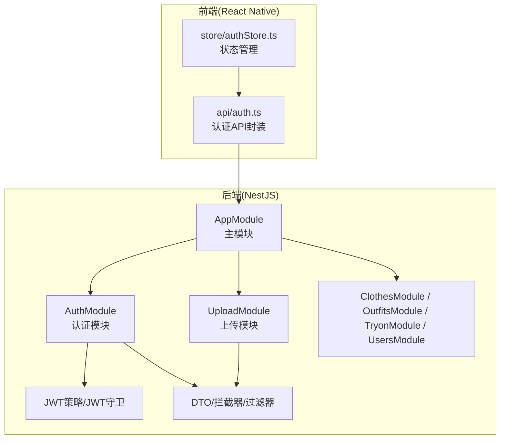
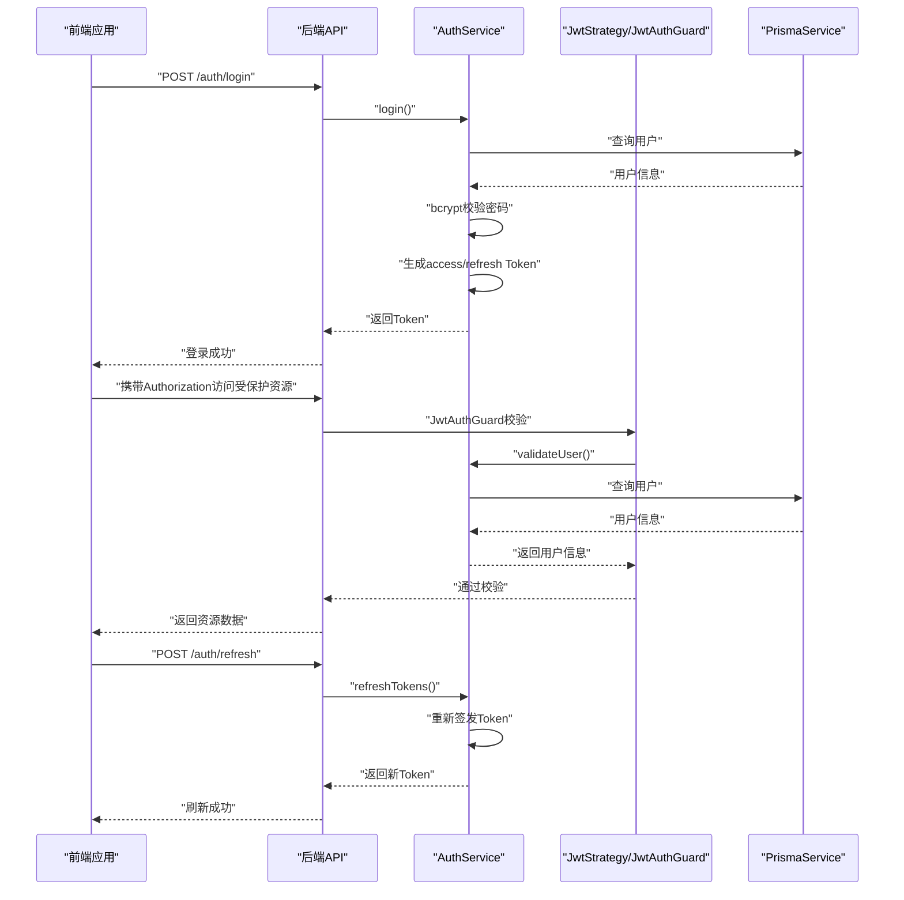
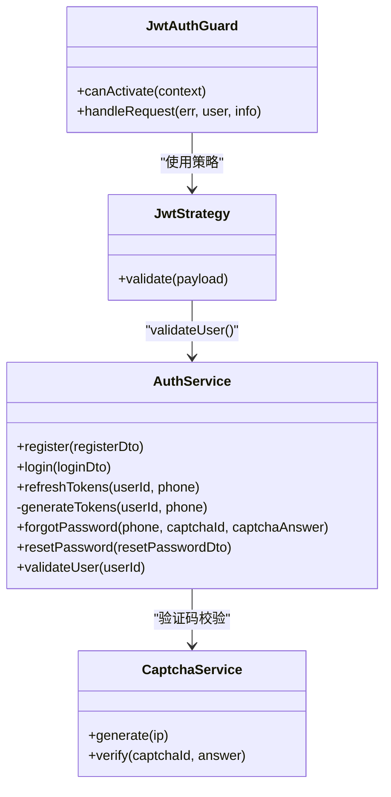
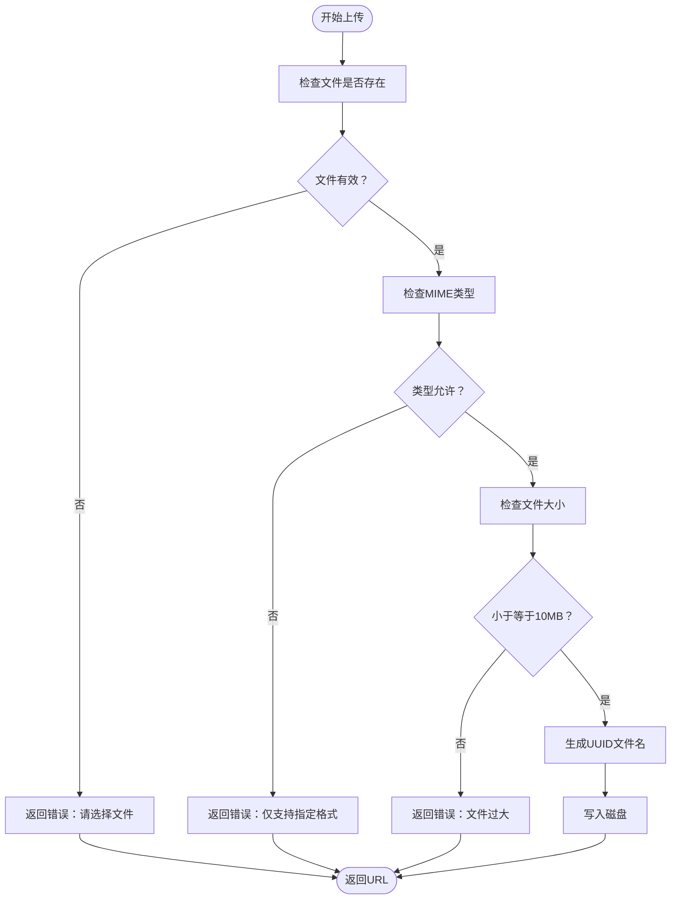
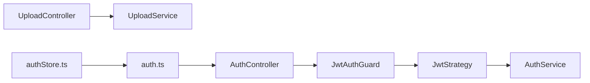

# 安全考虑

<cite>
**本文引用的文件**
- [backend/src/modules/auth/auth.service.ts](file://backend/src/modules/auth/auth.service.ts)
- [backend/src/modules/auth/strategies/jwt.strategy.ts](file://backend/src/modules/auth/strategies/jwt.strategy.ts)
- [backend/src/common/guards/jwt-auth.guard.ts](file://backend/src/common/guards/jwt-auth.guard.ts)
- [backend/src/modules/auth/dto/login.dto.ts](file://backend/src/modules/auth/dto/login.dto.ts)
- [backend/src/modules/auth/dto/register.dto.ts](file://backend/src/modules/auth/dto/register.dto.ts)
- [backend/src/modules/auth/captcha.service.ts](file://backend/src/modules/auth/captcha.service.ts)
- [backend/src/modules/upload/upload.service.ts](file://backend/src/modules/upload/upload.service.ts)
- [backend/src/common/decorators/current-user.decorator.ts](file://backend/src/common/decorators/current-user.decorator.ts)
- [backend/src/common/filters/http-exception.filter.ts](file://backend/src/common/filters/http-exception.filter.ts)
- [backend/src/common/interceptors/transform.interceptor.ts](file://backend/src/common/interceptors/transform.interceptor.ts)
- [backend/src/main.ts](file://backend/src/main.ts)
- [backend/package.json](file://backend/package.json)
- [FreeDressApp/src/api/auth.ts](file://FreeDressApp/src/api/auth.ts)
- [FreeDressApp/src/store/authStore.ts](file://FreeDressApp/src/store/authStore.ts)
</cite>

## 目录
1. [简介](#简介)
2. [项目结构](#项目结构)
3. [核心组件](#核心组件)
4. [架构总览](#架构总览)
5. [详细组件分析](#详细组件分析)
6. [依赖关系分析](#依赖关系分析)
7. [性能与安全特性](#性能与安全特性)
8. [故障排查指南](#故障排查指南)
9. [结论](#结论)
10. [附录](#附录)

## 简介
本文件面向畅搭(FreeDress)项目的开发者与运维人员，系统化梳理项目在认证与授权、数据安全、API防护、文件上传、会话与Token管理、安全审计与应急响应等方面的现状与改进建议。文档以代码为依据，结合实际实现路径，提供可落地的安全开发指南与最佳实践。

## 项目结构
后端采用NestJS框架，按模块化组织认证(auth)、衣物(clothes)、搭配(outfits)、试衣(tryon)、上传(upload)、用户(users)等业务模块；前端为React Native应用，通过Axios客户端调用后端API，并使用Zustand管理认证状态。

图表来源
- [backend/src/main.ts:12-62](file://backend/src/main.ts#L12-L62)
- [backend/src/modules/auth/auth.service.ts:24-95](file://backend/src/modules/auth/auth.service.ts#L24-L95)
- [backend/src/modules/upload/upload.service.ts:16-49](file://backend/src/modules/upload/upload.service.ts#L16-L49)
- [FreeDressApp/src/api/auth.ts:1-101](file://FreeDressApp/src/api/auth.ts#L1-L101)
- [FreeDressApp/src/store/authStore.ts:1-123](file://FreeDressApp/src/store/authStore.ts#L1-L123)

章节来源
- [backend/src/main.ts:12-62](file://backend/src/main.ts#L12-L62)
- [backend/src/modules/auth/auth.service.ts:24-95](file://backend/src/modules/auth/auth.service.ts#L24-L95)
- [backend/src/modules/upload/upload.service.ts:16-49](file://backend/src/modules/upload/upload.service.ts#L16-L49)
- [FreeDressApp/src/api/auth.ts:1-101](file://FreeDressApp/src/api/auth.ts#L1-L101)
- [FreeDressApp/src/store/authStore.ts:1-123](file://FreeDressApp/src/store/authStore.ts#L1-L123)

## 核心组件
- 认证服务与策略：负责注册、登录、Token生成与刷新、忘记/重置密码、用户校验；基于JWT与Passport策略。
- 验证码服务：生成带噪声干扰的SVG验证码，内置过期与尝试次数控制，配合IP限流。
- 上传服务：对文件类型、大小进行白名单校验与限制。
- 前端认证状态：使用AsyncStorage持久化Token与用户信息，统一API封装。

章节来源
- [backend/src/modules/auth/auth.service.ts:24-279](file://backend/src/modules/auth/auth.service.ts#L24-L279)
- [backend/src/modules/auth/strategies/jwt.strategy.ts:10-39](file://backend/src/modules/auth/strategies/jwt.strategy.ts#L10-L39)
- [backend/src/common/guards/jwt-auth.guard.ts:8-22](file://backend/src/common/guards/jwt-auth.guard.ts#L8-L22)
- [backend/src/modules/auth/captcha.service.ts:30-259](file://backend/src/modules/auth/captcha.service.ts#L30-L259)
- [backend/src/modules/upload/upload.service.ts:16-49](file://backend/src/modules/upload/upload.service.ts#L16-L49)
- [FreeDressApp/src/api/auth.ts:1-101](file://FreeDressApp/src/api/auth.ts#L1-L101)
- [FreeDressApp/src/store/authStore.ts:1-123](file://FreeDressApp/src/store/authStore.ts#L1-L123)

## 架构总览
下图展示认证与授权的整体流程，从前端发起请求到后端JWT策略验证与用户校验，再到Token生成与刷新。

图表来源
- [backend/src/modules/auth/auth.service.ts:102-145](file://backend/src/modules/auth/auth.service.ts#L102-L145)
- [backend/src/modules/auth/strategies/jwt.strategy.ts:28-37](file://backend/src/modules/auth/strategies/jwt.strategy.ts#L28-L37)
- [backend/src/common/guards/jwt-auth.guard.ts:9-21](file://backend/src/common/guards/jwt-auth.guard.ts#L9-L21)
- [FreeDressApp/src/api/auth.ts:45-93](file://FreeDressApp/src/api/auth.ts#L45-L93)

## 详细组件分析

### 认证与授权机制
- 登录/注册
  - 登录：根据手机号查询用户，bcrypt校验密码，成功后生成访问与刷新Token。
  - 注册：先通过图片验证码校验，再检查手机号唯一性，bcrypt加密密码后创建用户并返回Token。
- Token生成与刷新
  - 使用异步并发生成访问与刷新Token，分别配置不同过期时间。
  - 刷新接口直接委托AuthService生成新Token。
- JWT策略与守卫
  - JwtStrategy从Authorization头解析Bearer Token，校验签名与过期时间，调用AuthService.validateUser确认用户存在。
  - JwtAuthGuard在请求进入控制器前执行策略校验，失败时抛出未授权异常。
- DTO参数校验
  - 登录与注册DTO对手机号格式、密码长度、验证码ID/答案长度进行强约束，减少非法输入。
- 用户校验
  - validateUser仅返回必要字段，避免泄露敏感信息。

图表来源
- [backend/src/modules/auth/auth.service.ts:24-279](file://backend/src/modules/auth/auth.service.ts#L24-L279)
- [backend/src/modules/auth/strategies/jwt.strategy.ts:10-39](file://backend/src/modules/auth/strategies/jwt.strategy.ts#L10-L39)
- [backend/src/common/guards/jwt-auth.guard.ts:8-22](file://backend/src/common/guards/jwt-auth.guard.ts#L8-L22)
- [backend/src/modules/auth/captcha.service.ts:30-259](file://backend/src/modules/auth/captcha.service.ts#L30-L259)

章节来源
- [backend/src/modules/auth/auth.service.ts:44-145](file://backend/src/modules/auth/auth.service.ts#L44-L145)
- [backend/src/modules/auth/strategies/jwt.strategy.ts:10-39](file://backend/src/modules/auth/strategies/jwt.strategy.ts#L10-L39)
- [backend/src/common/guards/jwt-auth.guard.ts:8-22](file://backend/src/common/guards/jwt-auth.guard.ts#L8-L22)
- [backend/src/modules/auth/dto/login.dto.ts:7-19](file://backend/src/modules/auth/dto/login.dto.ts#L7-L19)
- [backend/src/modules/auth/dto/register.dto.ts:8-37](file://backend/src/modules/auth/dto/register.dto.ts#L8-L37)

### 数据安全保护
- 密码加密
  - bcryptjs对密码进行加盐哈希存储，注册与重置密码均使用相同流程。
- 敏感数据脱敏
  - validateUser仅返回必要字段，避免将敏感信息暴露给前端。
- 传输安全
  - 开启CORS并允许凭据；建议在生产环境强制HTTPS与安全Cookie属性。

章节来源
- [backend/src/modules/auth/auth.service.ts:63-65](file://backend/src/modules/auth/auth.service.ts#L63-L65)
- [backend/src/modules/auth/auth.service.ts:228-230](file://backend/src/modules/auth/auth.service.ts#L228-L230)
- [backend/src/modules/auth/auth.service.ts:260-277](file://backend/src/modules/auth/auth.service.ts#L260-L277)
- [backend/src/main.ts:32-35](file://backend/src/main.ts#L32-L35)

### API安全防护策略
- 请求频率限制
  - 验证码服务内置IP限流（每分钟最多请求阈值），防止暴力破解与刷量。
- SQL注入防护
  - 使用ORM Prisma进行数据库访问，自动参数化查询，降低注入风险。
- XSS攻击防范
  - 建议：对富文本输入进行白名单过滤与转义；后端响应统一格式，避免在错误信息中泄露堆栈细节（当前实现已做基础处理）。

章节来源
- [backend/src/modules/auth/captcha.service.ts:223-236](file://backend/src/modules/auth/captcha.service.ts#L223-L236)
- [backend/src/modules/auth/captcha.service.ts:48-51](file://backend/src/modules/auth/captcha.service.ts#L48-L51)
- [backend/src/common/filters/http-exception.filter.ts:68-70](file://backend/src/common/filters/http-exception.filter.ts#L68-L70)

### 文件上传安全
- 类型与大小限制
  - 仅允许JPG/PNG/WebP/GIF，最大10MB；超出则拒绝。
- 存储位置
  - 默认写入项目根目录下的uploads文件夹；建议迁移到独立对象存储并开启访问控制。
- 恶意文件检测
  - 当前未集成病毒扫描或内容深度检测；建议增加基于文件内容的二次校验与杀毒扫描。

图表来源
- [backend/src/modules/upload/upload.service.ts:25-47](file://backend/src/modules/upload/upload.service.ts#L25-L47)

章节来源
- [backend/src/modules/upload/upload.service.ts:16-49](file://backend/src/modules/upload/upload.service.ts#L16-L49)

### 会话管理与Token安全管理
- Token生命周期
  - 访问Token默认7天过期；刷新Token30天；建议在移动端实现“静默刷新”与“失效兜底”。
- Token存储
  - 前端使用AsyncStorage持久化；建议启用加密存储（如react-native-encrypted-storage）并设置安全策略（如不可导出）。
- Token刷新
  - 前端提供刷新接口；后端直接生成新Token并返回，避免复杂的状态机。
- 当前用户注入
  - CurrentUser装饰器从请求上下文提取用户信息，便于在控制器中直接使用。

章节来源
- [backend/src/modules/auth/auth.service.ts:153-171](file://backend/src/modules/auth/auth.service.ts#L153-L171)
- [FreeDressApp/src/api/auth.ts:91-93](file://FreeDressApp/src/api/auth.ts#L91-L93)
- [FreeDressApp/src/store/authStore.ts:39-78](file://FreeDressApp/src/store/authStore.ts#L39-L78)
- [backend/src/common/decorators/current-user.decorator.ts:7-15](file://backend/src/common/decorators/current-user.decorator.ts#L7-L15)

### 安全审计与漏洞扫描
- 依赖审计
  - 使用package.json中的依赖版本，定期运行安全扫描工具（如npm audit或Snyk）。
- 代码扫描
  - ESLint与Prettier规范；建议引入安全规则与依赖注入检查。
- 运行时监控
  - 结合异常过滤器输出统一错误格式，便于日志采集与告警。

章节来源
- [backend/package.json:26-44](file://backend/package.json#L26-L44)
- [backend/src/common/filters/http-exception.filter.ts:8-81](file://backend/src/common/filters/http-exception.filter.ts#L8-L81)

### 应急响应流程
- 发现安全事件
  - 立即隔离受影响实例，回滚可疑变更，冻结相关账户。
- 证据保全
  - 保留日志、请求快照与数据库备份。
- 修复与加固
  - 修复漏洞、更新密钥、收紧权限与策略。
- 通知与复盘
  - 通知用户与监管方，发布安全公告，完善安全基线。

## 依赖关系分析
- 认证链路
  - 控制器 -> JwtAuthGuard -> JwtStrategy -> AuthService.validateUser
- 上传链路
  - 控制器 -> UploadService -> 文件系统
- 前端链路
  - authStore -> api/auth -> 后端API

图表来源
- [backend/src/common/guards/jwt-auth.guard.ts:9](file://backend/src/common/guards/jwt-auth.guard.ts#L9)
- [backend/src/modules/auth/strategies/jwt.strategy.ts:12](file://backend/src/modules/auth/strategies/jwt.strategy.ts#L12)
- [backend/src/modules/auth/auth.service.ts:260](file://backend/src/modules/auth/auth.service.ts#L260)
- [backend/src/modules/upload/upload.service.ts:16](file://backend/src/modules/upload/upload.service.ts#L16)
- [FreeDressApp/src/store/authStore.ts:28](file://FreeDressApp/src/store/authStore.ts#L28)
- [FreeDressApp/src/api/auth.ts:7](file://FreeDressApp/src/api/auth.ts#L7)

章节来源
- [backend/src/common/guards/jwt-auth.guard.ts:8-22](file://backend/src/common/guards/jwt-auth.guard.ts#L8-L22)
- [backend/src/modules/auth/strategies/jwt.strategy.ts:10-39](file://backend/src/modules/auth/strategies/jwt.strategy.ts#L10-L39)
- [backend/src/modules/auth/auth.service.ts:24-95](file://backend/src/modules/auth/auth.service.ts#L24-L95)
- [backend/src/modules/upload/upload.service.ts:16-49](file://backend/src/modules/upload/upload.service.ts#L16-L49)
- [FreeDressApp/src/store/authStore.ts:1-123](file://FreeDressApp/src/store/authStore.ts#L1-L123)
- [FreeDressApp/src/api/auth.ts:1-101](file://FreeDressApp/src/api/auth.ts#L1-L101)

## 性能与安全特性
- 性能
  - Token生成采用并发Promise，缩短响应延迟。
  - 验证码与重置令牌使用Map内存存储，建议在生产环境迁移至Redis以支持多实例共享。
- 安全
  - DTO强约束输入；bcrypt加密；JWT过期严格校验；CORS允许凭据但需配合HTTPS。
  - 建议：启用CSRF防护、速率限制中间件、请求体大小限制、静态资源安全头。

章节来源
- [backend/src/modules/auth/auth.service.ts:156-165](file://backend/src/modules/auth/auth.service.ts#L156-L165)
- [backend/src/modules/auth/captcha.service.ts:32-51](file://backend/src/modules/auth/captcha.service.ts#L32-L51)
- [backend/src/main.ts:32-35](file://backend/src/main.ts#L32-L35)

## 故障排查指南
- 登录失败
  - 检查手机号格式与密码长度；确认验证码是否过期或已达最大尝试次数。
- Token无效
  - 确认Authorization头格式与过期时间；检查JWT密钥配置；尝试刷新Token。
- 上传失败
  - 确认文件类型与大小限制；检查uploads目录权限与磁盘空间。
- 异常信息泄露
  - 开发环境可能打印堆栈；生产环境应关闭详细错误输出。

章节来源
- [backend/src/modules/auth/captcha.service.ts:87-122](file://backend/src/modules/auth/captcha.service.ts#L87-L122)
- [backend/src/modules/auth/auth.service.ts:102-135](file://backend/src/modules/auth/auth.service.ts#L102-L135)
- [backend/src/modules/upload/upload.service.ts:25-47](file://backend/src/modules/upload/upload.service.ts#L25-L47)
- [backend/src/common/filters/http-exception.filter.ts:67-70](file://backend/src/common/filters/http-exception.filter.ts#L67-L70)

## 结论
当前实现已具备完善的认证与授权基础：JWT策略、Token生成与刷新、bcrypt加密、验证码防刷与限流。建议在生产环境中进一步强化：密钥轮换与安全存储、Redis共享缓存、HTTPS与安全头、CSRF防护、WAF与DDoS防护、漏洞扫描与渗透测试、日志与审计留痕、应急响应预案与演练。

## 附录
- 开发者安全开发清单
  - 输入校验：始终使用DTO与ValidationPipe。
  - 密码安全：bcrypt加盐，禁止明文存储。
  - Token安全：短过期访问Token、长过期刷新Token、移动端加密存储。
  - 传输安全：强制HTTPS、安全Cookie、CSP与HSTS。
  - 上传安全：白名单类型、大小限制、对象存储与鉴权。
  - 日志与监控：统一错误格式、敏感信息脱敏、异常告警。
  - 定期审计：依赖扫描、代码审计、渗透测试。