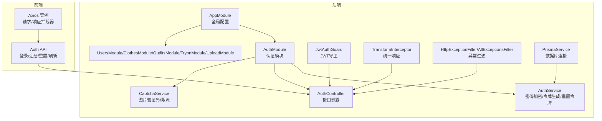
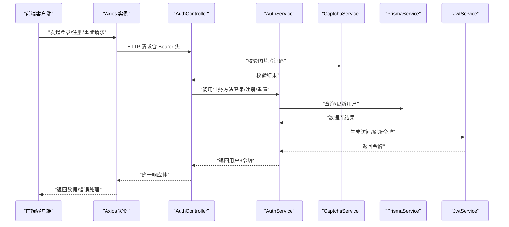
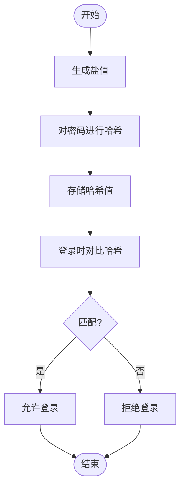
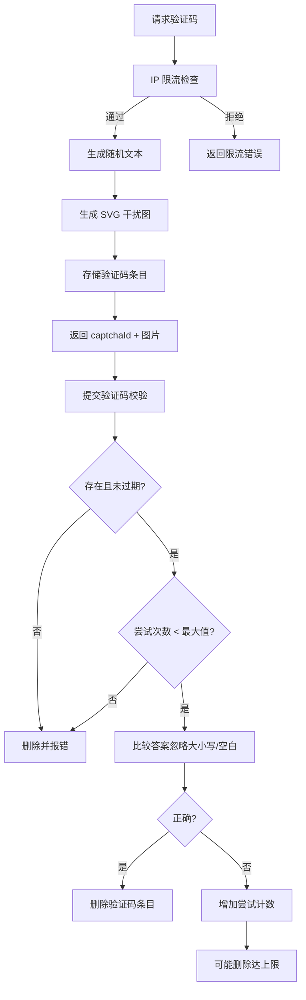
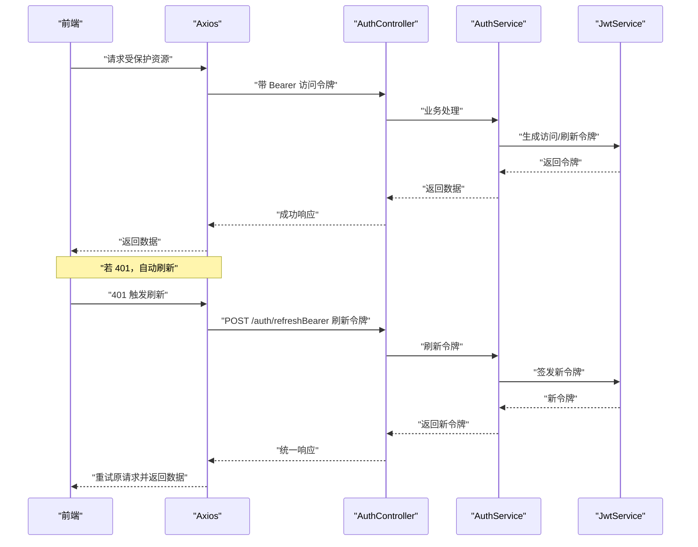
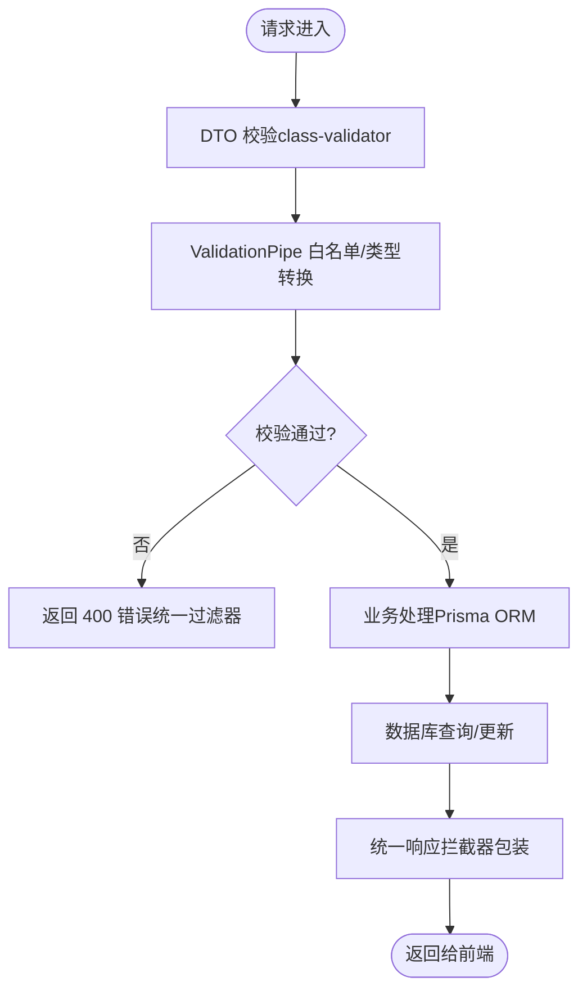
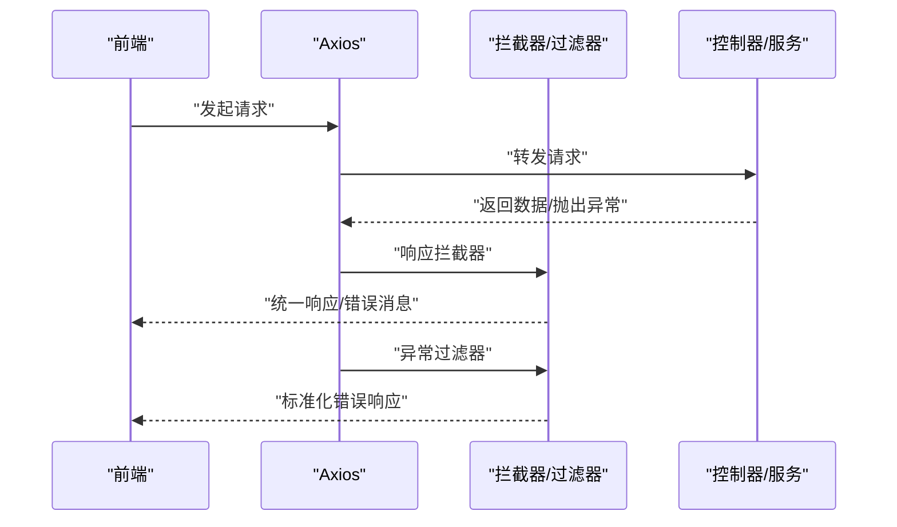
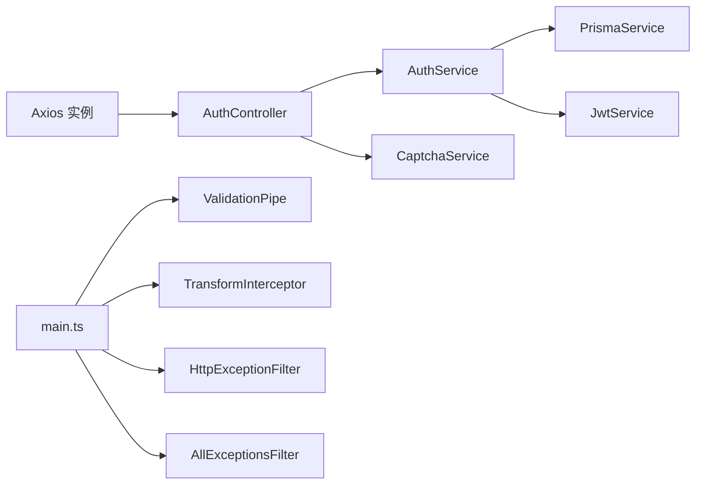

# 数据安全

<cite>
**本文引用的文件**
- [backend/src/modules/auth/auth.service.ts](file://backend/src/modules/auth/auth.service.ts)
- [backend/src/modules/auth/auth.controller.ts](file://backend/src/modules/auth/auth.controller.ts)
- [backend/src/modules/auth/captcha.service.ts](file://backend/src/modules/auth/captcha.service.ts)
- [backend/src/modules/auth/dto/login.dto.ts](file://backend/src/modules/auth/dto/login.dto.ts)
- [backend/src/modules/auth/dto/register.dto.ts](file://backend/src/modules/auth/dto/register.dto.ts)
- [backend/src/modules/auth/dto/reset-password.dto.ts](file://backend/src/modules/auth/dto/reset-password.dto.ts)
- [backend/src/common/guards/jwt-auth.guard.ts](file://backend/src/common/guards/jwt-auth.guard.ts)
- [backend/src/common/interceptors/transform.interceptor.ts](file://backend/src/common/interceptors/transform.interceptor.ts)
- [backend/src/common/filters/http-exception.filter.ts](file://backend/src/common/filters/http-exception.filter.ts)
- [backend/src/prisma/prisma.service.ts](file://backend/src/prisma/prisma.service.ts)
- [backend/src/app.module.ts](file://backend/src/app.module.ts)
- [backend/src/main.ts](file://backend/src/main.ts)
- [FreeDressApp/src/api/auth.ts](file://FreeDressApp/src/api/auth.ts)
- [FreeDressApp/src/api/axios.ts](file://FreeDressApp/src/api/axios.ts)
</cite>

## 目录
1. [简介](#简介)
2. [项目结构](#项目结构)
3. [核心组件](#核心组件)
4. [架构总览](#架构总览)
5. [详细组件分析](#详细组件分析)
6. [依赖关系分析](#依赖关系分析)
7. [性能与安全特性](#性能与安全特性)
8. [故障排查指南](#故障排查指南)
9. [结论](#结论)
10. [附录](#附录)

## 简介
本文件面向畅搭（FreeDress）项目的开发者与运维人员，系统化梳理项目在数据安全方面的设计与实现，覆盖密码加密与盐值管理、敏感数据脱敏与隐私保护、数据传输安全（HTTPS/TLS）、API 响应安全过滤与异常处理、输入验证与数据清理（防 SQL 注入与 XSS）、数据库连接安全与访问控制、数据备份与恢复策略、数据完整性验证与审计日志建议，以及面向开发者的安全编码指南。

## 项目结构
后端采用 NestJS + Prisma 架构，认证模块负责登录、注册、验证码、密码重置与令牌刷新；前端使用 React Native + Axios 与后端交互，并内置自动刷新令牌机制。全局中间件统一了响应格式与异常处理，Prisma 负责数据库连接生命周期管理。

图示来源
- [backend/src/app.module.ts:13-31](file://backend/src/app.module.ts#L13-L31)
- [backend/src/modules/auth/auth.module.ts](file://backend/src/modules/auth/auth.module.ts)
- [backend/src/modules/auth/auth.service.ts:24-37](file://backend/src/modules/auth/auth.service.ts#L24-L37)
- [backend/src/modules/auth/auth.controller.ts:16-22](file://backend/src/modules/auth/auth.controller.ts#L16-L22)
- [backend/src/modules/auth/captcha.service.ts:30-51](file://backend/src/modules/auth/captcha.service.ts#L30-L51)
- [backend/src/common/guards/jwt-auth.guard.ts:8-21](file://backend/src/common/guards/jwt-auth.guard.ts#L8-L21)
- [backend/src/common/interceptors/transform.interceptor.ts:19-31](file://backend/src/common/interceptors/transform.interceptor.ts#L19-L31)
- [backend/src/common/filters/http-exception.filter.ts:8-44](file://backend/src/common/filters/http-exception.filter.ts#L8-L44)
- [backend/src/prisma/prisma.service.ts:8-26](file://backend/src/prisma/prisma.service.ts#L8-L26)
- [FreeDressApp/src/api/axios.ts:12-18](file://FreeDressApp/src/api/axios.ts#L12-L18)
- [FreeDressApp/src/api/auth.ts:12-14](file://FreeDressApp/src/api/auth.ts#L12-L14)

章节来源
- [backend/src/app.module.ts:13-31](file://backend/src/app.module.ts#L13-L31)
- [backend/src/main.ts:12-62](file://backend/src/main.ts#L12-L62)

## 核心组件
- 密码加密与盐值管理：使用 bcryptjs 对用户密码进行加盐哈希存储，每次加密生成独立盐值，避免彩虹表攻击。
- 图片验证码与限流：生成带噪声干扰的 SVG 验证码，支持过期时间、最大尝试次数与 IP 限流，降低自动化攻击风险。
- 令牌体系：JWT 访问令牌与刷新令牌分离，支持刷新接口与守卫保护受保护路由。
- 输入验证与数据清理：使用 class-validator + Nest 的 ValidationPipe，白名单与类型转换，减少脏数据进入数据库。
- 统一响应与异常过滤：统一响应结构与错误输出，隐藏内部细节，便于前端处理。
- 数据库连接：Prisma 客户端生命周期管理，集中连接与断开逻辑。

章节来源
- [backend/src/modules/auth/auth.service.ts:63-65](file://backend/src/modules/auth/auth.service.ts#L63-L65)
- [backend/src/modules/auth/auth.service.ts:114-115](file://backend/src/modules/auth/auth.service.ts#L114-L115)
- [backend/src/modules/auth/captcha.service.ts:58-79](file://backend/src/modules/auth/captcha.service.ts#L58-L79)
- [backend/src/modules/auth/captcha.service.ts:223-236](file://backend/src/modules/auth/captcha.service.ts#L223-L236)
- [backend/src/modules/auth/auth.service.ts:153-171](file://backend/src/modules/auth/auth.service.ts#L153-L171)
- [backend/src/common/guards/jwt-auth.guard.ts:8-21](file://backend/src/common/guards/jwt-auth.guard.ts#L8-L21)
- [backend/src/common/interceptors/transform.interceptor.ts:20-31](file://backend/src/common/interceptors/transform.interceptor.ts#L20-L31)
- [backend/src/common/filters/http-exception.filter.ts:8-44](file://backend/src/common/filters/http-exception.filter.ts#L8-L44)
- [backend/src/prisma/prisma.service.ts:8-26](file://backend/src/prisma/prisma.service.ts#L8-L26)

## 架构总览
下图展示认证流程与关键安全控制点：前端通过 Axios 发起请求，后端经 DTO 校验、验证码校验、bcrypt 验证、JWT 生成与返回，异常统一过滤，受保护接口由 JWT 守卫保护。

图示来源
- [FreeDressApp/src/api/axios.ts:24-38](file://FreeDressApp/src/api/axios.ts#L24-L38)
- [FreeDressApp/src/api/axios.ts:44-105](file://FreeDressApp/src/api/axios.ts#L44-L105)
- [backend/src/modules/auth/auth.controller.ts:37-68](file://backend/src/modules/auth/auth.controller.ts#L37-L68)
- [backend/src/modules/auth/auth.service.ts:44-95](file://backend/src/modules/auth/auth.service.ts#L44-L95)
- [backend/src/modules/auth/captcha.service.ts:87-122](file://backend/src/modules/auth/captcha.service.ts#L87-L122)
- [backend/src/prisma/prisma.service.ts:8-26](file://backend/src/prisma/prisma.service.ts#L8-L26)

## 详细组件分析

### 密码加密与盐值管理
- bcrypt 加密：注册与重置密码均使用 bcryptjs，生成独立盐值并进行哈希存储，有效抵御离线破解与彩虹表攻击。
- 比对验证：登录时使用 bcrypt.compare 对比明文与存储哈希，避免明文留存。
- 安全参数：固定迭代成本（如 10），保证计算强度与性能平衡。

图示来源
- [backend/src/modules/auth/auth.service.ts:63-65](file://backend/src/modules/auth/auth.service.ts#L63-L65)
- [backend/src/modules/auth/auth.service.ts:114-115](file://backend/src/modules/auth/auth.service.ts#L114-L115)
- [backend/src/modules/auth/auth.service.ts:229-230](file://backend/src/modules/auth/auth.service.ts#L229-L230)

章节来源
- [backend/src/modules/auth/auth.service.ts:63-65](file://backend/src/modules/auth/auth.service.ts#L63-L65)
- [backend/src/modules/auth/auth.service.ts:114-115](file://backend/src/modules/auth/auth.service.ts#L114-L115)
- [backend/src/modules/auth/auth.service.ts:229-230](file://backend/src/modules/auth/auth.service.ts#L229-L230)

### 图片验证码与防刷机制
- 验证码生成：随机文本、扭曲字符、噪声线条、干扰点与贝塞尔曲线，提升抗 OCR 能力。
- 过期与尝试限制：验证码 2 分钟过期、最多 3 次尝试；过期或用尽即删除。
- IP 限流：1 分钟内最多 10 次请求，超限则拒绝。
- 内存存储：验证码答案与尝试计数存储于内存，生产环境建议迁移到 Redis。

图示来源
- [backend/src/modules/auth/captcha.service.ts:58-79](file://backend/src/modules/auth/captcha.service.ts#L58-L79)
- [backend/src/modules/auth/captcha.service.ts:87-122](file://backend/src/modules/auth/captcha.service.ts#L87-L122)
- [backend/src/modules/auth/captcha.service.ts:223-236](file://backend/src/modules/auth/captcha.service.ts#L223-L236)
- [backend/src/modules/auth/captcha.service.ts:241-257](file://backend/src/modules/auth/captcha.service.ts#L241-L257)

章节来源
- [backend/src/modules/auth/captcha.service.ts:30-51](file://backend/src/modules/auth/captcha.service.ts#L30-L51)
- [backend/src/modules/auth/captcha.service.ts:58-79](file://backend/src/modules/auth/captcha.service.ts#L58-L79)
- [backend/src/modules/auth/captcha.service.ts:87-122](file://backend/src/modules/auth/captcha.service.ts#L87-L122)
- [backend/src/modules/auth/captcha.service.ts:223-236](file://backend/src/modules/auth/captcha.service.ts#L223-L236)

### 令牌生成与刷新
- 访问令牌与刷新令牌：分别签名，访问令牌短期有效，刷新令牌长期有效。
- 刷新流程：前端 401 时自动携带刷新令牌请求新令牌，成功后重试原请求。
- 守卫保护：受保护接口需通过 JwtAuthGuard 校验。

图示来源
- [backend/src/modules/auth/auth.controller.ts:73-79](file://backend/src/modules/auth/auth.controller.ts#L73-L79)
- [backend/src/modules/auth/auth.service.ts:153-171](file://backend/src/modules/auth/auth.service.ts#L153-L171)
- [backend/src/common/guards/jwt-auth.guard.ts:8-21](file://backend/src/common/guards/jwt-auth.guard.ts#L8-L21)
- [FreeDressApp/src/api/axios.ts:54-98](file://FreeDressApp/src/api/axios.ts#L54-L98)

章节来源
- [backend/src/modules/auth/auth.controller.ts:73-79](file://backend/src/modules/auth/auth.controller.ts#L73-L79)
- [backend/src/modules/auth/auth.service.ts:153-171](file://backend/src/modules/auth/auth.service.ts#L153-L171)
- [FreeDressApp/src/api/axios.ts:54-98](file://FreeDressApp/src/api/axios.ts#L54-L98)

### 输入验证与数据清理（防 SQL 注入与 XSS）
- DTO 校验：手机号格式、密码长度、验证码长度、昵称长度等强约束。
- ValidationPipe：白名单过滤、禁止非白名单字段、自动类型转换，避免脏数据进入业务层。
- Prisma 查询：使用 ORM 参数绑定，天然防 SQL 注入；前端渲染时注意避免直接 innerHTML，必要时进行 HTML 转义（建议在前端渲染层补充）。

图示来源
- [backend/src/modules/auth/dto/login.dto.ts:7-19](file://backend/src/modules/auth/dto/login.dto.ts#L7-L19)
- [backend/src/modules/auth/dto/register.dto.ts:8-37](file://backend/src/modules/auth/dto/register.dto.ts#L8-L37)
- [backend/src/modules/auth/dto/reset-password.dto.ts:7-18](file://backend/src/modules/auth/dto/reset-password.dto.ts#L7-L18)
- [backend/src/main.ts:15-22](file://backend/src/main.ts#L15-L22)
- [backend/src/common/interceptors/transform.interceptor.ts:20-31](file://backend/src/common/interceptors/transform.interceptor.ts#L20-L31)
- [backend/src/common/filters/http-exception.filter.ts:8-44](file://backend/src/common/filters/http-exception.filter.ts#L8-L44)

章节来源
- [backend/src/modules/auth/dto/login.dto.ts:7-19](file://backend/src/modules/auth/dto/login.dto.ts#L7-L19)
- [backend/src/modules/auth/dto/register.dto.ts:8-37](file://backend/src/modules/auth/dto/register.dto.ts#L8-L37)
- [backend/src/modules/auth/dto/reset-password.dto.ts:7-18](file://backend/src/modules/auth/dto/reset-password.dto.ts#L7-L18)
- [backend/src/main.ts:15-22](file://backend/src/main.ts#L15-L22)

### API 响应安全过滤与异常处理
- 统一响应：code、message、data、timestamp，便于前端一致处理。
- 异常过滤：HttpExceptionFilter 与 AllExceptionsFilter 统一错误输出，隐藏内部堆栈细节，仅在开发环境打印。
- 前端错误处理：Axios 响应拦截器提取 message，401 自动刷新令牌并重试。

图示来源
- [backend/src/common/interceptors/transform.interceptor.ts:20-31](file://backend/src/common/interceptors/transform.interceptor.ts#L20-L31)
- [backend/src/common/filters/http-exception.filter.ts:8-44](file://backend/src/common/filters/http-exception.filter.ts#L8-L44)
- [backend/src/common/filters/http-exception.filter.ts:50-80](file://backend/src/common/filters/http-exception.filter.ts#L50-L80)
- [FreeDressApp/src/api/axios.ts:44-105](file://FreeDressApp/src/api/axios.ts#L44-L105)

章节来源
- [backend/src/common/interceptors/transform.interceptor.ts:20-31](file://backend/src/common/interceptors/transform.interceptor.ts#L20-L31)
- [backend/src/common/filters/http-exception.filter.ts:8-44](file://backend/src/common/filters/http-exception.filter.ts#L8-L44)
- [backend/src/common/filters/http-exception.filter.ts:50-80](file://backend/src/common/filters/http-exception.filter.ts#L50-L80)
- [FreeDressApp/src/api/axios.ts:44-105](file://FreeDressApp/src/api/axios.ts#L44-L105)

### 数据库连接安全与访问控制
- 连接生命周期：PrismaService 在模块初始化时连接，在销毁时断开，避免连接泄漏。
- 访问控制：建议在数据库层面启用只读/最小权限账户、网络 ACL 限制、SSL 连接与审计日志。
- 传输安全：建议在生产环境启用 HTTPS/TLS，配合证书管理与过期提醒。

章节来源
- [backend/src/prisma/prisma.service.ts:8-26](file://backend/src/prisma/prisma.service.ts#L8-L26)

### 敏感数据脱敏与隐私保护
- 存储脱敏：密码仅存储哈希，不保留明文；手机号在业务中避免全量打印。
- 传输脱敏：统一通过 HTTPS/TLS 传输，避免中间人窃听；敏感头（Authorization）仅在可信网络传递。
- 日志脱敏：异常日志避免输出完整请求体与令牌；审计日志仅记录必要字段（如用户标识、操作、时间戳）。

章节来源
- [backend/src/common/filters/http-exception.filter.ts:67-70](file://backend/src/common/filters/http-exception.filter.ts#L67-L70)

### 数据完整性验证与审计日志
- 完整性：bcrypt 哈希与 DTO 校验保障数据一致性；数据库事务与唯一索引（如手机号唯一）增强约束。
- 审计：建议在关键操作（登录、注册、密码修改、删除）记录审计日志，包含用户 ID、IP、UA、时间戳与结果状态。

章节来源
- [backend/src/modules/auth/auth.service.ts:54-61](file://backend/src/modules/auth/auth.service.ts#L54-L61)
- [backend/src/modules/auth/auth.service.ts:187-194](file://backend/src/modules/auth/auth.service.ts#L187-L194)

## 依赖关系分析
- 控制器依赖服务：AuthController 依赖 AuthService 与 CaptchaService，实现接口职责分离。
- 服务依赖外部组件：AuthService 依赖 PrismaService、JwtService、CaptchaService。
- 中间件依赖：全局 ValidationPipe、TransformInterceptor、HttpExceptionFilter/AllExceptionsFilter。
- 前端依赖：Axios 实例统一请求与响应处理，自动刷新令牌。

图示来源
- [backend/src/modules/auth/auth.controller.ts:19-22](file://backend/src/modules/auth/auth.controller.ts#L19-L22)
- [backend/src/modules/auth/auth.service.ts:30-34](file://backend/src/modules/auth/auth.service.ts#L30-L34)
- [backend/src/main.ts:15-29](file://backend/src/main.ts#L15-L29)
- [FreeDressApp/src/api/axios.ts:12-18](file://FreeDressApp/src/api/axios.ts#L12-L18)

章节来源
- [backend/src/modules/auth/auth.controller.ts:19-22](file://backend/src/modules/auth/auth.controller.ts#L19-L22)
- [backend/src/modules/auth/auth.service.ts:30-34](file://backend/src/modules/auth/auth.service.ts#L30-L34)
- [backend/src/main.ts:15-29](file://backend/src/main.ts#L15-L29)

## 性能与安全特性
- 性能：bcrypt 迭代成本适中；验证码与重置令牌定期清理，避免内存膨胀。
- 安全：JWT 分离、验证码抗自动化、ValidationPipe 白名单、异常过滤统一输出。
- 建议：验证码与重置令牌存储迁移至 Redis；生产环境启用 HTTPS/TLS 与证书监控；数据库连接启用 SSL 与审计。

章节来源
- [backend/src/modules/auth/captcha.service.ts:30-51](file://backend/src/modules/auth/captcha.service.ts#L30-L51)
- [backend/src/modules/auth/auth.service.ts:24-37](file://backend/src/modules/auth/auth.service.ts#L24-L37)
- [backend/src/common/filters/http-exception.filter.ts:67-70](file://backend/src/common/filters/http-exception.filter.ts#L67-L70)

## 故障排查指南
- 登录失败：检查手机号/密码格式与长度；确认验证码是否过期或已达最大尝试次数。
- 401 未授权：确认 Access Token 是否过期，是否触发自动刷新；检查刷新令牌有效性。
- 服务器错误：查看统一错误响应中的 message 字段；开发环境可查看控制台堆栈。
- 数据库连接问题：确认 PrismaService 生命周期钩子执行情况与数据库可达性。

章节来源
- [backend/src/modules/auth/captcha.service.ts:94-108](file://backend/src/modules/auth/captcha.service.ts#L94-L108)
- [FreeDressApp/src/api/axios.ts:54-98](file://FreeDressApp/src/api/axios.ts#L54-L98)
- [backend/src/common/filters/http-exception.filter.ts:50-80](file://backend/src/common/filters/http-exception.filter.ts#L50-L80)
- [backend/src/prisma/prisma.service.ts:8-26](file://backend/src/prisma/prisma.service.ts#L8-L26)

## 结论
畅搭项目在后端实现了完善的认证与安全控制：bcrypt 密码哈希、图片验证码与限流、JWT 令牌体系、统一响应与异常过滤、输入验证与清理。建议在生产环境中进一步强化传输安全（HTTPS/TLS）、令牌存储（Redis）、数据库访问控制与审计日志，以满足更严格的安全合规要求。

## 附录

### 开发者安全编码指南
- 密码处理
  - 仅使用 bcryptjs 进行加盐哈希；不要自定义加密方案。
  - 每次加密生成新盐值；避免固定盐值。
- 输入与输出
  - 使用 DTO 与 ValidationPipe；保持白名单与类型转换。
  - 前端渲染时对用户输入进行 HTML 转义，避免 XSS。
- 令牌与会话
  - 访问令牌短期有效，刷新令牌长期有效但需安全存储。
  - 401 时自动刷新，失败则清除本地令牌并引导重新登录。
- 数据库
  - 使用 Prisma ORM 参数绑定，避免拼接 SQL。
  - 生产环境启用数据库 SSL、最小权限账户与审计日志。
- 传输安全
  - 强制 HTTPS/TLS；定期轮换证书；禁用弱协议与套件。
- 日志与监控
  - 统一错误输出，避免泄露敏感信息。
  - 审计日志记录关键操作与异常事件，保留合理周期。