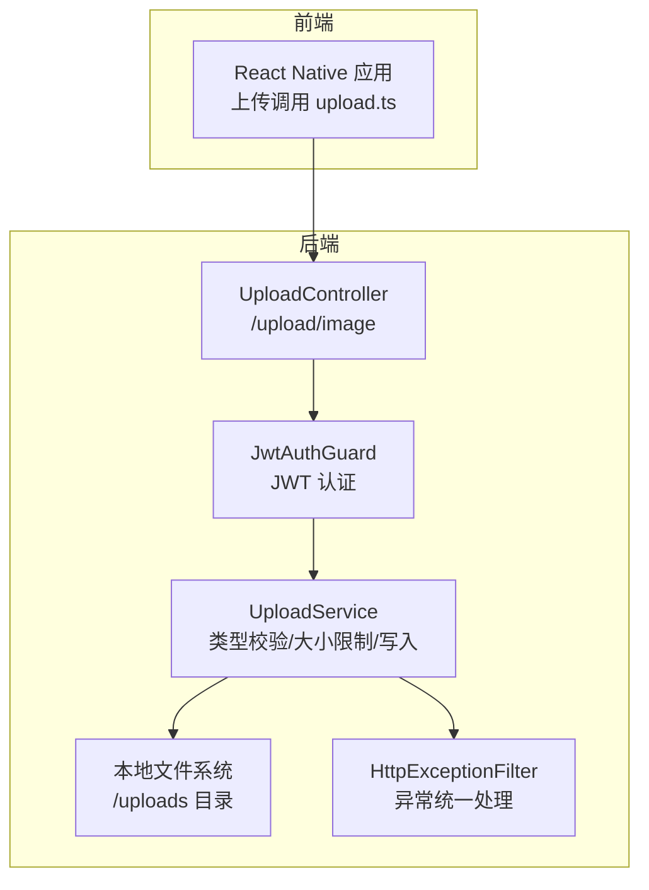
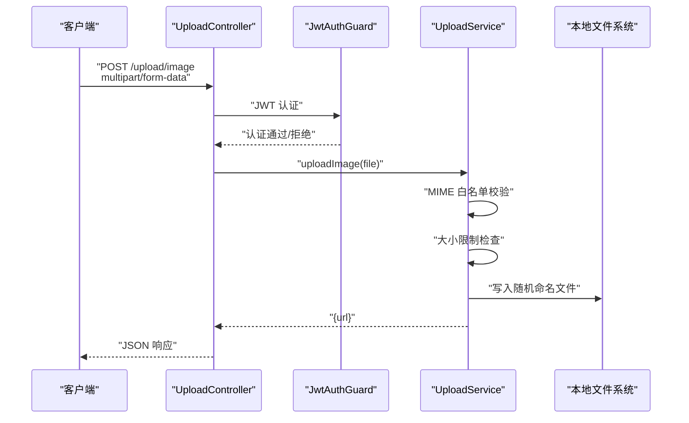
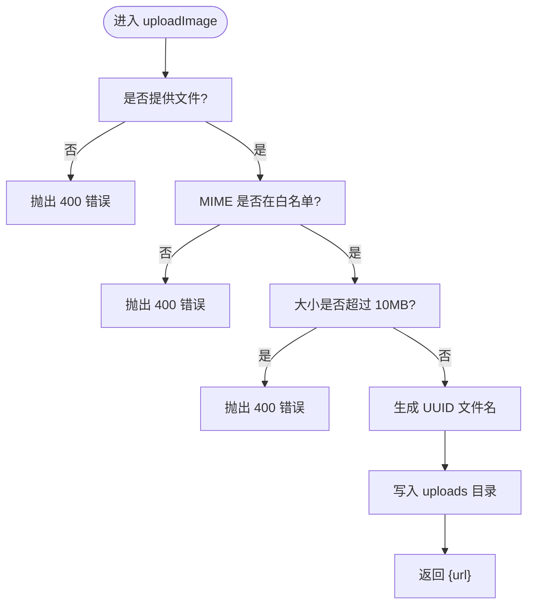
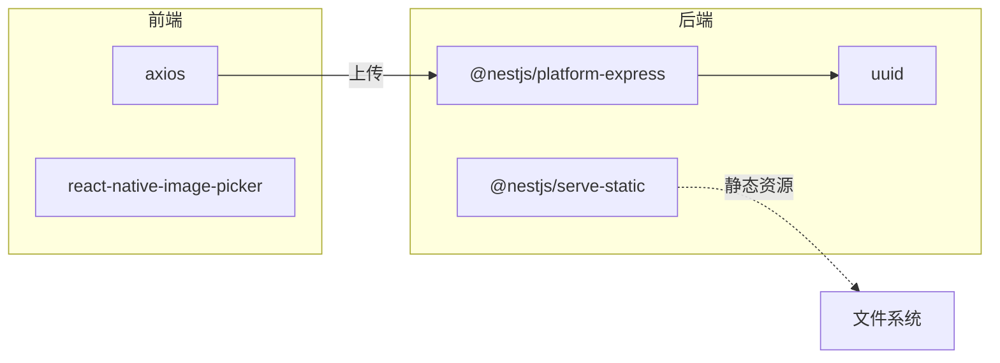

# 文件上传安全

<cite>
**本文引用的文件**
- [upload.controller.ts](file://backend/src/modules/upload/upload.controller.ts)
- [upload.service.ts](file://backend/src/modules/upload/upload.service.ts)
- [upload.ts](file://FreeDressApp/src/api/upload.ts)
- [jwt-auth.guard.ts](file://backend/src/common/guards/jwt-auth.guard.ts)
- [http-exception.filter.ts](file://backend/src/common/filters/http-exception.filter.ts)
- [package.json（后端）](file://backend/package.json)
- [package.json（前端）](file://FreeDressApp/package.json)
</cite>

## 目录
1. [简介](#简介)
2. [项目结构](#项目结构)
3. [核心组件](#核心组件)
4. [架构总览](#架构总览)
5. [详细组件分析](#详细组件分析)
6. [依赖关系分析](#依赖关系分析)
7. [性能考量](#性能考量)
8. [故障排查指南](#故障排查指南)
9. [结论](#结论)
10. [附录：文件上传安全开发指南](#附录文件上传安全开发指南)

## 简介
本文件上传安全文档面向畅搭(FreeDress)项目，聚焦于后端上传接口的安全实现与前端上传流程的配合，系统性阐述以下主题：
- 文件类型验证：基于MIME类型白名单与文件头校验建议
- 文件大小限制与存储空间管理策略
- 恶意文件检测与病毒扫描集成方案
- 文件命名规则与路径遍历防护
- 临时文件管理与清理机制
- 文件访问权限控制与URL安全策略
- 图片处理与缩略图生成的安全考虑
- 云存储服务的安全配置与访问控制
- 上传监控与异常处理机制
- 面向开发者的完整上传安全开发指南

## 项目结构
后端采用 NestJS 架构，上传模块位于 backend/src/modules/upload，前端通过 FreeDressApp/src/api/upload.ts 发起上传请求。认证采用 JWT 守卫，异常统一由全局过滤器处理。

图表来源
- [upload.controller.ts:1-51](file://backend/src/modules/upload/upload.controller.ts#L1-L51)
- [upload.service.ts:1-49](file://backend/src/modules/upload/upload.service.ts#L1-L49)
- [jwt-auth.guard.ts:1-22](file://backend/src/common/guards/jwt-auth.guard.ts#L1-L22)
- [http-exception.filter.ts:1-81](file://backend/src/common/filters/http-exception.filter.ts#L1-L81)

章节来源
- [upload.controller.ts:1-51](file://backend/src/modules/upload/upload.controller.ts#L1-L51)
- [upload.service.ts:1-49](file://backend/src/modules/upload/upload.service.ts#L1-L49)
- [upload.ts:1-21](file://FreeDressApp/src/api/upload.ts#L1-L21)
- [jwt-auth.guard.ts:1-22](file://backend/src/common/guards/jwt-auth.guard.ts#L1-L22)
- [http-exception.filter.ts:1-81](file://backend/src/common/filters/http-exception.filter.ts#L1-L81)

## 核心组件
- UploadController：定义上传接口、绑定文件拦截器、应用 JWT 认证守卫，并声明 Swagger 文档元数据。
- UploadService：执行文件类型白名单校验、大小限制、随机命名与本地写入；返回可访问的相对 URL。
- 前端 upload.ts：构造 multipart/form-data，拼装文件字段并发起请求。
- JwtAuthGuard：确保只有已认证用户可访问上传接口。
- HttpExceptionFilter：统一捕获并格式化异常响应。

章节来源
- [upload.controller.ts:1-51](file://backend/src/modules/upload/upload.controller.ts#L1-L51)
- [upload.service.ts:1-49](file://backend/src/modules/upload/upload.service.ts#L1-L49)
- [upload.ts:1-21](file://FreeDressApp/src/api/upload.ts#L1-L21)
- [jwt-auth-guard.ts:1-22](file://backend/src/common/guards/jwt-auth.guard.ts#L1-L22)
- [http-exception.filter.ts:1-81](file://backend/src/common/filters/http-exception.filter.ts#L1-L81)

## 架构总览
下图展示从客户端到后端上传服务的关键交互与安全控制点。

图表来源
- [upload.controller.ts:33-49](file://backend/src/modules/upload/upload.controller.ts#L33-L49)
- [upload.service.ts:25-47](file://backend/src/modules/upload/upload.service.ts#L25-L47)
- [jwt-auth.guard.ts:9-21](file://backend/src/common/guards/jwt-auth.guard.ts#L9-L21)

## 详细组件分析

### 后端控制器 UploadController
- 路由与鉴权：受 JWT 守卫保护，要求携带 Bearer Token。
- 文件拦截：使用 FileInterceptor 接收单文件字段。
- 类型与文档：明确 consumes 为 multipart/form-data，Swagger 描述清晰。
- 返回值：委托 UploadService 处理并返回可访问 URL。

章节来源
- [upload.controller.ts:28-50](file://backend/src/modules/upload/upload.controller.ts#L28-L50)

### 上传服务 UploadService
- 初始化与目录：启动时确保 uploads 目录存在。
- 输入校验：
  - 必填校验：空文件即抛出 400。
  - MIME 白名单：仅允许 image/jpeg、image/png、image/webp、image/gif。
  - 大小限制：默认 10MB。
- 命名与存储：
  - 使用 UUID 生成唯一文件名，扩展名来自原始文件或回退为 .jpg。
  - 写入到本地 uploads 目录，返回相对 URL。
- 注意：当前实现未进行“文件头魔数”校验，建议补充以增强安全性。

章节来源
- [upload.service.ts:15-48](file://backend/src/modules/upload/upload.service.ts#L15-L48)

### 前端上传 upload.ts
- 构造 FormData 并附加 file 字段。
- 自动推断或回退 MIME 类型（如 image/jpeg）。
- 以 multipart/form-data 提交至后端 /upload/image。
- 建议：在移动端选择图片时，优先使用受信任的相机/相册库，避免直接暴露系统文件路径。

章节来源
- [upload.ts:4-20](file://FreeDressApp/src/api/upload.ts#L4-L20)

### 认证与异常处理
- JwtAuthGuard：继承自 Passport 的 AuthGuard，失败时抛出 401 未授权。
- HttpExceptionFilter：统一包装错误响应，包含状态码、消息、时间戳与请求路径；开发环境打印堆栈便于调试。

章节来源
- [jwt-auth.guard.ts:8-21](file://backend/src/common/guards/jwt-auth.guard.ts#L8-L21)
- [http-exception.filter.ts:8-81](file://backend/src/common/filters/http-exception.filter.ts#L8-L81)

### 关键流程图：上传服务处理逻辑

图表来源
- [upload.service.ts:25-47](file://backend/src/modules/upload/upload.service.ts#L25-L47)

## 依赖关系分析
- 后端依赖：
  - @nestjs/platform-express：提供文件上传中间件与 FileInterceptor。
  - @nestjs/serve-static：静态资源服务（若启用），需谨慎配置访问路径。
  - uuid：生成唯一文件名。
- 前端依赖：
  - axios：发送 multipart 请求。
  - react-native-image-picker：移动端图片选择（与上传流程配合）。

图表来源
- [package.json（后端）:26-44](file://backend/package.json#L26-L44)
- [package.json（前端）:12-31](file://FreeDressApp/package.json#L12-L31)

章节来源
- [package.json（后端）:26-44](file://backend/package.json#L26-L44)
- [package.json（前端）:12-31](file://FreeDressApp/package.json#L12-L31)

## 性能考量
- 本地磁盘写入：适合小规模应用，注意磁盘 IO 与并发写入压力。
- 上传限速与并发：可在网关或 Nginx 层限制速率与并发连接数。
- 缓存与 CDN：对静态图片可引入 CDN 与缓存策略，减少源站压力。
- 压缩与缩略图：在上传后异步生成多尺寸缩略图，避免在线计算带来的延迟。

## 故障排查指南
- 常见错误与定位
  - 401 未授权：确认前端是否正确携带 Authorization: Bearer Token。
  - 400 参数错误：检查文件是否为空、MIME 是否在白名单、大小是否超限。
  - 500 服务器错误：查看开发环境日志堆栈（全局异常过滤器会输出）。
- 建议的日志与监控
  - 记录上传事件（用户 ID、文件名、大小、耗时、结果）。
  - 对异常进行分级统计与告警。

章节来源
- [jwt-auth.guard.ts:14-20](file://backend/src/common/guards/jwt-auth.guard.ts#L14-L20)
- [http-exception.filter.ts:50-80](file://backend/src/common/filters/http-exception.filter.ts#L50-L80)

## 结论
当前实现提供了基础但关键的安全控制点：JWT 认证、MIME 白名单、大小限制与随机命名。为进一步提升安全性，建议补充文件头魔数校验、病毒扫描、云存储接入与更严格的访问控制策略，并完善监控与审计体系。

## 附录：文件上传安全开发指南

### 1. 文件类型验证
- MIME 类型白名单：已在后端实现，建议保持严格且与前端一致。
- 文件头魔数校验：读取文件前 4–16 字节进行二次校验，防止伪装扩展名。
- 示例策略
  - JPEG：0xFFD8FFE0 或 0xFFD8FFE1
  - PNG：0x89504E47
  - GIF：0x47494638
  - WebP：0x52494646（需进一步判断）
- 参考实现位置
  - [upload.service.ts:30-33](file://backend/src/modules/upload/upload.service.ts#L30-L33)

### 2. 文件大小限制与存储空间管理
- 单文件上限：建议维持或下调至 10MB，并按业务场景细化。
- 存储配额：为用户或租户设置总容量上限，超出则拒绝上传。
- 清理策略：定期清理长时间未使用的临时文件与缩略图。
- 参考实现位置
  - [upload.service.ts:35-38](file://backend/src/modules/upload/upload.service.ts#L35-L38)

### 3. 恶意文件检测与病毒扫描
- 集成方案
  - 上传后异步扫描：将文件提交至第三方病毒扫描服务（如 ClamAV、VirusTotal API）。
  - 多层检测：结合 MIME、魔数与启发式规则。
- 处理流程
  - 通过后立即隔离至扫描队列，成功后再移动至公开目录。
  - 失败或可疑文件删除并记录审计日志。
- 参考实现位置
  - [upload.service.ts:44-46](file://backend/src/modules/upload/upload.service.ts#L44-L46)

### 4. 文件命名规则与路径遍历防护
- 命名规则
  - 使用 UUID 作为主名，扩展名来自可信来源。
  - 不使用用户可控的原始文件名直接作为存储名。
- 路径遍历防护
  - 绝对禁止 ../ 等路径片段。
  - 使用安全的路径拼接工具，避免拼接用户输入。
- 参考实现位置
  - [upload.service.ts:40-42](file://backend/src/modules/upload/upload.service.ts#L40-L42)

### 5. 临时文件管理与清理机制
- 临时目录：上传接收阶段使用内存缓冲，必要时落盘到临时目录。
- 生命周期：扫描完成后删除临时文件；失败或超时自动清理。
- 参考实现位置
  - [upload.controller.ts:36-36](file://backend/src/modules/upload/upload.controller.ts#L36-L36)

### 6. 文件访问权限控制与URL安全策略
- 权限控制
  - 仅认证用户可上传；下载需鉴权或使用带时效签名 URL。
  - 对私有资源使用预签名 URL 或代理下载。
- URL 安全
  - 避免暴露真实文件路径；使用短链或令牌化 URL。
  - 对外只暴露受控域名与路径。
- 参考实现位置
  - [jwt-auth.guard.ts:9-21](file://backend/src/common/guards/jwt-auth.guard.ts#L9-L21)

### 7. 图片处理与缩略图生成的安全考虑
- 处理流程
  - 上传后异步生成多尺寸缩略图，保存至独立目录。
  - 限制最大生成尺寸，防止内存与 CPU 泄漏。
- 安全要点
  - 仅处理已知安全的图片格式与尺寸。
  - 对异常图片进行降级处理或拒绝生成。
- 参考实现位置
  - [upload.service.ts:44-46](file://backend/src/modules/upload/upload.service.ts#L44-L46)

### 8. 云存储服务的安全配置与访问控制
- 配置要点
  - 使用服务端签名 URL 或服务端代理下载。
  - 设置最小权限与访问策略（Bucket Policy/对象 ACL）。
- 访问控制
  - 私有对象仅允许授权访问；公开对象仅限必要范围。
- 参考实现位置
  - [upload.service.ts:46-46](file://backend/src/modules/upload/upload.service.ts#L46-L46)

### 9. 文件上传监控与异常处理机制
- 监控指标
  - 上传成功率、失败原因分布、平均耗时、并发数。
- 异常处理
  - 使用全局异常过滤器统一返回结构化错误。
  - 开发环境打印堆栈，生产环境不泄露敏感信息。
- 参考实现位置
  - [http-exception.filter.ts:8-81](file://backend/src/common/filters/http-exception.filter.ts#L8-L81)

### 10. 开发者最佳实践清单
- 前端
  - 仅允许受信来源选择图片；避免直接暴露系统路径。
  - 在上传前做本地格式与大小预检。
- 后端
  - 严格白名单与二次魔数校验。
  - 限制并发与速率，避免资源耗尽。
  - 异步扫描与隔离存储，失败快速回滚。
  - 审计日志：记录上传人、文件名、大小、时间、结果。
- 运维
  - 定期巡检磁盘与配额；设置告警阈值。
  - 定期更新病毒库与扫描策略。