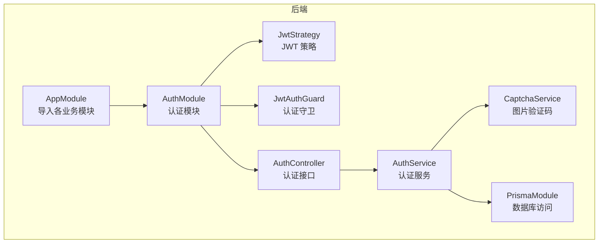
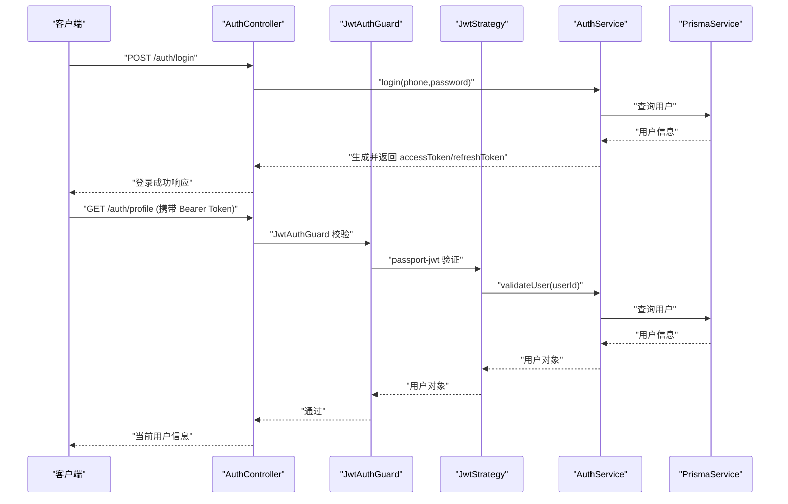
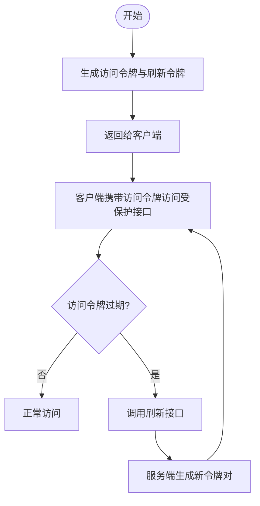
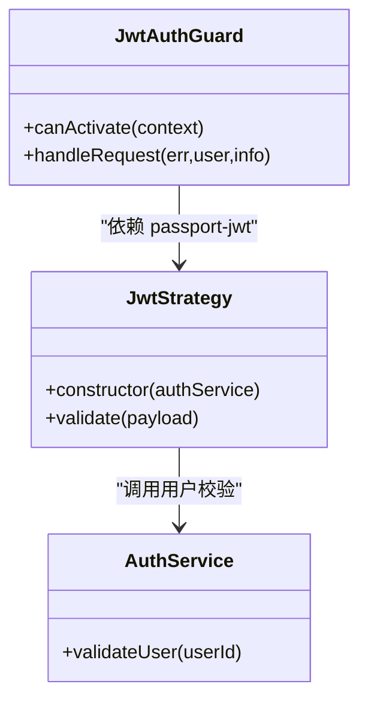
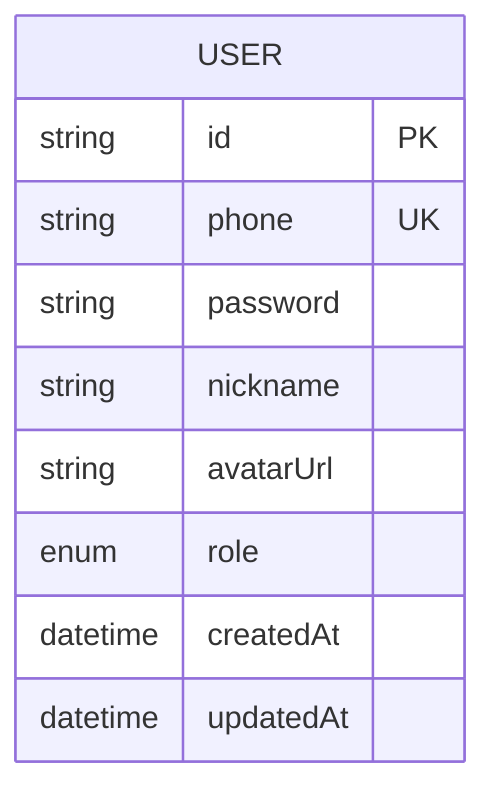
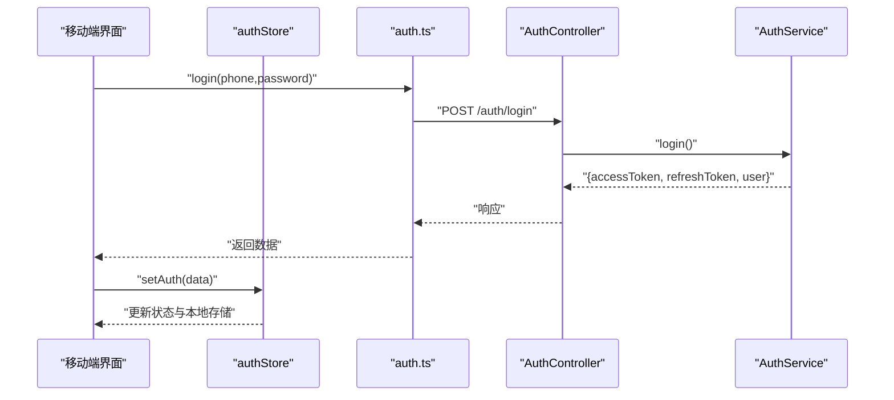
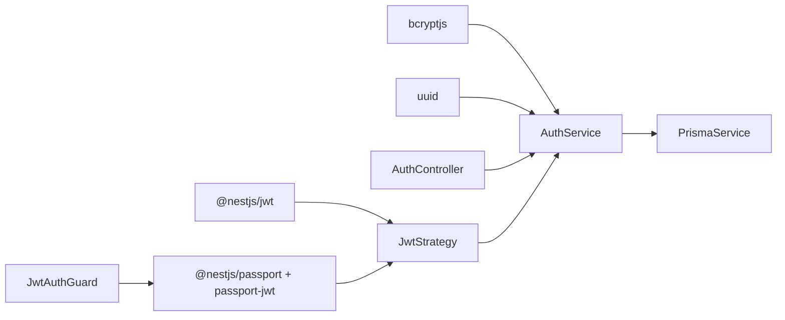

# 认证与授权

<cite>
**本文引用的文件**
- [backend/src/modules/auth/auth.controller.ts](file://backend/src/modules/auth/auth.controller.ts)
- [backend/src/modules/auth/auth.service.ts](file://backend/src/modules/auth/auth.service.ts)
- [backend/src/modules/auth/captcha.service.ts](file://backend/src/modules/auth/captcha.service.ts)
- [backend/src/modules/auth/strategies/jwt.strategy.ts](file://backend/src/modules/auth/strategies/jwt.strategy.ts)
- [backend/src/common/guards/jwt-auth.guard.ts](file://backend/src/common/guards/jwt-auth.guard.ts)
- [backend/src/common/decorators/current-user.decorator.ts](file://backend/src/common/decorators/current-user.decorator.ts)
- [backend/src/modules/auth/dto/login.dto.ts](file://backend/src/modules/auth/dto/login.dto.ts)
- [backend/src/modules/auth/dto/register.dto.ts](file://backend/src/modules/auth/dto/register.dto.ts)
- [backend/src/modules/auth/dto/reset-password.dto.ts](file://backend/src/modules/auth/dto/reset-password.dto.ts)
- [backend/src/app.module.ts](file://backend/src/app.module.ts)
- [backend/prisma/schema.prisma](file://backend/prisma/schema.prisma)
- [backend/src/prisma/prisma.service.ts](file://backend/src/prisma/prisma.service.ts)
- [backend/package.json](file://backend/package.json)
- [FreeDressApp/src/store/authStore.ts](file://FreeDressApp/src/store/authStore.ts)
- [FreeDressApp/src/api/auth.ts](file://FreeDressApp/src/api/auth.ts)
- [FreeDressApp/src/screens/LoginScreen.tsx](file://FreeDressApp/src/screens/LoginScreen.tsx)
- [FreeDressApp/src/screens/RegisterScreen.tsx](file://FreeDressApp/src/screens/RegisterScreen.tsx)
</cite>

## 目录
1. [简介](#简介)
2. [项目结构](#项目结构)
3. [核心组件](#核心组件)
4. [架构总览](#架构总览)
5. [详细组件分析](#详细组件分析)
6. [依赖关系分析](#依赖关系分析)
7. [性能考虑](#性能考虑)
8. [故障排查指南](#故障排查指南)
9. [结论](#结论)
10. [附录](#附录)

## 简介
本文件面向畅搭(FreeDress)项目的开发者，系统化阐述后端基于 NestJS 的认证与授权实现，涵盖以下主题：
- JWT 认证机制：Token 生成、验证、刷新与过期处理
- Passport.js 策略：JWT 策略的配置与实现细节
- 认证守卫：JwtAuthGuard 的工作原理与错误处理
- 用户权限与角色管理：数据库模型与默认角色
- API 访问令牌的获取与使用：后端接口与前端调用方式
- 认证中间件与自定义实现：策略注入、守卫应用与参数装饰器
- 开发者最佳实践：安全、性能与可维护性建议

## 项目结构
后端采用模块化设计，认证相关能力集中在 auth 模块，并通过全局守卫与策略实现统一的认证控制。

图表来源
- [backend/src/app.module.ts:13-30](file://backend/src/app.module.ts#L13-L30)
- [backend/src/modules/auth/auth.controller.ts:16-22](file://backend/src/modules/auth/auth.controller.ts#L16-L22)
- [backend/src/modules/auth/strategies/jwt.strategy.ts:10-21](file://backend/src/modules/auth/strategies/jwt.strategy.ts#L10-L21)
- [backend/src/common/guards/jwt-auth.guard.ts:8-21](file://backend/src/common/guards/jwt-auth.guard.ts#L8-L21)

章节来源
- [backend/src/app.module.ts:13-30](file://backend/src/app.module.ts#L13-L30)
- [backend/src/modules/auth/auth.controller.ts:16-22](file://backend/src/modules/auth/auth.controller.ts#L16-L22)

## 核心组件
- 认证控制器(AuthController)：提供验证码、注册、登录、忘记密码、重置密码、刷新 Token、获取当前用户信息等接口。
- 认证服务(AuthService)：实现注册、登录、Token 生成与刷新、忘记密码与重置密码、用户校验。
- JWT 策略(JwtStrategy)：从请求头解析 Bearer Token，验证签名与过期时间，并调用服务层校验用户存在性。
- 认证守卫(JwtAuthGuard)：继承 Passport 的 AuthGuard('jwt')，统一处理认证失败场景。
- 图片验证码(CaptchaService)：生成带噪声干扰的 SVG 验证码，支持过期与限流控制。
- 参数装饰器(CurrentUser)：简化从请求上下文中提取用户信息或指定字段。
- 数据库模型(schema.prisma)：定义用户与角色模型，支持默认角色 USER/VIP。

章节来源
- [backend/src/modules/auth/auth.controller.ts:18-91](file://backend/src/modules/auth/auth.controller.ts#L18-L91)
- [backend/src/modules/auth/auth.service.ts:24-278](file://backend/src/modules/auth/auth.service.ts#L24-L278)
- [backend/src/modules/auth/strategies/jwt.strategy.ts:10-38](file://backend/src/modules/auth/strategies/jwt.strategy.ts#L10-L38)
- [backend/src/common/guards/jwt-auth.guard.ts:8-21](file://backend/src/common/guards/jwt-auth.guard.ts#L8-L21)
- [backend/src/modules/auth/captcha.service.ts:30-258](file://backend/src/modules/auth/captcha.service.ts#L30-L258)
- [backend/src/common/decorators/current-user.decorator.ts:7-15](file://backend/src/common/decorators/current-user.decorator.ts#L7-L15)
- [backend/prisma/schema.prisma:13-37](file://backend/prisma/schema.prisma#L13-L37)

## 架构总览
下图展示从客户端发起认证请求到后端完成 JWT 验证与用户信息返回的整体流程。

图表来源
- [backend/src/modules/auth/auth.controller.ts:48-90](file://backend/src/modules/auth/auth.controller.ts#L48-L90)
- [backend/src/common/guards/jwt-auth.guard.ts:9-20](file://backend/src/common/guards/jwt-auth.guard.ts#L9-L20)
- [backend/src/modules/auth/strategies/jwt.strategy.ts:28-37](file://backend/src/modules/auth/strategies/jwt.strategy.ts#L28-L37)
- [backend/src/modules/auth/auth.service.ts:102-134](file://backend/src/modules/auth/auth.service.ts#L102-L134)
- [backend/src/prisma/prisma.service.ts:8-26](file://backend/src/prisma/prisma.service.ts#L8-L26)

## 详细组件分析

### JWT 认证机制
- Token 类型与有效期
  - 访问令牌(accessToken)：默认 7 天过期，用于日常受保护资源访问。
  - 刷新令牌(refreshToken)：默认 30 天过期，用于换取新的访问令牌。
- 生成流程
  - 登录与注册成功后，服务层同时生成访问令牌与刷新令牌，并返回给客户端。
  - 刷新接口使用 JwtAuthGuard 保护，内部再次生成新的令牌对。
- 过期与刷新
  - 服务层通过 NestJS JwtService 的 signAsync 生成令牌，分别设置不同过期时间。
  - 刷新接口直接复用当前用户身份生成新令牌，无需额外校验。

图表来源
- [backend/src/modules/auth/auth.service.ts:153-171](file://backend/src/modules/auth/auth.service.ts#L153-L171)
- [backend/src/modules/auth/auth.controller.ts:77-79](file://backend/src/modules/auth/auth.controller.ts#L77-L79)

章节来源
- [backend/src/modules/auth/auth.service.ts:153-171](file://backend/src/modules/auth/auth.service.ts#L153-L171)
- [backend/src/modules/auth/auth.controller.ts:77-79](file://backend/src/modules/auth/auth.controller.ts#L77-L79)

### Passport.js 策略与 JwtAuthGuard
- JwtStrategy
  - 从 Authorization 请求头提取 Bearer Token。
  - 关闭忽略过期选项，严格校验过期时间。
  - 使用环境变量作为密钥(secretOrKey)，验证签名。
  - validate(payload) 中调用 AuthService.validateUser(payload.sub)，确保用户仍存在且有效。
- JwtAuthGuard
  - 继承 AuthGuard('jwt')，在 handleRequest 中统一抛出未授权异常，保证接口一致性。

图表来源
- [backend/src/modules/auth/strategies/jwt.strategy.ts:10-38](file://backend/src/modules/auth/strategies/jwt.strategy.ts#L10-L38)
- [backend/src/common/guards/jwt-auth.guard.ts:8-21](file://backend/src/common/guards/jwt-auth.guard.ts#L8-L21)
- [backend/src/modules/auth/auth.service.ts:260-277](file://backend/src/modules/auth/auth.service.ts#L260-L277)

章节来源
- [backend/src/modules/auth/strategies/jwt.strategy.ts:10-38](file://backend/src/modules/auth/strategies/jwt.strategy.ts#L10-L38)
- [backend/src/common/guards/jwt-auth.guard.ts:8-21](file://backend/src/common/guards/jwt-auth.guard.ts#L8-L21)
- [backend/src/modules/auth/auth.service.ts:260-277](file://backend/src/modules/auth/auth.service.ts#L260-L277)

### 用户权限与角色管理
- 角色模型
  - 用户模型包含 role 字段，默认值为 USER；VIP 为扩展角色类型。
- 接口保护
  - 当前认证体系以登录态为核心，未在现有代码中实现基于角色的细粒度权限控制。
  - 如需扩展 RBAC，可在 JwtAuthGuard 或自定义守卫中增加角色校验逻辑，并结合 DTO/拦截器实现资源级权限。

图表来源
- [backend/prisma/schema.prisma:13-31](file://backend/prisma/schema.prisma#L13-L31)

章节来源
- [backend/prisma/schema.prisma:13-37](file://backend/prisma/schema.prisma#L13-L37)

### API 访问令牌的获取与使用
- 后端接口
  - 获取验证码：GET /auth/captcha
  - 用户注册：POST /auth/register（需验证码）
  - 用户登录：POST /auth/login（返回 accessToken/refreshToken）
  - 忘记密码：POST /auth/forgot-password（返回 resetToken）
  - 重置密码：POST /auth/reset-password（使用 resetToken）
  - 刷新 Token：POST /auth/refresh（受 JwtAuthGuard 保护）
  - 获取当前用户：GET /auth/profile（受 JwtAuthGuard 保护）
- 前端调用
  - 客户端通过 api/auth.ts 封装的函数调用上述接口。
  - 登录/注册成功后，使用 Zustand 状态管理保存 accessToken/refreshToken 与用户信息，并持久化到本地存储。
  - 访问受保护接口时，自动在请求头添加 Authorization: Bearer <token>。

图表来源
- [FreeDressApp/src/api/auth.ts:45-53](file://FreeDressApp/src/api/auth.ts#L45-L53)
- [FreeDressApp/src/store/authStore.ts:39-57](file://FreeDressApp/src/store/authStore.ts#L39-L57)
- [backend/src/modules/auth/auth.controller.ts:48-50](file://backend/src/modules/auth/auth.controller.ts#L48-L50)
- [backend/src/modules/auth/auth.service.ts:102-134](file://backend/src/modules/auth/auth.service.ts#L102-L134)

章节来源
- [FreeDressApp/src/api/auth.ts:12-100](file://FreeDressApp/src/api/auth.ts#L12-L100)
- [FreeDressApp/src/store/authStore.ts:28-122](file://FreeDressApp/src/store/authStore.ts#L28-L122)
- [backend/src/modules/auth/auth.controller.ts:27-90](file://backend/src/modules/auth/auth.controller.ts#L27-L90)

### 认证中间件与自定义实现
- 策略注入
  - JwtStrategy 在 auth.module 中被注册为 'jwt' 策略，供 JwtAuthGuard 使用。
- 守卫应用
  - 在需要登录保护的接口上使用 @UseGuards(JwtAuthGuard) 或 @ApiBearerAuth()。
- 参数装饰器
  - CurrentUser 装饰器支持两种用法：获取完整用户对象或指定字段（如 sub、phone）。
- 自定义扩展
  - 可在 JwtAuthGuard.handleRequest 中增加日志、审计或自定义错误信息。
  - 可在 JwtStrategy.validate 中加入角色校验、用户状态检查等。

章节来源
- [backend/src/common/guards/jwt-auth.guard.ts:8-21](file://backend/src/common/guards/jwt-auth.guard.ts#L8-L21)
- [backend/src/common/decorators/current-user.decorator.ts:7-15](file://backend/src/common/decorators/current-user.decorator.ts#L7-L15)
- [backend/src/modules/auth/auth.controller.ts:74-89](file://backend/src/modules/auth/auth.controller.ts#L74-L89)

## 依赖关系分析
- 外部依赖
  - @nestjs/jwt：生成与解析 JWT。
  - @nestjs/passport + passport-jwt：集成 Passport 策略。
  - bcryptjs：密码加密与校验。
  - uuid：重置令牌生成。
- 内部依赖
  - AuthController 依赖 AuthService 与 CaptchaService。
  - JwtStrategy 依赖 AuthService 进行用户校验。
  - JwtAuthGuard 依赖 passport-jwt 策略。
  - AuthService 依赖 PrismaService 进行数据库访问。

图表来源
- [backend/package.json:30-44](file://backend/package.json#L30-L44)
- [backend/src/modules/auth/strategies/jwt.strategy.ts:1-5](file://backend/src/modules/auth/strategies/jwt.strategy.ts#L1-L5)
- [backend/src/modules/auth/auth.service.ts:1-10](file://backend/src/modules/auth/auth.service.ts#L1-L10)
- [backend/src/common/guards/jwt-auth.guard.ts:1-2](file://backend/src/common/guards/jwt-auth.guard.ts#L1-L2)

章节来源
- [backend/package.json:26-44](file://backend/package.json#L26-L44)
- [backend/src/modules/auth/auth.service.ts:1-10](file://backend/src/modules/auth/auth.service.ts#L1-L10)

## 性能考虑
- Token 生成并发
  - 生成访问令牌与刷新令牌采用 Promise.all 并行执行，降低响应延迟。
- 验证码与限流
  - 验证码 2 分钟过期、最大尝试次数限制与 IP 限流（每分钟最多 10 次），有效防止暴力破解与滥用。
- 定时清理
  - 重置令牌与验证码定期清理，避免内存泄漏。
- 建议优化
  - 生产环境将内存存储替换为 Redis，提升高并发下的稳定性与一致性。
  - 对频繁访问的公开接口启用缓存，减少数据库压力。

章节来源
- [backend/src/modules/auth/auth.service.ts:156-165](file://backend/src/modules/auth/auth.service.ts#L156-L165)
- [backend/src/modules/auth/captcha.service.ts:30-51](file://backend/src/modules/auth/captcha.service.ts#L30-L51)
- [backend/src/modules/auth/captcha.service.ts:241-257](file://backend/src/modules/auth/captcha.service.ts#L241-L257)

## 故障排查指南
- 常见错误与定位
  - 未登录或 Token 失效：JwtAuthGuard.handleRequest 抛出未授权异常，检查前端是否正确携带 Bearer Token。
  - 验证码错误/过期：CaptchaService 返回相应错误，检查 captchaId 与 captchaAnswer 是否匹配且未超时。
  - 用户不存在：JwtStrategy.validate 调用 AuthService.validateUser 时抛出异常，检查用户 ID 是否有效。
  - 密码重置令牌无效：AuthService.resetPassword 校验失败，检查 resetToken 是否存在且未过期。
- 建议排查步骤
  - 检查环境变量 JWT_SECRET/JWT_REFRESH_SECRET 是否正确配置。
  - 确认请求头 Authorization 格式为 Bearer <token>。
  - 查看服务端日志与 Prisma 日志，定位数据库查询问题。
  - 使用 Swagger 文档测试接口，逐步缩小问题范围。

章节来源
- [backend/src/common/guards/jwt-auth.guard.ts:14-20](file://backend/src/common/guards/jwt-auth.guard.ts#L14-L20)
- [backend/src/modules/auth/captcha.service.ts:87-122](file://backend/src/modules/auth/captcha.service.ts#L87-L122)
- [backend/src/modules/auth/auth.service.ts:260-277](file://backend/src/modules/auth/auth.service.ts#L260-L277)
- [backend/src/modules/auth/auth.service.ts:214-242](file://backend/src/modules/auth/auth.service.ts#L214-L242)

## 结论
畅搭项目的认证体系以 NestJS + Passport + JWT 为基础，实现了完整的登录、注册、验证码、忘记/重置密码与 Token 刷新流程。通过 JwtAuthGuard 与 JwtStrategy 提供了统一的认证入口，配合 Prisma 实现用户数据访问。当前版本侧重登录态保护，角色与资源级权限可按需扩展。建议在生产环境中引入 Redis 存储与更严格的限流策略，持续完善安全与性能。

## 附录
- 环境变量建议
  - JWT_SECRET：访问令牌密钥
  - JWT_REFRESH_SECRET：刷新令牌密钥
  - DATABASE_URL：数据库连接地址
- 前端存储键名
  - ACCESS_TOKEN、REFRESH_TOKEN、USER_INFO：用于本地持久化

章节来源
- [backend/src/modules/auth/auth.service.ts:157-164](file://backend/src/modules/auth/auth.service.ts#L157-L164)
- [FreeDressApp/src/store/authStore.ts:52-56](file://FreeDressApp/src/store/authStore.ts#L52-L56)