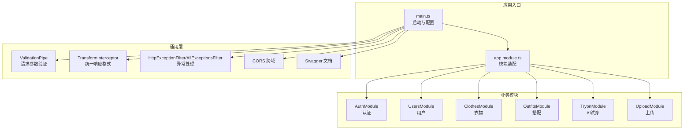
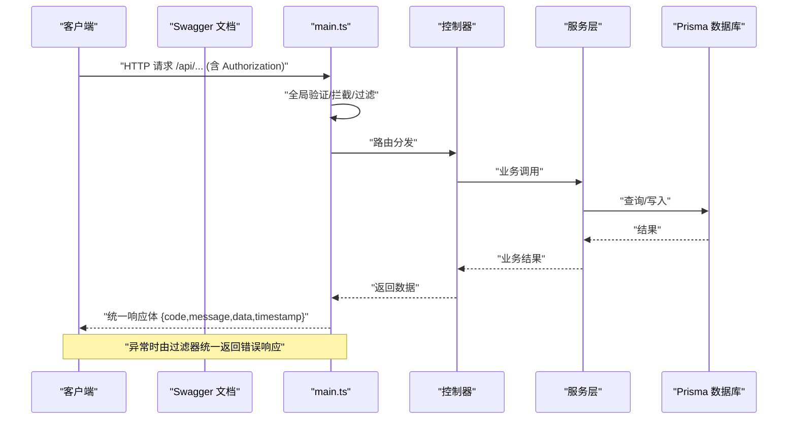
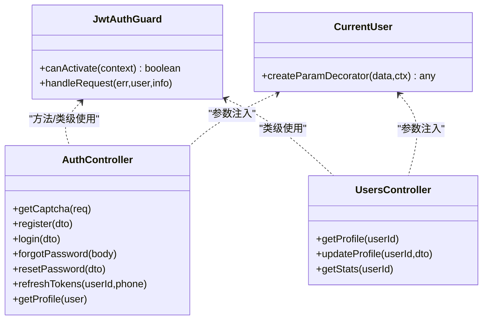
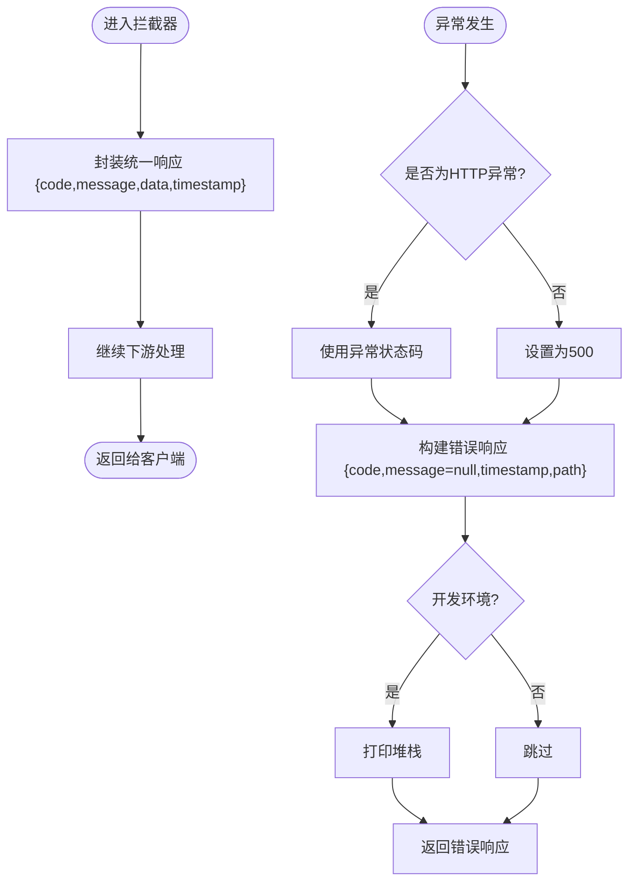
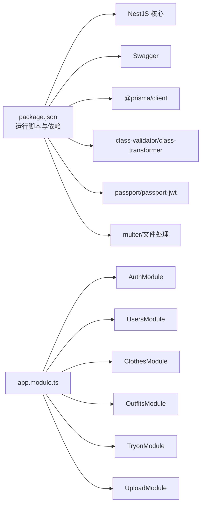

# API设计规范

<cite>
**本文引用的文件**
- [backend/src/main.ts](file://backend/src/main.ts)
- [backend/src/app.module.ts](file://backend/src/app.module.ts)
- [backend/src/common/interceptors/transform.interceptor.ts](file://backend/src/common/interceptors/transform.interceptor.ts)
- [backend/src/common/filters/http-exception.filter.ts](file://backend/src/common/filters/http-exception.filter.ts)
- [backend/src/common/guards/jwt-auth.guard.ts](file://backend/src/common/guards/jwt-auth.guard.ts)
- [backend/src/common/decorators/current-user.decorator.ts](file://backend/src/common/decorators/current-user.decorator.ts)
- [backend/src/modules/auth/auth.controller.ts](file://backend/src/modules/auth/auth.controller.ts)
- [backend/src/modules/auth/dto/login.dto.ts](file://backend/src/modules/auth/dto/login.dto.ts)
- [backend/src/modules/auth/dto/register.dto.ts](file://backend/src/modules/auth/dto/register.dto.ts)
- [backend/src/modules/users/users.controller.ts](file://backend/src/modules/users/users.controller.ts)
- [backend/src/modules/clothes/clothes.controller.ts](file://backend/src/modules/clothes/clothes.controller.ts)
- [backend/src/modules/outfits/outfits.controller.ts](file://backend/src/modules/outfits/outfits.controller.ts)
- [backend/src/modules/tryon/tryon.controller.ts](file://backend/src/modules/tryon/tryon.controller.ts)
- [backend/src/modules/upload/upload.controller.ts](file://backend/src/modules/upload/upload.controller.ts)
- [backend/package.json](file://backend/package.json)
</cite>

## 目录
1. [引言](#引言)
2. [项目结构](#项目结构)
3. [核心组件](#核心组件)
4. [架构总览](#架构总览)
5. [详细组件分析](#详细组件分析)
6. [依赖关系分析](#依赖关系分析)
7. [性能考虑](#性能考虑)
8. [故障排查指南](#故障排查指南)
9. [结论](#结论)
10. [附录](#附录)

## 引言
本规范面向畅搭（FreeDress）项目的后端API设计与实现，基于实际代码库总结出统一的RESTful设计原则、响应与错误处理标准、认证授权机制、版本控制策略以及文档与测试实践。目标是确保API具备一致性、可维护性、可扩展性和安全性。

## 项目结构
后端采用NestJS框架，模块化组织业务功能，统一通过全局中间件、拦截器与过滤器实现横切关注点（验证、响应格式、异常处理）。Swagger用于自动生成API文档，静态文件服务支持媒体资源访问。

图表来源
- [backend/src/main.ts:12-59](file://backend/src/main.ts#L12-L59)
- [backend/src/app.module.ts:13-31](file://backend/src/app.module.ts#L13-L31)

章节来源
- [backend/src/main.ts:12-59](file://backend/src/main.ts#L12-L59)
- [backend/src/app.module.ts:13-31](file://backend/src/app.module.ts#L13-L31)

## 核心组件
- 全局验证管道：启用白名单、禁止非白名单字段、自动类型转换，确保请求数据安全与一致。
- 统一响应拦截器：将所有成功响应包装为统一结构，包含状态码、消息、数据体与时间戳。
- 异常过滤器：HTTP异常与全局异常统一格式输出，开发环境打印堆栈便于调试。
- CORS：允许凭据跨域，满足前端多端访问需求。
- Swagger：配置Bearer认证，生成在线API文档，路径为 /api/docs。
- 全局前缀：所有路由统一添加 /api 前缀，便于版本化与隔离。

章节来源
- [backend/src/main.ts:15-39](file://backend/src/main.ts#L15-L39)
- [backend/src/common/interceptors/transform.interceptor.ts:19-31](file://backend/src/common/interceptors/transform.interceptor.ts#L19-L31)
- [backend/src/common/filters/http-exception.filter.ts:8-80](file://backend/src/common/filters/http-exception.filter.ts#L8-L80)

## 架构总览
下图展示从客户端到控制器、服务与数据库的典型调用链路，以及统一响应与异常处理的横切流程。

图表来源
- [backend/src/main.ts:12-59](file://backend/src/main.ts#L12-L59)
- [backend/src/common/interceptors/transform.interceptor.ts:21-29](file://backend/src/common/interceptors/transform.interceptor.ts#L21-L29)
- [backend/src/common/filters/http-exception.filter.ts:10-28](file://backend/src/common/filters/http-exception.filter.ts#L10-L28)

## 详细组件分析

### 认证与授权
- 守卫机制：JwtAuthGuard 对受保护路由生效，未通过认证时抛出未授权异常。
- 当前用户注入：CurrentUser 装饰器从请求上下文中提取用户信息，支持按字段取值。
- 控制器示例：认证、用户、衣物、搭配、AI试穿、上传模块均在类级别或方法级别使用守卫，并标注Bearer认证。

图表来源
- [backend/src/common/guards/jwt-auth.guard.ts:8-21](file://backend/src/common/guards/jwt-auth.guard.ts#L8-L21)
- [backend/src/common/decorators/current-user.decorator.ts:7-15](file://backend/src/common/decorators/current-user.decorator.ts#L7-L15)
- [backend/src/modules/auth/auth.controller.ts:16-91](file://backend/src/modules/auth/auth.controller.ts#L16-L91)
- [backend/src/modules/users/users.controller.ts:12-48](file://backend/src/modules/users/users.controller.ts#L12-L48)

章节来源
- [backend/src/common/guards/jwt-auth.guard.ts:8-21](file://backend/src/common/guards/jwt-auth.guard.ts#L8-L21)
- [backend/src/common/decorators/current-user.decorator.ts:7-15](file://backend/src/common/decorators/current-user.decorator.ts#L7-L15)
- [backend/src/modules/auth/auth.controller.ts:16-91](file://backend/src/modules/auth/auth.controller.ts#L16-L91)
- [backend/src/modules/users/users.controller.ts:12-48](file://backend/src/modules/users/users.controller.ts#L12-L48)

### 统一响应格式与错误处理
- 成功响应：统一包装为 {code,message,data,timestamp}，默认code=200，message='success'。
- 错误响应：HTTP异常映射HTTP状态码；全局异常捕获未知错误，默认500。
- 开发环境：打印异常堆栈便于定位问题。

图表来源
- [backend/src/common/interceptors/transform.interceptor.ts:21-29](file://backend/src/common/interceptors/transform.interceptor.ts#L21-L29)
- [backend/src/common/filters/http-exception.filter.ts:10-28](file://backend/src/common/filters/http-exception.filter.ts#L10-L28)
- [backend/src/common/filters/http-exception.filter.ts:52-79](file://backend/src/common/filters/http-exception.filter.ts#L52-L79)

章节来源
- [backend/src/common/interceptors/transform.interceptor.ts:8-31](file://backend/src/common/interceptors/transform.interceptor.ts#L8-L31)
- [backend/src/common/filters/http-exception.filter.ts:8-80](file://backend/src/common/filters/http-exception.filter.ts#L8-L80)

### RESTful设计原则与URL结构
- 资源命名：采用名词复数形式，如 /api/auth、/api/users、/api/clothes、/api/outfits、/api/tryon、/api/upload。
- HTTP方法：遵循REST约定，如 GET/POST/PUT/DELETE，结合子资源与动作后缀（如 /:id、/:id/favorite）。
- 查询参数：支持枚举与可选参数，如衣物分类筛选。
- 全局前缀：所有路由统一以 /api 开头，便于版本化与扩展。

章节来源
- [backend/src/modules/auth/auth.controller.ts:16-91](file://backend/src/modules/auth/auth.controller.ts#L16-L91)
- [backend/src/modules/users/users.controller.ts:12-48](file://backend/src/modules/users/users.controller.ts#L12-L48)
- [backend/src/modules/clothes/clothes.controller.ts:24-101](file://backend/src/modules/clothes/clothes.controller.ts#L24-L101)
- [backend/src/modules/outfits/outfits.controller.ts:10-64](file://backend/src/modules/outfits/outfits.controller.ts#L10-L64)
- [backend/src/modules/tryon/tryon.controller.ts:10-40](file://backend/src/modules/tryon/tryon.controller.ts#L10-L40)
- [backend/src/modules/upload/upload.controller.ts:28-50](file://backend/src/modules/upload/upload.controller.ts#L28-L50)
- [backend/src/main.ts:37-38](file://backend/src/main.ts#L37-L38)

### DTO与输入校验
- 登录DTO：手机号格式校验、密码长度与非空校验。
- 注册DTO：手机号、密码、验证码ID与答案长度与格式校验，昵称可选。
- 其他模块DTO：遵循相同校验策略，确保输入合法性。

章节来源
- [backend/src/modules/auth/dto/login.dto.ts:7-19](file://backend/src/modules/auth/dto/login.dto.ts#L7-L19)
- [backend/src/modules/auth/dto/register.dto.ts:8-37](file://backend/src/modules/auth/dto/register.dto.ts#L8-L37)

### 文件上传与静态资源
- 图片上传：multipart/form-data，文件字段名为 file，受JWT保护。
- 静态资源：/uploads 前缀访问上传目录，配合ServeStaticModule。

章节来源
- [backend/src/modules/upload/upload.controller.ts:33-49](file://backend/src/modules/upload/upload.controller.ts#L33-L49)
- [backend/src/app.module.ts:19-22](file://backend/src/app.module.ts#L19-L22)
- [backend/src/main.ts:50-52](file://backend/src/main.ts#L50-L52)

## 依赖关系分析
- 模块装配：AppModule集中导入认证、用户、衣物、搭配、AI试穿、上传与Prisma模块。
- 运行脚本：提供开发、生产、测试、Prisma相关脚本，支持覆盖率与E2E测试。

图表来源
- [backend/package.json:8-25](file://backend/package.json#L8-L25)
- [backend/package.json:26-45](file://backend/package.json#L26-L45)
- [backend/src/app.module.ts:14-30](file://backend/src/app.module.ts#L14-L30)

章节来源
- [backend/src/app.module.ts:13-31](file://backend/src/app.module.ts#L13-L31)
- [backend/package.json:8-90](file://backend/package.json#L8-L90)

## 性能考虑
- 全局验证与拦截器：建议在高并发场景下评估ValidationPipe与拦截器对延迟的影响，必要时对热点接口进行优化或降级。
- 异常处理：开发环境打印堆栈会带来额外开销，生产环境建议关闭或限制日志量。
- 文件上传：建议限制文件大小与类型，结合CDN与缓存策略提升静态资源访问效率。
- 数据库访问：合理使用分页、索引与查询优化，避免N+1问题。

## 故障排查指南
- 统一错误响应：检查响应体中的 code、message、timestamp 与 path 字段，快速定位问题范围。
- 开发环境：若出现500错误，查看控制台堆栈信息，确认异常过滤器是否正常工作。
- 认证失败：确认Authorization头是否携带Bearer Token，守卫是否正确应用到受保护路由。
- 参数校验失败：根据DTO校验规则检查请求体字段类型、长度与格式。

章节来源
- [backend/src/common/filters/http-exception.filter.ts:52-79](file://backend/src/common/filters/http-exception.filter.ts#L52-L79)
- [backend/src/common/guards/jwt-auth.guard.ts:14-20](file://backend/src/common/guards/jwt-auth.guard.ts#L14-L20)
- [backend/src/common/interceptors/transform.interceptor.ts:21-29](file://backend/src/common/interceptors/transform.interceptor.ts#L21-L29)

## 结论
本规范基于畅搭项目现有实现，总结了统一的API设计与工程实践。通过全局验证、统一响应与异常处理，以及Swagger文档与JWT认证授权，确保了系统的稳定性与可维护性。后续可在版本控制、权限细化与性能优化方面持续演进。

## 附录

### API版本控制与向后兼容
- 版本号管理：当前Swagger版本为1.0，建议在URL中体现版本（如 /api/v1/...），并保持向后兼容。
- 弃用策略：对即将移除的接口，保留一段时间并在响应头或文档中标注弃用提示。
- 迁移指南：提供清晰的变更日志与升级步骤，确保客户端平滑过渡。

### 认证授权规范
- JWT令牌：使用Bearer方案，守卫应用于受保护路由，当前用户通过装饰器注入。
- 权限控制：建议在服务层增加角色/资源级权限校验，避免仅依赖路由守卫。
- 安全头：启用CORS并允许凭据，确保跨域访问安全。

章节来源
- [backend/src/common/guards/jwt-auth.guard.ts:8-21](file://backend/src/common/guards/jwt-auth.guard.ts#L8-L21)
- [backend/src/common/decorators/current-user.decorator.ts:7-15](file://backend/src/common/decorators/current-user.decorator.ts#L7-L15)
- [backend/src/main.ts:32-35](file://backend/src/main.ts#L32-L35)

### API文档生成与测试
- OpenAPI/Swagger：通过DocumentBuilder配置标题、描述、版本与Bearer认证，访问 /api/docs 查看。
- 自动化测试：提供单元测试与E2E测试脚本，支持覆盖率统计与调试模式。

章节来源
- [backend/src/main.ts:41-48](file://backend/src/main.ts#L41-L48)
- [backend/package.json:16-24](file://backend/package.json#L16-L24)
- [backend/package.json:73-89](file://backend/package.json#L73-L89)