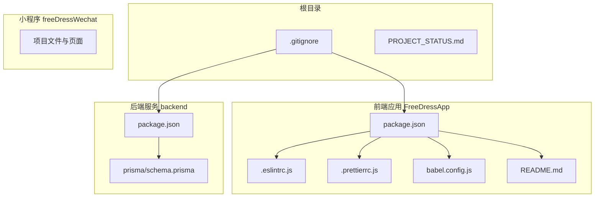
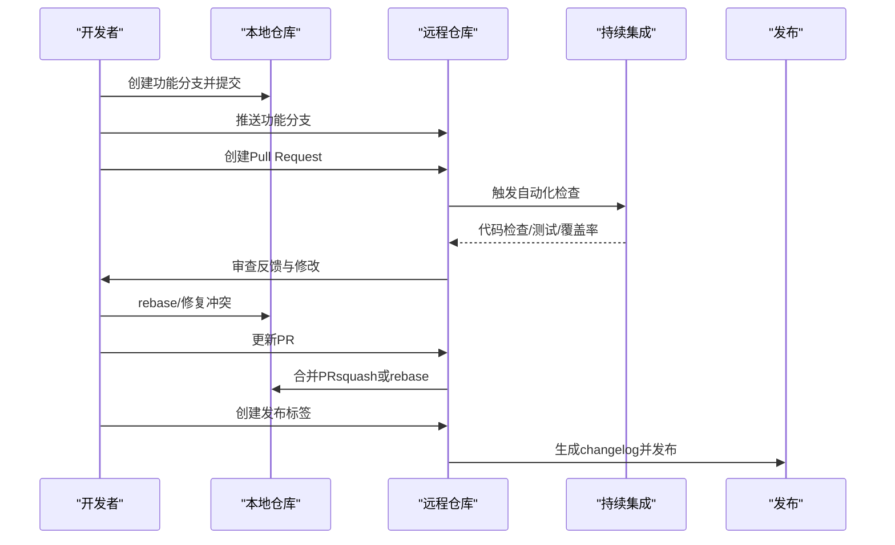
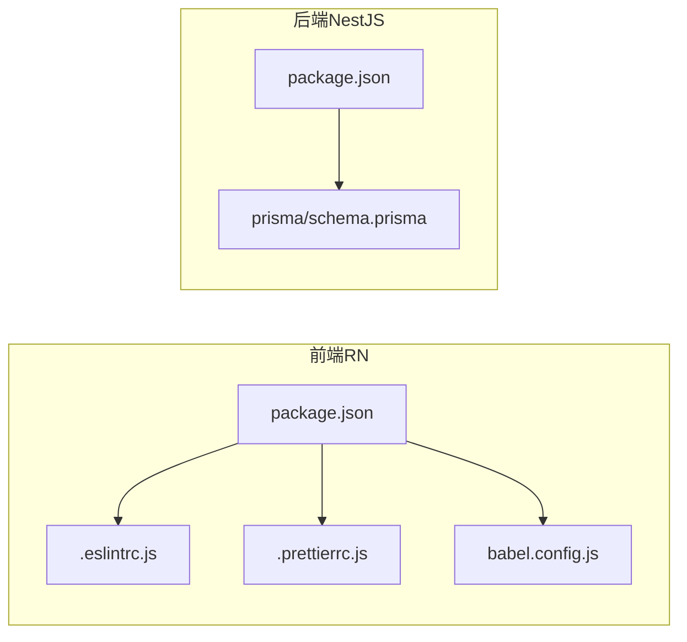

# Git工作流程

<cite>
**本文引用的文件**
- [.gitignore](file://.gitignore)
- [FreeDressApp/README.md](file://FreeDressApp/README.md)
- [FreeDressApp/package.json](file://FreeDressApp/package.json)
- [FreeDressApp/.eslintrc.js](file://FreeDressApp/.eslintrc.js)
- [FreeDressApp/.prettierrc.js](file://FreeDressApp/.prettierrc.js)
- [FreeDressApp/babel.config.js](file://FreeDressApp/babel.config.js)
- [backend/package.json](file://backend/package.json)
- [backend/prisma/schema.prisma](file://backend/prisma/schema.prisma)
- [PROJECT_STATUS.md](file://PROJECT_STATUS.md)
</cite>

## 目录
1. [简介](#简介)
2. [项目结构](#项目结构)
3. [核心组件](#核心组件)
4. [架构总览](#架构总览)
5. [详细组件分析](#详细组件分析)
6. [依赖分析](#依赖分析)
7. [性能考虑](#性能考虑)
8. [故障排除指南](#故障排除指南)
9. [结论](#结论)
10. [附录](#附录)

## 简介
本文件为畅搭（FreeDress）项目制定系统的Git工作流程规范，涵盖分支管理策略、语义化版本控制与提交信息规范、代码审查与合并策略、冲突解决与分支同步最佳实践，以及Git hooks与CI集成建议。该规范适用于前端React Native应用、后端NestJS服务及微信小程序等多仓库协同开发。

## 项目结构
畅搭项目采用多仓库结构，包含移动端应用、后端服务与小程序三个主要子项目，配合统一的根目录忽略规则与开发脚本，确保跨平台一致性与可维护性。

图表来源
- [.gitignore:1-82](file://.gitignore#L1-L82)
- [FreeDressApp/package.json:1-57](file://FreeDressApp/package.json#L1-L57)
- [FreeDressApp/.eslintrc.js:1-5](file://FreeDressApp/.eslintrc.js#L1-L5)
- [FreeDressApp/.prettierrc.js:1-6](file://FreeDressApp/.prettierrc.js#L1-L6)
- [FreeDressApp/babel.config.js:1-4](file://FreeDressApp/babel.config.js#L1-L4)
- [FreeDressApp/README.md:1-195](file://FreeDressApp/README.md#L1-L195)
- [backend/package.json:1-91](file://backend/package.json#L1-L91)
- [backend/prisma/schema.prisma:1-132](file://backend/prisma/schema.prisma#L1-L132)

章节来源
- [.gitignore:1-82](file://.gitignore#L1-L82)
- [FreeDressApp/README.md:1-195](file://FreeDressApp/README.md#L1-L195)
- [FreeDressApp/package.json:1-57](file://FreeDressApp/package.json#L1-L57)
- [backend/package.json:1-91](file://backend/package.json#L1-L91)
- [backend/prisma/schema.prisma:1-132](file://backend/prisma/schema.prisma#L1-L132)

## 核心组件
- 分支策略：采用Git Flow变体，结合功能分支与发布分支，确保主分支稳定与快速迭代。
- 提交规范：遵循约定式提交，明确type、scope与subject，Breaking Change显式标注。
- 版本管理：以语义化版本（SemVer）为主，结合changelog自动生成与发布标签。
- 代码审查：PR模板+审查清单+自动化检查（ESLint、Prettier、测试覆盖率）。
- 冲突解决：优先rebase保持线性历史；merge冲突按模块边界与职责划分处理。
- Hooks与CI：pre-commit钩子执行静态检查与格式化；CI流水线覆盖构建、测试与部署。

章节来源
- [FreeDressApp/.eslintrc.js:1-5](file://FreeDressApp/.eslintrc.js#L1-L5)
- [FreeDressApp/.prettierrc.js:1-6](file://FreeDressApp/.prettierrc.js#L1-L6)
- [FreeDressApp/package.json:5-11](file://FreeDressApp/package.json#L5-L11)
- [backend/package.json:8-24](file://backend/package.json#L8-L24)

## 架构总览
以下序列图展示从功能开发到发布的典型流程，包括分支创建、PR审查、自动化检查与发布标签。

图表来源
- [FreeDressApp/package.json:5-11](file://FreeDressApp/package.json#L5-L11)
- [backend/package.json:8-24](file://backend/package.json#L8-L24)

## 详细组件分析

### 分支管理策略
- 主分支保护
  - main/master仅允许通过受控方式合并（PR+审查+CI通过）。
  - 禁止直接推送，强制使用Pull Request。
  - 保护分支规则建议启用：必需CI检查通过、至少一名审查者批准。
- 功能分支
  - 命名规范：feature/模块名/简述 或 feat/模块名/简述。
  - 从main切出，完成后回并至main并删除。
  - 小步提交，避免跨模块耦合。
- 发布分支
  - 当准备发布时从main创建release/x.y.z分支，进行最后测试与版本号修正。
  - 发布后合并回main并打标签，再合并回develop（如使用develop）。
- 热修复分支
  - hotfix/问题简述，从main切出，修复后同时合并回main与release分支。

章节来源
- [FreeDressApp/README.md:1-195](file://FreeDressApp/README.md#L1-L195)

### 语义化版本控制与提交信息规范
- 版本号规则
  - 主版本号：破坏性变更
  - 次版本号：向下兼容的功能新增
  - 修订号：向下兼容的问题修复
- 提交信息规范（约定式提交）
  - 格式：type(scope): subject
  - 可选：!（Breaking Change）、范围（scope）、正文（body）、脚注（footer）
  - 示例：feat(auth): 添加JWT刷新流程；fix(api): 修复空值导致的崩溃
- Breaking Change标注
  - 在type后添加!，并在正文或脚注中说明影响与迁移指引。
- changelog生成
  - 建议使用工具自动生成，按类型聚合（Breaking Changes、Features、Bug Fixes）。
  - 发布前核对变更摘要，确保与实际改动一致。

章节来源
- [FreeDressApp/README.md:1-195](file://FreeDressApp/README.md#L1-L195)

### 代码审查流程与合并策略
- Pull Request模板
  - 标题：遵循约定式提交格式
  - 摘要：变更动机、范围与影响
  - 测试：覆盖范围与测试结果
  - 依赖：涉及的后端接口或第三方库
  - 风险：潜在回归点与降级方案
- 审查清单
  - 代码风格与可读性（ESLint、Prettier）
  - 功能正确性与边界条件
  - 性能与内存泄漏风险
  - 安全与权限控制
  - 文档与注释更新
- 合并策略
  - squash合并：保持主分支线性清晰
  - rebase合并：保留完整提交历史，便于追溯
  - 避免fast-forward，确保每次合并都有PR记录

章节来源
- [FreeDressApp/.eslintrc.js:1-5](file://FreeDressApp/.eslintrc.js#L1-L5)
- [FreeDressApp/.prettierrc.js:1-6](file://FreeDressApp/.prettierrc.js#L1-L6)
- [FreeDressApp/package.json:5-11](file://FreeDressApp/package.json#L5-L11)
- [backend/package.json:8-24](file://backend/package.json#L8-L24)

### 冲突解决与分支同步最佳实践
- 同步策略
  - 优先rebase：保持线性历史，便于审计与回滚
  - 频繁与上游同步：定期rebase或merge上游变更
- 冲突处理
  - 按模块/文件边界拆分冲突，逐个击破
  - 明确职责：避免跨模块耦合导致复杂冲突
  - 无法解决时及时沟通，必要时回退到merge策略
- 历史清理
  - 合并后及时删除已合并的分支，保持仓库整洁

章节来源
- [FreeDressApp/README.md:1-195](file://FreeDressApp/README.md#L1-L195)

### Git hooks配置与自动化工作流
- pre-commit钩子
  - 格式化：Prettier统一代码风格
  - 静态检查：ESLint发现潜在问题
  - 最小化测试：关键文件的快速测试
- CI集成
  - 构建：前端RN打包、后端编译
  - 测试：单元测试、覆盖率检查、E2E测试
  - 质量门禁：ESLint、Prettier、覆盖率阈值
  - 发布：通过标签触发changelog生成与制品发布

章节来源
- [FreeDressApp/.prettierrc.js:1-6](file://FreeDressApp/.prettierrc.js#L1-L6)
- [FreeDressApp/.eslintrc.js:1-5](file://FreeDressApp/.eslintrc.js#L1-L5)
- [FreeDressApp/package.json:5-11](file://FreeDressApp/package.json#L5-L11)
- [backend/package.json:8-24](file://backend/package.json#L8-L24)

## 依赖分析
- 前端RN应用
  - 依赖管理：npm scripts提供启动、测试、lint、运行命令
  - 质量工具：ESLint、Prettier、Jest
  - 构建工具：Babel、Metro
- 后端NestJS服务
  - 依赖管理：npm scripts提供构建、开发、测试、Prisma命令
  - 质量工具：ESLint、Jest、Prisma
  - 数据层：Prisma Schema定义数据模型与索引

图表来源
- [FreeDressApp/package.json:1-57](file://FreeDressApp/package.json#L1-L57)
- [FreeDressApp/.eslintrc.js:1-5](file://FreeDressApp/.eslintrc.js#L1-L5)
- [FreeDressApp/.prettierrc.js:1-6](file://FreeDressApp/.prettierrc.js#L1-L6)
- [FreeDressApp/babel.config.js:1-4](file://FreeDressApp/babel.config.js#L1-L4)
- [backend/package.json:1-91](file://backend/package.json#L1-L91)
- [backend/prisma/schema.prisma:1-132](file://backend/prisma/schema.prisma#L1-L132)

章节来源
- [FreeDressApp/package.json:1-57](file://FreeDressApp/package.json#L1-L57)
- [backend/package.json:1-91](file://backend/package.json#L1-L91)
- [backend/prisma/schema.prisma:1-132](file://backend/prisma/schema.prisma#L1-L132)

## 性能考虑
- 提交粒度：小步提交，避免大范围变更引发长时冲突与CI失败
- 代码检查：在本地先行执行ESLint与Prettier，降低CI失败率
- 测试策略：优先单元测试，逐步引入E2E与集成测试，平衡速度与覆盖率
- 依赖更新：定期更新依赖并进行回归测试，避免版本漂移导致的性能退化

## 故障排除指南
- CI失败
  - 检查ESLint与Prettier输出，修复风格与语法问题
  - 查看测试覆盖率与失败用例，补充或修正测试
- 合并冲突
  - 使用rebase优先策略，逐个文件解决冲突
  - 若涉及跨模块变更，先与负责人沟通达成一致
- 版本发布
  - 确认SemVer规则与changelog完整性
  - 标签命名与版本号一致，避免发布不一致

## 结论
通过规范化的分支管理、约定式提交与语义化版本控制，结合严格的代码审查与自动化检查，畅搭项目可在保证质量的同时提升交付效率。建议团队严格执行本工作流程，并根据项目演进持续优化。

## 附录
- 术语
  - PR：Pull Request
  - CI：持续集成
  - SemVer：语义化版本
  - E2E：端到端测试
- 参考文档
  - 项目状态报告：用于理解当前开发阶段与后续计划，辅助版本规划与发布节奏制定

章节来源
- [PROJECT_STATUS.md:1-309](file://PROJECT_STATUS.md#L1-L309)