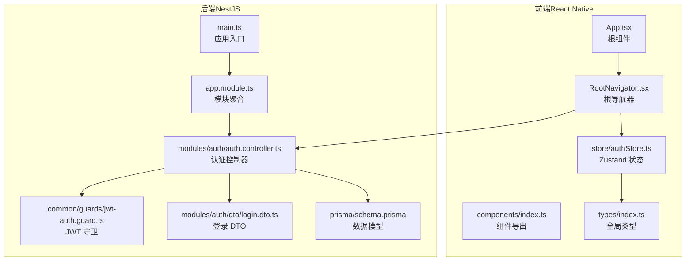
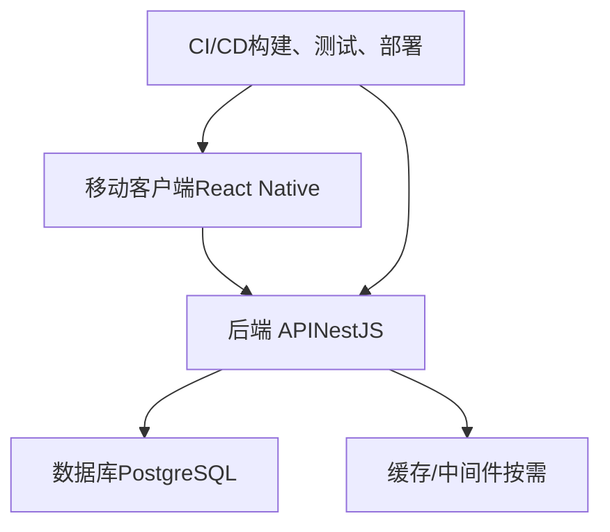
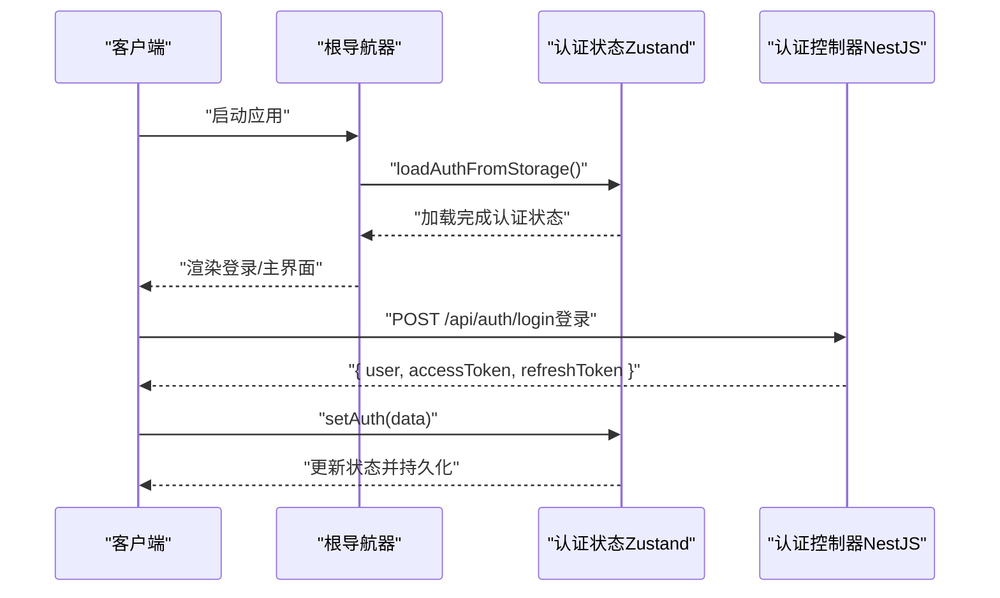
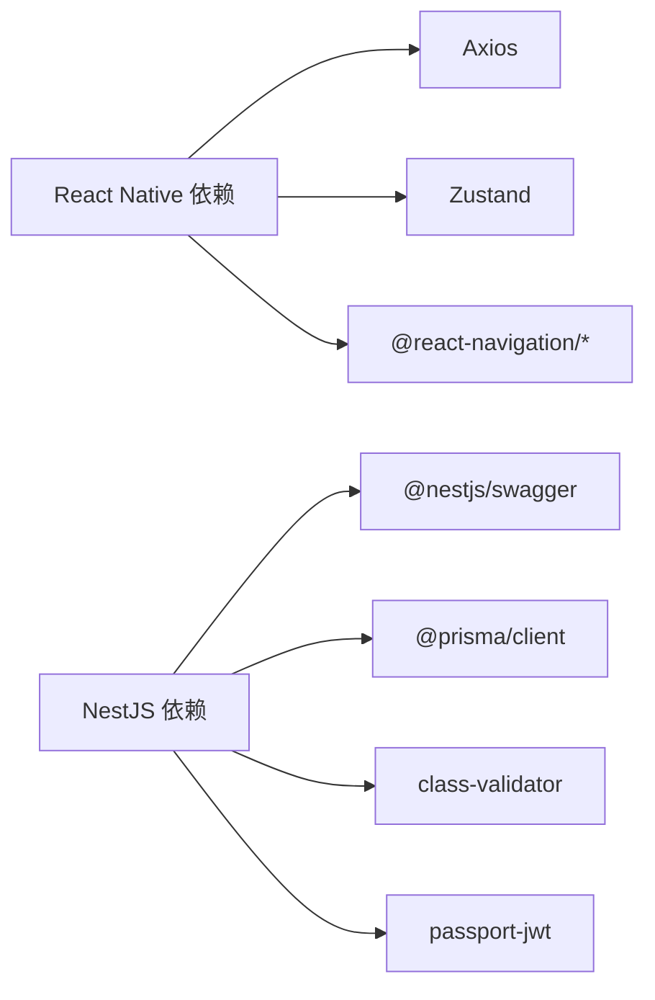

# 代码规范

<cite>
**本文引用的文件**
- [FreeDressApp/.eslintrc.js](file://FreeDressApp/.eslintrc.js)
- [FreeDressApp/.prettierrc.js](file://FreeDressApp/.prettierrc.js)
- [FreeDressApp/package.json](file://FreeDressApp/package.json)
- [FreeDressApp/tsconfig.json](file://FreeDressApp/tsconfig.json)
- [FreeDressApp/jest.config.js](file://FreeDressApp/jest.config.js)
- [FreeDressApp/src/App.tsx](file://FreeDressApp/src/App.tsx)
- [FreeDressApp/src/components/index.ts](file://FreeDressApp/src/components/index.ts)
- [FreeDressApp/src/navigation/RootNavigator.tsx](file://FreeDressApp/src/navigation/RootNavigator.tsx)
- [FreeDressApp/src/store/authStore.ts](file://FreeDressApp/src/store/authStore.ts)
- [FreeDressApp/src/types/index.ts](file://FreeDressApp/src/types/index.ts)
- [backend/package.json](file://backend/package.json)
- [backend/tsconfig.json](file://backend/tsconfig.json)
- [backend/src/main.ts](file://backend/src/main.ts)
- [backend/src/app.module.ts](file://backend/src/app.module.ts)
- [backend/src/modules/auth/auth.controller.ts](file://backend/src/modules/auth/auth.controller.ts)
- [backend/src/modules/auth/dto/login.dto.ts](file://backend/src/modules/auth/dto/login.dto.ts)
- [backend/src/common/guards/jwt-auth.guard.ts](file://backend/src/common/guards/jwt-auth.guard.ts)
- [backend/prisma/schema.prisma](file://backend/prisma/schema.prisma)
</cite>

## 目录
1. [引言](#引言)
2. [项目结构](#项目结构)
3. [核心组件](#核心组件)
4. [架构总览](#架构总览)
5. [详细组件分析](#详细组件分析)
6. [依赖分析](#依赖分析)
7. [性能考虑](#性能考虑)
8. [故障排查指南](#故障排查指南)
9. [结论](#结论)
10. [附录](#附录)

## 引言
本文件为畅搭（FreeDress）项目的代码规范文档，覆盖 TypeScript 编码标准、ESLint 与 Prettier 配置、React Native 与 NestJS 的特定规范、注释与文档标准、以及代码审查与质量检查流程。目标是统一团队开发风格、提升可维护性与协作效率，并确保前后端一致的工程实践。

## 项目结构
畅搭项目采用“前后端分离 + 小程序”多端架构：
- 前端（React Native）：位于 FreeDressApp，包含导航、组件、屏幕、状态管理、类型定义与 API 客户端。
- 后端（NestJS）：位于 backend，采用模块化分层（modules、common、prisma），提供 REST API 与 Swagger 文档。
- 数据库：Prisma 管理 schema 与迁移，PostgreSQL 作为数据源。
- 小程序：位于 freeDressWechat，用于微信生态的轻量实现（不在本文详述）。

图表来源
- [FreeDressApp/src/App.tsx:1-28](file://FreeDressApp/src/App.tsx#L1-L28)
- [FreeDressApp/src/navigation/RootNavigator.tsx:1-95](file://FreeDressApp/src/navigation/RootNavigator.tsx#L1-L95)
- [FreeDressApp/src/store/authStore.ts:1-123](file://FreeDressApp/src/store/authStore.ts#L1-L123)
- [FreeDressApp/src/types/index.ts:1-98](file://FreeDressApp/src/types/index.ts#L1-L98)
- [backend/src/main.ts:1-62](file://backend/src/main.ts#L1-L62)
- [backend/src/app.module.ts:1-33](file://backend/src/app.module.ts#L1-L33)
- [backend/src/modules/auth/auth.controller.ts:1-92](file://backend/src/modules/auth/auth.controller.ts#L1-L92)
- [backend/src/common/guards/jwt-auth.guard.ts:1-22](file://backend/src/common/guards/jwt-auth.guard.ts#L1-L22)
- [backend/src/modules/auth/dto/login.dto.ts:1-20](file://backend/src/modules/auth/dto/login.dto.ts#L1-L20)
- [backend/prisma/schema.prisma:1-132](file://backend/prisma/schema.prisma#L1-L132)

章节来源
- [FreeDressApp/src/App.tsx:1-28](file://FreeDressApp/src/App.tsx#L1-L28)
- [backend/src/main.ts:1-62](file://backend/src/main.ts#L1-L62)

## 核心组件
- 类型系统与接口设计
  - 使用 TypeScript 明确的数据契约，如用户、衣物、搭配、试穿结果等接口，以及通用响应体与导航参数类型。
  - 枚举类型（如用户角色、衣物分类）统一在类型文件中集中声明，便于复用与约束。
- 状态管理
  - 使用 Zustand 管理认证状态，支持持久化与异步更新，提供 setAuth、clearAuth、updateUser、loadAuthFromStorage 等方法。
- 导航与主题
  - 根导航器根据认证状态动态切换主界面与登录注册流程；自定义主题颜色体系，保证视觉一致性。
- 后端模块与安全
  - 模块化组织认证、用户、衣物、搭配、上传、试穿等功能；JWT 守卫统一鉴权；Swagger 自动生成 API 文档。

章节来源
- [FreeDressApp/src/types/index.ts:1-98](file://FreeDressApp/src/types/index.ts#L1-L98)
- [FreeDressApp/src/store/authStore.ts:1-123](file://FreeDressApp/src/store/authStore.ts#L1-L123)
- [FreeDressApp/src/navigation/RootNavigator.tsx:1-95](file://FreeDressApp/src/navigation/RootNavigator.tsx#L1-L95)
- [backend/src/app.module.ts:1-33](file://backend/src/app.module.ts#L1-L33)
- [backend/src/common/guards/jwt-auth.guard.ts:1-22](file://backend/src/common/guards/jwt-auth.guard.ts#L1-L22)

## 架构总览
畅搭采用“移动端 + 后端 API + 数据库”的三层架构。前端通过 Axios 调用后端接口，后端使用 NestJS 提供 REST API 并集成 Swagger 文档；数据库由 Prisma 管理，支持迁移与种子数据。

图表来源
- [backend/src/main.ts:1-62](file://backend/src/main.ts#L1-L62)
- [backend/prisma/schema.prisma:1-132](file://backend/prisma/schema.prisma#L1-L132)

## 详细组件分析

### 命名约定与类型定义规范
- 文件与目录
  - React Native：组件以 PascalCase 命名（如 Button.tsx），容器与页面以 Screen 结尾（如 LoginScreen.tsx）。
  - NestJS：控制器、服务、模块、DTO、拦截器、守卫等按职责命名，遵循小写加模块前缀的组织方式。
- 类型与接口
  - 使用明确的接口与联合类型表达业务实体；可选字段使用 ? 标注；数组字段使用 string[] 等具体类型。
  - 枚举值统一大写，避免魔法字符串。
- 常量与键名
  - 使用全大写的常量键（如 STORAGE_KEYS）表示本地存储键名，集中于 constants 目录或类型文件附近。

章节来源
- [FreeDressApp/src/components/index.ts:1-32](file://FreeDressApp/src/components/index.ts#L1-L32)
- [FreeDressApp/src/types/index.ts:1-98](file://FreeDressApp/src/types/index.ts#L1-L98)
- [backend/src/modules/auth/dto/login.dto.ts:1-20](file://backend/src/modules/auth/dto/login.dto.ts#L1-L20)

### ESLint 与 Prettier 配置
- ESLint
  - React Native：继承 @react-native/eslint-config，根目录配置启用 extends: '@react-native'。
  - NestJS：使用 @typescript-eslint/eslint-plugin 与 @typescript-eslint/parser，结合 eslint-config-prettier 与 eslint-plugin-prettier 实现风格与格式统一。
- Prettier
  - React Native：单引号、尾逗号、箭头函数括号策略等配置在 .prettierrc.js 中集中管理。
  - NestJS：版本较新，同样通过 prettier 进行统一格式化。
- 脚本与集成
  - React Native：脚本包含 lint、test、start、android、ios。
  - NestJS：脚本包含 build、start、start:dev、lint、test、test:cov、prisma:* 等，支持覆盖率统计与 Prisma 工具链。

章节来源
- [FreeDressApp/.eslintrc.js:1-5](file://FreeDressApp/.eslintrc.js#L1-L5)
- [FreeDressApp/.prettierrc.js:1-6](file://FreeDressApp/.prettierrc.js#L1-L6)
- [FreeDressApp/package.json:1-57](file://FreeDressApp/package.json#L1-L57)
- [backend/package.json:1-91](file://backend/package.json#L1-L91)

### TypeScript 编译与路径映射
- React Native：继承 @react-native/typescript-config，include 排除 node_modules 与 Pods，支持 Jest 类型。
- NestJS：启用装饰器与元数据反射，配置 paths 映射 @/*、@config/*、@modules/*、@common/*、@prisma/*，便于模块间导入。

章节来源
- [FreeDressApp/tsconfig.json:1-9](file://FreeDressApp/tsconfig.json#L1-L9)
- [backend/tsconfig.json:1-32](file://backend/tsconfig.json#L1-L32)

### 测试配置与覆盖率
- React Native：Jest 预设 @react-native/jest-preset，测试文件位于 __tests__/App.test.tsx。
- NestJS：Jest 配置包含模块扩展、rootDir、测试正则、ts-jest 转换、覆盖率收集与输出目录、测试环境等，支持单元测试与覆盖率统计。

章节来源
- [FreeDressApp/jest.config.js:1-4](file://FreeDressApp/jest.config.js#L1-L4)
- [backend/package.json:73-89](file://backend/package.json#L73-L89)

### 注释规范与文档标准
- JSDoc 注释
  - 控制器与方法建议添加 @ApiTags、@ApiOperation、@ApiBearerAuth 等 Swagger 注解，清晰描述接口用途、参数与权限。
  - 函数与类建议添加简要说明、参数说明与返回值说明，保持一致性。
- API 文档
  - NestJS 在 main.ts 中通过 SwaggerModule 创建文档并挂载到 /api/docs，建议为每个模块添加 @ApiTags 并完善 @ApiOperation 描述。

章节来源
- [backend/src/modules/auth/auth.controller.ts:1-92](file://backend/src/modules/auth/auth.controller.ts#L1-L92)
- [backend/src/main.ts:40-48](file://backend/src/main.ts#L40-L48)

### React Native 特定规范
- 组件命名与导出
  - 组件文件使用 PascalCase，统一在 components/index.ts 中集中导出，便于按需引入与 IDE 自动补全。
- 文件组织与导入
  - 屏幕、导航、主题、常量、类型等按功能域分层，避免循环依赖。
- 状态管理
  - 使用 Zustand 管理认证状态，提供 setAuth/clearAuth/updateUser/loadAuthFromStorage，支持本地持久化与异步操作。
- 导航与主题
  - 根导航器根据认证状态切换界面，自定义主题颜色，保证视觉一致性与可读性。

章节来源
- [FreeDressApp/src/components/index.ts:1-32](file://FreeDressApp/src/components/index.ts#L1-L32)
- [FreeDressApp/src/store/authStore.ts:1-123](file://FreeDressApp/src/store/authStore.ts#L1-L123)
- [FreeDressApp/src/navigation/RootNavigator.tsx:1-95](file://FreeDressApp/src/navigation/RootNavigator.tsx#L1-L95)
- [FreeDressApp/src/App.tsx:1-28](file://FreeDressApp/src/App.tsx#L1-L28)

### NestJS 特定规范
- 模块与依赖注入
  - 使用 @Module 聚合子模块，ConfigModule 全局配置，ServeStaticModule 提供静态资源服务，PrismaModule 连接数据库。
- 控制器与 DTO
  - 控制器使用 @ApiTags、@ApiOperation 等注解；DTO 使用 class-validator 进行输入校验与 Swagger 字段描述。
- 安全与中间件
  - 全局管道 ValidationPipe 开启白名单与类型转换；全局拦截器 TransformInterceptor 统一响应格式；全局过滤器处理异常。
- Swagger 文档
  - 在 main.ts 中配置标题、描述、版本与 Bearer 认证，生成在线文档并挂载到 /api/docs。

章节来源
- [backend/src/app.module.ts:1-33](file://backend/src/app.module.ts#L1-L33)
- [backend/src/modules/auth/auth.controller.ts:1-92](file://backend/src/modules/auth/auth.controller.ts#L1-L92)
- [backend/src/modules/auth/dto/login.dto.ts:1-20](file://backend/src/modules/auth/dto/login.dto.ts#L1-L20)
- [backend/src/common/guards/jwt-auth.guard.ts:1-22](file://backend/src/common/guards/jwt-auth.guard.ts#L1-L22)
- [backend/src/main.ts:1-62](file://backend/src/main.ts#L1-L62)

### 数据模型与 Prisma 规范
- 模型设计
  - 用户、衣物、搭配、收藏、试穿结果等模型定义清晰，使用 UUID 作为主键，合理使用 @relation、@@index、@@map 等 Prisma 指令。
- 枚举与数组
  - 使用 enum 表达离散取值（如 UserRole、ClothCategory），数组字段表达多值（如 season、tags）。
- 索引与约束
  - 对常用查询字段建立索引，保证查询性能；外键删除策略使用 Cascade，保持数据一致性。

章节来源
- [backend/prisma/schema.prisma:1-132](file://backend/prisma/schema.prisma#L1-L132)

### API 调用流程（序列图）

图表来源
- [FreeDressApp/src/navigation/RootNavigator.tsx:41-84](file://FreeDressApp/src/navigation/RootNavigator.tsx#L41-L84)
- [FreeDressApp/src/store/authStore.ts:39-57](file://FreeDressApp/src/store/authStore.ts#L39-L57)
- [backend/src/modules/auth/auth.controller.ts:46-50](file://backend/src/modules/auth/auth.controller.ts#L46-L50)

## 依赖分析
- 前端依赖
  - React Native、导航库、状态管理（Zustand）、图像选择、Reanimated、SVG、向量图标、Axios、AsyncStorage 等。
- 后端依赖
  - NestJS 核心、Swagger、Prisma、class-validator、class-transformer、bcryptjs、passport-jwt、UUID 等。
- 开发工具
  - ESLint、Prettier、Jest、ts-jest、Prisma CLI、TypeScript 等。

图表来源
- [FreeDressApp/package.json:12-31](file://FreeDressApp/package.json#L12-L31)
- [backend/package.json:26-44](file://backend/package.json#L26-L44)

章节来源
- [FreeDressApp/package.json:1-57](file://FreeDressApp/package.json#L1-L57)
- [backend/package.json:1-91](file://backend/package.json#L1-L91)

## 性能考虑
- 前端
  - 使用 Flash List 优化长列表渲染；合理拆分组件与懒加载；避免不必要的重渲染；状态持久化减少重复请求。
- 后端
  - DTO 校验前置，减少无效请求进入业务逻辑；Prisma 查询使用索引字段；统一响应格式减少序列化开销；开启生产模式与日志分级。
- 数据库
  - 为高频查询字段建立索引；合理使用枚举与数组字段；外键级联策略与软删除策略统一规划。

## 故障排查指南
- ESLint 报错
  - 检查是否继承 @react-native 或 NestJS 的 ESLint 配置；确认 TypeScript 与解析器版本兼容；在 IDE 中启用 ESLint 自动修复。
- Prettier 格式化冲突
  - 确保 .prettierrc.js 与编辑器 Prettier 插件一致；在保存时触发格式化；避免手动修改格式化规则。
- 测试失败
  - 检查 Jest 配置与 ts-jest 转换；确认测试文件命名与路径；查看覆盖率报告定位问题模块。
- Swagger 文档异常
  - 确认 @ApiTags、@ApiOperation、@ApiBearerAuth 等注解完整；检查全局前缀与文档挂载路径。
- 认证与鉴权
  - 检查 JWT 守卫是否生效；确认请求头携带 Bearer Token；核对刷新令牌流程与用户上下文注入。

章节来源
- [FreeDressApp/.eslintrc.js:1-5](file://FreeDressApp/.eslintrc.js#L1-L5)
- [FreeDressApp/.prettierrc.js:1-6](file://FreeDressApp/.prettierrc.js#L1-L6)
- [backend/package.json:73-89](file://backend/package.json#L73-L89)
- [backend/src/main.ts:40-48](file://backend/src/main.ts#L40-L48)
- [backend/src/common/guards/jwt-auth.guard.ts:1-22](file://backend/src/common/guards/jwt-auth.guard.ts#L1-L22)

## 结论
本规范文档基于畅搭项目的实际代码与配置，明确了 TypeScript 编码标准、ESLint/Prettier 配置、React Native 与 NestJS 的特定实践、注释与文档标准，以及代码审查与质量检查流程。建议团队在日常开发中严格遵循，持续改进，确保代码质量与团队协作效率。

## 附录
- 命名约定速查
  - 组件：PascalCase（如 Button.tsx）
  - 页面：PascalCase + Screen（如 LoginScreen.tsx）
  - 类型：PascalCase 接口与类型别名（如 User、ApiResponse）
  - 常量：SCREAMING_SNAKE_CASE（如 STORAGE_KEYS）
- 路径映射速查
  - React Native：继承 @react-native/typescript-config
  - NestJS：@/* → src/*，@modules/* → src/modules/*
- 测试与覆盖率
  - React Native：Jest 预设，测试文件位于 __tests__/
  - NestJS：jest.config.js 配置，覆盖率输出至 coverage/