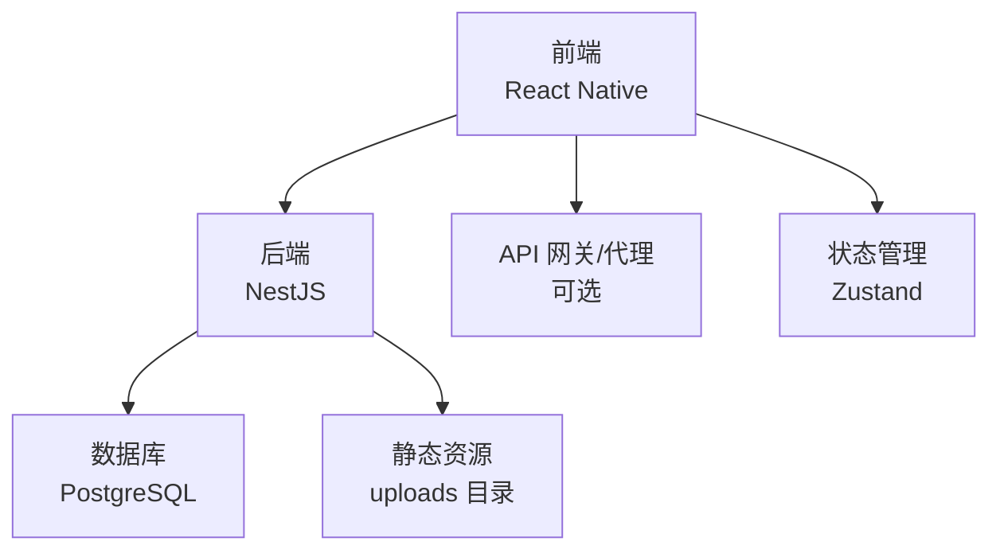
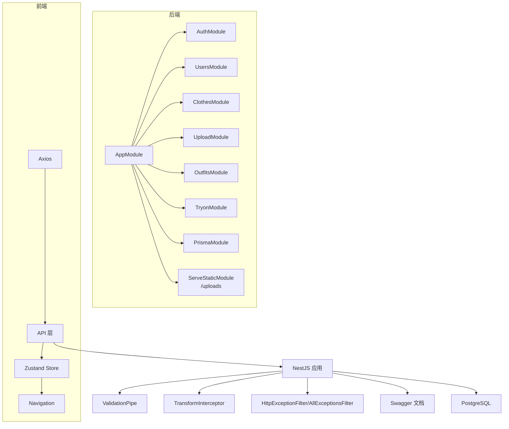
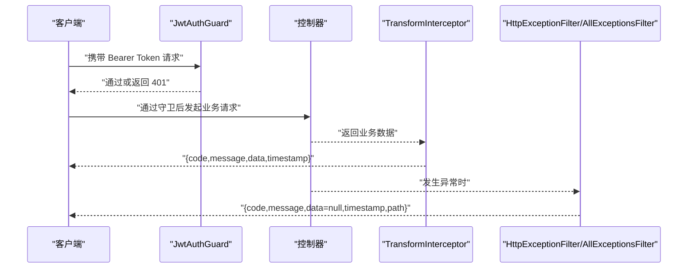
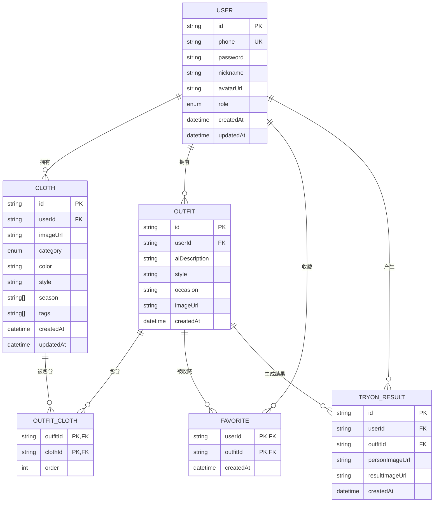
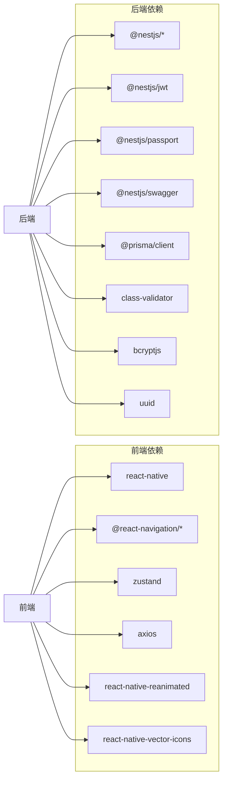

# 开发规范

<cite>
**本文引用的文件**
- [FreeDressApp/package.json](file://FreeDressApp/package.json)
- [FreeDressApp/.eslintrc.js](file://FreeDressApp/.eslintrc.js)
- [FreeDressApp/.prettierrc.js](file://FreeDressApp/.prettierrc.js)
- [FreeDressApp/tsconfig.json](file://FreeDressApp/tsconfig.json)
- [FreeDressApp/jest.config.js](file://FreeDressApp/jest.config.js)
- [FreeDressApp/babel.config.js](file://FreeDressApp/babel.config.js)
- [backend/package.json](file://backend/package.json)
- [backend/tsconfig.json](file://backend/tsconfig.json)
- [backend/src/main.ts](file://backend/src/main.ts)
- [backend/src/app.module.ts](file://backend/src/app.module.ts)
- [backend/src/common/interceptors/transform.interceptor.ts](file://backend/src/common/interceptors/transform.interceptor.ts)
- [backend/src/common/filters/http-exception.filter.ts](file://backend/src/common/filters/http-exception.filter.ts)
- [backend/src/common/guards/jwt-auth.guard.ts](file://backend/src/common/guards/jwt-auth.guard.ts)
- [backend/prisma/schema.prisma](file://backend/prisma/schema.prisma)
- [FreeDressApp/DESIGN.md](file://FreeDressApp/DESIGN.md)
- [PROJECT_STATUS.md](file://PROJECT_STATUS.md)
</cite>

## 目录
1. [简介](#简介)
2. [项目结构](#项目结构)
3. [核心组件](#核心组件)
4. [架构总览](#架构总览)
5. [详细组件分析](#详细组件分析)
6. [依赖分析](#依赖分析)
7. [性能考虑](#性能考虑)
8. [故障排查指南](#故障排查指南)
9. [结论](#结论)
10. [附录](#附录)

## 简介
本开发规范面向畅搭（FreeDress）全栈团队，旨在统一代码风格、规范开发流程、明确API设计与质量标准，并提供性能与安全最佳实践。规范涵盖以下方面：
- TypeScript 编码标准与 ESLint、Prettier 配置
- Git 工作流与分支管理策略
- API 设计规范（RESTful、统一响应与错误处理）
- 测试策略（单元、集成、端到端）
- 构建与部署流程（含 CI/CD 与自动化）
- 性能优化与安全最佳实践
- 团队协作与质量标准

## 项目结构
畅搭项目采用多模块组织方式：
- 前端（React Native）：位于 FreeDressApp，负责移动端 UI、导航、状态管理与 API 调用
- 后端（NestJS）：位于 backend，提供 RESTful API、认证鉴权、数据库交互与文件上传
- 微信小程序（freeDressWechat）：位于 freeDressWechat，作为多端之一
- 设计与状态文档：DESIGN.md 与 PROJECT_STATUS.md 提供设计语言与项目进展

**图表来源**
- [backend/src/app.module.ts:13-31](file://backend/src/app.module.ts#L13-L31)
- [backend/src/main.ts:31-38](file://backend/src/main.ts#L31-L38)

**章节来源**
- [FreeDressApp/DESIGN.md:1-408](file://FreeDressApp/DESIGN.md#L1-L408)
- [PROJECT_STATUS.md:1-309](file://PROJECT_STATUS.md#L1-L309)

## 核心组件
- 前端工程化
  - TypeScript 配置、ESLint 规则、Prettier 格式化、Jest 测试、Babel 转译
- 后端工程化
  - NestJS 全局管道/拦截器/过滤器、Swagger 文档、Prisma 数据模型
- API 设计
  - RESTful 接口、统一响应格式、错误处理、JWT 认证守卫
- 测试与质量
  - 单元测试、覆盖率、端到端测试脚本
- 构建与部署
  - 脚本命令、静态资源服务、跨域配置

**章节来源**
- [FreeDressApp/package.json:1-57](file://FreeDressApp/package.json#L1-L57)
- [FreeDressApp/.eslintrc.js:1-5](file://FreeDressApp/.eslintrc.js#L1-L5)
- [FreeDressApp/.prettierrc.js:1-6](file://FreeDressApp/.prettierrc.js#L1-L6)
- [FreeDressApp/tsconfig.json:1-9](file://FreeDressApp/tsconfig.json#L1-L9)
- [FreeDressApp/jest.config.js:1-4](file://FreeDressApp/jest.config.js#L1-L4)
- [FreeDressApp/babel.config.js:1-4](file://FreeDressApp/babel.config.js#L1-L4)
- [backend/package.json:8-25](file://backend/package.json#L8-L25)
- [backend/tsconfig.json:1-32](file://backend/tsconfig.json#L1-L32)
- [backend/src/main.ts:12-59](file://backend/src/main.ts#L12-L59)
- [backend/src/common/interceptors/transform.interceptor.ts:1-32](file://backend/src/common/interceptors/transform.interceptor.ts#L1-L32)
- [backend/src/common/filters/http-exception.filter.ts:1-81](file://backend/src/common/filters/http-exception.filter.ts#L1-L81)
- [backend/src/common/guards/jwt-auth.guard.ts:1-22](file://backend/src/common/guards/jwt-auth.guard.ts#L1-L22)
- [backend/prisma/schema.prisma:1-132](file://backend/prisma/schema.prisma#L1-L132)

## 架构总览
后端通过 NestJS 提供统一入口，启用全局验证管道、统一响应拦截器、异常过滤器与 Swagger 文档；前端通过 Axios 发起请求，配合 Zustand 管理状态，遵循统一的 API 命名与响应格式。

**图表来源**
- [backend/src/app.module.ts:13-31](file://backend/src/app.module.ts#L13-L31)
- [backend/src/main.ts:12-59](file://backend/src/main.ts#L12-L59)

## 详细组件分析

### TypeScript 编码标准与工具链
- 前端
  - 使用 @react-native/typescript-config，启用 Jest 类型支持
  - ESLint 继承 @react-native 配置，统一规则
  - Prettier 采用单引号、尾随逗号、省略箭头括号
  - Jest 预设为 @react-native/jest-preset
  - Babel 使用 @react-native/babel-preset，并启用 reanimated 插件
- 后端
  - TypeScript 编译目标 ES2021，启用装饰器与元数据反射
  - 路径别名 @/*、@config/*、@modules/*、@common/*、@prisma/*
  - ESLint + Prettier 插件，Jest 配置为 ts-jest，收集覆盖率

**章节来源**
- [FreeDressApp/tsconfig.json:1-9](file://FreeDressApp/tsconfig.json#L1-L9)
- [FreeDressApp/.eslintrc.js:1-5](file://FreeDressApp/.eslintrc.js#L1-L5)
- [FreeDressApp/.prettierrc.js:1-6](file://FreeDressApp/.prettierrc.js#L1-L6)
- [FreeDressApp/jest.config.js:1-4](file://FreeDressApp/jest.config.js#L1-L4)
- [FreeDressApp/babel.config.js:1-4](file://FreeDressApp/babel.config.js#L1-L4)
- [backend/package.json:8-25](file://backend/package.json#L8-L25)
- [backend/tsconfig.json:1-32](file://backend/tsconfig.json#L1-L32)

### Git 工作流与分支管理
- 分支策略
  - main/master：稳定发布分支
  - develop：开发集成分支
  - feature/<name>：功能开发分支
  - hotfix/<name>：紧急修复分支
  - release/<version>：预发布分支
- 提交信息规范
  - 类型：feat、fix、docs、style、refactor、test、chore、perf、ci、build
  - 格式：type(scope): subject
  - 示例：feat(auth): 添加 JWT 登录流程
- 代码审查
  - PR 必须通过 CI 校验与至少一名 reviewer 同意
  - 优先使用 squash merge 保持提交历史整洁

[本节为通用规范说明，不直接分析具体文件，故无“章节来源”]

### API 设计规范
- RESTful 接口
  - 资源命名使用复数形式，路径层级清晰
  - HTTP 方法语义明确：GET/POST/PUT/DELETE
  - 统一前缀：/api
- 统一响应格式
  - 结构：code、message、data、timestamp
  - 成功：code=200，message='success'
- 错误处理
  - HttpExceptionFilter：提取 NestJS 异常响应，统一输出
  - AllExceptionsFilter：兜底 500 错误，开发环境打印堆栈
- 认证与授权
  - JwtAuthGuard：拦截未认证请求，返回未授权提示
- 跨域与文档
  - CORS 允许凭据与任意来源
  - Swagger 文档：/api/docs

**图表来源**
- [backend/src/common/guards/jwt-auth.guard.ts:8-21](file://backend/src/common/guards/jwt-auth.guard.ts#L8-L21)
- [backend/src/common/interceptors/transform.interceptor.ts:19-31](file://backend/src/common/interceptors/transform.interceptor.ts#L19-L31)
- [backend/src/common/filters/http-exception.filter.ts:8-44](file://backend/src/common/filters/http-exception.filter.ts#L8-L44)
- [backend/src/common/filters/http-exception.filter.ts:50-80](file://backend/src/common/filters/http-exception.filter.ts#L50-L80)

**章节来源**
- [backend/src/main.ts:12-59](file://backend/src/main.ts#L12-L59)
- [backend/src/common/interceptors/transform.interceptor.ts:1-32](file://backend/src/common/interceptors/transform.interceptor.ts#L1-L32)
- [backend/src/common/filters/http-exception.filter.ts:1-81](file://backend/src/common/filters/http-exception.filter.ts#L1-L81)
- [backend/src/common/guards/jwt-auth.guard.ts:1-22](file://backend/src/common/guards/jwt-auth.guard.ts#L1-L22)

### 测试策略与质量保证
- 单元测试
  - 后端：Jest + ts-jest，覆盖率收集，支持 watch 与 debug
  - 前端：Jest 预设，建议按模块拆分测试文件
- 集成测试
  - 后端：提供 e2e 脚本，建议使用 supertest
- 端到端测试
  - 建议引入 Detox 或 Appium，覆盖关键用户旅程
- 质量门禁
  - ESLint + Prettier 校验必须通过
  - 单测覆盖率不低于阈值（建议 80%+）

**章节来源**
- [backend/package.json:15-24](file://backend/package.json#L15-L24)
- [FreeDressApp/package.json:8-10](file://FreeDressApp/package.json#L8-L10)
- [FreeDressApp/jest.config.js:1-4](file://FreeDressApp/jest.config.js#L1-L4)

### 构建与部署流程
- 前端
  - React Native CLI 脚本：start、android、ios、lint、test
  - Babel 预设与 Reanimated 插件
- 后端
  - NestJS 脚本：build、start、start:dev、start:debug、start:prod、lint、test、test:cov、test:e2e、prisma:* 系列
  - Prisma 生成与迁移
- 部署要点
  - 后端：设置 PORT、NODE_ENV、DATABASE_URL 等环境变量
  - 静态资源：ServeStaticModule 挂载 uploads 目录为 /uploads
  - CORS：允许来源与凭据
  - CI/CD：建议在流水线中执行 lint、test、build、push 镜像、部署

**章节来源**
- [FreeDressApp/package.json:5-11](file://FreeDressApp/package.json#L5-L11)
- [FreeDressApp/babel.config.js:1-4](file://FreeDressApp/babel.config.js#L1-L4)
- [backend/package.json:8-25](file://backend/package.json#L8-L25)
- [backend/src/app.module.ts:19-22](file://backend/src/app.module.ts#L19-L22)
- [backend/src/main.ts:31-38](file://backend/src/main.ts#L31-L38)

### 数据模型与数据库
- 用户、衣物、搭配、收藏、试穿结果等核心模型
- 外键与复合主键设计，索引优化
- Prisma 生成客户端，迁移与种子数据

**图表来源**
- [backend/prisma/schema.prisma:14-131](file://backend/prisma/schema.prisma#L14-L131)

**章节来源**
- [backend/prisma/schema.prisma:1-132](file://backend/prisma/schema.prisma#L1-L132)

### 设计语言与 UI 规范
- 设计理念：邮票质感、单色系、新极简主义、可接近的精致感
- 色彩、字体、间距、圆角、阴影与动效规范
- 组件库与页面线框图，主题层与动效曲线

**章节来源**
- [FreeDressApp/DESIGN.md:9-408](file://FreeDressApp/DESIGN.md#L9-L408)

## 依赖分析
- 前端
  - React Native、Navigation、Reanimated、Vector Icons、Zustand、Axios
  - 开发依赖：ESLint、Jest、Prettier、TypeScript
- 后端
  - NestJS 核心、JWT、Passport、Swagger、Prisma、class-validator、bcryptjs、uuid
  - 开发依赖：ESLint、Jest、Prettier、ts-node、supertest、prisma

**图表来源**
- [FreeDressApp/package.json:12-31](file://FreeDressApp/package.json#L12-L31)
- [backend/package.json:26-44](file://backend/package.json#L26-L44)

**章节来源**
- [FreeDressApp/package.json:12-51](file://FreeDressApp/package.json#L12-L51)
- [backend/package.json:26-72](file://backend/package.json#L26-L72)

## 性能考虑
- 前端
  - 使用 Flash List 渲染长列表，合理分页与懒加载
  - Skeleton 骨架屏与缓存策略降低首屏等待
  - Reanimated 替代 JS 动画，避免主线程阻塞
- 后端
  - Prisma 查询优化与索引设计，避免 N+1
  - ValidationPipe 白名单与类型转换减少无效数据
  - 分页参数与分页查询，控制单次返回数据量
- 网络
  - 请求超时与重试策略，弱网场景增强
  - 静态资源 CDN 与压缩

[本节为通用性能指导，不直接分析具体文件，故无“章节来源”]

## 故障排查指南
- 统一响应与错误定位
  - 检查 TransformInterceptor 是否生效
  - 查看 HttpExceptionFilter/AllExceptionsFilter 输出的 code/message/path/timestamp
- 认证问题
  - JwtAuthGuard 返回 401 时，检查 Token 是否过期或格式是否正确
- 数据库与 Prisma
  - 使用 prisma:migrate 与 prisma:generate 确保模型与客户端一致
- 日志与调试
  - 开发环境打印堆栈，生产环境避免泄露敏感信息
- 端到端验证
  - 使用 Swagger 文档与 e2e 脚本验证接口行为

**章节来源**
- [backend/src/common/interceptors/transform.interceptor.ts:19-31](file://backend/src/common/interceptors/transform.interceptor.ts#L19-L31)
- [backend/src/common/filters/http-exception.filter.ts:50-80](file://backend/src/common/filters/http-exception.filter.ts#L50-L80)
- [backend/src/common/guards/jwt-auth.guard.ts:8-21](file://backend/src/common/guards/jwt-auth.guard.ts#L8-L21)
- [backend/package.json:21-24](file://backend/package.json#L21-L24)

## 结论
本规范以实际代码为依据，明确了畅搭项目的工程化标准、API 设计与质量保障要求。建议团队在日常开发中严格遵循，持续改进测试覆盖率与性能指标，逐步补齐 AI 能力与云存储迁移等关键能力，确保产品高质量交付与可持续演进。

[本节为总结性内容，不直接分析具体文件，故无“章节来源”]

## 附录

### API 设计清单
- 资源命名与 HTTP 方法
- 统一响应格式字段
- 错误码与消息规范
- 认证流程与 Token 生命周期
- 跨域与静态资源服务

**章节来源**
- [backend/src/main.ts:37-48](file://backend/src/main.ts#L37-L48)
- [backend/src/common/interceptors/transform.interceptor.ts:8-13](file://backend/src/common/interceptors/transform.interceptor.ts#L8-L13)
- [backend/src/common/filters/http-exception.filter.ts:18-27](file://backend/src/common/filters/http-exception.filter.ts#L18-L27)

### 项目状态与后续计划
- 当前完成度与缺口
- AI 试穿与智能推荐接入计划
- 验证码、云存储、设置页面等后续功能

**章节来源**
- [PROJECT_STATUS.md:170-309](file://PROJECT_STATUS.md#L170-L309)