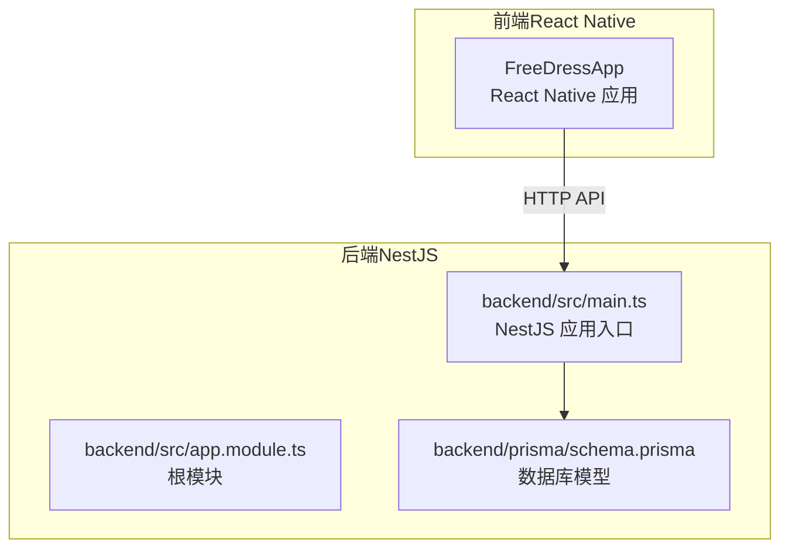
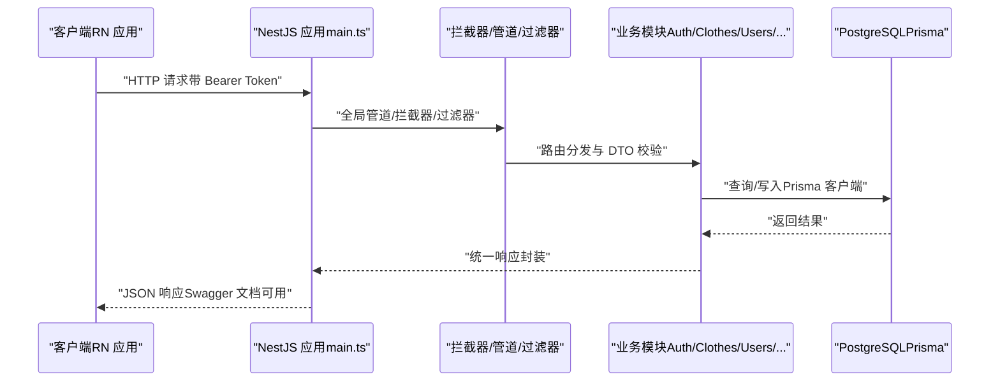
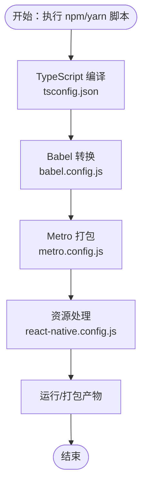
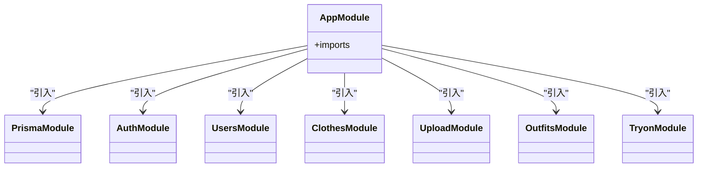
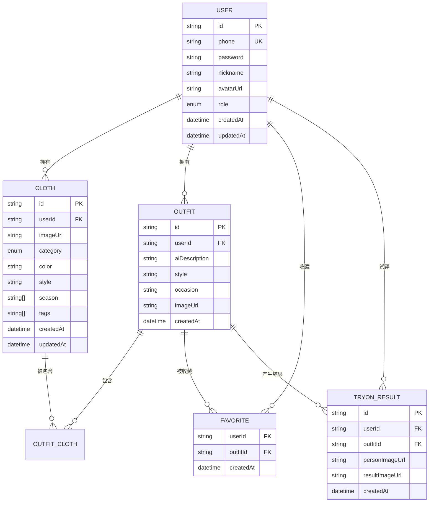

# 构建与部署

<cite>
**本文引用的文件**
- [FreeDressApp/package.json](file://FreeDressApp/package.json)
- [FreeDressApp/tsconfig.json](file://FreeDressApp/tsconfig.json)
- [FreeDressApp/metro.config.js](file://FreeDressApp/metro.config.js)
- [FreeDressApp/babel.config.js](file://FreeDressApp/babel.config.js)
- [FreeDressApp/react-native.config.js](file://FreeDressApp/react-native.config.js)
- [FreeDressApp/app.json](file://FreeDressApp/app.json)
- [backend/package.json](file://backend/package.json)
- [backend/tsconfig.json](file://backend/tsconfig.json)
- [backend/src/main.ts](file://backend/src/main.ts)
- [backend/src/app.module.ts](file://backend/src/app.module.ts)
- [backend/prisma/schema.prisma](file://backend/prisma/schema.prisma)
- [backend/README.md](file://backend/README.md)
- [FreeDressApp/.gitignore](file://FreeDressApp/.gitignore)
</cite>

## 目录
1. [简介](#简介)
2. [项目结构](#项目结构)
3. [核心组件](#核心组件)
4. [架构总览](#架构总览)
5. [详细组件分析](#详细组件分析)
6. [依赖分析](#依赖分析)
7. [性能考虑](#性能考虑)
8. [故障排查指南](#故障排查指南)
9. [结论](#结论)
10. [附录](#附录)

## 简介
本文件面向畅搭（FreeDress）项目的构建与部署，覆盖以下主题：
- 开发环境搭建：Node.js 版本要求、依赖安装、环境变量配置
- 构建流程：TypeScript 编译、Metro 打包、资源处理
- 生产环境部署：服务器配置、数据库迁移、环境变量管理
- CI/CD 流水线：GitHub Actions、自动化测试与部署策略
- 容器化部署：Docker 与 Kubernetes 部署方案
- 监控与日志：性能监控、错误追踪与日志收集

## 项目结构
畅搭项目采用前后端分离架构：
- 前端：React Native 应用（FreeDressApp），负责移动端 UI 与交互
- 后端：NestJS REST API（backend），提供认证、衣物、搭配、试穿等业务接口
- 数据库：PostgreSQL + Prisma（backend/prisma/schema.prisma）

图表来源
- [backend/src/main.ts:12-62](file://backend/src/main.ts#L12-L62)
- [backend/src/app.module.ts:13-33](file://backend/src/app.module.ts#L13-L33)
- [backend/prisma/schema.prisma:1-132](file://backend/prisma/schema.prisma#L1-L132)

章节来源
- [backend/README.md:119-154](file://backend/README.md#L119-L154)

## 核心组件
- 前端构建与运行
  - TypeScript 编译：遵循 React Native TypeScript 配置
  - Metro 打包：默认配置，支持资源解析与增量打包
  - Babel 转换：启用 @react-native/babel-preset 与 Reanimated 插件
  - 资源处理：字体与静态资源由 react-native.config.js 管理
- 后端构建与运行
  - TypeScript 编译：目标 ES2021，输出至 dist
  - NestJS 启动：全局管道、拦截器、过滤器、Swagger 文档、CORS、全局前缀
  - 数据库：PostgreSQL，Prisma 客户端与迁移

章节来源
- [FreeDressApp/tsconfig.json:1-9](file://FreeDressApp/tsconfig.json#L1-L9)
- [FreeDressApp/metro.config.js:1-12](file://FreeDressApp/metro.config.js#L1-L12)
- [FreeDressApp/babel.config.js:1-4](file://FreeDressApp/babel.config.js#L1-L4)
- [FreeDressApp/react-native.config.js:1-3](file://FreeDressApp/react-native.config.js#L1-L3)
- [backend/tsconfig.json:1-32](file://backend/tsconfig.json#L1-L32)
- [backend/src/main.ts:12-62](file://backend/src/main.ts#L12-L62)

## 架构总览
下图展示从客户端到后端 API 的典型请求链路，以及数据库层的交互。

图表来源
- [backend/src/main.ts:12-62](file://backend/src/main.ts#L12-L62)
- [backend/src/app.module.ts:13-33](file://backend/src/app.module.ts#L13-L33)
- [backend/prisma/schema.prisma:1-132](file://backend/prisma/schema.prisma#L1-L132)

## 详细组件分析

### 前端构建与打包（React Native）
- TypeScript 配置
  - 继承 React Native 官方 TypeScript 配置，包含 Jest 类型
  - 包含范围：所有 .ts/.tsx 文件，排除 node_modules/Pods
- Metro 配置
  - 默认配置合并，无需额外自定义
- Babel 配置
  - 使用 @react-native/babel-preset，并启用 Reanimated 插件
- 资源处理
  - 字体与静态资源通过 react-native.config.js 注册
- 运行脚本
  - start、android、ios、test、lint 等脚本在 package.json 中定义

图表来源
- [FreeDressApp/tsconfig.json:1-9](file://FreeDressApp/tsconfig.json#L1-L9)
- [FreeDressApp/babel.config.js:1-4](file://FreeDressApp/babel.config.js#L1-L4)
- [FreeDressApp/metro.config.js:1-12](file://FreeDressApp/metro.config.js#L1-L12)
- [FreeDressApp/react-native.config.js:1-3](file://FreeDressApp/react-native.config.js#L1-L3)
- [FreeDressApp/package.json:5-11](file://FreeDressApp/package.json#L5-L11)

章节来源
- [FreeDressApp/tsconfig.json:1-9](file://FreeDressApp/tsconfig.json#L1-L9)
- [FreeDressApp/metro.config.js:1-12](file://FreeDressApp/metro.config.js#L1-L12)
- [FreeDressApp/babel.config.js:1-4](file://FreeDressApp/babel.config.js#L1-L4)
- [FreeDressApp/react-native.config.js:1-3](file://FreeDressApp/react-native.config.js#L1-L3)
- [FreeDressApp/package.json:5-11](file://FreeDressApp/package.json#L5-L11)

### 后端构建与运行（NestJS + Prisma）
- TypeScript 编译
  - 目标 ES2021，输出目录 dist，启用装饰器与元数据
- 应用入口
  - 全局管道（ValidationPipe）、拦截器（TransformInterceptor）、异常过滤器
  - CORS 启用，全局前缀 api，Swagger 文档路径 api/docs
  - 监听端口由环境变量 PORT 决定，默认 3000
- 模块组织
  - ConfigModule 加载 .env；ServeStaticModule 提供 /uploads 静态资源
  - 引入 PrismaModule 与各业务模块（Auth/Clothes/Users/Upload/Outfits/Tryon）
- 数据库模型
  - PostgreSQL，包含 User、Cloth、Outfit、Favorite、TryOnResult 等模型
  - 使用 Prisma Client，环境变量 DATABASE_URL 指向数据库

图表来源
- [backend/src/app.module.ts:13-33](file://backend/src/app.module.ts#L13-L33)

章节来源
- [backend/tsconfig.json:1-32](file://backend/tsconfig.json#L1-L32)
- [backend/src/main.ts:12-62](file://backend/src/main.ts#L12-L62)
- [backend/src/app.module.ts:13-33](file://backend/src/app.module.ts#L13-L33)
- [backend/prisma/schema.prisma:1-132](file://backend/prisma/schema.prisma#L1-L132)

### 数据库模型（Prisma）
- 数据源：PostgreSQL，通过 DATABASE_URL 环境变量连接
- 主要实体：User、Cloth、Outfit、Favorite、TryOnResult
- 关系与索引：外键约束、复合主键、索引优化
- 迁移与种子：通过 Prisma CLI 管理

图表来源
- [backend/prisma/schema.prisma:14-131](file://backend/prisma/schema.prisma#L14-L131)

章节来源
- [backend/prisma/schema.prisma:1-132](file://backend/prisma/schema.prisma#L1-L132)

## 依赖分析
- 前端依赖
  - React Native 0.85.3、React 19.2.3、导航与手势、Reanimated、图片选择、矢量图标、Zustand 状态管理、Axios 等
  - 开发依赖：Babel、Jest、ESLint、TypeScript、React Native 官方配置等
  - Node.js 版本要求：>= 22.11.0
- 后端依赖
  - NestJS 10.3.0、Prisma 5.7.0、PostgreSQL、JWT、Swagger、bcryptjs、class-validator 等
  - 开发依赖：TypeScript、ESLint、Jest、Supertest、ts-node 等
  - Node.js 版本要求：>= 20.10.0（以 README 为准）

章节来源
- [FreeDressApp/package.json:12-56](file://FreeDressApp/package.json#L12-L56)
- [FreeDressApp/package.json:53-56](file://FreeDressApp/package.json#L53-L56)
- [backend/package.json:26-90](file://backend/package.json#L26-L90)
- [backend/README.md:57-62](file://backend/README.md#L57-L62)

## 性能考虑
- 前端
  - 使用 Flash List 优化长列表渲染
  - Reanimated 提升动画性能
  - 合理拆分包与懒加载，减少首屏体积
- 后端
  - 使用 ValidationPipe 与拦截器统一处理请求与响应，降低重复逻辑
  - Prisma 查询优化与索引设计（如用户、搭配、试穿索引）
  - 启用 CORS 与全局前缀，便于缓存与代理层优化
- 数据库
  - 为高频字段建立索引，避免全表扫描
  - 使用事务与批量操作减少往返次数

## 故障排查指南
- 常见问题定位
  - 端口占用：确认后端监听端口（默认 3000），或设置环境变量 PORT
  - 跨域问题：检查 CORS 配置是否允许前端域名
  - 数据库连接失败：核对 DATABASE_URL 是否正确，数据库是否启动
  - 静态资源无法访问：确认 uploads 目录存在且 ServeStaticModule 配置正确
- 日志与监控
  - 后端启动日志包含服务地址与 Swagger 文档地址，便于快速验证
  - 建议集成统一日志采集与错误追踪（如 Sentry 或类似服务）
- 依赖与版本
  - 前端 Node.js 版本需满足 >= 22.11.0
  - 后端 Node.js 版本建议满足 >= 20.10.0（以 README 为准）

章节来源
- [backend/src/main.ts:50-58](file://backend/src/main.ts#L50-L58)
- [backend/src/app.module.ts:19-22](file://backend/src/app.module.ts#L19-L22)
- [backend/README.md:57-62](file://backend/README.md#L57-L62)
- [FreeDressApp/package.json:53-56](file://FreeDressApp/package.json#L53-L56)

## 结论
本文件提供了畅搭（FreeDress）项目的构建与部署全景指南，涵盖开发环境、构建流程、生产部署、CI/CD、容器化与监控建议。建议在实际落地时结合团队规范补充 GitHub Actions 工作流、Docker 镜像构建与 Kubernetes 部署清单，并完善监控与日志体系。

## 附录

### 开发环境搭建
- 前端
  - Node.js 版本要求：>= 22.11.0
  - 安装依赖：使用 npm/yarn
  - 启动调试：npm run start 启动 Metro；npm run android/ios 运行到设备
- 后端
  - Node.js 版本要求：>= 20.10.0（以 README 为准）
  - 安装依赖：使用 npm/yarn
  - 数据库准备：创建 PostgreSQL 数据库，配置 DATABASE_URL
  - 数据迁移：生成 Prisma 客户端与执行迁移
  - 启动服务：开发模式（热重载）或生产模式

章节来源
- [FreeDressApp/package.json:53-56](file://FreeDressApp/package.json#L53-L56)
- [backend/README.md:57-62](file://backend/README.md#L57-L62)
- [backend/README.md:70-98](file://backend/README.md#L70-L98)
- [backend/README.md:100-109](file://backend/README.md#L100-L109)

### 构建流程
- 前端
  - TypeScript 编译：遵循 tsconfig.json
  - Babel 转换：babel.config.js
  - Metro 打包：metro.config.js
  - 资源处理：react-native.config.js
- 后端
  - TypeScript 编译：tsconfig.json（目标 ES2021，输出 dist）
  - NestJS 启动：main.ts（全局管道/拦截器/过滤器/CORS/Swagger/前缀）

章节来源
- [FreeDressApp/tsconfig.json:1-9](file://FreeDressApp/tsconfig.json#L1-L9)
- [FreeDressApp/babel.config.js:1-4](file://FreeDressApp/babel.config.js#L1-L4)
- [FreeDressApp/metro.config.js:1-12](file://FreeDressApp/metro.config.js#L1-L12)
- [backend/tsconfig.json:1-32](file://backend/tsconfig.json#L1-L32)
- [backend/src/main.ts:12-62](file://backend/src/main.ts#L12-L62)

### 生产环境部署
- 服务器配置
  - 后端：设置 PORT 环境变量；确保静态资源目录 uploads 存在并可读
  - 前端：按需配置 CDN 与缓存策略（建议在网关层实现）
- 数据库迁移
  - 生成 Prisma 客户端与执行迁移
  - 如需初始化数据，可使用 Prisma Seed
- 环境变量管理
  - 后端：DATABASE_URL、JWT_SECRET、JWT_EXPIRES_IN、JWT_REFRESH_EXPIRES_IN
  - 前端：根据需要添加 API 基础地址等（建议通过构建时注入）

章节来源
- [backend/src/main.ts:50-58](file://backend/src/main.ts#L50-L58)
- [backend/src/app.module.ts:19-22](file://backend/src/app.module.ts#L19-L22)
- [backend/README.md:77-88](file://backend/README.md#L77-L88)
- [backend/README.md:90-98](file://backend/README.md#L90-L98)

### CI/CD 流水线（建议）
- GitHub Actions 工作流建议步骤
  - 前端
    - 安装 Node.js（>= 22.11.0）
    - 安装依赖并执行 Lint、Test、Bundle（Metro）
  - 后端
    - 安装 Node.js（>= 20.10.0）
    - 安装依赖并执行 Lint、Test、Build（TypeScript）
    - 连接 PostgreSQL 执行 Prisma 迁移
    - 启动服务进行 E2E 测试
- 部署策略
  - Docker 镜像构建与推送
  - Kubernetes 部署（Deployment/Service/Ingress/ConfigMap/Secret）

说明：本节为概念性指导，不直接对应具体源文件，故不附加“章节来源”。

### 容器化部署（建议）
- Docker
  - 前端：基于 Node.js 运行时镜像，构建产物拷贝至 Nginx 或静态站点
  - 后端：基于 Node.js 运行时镜像，构建产物拷贝至运行目录，挂载 uploads 目录
- Kubernetes
  - Deployment：副本数、探针、资源限制
  - Service：ClusterIP/LoadBalancer
  - Ingress：TLS 与路由规则
  - ConfigMap/Secret：环境变量与敏感信息
  - PersistentVolume：uploads 目录持久化

说明：本节为概念性指导，不直接对应具体源文件，故不附加“章节来源”。

### 监控与日志（建议）
- 性能监控
  - 前端：React DevTools、Flipper、性能 Profiling
  - 后端：NestJS 内置指标、Prometheus Exporter、APM（如 New Relic/DataDog）
- 错误追踪
  - Sentry、LogRocket 或同类服务
- 日志收集
  - 结构化日志输出（JSON），配合 Fluentd/Fluent Bit/Vector 收集
  - Kibana/Elasticsearch 或 Loki/Grafana 查看

说明：本节为概念性指导，不直接对应具体源文件，故不附加“章节来源”。