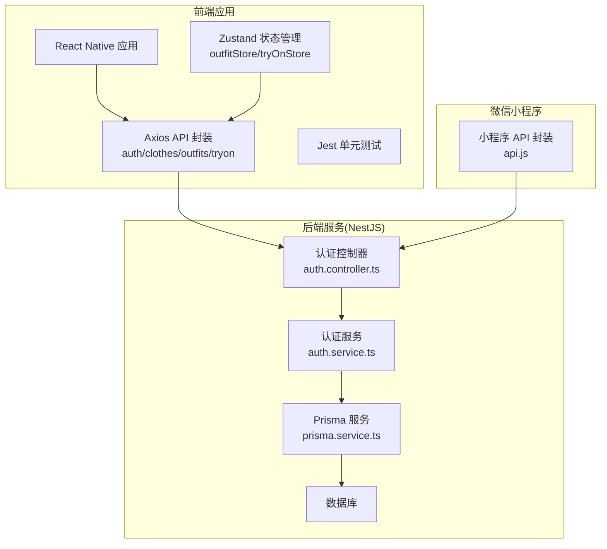
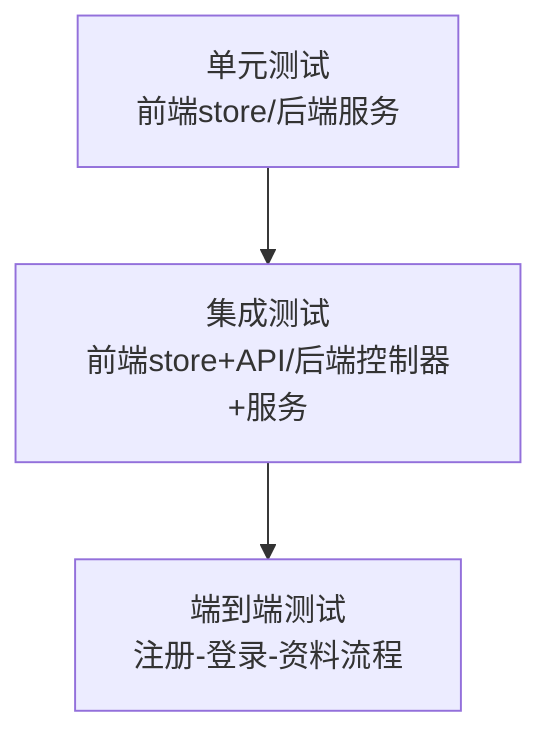
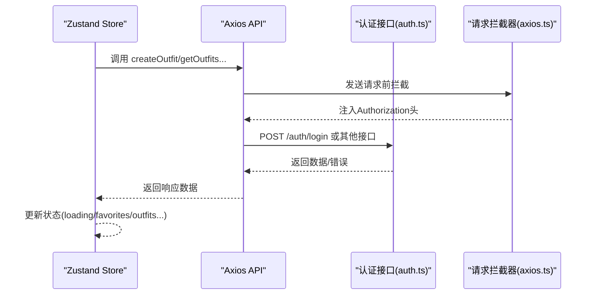
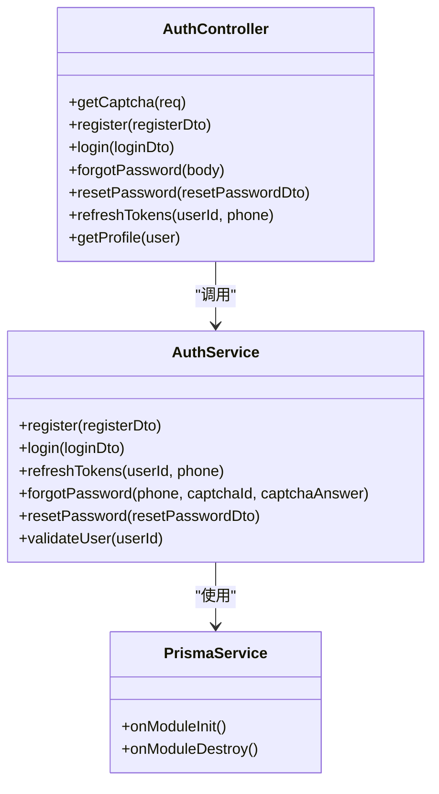
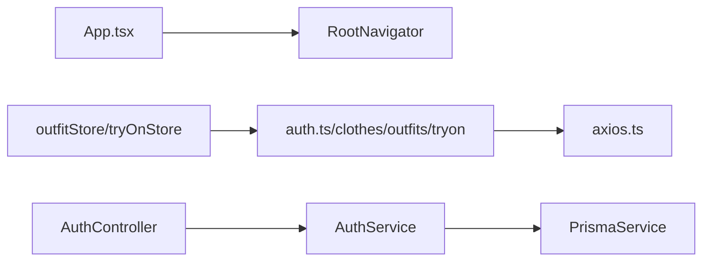

# 测试策略

<cite>
**本文引用的文件**
- [FreeDressApp/jest.config.js](file://FreeDressApp/jest.config.js)
- [FreeDressApp/package.json](file://FreeDressApp/package.json)
- [FreeDressApp/__tests__/App.test.tsx](file://FreeDressApp/__tests__/App.test.tsx)
- [FreeDressApp/src/App.tsx](file://FreeDressApp/src/App.tsx)
- [FreeDressApp/src/store/outfitStore.ts](file://FreeDressApp/src/store/outfitStore.ts)
- [FreeDressApp/src/store/tryOnStore.ts](file://FreeDressApp/src/store/tryOnStore.ts)
- [FreeDressApp/src/api/axios.ts](file://FreeDressApp/src/api/axios.ts)
- [FreeDressApp/src/api/auth.ts](file://FreeDressApp/src/api/auth.ts)
- [backend/package.json](file://backend/package.json)
- [backend/src/modules/auth/auth.service.ts](file://backend/src/modules/auth/auth.service.ts)
- [backend/src/modules/auth/auth.controller.ts](file://backend/src/modules/auth/auth.controller.ts)
- [backend/src/prisma/prisma.service.ts](file://backend/src/prisma/prisma.service.ts)
- [freeDressWechat/utils/api.js](file://freeDressWechat/utils/api.js)
</cite>

## 目录
1. [引言](#引言)
2. [项目结构](#项目结构)
3. [核心组件](#核心组件)
4. [架构总览](#架构总览)
5. [详细组件分析](#详细组件分析)
6. [依赖关系分析](#依赖关系分析)
7. [性能考量](#性能考量)
8. [故障排查指南](#故障排查指南)
9. [结论](#结论)
10. [附录](#附录)

## 引言
本测试策略文档面向畅搭(FreeDress)项目，系统化阐述测试金字塔在前端与后端的应用：单元测试、集成测试与端到端测试的实施策略；测试框架配置与最佳实践（Jest、测试环境、模拟策略）；前端组件测试、状态管理测试与API集成测试指南；后端服务层、控制器与数据库测试方法；测试数据管理与隔离策略；以及在持续集成中实现测试自动化与覆盖率监控。

## 项目结构
畅搭项目采用多模块结构：
- 前端应用：React Native 应用，包含组件、导航、状态管理(Zustand)、API封装(Axios)与测试入口。
- 后端服务：NestJS 应用，采用模块化设计，包含认证、衣物、搭配、试穿、上传与用户模块，配合 Prisma 进行数据库访问。
- 微信小程序：freeDressWechat 提供微信端能力，便于理解跨端 API 使用方式。

图表来源
- [FreeDressApp/src/store/outfitStore.ts:1-89](file://FreeDressApp/src/store/outfitStore.ts#L1-L89)
- [FreeDressApp/src/store/tryOnStore.ts:1-58](file://FreeDressApp/src/store/tryOnStore.ts#L1-L58)
- [FreeDressApp/src/api/axios.ts:1-107](file://FreeDressApp/src/api/axios.ts#L1-L107)
- [FreeDressApp/src/api/auth.ts:1-100](file://FreeDressApp/src/api/auth.ts#L1-L100)
- [backend/src/modules/auth/auth.controller.ts:1-92](file://backend/src/modules/auth/auth.controller.ts#L1-L92)
- [backend/src/modules/auth/auth.service.ts:1-279](file://backend/src/modules/auth/auth.service.ts#L1-L279)
- [backend/src/prisma/prisma.service.ts:1-27](file://backend/src/prisma/prisma.service.ts#L1-L27)
- [freeDressWechat/utils/api.js:1-43](file://freeDressWechat/utils/api.js#L1-L43)

章节来源
- [FreeDressApp/jest.config.js:1-4](file://FreeDressApp/jest.config.js#L1-L4)
- [FreeDressApp/package.json:1-57](file://FreeDressApp/package.json#L1-L57)
- [backend/package.json:1-91](file://backend/package.json#L1-L91)

## 核心组件
- 前端测试基础
  - Jest 预设：使用 @react-native/jest-preset，简化RN测试配置。
  - 测试脚本：通过 npm/yarn test 调用 Jest。
  - 示例测试：App.test.tsx 展示了对根组件的渲染测试。
- 状态管理测试
  - outfitStore：负责搭配列表、收藏、新增、删除、收藏切换与当前搭配设置。
  - tryOnStore：负责试穿结果列表、生成、当前结果设置与加载状态。
- API 层测试
  - axios.ts：统一请求/响应拦截器、鉴权令牌注入与刷新、错误处理。
  - auth.ts：认证相关接口封装（注册、登录、忘记密码、刷新令牌、获取资料）。
- 后端测试基础
  - NestJS Jest 配置：支持 TypeScript 转换、覆盖率收集、E2E 测试脚本。
  - 认证模块：控制器与服务分离，便于针对服务层进行单元测试与针对控制器进行集成测试。
  - 数据库：Prisma 作为 ORM，PrismaService 管理连接生命周期。

章节来源
- [FreeDressApp/jest.config.js:1-4](file://FreeDressApp/jest.config.js#L1-L4)
- [FreeDressApp/package.json:5-11](file://FreeDressApp/package.json#L5-L11)
- [FreeDressApp/__tests__/App.test.tsx:1-14](file://FreeDressApp/__tests__/App.test.tsx#L1-L14)
- [FreeDressApp/src/store/outfitStore.ts:1-89](file://FreeDressApp/src/store/outfitStore.ts#L1-L89)
- [FreeDressApp/src/store/tryOnStore.ts:1-58](file://FreeDressApp/src/store/tryOnStore.ts#L1-L58)
- [FreeDressApp/src/api/axios.ts:1-107](file://FreeDressApp/src/api/axios.ts#L1-L107)
- [FreeDressApp/src/api/auth.ts:1-100](file://FreeDressApp/src/api/auth.ts#L1-L100)
- [backend/package.json:73-89](file://backend/package.json#L73-L89)
- [backend/src/modules/auth/auth.controller.ts:1-92](file://backend/src/modules/auth/auth.controller.ts#L1-L92)
- [backend/src/modules/auth/auth.service.ts:1-279](file://backend/src/modules/auth/auth.service.ts#L1-L279)
- [backend/src/prisma/prisma.service.ts:1-27](file://backend/src/prisma/prisma.service.ts#L1-L27)

## 架构总览
测试金字塔在畅搭项目中的落地：
- 单元测试：覆盖前端 Zustand store 的业务逻辑、API 封装的拦截器与错误处理、后端服务层的核心算法与边界条件。
- 集成测试：验证前端 store 与 API 的交互、后端控制器与服务的协作、数据库读写一致性。
- 端到端测试：覆盖关键用户旅程（如注册-登录-获取资料），确保跨模块链路稳定。

## 详细组件分析

### 前端测试指南
- 组件测试
  - 目标：验证根组件渲染正确性与导航容器可用性。
  - 方法：使用 react-test-renderer 渲染 App 并断言渲染结果。
  - 建议：对复杂组件拆分测试，结合 React Native Testing Library 提升可测试性。
- 状态管理测试（Zustand）
  - 目标：验证状态变更、异步操作（API 调用）、错误分支与加载状态。
  - 方法：通过 mock API 层，隔离网络依赖；断言状态更新与副作用。
  - 建议：为每个 action 编写独立用例，覆盖成功与失败路径。
- API 集成测试
  - 目标：验证请求拦截器、鉴权头注入、刷新令牌流程与错误处理。
  - 方法：mock AsyncStorage 与 axios，断言请求头、重试与错误抛出。
  - 建议：为不同状态码与异常场景编写用例，覆盖 401 刷新失败等边界。

图表来源
- [FreeDressApp/src/store/outfitStore.ts:32-89](file://FreeDressApp/src/store/outfitStore.ts#L32-L89)
- [FreeDressApp/src/store/tryOnStore.ts:24-58](file://FreeDressApp/src/store/tryOnStore.ts#L24-L58)
- [FreeDressApp/src/api/axios.ts:24-105](file://FreeDressApp/src/api/axios.ts#L24-L105)
- [FreeDressApp/src/api/auth.ts:45-53](file://FreeDressApp/src/api/auth.ts#L45-L53)

章节来源
- [FreeDressApp/__tests__/App.test.tsx:1-14](file://FreeDressApp/__tests__/App.test.tsx#L1-L14)
- [FreeDressApp/src/App.tsx:1-28](file://FreeDressApp/src/App.tsx#L1-L28)
- [FreeDressApp/src/store/outfitStore.ts:1-89](file://FreeDressApp/src/store/outfitStore.ts#L1-L89)
- [FreeDressApp/src/store/tryOnStore.ts:1-58](file://FreeDressApp/src/store/tryOnStore.ts#L1-L58)
- [FreeDressApp/src/api/axios.ts:1-107](file://FreeDressApp/src/api/axios.ts#L1-L107)
- [FreeDressApp/src/api/auth.ts:1-100](file://FreeDressApp/src/api/auth.ts#L1-L100)

### 后端测试方法
- 服务层测试（AuthService）
  - 目标：覆盖注册、登录、刷新令牌、忘记密码、密码重置与用户验证等核心流程。
  - 方法：使用 @nestjs/testing 构建测试模块，mock PrismaService 与 JwtService，断言异常与返回值。
  - 建议：重点测试验证码校验、重复注册、密码加密、令牌过期清理等边界。
- 控制器测试（AuthController）
  - 目标：验证路由、DTO 校验、守卫与响应格式。
  - 方法：使用 supertest 发起 HTTP 请求，mock 服务层，断言状态码与响应体。
  - 建议：为需要鉴权的接口添加 JwtAuthGuard 的模拟。
- 数据库测试（Prisma）
  - 目标：验证查询、插入、更新、删除的正确性与事务一致性。
  - 方法：使用 Prisma 测试数据库（内存或临时库），在测试前后清理数据。
  - 建议：使用迁移脚本或种子数据准备测试集，确保可重复性。

图表来源
- [backend/src/modules/auth/auth.controller.ts:1-92](file://backend/src/modules/auth/auth.controller.ts#L1-L92)
- [backend/src/modules/auth/auth.service.ts:1-279](file://backend/src/modules/auth/auth.service.ts#L1-L279)
- [backend/src/prisma/prisma.service.ts:1-27](file://backend/src/prisma/prisma.service.ts#L1-L27)

章节来源
- [backend/src/modules/auth/auth.controller.ts:1-92](file://backend/src/modules/auth/auth.controller.ts#L1-L92)
- [backend/src/modules/auth/auth.service.ts:1-279](file://backend/src/modules/auth/auth.service.ts#L1-L279)
- [backend/src/prisma/prisma.service.ts:1-27](file://backend/src/prisma/prisma.service.ts#L1-L27)

### 测试数据管理与清理策略
- 前端
  - 使用 mock 存储与网络层，避免真实 AsyncStorage 与服务器依赖。
  - 对于状态管理测试，通过重置 store 状态或使用独立测试上下文保证隔离。
- 后端
  - 使用独立的测试数据库或内存数据库，测试结束后执行清理脚本或回滚事务。
  - Prisma 支持迁移与种子，在测试前准备固定数据集，测试后恢复。
- 微信小程序
  - 可参考其 API 封装方式，统一在测试中 mock 后端接口，确保跨端一致性。

章节来源
- [backend/src/prisma/prisma.service.ts:1-27](file://backend/src/prisma/prisma.service.ts#L1-L27)
- [freeDressWechat/utils/api.js:1-43](file://freeDressWechat/utils/api.js#L1-L43)

### 持续集成中的测试自动化与覆盖率监控
- 自动化
  - 前端：npm/yarn test 调用 Jest，可在 CI 中配置缓存与并行执行。
  - 后端：npm/yarn test、test:watch、test:cov、test:e2e 等脚本，CI 中按需运行。
- 覆盖率
  - 后端 Jest 已启用覆盖率收集，可通过 CI 报告与阈值控制。
  - 建议：为关键模块设置最小覆盖率阈值，逐步提升整体覆盖率。

章节来源
- [FreeDressApp/package.json:5-11](file://FreeDressApp/package.json#L5-L11)
- [backend/package.json:16-20](file://backend/package.json#L16-L20)
- [backend/package.json:73-89](file://backend/package.json#L73-L89)

## 依赖关系分析
- 前端
  - App.tsx 依赖 RootNavigator，渲染测试可覆盖根组件结构。
  - store 依赖 api 层，API 依赖 axios 拦截器，形成清晰的依赖链。
- 后端
  - AuthController 依赖 AuthService，AuthService 依赖 PrismaService 与 JwtService。
  - 依赖注入使服务层易于测试与替换。

图表来源
- [FreeDressApp/src/App.tsx:1-28](file://FreeDressApp/src/App.tsx#L1-L28)
- [FreeDressApp/src/store/outfitStore.ts:1-89](file://FreeDressApp/src/store/outfitStore.ts#L1-L89)
- [FreeDressApp/src/store/tryOnStore.ts:1-58](file://FreeDressApp/src/store/tryOnStore.ts#L1-L58)
- [FreeDressApp/src/api/auth.ts:1-100](file://FreeDressApp/src/api/auth.ts#L1-L100)
- [FreeDressApp/src/api/axios.ts:1-107](file://FreeDressApp/src/api/axios.ts#L1-L107)
- [backend/src/modules/auth/auth.controller.ts:1-92](file://backend/src/modules/auth/auth.controller.ts#L1-L92)
- [backend/src/modules/auth/auth.service.ts:1-279](file://backend/src/modules/auth/auth.service.ts#L1-L279)
- [backend/src/prisma/prisma.service.ts:1-27](file://backend/src/prisma/prisma.service.ts#L1-L27)

## 性能考量
- 测试执行速度
  - 前端：优先使用轻量级渲染与最小化依赖，减少慢速异步操作。
  - 后端：使用内存数据库与快速断言，避免真实 IO。
- 资源隔离
  - 使用独立测试数据库与临时文件，避免并发测试冲突。
- 覆盖率与质量
  - 通过覆盖率阈值与静态分析工具，平衡速度与质量。

## 故障排查指南
- 前端常见问题
  - 渲染测试失败：确认组件无外部副作用，必要时使用 act 包裹异步渲染。
  - 状态测试不稳定：确保每次测试前重置 store 状态或使用独立上下文。
  - API 测试失败：检查拦截器中的鉴权头与刷新逻辑，确保 mock 正确。
- 后端常见问题
  - 服务层测试失败：检查 DTO 校验与异常抛出，确保 Prisma mock 返回预期数据。
  - 控制器测试失败：确认路由、守卫与响应格式，必要时模拟用户上下文。
  - 数据库测试失败：核对迁移与种子脚本，确保测试前后数据一致。

章节来源
- [FreeDressApp/__tests__/App.test.tsx:1-14](file://FreeDressApp/__tests__/App.test.tsx#L1-L14)
- [FreeDressApp/src/api/axios.ts:24-105](file://FreeDressApp/src/api/axios.ts#L24-L105)
- [backend/src/modules/auth/auth.service.ts:44-95](file://backend/src/modules/auth/auth.service.ts#L44-L95)
- [backend/src/modules/auth/auth.controller.ts:24-68](file://backend/src/modules/auth/auth.controller.ts#L24-L68)

## 结论
通过构建完善的测试金字塔，结合前端组件与状态管理测试、后端服务与控制器测试以及数据库与端到端测试，可以显著提升畅搭项目的质量与稳定性。建议在 CI 中自动化执行各类测试，并持续优化覆盖率与测试效率。

## 附录
- 测试框架配置要点
  - 前端 Jest：使用 @react-native/jest-preset，确保 TS 转换与 RN 兼容。
  - 后端 Jest：启用 ts-jest、收集覆盖率、指定测试文件匹配规则。
- 最佳实践清单
  - 单元测试：关注边界条件与异常路径，使用最小化依赖。
  - 集成测试：验证跨模块协作与数据一致性。
  - 端到端测试：覆盖关键用户旅程，确保端到端连通性。
  - 数据管理：使用独立测试数据库与固定种子数据，保证可重复性。
  - CI 集成：自动化执行测试与覆盖率报告，设置阈值与告警。