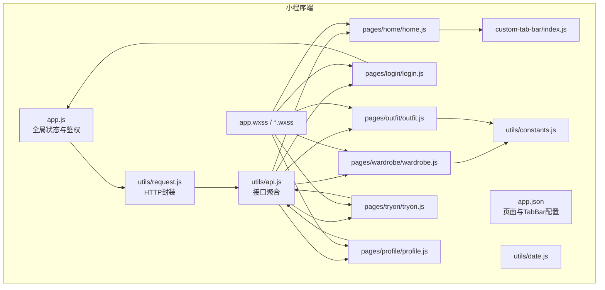
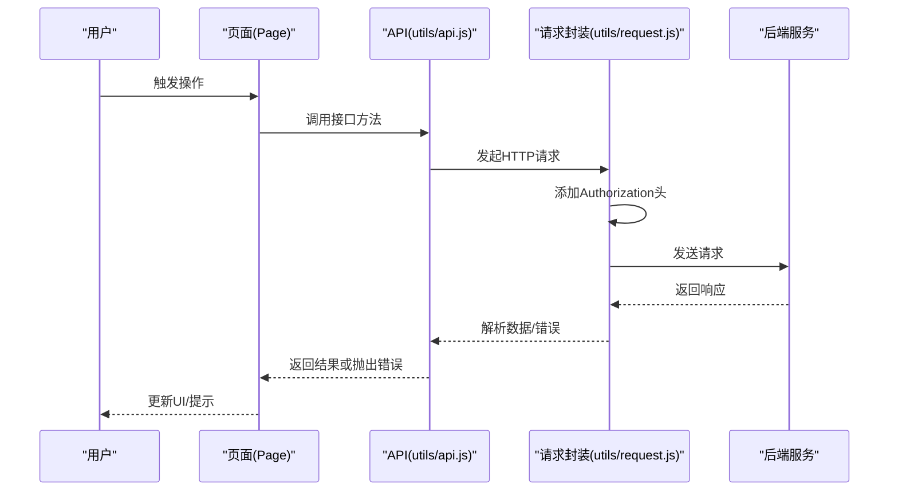
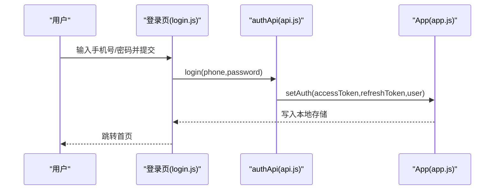
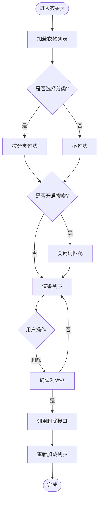
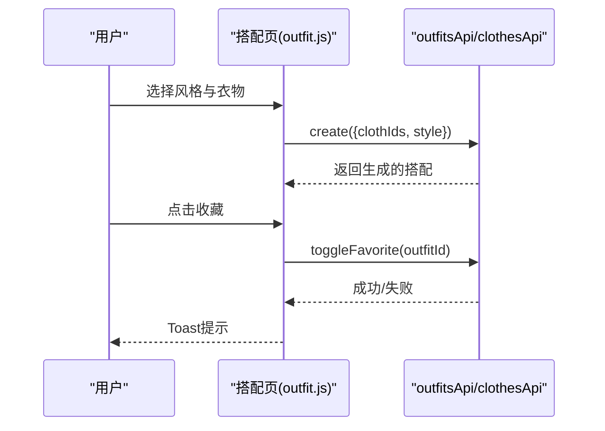
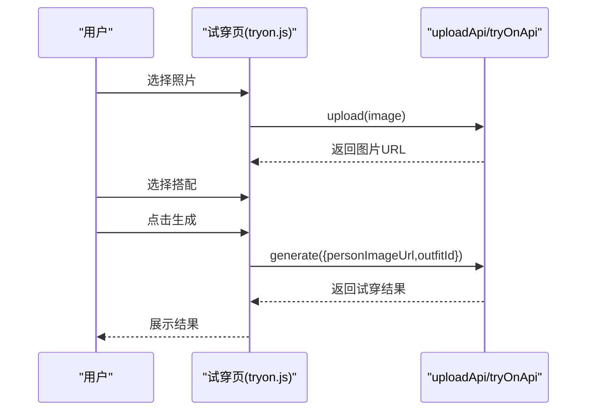
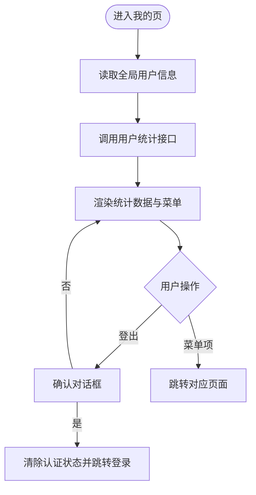
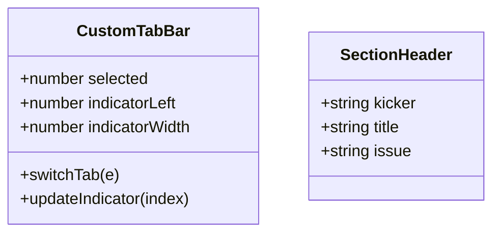
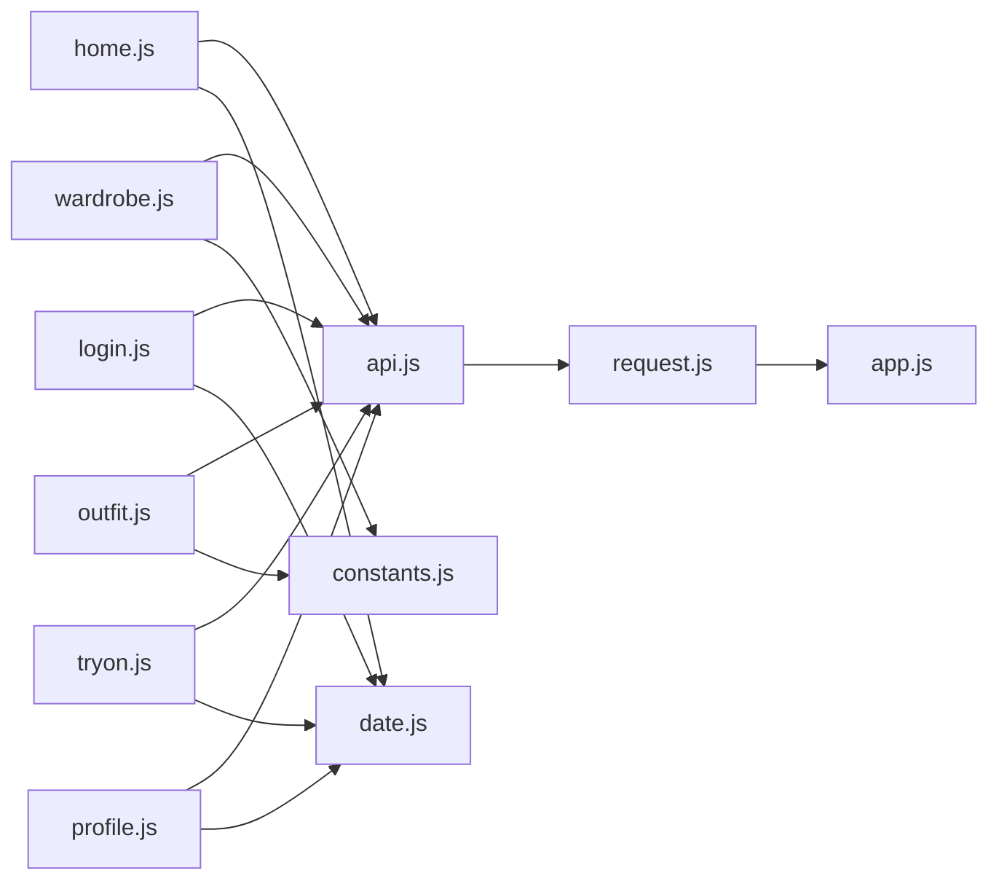

# 微信小程序开发

<cite>
**本文引用的文件**
- [freeDressWechat/app.js](file://freeDressWechat/app.js)
- [freeDressWechat/app.json](file://freeDressWechat/app.json)
- [freeDressWechat/utils/request.js](file://freeDressWechat/utils/request.js)
- [freeDressWechat/utils/api.js](file://freeDressWechat/utils/api.js)
- [freeDressWechat/pages/home/home.js](file://freeDressWechat/pages/home/home.js)
- [freeDressWechat/pages/login/login.js](file://freeDressWechat/pages/login/login.js)
- [freeDressWechat/pages/wardrobe/wardrobe.js](file://freeDressWechat/pages/wardrobe/wardrobe.js)
- [freeDressWechat/pages/outfit/outfit.js](file://freeDressWechat/pages/outfit/outfit.js)
- [freeDressWechat/pages/tryon/tryon.js](file://freeDressWechat/pages/tryon/tryon.js)
- [freeDressWechat/pages/profile/profile.js](file://freeDressWechat/pages/profile/profile.js)
- [freeDressWechat/custom-tab-bar/index.js](file://freeDressWechat/custom-tab-bar/index.js)
- [freeDressWechat/components/section-header/section-header.js](file://freeDressWechat/components/section-header/section-header.js)
- [freeDressWechat/utils/constants.js](file://freeDressWechat/utils/constants.js)
- [freeDressWechat/utils/date.js](file://freeDressWechat/utils/date.js)
- [freeDressWechat/app.wxss](file://freeDressWechat/app.wxss)
- [freeDressWechat/pages/home/home.wxss](file://freeDressWechat/pages/home/home.wxss)
- [freeDressWechat/project.config.json](file://freeDressWechat/project.config.json)
- [FreeDressApp/src/App.tsx](file://FreeDressApp/src/App.tsx)
</cite>

## 目录
1. [简介](#简介)
2. [项目结构](#项目结构)
3. [核心组件](#核心组件)
4. [架构总览](#架构总览)
5. [详细组件分析](#详细组件分析)
6. [依赖关系分析](#依赖关系分析)
7. [性能考虑](#性能考虑)
8. [故障排查指南](#故障排查指南)
9. [结论](#结论)
10. [附录](#附录)

## 简介
本指南面向开发者，系统讲解畅搭（FreeDress）微信小程序的开发方法与最佳实践。内容涵盖项目结构与开发规范、页面组织与组件使用、样式管理、与React Native移动端的异同与对齐策略、核心功能实现（用户认证、衣橱管理、搭配查看、AI试穿）、API封装与错误处理、小程序特有能力（图片上传、本地存储、网络请求）、调试与性能优化、发布流程，以及常见问题解决方案。

## 项目结构
畅搭小程序采用“原生小程序”技术栈，核心目录为 freeDressWechat，包含页面、组件、工具函数与全局样式；同时仓库还包含React Native移动端工程 FreeDressApp，便于前后端与移动端能力对齐。

- 全局入口与配置
  - 应用入口与全局状态：[freeDressWechat/app.js](file://freeDressWechat/app.js)
  - 应用配置与页面注册：[freeDressWechat/app.json](file://freeDressWechat/app.json)
  - 项目构建与编译配置：[freeDressWechat/project.config.json](file://freeDressWechat/project.config.json)

- 页面层
  - 登录页：[freeDressWechat/pages/login/login.js](file://freeDressWechat/pages/login/login.js)
  - 首页：[freeDressWechat/pages/home/home.js](file://freeDressWechat/pages/home/home.js)
  - 衣橱页：[freeDressWechat/pages/wardrobe/wardrobe.js](file://freeDressWechat/pages/wardrobe/wardrobe.js)
  - 搭配页：[freeDressWechat/pages/outfit/outfit.js](file://freeDressWechat/pages/outfit/outfit.js)
  - AI试穿页：[freeDressWechat/pages/tryon/tryon.js](file://freeDressWechat/pages/tryon/tryon.js)
  - 我的页：[freeDressWechat/pages/profile/profile.js](file://freeDressWechat/pages/profile/profile.js)

- 工具与接口
  - 网络请求封装：[freeDressWechat/utils/request.js](file://freeDressWechat/utils/request.js)
  - API接口聚合：[freeDressWechat/utils/api.js](file://freeDressWechat/utils/api.js)
  - 常量与枚举：[freeDressWechat/utils/constants.js](file://freeDressWechat/utils/constants.js)
  - 日期工具：[freeDressWechat/utils/date.js](file://freeDressWechat/utils/date.js)

- 自定义组件与样式
  - 自定义TabBar：[freeDressWechat/custom-tab-bar/index.js](file://freeDressWechat/custom-tab-bar/index.js)
  - 区块标题组件：[freeDressWechat/components/section-header/section-header.js](file://freeDressWechat/components/section-header/section-header.js)
  - 全局样式与设计令牌：[freeDressWechat/app.wxss](file://freeDressWechat/app.wxss)
  - 页面样式示例：[freeDressWechat/pages/home/home.wxss](file://freeDressWechat/pages/home/home.wxss)

- 移动端对比参考
  - RN根组件示例：[FreeDressApp/src/App.tsx](file://FreeDressApp/src/App.tsx)

**图表来源**
- [freeDressWechat/app.js:1-53](file://freeDressWechat/app.js#L1-L53)
- [freeDressWechat/app.json:1-65](file://freeDressWechat/app.json#L1-L65)
- [freeDressWechat/utils/request.js:1-87](file://freeDressWechat/utils/request.js#L1-L87)
- [freeDressWechat/utils/api.js:1-62](file://freeDressWechat/utils/api.js#L1-L62)
- [freeDressWechat/pages/home/home.js:1-61](file://freeDressWechat/pages/home/home.js#L1-L61)
- [freeDressWechat/pages/login/login.js:1-63](file://freeDressWechat/pages/login/login.js#L1-L63)
- [freeDressWechat/pages/wardrobe/wardrobe.js:1-119](file://freeDressWechat/pages/wardrobe/wardrobe.js#L1-L119)
- [freeDressWechat/pages/outfit/outfit.js:1-107](file://freeDressWechat/pages/outfit/outfit.js#L1-L107)
- [freeDressWechat/pages/tryon/tryon.js:1-93](file://freeDressWechat/pages/tryon/tryon.js#L1-L93)
- [freeDressWechat/pages/profile/profile.js:1-93](file://freeDressWechat/pages/profile/profile.js#L1-L93)
- [freeDressWechat/custom-tab-bar/index.js:1-45](file://freeDressWechat/custom-tab-bar/index.js#L1-L45)
- [freeDressWechat/utils/constants.js:1-24](file://freeDressWechat/utils/constants.js#L1-L24)
- [freeDressWechat/utils/date.js:1-98](file://freeDressWechat/utils/date.js#L1-L98)
- [freeDressWechat/app.wxss:1-201](file://freeDressWechat/app.wxss#L1-L201)

**章节来源**
- [freeDressWechat/app.js:1-53](file://freeDressWechat/app.js#L1-L53)
- [freeDressWechat/app.json:1-65](file://freeDressWechat/app.json#L1-L65)
- [freeDressWechat/project.config.json:1-58](file://freeDressWechat/project.config.json#L1-L58)

## 核心组件
- 全局应用状态与鉴权
  - 全局数据：用户信息、访问令牌、刷新令牌、基础URL
  - 生命周期：启动时读取本地存储，恢复登录态
  - 方法：设置/清除认证信息、检查登录态
  - 参考路径：[freeDressWechat/app.js:1-53](file://freeDressWechat/app.js#L1-L53)

- 网络请求封装
  - 统一添加Authorization头（Bearer）
  - 统一处理401（跳转登录）、统一错误提示
  - 提供通用请求与快捷方法（get/post/put/del/upload）
  - 参考路径：[freeDressWechat/utils/request.js:1-87](file://freeDressWechat/utils/request.js#L1-L87)

- API接口聚合
  - 认证、用户、衣物、搭配、AI试穿、上传等模块化封装
  - 与后端接口路径一一对应
  - 参考路径：[freeDressWechat/utils/api.js:1-62](file://freeDressWechat/utils/api.js#L1-L62)

- 自定义TabBar
  - 自定义指示器位置与宽度计算
  - 切换Tab时更新选中态
  - 参考路径：[freeDressWechat/custom-tab-bar/index.js:1-45](file://freeDressWechat/custom-tab-bar/index.js#L1-L45)

- 常量与日期工具
  - 衣物分类、风格选项、颜色与季节枚举
  - 期刊风格日期格式化（周数、期号、季节编码等）
  - 参考路径：[freeDressWechat/utils/constants.js:1-24](file://freeDressWechat/utils/constants.js#L1-L24)，[freeDressWechat/utils/date.js:1-98](file://freeDressWechat/utils/date.js#L1-L98)

**章节来源**
- [freeDressWechat/app.js:1-53](file://freeDressWechat/app.js#L1-L53)
- [freeDressWechat/utils/request.js:1-87](file://freeDressWechat/utils/request.js#L1-L87)
- [freeDressWechat/utils/api.js:1-62](file://freeDressWechat/utils/api.js#L1-L62)
- [freeDressWechat/custom-tab-bar/index.js:1-45](file://freeDressWechat/custom-tab-bar/index.js#L1-L45)
- [freeDressWechat/utils/constants.js:1-24](file://freeDressWechat/utils/constants.js#L1-L24)
- [freeDressWechat/utils/date.js:1-98](file://freeDressWechat/utils/date.js#L1-L98)

## 架构总览
小程序端通过全局App管理认证状态，页面通过API模块调用后端服务，自定义组件提升复用性与一致性。整体遵循“页面-组件-工具-全局”的分层结构。

**图表来源**
- [freeDressWechat/utils/api.js:1-62](file://freeDressWechat/utils/api.js#L1-L62)
- [freeDressWechat/utils/request.js:1-87](file://freeDressWechat/utils/request.js#L1-L87)

## 详细组件分析

### 用户认证流程
- 登录页校验输入，调用登录接口，成功后写入全局状态并跳转首页
- 首页在显示时检查登录态，未登录则重定向到登录页
- 登出时清除全局状态并返回登录页

**图表来源**
- [freeDressWechat/pages/login/login.js:1-63](file://freeDressWechat/pages/login/login.js#L1-L63)
- [freeDressWechat/utils/api.js:1-62](file://freeDressWechat/utils/api.js#L1-L62)
- [freeDressWechat/app.js:1-53](file://freeDressWechat/app.js#L1-L53)

**章节来源**
- [freeDressWechat/pages/login/login.js:1-63](file://freeDressWechat/pages/login/login.js#L1-L63)
- [freeDressWechat/pages/home/home.js:1-61](file://freeDressWechat/pages/home/home.js#L1-L61)
- [freeDressWechat/app.js:1-53](file://freeDressWechat/app.js#L1-L53)

### 衣橱管理
- 分类筛选、搜索过滤、下拉刷新、删除确认
- 展示衣物列表与季节标签，支持预览图片

**图表来源**
- [freeDressWechat/pages/wardrobe/wardrobe.js:1-119](file://freeDressWechat/pages/wardrobe/wardrobe.js#L1-L119)
- [freeDressWechat/utils/constants.js:1-24](file://freeDressWechat/utils/constants.js#L1-L24)

**章节来源**
- [freeDressWechat/pages/wardrobe/wardrobe.js:1-119](file://freeDressWechat/pages/wardrobe/wardrobe.js#L1-L119)
- [freeDressWechat/utils/constants.js:1-24](file://freeDressWechat/utils/constants.js#L1-L24)

### 搭配查看与收藏
- 多风格意图选择，多件衣物勾选，一键生成搭配
- 收藏/取消收藏搭配，支持清空选择

**图表来源**
- [freeDressWechat/pages/outfit/outfit.js:1-107](file://freeDressWechat/pages/outfit/outfit.js#L1-L107)
- [freeDressWechat/utils/api.js:1-62](file://freeDressWechat/utils/api.js#L1-L62)

**章节来源**
- [freeDressWechat/pages/outfit/outfit.js:1-107](file://freeDressWechat/pages/outfit/outfit.js#L1-L107)

### AI试穿
- 步骤式流程：上传照片 -> 选择搭配 -> 生成效果
- 支持相册/相机选择媒体，上传图片，调用生成接口

**图表来源**
- [freeDressWechat/pages/tryon/tryon.js:1-93](file://freeDressWechat/pages/tryon/tryon.js#L1-L93)
- [freeDressWechat/utils/api.js:1-62](file://freeDressWechat/utils/api.js#L1-L62)

**章节来源**
- [freeDressWechat/pages/tryon/tryon.js:1-93](file://freeDressWechat/pages/tryon/tryon.js#L1-L93)

### 我的页面与统计
- 展示用户信息与统计数据（衣物、搭配、收藏、试穿次数）
- 支持菜单项跳转与登出

**图表来源**
- [freeDressWechat/pages/profile/profile.js:1-93](file://freeDressWechat/pages/profile/profile.js#L1-L93)
- [freeDressWechat/utils/api.js:1-62](file://freeDressWechat/utils/api.js#L1-L62)

**章节来源**
- [freeDressWechat/pages/profile/profile.js:1-93](file://freeDressWechat/pages/profile/profile.js#L1-L93)

### 自定义TabBar与组件
- 自定义TabBar根据选中索引动态计算指示器位置
- 区块标题组件接收kicker/title/issue属性

**图表来源**
- [freeDressWechat/custom-tab-bar/index.js:1-45](file://freeDressWechat/custom-tab-bar/index.js#L1-L45)
- [freeDressWechat/components/section-header/section-header.js:1-8](file://freeDressWechat/components/section-header/section-header.js#L1-L8)

**章节来源**
- [freeDressWechat/custom-tab-bar/index.js:1-45](file://freeDressWechat/custom-tab-bar/index.js#L1-L45)
- [freeDressWechat/components/section-header/section-header.js:1-8](file://freeDressWechat/components/section-header/section-header.js#L1-L8)

## 依赖关系分析
- 页面依赖API模块进行数据交互
- API模块依赖请求封装进行HTTP调用
- 请求封装依赖全局App读取令牌与基础URL
- 页面可直接依赖工具模块（常量、日期）

**图表来源**
- [freeDressWechat/pages/home/home.js:1-61](file://freeDressWechat/pages/home/home.js#L1-L61)
- [freeDressWechat/pages/login/login.js:1-63](file://freeDressWechat/pages/login/login.js#L1-L63)
- [freeDressWechat/pages/wardrobe/wardrobe.js:1-119](file://freeDressWechat/pages/wardrobe/wardrobe.js#L1-L119)
- [freeDressWechat/pages/outfit/outfit.js:1-107](file://freeDressWechat/pages/outfit/outfit.js#L1-L107)
- [freeDressWechat/pages/tryon/tryon.js:1-93](file://freeDressWechat/pages/tryon/tryon.js#L1-L93)
- [freeDressWechat/pages/profile/profile.js:1-93](file://freeDressWechat/pages/profile/profile.js#L1-L93)
- [freeDressWechat/utils/api.js:1-62](file://freeDressWechat/utils/api.js#L1-L62)
- [freeDressWechat/utils/request.js:1-87](file://freeDressWechat/utils/request.js#L1-L87)
- [freeDressWechat/app.js:1-53](file://freeDressWechat/app.js#L1-L53)
- [freeDressWechat/utils/constants.js:1-24](file://freeDressWechat/utils/constants.js#L1-L24)
- [freeDressWechat/utils/date.js:1-98](file://freeDressWechat/utils/date.js#L1-L98)

**章节来源**
- [freeDressWechat/utils/api.js:1-62](file://freeDressWechat/utils/api.js#L1-L62)
- [freeDressWechat/utils/request.js:1-87](file://freeDressWechat/utils/request.js#L1-L87)
- [freeDressWechat/app.js:1-53](file://freeDressWechat/app.js#L1-L53)

## 性能考虑
- 启用压缩与懒加载
  - 项目配置中启用最小化与懒加载相关选项，减少包体积与首屏加载时间
  - 参考路径：[freeDressWechat/project.config.json:1-58](file://freeDressWechat/project.config.json#L1-L58)

- 图片与资源
  - 使用合适的图片尺寸与格式，避免超大资源
  - 上传前进行压缩与裁剪，降低网络开销

- 列表渲染优化
  - 衣物/搭配列表使用虚拟滚动或分页加载
  - 搜索与过滤在前端进行时注意复杂度，必要时后端分页

- 网络请求
  - 合理缓存与去重请求，避免重复加载
  - 对高频接口增加节流/防抖

- 样式与动画
  - 使用全局变量与原子化类名，减少重复样式
  - 控制动画时长与数量，避免掉帧

**章节来源**
- [freeDressWechat/project.config.json:1-58](file://freeDressWechat/project.config.json#L1-L58)

## 故障排查指南
- 登录态失效
  - 现象：接口返回401，自动跳转登录页
  - 处理：清理本地存储的令牌与用户信息，引导重新登录
  - 参考路径：[freeDressWechat/utils/request.js:29-33](file://freeDressWechat/utils/request.js#L29-L33)，[freeDressWechat/app.js:37-44](file://freeDressWechat/app.js#L37-L44)

- 网络请求失败
  - 现象：fail回调触发，提示网络请求失败
  - 处理：检查网络权限、域名配置、HTTPS与合法域名
  - 参考路径：[freeDressWechat/utils/request.js:39-41](file://freeDressWechat/utils/request.js#L39-L41)

- 上传失败
  - 现象：上传接口返回非200或解析失败
  - 处理：确认文件类型与大小限制，检查后端上传接口
  - 参考路径：[freeDressWechat/utils/request.js:71-77](file://freeDressWechat/utils/request.js#L71-L77)，[freeDressWechat/utils/api.js:50-52](file://freeDressWechat/utils/api.js#L50-L52)

- 页面跳转与TabBar
  - 现象：切换Tab后选中态未更新
  - 处理：确保页面onShow中调用getTabBar并setData
  - 参考路径：[freeDressWechat/pages/home/home.js:27-28](file://freeDressWechat/pages/home/home.js#L27-L28)，[freeDressWechat/custom-tab-bar/index.js:30-42](file://freeDressWechat/custom-tab-bar/index.js#L30-L42)

**章节来源**
- [freeDressWechat/utils/request.js:1-87](file://freeDressWechat/utils/request.js#L1-L87)
- [freeDressWechat/app.js:1-53](file://freeDressWechat/app.js#L1-L53)
- [freeDressWechat/utils/api.js:1-62](file://freeDressWechat/utils/api.js#L1-L62)
- [freeDressWechat/pages/home/home.js:1-61](file://freeDressWechat/pages/home/home.js#L1-L61)
- [freeDressWechat/custom-tab-bar/index.js:1-45](file://freeDressWechat/custom-tab-bar/index.js#L1-L45)

## 结论
本指南基于现有代码梳理了畅搭小程序的开发结构与实现要点，提供了从页面到工具、从接口到样式的完整视图。建议在后续迭代中持续完善错误处理、埋点与监控、国际化与无障碍支持，并与移动端RN工程保持接口与交互一致性，以实现跨端协同与数据同步。

## 附录

### 开发规范与最佳实践
- 目录命名与职责分离：页面、组件、工具、样式分层清晰
- 统一API命名与参数传递，避免魔法数
- 页面生命周期合理使用：onLoad仅初始化，onShow用于刷新
- 组件化优先：公共UI抽象为组件，减少重复代码
- 样式管理：使用全局变量与原子化类名，避免内联样式

### 与React Native移动端的差异与对齐
- 技术栈差异
  - 小程序：WXML/WXSS + JS（原生小程序框架）
  - 移动端：React Native + TypeScript
- 相同点
  - 导航与页面组织方式相近（栈式导航）
  - 状态管理与数据流理念一致（单向数据流）
  - 组件化思想贯穿两端
- 数据同步与功能对齐
  - 接口协议保持一致，字段命名与类型对齐
  - 登录态与鉴权策略统一（Bearer Token）
  - 样式与交互风格统一，保证跨端一致性

**章节来源**
- [FreeDressApp/src/App.tsx:1-28](file://FreeDressApp/src/App.tsx#L1-L28)

### 样式管理与设计系统
- 设计令牌：颜色、字体、字号、间距、圆角
- 语义化类名：文本、装饰线、安全区域、纹理、动画
- 页面级样式：按区块划分，避免全局污染

**章节来源**
- [freeDressWechat/app.wxss:1-201](file://freeDressWechat/app.wxss#L1-L201)
- [freeDressWechat/pages/home/home.wxss:1-61](file://freeDressWechat/pages/home/home.wxss#L1-L61)

### 调试与发布
- 调试
  - 使用开发者工具真机调试，关注网络面板与Storage
  - 在关键流程打点日志，定位异常
- 发布
  - 配置合法域名与业务域名
  - 打包前启用压缩与混淆，核对分包与懒加载
  - 使用CI/CD自动化构建与上传

**章节来源**
- [freeDressWechat/project.config.json:1-58](file://freeDressWechat/project.config.json#L1-L58)