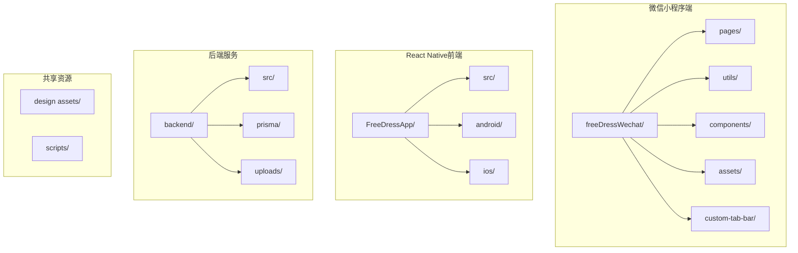
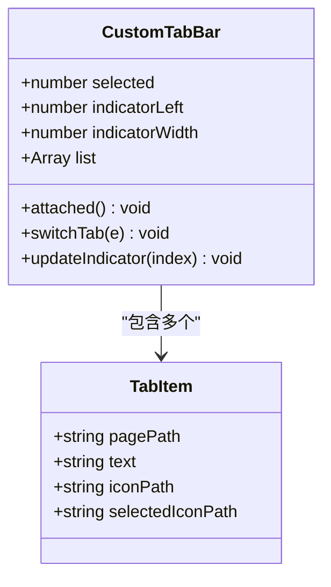
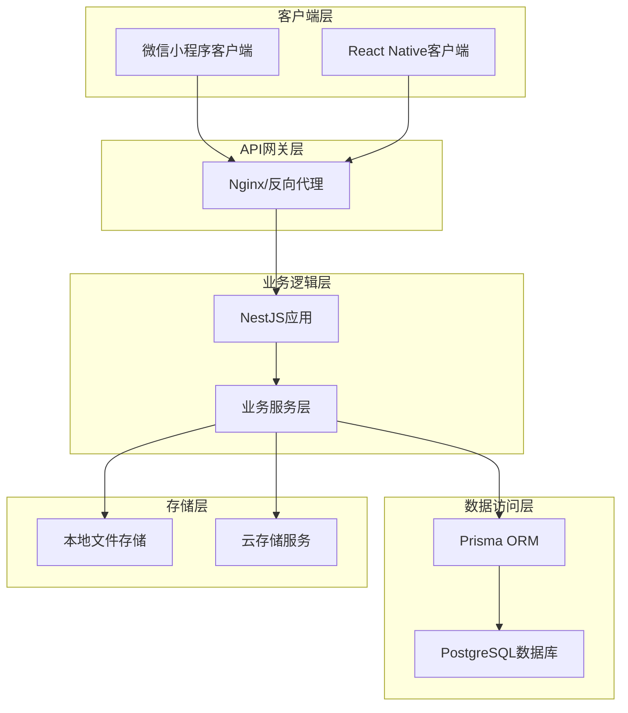
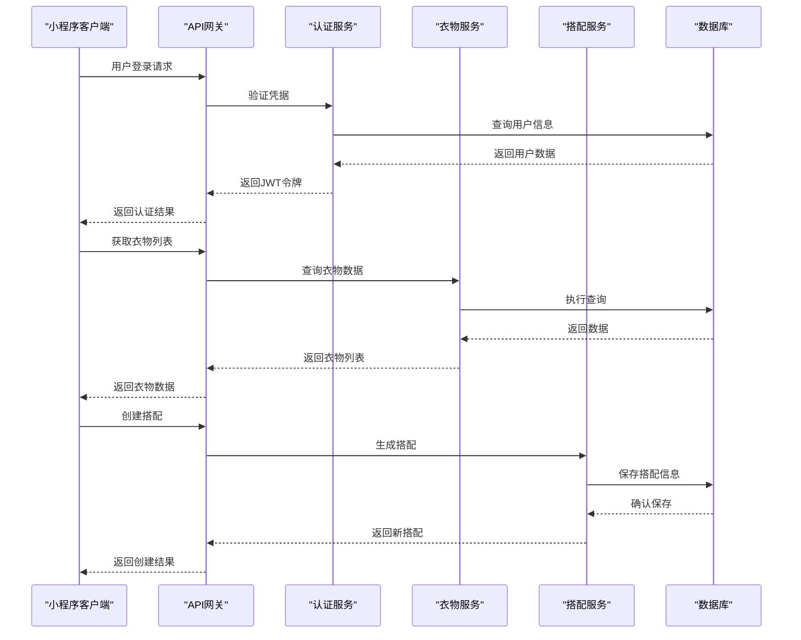
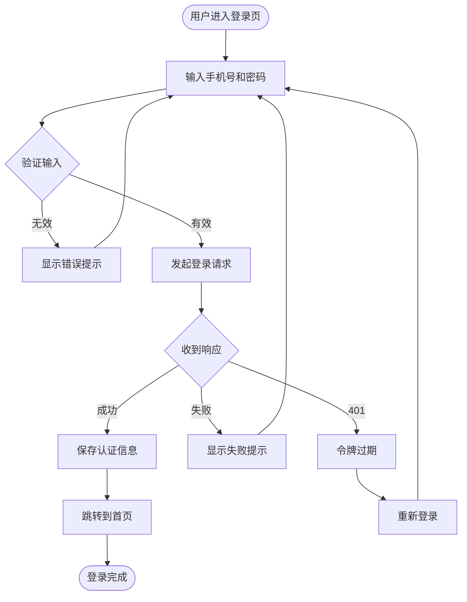
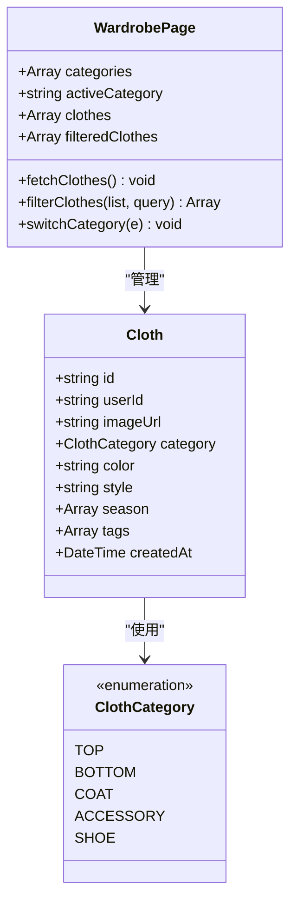
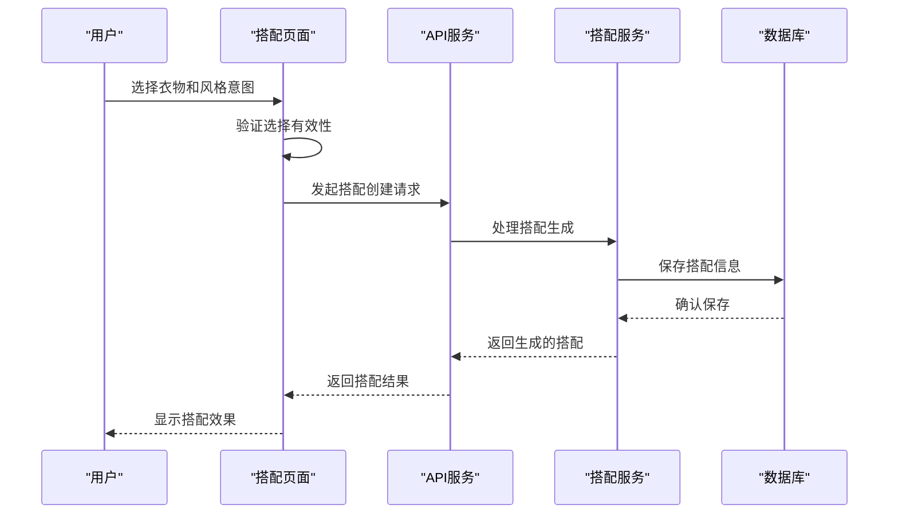
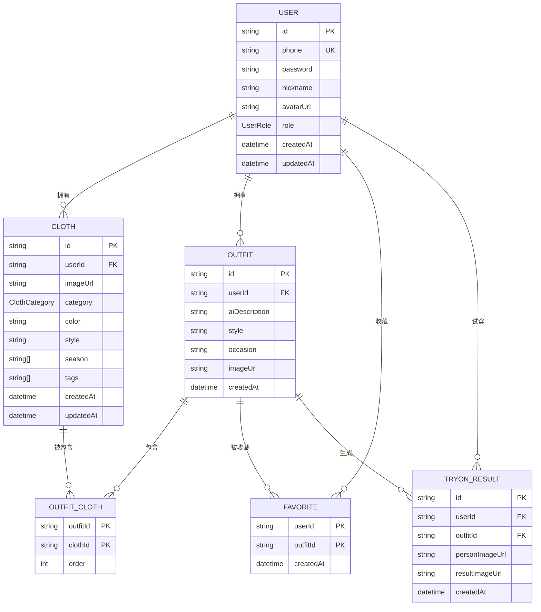
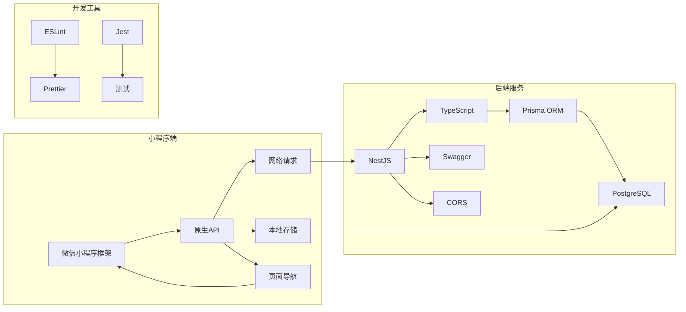

# 微信小程序

<cite>
**本文档引用的文件**
- [README.md](file://FreeDressApp/README.md)
- [PROJECT_STATUS.md](file://PROJECT_STATUS.md)
- [app.json](file://freeDressWechat/app.json)
- [app.js](file://freeDressWechat/app.js)
- [api.js](file://freeDressWechat/utils/api.js)
- [request.js](file://freeDressWechat/utils/request.js)
- [constants.js](file://freeDressWechat/utils/constants.js)
- [home.js](file://freeDressWechat/pages/home/home.js)
- [login.js](file://freeDressWechat/pages/login/login.js)
- [wardrobe.js](file://freeDressWechat/pages/wardrobe/wardrobe.js)
- [outfit.js](file://freeDressWechat/pages/outfit/outfit.js)
- [profile.js](file://freeDressWechat/pages/profile/profile.js)
- [custom-tab-bar/index.js](file://freeDressWechat/custom-tab-bar/index.js)
- [main.ts](file://backend/src/main.ts)
- [schema.prisma](file://backend/prisma/schema.prisma)
</cite>

## 目录
1. [简介](#简介)
2. [项目结构](#项目结构)
3. [核心组件](#核心组件)
4. [架构概览](#架构概览)
5. [详细组件分析](#详细组件分析)
6. [依赖关系分析](#依赖关系分析)
7. [性能考虑](#性能考虑)
8. [故障排除指南](#故障排除指南)
9. [结论](#结论)

## 简介

畅搭（FreeDress）是一个基于微信小程序平台的智能衣物搭配应用。该项目采用前后端分离架构，后端使用NestJS + Prisma + PostgreSQL构建RESTful API，前端提供React Native版本，同时包含微信小程序端的基础框架。

该应用的核心功能包括：
- 智能衣物搭配平台，让穿搭更简单
- 衣橱管理与分类
- AI智能搭配推荐
- AI试穿功能
- 个人中心与统计数据

## 项目结构

项目采用多模块组织方式，主要包含以下核心目录：

**图表来源**
- [app.json:1-65](file://freeDressWechat/app.json#L1-L65)
- [README.md:86-118](file://FreeDressApp/README.md#L86-L118)

**章节来源**
- [app.json:1-65](file://freeDressWechat/app.json#L1-L65)
- [README.md:86-118](file://FreeDressApp/README.md#L86-L118)

## 核心组件

### 小程序页面架构

微信小程序端采用标准的页面结构，包含以下主要页面：

| 页面 | 功能描述 | 路径 |
|------|----------|------|
| 登录页 | 用户身份验证 | pages/login/login |
| 注册页 | 用户账户创建 | pages/register/register |
| 首页 | 主要功能入口 | pages/home/home |
| 衣橱页 | 衣物管理与浏览 | pages/wardrobe/wardrobe |
| 搭配页 | 智能搭配生成 | pages/outfit/outfit |
| 试穿页 | AI试穿功能 | pages/tryon/tryon |
| 个人中心 | 用户信息管理 | pages/profile/profile |
| 收藏页 | 收藏的搭配 | pages/favorites/favorites |
| 搭配历史 | 历史搭配记录 | pages/outfitHistory/outfitHistory |
| 试穿记录 | 试穿历史记录 | pages/tryOnHistory/tryOnHistory |

### 自定义TabBar组件

小程序实现了自定义底部导航栏，提供更好的用户体验：

**图表来源**
- [custom-tab-bar/index.js:1-45](file://freeDressWechat/custom-tab-bar/index.js#L1-L45)

**章节来源**
- [custom-tab-bar/index.js:1-45](file://freeDressWechat/custom-tab-bar/index.js#L1-L45)
- [app.json:22-60](file://freeDressWechat/app.json#L22-L60)

## 架构概览

### 整体架构设计

**图表来源**
- [main.ts:1-62](file://backend/src/main.ts#L1-L62)
- [schema.prisma:1-132](file://backend/prisma/schema.prisma#L1-L132)

### 数据流架构

**图表来源**
- [api.js:1-62](file://freeDressWechat/utils/api.js#L1-L62)
- [request.js:1-87](file://freeDressWechat/utils/request.js#L1-L87)

## 详细组件分析

### 认证系统

#### 登录流程

**图表来源**
- [login.js:26-53](file://freeDressWechat/pages/login/login.js#L26-L53)
- [app.js:25-32](file://freeDressWechat/app.js#L25-L32)

#### Token管理机制

小程序实现了完整的JWT令牌管理：

| 功能 | 实现方式 | 存储位置 |
|------|----------|----------|
| 访问令牌 | `access_token` | `wx.setStorageSync` |
| 刷新令牌 | `refresh_token` | `wx.setStorageSync` |
| 用户信息 | `user_info` | `wx.setStorageSync` |
| 自动清理 | `clearAuth()` | 清除所有存储 |

**章节来源**
- [login.js:1-63](file://freeDressWechat/pages/login/login.js#L1-L63)
- [app.js:1-53](file://freeDressWechat/app.js#L1-L53)

### 衣橱管理系统

#### 衣物分类与筛选

**图表来源**
- [wardrobe.js:1-119](file://freeDressWechat/pages/wardrobe/wardrobe.js#L1-L119)
- [constants.js:6-13](file://freeDressWechat/utils/constants.js#L6-L13)

#### 搜索与过滤功能

页面实现了多维度的搜索和过滤机制：

| 过滤条件 | 实现方式 | 性能特点 |
|----------|----------|----------|
| 分类筛选 | 前端状态管理 | 即时响应 |
| 关键词搜索 | 前端字符串匹配 | 大数据量时性能下降 |
| 颜色匹配 | 颜色名称匹配 | 精确度高 |
| 风格匹配 | 风格标签匹配 | 支持多标签 |
| 标签匹配 | 数组包含检查 | 灵活扩展 |

**章节来源**
- [wardrobe.js:48-78](file://freeDressWechat/pages/wardrobe/wardrobe.js#L48-L78)
- [constants.js:15-23](file://freeDressWechat/utils/constants.js#L15-L23)

### 智能搭配系统

#### 搭配生成流程

**图表来源**
- [outfit.js:75-93](file://freeDressWechat/pages/outfit/outfit.js#L75-L93)

#### 风格意图系统

系统支持多种风格标签，用户可以自由组合：

| 风格类别 | 示例标签 | 适用场景 |
|----------|----------|----------|
| 基础风格 | 极简、商务、街头 | 日常、工作、休闲 |
| 时尚风格 | 复古、度假、甜美 | 特殊场合、旅行 |
| 个性风格 | 中性、运动、优雅 | 个人特色表达 |

**章节来源**
- [outfit.js:1-107](file://freeDressWechat/pages/outfit/outfit.js#L1-L107)
- [constants.js:15-16](file://freeDressWechat/utils/constants.js#L15-L16)

### 数据模型设计

后端采用Prisma ORM进行数据建模，核心实体关系如下：

**图表来源**
- [schema.prisma:14-131](file://backend/prisma/schema.prisma#L14-L131)

**章节来源**
- [schema.prisma:1-132](file://backend/prisma/schema.prisma#L1-L132)

## 依赖关系分析

### 技术栈依赖

**图表来源**
- [main.ts:1-62](file://backend/src/main.ts#L1-L62)
- [README.md:34-47](file://FreeDressApp/README.md#L34-L47)

### API接口依赖

小程序端API调用与后端接口的对应关系：

| 小程序API | 后端接口 | 功能描述 |
|-----------|----------|----------|
| `authApi.login` | `POST /api/auth/login` | 用户登录 |
| `authApi.register` | `POST /api/auth/register` | 用户注册 |
| `userApi.getProfile` | `GET /api/users/me` | 获取用户信息 |
| `clothesApi.getList` | `GET /api/clothes` | 获取衣物列表 |
| `outfitsApi.create` | `POST /api/outfits` | 创建搭配 |
| `tryOnApi.generate` | `POST /api/tryon/generate` | 生成试穿效果 |

**章节来源**
- [api.js:1-62](file://freeDressWechat/utils/api.js#L1-L62)
- [PROJECT_STATUS.md:128-156](file://PROJECT_STATUS.md#L128-L156)

## 性能考虑

### 现有性能特征

1. **前端搜索性能**：当前搜索仅在前端实现，大数据量时可能影响性能
2. **网络请求优化**：实现了JWT自动刷新机制，但缺少请求超时重试
3. **数据加载策略**：采用一次性加载所有数据，对于大量衣物可能造成内存压力

### 建议的性能优化方案

| 优化方向 | 当前状态 | 建议方案 |
|----------|----------|----------|
| 搜索性能 | 前端过滤 | 后端增加搜索接口，支持模糊查询 |
| 网络稳定性 | 无重试机制 | 实现请求超时重试和断线重连 |
| 数据分页 | 无分页 | 后端增加分页参数，前端实现无限滚动 |
| 缓存策略 | 无缓存 | 实现HTTP缓存头和本地缓存 |

## 故障排除指南

### 常见问题及解决方案

#### 登录相关问题

| 问题现象 | 可能原因 | 解决方案 |
|----------|----------|----------|
| 登录失败 | 网络连接问题 | 检查网络状态，重试登录 |
| 令牌过期 | JWT过期 | 自动刷新令牌或重新登录 |
| 401错误 | 凭据无效 | 检查用户名密码，重新输入 |

#### 数据加载问题

| 问题现象 | 可能原因 | 解决方案 |
|----------|----------|----------|
| 衣物列表为空 | 无数据或网络问题 | 检查网络连接，刷新页面 |
| 搜索无结果 | 前端过滤逻辑问题 | 检查关键词输入，尝试其他关键字 |
| 搭配生成失败 | 服务器错误 | 稍后重试，检查服务器状态 |

#### 性能问题

| 问题现象 | 可能原因 | 解决方案 |
|----------|----------|----------|
| 页面加载缓慢 | 数据量过大 | 实现分页加载，优化图片资源 |
| 搜索响应慢 | 前端全量过滤 | 后端实现搜索接口，支持模糊匹配 |

**章节来源**
- [request.js:29-41](file://freeDressWechat/utils/request.js#L29-L41)
- [login.js:26-53](file://freeDressWechat/pages/login/login.js#L26-L53)

## 结论

畅搭（FreeDress）微信小程序项目展现了完整的前后端分离架构设计，具有以下特点：

### 项目优势

1. **架构清晰**：前后端职责明确，接口规范统一
2. **功能完整**：核心业务功能基本实现，用户体验良好
3. **技术先进**：采用现代化的技术栈，具备良好的扩展性
4. **设计统一**：Editorial Couture设计语言贯穿始终

### 当前局限

1. **AI功能待完善**：AI试穿和智能搭配仍为Mock实现
2. **性能优化不足**：缺少必要的性能优化措施
3. **测试覆盖有限**：缺乏完善的测试体系
4. **生产环境准备**：云存储、监控等生产必备功能尚未完成

### 发展建议

1. **优先实现AI功能**：这是产品的核心差异化卖点
2. **完善基础设施**：添加云存储、监控、测试等生产环境功能
3. **优化用户体验**：改进搜索性能，增强网络稳定性
4. **扩展业务功能**：增加会员体系、社交分享等功能

该项目为智能穿搭领域提供了一个优秀的技术基础，通过持续迭代和完善，有望成为该领域的标杆应用。