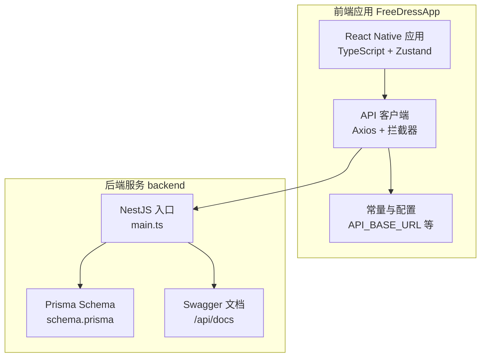
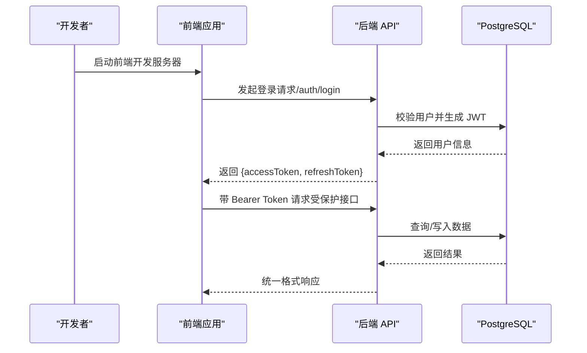
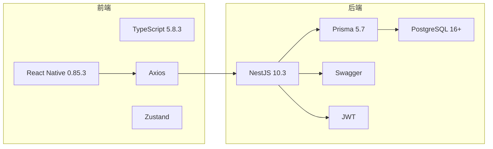

# 快速开始

<cite>
**本文引用的文件**
- [FreeDressApp/package.json](file://FreeDressApp/package.json)
- [FreeDressApp/README.md](file://FreeDressApp/README.md)
- [FreeDressApp/app.json](file://FreeDressApp/app.json)
- [FreeDressApp/ios/Podfile](file://FreeDressApp/ios/Podfile)
- [FreeDressApp/android/build.gradle](file://FreeDressApp/android/build.gradle)
- [FreeDressApp/src/constants/index.ts](file://FreeDressApp/src/constants/index.ts)
- [FreeDressApp/src/api/axios.ts](file://FreeDressApp/src/api/axios.ts)
- [FreeDressApp/babel.config.js](file://FreeDressApp/babel.config.js)
- [FreeDressApp/tsconfig.json](file://FreeDressApp/tsconfig.json)
- [FreeDressApp/metro.config.js](file://FreeDressApp/metro.config.js)
- [backend/package.json](file://backend/package.json)
- [backend/README.md](file://backend/README.md)
- [backend/src/main.ts](file://backend/src/main.ts)
- [backend/prisma/schema.prisma](file://backend/prisma/schema.prisma)
- [backend/tsconfig.json](file://backend/tsconfig.json)
- [PROJECT_STATUS.md](file://PROJECT_STATUS.md)
</cite>

## 目录
1. [简介](#简介)
2. [项目结构](#项目结构)
3. [核心组件](#核心组件)
4. [架构总览](#架构总览)
5. [详细组件分析](#详细组件分析)
6. [依赖分析](#依赖分析)
7. [性能考虑](#性能考虑)
8. [故障排除指南](#故障排除指南)
9. [结论](#结论)
10. [附录](#附录)

## 简介
本指南面向新手开发者，帮助你在最短时间内完成畅搭（FreeDress）项目的环境准备、后端服务安装与配置、前端应用安装与运行，并提供 API 文档访问方式与基础使用示例。项目采用前后端分离架构：后端基于 NestJS + Prisma + PostgreSQL；前端基于 React Native 0.85.3 + TypeScript。

## 项目结构
- 后端服务位于 backend 目录，提供 RESTful API，使用 Prisma 管理数据库，Swagger 提供在线文档。
- 前端应用位于 FreeDressApp 目录，使用 React Native 0.85.3、TypeScript、Zustand 状态管理等技术栈。
- 项目还包含微信小程序端 freeDressWechat（非本次快速开始重点）与设计文档 DESIGN.md 等资源。

图表来源
- [backend/src/main.ts:12-62](file://backend/src/main.ts#L12-L62)
- [backend/prisma/schema.prisma:1-132](file://backend/prisma/schema.prisma#L1-L132)
- [FreeDressApp/src/api/axios.ts:1-108](file://FreeDressApp/src/api/axios.ts#L1-L108)
- [FreeDressApp/src/constants/index.ts:8-212](file://FreeDressApp/src/constants/index.ts#L8-L212)

章节来源
- [PROJECT_STATUS.md:1-309](file://PROJECT_STATUS.md#L1-L309)

## 核心组件
- 后端入口与中间件：NestJS 应用启动、全局管道、拦截器、过滤器、CORS、Swagger 文档、全局前缀等。
- 数据库模型：Prisma 定义的用户、衣物、搭配、收藏、试穿结果等模型及索引。
- 前端 API 客户端：Axios 实例、请求/响应拦截器、Token 自动刷新、错误处理。
- 前端常量与配置：API 基础地址、主题与设计 Token、存储键名、分页配置等。

章节来源
- [backend/src/main.ts:12-62](file://backend/src/main.ts#L12-L62)
- [backend/prisma/schema.prisma:13-132](file://backend/prisma/schema.prisma#L13-L132)
- [FreeDressApp/src/api/axios.ts:12-108](file://FreeDressApp/src/api/axios.ts#L12-L108)
- [FreeDressApp/src/constants/index.ts:8-212](file://FreeDressApp/src/constants/index.ts#L8-L212)

## 架构总览
后端服务通过 NestJS 提供 REST API，前端通过 Axios 客户端发起请求并携带 JWT Token。Swagger 文档提供接口说明与在线测试能力。数据库使用 PostgreSQL，ORM 为 Prisma。

图表来源
- [backend/src/main.ts:40-59](file://backend/src/main.ts#L40-L59)
- [FreeDressApp/src/api/axios.ts:24-105](file://FreeDressApp/src/api/axios.ts#L24-L105)

## 详细组件分析

### 后端服务安装与配置
- 环境要求
  - Node.js：后端要求 Node.js >= 20.10.0；前端要求 Node.js >= 22.11.0。
  - PostgreSQL：>= 16.0。
  - npm：>= 10.0.0。
- 安装依赖
  - 在 backend 目录执行依赖安装。
- 数据库配置
  - 创建数据库 freedress。
  - 复制 .env.example 为 .env 并按需修改 DATABASE_URL、JWT_SECRET 等。
- 数据库迁移与客户端生成
  - 生成 Prisma 客户端并执行迁移。
- 启动服务
  - 开发模式（热重载）或构建后生产模式启动。
- API 文档
  - 启动后访问 http://localhost:3000/api/docs 查看 Swagger 文档。

章节来源
- [backend/README.md:57-118](file://backend/README.md#L57-L118)
- [backend/README.md:113-118](file://backend/README.md#L113-L118)
- [backend/README.md:100-109](file://backend/README.md#L100-L109)
- [backend/README.md:63-98](file://backend/README.md#L63-L98)
- [backend/package.json:8-25](file://backend/package.json#L8-L25)
- [backend/prisma/schema.prisma:8-11](file://backend/prisma/schema.prisma#L8-L11)

### 前端应用安装与配置
- 环境要求
  - Node.js >= 22.11.0。
  - JDK 17（Android）。
  - Xcode >= 15（iOS）。
  - Android Studio（Android）。
- 安装依赖
  - 在 FreeDressApp 目录执行依赖安装。
- iOS 配置
  - 使用 bundle 安装 CocoaPods 并执行 pod install。
- 启动开发服务器
  - 启动 Metro 服务器，分别运行 Android 或 iOS 应用。
- API 配置
  - 在 src/constants/index.ts 中配置 API_BASE_URL，默认指向本地后端。
  - 在 src/api/axios.ts 中设置请求拦截器自动注入 Bearer Token，并在 401 时尝试刷新 Token。

章节来源
- [FreeDressApp/README.md:51-84](file://FreeDressApp/README.md#L51-L84)
- [FreeDressApp/README.md:175-182](file://FreeDressApp/README.md#L175-L182)
- [FreeDressApp/package.json:53-56](file://FreeDressApp/package.json#L53-L56)
- [FreeDressApp/ios/Podfile:1-35](file://FreeDressApp/ios/Podfile#L1-L35)
- [FreeDressApp/src/constants/index.ts:8-9](file://FreeDressApp/src/constants/index.ts#L8-L9)
- [FreeDressApp/src/api/axios.ts:12-18](file://FreeDressApp/src/api/axios.ts#L12-L18)

### API 文档与基本使用示例
- API 文档
  - 启动后端服务，访问 http://localhost:3000/api/docs。
- 基本使用示例
  - 登录获取 Token。
  - 使用 Token 访问受保护接口。
- 前后端接口映射
  - 项目状态文档列出前后端接口对应关系，确保调用路径一致。

章节来源
- [backend/README.md:113-118](file://backend/README.md#L113-L118)
- [backend/README.md:235-246](file://backend/README.md#L235-L246)
- [PROJECT_STATUS.md:125-154](file://PROJECT_STATUS.md#L125-L154)

## 依赖分析
- 前端依赖
  - React Native 0.85.3、TypeScript 5.8.3、Zustand、Axios、导航与动画等。
  - React Native CLI 版本与引擎要求 Node.js >= 22.11.0。
- 后端依赖
  - NestJS 10.3、Prisma 5.7、PostgreSQL 16+、Swagger、JWT、bcryptjs 等。
  - TypeScript 5.3.3，严格装饰器与元数据配置。
- 平台构建配置
  - Android：compileSdk/targetSdk/minSdk、Kotlin 版本、Gradle 插件。
  - iOS：Podfile 使用 prepare_react_native_project! 与 react_native_pods.rb。

图表来源
- [FreeDressApp/package.json:12-31](file://FreeDressApp/package.json#L12-L31)
- [FreeDressApp/package.json:32-52](file://FreeDressApp/package.json#L32-L52)
- [backend/package.json:26-45](file://backend/package.json#L26-L45)
- [backend/package.json:46-72](file://backend/package.json#L46-L72)
- [backend/tsconfig.json:3-31](file://backend/tsconfig.json#L3-L31)
- [FreeDressApp/tsconfig.json:1-9](file://FreeDressApp/tsconfig.json#L1-L9)

章节来源
- [FreeDressApp/package.json:12-56](file://FreeDressApp/package.json#L12-L56)
- [backend/package.json:26-90](file://backend/package.json#L26-L90)
- [FreeDressApp/android/build.gradle:1-22](file://FreeDressApp/android/build.gradle#L1-L22)
- [FreeDressApp/ios/Podfile:8-9](file://FreeDressApp/ios/Podfile#L8-L9)

## 性能考虑
- 前端
  - 使用 Shopify Flash List 优化长列表渲染。
  - 使用 Reanimated 与 Worklets 提升动画性能。
  - 合理使用缓存与懒加载策略。
- 后端
  - Prisma 模型已定义索引（如用户 ID、分类），注意在高频查询字段上保持索引。
  - 使用分页参数避免一次性返回大量数据。
  - 建议引入限流与日志系统以提升稳定性与可观测性。
- 网络
  - Axios 默认超时与重试策略可根据需要增强。
  - 弱网场景建议增加骨架屏与空状态提示。

## 故障排除指南
- 启动后端服务报错
  - 检查 DATABASE_URL 是否正确指向本地 PostgreSQL 实例。
  - 确认已执行 prisma:generate 与 prisma:migrate。
  - 确保环境变量 JWT_SECRET 等已配置。
- 前端无法连接后端
  - 确认 API_BASE_URL 指向正确的后端地址（默认为本机地址）。
  - 若使用模拟器/真机，确保网络可达。
- iOS 构建失败
  - 执行 bundle install 与 pod install，确保 Xcode 15+。
  - 清理 DerivedData 并重新构建。
- Android 构建失败
  - 确认 JDK 17、compileSdk/targetSdk/minSdk 配置正确。
  - 同步 Gradle 与 Kotlin 版本。
- 401 未授权
  - 检查 Token 是否过期，前端会自动刷新；若失败则需重新登录。
  - 确认 Authorization 头是否正确附加 Bearer Token。

章节来源
- [backend/README.md:77-98](file://backend/README.md#L77-L98)
- [FreeDressApp/src/constants/index.ts:8-9](file://FreeDressApp/src/constants/index.ts#L8-L9)
- [FreeDressApp/src/api/axios.ts:54-98](file://FreeDressApp/src/api/axios.ts#L54-L98)
- [FreeDressApp/README.md:65-71](file://FreeDressApp/README.md#L65-L71)
- [FreeDressApp/android/build.gradle:2-9](file://FreeDressApp/android/build.gradle#L2-L9)

## 结论
按照本指南，你可以完成畅搭项目的环境准备、后端服务安装与数据库迁移、前端应用安装与运行，并通过 Swagger 文档快速了解 API。建议在开发过程中关注前后端接口一致性与数据模型完整性，逐步完善 AI 试穿与智能推荐等核心功能。

## 附录
- 快速命令清单
  - 后端：安装依赖、生成 Prisma 客户端、执行迁移、启动开发服务器。
  - 前端：安装依赖、iOS CocoaPods 安装、启动 Metro、运行 Android/iOS。
- 常见问题
  - 环境版本不匹配、数据库连接失败、Token 刷新失败、iOS/Android 构建失败等。

章节来源
- [backend/README.md:63-109](file://backend/README.md#L63-L109)
- [FreeDressApp/README.md:58-84](file://FreeDressApp/README.md#L58-L84)