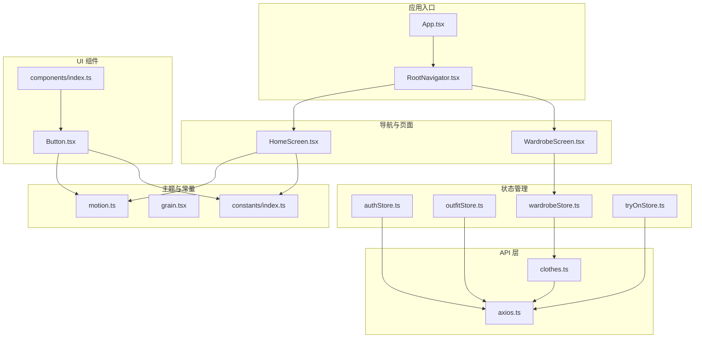
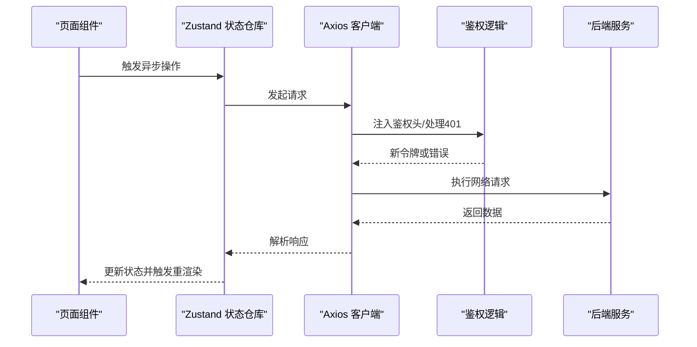
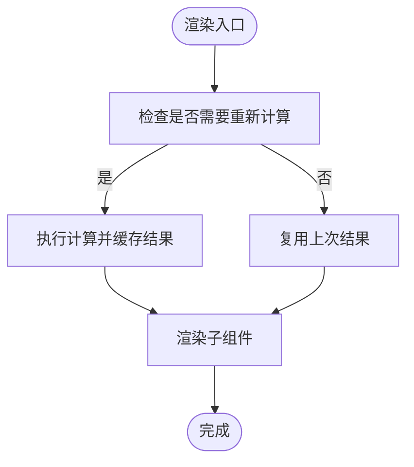
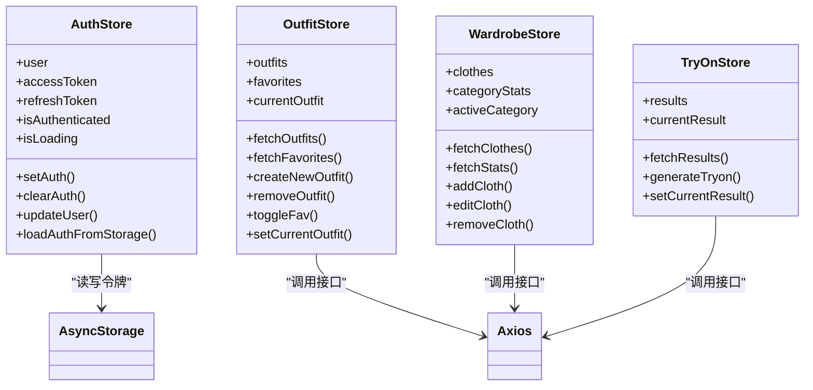
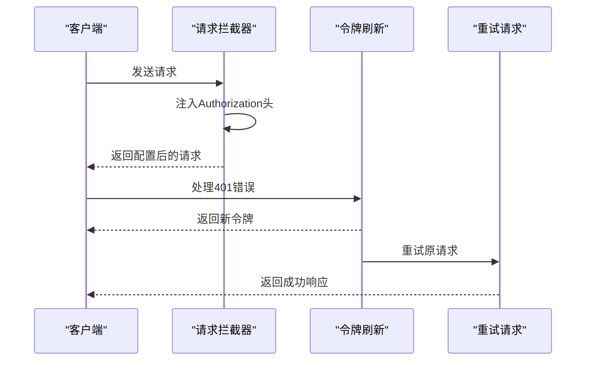
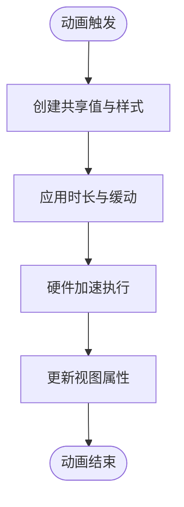
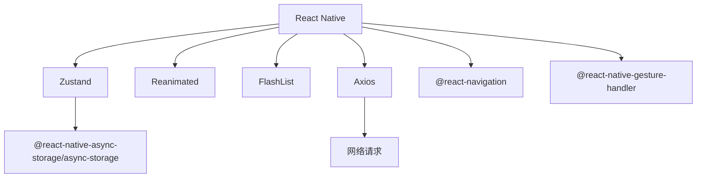

# 前端性能优化

<cite>
**本文档引用的文件**
- [package.json](file://FreeDressApp/package.json)
- [metro.config.js](file://FreeDressApp/metro.config.js)
- [App.tsx](file://FreeDressApp/src/App.tsx)
- [RootNavigator.tsx](file://FreeDressApp/src/navigation/RootNavigator.tsx)
- [axios.ts](file://FreeDressApp/src/api/axios.ts)
- [clothes.ts](file://FreeDressApp/src/api/clothes.ts)
- [authStore.ts](file://FreeDressApp/src/store/authStore.ts)
- [outfitStore.ts](file://FreeDressApp/src/store/outfitStore.ts)
- [wardrobeStore.ts](file://FreeDressApp/src/store/wardrobeStore.ts)
- [tryOnStore.ts](file://FreeDressApp/src/store/tryOnStore.ts)
- [Button.tsx](file://FreeDressApp/src/components/Button.tsx)
- [index.ts](file://FreeDressApp/src/components/index.ts)
- [HomeScreen.tsx](file://FreeDressApp/src/screens/HomeScreen.tsx)
- [WardrobeScreen.tsx](file://FreeDressApp/src/screens/WardrobeScreen.tsx)
- [motion.ts](file://FreeDressApp/src/theme/motion.ts)
- [grain.tsx](file://FreeDressApp/src/theme/grain.tsx)
- [index.ts](file://FreeDressApp/src/constants/index.ts)
</cite>

## 目录
1. [简介](#简介)
2. [项目结构](#项目结构)
3. [核心组件](#核心组件)
4. [架构总览](#架构总览)
5. [详细组件分析](#详细组件分析)
6. [依赖关系分析](#依赖关系分析)
7. [性能考量](#性能考量)
8. [故障排查指南](#故障排查指南)
9. [结论](#结论)
10. [附录](#附录)

## 简介
本指南面向畅搭(FreeDress) React Native 应用的前端性能优化，聚焦以下方面：
- 组件渲染优化：减少不必要的重渲染、合理使用状态与计算属性
- 内存管理最佳实践：避免内存泄漏、及时释放动画资源、谨慎使用大对象
- 状态管理优化：Zustand 的高效使用、跨域状态同步与持久化
- API 客户端性能配置：请求超时、重试与鉴权自动续期
- 动画与过渡：Reanimated 硬件加速与帧率控制
- 图片加载与缓存：懒加载、预加载与内存回收
- 滚动性能：FlatList 虚拟化与 FlatList 替代方案
- AsyncStorage 性能使用：批量读写与去抖策略
- 性能监控与调试：React DevTools、Flipper、Profiler 等工具

## 项目结构
应用采用按功能模块划分的组织方式，核心目录与职责如下：
- src/api：统一的 Axios 客户端与各业务 API 模块
- src/store：Zustand 状态仓库，按领域拆分
- src/components：可复用 UI 组件库
- src/screens：页面级组件
- src/navigation：导航容器与主题配置
- src/theme：动效与设计系统
- src/constants：全局常量与设计 Token
- FreeDressApp：RN 应用入口与构建配置

**图表来源**
- [App.tsx:1-28](file://FreeDressApp/src/App.tsx#L1-L28)
- [RootNavigator.tsx:1-95](file://FreeDressApp/src/navigation/RootNavigator.tsx#L1-L95)
- [HomeScreen.tsx:1-606](file://FreeDressApp/src/screens/HomeScreen.tsx#L1-L606)
- [WardrobeScreen.tsx:1-423](file://FreeDressApp/src/screens/WardrobeScreen.tsx#L1-L423)
- [authStore.ts:1-123](file://FreeDressApp/src/store/authStore.ts#L1-L123)
- [outfitStore.ts:1-90](file://FreeDressApp/src/store/outfitStore.ts#L1-L90)
- [wardrobeStore.ts:1-83](file://FreeDressApp/src/store/wardrobeStore.ts#L1-L83)
- [tryOnStore.ts:1-59](file://FreeDressApp/src/store/tryOnStore.ts#L1-L59)
- [axios.ts:1-108](file://FreeDressApp/src/api/axios.ts#L1-L108)
- [clothes.ts:1-54](file://FreeDressApp/src/api/clothes.ts#L1-L54)
- [Button.tsx:1-201](file://FreeDressApp/src/components/Button.tsx#L1-L201)
- [motion.ts:1-32](file://FreeDressApp/src/theme/motion.ts#L1-L32)
- [grain.tsx:1-78](file://FreeDressApp/src/theme/grain.tsx#L1-L78)
- [index.ts:1-212](file://FreeDressApp/src/constants/index.ts#L1-L212)

**章节来源**
- [App.tsx:1-28](file://FreeDressApp/src/App.tsx#L1-L28)
- [RootNavigator.tsx:1-95](file://FreeDressApp/src/navigation/RootNavigator.tsx#L1-L95)
- [package.json:1-57](file://FreeDressApp/package.json#L1-L57)
- [metro.config.js:1-12](file://FreeDressApp/metro.config.js#L1-L12)

## 核心组件
- 应用根组件与手势容器：在根组件中包裹手势处理器与安全区域提供者，保证全局交互与布局一致性
- 导航容器：集中管理主题与屏幕栈，按登录状态动态切换主内容与登录流程
- API 客户端：统一基地址、超时、请求头；自动注入鉴权头；处理 401 自动刷新与错误提示
- 状态仓库：使用 Zustand 管理认证、搭配、衣橱、试穿等状态，支持异步操作与本地持久化
- UI 组件：Button 等组件结合 Reanimated 实现快速过渡与按压反馈，提升交互流畅度

**章节来源**
- [App.tsx:1-28](file://FreeDressApp/src/App.tsx#L1-L28)
- [RootNavigator.tsx:1-95](file://FreeDressApp/src/navigation/RootNavigator.tsx#L1-L95)
- [axios.ts:1-108](file://FreeDressApp/src/api/axios.ts#L1-L108)
- [authStore.ts:1-123](file://FreeDressApp/src/store/authStore.ts#L1-L123)
- [Button.tsx:1-201](file://FreeDressApp/src/components/Button.tsx#L1-L201)

## 架构总览
应用采用“导航容器 + 页面组件 + 状态仓库 + API 客户端”的分层架构。页面通过状态仓库发起 API 请求，API 客户端负责统一的网络配置与鉴权续期；UI 组件通过 Reanimated 提升动画性能。

**图表来源**
- [axios.ts:1-108](file://FreeDressApp/src/api/axios.ts#L1-L108)
- [authStore.ts:1-123](file://FreeDressApp/src/store/authStore.ts#L1-L123)
- [outfitStore.ts:1-90](file://FreeDressApp/src/store/outfitStore.ts#L1-L90)
- [wardrobeStore.ts:1-83](file://FreeDressApp/src/store/wardrobeStore.ts#L1-L83)
- [tryOnStore.ts:1-59](file://FreeDressApp/src/store/tryOnStore.ts#L1-L59)

## 详细组件分析

### 组件渲染优化
- 合理使用 useMemo/useCallback：在 WardrobeScreen 中对过滤逻辑进行 memo 化，避免每次渲染都重新计算
- 控制状态作用域：将仅局部使用的状态放入子组件内部，减少父组件重渲染影响范围
- 避免内联回调与对象字面量：在 FlatList 的 renderItem 中传递稳定引用，减少子组件重渲染
- 使用浅比较：Zustand 默认浅比较，避免不必要的深层比较开销

**图表来源**
- [WardrobeScreen.tsx:61-76](file://FreeDressApp/src/screens/WardrobeScreen.tsx#L61-L76)

**章节来源**
- [WardrobeScreen.tsx:61-76](file://FreeDressApp/src/screens/WardrobeScreen.tsx#L61-L76)

### 内存管理最佳实践
- 动画资源释放：在组件卸载时停止动画，避免后台持续运行导致内存增长
- 大对象与图片：避免在状态中存储大体积数据，必要时使用本地路径或流式处理
- 事件监听清理：确保在 useEffect cleanup 中移除定时器、订阅与监听器
- 图片内存：使用合适的尺寸与格式，及时释放不再使用的图片资源

### 状态管理优化（Zustand）
- 分离关注点：将认证、搭配、衣橱、试穿分别维护独立 store，降低耦合
- 批量更新：在一次回调中合并多个 set 调用，减少重渲染次数
- 异步操作封装：将 API 调用封装在 store 方法中，保持 UI 与数据逻辑分离
- 持久化策略：使用 AsyncStorage 进行轻量级持久化，注意批量读写与错误处理

**图表来源**
- [authStore.ts:1-123](file://FreeDressApp/src/store/authStore.ts#L1-L123)
- [outfitStore.ts:1-90](file://FreeDressApp/src/store/outfitStore.ts#L1-L90)
- [wardrobeStore.ts:1-83](file://FreeDressApp/src/store/wardrobeStore.ts#L1-L83)
- [tryOnStore.ts:1-59](file://FreeDressApp/src/store/tryOnStore.ts#L1-L59)

**章节来源**
- [authStore.ts:1-123](file://FreeDressApp/src/store/authStore.ts#L1-L123)
- [outfitStore.ts:1-90](file://FreeDressApp/src/store/outfitStore.ts#L1-L90)
- [wardrobeStore.ts:1-83](file://FreeDressApp/src/store/wardrobeStore.ts#L1-L83)
- [tryOnStore.ts:1-59](file://FreeDressApp/src/store/tryOnStore.ts#L1-L59)

### API 客户端性能配置
- 请求超时：设置合理的超时时间，避免长时间阻塞 UI
- 鉴权续期：在响应拦截器中处理 401，自动刷新令牌并重试原请求
- 错误处理：统一解析错误消息，避免未处理异常导致崩溃
- 请求头与基础配置：统一 Content-Type 与基础 URL，减少重复配置

**图表来源**
- [axios.ts:12-18](file://FreeDressApp/src/api/axios.ts#L12-L18)
- [axios.ts:24-38](file://FreeDressApp/src/api/axios.ts#L24-L38)
- [axios.ts:44-105](file://FreeDressApp/src/api/axios.ts#L44-L105)

**章节来源**
- [axios.ts:1-108](file://FreeDressApp/src/api/axios.ts#L1-L108)
- [clothes.ts:1-54](file://FreeDressApp/src/api/clothes.ts#L1-L54)

### 动画与过渡效果优化
- 使用 Reanimated：将动画逻辑放在工作线程，利用硬件加速提升帧率
- 统一时长与曲线：通过主题配置统一过渡时长与缓动函数，保证一致性
- 按需动画：仅对关键元素应用动画，避免过度动画造成掉帧
- 压力测试：在低端设备上验证动画性能，必要时降低复杂度

**图表来源**
- [Button.tsx:64-78](file://FreeDressApp/src/components/Button.tsx#L64-L78)
- [motion.ts:1-32](file://FreeDressApp/src/theme/motion.ts#L1-L32)

**章节来源**
- [Button.tsx:1-201](file://FreeDressApp/src/components/Button.tsx#L1-L201)
- [motion.ts:1-32](file://FreeDressApp/src/theme/motion.ts#L1-L32)

### 图片加载与缓存优化
- 懒加载：仅在可见区域加载图片，减少初始渲染压力
- 预加载：对即将出现的图片提前发起请求，缩短等待时间
- 缓存策略：利用系统缓存与本地缓存，避免重复下载
- 内存回收：及时释放不再使用的图片资源，防止内存泄漏
- 组件选择：优先使用原生 Image 组件，配合合适的尺寸与格式

**章节来源**
- [WardrobeScreen.tsx:279-283](file://FreeDressApp/src/screens/WardrobeScreen.tsx#L279-L283)

### 滚动性能优化
- 使用 FlatList：对长列表使用虚拟化，仅渲染可视区域
- 正确的 keyExtractor：确保唯一性与稳定性，避免重排
- 减少行内样式：将样式提取到外部，避免每次渲染创建新对象
- 避免深层嵌套：简化行内布局，减少测量与绘制成本
- 替代方案：对于少量静态项，使用 ScrollView + FlatList 混合策略

**章节来源**
- [HomeScreen.tsx:240-250](file://FreeDressApp/src/screens/HomeScreen.tsx#L240-L250)

### AsyncStorage 性能使用指南
- 批量读写：使用 multiSet/multiGet/multiRemove 减少 IO 次数
- 去抖策略：对频繁更新的状态进行去抖，避免抖动写入
- 错误处理：捕获异常并降级处理，保证应用稳定性
- 数据瘦身：仅存储必要字段，避免存储大对象

**章节来源**
- [authStore.ts:52-56](file://FreeDressApp/src/store/authStore.ts#L52-L56)
- [authStore.ts:73-77](file://FreeDressApp/src/store/authStore.ts#L73-L77)
- [authStore.ts:99-103](file://FreeDressApp/src/store/authStore.ts#L99-L103)
- [authStore.ts:117-121](file://FreeDressApp/src/store/authStore.ts#L117-L121)

## 依赖关系分析
- 核心依赖：React Native、Zustand、Axios、Reanimated、FlashList
- 构建配置：Metro 默认配置，无需额外定制
- 导航与手势：React Navigation + Gesture Handler
- 图标与平台：Vector Icons + 平台字体

**图表来源**
- [package.json:12-30](file://FreeDressApp/package.json#L12-L30)

**章节来源**
- [package.json:1-57](file://FreeDressApp/package.json#L1-L57)
- [metro.config.js:1-12](file://FreeDressApp/metro.config.js#L1-L12)

## 性能考量
- 构建与打包：使用 Metro 默认配置，确保生产包最小化
- 代码分割：按路由拆分代码，减少首屏加载体积
- 资源优化：压缩图片、使用矢量图标、按需引入模块
- 网络优化：合理设置超时与重试，避免并发风暴
- 动画帧率：控制动画数量与时长，确保 60fps
- 内存占用：定期检查内存泄漏，优化大对象与图片处理

## 故障排查指南
- 网络请求失败：检查 API 基础地址、超时设置与错误处理逻辑
- 鉴权失效：确认令牌刷新流程与本地存储状态
- 动画卡顿：减少动画层级与复杂度，启用硬件加速
- 列表渲染慢：检查 FlatList 配置与行内样式
- 存储异常：捕获 AsyncStorage 异常并降级处理

**章节来源**
- [axios.ts:49-104](file://FreeDressApp/src/api/axios.ts#L49-L104)
- [authStore.ts:117-121](file://FreeDressApp/src/store/authStore.ts#L117-L121)
- [HomeScreen.tsx:240-250](file://FreeDressApp/src/screens/HomeScreen.tsx#L240-L250)

## 结论
通过合理的组件渲染策略、状态管理与 API 客户端配置，结合动画与图片优化、滚动性能与存储最佳实践，可以显著提升畅搭应用的用户体验。建议持续使用性能监控工具进行回归测试，确保在不同设备上的稳定性与流畅性。

## 附录
- 开发与调试工具：React DevTools、Flipper、React Native Profiler
- 性能指标：FPS、内存占用、启动时间、首屏渲染时间
- 最佳实践清单：避免内联样式、使用虚拟化、批量化存储、硬件加速动画