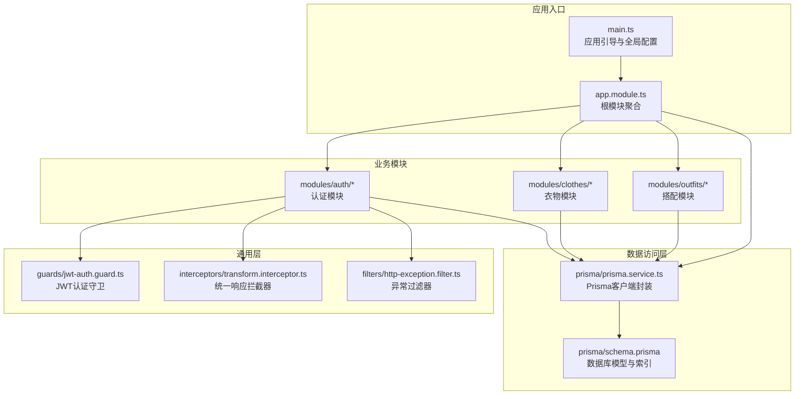
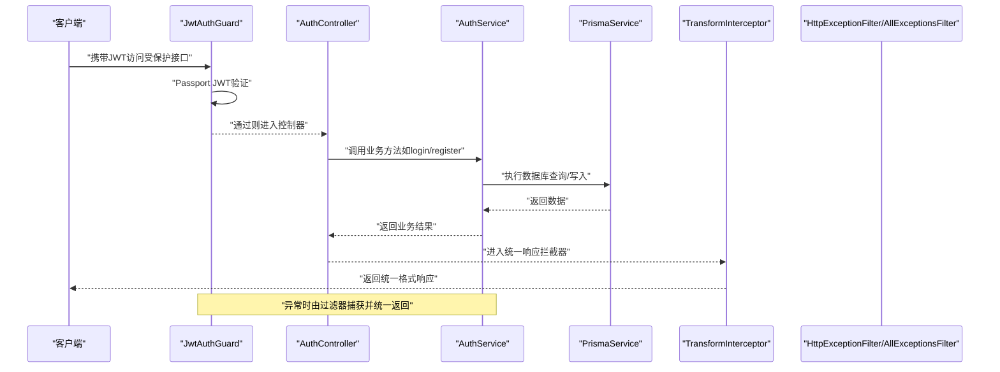
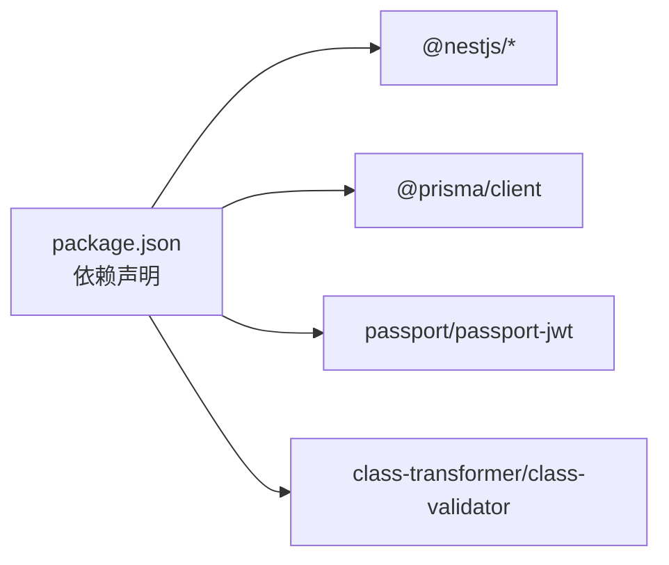

# 后端性能优化

<cite>
**本文引用的文件**
- [main.ts](file://backend/src/main.ts)
- [app.module.ts](file://backend/src/app.module.ts)
- [schema.prisma](file://backend/prisma/schema.prisma)
- [package.json](file://backend/package.json)
- [transform.interceptor.ts](file://backend/src/common/interceptors/transform.interceptor.ts)
- [jwt-auth.guard.ts](file://backend/src/common/guards/jwt-auth.guard.ts)
- [jwt.strategy.ts](file://backend/src/modules/auth/strategies/jwt.strategy.ts)
- [auth.service.ts](file://backend/src/modules/auth/auth.service.ts)
- [prisma.service.ts](file://backend/src/prisma/prisma.service.ts)
- [http-exception.filter.ts](file://backend/src/common/filters/http-exception.filter.ts)
- [auth.controller.ts](file://backend/src/modules/auth/auth.controller.ts)
- [clothes.service.ts](file://backend/src/modules/clothes/clothes.service.ts)
- [outfits.service.ts](file://backend/src/modules/outfits/outfits.service.ts)
</cite>

## 目录
1. [简介](#简介)
2. [项目结构](#项目结构)
3. [核心组件](#核心组件)
4. [架构总览](#架构总览)
5. [详细组件分析](#详细组件分析)
6. [依赖分析](#依赖分析)
7. [性能考虑](#性能考虑)
8. [故障排查指南](#故障排查指南)
9. [结论](#结论)
10. [附录](#附录)

## 简介
本指南面向畅搭(FreeDress)项目的后端性能优化，聚焦于NestJS应用在中间件与拦截器、数据库查询、JWT认证、API响应时间、并发与异步、缓存策略以及负载均衡与水平扩展等方面的优化建议。文档基于仓库现有代码进行分析，并结合最佳实践给出可落地的优化方案。

## 项目结构
后端采用NestJS标准分层结构：模块化功能划分、统一的拦截器与过滤器、Prisma ORM、Swagger文档与静态资源服务。整体结构清晰，便于按模块进行性能优化与治理。

**图表来源**
- [main.ts:12-59](file://backend/src/main.ts#L12-L59)
- [app.module.ts:13-31](file://backend/src/app.module.ts#L13-L31)
- [prisma.service.ts:8-26](file://backend/src/prisma/prisma.service.ts#L8-L26)
- [schema.prisma:14-131](file://backend/prisma/schema.prisma#L14-L131)

**章节来源**
- [main.ts:12-59](file://backend/src/main.ts#L12-L59)
- [app.module.ts:13-31](file://backend/src/app.module.ts#L13-L31)

## 核心组件
- 应用引导与全局配置：统一验证管道、全局拦截器、全局过滤器、CORS、API前缀、Swagger文档。
- 数据库层：Prisma客户端封装，自动连接与断开；数据库模型定义与索引策略。
- 认证体系：JWT守卫与策略，认证服务负责Token签发与用户校验。
- 业务模块：衣物与搭配模块的服务层，包含查询、写入与统计逻辑。
- 异常处理：HTTP异常与全局异常过滤器，统一错误响应格式。

**章节来源**
- [main.ts:15-48](file://backend/src/main.ts#L15-L48)
- [prisma.service.ts:8-26](file://backend/src/prisma/prisma.service.ts#L8-L26)
- [schema.prisma:14-131](file://backend/prisma/schema.prisma#L14-L131)
- [jwt-auth.guard.ts:8-21](file://backend/src/common/guards/jwt-auth.guard.ts#L8-L21)
- [jwt.strategy.ts:10-38](file://backend/src/modules/auth/strategies/jwt.strategy.ts#L10-L38)
- [auth.service.ts:23-37](file://backend/src/modules/auth/auth.service.ts#L23-L37)
- [clothes.service.ts:11-147](file://backend/src/modules/clothes/clothes.service.ts#L11-L147)
- [outfits.service.ts:5-122](file://backend/src/modules/outfits/outfits.service.ts#L5-L122)
- [http-exception.filter.ts:8-80](file://backend/src/common/filters/http-exception.filter.ts#L8-L80)

## 架构总览
下图展示请求从进入应用到返回响应的关键路径，包括中间件、拦截器、守卫、服务与数据库交互。

**图表来源**
- [jwt-auth.guard.ts:8-21](file://backend/src/common/guards/jwt-auth.guard.ts#L8-L21)
- [auth.controller.ts:18-91](file://backend/src/modules/auth/auth.controller.ts#L18-L91)
- [auth.service.ts:102-135](file://backend/src/modules/auth/auth.service.ts#L102-L135)
- [prisma.service.ts:8-26](file://backend/src/prisma/prisma.service.ts#L8-L26)
- [transform.interceptor.ts:19-31](file://backend/src/common/interceptors/transform.interceptor.ts#L19-L31)
- [http-exception.filter.ts:8-80](file://backend/src/common/filters/http-exception.filter.ts#L8-L80)

## 详细组件分析

### 中间件与拦截器性能影响分析
- 全局验证管道：启用白名单、禁止非白名单字段、自动类型转换，减少脏数据进入业务层，降低后续处理成本。
- 统一响应拦截器：对所有响应统一封装，避免重复样板代码，但需注意对大对象序列化的额外开销。
- 全局异常过滤器：集中处理异常，避免异常穿透导致的不可预期开销与状态码混乱。

优化建议
- 在拦截器中避免对超大数据集进行深度克隆或复杂计算。
- 对响应体进行必要裁剪，仅返回前端所需字段。
- 将耗时操作移至异步任务队列，避免阻塞主请求线程。

**章节来源**
- [main.ts:15-29](file://backend/src/main.ts#L15-L29)
- [transform.interceptor.ts:19-31](file://backend/src/common/interceptors/transform.interceptor.ts#L19-L31)
- [http-exception.filter.ts:8-80](file://backend/src/common/filters/http-exception.filter.ts#L8-L80)

### 数据库查询优化与索引策略
- 模型与索引
  - 用户表：唯一索引(phone)，适合登录场景快速定位用户。
  - 衣物表：复合索引(userId, category)，支持按用户与分类查询。
  - 搭配表：索引(userId)，支持用户维度查询。
  - 试穿结果表：索引(userId, outfitId)，支持用户与搭配维度查询。
- 查询模式
  - 衣物模块：按用户ID分页/排序查询，建议配合分页参数与选择性字段。
  - 搭配模块：包含关联数据与计数，注意只select必要字段，避免N+1问题。
  - 统计查询：使用groupBy与_count聚合，减少多次往返。

优化建议
- 为高频查询字段建立合适索引，避免全表扫描。
- 使用select精确字段，避免*查询。
- 对复杂查询使用事务批处理，减少网络往返。
- 合理使用游标分页或偏移分页，避免深层offset导致的性能退化。

**章节来源**
- [schema.prisma:14-131](file://backend/prisma/schema.prisma#L14-L131)
- [clothes.service.ts:38-51](file://backend/src/modules/clothes/clothes.service.ts#L38-L51)
- [outfits.service.ts:35-47](file://backend/src/modules/outfits/outfits.service.ts#L35-L47)

### JWT认证性能优化
- 认证流程
  - 守卫：继承AuthGuard('jwt')，验证Token有效性与过期。
  - 策略：从Authorization头提取Bearer Token，使用secretOrKey验证，validate中调用AuthService校验用户存在性。
  - 服务：签发访问与刷新Token，使用Promise.all并行生成，提升吞吐。
- 性能关注点
  - Token验证：避免在validate中执行重逻辑，尽量轻量。
  - 密钥管理：确保密钥安全与轮换策略，避免频繁变更导致的验证失败。
  - 过期策略：合理设置expiresIn，平衡安全性与用户体验。

优化建议
- 将用户信息缓存到内存或Redis，减少数据库查询。
- 对频繁访问的用户信息设置短期缓存，降低validate压力。
- 使用对称加密算法并保持密钥长度足够，避免CPU开销过大。

**章节来源**
- [jwt-auth.guard.ts:8-21](file://backend/src/common/guards/jwt-auth.guard.ts#L8-L21)
- [jwt.strategy.ts:10-38](file://backend/src/modules/auth/strategies/jwt.strategy.ts#L10-L38)
- [auth.service.ts:153-171](file://backend/src/modules/auth/auth.service.ts#L153-L171)

### API响应时间优化
- 统一响应拦截器：对所有响应统一封装，减少重复逻辑，但需控制data大小。
- DTO验证：ValidationPipe自动剔除/转换字段，减少业务层校验成本。
- Swagger文档：仅在开发环境启用，避免生产环境不必要的开销。

优化建议
- 对大对象序列化进行延迟或流式处理。
- 控制响应体大小，优先返回精简数据。
- 对静态资源使用CDN与缓存头，减轻服务器压力。

**章节来源**
- [transform.interceptor.ts:19-31](file://backend/src/common/interceptors/transform.interceptor.ts#L19-L31)
- [main.ts:15-22](file://backend/src/main.ts#L15-L22)
- [main.ts:40-48](file://backend/src/main.ts#L40-L48)

### 并发处理与异步操作最佳实践
- Promise并行：签发Token时使用Promise.all并行生成，提升吞吐。
- 错误处理：全局过滤器捕获异常，避免未处理异常导致进程不稳定。
- 数据库连接：PrismaClient生命周期管理，模块初始化时连接，销毁时断开。

优化建议
- 对I/O密集型操作使用异步await，避免阻塞事件循环。
- 合理设置超时与重试策略，防止雪崩效应。
- 对高并发场景引入限流与熔断机制。

**章节来源**
- [auth.service.ts:153-171](file://backend/src/modules/auth/auth.service.ts#L153-L171)
- [http-exception.filter.ts:50-80](file://backend/src/common/filters/http-exception.filter.ts#L50-L80)
- [prisma.service.ts:8-26](file://backend/src/prisma/prisma.service.ts#L8-L26)

### 缓存策略实施
现状
- 认证服务中使用Map存储重置令牌，定期清理过期令牌。
- 生产环境建议替换为Redis，具备持久化与集群能力。

优化建议
- Token与用户信息缓存：将validate返回的用户信息缓存短期有效，降低数据库压力。
- 查询结果缓存：对热点查询结果进行缓存，设置合理TTL与失效策略。
- 缓存一致性：写操作后主动失效相关缓存键，保证最终一致。

**章节来源**
- [auth.service.ts:25-37](file://backend/src/modules/auth/auth.service.ts#L25-L37)
- [auth.service.ts:247-254](file://backend/src/modules/auth/auth.service.ts#L247-L254)

### 负载均衡与水平扩展
- 应用层：多实例部署，共享外部状态（如Redis）与静态资源。
- 数据层：数据库读写分离、分库分表、连接池优化。
- 网关层：反向代理与健康检查，动态扩缩容。

优化建议
- 使用容器编排与自动伸缩，根据CPU/内存/请求量指标动态扩容。
- 静态资源走CDN，减少应用服务器带宽压力。
- 对会话与Token存储使用分布式缓存，避免粘性会话带来的扩展瓶颈。

## 依赖分析
后端依赖主要围绕NestJS生态与Prisma，关键依赖包括：
- @nestjs/common/config/core/platform-express：框架核心与配置
- @nestjs/swagger：API文档
- @nestjs/jwt/passport/passport-jwt：认证
- @prisma/client：ORM客户端
- class-transformer/class-validator：DTO转换与校验

**图表来源**
- [package.json:26-44](file://backend/package.json#L26-L44)

**章节来源**
- [package.json:26-44](file://backend/package.json#L26-L44)

## 性能考虑
- 中间件与拦截器
  - 保持拦截器逻辑轻量，避免在TransformInterceptor中做重型计算。
  - 对响应体进行必要的裁剪与序列化优化。
- 数据库
  - 为高频查询字段建立索引，避免全表扫描。
  - 使用select精确字段，减少网络与序列化开销。
  - 对复杂查询使用事务批处理，减少往返次数。
- 认证
  - 将用户信息缓存到Redis，缩短validate路径。
  - 合理设置Token过期时间，平衡安全与性能。
- API响应
  - 控制响应体大小，优先返回精简数据。
  - 对静态资源使用CDN与缓存头。
- 并发与异步
  - 使用Promise.all并行处理，提升吞吐。
  - 设置超时与重试策略，防止雪崩。
- 缓存
  - 使用Redis作为分布式缓存，设置合理的TTL与失效策略。
  - 写操作后主动失效相关缓存键。
- 负载均衡与扩展
  - 多实例部署，共享Redis与静态资源。
  - 反向代理与健康检查，动态扩缩容。

## 故障排查指南
- 异常统一处理
  - HttpExceptionFilter：针对HttpException统一返回，包含状态码、消息、时间戳与路径。
  - AllExceptionsFilter：捕获未处理异常，返回服务器内部错误。
- 排查步骤
  - 开启开发环境日志，查看错误堆栈。
  - 检查请求路径与状态码，确认过滤器是否生效。
  - 对数据库慢查询进行分析与索引优化。

**章节来源**
- [http-exception.filter.ts:8-80](file://backend/src/common/filters/http-exception.filter.ts#L8-L80)

## 结论
通过对中间件与拦截器、数据库查询、JWT认证、API响应时间、并发与异步、缓存策略以及负载均衡与扩展的系统性优化，可以显著提升畅搭(FreeDress)后端的性能与稳定性。建议优先实施索引优化、响应体裁剪、用户信息缓存与并行处理，再逐步引入Redis缓存与水平扩展方案。

## 附录
- 部署建议
  - 使用PM2或Docker进行多实例部署，结合Nginx反向代理。
  - 将静态资源上传至CDN，减少应用服务器压力。
  - 对数据库连接池进行压测与调优，确保峰值稳定。
- 监控与可观测性
  - 添加请求耗时、错误率、缓存命中率等指标。
  - 对慢查询与异常进行告警，及时发现性能瓶颈。