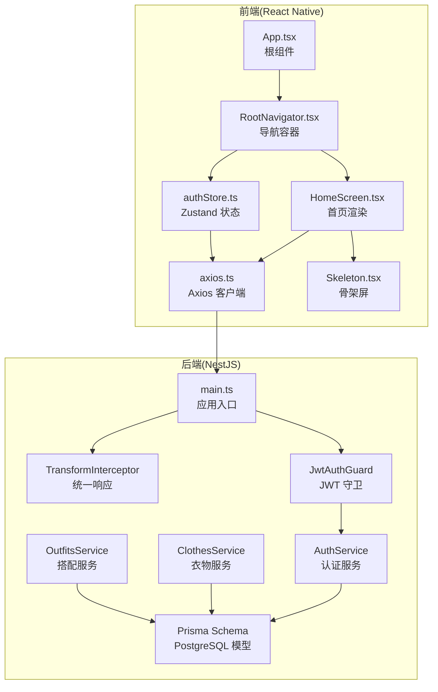
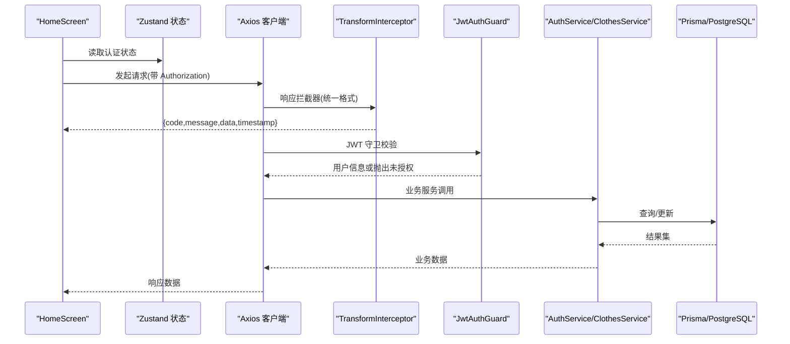
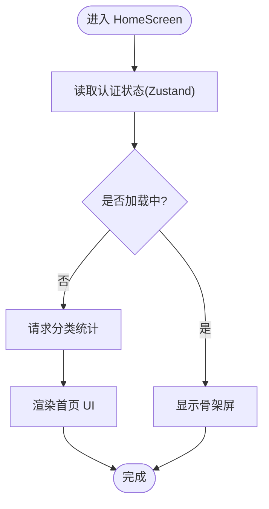
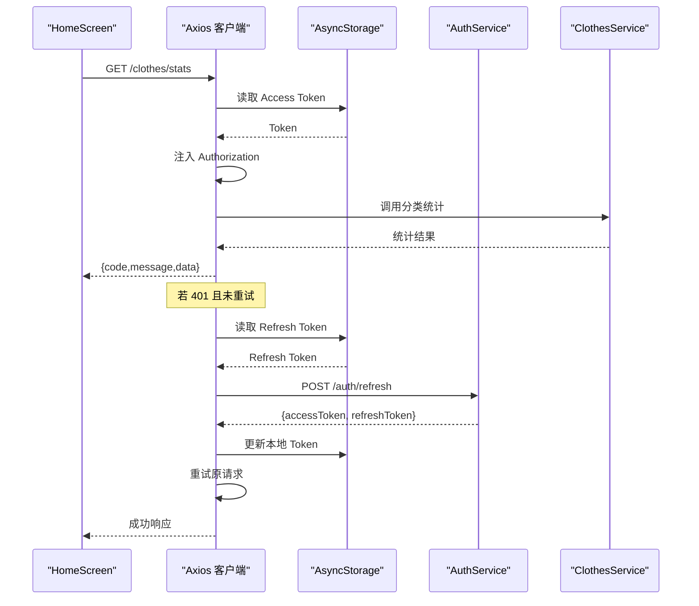
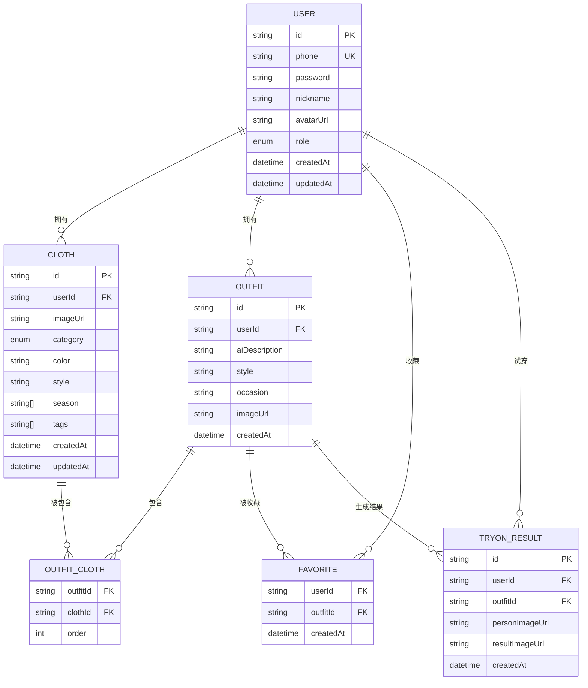
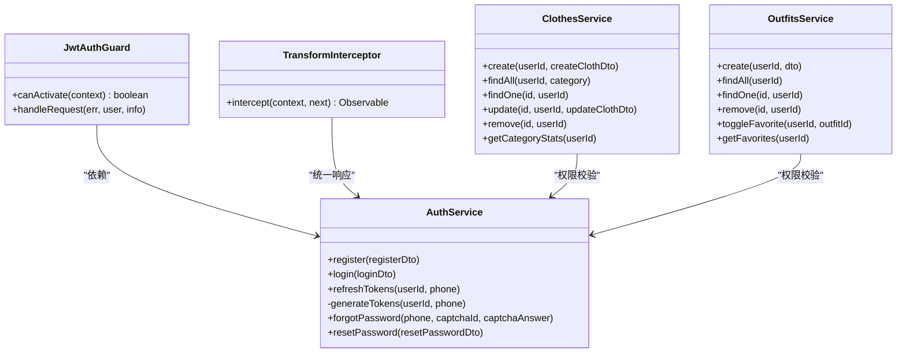
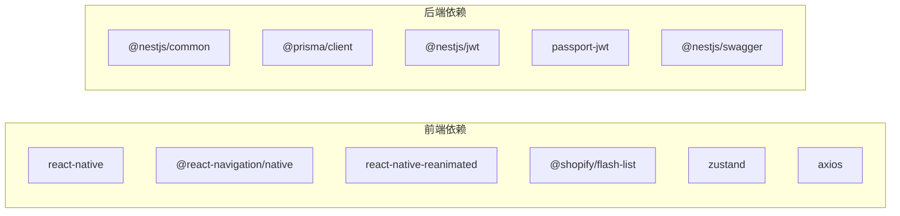

# 性能优化

<cite>
**本文引用的文件**
- [FreeDressApp/package.json](file://FreeDressApp/package.json)
- [FreeDressApp/src/App.tsx](file://FreeDressApp/src/App.tsx)
- [FreeDressApp/src/navigation/RootNavigator.tsx](file://FreeDressApp/src/navigation/RootNavigator.tsx)
- [FreeDressApp/src/store/authStore.ts](file://FreeDressApp/src/store/authStore.ts)
- [FreeDressApp/src/components/Skeleton.tsx](file://FreeDressApp/src/components/Skeleton.tsx)
- [FreeDressApp/src/screens/HomeScreen.tsx](file://FreeDressApp/src/screens/HomeScreen.tsx)
- [FreeDressApp/src/api/axios.ts](file://FreeDressApp/src/api/axios.ts)
- [backend/package.json](file://backend/package.json)
- [backend/src/main.ts](file://backend/src/main.ts)
- [backend/src/common/interceptors/transform.interceptor.ts](file://backend/src/common/interceptors/transform.interceptor.ts)
- [backend/src/common/guards/jwt-auth.guard.ts](file://backend/src/common/guards/jwt-auth.guard.ts)
- [backend/src/modules/auth/auth.service.ts](file://backend/src/modules/auth/auth.service.ts)
- [backend/src/modules/clothes/clothes.service.ts](file://backend/src/modules/clothes/clothes.service.ts)
- [backend/src/modules/outfits/outfits.service.ts](file://backend/src/modules/outfits/outfits.service.ts)
- [backend/prisma/schema.prisma](file://backend/prisma/schema.prisma)
</cite>

## 目录
1. [简介](#简介)
2. [项目结构](#项目结构)
3. [核心组件](#核心组件)
4. [架构总览](#架构总览)
5. [详细组件分析](#详细组件分析)
6. [依赖分析](#依赖分析)
7. [性能考虑](#性能考虑)
8. [故障排查指南](#故障排查指南)
9. [结论](#结论)
10. [附录](#附录)

## 简介
本指南面向畅搭(FreeDress)项目的前端与后端团队，系统性梳理性能优化策略，覆盖以下方面：
- 前端性能：React Native 应用的渲染优化、内存管理、网络请求优化
- API 调用：请求缓存、批量请求、超时与重试、鉴权与拦截器
- 数据库查询：索引设计、查询计划分析、Prisma 使用建议、连接池配置
- 移动端最佳实践：图片加载、滚动性能、电池消耗控制
- 后端性能：NestJS 中间件与拦截器、统一响应格式、认证守卫、服务层优化
- 测试与基准：性能测试与基准测试方法
- 诊断与排障：常见问题定位与解决方案

## 项目结构
畅搭项目采用前后端分离架构：
- 前端：React Native 应用，负责 UI 导航、状态管理、网络请求与动画
- 后端：NestJS + Prisma + PostgreSQL，提供 REST API、认证与业务服务
- 微信小程序：freeDressWechat（非本次性能优化重点）

图示来源
- [FreeDressApp/src/App.tsx:1-28](file://FreeDressApp/src/App.tsx#L1-L28)
- [FreeDressApp/src/navigation/RootNavigator.tsx:1-95](file://FreeDressApp/src/navigation/RootNavigator.tsx#L1-L95)
- [FreeDressApp/src/store/authStore.ts:1-123](file://FreeDressApp/src/store/authStore.ts#L1-L123)
- [FreeDressApp/src/components/Skeleton.tsx:1-63](file://FreeDressApp/src/components/Skeleton.tsx#L1-L63)
- [FreeDressApp/src/screens/HomeScreen.tsx:1-606](file://FreeDressApp/src/screens/HomeScreen.tsx#L1-L606)
- [FreeDressApp/src/api/axios.ts:1-108](file://FreeDressApp/src/api/axios.ts#L1-L108)
- [backend/src/main.ts:1-62](file://backend/src/main.ts#L1-L62)
- [backend/src/common/interceptors/transform.interceptor.ts:1-32](file://backend/src/common/interceptors/transform.interceptor.ts#L1-L32)
- [backend/src/common/guards/jwt-auth.guard.ts:1-22](file://backend/src/common/guards/jwt-auth.guard.ts#L1-L22)
- [backend/src/modules/auth/auth.service.ts:1-279](file://backend/src/modules/auth/auth.service.ts#L1-L279)
- [backend/src/modules/clothes/clothes.service.ts:1-148](file://backend/src/modules/clothes/clothes.service.ts#L1-L148)
- [backend/src/modules/outfits/outfits.service.ts:1-123](file://backend/src/modules/outfits/outfits.service.ts#L1-L123)
- [backend/prisma/schema.prisma:1-132](file://backend/prisma/schema.prisma#L1-L132)

章节来源
- [FreeDressApp/package.json:1-57](file://FreeDressApp/package.json#L1-L57)
- [backend/package.json:1-91](file://backend/package.json#L1-L91)

## 核心组件
- 前端根组件与导航：在根组件中装配手势与安全区域，导航容器按登录状态切换页面栈，避免不必要的重渲染
- 状态管理：使用 Zustand 管理认证状态与本地持久化，减少跨层级传递与重复订阅
- 网络层：Axios 实例统一配置基础 URL、超时、请求头；拦截器注入认证令牌、处理 401 刷新、统一封装响应
- 动画与骨架屏：Reanimated 控制骨架屏 shimmer，降低首屏等待感知延迟
- 后端入口：全局管道、拦截器、过滤器、CORS、Swagger 文档与全局前缀
- 业务服务：认证、衣物、搭配服务，均通过 Prisma 访问数据库，注意权限校验与查询优化

章节来源
- [FreeDressApp/src/App.tsx:1-28](file://FreeDressApp/src/App.tsx#L1-L28)
- [FreeDressApp/src/navigation/RootNavigator.tsx:1-95](file://FreeDressApp/src/navigation/RootNavigator.tsx#L1-L95)
- [FreeDressApp/src/store/authStore.ts:1-123](file://FreeDressApp/src/store/authStore.ts#L1-L123)
- [FreeDressApp/src/api/axios.ts:1-108](file://FreeDressApp/src/api/axios.ts#L1-L108)
- [FreeDressApp/src/components/Skeleton.tsx:1-63](file://FreeDressApp/src/components/Skeleton.tsx#L1-L63)
- [backend/src/main.ts:1-62](file://backend/src/main.ts#L1-L62)

## 架构总览
前端通过 Axios 与后端交互，后端采用 NestJS 的全局中间件与拦截器统一处理请求与响应。数据库模型由 Prisma 定义，包含用户、衣物、搭配、收藏、试穿结果等实体，并建立必要的索引。

图示来源
- [FreeDressApp/src/screens/HomeScreen.tsx:100-116](file://FreeDressApp/src/screens/HomeScreen.tsx#L100-L116)
- [FreeDressApp/src/store/authStore.ts:97-121](file://FreeDressApp/src/store/authStore.ts#L97-L121)
- [FreeDressApp/src/api/axios.ts:24-105](file://FreeDressApp/src/api/axios.ts#L24-L105)
- [backend/src/common/interceptors/transform.interceptor.ts:19-31](file://backend/src/common/interceptors/transform.interceptor.ts#L19-L31)
- [backend/src/common/guards/jwt-auth.guard.ts:8-21](file://backend/src/common/guards/jwt-auth.guard.ts#L8-L21)
- [backend/src/modules/auth/auth.service.ts:102-135](file://backend/src/modules/auth/auth.service.ts#L102-L135)
- [backend/src/modules/clothes/clothes.service.ts:38-51](file://backend/src/modules/clothes/clothes.service.ts#L38-L51)

## 详细组件分析

### 前端渲染与内存优化
- 渲染路径
  - 根组件装配手势与安全区域，导航容器按登录状态切换页面栈，避免在未登录状态下渲染主内容
  - 首页使用 Animated 控制首屏元素渐显，结合骨架屏降低白屏与闪烁感知
- 内存管理
  - 使用 Zustand 替代 Redux，减少中间件与不可变数据结构开销
  - 本地存储采用异步写入，避免阻塞主线程
  - 导航器在加载完成后再渲染真实界面，避免空壳组件占用内存

图示来源
- [FreeDressApp/src/navigation/RootNavigator.tsx:42-51](file://FreeDressApp/src/navigation/RootNavigator.tsx#L42-L51)
- [FreeDressApp/src/components/Skeleton.tsx:23-44](file://FreeDressApp/src/components/Skeleton.tsx#L23-L44)
- [FreeDressApp/src/screens/HomeScreen.tsx:100-116](file://FreeDressApp/src/screens/HomeScreen.tsx#L100-L116)

章节来源
- [FreeDressApp/src/App.tsx:1-28](file://FreeDressApp/src/App.tsx#L1-L28)
- [FreeDressApp/src/navigation/RootNavigator.tsx:1-95](file://FreeDressApp/src/navigation/RootNavigator.tsx#L1-L95)
- [FreeDressApp/src/components/Skeleton.tsx:1-63](file://FreeDressApp/src/components/Skeleton.tsx#L1-L63)
- [FreeDressApp/src/store/authStore.ts:1-123](file://FreeDressApp/src/store/authStore.ts#L1-L123)
- [FreeDressApp/src/screens/HomeScreen.tsx:1-606](file://FreeDressApp/src/screens/HomeScreen.tsx#L1-L606)

### 网络请求与缓存优化
- Axios 实例
  - 基础 URL、超时、Content-Type 统一配置
  - 请求拦截器自动注入 Bearer Token
  - 响应拦截器统一返回 data 字段，简化调用方处理
  - 401 自动刷新 Token 并重试原请求，失败则清空本地认证信息
- 缓存与批处理
  - 首页分类统计仅在首次进入时请求，后续可通过本地状态复用
  - 对高频读取的列表数据建议引入内存缓存或 LRU 缓存
  - 批量请求：合并多个小请求为一次调用，减少网络往返
- 超时与重试
  - 合理设置超时时间，避免长时间阻塞 UI
  - 对幂等请求启用指数退避重试，避免雪崩效应

图示来源
- [FreeDressApp/src/api/axios.ts:24-105](file://FreeDressApp/src/api/axios.ts#L24-L105)
- [backend/src/modules/auth/auth.service.ts:143-145](file://backend/src/modules/auth/auth.service.ts#L143-L145)
- [backend/src/modules/clothes/clothes.service.ts:123-146](file://backend/src/modules/clothes/clothes.service.ts#L123-L146)

章节来源
- [FreeDressApp/src/api/axios.ts:1-108](file://FreeDressApp/src/api/axios.ts#L1-L108)
- [backend/src/modules/auth/auth.service.ts:1-279](file://backend/src/modules/auth/auth.service.ts#L1-L279)
- [backend/src/modules/clothes/clothes.service.ts:1-148](file://backend/src/modules/clothes/clothes.service.ts#L1-L148)

### 数据库查询优化
- 索引设计
  - 用户、衣物、搭配、试穿结果等模型已建立必要索引，如衣物的 userId、category，试穿记录的 userId/outfitId
- 查询计划与分页
  - 使用 orderBy + 分页参数，避免一次性拉取大量数据
  - 对高频查询字段建立复合索引，减少排序与过滤成本
- 连接池配置
  - 生产环境建议配置连接池大小、最大空闲连接、连接超时等参数，避免并发高峰下的连接争用
- 服务层优化
  - 权限校验前置，尽早拒绝非法请求
  - 使用 select 精简字段，避免 N+1 查询
  - 对多对多关系使用 include 并限制排序字段

图示来源
- [backend/prisma/schema.prisma:14-131](file://backend/prisma/schema.prisma#L14-L131)

章节来源
- [backend/prisma/schema.prisma:1-132](file://backend/prisma/schema.prisma#L1-L132)
- [backend/src/modules/clothes/clothes.service.ts:38-51](file://backend/src/modules/clothes/clothes.service.ts#L38-L51)
- [backend/src/modules/outfits/outfits.service.ts:35-47](file://backend/src/modules/outfits/outfits.service.ts#L35-L47)

### 移动端性能最佳实践
- 图片加载优化
  - 使用合适的尺寸与格式，避免超大图直接加载
  - 骨架屏与占位符配合，减少布局抖动
- 滚动性能
  - 使用 Flash List 替代 FlatList，提高长列表渲染性能
  - 避免在滚动过程中进行昂贵计算或频繁 setState
- 电池消耗控制
  - 合理使用动画时长与缓动函数，避免过度动画
  - 在后台或不活跃时减少轮询与网络请求

章节来源
- [FreeDressApp/package.json:18-29](file://FreeDressApp/package.json#L18-L29)
- [FreeDressApp/src/components/Skeleton.tsx:1-63](file://FreeDressApp/src/components/Skeleton.tsx#L1-L63)
- [FreeDressApp/src/screens/HomeScreen.tsx:240-250](file://FreeDressApp/src/screens/HomeScreen.tsx#L240-L250)

### 后端性能监控与调优
- 入口配置
  - 全局管道：白名单、禁止未知字段、类型转换
  - 全局拦截器：统一响应格式，减少重复封装
  - 全局过滤器：异常捕获与统一输出
  - CORS 与 API 前缀
- 认证与授权
  - JWT 守卫在路由层保护接口，失败抛出未授权异常
- 服务层优化
  - 认证服务中使用 Promise.all 并发生成访问与刷新 Token
  - 服务层严格权限校验与字段选择，避免泄露敏感信息

图示来源
- [backend/src/common/interceptors/transform.interceptor.ts:19-31](file://backend/src/common/interceptors/transform.interceptor.ts#L19-L31)
- [backend/src/common/guards/jwt-auth.guard.ts:8-21](file://backend/src/common/guards/jwt-auth.guard.ts#L8-L21)
- [backend/src/modules/auth/auth.service.ts:102-171](file://backend/src/modules/auth/auth.service.ts#L102-L171)
- [backend/src/modules/clothes/clothes.service.ts:21-146](file://backend/src/modules/clothes/clothes.service.ts#L21-L146)
- [backend/src/modules/outfits/outfits.service.ts:9-122](file://backend/src/modules/outfits/outfits.service.ts#L9-L122)

章节来源
- [backend/src/main.ts:12-59](file://backend/src/main.ts#L12-L59)
- [backend/src/common/interceptors/transform.interceptor.ts:1-32](file://backend/src/common/interceptors/transform.interceptor.ts#L1-L32)
- [backend/src/common/guards/jwt-auth.guard.ts:1-22](file://backend/src/common/guards/jwt-auth.guard.ts#L1-L22)
- [backend/src/modules/auth/auth.service.ts:1-279](file://backend/src/modules/auth/auth.service.ts#L1-L279)
- [backend/src/modules/clothes/clothes.service.ts:1-148](file://backend/src/modules/clothes/clothes.service.ts#L1-L148)
- [backend/src/modules/outfits/outfits.service.ts:1-123](file://backend/src/modules/outfits/outfits.service.ts#L1-L123)

## 依赖分析
- 前端依赖
  - React Native、Navigation、Reanimated、Flash List、Zustand、Axios 等
  - 通过依赖树可见渲染与网络层的关键组件
- 后端依赖
  - NestJS、Prisma、JWT、Passport、Swagger 等
  - 通过模块划分清晰，认证、衣物、搭配服务职责单一

图示来源
- [FreeDressApp/package.json:12-30](file://FreeDressApp/package.json#L12-L30)
- [backend/package.json:26-44](file://backend/package.json#L26-L44)

章节来源
- [FreeDressApp/package.json:1-57](file://FreeDressApp/package.json#L1-L57)
- [backend/package.json:1-91](file://backend/package.json#L1-L91)

## 性能考虑
- 前端
  - 使用 Reanimated 控制动画，避免 JS 线程阻塞
  - 骨架屏与懒加载结合，缩短感知加载时间
  - 状态集中管理，减少组件间重复渲染
- 网络
  - 合理超时与重试策略，避免 UI 卡顿
  - 401 自动刷新 Token，提升用户体验
- 数据库
  - 建立必要索引，避免全表扫描
  - 使用分页与字段选择，减少传输与解析开销
- 后端
  - 全局拦截器统一响应，减少重复封装
  - JWT 守卫前置校验，快速失败
  - 并发生成 Token，缩短鉴权耗时

## 故障排查指南
- 前端
  - 网络请求失败：检查 Axios 拦截器是否正确注入 Token，确认响应拦截器返回 data 字段
  - 401 未授权：确认刷新流程是否成功，本地存储是否更新
  - 首屏白屏：检查骨架屏与动画是否正常，避免在加载完成前渲染真实内容
- 后端
  - 统一响应异常：检查 TransformInterceptor 是否生效
  - JWT 未授权：确认守卫是否正确配置，Token 是否过期
  - 查询缓慢：检查索引与查询条件，使用 EXPLAIN 分析执行计划

章节来源
- [FreeDressApp/src/api/axios.ts:44-105](file://FreeDressApp/src/api/axios.ts#L44-L105)
- [backend/src/common/interceptors/transform.interceptor.ts:19-31](file://backend/src/common/interceptors/transform.interceptor.ts#L19-L31)
- [backend/src/common/guards/jwt-auth.guard.ts:8-21](file://backend/src/common/guards/jwt-auth.guard.ts#L8-L21)
- [backend/prisma/schema.prisma:56-58](file://backend/prisma/schema.prisma#L56-L58)

## 结论
通过在前端引入骨架屏与动画优化、在后端采用统一拦截器与守卫、在数据库层面完善索引与查询策略，以及在网络层实施合理的超时与重试机制，畅搭项目可在保证功能完整性的同时显著提升性能与稳定性。建议持续关注关键指标（首屏时间、API 响应时间、数据库慢查询），并结合自动化测试与基准测试进行回归验证。

## 附录
- 性能测试与基准测试方法
  - 前端：使用 React DevTools Profiler 分析组件渲染热点；Metro 构建开启生产模式对比包体与冷启动时间
  - 后端：Jest 单测覆盖关键服务方法；使用压测工具模拟高并发场景，观察响应时间与错误率
- 常见问题清单
  - 首屏加载慢：优先优化骨架屏与关键路径渲染
  - API 响应慢：检查数据库索引与查询计划，评估缓存命中率
  - 电池消耗高：减少后台网络请求与动画频率