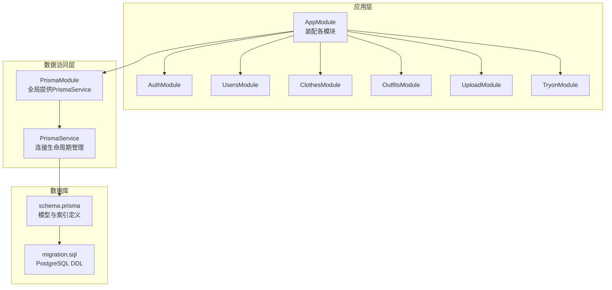
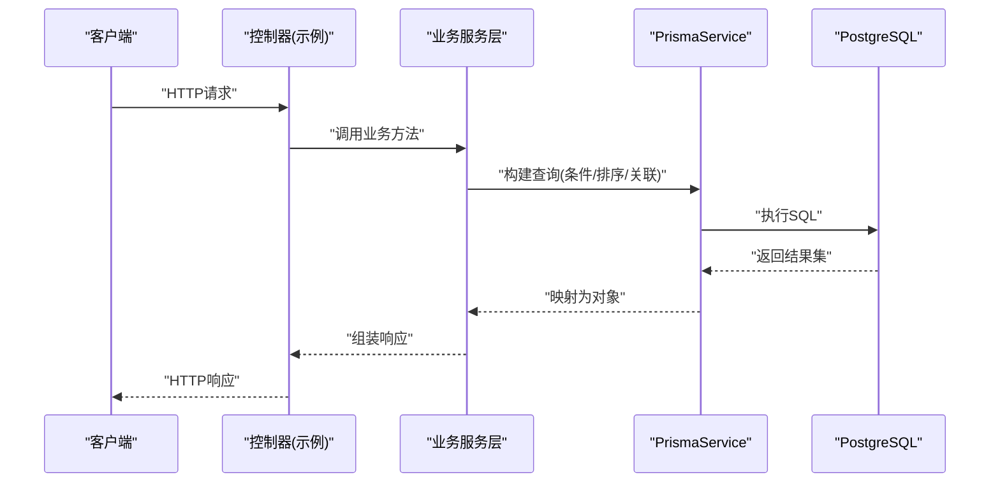
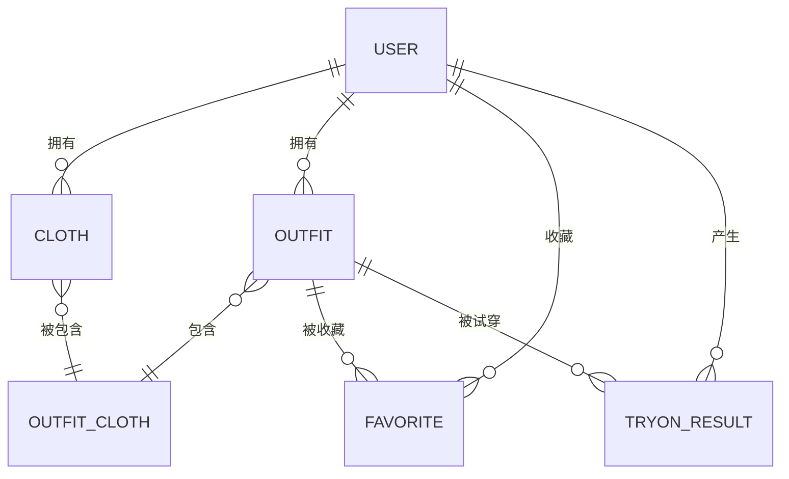
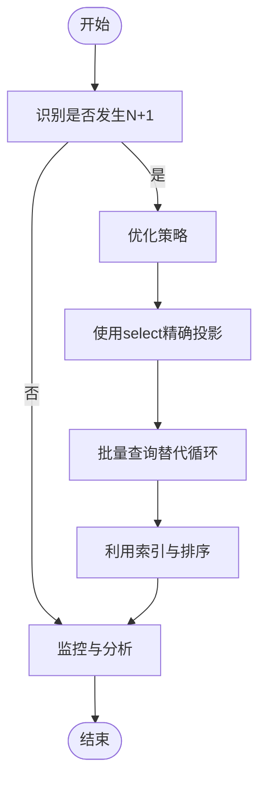
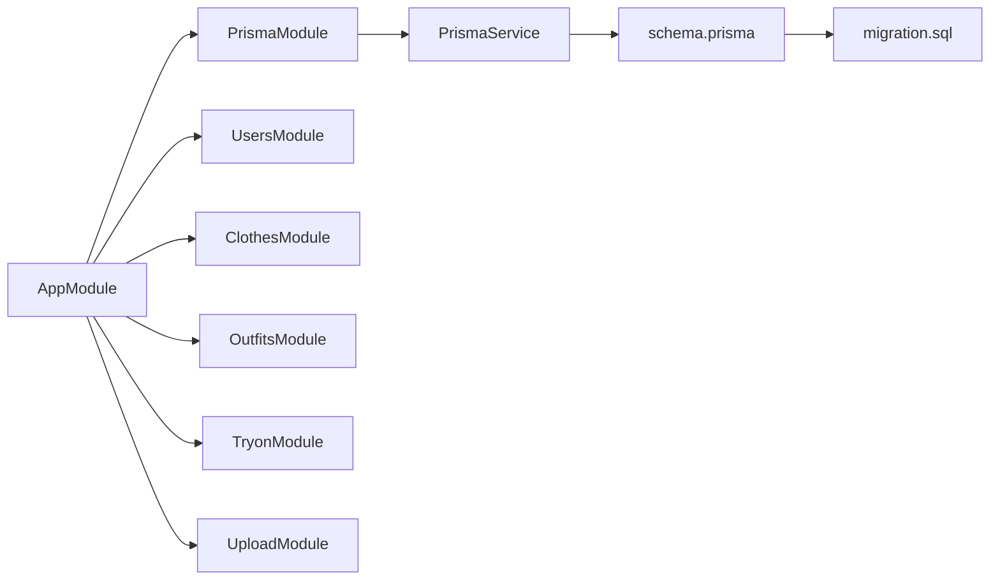

# 数据库性能优化

<cite>
**本文引用的文件**
- [schema.prisma](file://backend/prisma/schema.prisma)
- [migration.sql](file://backend/prisma/migrations/20260507090458_init/migration.sql)
- [prisma.service.ts](file://backend/src/prisma/prisma.service.ts)
- [prisma.module.ts](file://backend/src/prisma/prisma.module.ts)
- [app.module.ts](file://backend/src/app.module.ts)
- [package.json](file://backend/package.json)
- [clothes.service.ts](file://backend/src/modules/clothes/clothes.service.ts)
- [outfits.service.ts](file://backend/src/modules/outfits/outfits.service.ts)
- [users.service.ts](file://backend/src/modules/users/users.service.ts)
</cite>

## 目录
1. [简介](#简介)
2. [项目结构](#项目结构)
3. [核心组件](#核心组件)
4. [架构总览](#架构总览)
5. [详细组件分析](#详细组件分析)
6. [依赖分析](#依赖分析)
7. [性能考虑](#性能考虑)
8. [故障排除指南](#故障排除指南)
9. [结论](#结论)
10. [附录](#附录)

## 简介
本指南面向畅搭(FreeDress)项目的数据库性能优化，聚焦于PostgreSQL与Prisma ORM在实际业务场景中的性能调优策略。内容涵盖表结构与索引设计、查询计划分析与N+1问题解决、连接池配置、数据模型设计权衡、查询监控与慢查询分析、备份恢复策略、数据库分区与分表方案，以及日常维护与清理最佳实践。文档以代码库为依据，结合现有Prisma模型与服务层实现，给出可落地的优化建议。

## 项目结构
后端采用NestJS + Prisma架构，数据库通过Prisma Client连接PostgreSQL。核心文件分布如下：
- Prisma模型与迁移：定义数据模型、索引与外键约束
- Prisma服务与模块：封装连接生命周期管理并作为全局单例提供
- 业务服务层：实现具体查询逻辑，包含关联查询与聚合统计
- 应用模块：装配各功能模块与静态资源服务

**图表来源**
- [app.module.ts:13-31](file://backend/src/app.module.ts#L13-L31)
- [prisma.module.ts:8-13](file://backend/src/prisma/prisma.module.ts#L8-L13)
- [prisma.service.ts:9-26](file://backend/src/prisma/prisma.service.ts#L9-L26)
- [schema.prisma:8-11](file://backend/prisma/schema.prisma#L8-L11)
- [migration.sql:7-121](file://backend/prisma/migrations/20260507090458_init/migration.sql#L7-L121)

**章节来源**
- [app.module.ts:13-31](file://backend/src/app.module.ts#L13-L31)
- [prisma.module.ts:8-13](file://backend/src/prisma/prisma.module.ts#L8-L13)
- [prisma.service.ts:9-26](file://backend/src/prisma/prisma.service.ts#L9-L26)
- [schema.prisma:8-11](file://backend/prisma/schema.prisma#L8-L11)
- [migration.sql:7-121](file://backend/prisma/migrations/20260507090458_init/migration.sql#L7-L121)

## 核心组件
- 数据模型与索引：基于Prisma Schema定义，包含用户、衣物、搭配、收藏、AI试穿结果等模型，并在关键列上建立索引与唯一约束
- 连接管理：PrismaService在模块初始化时建立连接，在销毁时断开，确保生命周期可控
- 业务查询：服务层使用Prisma Client进行关联查询、条件过滤、排序与聚合统计

**章节来源**
- [schema.prisma:14-131](file://backend/prisma/schema.prisma#L14-L131)
- [migration.sql:80-96](file://backend/prisma/migrations/20260507090458_init/migration.sql#L80-L96)
- [prisma.service.ts:14-25](file://backend/src/prisma/prisma.service.ts#L14-L25)
- [clothes.service.ts:38-51](file://backend/src/modules/clothes/clothes.service.ts#L38-L51)
- [outfits.service.ts:35-47](file://backend/src/modules/outfits/outfits.service.ts#L35-L47)
- [users.service.ts:18-44](file://backend/src/modules/users/users.service.ts#L18-L44)

## 架构总览
下图展示从应用到数据库的调用链路，以及关键的查询路径与潜在性能瓶颈：

**图表来源**
- [prisma.service.ts:9-26](file://backend/src/prisma/prisma.service.ts#L9-L26)
- [clothes.service.ts:21-30](file://backend/src/modules/clothes/clothes.service.ts#L21-L30)
- [outfits.service.ts:9-33](file://backend/src/modules/outfits/outfits.service.ts#L9-L33)
- [users.service.ts:18-44](file://backend/src/modules/users/users.service.ts#L18-L44)

## 详细组件分析

### 数据模型与索引策略
- 用户表(users)：主键id；唯一索引phone；支持按手机号登录与去重
- 衣物表(clothes)：主键id；外键userId；索引userId与category；支持按用户与分类检索
- 搭配表(outfits)：主键id；外键userId；索引userId；支持按用户检索搭配
- 收藏表(favorites)：联合主键(userId,outfitId)；支持快速判断收藏状态
- 试穿结果表(tryon_results)：主键id；外键userId与outfitId；索引userId与outfitId；支持按用户与搭配检索

**图表来源**
- [schema.prisma:14-131](file://backend/prisma/schema.prisma#L14-L131)
- [migration.sql:7-121](file://backend/prisma/migrations/20260507090458_init/migration.sql#L7-L121)

**章节来源**
- [schema.prisma:14-131](file://backend/prisma/schema.prisma#L14-L131)
- [migration.sql:80-96](file://backend/prisma/migrations/20260507090458_init/migration.sql#L80-L96)

### 查询优化与N+1问题
- N+1问题识别：服务层存在include关联查询，如衣物详情包含搭配关系、搭配详情包含衣物明细与收藏状态判断
- 解决方案：
  - 使用select精确投影，避免不必要的字段加载
  - 对高频查询使用orderBy与where组合索引
  - 将多次独立查询合并为单次批量查询，减少往返次数
  - 对聚合统计使用groupBy与_count，避免应用侧循环计算

**图表来源**
- [clothes.service.ts:59-81](file://backend/src/modules/clothes/clothes.service.ts#L59-L81)
- [outfits.service.ts:49-73](file://backend/src/modules/outfits/outfits.service.ts#L49-L73)
- [users.service.ts:18-44](file://backend/src/modules/users/users.service.ts#L18-L44)

**章节来源**
- [clothes.service.ts:59-81](file://backend/src/modules/clothes/clothes.service.ts#L59-L81)
- [outfits.service.ts:49-73](file://backend/src/modules/outfits/outfits.service.ts#L49-L73)
- [users.service.ts:18-44](file://backend/src/modules/users/users.service.ts#L18-L44)

### 连接池配置优化
- 当前实现：PrismaService在模块初始化时连接，在销毁时断开，未显式配置连接池参数
- 建议：
  - 在环境变量中设置DATABASE_URL的连接池参数，如max_size、min_size、idle_timeout、max_lifetime
  - 结合应用并发量与数据库承载能力，合理设置最大连接数
  - 配置连接超时与查询超时，避免长事务占用连接

**章节来源**
- [prisma.service.ts:14-25](file://backend/src/prisma/prisma.service.ts#L14-L25)
- [schema.prisma:8-11](file://backend/prisma/schema.prisma#L8-L11)
- [package.json:8-25](file://backend/package.json#L8-L25)

### 数据模型设计权衡
- 字段类型选择：
  - UUID主键：保证分布式一致性与安全性，但索引与存储略增
  - 枚举类型：使用数据库枚举减少存储与校验成本
  - 数组字段：如season与tags，便于灵活扩展，但不利于复杂查询与索引
- 约束设计：
  - 唯一索引phone：保障账号唯一性
  - 外键约束：保证参照完整性，配合级联删除处理级联关系
- 建议：
  - 对数组字段建立GIN索引或拆分为关联表，以支持高效查询
  - 对高基数字符串字段考虑固定长度或规范化存储

**章节来源**
- [schema.prisma:40-58](file://backend/prisma/schema.prisma#L40-L58)
- [migration.sql:29-30](file://backend/prisma/migrations/20260507090458_init/migration.sql#L29-L30)
- [migration.sql:86-87](file://backend/prisma/migrations/20260507090458_init/migration.sql#L86-L87)

### 查询性能监控与分析
- 慢查询日志：
  - 在PostgreSQL中启用log_min_duration_sample与log_line_prefix，记录慢查询
  - 结合pg_stat_statements收集执行计划与耗时统计
- 执行计划优化：
  - 使用EXPLAIN/EXPLAIN ANALYZE分析关键查询
  - 优先使用覆盖索引与选择性高的过滤条件
  - 避免在WHERE中对索引列进行函数操作
- 应用侧指标：
  - 记录Prisma查询耗时与错误率
  - 对高频接口进行压测，定位瓶颈

**章节来源**
- [outfits.service.ts:35-47](file://backend/src/modules/outfits/outfits.service.ts#L35-L47)
- [clothes.service.ts:38-51](file://backend/src/modules/clothes/clothes.service.ts#L38-L51)

### 备份与恢复策略
- 备份：
  - 使用pg_basebackup进行物理备份，定期增量备份
  - 使用pg_dump/pg_restore进行逻辑备份，支持跨版本迁移
- 恢复：
  - 制定RTO/RPO目标，验证恢复流程
  - 对关键表建立快照策略，支持点-in-time恢复
- 性能优化：
  - 备份窗口与并发控制，避免影响生产负载
  - 使用压缩与并行备份提升效率

**章节来源**
- [migration.sql:7-121](file://backend/prisma/migrations/20260507090458_init/migration.sql#L7-L121)

### 分区与分表方案
- 分区：
  - 按时间分区(如outfits、tryon_results)以提升归档与清理效率
  - 使用范围分区或列表分区，结合分区裁剪优化查询
- 分表：
  - 基于用户ID哈希分表，分散热点写入
  - 对历史数据进行冷热分离，热表保持较小规模
- 注意事项：
  - 保持分区键与常用查询条件一致
  - 定期维护分区统计信息，避免查询计划退化

**章节来源**
- [schema.prisma:71-88](file://backend/prisma/schema.prisma#L71-L88)
- [schema.prisma:117-131](file://backend/prisma/schema.prisma#L117-L131)

### 维护与清理最佳实践
- 统计信息更新：定期运行ANALYZE，确保查询优化器获得最新统计
- 索引维护：识别未使用或冗余索引，定期重建B-tree与GIN索引
- 清理策略：对过期数据(如历史试穿结果)制定自动清理规则
- 版本升级：先在测试环境验证，再灰度到生产

**章节来源**
- [migration.sql:80-96](file://backend/prisma/migrations/20260507090458_init/migration.sql#L80-L96)

## 依赖分析
- 模块耦合：业务服务依赖PrismaService，PrismaService由PrismaModule提供，AppModule统一装配
- 外部依赖：PostgreSQL驱动、Prisma Client、NestJS框架
- 风险点：服务层包含深层关联查询，需关注查询计划与N+1问题

**图表来源**
- [app.module.ts:13-31](file://backend/src/app.module.ts#L13-L31)
- [prisma.module.ts:8-13](file://backend/src/prisma/prisma.module.ts#L8-L13)
- [prisma.service.ts:9-26](file://backend/src/prisma/prisma.service.ts#L9-L26)
- [schema.prisma:8-11](file://backend/prisma/schema.prisma#L8-L11)
- [migration.sql:7-121](file://backend/prisma/migrations/20260507090458_init/migration.sql#L7-L121)

**章节来源**
- [app.module.ts:13-31](file://backend/src/app.module.ts#L13-L31)
- [prisma.module.ts:8-13](file://backend/src/prisma/prisma.module.ts#L8-L13)
- [prisma.service.ts:9-26](file://backend/src/prisma/prisma.service.ts#L9-L26)

## 性能考虑
- 索引策略：确保高频过滤与排序列有合适索引；对枚举列与外键列建立索引
- 查询模式：优先使用select投影与where条件，避免全表扫描
- 连接池：根据并发与延迟目标调整连接数与超时参数
- 数据模型：对数组字段考虑拆表或索引策略，平衡灵活性与查询性能
- 监控：结合慢查询日志与执行计划，持续优化热点查询

[本节为通用指导，无需列出具体文件来源]

## 故障排除指南
- 连接问题：检查DATABASE_URL与网络连通性；确认PrismaService生命周期钩子正常
- 查询缓慢：使用EXPLAIN分析执行计划；检查索引使用情况与统计信息
- N+1问题：审查include使用场景，改为批量查询或精确select
- 数据不一致：核对外键约束与级联行为；验证迁移脚本执行结果

**章节来源**
- [prisma.service.ts:14-25](file://backend/src/prisma/prisma.service.ts#L14-L25)
- [outfits.service.ts:49-73](file://backend/src/modules/outfits/outfits.service.ts#L49-L73)
- [clothes.service.ts:59-81](file://backend/src/modules/clothes/clothes.service.ts#L59-L81)

## 结论
通过对FreeDress项目的数据库与ORM实现进行系统性分析，建议从索引优化、查询计划分析、N+1问题治理、连接池配置、数据模型设计与维护策略等方面入手，结合慢查询日志与执行计划持续迭代，逐步提升整体性能与稳定性。

[本节为总结性内容，无需列出具体文件来源]

## 附录
- Prisma命令参考：generate、migrate、studio、seed
- PostgreSQL监控：pg_stat_statements、慢查询日志配置

**章节来源**
- [package.json:21-24](file://backend/package.json#L21-L24)