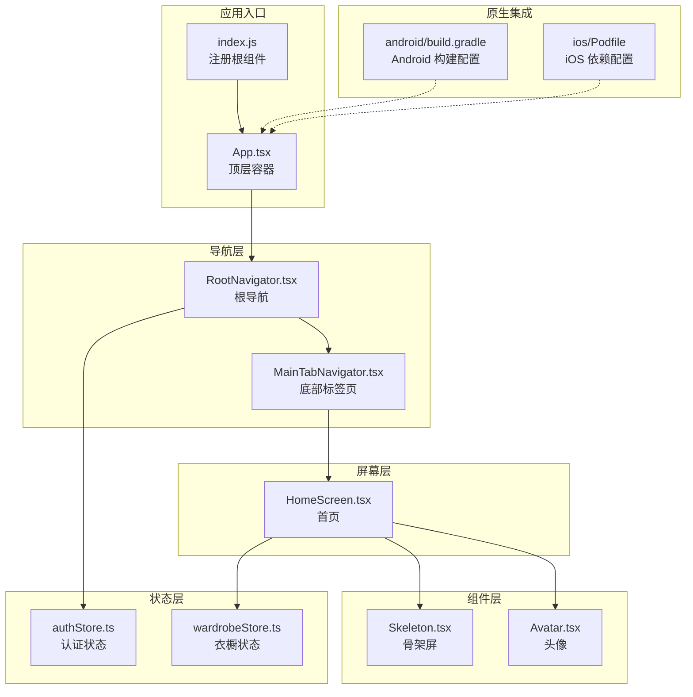
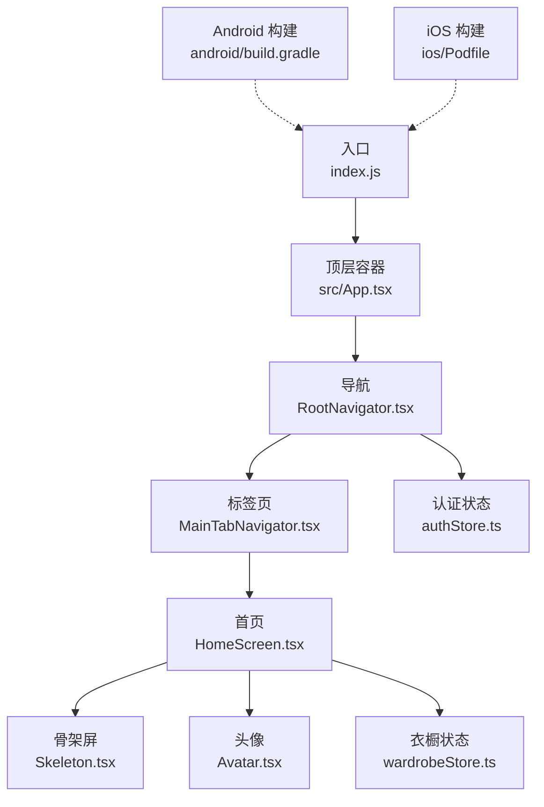
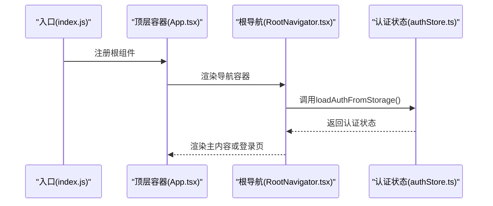
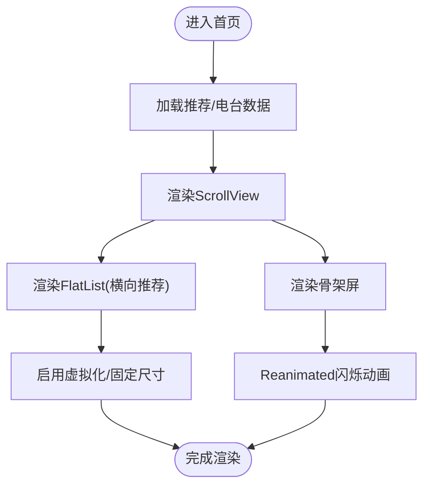
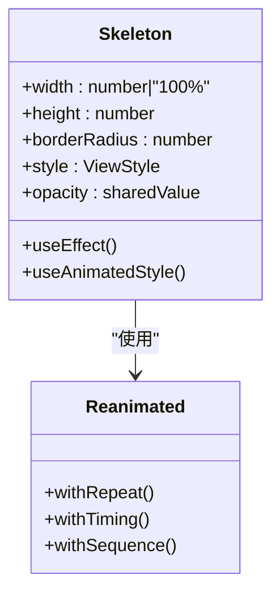
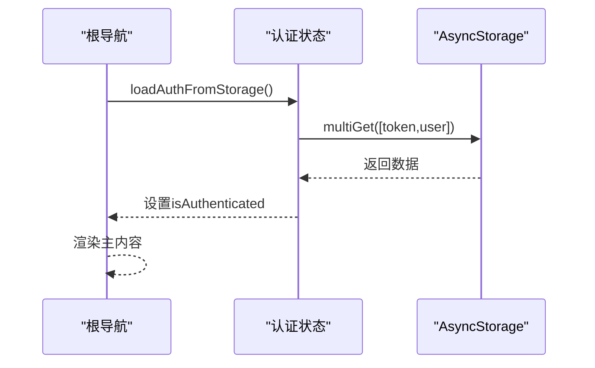
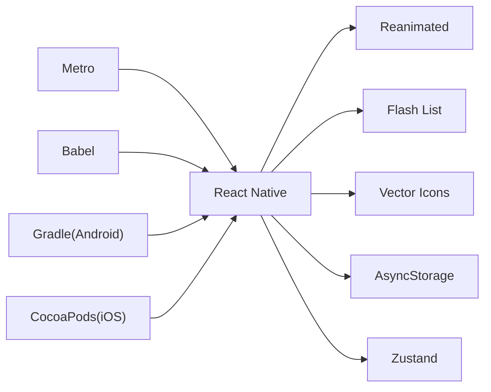

# 移动端性能优化

<cite>
**本文档引用的文件**
- [package.json](file://FreeDressApp/package.json)
- [metro.config.js](file://FreeDressApp/metro.config.js)
- [babel.config.js](file://FreeDressApp/babel.config.js)
- [react-native.config.js](file://FreeDressApp/react-native.config.js)
- [android/build.gradle](file://FreeDressApp/android/build.gradle)
- [ios/Podfile](file://FreeDressApp/ios/Podfile)
- [App.tsx](file://FreeDressApp/App.tsx)
- [index.js](file://FreeDressApp/index.js)
- [src/App.tsx](file://FreeDressApp/src/App.tsx)
- [src/navigation/RootNavigator.tsx](file://FreeDressApp/src/navigation/RootNavigator.tsx)
- [src/navigation/MainTabNavigator.tsx](file://FreeDressApp/src/navigation/MainTabNavigator.tsx)
- [src/screens/HomeScreen.tsx](file://FreeDressApp/src/screens/HomeScreen.tsx)
- [src/components/Skeleton.tsx](file://FreeDressApp/src/components/Skeleton.tsx)
- [src/components/Avatar.tsx](file://FreeDressApp/src/components/Avatar.tsx)
- [src/store/authStore.ts](file://FreeDressApp/src/store/authStore.ts)
- [src/store/wardrobeStore.ts](file://FreeDressApp/src/store/wardrobeStore.ts)
</cite>

## 目录
1. [简介](#简介)
2. [项目结构](#项目结构)
3. [核心组件](#核心组件)
4. [架构总览](#架构总览)
5. [详细组件分析](#详细组件分析)
6. [依赖关系分析](#依赖关系分析)
7. [性能考量](#性能考量)
8. [故障排查指南](#故障排查指南)
9. [结论](#结论)
10. [附录](#附录)

## 简介
本指南面向畅搭(FreeDress)移动端应用的性能优化实践，聚焦于React Native在原生模块使用、JavaScript线程优化、滚动性能、图片处理、内存管理、设备兼容与包体积优化等方面。文档基于当前仓库中的实际实现进行分析，并提供可操作的优化建议与最佳实践。

## 项目结构
FreeDressApp采用标准的React Native项目结构，包含跨平台源码(src)、Android与iOS工程、构建配置与导航体系。关键特性包括：
- 使用Reanimated进行高性能动画
- 使用Flash List提升列表渲染性能
- 使用Zustand进行轻量状态管理
- 使用AsyncStorage进行本地持久化
- 使用React Navigation进行导航

**图表来源**
- [index.js:1-11](file://FreeDressApp/index.js#L1-L11)
- [src/App.tsx:1-28](file://FreeDressApp/src/App.tsx#L1-L28)
- [src/navigation/RootNavigator.tsx:1-95](file://FreeDressApp/src/navigation/RootNavigator.tsx#L1-L95)
- [src/navigation/MainTabNavigator.tsx:1-38](file://FreeDressApp/src/navigation/MainTabNavigator.tsx#L1-L38)
- [src/screens/HomeScreen.tsx:1-606](file://FreeDressApp/src/screens/HomeScreen.tsx#L1-L606)
- [src/components/Skeleton.tsx:1-63](file://FreeDressApp/src/components/Skeleton.tsx#L1-L63)
- [src/components/Avatar.tsx:1-93](file://FreeDressApp/src/components/Avatar.tsx#L1-L93)
- [src/store/authStore.ts:1-123](file://FreeDressApp/src/store/authStore.ts#L1-L123)
- [src/store/wardrobeStore.ts:1-83](file://FreeDressApp/src/store/wardrobeStore.ts#L1-L83)
- [android/build.gradle:1-22](file://FreeDressApp/android/build.gradle#L1-L22)
- [ios/Podfile:1-35](file://FreeDressApp/ios/Podfile#L1-L35)

**章节来源**
- [package.json:1-57](file://FreeDressApp/package.json#L1-L57)
- [metro.config.js:1-12](file://FreeDressApp/metro.config.js#L1-L12)
- [babel.config.js:1-4](file://FreeDressApp/babel.config.js#L1-L4)
- [react-native.config.js:1-3](file://FreeDressApp/react-native.config.js#L1-L3)
- [android/build.gradle:1-22](file://FreeDressApp/android/build.gradle#L1-L22)
- [ios/Podfile:1-35](file://FreeDressApp/ios/Podfile#L1-L35)

## 核心组件
- 导航与主题：根导航器负责根据认证状态切换主内容或登录流程，并设置统一的主题色彩；底部标签页承载主要功能区域。
- 屏幕与列表：首页使用ScrollView承载多模块内容，横向推荐使用FlatList以提升滚动性能；骨架屏组件通过Reanimated实现轻量闪烁效果。
- 状态管理：认证状态与衣橱数据通过Zustand集中管理，配合AsyncStorage进行持久化读写。
- 原生集成：Android最小SDK版本为24，iOS通过Podfile配置React Native依赖与安装流程。

**章节来源**
- [src/navigation/RootNavigator.tsx:1-95](file://FreeDressApp/src/navigation/RootNavigator.tsx#L1-L95)
- [src/navigation/MainTabNavigator.tsx:1-38](file://FreeDressApp/src/navigation/MainTabNavigator.tsx#L1-L38)
- [src/screens/HomeScreen.tsx:1-606](file://FreeDressApp/src/screens/HomeScreen.tsx#L1-L606)
- [src/components/Skeleton.tsx:1-63](file://FreeDressApp/src/components/Skeleton.tsx#L1-L63)
- [src/store/authStore.ts:1-123](file://FreeDressApp/src/store/authStore.ts#L1-L123)
- [src/store/wardrobeStore.ts:1-83](file://FreeDressApp/src/store/wardrobeStore.ts#L1-L83)

## 架构总览
应用采用“入口 -> 导航 -> 屏幕/组件 -> 状态/原生”的分层架构。导航层负责页面切换与主题注入；屏幕层承载业务内容与交互；组件层提供可复用UI与动画；状态层管理认证与业务数据；原生层提供构建与运行时环境。

**图表来源**
- [index.js:1-11](file://FreeDressApp/index.js#L1-L11)
- [src/App.tsx:1-28](file://FreeDressApp/src/App.tsx#L1-L28)
- [src/navigation/RootNavigator.tsx:1-95](file://FreeDressApp/src/navigation/RootNavigator.tsx#L1-L95)
- [src/navigation/MainTabNavigator.tsx:1-38](file://FreeDressApp/src/navigation/MainTabNavigator.tsx#L1-L38)
- [src/screens/HomeScreen.tsx:1-606](file://FreeDressApp/src/screens/HomeScreen.tsx#L1-L606)
- [src/components/Skeleton.tsx:1-63](file://FreeDressApp/src/components/Skeleton.tsx#L1-L63)
- [src/components/Avatar.tsx:1-93](file://FreeDressApp/src/components/Avatar.tsx#L1-L93)
- [src/store/authStore.ts:1-123](file://FreeDressApp/src/store/authStore.ts#L1-L123)
- [src/store/wardrobeStore.ts:1-83](file://FreeDressApp/src/store/wardrobeStore.ts#L1-L83)
- [android/build.gradle:1-22](file://FreeDressApp/android/build.gradle#L1-L22)
- [ios/Podfile:1-35](file://FreeDressApp/ios/Podfile#L1-L35)

## 详细组件分析

### 导航与主题优化
- 根导航器在启动时异步加载认证状态，避免阻塞首屏渲染；通过主题覆盖统一颜色体系，减少重复样式计算。
- 底部标签页关闭默认header，降低层级深度与重绘成本。

**图表来源**
- [index.js:1-11](file://FreeDressApp/index.js#L1-L11)
- [src/App.tsx:1-28](file://FreeDressApp/src/App.tsx#L1-L28)
- [src/navigation/RootNavigator.tsx:1-95](file://FreeDressApp/src/navigation/RootNavigator.tsx#L1-L95)
- [src/store/authStore.ts:1-123](file://FreeDressApp/src/store/authStore.ts#L1-L123)

**章节来源**
- [src/navigation/RootNavigator.tsx:1-95](file://FreeDressApp/src/navigation/RootNavigator.tsx#L1-L95)
- [src/store/authStore.ts:1-123](file://FreeDressApp/src/store/authStore.ts#L1-L123)

### 首页滚动与列表优化
- 首页使用ScrollView承载多个模块，其中横向推荐使用FlatList以提升滚动性能；骨架屏通过Reanimated实现轻量闪烁，避免复杂布局抖动。
- 建议：对长列表启用虚拟化、固定项宽高、避免深层嵌套样式与频繁重排。

**图表来源**
- [src/screens/HomeScreen.tsx:1-606](file://FreeDressApp/src/screens/HomeScreen.tsx#L1-L606)
- [src/components/Skeleton.tsx:1-63](file://FreeDressApp/src/components/Skeleton.tsx#L1-L63)

**章节来源**
- [src/screens/HomeScreen.tsx:1-606](file://FreeDressApp/src/screens/HomeScreen.tsx#L1-L606)
- [src/components/Skeleton.tsx:1-63](file://FreeDressApp/src/components/Skeleton.tsx#L1-L63)

### 动画与工作线程优化
- Reanimated用于执行动画逻辑，将计算移至工作线程，避免阻塞JS主线程；骨架屏使用withRepeat与withSequence实现循环动画。
- 建议：尽量使用Reanimated替代LayoutAnimation；避免在动画中频繁创建新对象；合理设置动画时长与缓动函数。

**图表来源**
- [src/components/Skeleton.tsx:1-63](file://FreeDressApp/src/components/Skeleton.tsx#L1-L63)

**章节来源**
- [src/components/Skeleton.tsx:1-63](file://FreeDressApp/src/components/Skeleton.tsx#L1-L63)

### 状态管理与本地存储
- 认证状态与衣橱数据通过Zustand集中管理，配合AsyncStorage进行持久化；加载时批量读取/写入，减少IO次数。
- 建议：对频繁更新的状态拆分模块；对大对象序列化前做瘦身；避免在渲染路径直接访问大量数据。

**图表来源**
- [src/navigation/RootNavigator.tsx:1-95](file://FreeDressApp/src/navigation/RootNavigator.tsx#L1-L95)
- [src/store/authStore.ts:1-123](file://FreeDressApp/src/store/authStore.ts#L1-L123)

**章节来源**
- [src/store/authStore.ts:1-123](file://FreeDressApp/src/store/authStore.ts#L1-L123)
- [src/store/wardrobeStore.ts:1-83](file://FreeDressApp/src/store/wardrobeStore.ts#L1-L83)

### 原生模块与构建配置
- Android最小SDK版本为24，compile/target SDK为36；iOS通过Podfile自动配置React Native依赖与安装脚本。
- 建议：保持原生依赖版本与RN版本匹配；按需引入原生模块，避免无用依赖导致包体增大。

**章节来源**
- [android/build.gradle:1-22](file://FreeDressApp/android/build.gradle#L1-L22)
- [ios/Podfile:1-35](file://FreeDressApp/ios/Podfile#L1-L35)

## 依赖关系分析
- 运行时依赖：React、React Native、Reanimated、Flash List、Vector Icons、AsyncStorage、Zustand等。
- 构建依赖：Metro、Babel、React Native CLI、Gradle、CocoaPods。
- 关键耦合点：导航与状态管理的耦合度较低，便于独立优化；组件与动画依赖Reanimated，需注意版本一致性。

**图表来源**
- [package.json:1-57](file://FreeDressApp/package.json#L1-L57)
- [metro.config.js:1-12](file://FreeDressApp/metro.config.js#L1-L12)
- [babel.config.js:1-4](file://FreeDressApp/babel.config.js#L1-L4)
- [android/build.gradle:1-22](file://FreeDressApp/android/build.gradle#L1-L22)
- [ios/Podfile:1-35](file://FreeDressApp/ios/Podfile#L1-L35)

**章节来源**
- [package.json:1-57](file://FreeDressApp/package.json#L1-L57)

## 性能考量

### JavaScript线程优化
- 使用Reanimated执行动画，避免JS线程阻塞；将计算与布局迁移至原生线程。
- 合理拆分组件，避免不必要的重渲染；使用稳定的数据结构与浅比较策略。

### 滚动性能优化
- 首页横向推荐使用Flash List；固定项尺寸、启用虚拟化、避免深层嵌套样式。
- 骨架屏使用轻量动画，减少布局抖动；对长列表采用分页加载与占位图。

### 图片处理与压缩
- 头像组件支持网络图片与回退文本；建议在服务端提供多尺寸资源，客户端按需请求。
- 对于静态图标与矢量图形，优先使用SVG以减小体积并提升缩放质量。

### 内存泄漏预防与检测
- 避免在组件卸载后仍持有对DOM或原生对象的引用；及时清理定时器与订阅。
- 对于需要弱引用的场景，可考虑使用WeakRef（如可用）以辅助垃圾回收。

### 设备兼容性优化
- Android：最小SDK 24，针对低版本设备优化动画与字体回退；避免使用高版本API。
- iOS：通过Podfile统一依赖版本，确保编译与链接稳定性。

### 包体积优化
- 代码分割：按路由拆分Bundle，延迟加载非首屏模块。
- 资源压缩：移除未使用资源、合并重复资源、启用压缩与Tree Shaking。
- 原生依赖精简：仅保留必要模块，定期审计第三方库。

## 故障排查指南
- 启动白屏或黑屏：检查根导航器的加载逻辑与主题配置；确认AsyncStorage读取是否阻塞。
- 滚动卡顿：检查FlatList的keyExtractor与renderItem是否高效；避免在渲染函数中创建新对象。
- 动画掉帧：确认Reanimated版本与RN版本匹配；减少动画层级与复杂度。
- 内存占用过高：使用性能分析工具定位泄漏点；避免闭包持有大对象。

**章节来源**
- [src/navigation/RootNavigator.tsx:1-95](file://FreeDressApp/src/navigation/RootNavigator.tsx#L1-L95)
- [src/screens/HomeScreen.tsx:1-606](file://FreeDressApp/src/screens/HomeScreen.tsx#L1-L606)
- [src/components/Skeleton.tsx:1-63](file://FreeDressApp/src/components/Skeleton.tsx#L1-L63)

## 结论
通过在导航、状态、动画、列表与原生集成等方面的系统性优化，结合合理的包体积与兼容性策略，可以显著提升畅搭移动端应用的性能与用户体验。建议持续关注RN生态演进，定期评估与迭代优化方案。

## 附录
- 构建与打包：Metro默认配置已满足基础需求，可根据需要扩展插件与优化规则。
- 开发工具：配合Flipper、React DevTools与性能面板进行调试与分析。

**章节来源**
- [metro.config.js:1-12](file://FreeDressApp/metro.config.js#L1-L12)
- [babel.config.js:1-4](file://FreeDressApp/babel.config.js#L1-L4)
- [react-native.config.js:1-3](file://FreeDressApp/react-native.config.js#L1-L3)